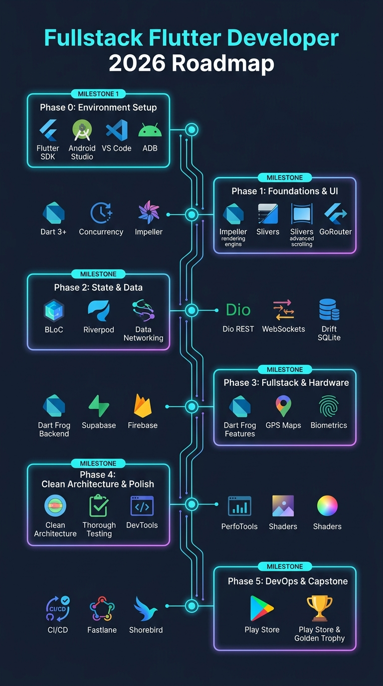

# Fullstack Mobile Developer dengan Flutter™ SDK (2026 Edition)

Selamat datang di repositori pembelajaran resmi **Fullstack Mobile Developer** berbahasa Indonesia!

Repositori ini adalah kurikulum terstruktur, komprehensif, dan berorientasi produksi nyata. Anda akan dibimbing mulai dari **instalasi alat kerja**, **logika pemrograman Dart 3+ & Multithreading**, **pembuatan antarmuka Flutter modern (Impeller & Slivers)**, **state management standar industri (BLoC & Riverpod)**, **integrasi backend & database (REST, Supabase, Firebase, Drift)**, hingga **DevOps, CI/CD, dan publikasi ke Google Play Store & Apple App Store**.

---

  

---

## 🧭 Panduan Cara Belajar Efektif

Agar Anda mendapatkan hasil belajar maksimal, ikuti 4 aturan emas berikut:

1. **Belajar Berurutan (Sequential)**:  
   Materi dirancang bertingkat. Selesaikan **[Modul 00](modul-00-persiapan/README.md)** terlebih dahulu hingga `flutter doctor -v` centang hijau sebelum masuk ke **[Modul 01](modul-01-dart-dan-concurrency/README.md)**.
2. **Ketik Kode Sendiri (*Hands-on Coding*)**:  
   Jangan hanya membaca kode atau *copy-paste*. Mengetik kode secara manual melatih *muscle memory* dan pemahaman sintaksis.
3. **Selesaikan Deliverable & Mini Project**:  
   Setiap modul dilengkapi target proyek nyata (*deliverable*). Pastikan proyek mini tersebut berhasil berjalan di HP/emulator Anda.
4. **Gunakan Dokumen Silabus untuk Peta Besar**:  
   Buka **[SILABUS.md](SILABUS.md)** untuk melihat rincian kompetensi, subtopik mendalam, dan estimasi jam belajar.

---

## 🛠️ Alat yang Harus Dibuka di Setiap Langkah

Jangan menebak di mana Anda harus mengetik perintah. Gunakan panduan berikut:

| Langkah | Alat yang Dibuka | Fungsi Utama |
|---|---|---|
| **1. Menulis Kode** | **Visual Studio Code** | Menulis kode Dart/Flutter, melihat linter, refactor widget (`Ctrl + .`). |
| **2. Menjalankan Perintah** | **Terminal VS Code (`Ctrl + J`)** | Menjalankan `flutter run`, `flutter pub get`, `dart run`, dan perintah `git`. |
| **3. Menguji Tampilan & Sensor** | **Emulator AVD / HP Fisik Android** | Melihat aplikasi sungguhan, menguji GPS, kamera, dan Hot Reload. |
| **4. Uji Coba Cepat Dart** | **DartPad ([dartpad.dev](https://dartpad.dev))** | Eksperimen cepat sintaks Dart tanpa perlu build project. |

---

## 📚 Daftar Lengkap Modul Pembelajaran

Klik tautan modul di bawah untuk langsung membuka panduan materi:

| No | Modul & Tautan | Topik Inti | Target Deliverable / Proyek Mini | Status |
|:---:|---|---|---|:---:|
| **00** | **[Modul 00: Persiapan Alat & Lingkungan](modul-00-persiapan/README.md)** | Flutter SDK, Android Studio, JDK 17/21, AVD, VS Code | `flutter doctor -v` All Passed + App Pertama | ✅ **Selesai** |
| **01** | **[Modul 01: Dart 3+, OOP, & Concurrency](modul-01-dart-dan-concurrency/README.md)** | Null Safety, Records, Pattern Matching, Sealed Class, Isolates | CLI Multithread JSON & Image Parser | ✅ **Selesai** |
| **02** | **[Modul 02: Flutter UI & Slivers System](modul-02-ui-dan-slivers/README.md)** | Impeller Engine, 3 Trees, CustomScrollView, Material 3 | Spotify/Netflix Collapsing Sliver Feed | ✅ **Selesai** |
| **03** | **[Modul 03: Routing (go_router) & Form System](modul-03-routing-dan-form/README.md)** | go_router, ShellRoute, Deep Linking, Custom Formatters | Multi-Step Checkout & Onboarding App | ✅ **Selesai** |
| **04** | **[Modul 04: State Management (Provider, Riverpod, BLoC)](modul-04-state-management/README.md)** | ChangeNotifier, Riverpod 2+, BLoC/Cubit, HydratedBloc | E-Commerce Cart & Multi-Filter Engine | ✅ **Selesai** |
| **05** | **[Modul 05: Networking, REST (Dio) & WebSockets](modul-05-networking-dan-api/README.md)** | Dio Interceptors, Silent Token Refresh, Freezed, WebSockets | Realtime Crypto Ticker & Live Chat App | ✅ **Selesai** |
| **06** | **[Modul 06: Data Lokal, Offline-First & Drift](modul-06-data-lokal-dan-offline/README.md)** | Secure Storage, Drift ORM (SQL), Hive, Sync Queue | Offline-First Task Manager with Sync Queue | ✅ **Selesai** |
| **07** | **[Modul 07: Backend (Dart Frog, Supabase, Firebase)](modul-07-backend-dan-baas/README.md)** | Backend API Dart Frog, Supabase Postgres RLS, Firebase | Fullstack Microservice & BaaS Dashboard | ✅ **Selesai** |
| **08** | **[Modul 08: Hardware, GPS Maps, & Background Tasks](modul-08-hardware-dan-sensor/README.md)** | Kamera, Geolocator, Google Maps, Biometrik, WorkManager | Attendance App (Geofencing & Selfie) | ✅ **Selesai** |
| **09** | **[Modul 09: Native Platform Channels & Dart FFI](modul-09-platform-channels-dan-ffi/README.md)** | MethodChannel (Kotlin/Swift), Pigeon Type-Safe, FFI | Native Hardware Inspector Plugin | ✅ **Selesai** |
| **10** | **[Modul 10: Clean Architecture & Monorepo Melos](modul-10-clean-architecture/README.md)** | SOLID, Clean Architecture 3-Layers, DI (get_it), Melos | Enterprise Fintech Architecture Skeleton | ✅ **Selesai** |
| **11** | **[Modul 11: i18n Multi-Bahasa & Aksesibilitas (a11y)](modul-11-i18n-dan-a11y/README.md)** | ARB files, Rupiah/Tanggal intl, Semantics Screen Reader | Multi-Lingual Booking App with a11y | ✅ **Selesai** |
| **12** | **[Modul 12: Animasi Lanjutan, Shaders, & CustomPainter](modul-12-animasi-dan-shaders/README.md)** | Explicit Animations, Hero, GLSL Shaders, Lottie, Rive | Interactive Analytics Dashboard & Charts | ✅ **Selesai** |
| **13** | **[Modul 13: Testing Komprehensif & DevTools Profiling](modul-13-testing-dan-profiling/README.md)** | Unit/Widget/Integration Testing, Golden Tests, Profiler | Test Suite (Coverage > 85%) & Benchmark | ✅ **Selesai** |
| **14** | **[Modul 14: Keamanan, UU PDP, & Crash Reporting](modul-14-keamanan-dan-monitoring/README.md)** | Obfuscation, SSL Pinning, UU PDP & GDPR, Sentry Logging | Hardened Secure Banking App Shell | ✅ **Selesai** |
| **15** | **[Modul 15: CI/CD, Fastlane, Shorebird OTA, & Rilis](modul-15-ci-cd-dan-rilis/README.md)** | GitHub Actions, Fastlane, Shorebird CodePush, Store Release | Automated Release Pipeline to Play Store | ✅ **Selesai** |
| **🏆** | **[Proyek Akhir: Capstone Project Fullstack](capstone-project/README.md)** | End-to-End Enterprise Fullstack Mobile Architecture | Quick-Commerce SuperApp / POS Kasir Utuh | ⏳ *Sedang Dikerjakan* |

---

### 📑 Modul Lampiran Spesialisasi Tambahan (Appendices):

* 💳 **[Lampiran A: Payment Gateway (Midtrans, Xendit, Stripe)](lampiran/l1-payment-gateway/README.md)** — Integrasi pembayaran QRIS, Virtual Account, & Kartu Kredit.
* 💎 **[Lampiran B: In-App Purchase & Subscriptions (RevenueCat)](lampiran/l2-in-app-purchase/README.md)** — Monetisasi produk digital, langganan bulanan/tahunan, dan paywall.
* 📹 **[Lampiran C: Audio/Video Streaming & WebRTC](lampiran/l3-webrtc-streaming/README.md)** — Custom video player, background audio service, dan video call realtime.
* 🖨️ **[Lampiran D: Bluetooth Low Energy & Thermal Printer](lampiran/l4-bluetooth-ble/README.md)** — Koneksi BLE dan cetak struk kasir thermal ESC/POS.
* 🤖 **[Lampiran E: On-Device AI & Google Gemini LLM SDK](lampiran/l5-ondevice-ai-gemini/README.md)** — Fitur AI cerdas dan analisis foto kamera langsung di Flutter.

---

## ⚡ Prasyarat & Kebutuhan Perangkat

1. **Laptop / Komputer**:
   - Windows 10/11 64-bit, macOS, atau Linux.
   - RAM minimal 8 GB (disarankan 16 GB).
   - Penyimpanan SSD dengan ruang kosong minimal 25 GB.
2. **Smartphone Android / iPhone**:
   - Kabel USB data untuk menghubungkan HP ke laptop (opsional bisa via Wireless Wi-Fi ADB).
3. **Koneksi Internet**: Diperlukan untuk unduhan SDK dan dependensi awal.

---

## 💡 Menemukan Error / Bug?

Jika saat mempraktikkan kode Anda menemui error merah:
1. Baca pesan error di baris paling atas terminal.
2. Periksa bagian **Jebakan Umum (*Common Pitfalls*)** pada modul yang bersangkutan.
3. Jalankan `flutter clean` lalu `flutter pub get` untuk menyegarkan dependensi.

---

  <b>Selamat Belajar & Berkarya Menjadi Fullstack Mobile Engineer! 🚀</b> 
  <i>Dokumen Silabus Lengkap: <a href="SILABUS.md">SILABUS.md</a></i>

