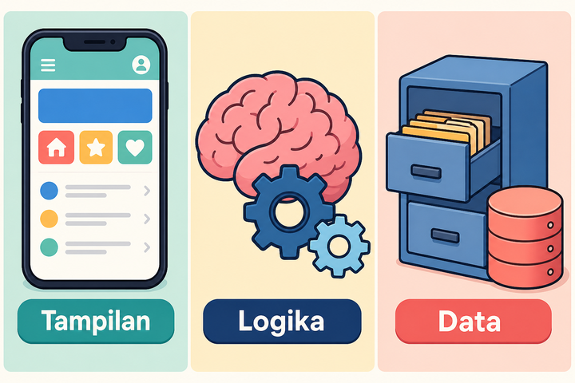

# Fullstack Mobile Developer dengan Flutter™ SDK

Materi berbahasa Indonesia. Nanti Anda bisa merancang, membangun, dan menerbitkan aplikasi mobile yang punya **tampilan (frontend)** dan **layanan data (backend)**.

Flutter and the related logo are trademarks of Google LLC. Materi ini tidak didukung Google secara resmi, dan tidak terafiliasi dengan Google LLC. Panduan merek: [docs.flutter.dev/brand](https://docs.flutter.dev/brand).

---

## Buka alat ini dulu

Jangan langsung tempel perintah. Tiap perintah punya **alat yang harus dibuka dulu**. Ikuti tabel ini:

| Langkah | Yang dibuka |
| --- | --- |
| 1 | **Browser** — [DartPad](https://dartpad.dev) untuk coba sintaks, tanpa instalasi |
| 2 | **Visual Studio Code** — menulis kode, buka terminal, unduh Flutter SDK |
| 3 | **Terminal di VS Code** (`Ctrl + J`) — menjalankan `flutter`, `dart`, `git` |
| 4 | **Emulator Android** atau **HP Android** — melihat aplikasi sungguhan |

> **Aturan emas:** kalau materi menulis perintah `flutter ...`, buka **Terminal VS Code**, bukan kolom pencarian Windows, dan bukan DartPad.

Alur lengkapnya ada di [Modul 00 — Persiapan](modul-00-persiapan/README.md).

---

## Apa yang Anda bangun

Aplikasi mobile biasanya punya tiga lapisan:

1. **Tampilan** — tombol, daftar, formulir; yang disentuh orang
2. **Logika** — aturan aplikasi, ditulis dalam bahasa Dart
3. **Data** — tersimpan di HP, di Firebase, atau di API HTTP

*Ilustrasi asli materi mobile2026. Penjelasannya di daftar di atas, bukan di dalam gambar, supaya tetap kebaca di GitHub.*

---

## Isi repo

| File / folder | Isi |
| --- | --- |
| [SILABUS.md](SILABUS.md) | Peta 12 modul wajib + lampiran |
| [modul-00-persiapan](modul-00-persiapan/README.md) | Instalasi, alat, Git, proyek pertama |
| [modul-01-dart](modul-01-dart/README.md) | Bahasa Dart, diuji di DartPad |
| [modul-02-ui](modul-02-ui/README.md) | Widget, layout, overflow, ListView.builder |
| [modul-03-interaksi](modul-03-interaksi/README.md) | Form, dialog, Navigator, go_router |
| [modul-04-state](modul-04-state/README.md) | setState, Provider, FutureBuilder |
| [modul-05-data-lokal](modul-05-data-lokal/README.md) | SharedPreferences, file, SQLite, offline |
| [modul-06-firebase](modul-06-firebase/README.md) | Firestore, rules, Storage, listener realtime |
| [modul-07-rest](modul-07-rest/README.md) | HTTP, JSON, `dio`, tanda pengenal, dapur mini + deploy |
| [modul-08-fitur](modul-08-fitur/README.md) | Login, verifikasi, izin HP, foto, notifikasi |
| [modul-09-kualitas](modul-09-kualitas/README.md) | UX, Rupiah/`intl`, tes, UU PDP |
| [modul-10-rilis](modul-10-rilis/README.md) | Ikon, keystore, App Bundle, Play Console |
| [modul-11-capstone](modul-11-capstone/README.md) | Satu produk utuh: auth, data, demo |
| [lampiran/l1-lokasi-peta](lampiran/l1-lokasi-peta/README.md) | GPS, izin lokasi, satu titik di peta |
| [lampiran/l2-pembayaran](lampiran/l2-pembayaran/README.md) | Gerbang bayar, jangan simpan nomor kartu |
| [lampiran/l3-supabase](lampiran/l3-supabase/README.md) | Alternatif Firebase: tabel Postgres, login, gembok baris |
| [lampiran/l4-crashlytics](lampiran/l4-crashlytics/README.md) | Tahu app rusak di HP orang, tanpa kirim nama/email |
| [lampiran/l5-actions](lampiran/l5-actions/README.md) | `flutter analyze` otomatis saat push, tanpa unggah Play |
| [lampiran/l6-share](lampiran/l6-share/README.md) | Kirim lembar, buka tautan, `wa.me` tanpa nomor orang sungguhan |
| [lampiran/l7-update](lampiran/l7-update/README.md) | Palang versi lama, angka min di papan, buka etalase Play |
| lampiran L8–L9 | Menyusul sesuai silabus |
| [docs/SUMBER-GAMBAR.md](docs/SUMBER-GAMBAR.md) | Sumber gambar dan merek |

Status penulisan ada di [SILABUS.md](SILABUS.md#status-penulisan).

---

## Cara belajar

1. Baca silabus sekali, jangan dihafal.
2. Kerjakan modul **berurutan**. Selesaikan Modul 00 dulu, baru yang lain.
3. Tiap modul: analogi → langkah → kode → kesalahan yang sering terjadi → latihan → kuis.
4. Coba kode di alat yang disebutkan. Jangan tebak hasilnya.
5. Kalau muncul error merah, baca dari atas. Salin teks error-nya, jangan cuma tangkapan layar, saat minta bantuan.

Jalur wajib kira-kira **14–18 minggu**, sekitar 8–10 jam per minggu. Lebih lambat tidak apa-apa. Yang penting urut.

---

## Perangkat yang dibutuhkan

Materi ini ditulis untuk **Windows**. Dari Windows, Anda bisa membangun aplikasi **Android**. Untuk iOS perlu Mac. Konsep iOS tetap dijelaskan, tapi praktik rilisnya ke Google Play Store.

Yang perlu disiapkan:

- Windows 10 atau 11, 64-bit
- RAM 8 GB (16 GB lebih nyaman saat emulator menyala)
- Ruang kosong sekitar 15 GB (Flutter SDK + Android SDK + emulator)
- Koneksi internet untuk unduhan pertama
- (Disarankan) HP Android + kabel USB

---

## Tautan resmi yang sering dipakai

- Instalasi Flutter SDK: [docs.flutter.dev/install](https://docs.flutter.dev/install)
- Instalasi lewat VS Code: [docs.flutter.dev/install/with-vs-code](https://docs.flutter.dev/install/with-vs-code)
- Penyiapan Android: [docs.flutter.dev/platform-integration/android/setup](https://docs.flutter.dev/platform-integration/android/setup)
- DartPad: [dartpad.dev](https://dartpad.dev)
- Dokumentasi Dart: [dart.dev/language](https://dart.dev/language)

---

## Lisensi materi

Teks di repo ini bebas dipakai untuk belajar. Nama dan logo Flutter adalah merek dagang Google LLC. Gambar di folder `images/` karya asli repo ini, kecuali disebut lain di [docs/SUMBER-GAMBAR.md](docs/SUMBER-GAMBAR.md).
