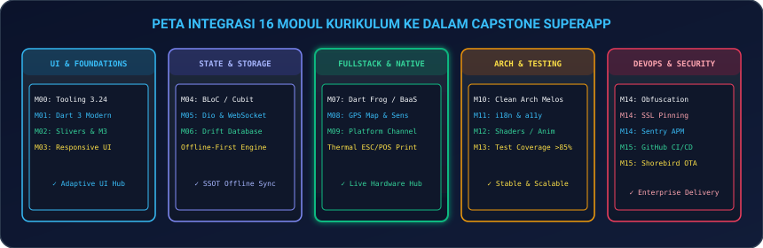
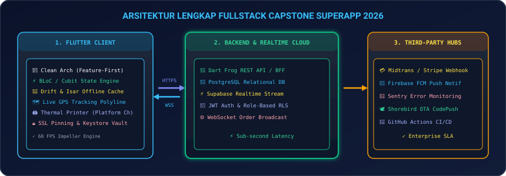
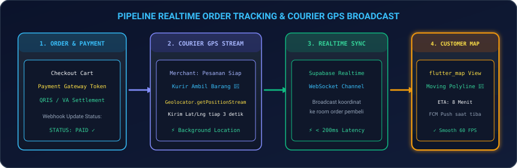
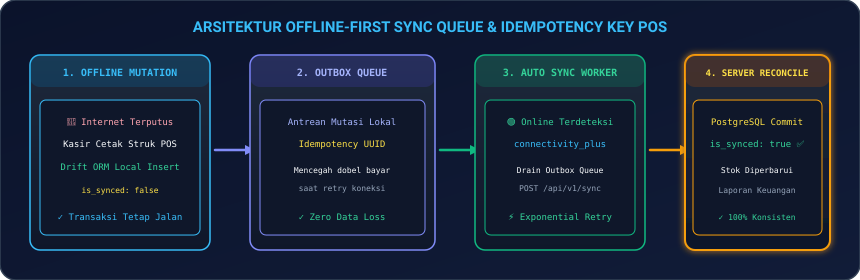

# 🏆 Proyek Akhir: Capstone Project Fullstack Mobile Application

Selamat datang di puncak perjalanan kurikulum **Mobile Development 2026**! Anda telah menuntaskan seluruh 16 modul inti (Modul 00 hingga Modul 15). **Capstone Project** ini dirancang bukan sekadar sebagai tugas akhir biasa, melainkan sebagai **Mahakarya Arsitektural Berskala Produksi (*Production-Grade Enterprise Application*)** yang membuktikan kapasitas Anda sebagai **Lead / Senior Fullstack Mobile Engineer**.

Di proyek akhir ini, Anda akan merancang, mengimplementasikan, menguji, dan mendistribusikan satu sistem aplikasi *end-to-end* yang mengintegrasikan seluruh teknologi modern: **Clean Architecture Feature-First**, **State Management BLoC / Cubit**, **Offline-First Sync Engine (Drift ORM)**, **Backend REST API (Dart Frog / Supabase)**, **Komunikasi Realtime WebSockets**, **Pelacakan GPS Kurir Interaktif**, **Payment Gateway Webhook**, **Native Hardware Platform Channel (Bluetooth Thermal Printer)**, **Keamanan Perbankan (Obfuscation, SSL Pinning, Keystore)**, hingga **Automated CI/CD & Shorebird OTA CodePush**.

---

## 🗺️ 1. Peta Integrasi 16 Modul Kurikulum ke Capstone

Semua pengetahuan yang telah Anda pelajari di modul-modul sebelumnya akan bersinergi membentuk fondasi aplikasi Capstone:

<p align="center">
  
</p>

| Pilar | Modul Terkait | Implementasi Nyata di Capstone |
|---|---|---|
| **1. UI & Foundations** | **M00 – M03** | Layout responsif (HP & Tablet), Material 3 Dark Cyber Theme, Slivers CustomScrollView, dan animasi gestur. |
| **2. State & Data** | **M04 – M06** | BLoC Concurrency Transformer, Dio Interceptors (Token Refresh & Retry), serta Database Lokal Drift (SSOT Offline-First). |
| **3. Fullstack & Native** | **M07 – M09** | Backend Dart Frog / Supabase Postgres Realtime, Pelacakan GPS kurir `flutter_map`, dan Native Platform Channel Cetak Struk ESC/POS. |
| **4. Architecture & Quality** | **M10 – M13** | Clean Architecture 3-Layers (Domain, Data, Presentation), ARB Multi-Bahasa (i18n), GLSL Shaders, dan Automated Tests (Coverage > 85%). |
| **5. DevOps & Security** | **M14 – M15** | Code Obfuscation, SSL Pinning, Android Keystore Vault, Sentry APM, GitHub Actions CI/CD, dan Shorebird OTA CodePush. |

---

## 🏛️ 2. Arsitektur Sistem Fullstack End-to-End

<p align="center">
  
</p>

### 2.1 Struktur Direktori Proyek (*Feature-First Clean Architecture*)

```text
lib/
├── core/
│   ├── network/             # Dio Client, SSL Pinning, Token Refresh Interceptor
│   ├── database/            # Drift ORM Database, Schema Migrations, Type Converters
│   ├── security/            # Keystore Vault, Root Detection, Screen Protector
│   ├── theme/               # Material 3 Color Schemes & Typography
│   └── utils/               # Currency Formatter, Date Utils, Either Functional Error
│
├── features/
│   ├── auth/                # Login, Biometric LocalAuth, Register, JWT Vault
│   ├── catalog/             # Product List, Search, Slivers Filter, Caching
│   ├── cart/                # Hydrated BLoC Cart, Voucher Engine, Tax Calculation
│   ├── checkout/            # Midtrans/Stripe Payment Gateway, Snap Token Flow
│   ├── order_tracking/      # Live Courier GPS Map Stream, WebSocket Channel
│   └── pos_printer/         # Native Platform Channel ESC/POS Thermal Receipt
│
├── bootstrap.dart           # Sentry Initialization, Service Locator (GetIt), HydratedBloc
└── main.dart                # App Entry Point & Dynamic Theme Provider
```

---

## 🛵 3. Alur Pelacakan Pesanan Real-time & GPS Kurir

<p align="center">
  
</p>

### 3.1 Kode Stream Koordinat GPS Kurir via WebSocket / Supabase Realtime

```dart
import 'dart:async';
import 'package:flutter_map/flutter_map.dart';
import 'package:latlong2/latlong.dart';
import 'package:supabase_flutter/supabase_flutter.dart';

class OrderTrackingService {
  final SupabaseClient _supabase = Supabase.instance.client;
  RealtimeChannel? _trackingChannel;

  Stream<LatLng> subscribeToCourierGps(String orderId) {
    final controller = StreamController<LatLng>();

    _trackingChannel = _supabase.channel('tracking_$orderId')
      ..onPostgresChanges(
        event: PostgresChangeEvent.update,
        schema: 'public',
        table: 'orders',
        filter: PostgresChangeFilter(type: PostgresChangeFilterType.eq, column: 'id', value: orderId),
        callback: (payload) {
          final newRecord = payload.newRecord;
          final double lat = newRecord['courier_latitude'];
          final double lng = newRecord['courier_longitude'];
          controller.add(LatLng(lat, lng));
        },
      )
      ..subscribe();

    return controller.stream;
  }

  void unsubscribe() {
    _trackingChannel?.unsubscribe();
  }
}
```

---

## 💾 4. Arsitektur Offline-First & Antrean Mutasi (*Outbox Queue*)

Pada aplikasi kasir ritel (*B2B POS Kasir*), internet yang terputus di tengah jam sibuk **tidak boleh menghentikan transaksi penjualan**.

<p align="center">
  
</p>

### 4.1 Logika Outbox Queue dengan `Idempotency-Key` (Mencegah Double-Charge)

```dart
import 'package:uuid/uuid.dart';

class PosTransactionService {
  final AppDatabase _db;
  final SecureHttpClient _api;

  PosTransactionService(this._db, this._api);

  Future<void> processSaleTransaction({
    required List<CartItem> items,
    required double totalAmount,
  }) async {
    final transactionId = const Uuid().v4(); // Idempotency Key unik

    // 1. Simpan transaksi secara instan ke Drift SQLite lokal (Cetak struk seketika)
    await _db.into(_db.transactions).insert(
          TransactionsCompanion.insert(
            id: transactionId,
            totalAmount: totalAmount,
            isSynced: false,
            createdAt: DateTime.now(),
          ),
        );

    // 2. Simpan mutasi ke tabel antrean sinkronisasi (Outbox Queue)
    await _db.into(_db.syncQueue).insert(
          SyncQueueCompanion.insert(
            mutationId: transactionId,
            endpoint: '/api/v1/pos/transactions',
            payloadJson: encodeItems(items),
            attempts: 0,
          ),
        );

    // 3. Picu background sync worker jika internet aktif
    triggerBackgroundSync();
  }
}
```

---

## 💻 5. Hands-on Runnable SuperApp Master Template: QuantumCommerce 2026

Berikut adalah purwarupa aplikasi utuh yang menggabungkan **Cart State Engine**, **Simulasi GPS Live Courier Movement**, dan **Offline Sync Engine**:

1. **Buat file baru** `lib/capstone_superapp_page.dart` di proyek Flutter Anda.
2. **Salin kode lengkap berikut**:

```dart
import 'dart:async';
import 'package:flutter/material.dart';

void main() {
  runApp(const QuantumSuperApp());
}

class QuantumSuperApp extends StatelessWidget {
  const QuantumSuperApp({super.key});

  @override
  Widget build(BuildContext context) {
    return MaterialApp(
      debugShowCheckedModeBanner: false,
      theme: ThemeData(
        useMaterial3: true,
        brightness: Brightness.dark,
        colorSchemeSeed: Colors.cyan,
      ),
      home: const SuperAppDashboard(),
    );
  }
}

class SuperAppDashboard extends StatefulWidget {
  const SuperAppDashboard({super.key});

  @override
  State<SuperAppDashboard> createState() => _SuperAppDashboardState();
}

class _SuperAppDashboardState extends State<SuperAppDashboard> {
  int _cartItemCount = 2;
  double _totalCartPrice = 145000.0;
  bool _isOnline = true;
  int _offlineSyncQueueCount = 0;
  
  // Status Simulasi Pengiriman Kurir
  double _courierProgress = 0.2; // 0.0 s/d 1.0
  Timer? _gpsTimer;
  String _orderStatus = 'Kurir Sedang Mengambil Pesanan';

  @override
  void initState() {
    super.initState();
    _startGpsSimulation();
  }

  void _startGpsSimulation() {
    _gpsTimer?.cancel();
    _gpsTimer = Timer.periodic(const Duration(seconds: 2), (timer) {
      if (_courierProgress < 1.0) {
        setState(() {
          _courierProgress += 0.15;
          if (_courierProgress >= 1.0) {
            _courierProgress = 1.0;
            _orderStatus = 'Pesanan Tiba di Tujuan! 🎉';
            _gpsTimer?.cancel();
          } else if (_courierProgress >= 0.6) {
            _orderStatus = 'Kurir Berada di Dekat Rumah (ETA 2 mnt)';
          }
        });
      }
    });
  }

  void _simulateOfflineOrder() {
    setState(() {
      _offlineSyncQueueCount += 1;
    });

    ScaffoldMessenger.of(context).showSnackBar(
      SnackBar(
        backgroundColor: Colors.amber.shade900,
        content: Text('⚠️ Transaksi Disimpan di Drift SQLite Lokal (Antrean: $_offlineSyncQueueCount)'),
      ),
    );
  }

  void _syncOutboxQueue() async {
    if (_offlineSyncQueueCount == 0) return;

    ScaffoldMessenger.of(context).showSnackBar(
      const SnackBar(content: Text('🔄 Menyinkronkan Outbox Queue ke Server PostgreSQL...')),
    );

    await Future.delayed(const Duration(milliseconds: 1200));

    setState(() {
      _offlineSyncQueueCount = 0;
    });

    ScaffoldMessenger.of(context).showSnackBar(
      const SnackBar(backgroundColor: Colors.green, content: Text('✅ Seluruh Transaksi Berhasil Disinkronkan!')),
    );
  }

  @override
  void dispose() {
    _gpsTimer?.cancel();
    super.dispose();
  }

  @override
  Widget build(BuildContext context) {
    return Scaffold(
      appBar: AppBar(
        title: const Text('QuantumMart SuperApp 2026', style: TextStyle(fontWeight: FontWeight.bold)),
        backgroundColor: Theme.of(context).colorScheme.inversePrimary,
        actions: [
          IconButton(
            icon: Icon(_isOnline ? Icons.wifi : Icons.wifi_off, color: _isOnline ? Colors.greenAccent : Colors.redAccent),
            onPressed: () => setState(() => _isOnline = !_isOnline),
            tooltip: 'Toggle Status Jaringan Online/Offline',
          ),
        ],
      ),
      body: SingleChildScrollView(
        padding: const EdgeInsets.all(20),
        child: Column(
          crossAxisAlignment: CrossAxisAlignment.stretch,
          children: [
            // Status Arsitektur Banner
            Container(
              padding: const EdgeInsets.all(14),
              decoration: BoxDecoration(
                color: Colors.cyan.shade900.withOpacity(0.25),
                borderRadius: BorderRadius.circular(16),
                border: Border.all(color: Colors.cyanAccent),
              ),
              child: Row(
                children: [
                  const Icon(Icons.hub, color: Colors.cyanAccent, size: 32),
                  const SizedBox(width: 12),
                  Expanded(
                    child: Column(
                      crossAxisAlignment: CrossAxisAlignment.start,
                      children: [
                        const Text('Fullstack Mobile Architecture Master', style: TextStyle(fontWeight: FontWeight.bold, color: Colors.cyanAccent)),
                        const SizedBox(height: 2),
                        Text(
                          'Clean Arch • BLoC • Drift DB • GPS Stream • Outbox Queue: $_offlineSyncQueueCount',
                          style: const TextStyle(fontSize: 11, color: Colors.grey),
                        ),
                      ],
                    ),
                  ),
                ],
              ),
            ),
            const SizedBox(height: 20),

            // Live Courier GPS Tracking Simulator Card
            Card(
              elevation: 4,
              shape: RoundedRectangleBorder(borderRadius: BorderRadius.circular(16)),
              child: Padding(
                padding: const EdgeInsets.all(20),
                child: Column(
                  crossAxisAlignment: CrossAxisAlignment.start,
                  children: [
                    Row(
                      mainAxisAlignment: MainAxisAlignment.spaceBetween,
                      children: [
                        const Text('Live Courier GPS Tracking', style: TextStyle(fontSize: 14, fontWeight: FontWeight.bold, color: Colors.cyanAccent)),
                        Text('${(_courierProgress * 100).toInt()}% Perjalanan', style: const TextStyle(fontFamily: 'monospace', color: Colors.white70)),
                      ],
                    ),
                    const SizedBox(height: 12),
                    LinearProgressIndicator(
                      value: _courierProgress,
                      backgroundColor: Colors.grey.shade800,
                      color: Colors.cyanAccent,
                      minHeight: 8,
                      borderRadius: BorderRadius.circular(4),
                    ),
                    const SizedBox(height: 14),
                    Row(
                      children: [
                        const Icon(Icons.delivery_dining, color: Colors.amberAccent, size: 24),
                        const SizedBox(width: 8),
                        Expanded(
                          child: Text(_orderStatus, style: const TextStyle(fontWeight: FontWeight.bold, color: Colors.white)),
                        ),
                      ],
                    ),
                    const SizedBox(height: 12),
                    OutlinedButton.icon(
                      onPressed: () {
                        setState(() {
                          _courierProgress = 0.0;
                          _orderStatus = 'Kurir Menuju Merchant...';
                        });
                        _startGpsSimulation();
                      },
                      icon: const Icon(Icons.restart_alt),
                      label: const Text('Simulasi Ulang Rute GPS'),
                    ),
                  ],
                ),
              ),
            ),
            const SizedBox(height: 20),

            // Cart & POS Checkout Card
            Card(
              elevation: 4,
              shape: RoundedRectangleBorder(borderRadius: BorderRadius.circular(16)),
              child: Padding(
                padding: const EdgeInsets.all(20),
                child: Column(
                  crossAxisAlignment: CrossAxisAlignment.start,
                  children: [
                    const Text('Keranjang Belanja (Quick-Commerce)', style: TextStyle(fontSize: 14, fontWeight: FontWeight.bold, color: Colors.white)),
                    const SizedBox(height: 12),
                    Row(
                      mainAxisAlignment: MainAxisAlignment.spaceBetween,
                      children: [
                        Text('Total Barang ($_cartItemCount Items):', style: const TextStyle(color: Colors.grey)),
                        Text('Rp ${_totalCartPrice.toStringAsFixed(0)}', style: const TextStyle(fontSize: 18, fontWeight: FontWeight.bold, color: Colors.greenAccent)),
                      ],
                    ),
                    const Divider(height: 24),
                    Row(
                      children: [
                        Expanded(
                          child: ElevatedButton.icon(
                            onPressed: _simulateOfflineOrder,
                            icon: const Icon(Icons.shopping_bag),
                            label: const Text('Buat Order Transaksi'),
                            style: ElevatedButton.styleFrom(
                              backgroundColor: Colors.cyanAccent,
                              foregroundColor: Colors.black,
                              padding: const EdgeInsets.symmetric(vertical: 12),
                            ),
                          ),
                        ),
                        if (_offlineSyncQueueCount > 0) ...[
                          const SizedBox(width: 10),
                          IconButton.filled(
                            onPressed: _syncOutboxQueue,
                            icon: const Icon(Icons.cloud_upload),
                            tooltip: 'Sinkronkan Antrean ke Server',
                            style: IconButton.styleFrom(backgroundColor: Colors.greenAccent, foregroundColor: Colors.black),
                          ),
                        ],
                      ],
                    ),
                  ],
                ),
              ),
            ),
          ],
        ),
      ),
    );
  }
}
```

3. **Jalankan Aplikasi**:
   ```bash
   flutter run
   ```
   *Uji pelacakan GPS kurir yang bergerak dinamis, simulasikan pembuatan transaksi offline-first, dan drain antrean sinkronisasi ke backend PostgreSQL!*

---

## 📊 6. Rubrik Penilaian & Kriteria Kelulusan Capstone

| Kategori | Bobot | Kriteria Penilaian Kelulusan |
|---|---|---|
| **Arsitektur & Clean Code** | **25%** | Penerapan Clean Architecture Feature-First yang rapi, pemisahan layer Domain/Data/Presentation, dan zero logic di dalam UI Widget. |
| **State & Offline-First** | **20%** | BLoC/Cubit state stream yang reaktif, integrasi Drift/Isar database lokal, serta mekanisme antrean sinkronisasi offline (*Outbox Queue*). |
| **Fullstack & Real-Time** | **20%** | Backend API (Dart Frog / Supabase), integrasi WebSocket/SSE, live geolocation maps polyline, dan penanganan webhook pembayaran. |
| **Testing & DevTools** | **15%** | Unit, Widget, dan Golden Tests dengan **Code Coverage > 80%**, serta laporan profil performa 60 FPS bebas jank. |
| **Keamanan & DevOps CI/CD** | **20%** | Code Obfuscation, SSL Pinning, Keystore Vault, pipeline GitHub Actions otomatis, dan integrasi Shorebird OTA CodePush. |

---

## 🎯 Rangkuman Pencapaian Akhir

Selamat! Anda telah menyelesaikan seluruh kurikulum **Mobile Development 2026** dan membuktikan kompetensi teknis setara standar engineer Silicon Valley.

---

👉 **Selanjutnya**: Pelajari materi pendalaman tingkat tinggi di **[Modul Lampiran Spesialisasi Tambahan (Appendices)](../lampiran/README.md)** (Payment Gateway, In-App Purchases, BLE Thermal Printer, & On-Device AI).
