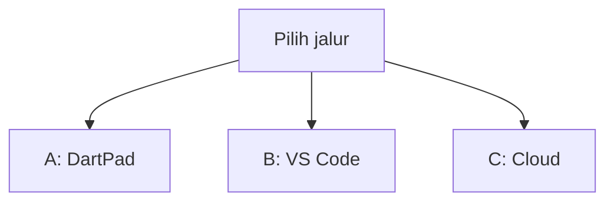
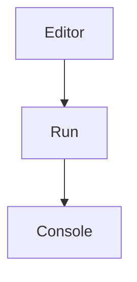
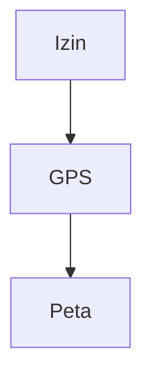
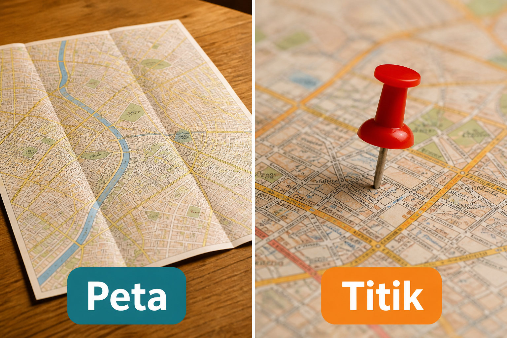
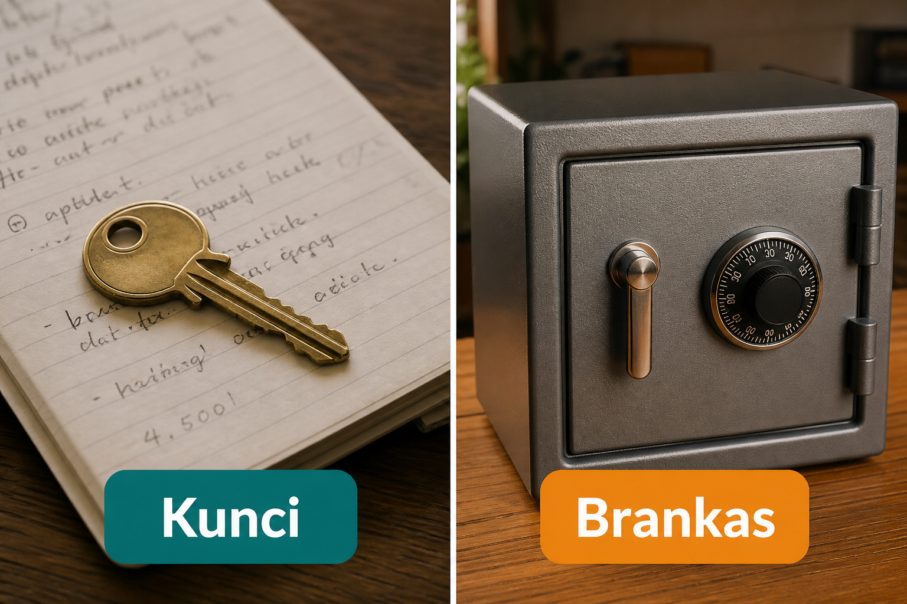
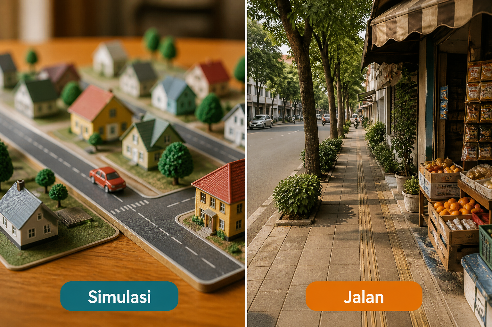
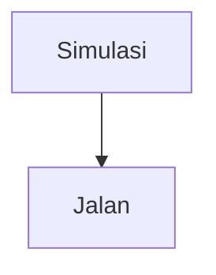

# Lampiran L1 — Lokasi & peta

**Waktu:** 1–2 sesi  
**Prasyarat:** Modul 08 (pernah minta izin kamera) dan Modul 02 (`Stack` / peta sebagai widget berukuran pasti).  
**Hasil:** Nanti Anda bisa minta izin lokasi, membaca lintang–bujur, dan menampilkan **satu titik** di peta — tanpa menaruh kunci Maps di `lib/`.

Ini **lampiran**, bukan syarat lulus jalur wajib (Modul 00–11). Buka kalau app Anda butuh “orang ini di mana.”

---

## Buka alat ini dulu

Plugin GPS dan peta **tidak** ada di [daftar paket DartPad](https://github.com/dart-lang/dart-pad/wiki/Package-and-plugin-support). DartPad hanya untuk membaca angka koordinat.

| Jalur | Buka | Untuk apa |
| --- | --- | --- |
| A | Browser → [dartpad.dev](https://dartpad.dev) → mode **Dart** | Membaca lintang dan bujur sebagai angka |
| B | VS Code + Terminal (`Ctrl + J`) + emulator/HP | Izin, GPS, widget peta |
| C | Browser → [Google Cloud Console](https://console.cloud.google.com) | kunci Maps SDK for Android |



Letak tombol di DartPad (bukan sketsa):




Sumber gambar: [dart.dev/tools/dartpad](https://dart.dev/tools/dartpad), Dart team / Google ([CC BY 4.0](https://creativecommons.org/licenses/by/4.0/)). Foto resmi itu **tema gelap** dan **mode Dart**. Kalau kelihatan seperti kotak hitam, gulir sampai editor kiri dan tombol **Run** terlihat; itu bukan gambar rusak. Mode **Dart** pas untuk uji 1. `GoogleMap` **tidak** diuji di sini.

### Dua jenis kode di halaman ini

| Jenis | Tanda | Caranya |
| --- | --- | --- |
| **Berkas lengkap** | Ada `void main()` | Tempel utuh, lalu **Run** (alat yang disebut di kotak uji) |
| **Cuplikan** | Hanya potongan | Jangan di-Run sendirian |

### Pola uji A — DartPad Dart

| | |
| --- | --- |
| **Buka** | [dartpad.dev](https://dartpad.dev) |
| **Pilih** | mode **Dart** |
| **Tempel** | **berkas lengkap** |
| **Klik** | **Run** |
| **Kalau berhasil** | Console menulis lintang dan bujur, bukan error merah |

### Pola uji B — proyek lokal

| | |
| --- | --- |
| **Buka** | VS Code di folder proyek Flutter, emulator atau HP sudah menyala |
| **Terminal** | `Ctrl + J` |
| **Ketik** | perintah di mini proyek, di folder proyek |
| **Kalau berhasil** | dialog izin muncul; angka koordinat kelihatan; peta menampilkan satu pin |

> **Aturan emas:** perintah `flutter ...` hanya di **Terminal VS Code**. DartPad tidak membaca GPS sungguhan. Jangan commit kunci Maps ke GitHub.

Praktik: **Windows → Android**. iOS: `NSLocationWhenInUseUsageDescription` di Info.plist (konsep). Membangun iOS butuh Mac.

---

## 1. Ketuk dulu, baru kompas

Sama dengan kamera di Modul 08: jangan ambil lokasi diam-diam.


*Ilustrasi asli materi mobile2026. Izin = ketuk pintu dulu. GPS = kompas yang baru boleh dipakai setelah pintu dibuka.*



Di Android, izin tertulis di `AndroidManifest.xml` **dan** diminta saat app jalan. Manifest tanpa dialog = Play bisa menolak, atau HP menolak diam-diam.

Untuk “titik saat app terbuka,” cukup lokasi **saat dipakai** (`ACCESS_FINE_LOCATION` / kasar). Jangan pasang lokasi latar belakang kecuali Anda benar-benar melacak di belakang layar — itu syarat Play dan Data safety yang lebih berat (Modul 10).

Sumber izin runtime: [geolocator](https://pub.dev/packages/geolocator), [permission_handler](https://pub.dev/packages/permission_handler) (Modul 08). Pilih **satu** jalur minta izin, jangan dua dialog bertumpuk.

---

## 2. Titik = dua angka, bukan gambar peta

Peta di layar adalah hiasan. Yang app simpan: **lintang** dan **bujur** (dua angka pecahan).



*Ilustrasi asli materi mobile2026. Peta = kertas yang dibentang. Titik = satu paku. Mini proyek hari ini: satu paku, bukan rute ojek.*

### Uji 1 — baca dua angka di DartPad

| | |
| --- | --- |
| **Buka** | [dartpad.dev](https://dartpad.dev) |
| **Pilih** | mode **Dart** |
| **Tempel** | berkas lengkap di bawah |
| **Klik** | **Run** |
| **Kalau berhasil** | Console menulis `Lintang: -6.1754` dan `Bujur: 106.8272` |

```dart
void main() {
  const lintang = -6.1754;
  const bujur = 106.8272;
  print('Lintang: $lintang');
  print('Bujur: $bujur');
  print('Itu Monas, kira-kira — contoh, bukan GPS HP Anda.');
}
```

Di HP, angka itu datang dari `Geolocator.getCurrentPosition()` (jalur B). Jangan menghafal Monas sebagai “lokasi saya.”

Cuplikan (jalur B) — **jangan** di-Run di DartPad:

```dart
// Cuplikan. Setelah izin diberikan:
final posisi = await Geolocator.getCurrentPosition();
debugPrint('${posisi.latitude}, ${posisi.longitude}');
```

Sumber: [geolocator](https://pub.dev/packages/geolocator).

Kalau GPS dimatikan: tampilkan wajah **gagal** + tombol buka pengaturan, bukan layar putih (Modul 09).

---

## 3. Widget peta butuh ukuran pasti

[`google_maps_flutter`](https://pub.dev/packages/google_maps_flutter) menggambar peta asli di Android/iOS. **Tidak** jalan di DartPad.

Widget peta harus di dalam kotak yang **punya tinggi** (`SizedBox`, `Expanded` di `Column`). Kalau ditaruh di `Column` tanpa batas, Flutter melempar error overflow (tinggi tidak terbatas).

Cuplikan (jalur B):

```dart
// Cuplikan. Ganti LatLng dengan posisi orang, setelah izin.
GoogleMap(
  initialCameraPosition: CameraPosition(
    target: LatLng(lintang, bujur),
    zoom: 15,
  ),
  markers: {
    Marker(
      markerId: const MarkerId('saya'),
      position: LatLng(lintang, bujur),
    ),
  },
  myLocationEnabled: false,
)
```

`myLocationEnabled: true` memunculkan titik biru bawaan SDK — tetap butuh izin. Untuk mini proyek, **satu `Marker`** sudah cukup, lebih mudah dijelaskan.

Jangan menjiplak contoh resmi yang memakai danau di California kalau titik Anda di Indonesia — ganti `LatLng` ke hasil GPS, atau ke uji 1 sebagai cadangan kalau GPS gagal.

---

## 4. Kunci Maps: di brankas, bukan di `lib/`



*Ilustrasi asli materi mobile2026. Kunci = kunci API yang kelihatan di kode. Brankas = nilai di mesin Anda / Console, tidak di GitHub.*

Peta Google butuh kunci dari [Google Maps Platform](https://cloud.google.com/maps-platform/). Aktifkan **Maps SDK for Android**. Ada kuota dan tagihan — cek harga resmi, jangan kira “selamanya gratis.”

Di Android, kunci biasanya masuk `AndroidManifest.xml` sebagai `com.google.android.geo.API_KEY`. Pola resmi: [google_maps_flutter](https://pub.dev/packages/google_maps_flutter) dan README Android-nya.

Jangan tempel kunci di `main.dart`. Jangan commit `AndroidManifest` yang berisi kunci sungguhan ke repo **publik**. Flutter sudah mengabaikan `android/local.properties`; banyak orang menaruh rujukan kunci di situ. Kalau ragu, batasi kunci di Cloud Console: hanya paket `applicationId` Anda.

Ini **bukan** nasihat keuangan. Kunci bocor = tagihan orang lain.

---

## 5. Emulator bukan jalanan



*Ilustrasi asli materi mobile2026. Simulasi = kota mainan di meja (emulator). Jalan = HP di luar ruangan. Angka GPS emulator bisa Anda atur; di jalan, orang berjalan.*

Di emulator Android, lokasi diatur lewat **Extended controls** (panel tambahan emulator — bukan sketsa di materi ini). Sumber: [Emulator extended controls](https://developer.android.com/studio/run/emulator-extended-controls).



Uji dulu di emulator (titik Monas dari uji 1, atau titik yang Anda ketik). Lalu sekali di HP sungguhan, di luar kalau sinyal GPS di dalam gedung lemah.

Jangan unggah tangkapan peta orang lain sebagai “lokasi saya.”

---

## 6. Privasi: lokasi itu data orang

Lokasi lebih sensitif daripada nama toko. Play **Data safety** (Modul 10): centang lokasi hanya jika kode memang memintanya. Kebijakan privasi harus menyebut GPS.

Jangan kirim lintang–bujur ke Firestore “supaya keren” tanpa tujuan jelas. Kalau dikirim: rules + hapus akun (Modul 06, 10, 11).

UU PDP sudah disinggung di Modul 09. Lampiran ini tidak menambah nasihat hukum.

---

## Mini proyek lampiran ini

Satu layar: tombol “Ambil lokasi” → izin → angka → peta dengan **satu** pin. Urutan jangan terbalik.

1. Paket, di folder proyek:

| | |
| --- | --- |
| **Buka** | Terminal VS Code di folder proyek Flutter |
| **Ketik** | perintah di bawah |

```text
flutter pub add geolocator google_maps_flutter
```

**Kalau berhasil:** kedua nama ada di `pubspec.yaml`.

2. `AndroidManifest.xml`: `ACCESS_FINE_LOCATION` (dan kasar kalau perlu). **Bukan** lokasi latar belakang.
3. Cloud Console: kunci Maps SDK for Android. Masukkan ke Manifest / `local.properties` — **bukan** `lib/`. Batasi ke `applicationId` Anda.
4. Layar: teks penjelasan **sebelum** dialog izin (Modul 08).
5. `Geolocator.isLocationServiceEnabled` + `checkPermission` / `requestPermission` + `getCurrentPosition`.
6. `GoogleMap` + satu `Marker`. `SafeArea` (Modul 02).
7. Wajah: tunggu / gagal (izin ditolak, GPS mati) / ada titik.

| | |
| --- | --- |
| **Buka** | VS Code, emulator atau HP menyala |
| **Terminal** | `Ctrl + J` |
| **Ketik** | perintah di bawah |

```text
flutter run
```

**Kalau berhasil:** setelah Izinkan, peta menampilkan pin di sekitar Anda (atau di titik emulator yang Anda atur). Kunci Maps **tidak** ada di GitHub.

Bonus: simpan titik terakhir di `flutter_secure_storage` hanya jika perlu — koordinat bukan kunci masuk, tapi tetap data orang. SharedPreferences boleh untuk “terakhir dilihat,” asal tidak dicampur sandi.

---

## Kesalahan yang sering terjadi

| Gejala | Penyebab yang sering | Perbaikan |
| --- | --- | --- |
| Peta abu-abu / logo Google saja | kunci salah, SDK belum diaktifkan, batasan paket terlalu ketat | Console + SHA-1 + `applicationId` |
| `GoogleMap` crash overflow | tidak ada tinggi | `Expanded` / `SizedBox` |
| Dialog izin tidak muncul | lupa Manifest, atau diminta dua plugin | satu jalur izin; Manifest + runtime |
| Angka `0, 0` di laut | GPS belum siap / emulator tanpa titik | atur lokasi emulator; tunggu |
| Izin ditolak selamanya | orang tekan Jangan tanya lagi | `openAppSettings`, jangan paksa |
| Kunci di GitHub | tempel di `main.dart` | brankas; anggap bocor; ganti kunci |
| Play Data safety | centang lokasi padahal tidak dipakai | jujur, atau hapus kode GPS |
| DartPad `import geolocator` | plugin tidak ada di DartPad | jalur B |

---

## Latihan

1. (DartPad) Ganti uji 1 ke koordinat kota Anda (cari di peta web, tempel angkanya).
2. (Jalur B) Tolak izin sekali — pastikan teks gagal, bukan layar putih.
3. (Jalur B) Matikan lokasi di HP, nyalakan lagi, tekan tombol ulang.
4. (Jalur B) `git grep` kunci Maps — tidak boleh di `lib/`.
5. (Bonus) Jarak kasar dua titik: `Geolocator.distanceBetween` (jalur B), tampilkan meter.

---

## Kuis singkat

1. Kenapa `GoogleMap` tidak diuji di DartPad?
2. Izin di Manifest saja, tanpa dialog saat app jalan — cukup?
3. Apakah kunci Maps boleh ditulis di `lib/main.dart`?
4. Lokasi latar belakang wajib untuk pin “saya di sini”?
5. Peta abu-abu selalu berarti kode Dart salah?

Kunci jawaban di bawah. Coba jawab dulu.

---

## Apa yang belum dibahas

- Rute, directions, geocoding alamat lengkap
- Peta Mapbox / OSM sebagai alternatif
- Pelacakan di belakang layar, geofence
- Lampiran L2 pembayaran, L8 biometrik, L9 QR

---

## Kunci kuis

1. Plugin peta tidak ada di DartPad; butuh HP/emulator + kunci.
2. Tidak. Android minta runtime. Manifest + dialog.
3. Tidak. Brankas / Manifest lokal / batasan paket di Console.
4. Tidak. Cukup saat app dipakai.
5. Tidak. Sering kunci, tagihan, atau SDK belum diaktifkan.

---

## Sumber gambar dan tautan

| Aset | Sumber |
| --- | --- |
| `images/analogi-izin-gps.png` | Ilustrasi asli materi mobile2026 |
| `images/analogi-peta-titik.png` | Ilustrasi asli materi mobile2026 |
| `images/analogi-simulasi-jalan.png` | Ilustrasi asli materi mobile2026 |
| `images/analogi-kunci-brankas.png` | Ilustrasi asli materi mobile2026 |
| Tampilan DartPad | [dart.dev/assets/img/dartpad-hello.png](https://dart.dev/assets/img/dartpad-hello.png) dari [dart.dev/tools/dartpad](https://dart.dev/tools/dartpad) ([CC BY 4.0](https://creativecommons.org/licenses/by/4.0/)) |
| `geolocator` | [pub.dev/packages/geolocator](https://pub.dev/packages/geolocator) |
| `google_maps_flutter` | [pub.dev/packages/google_maps_flutter](https://pub.dev/packages/google_maps_flutter) |
| `permission_handler` | [pub.dev/packages/permission_handler](https://pub.dev/packages/permission_handler) |
| Google Maps Platform | [cloud.google.com/maps-platform](https://cloud.google.com/maps-platform/) |
| Emulator lokasi | [developer.android.com/studio/run/emulator-extended-controls](https://developer.android.com/studio/run/emulator-extended-controls) |
| Paket DartPad | [github.com/dart-lang/dart-pad/wiki/Package-and-plugin-support](https://github.com/dart-lang/dart-pad/wiki/Package-and-plugin-support) |
| Modul 08 izin | [modul-08-fitur/README.md](../../modul-08-fitur/README.md) |
| Modul 09 wajah layar | [modul-09-kualitas/README.md](../../modul-09-kualitas/README.md) |
| Modul 10 Data safety | [modul-10-rilis/README.md](../../modul-10-rilis/README.md) |

Flutter, Firebase, Google Maps, Google Play, and Google and the related logos are trademarks of Google LLC. We are not endorsed by or affiliated with Google LLC.
