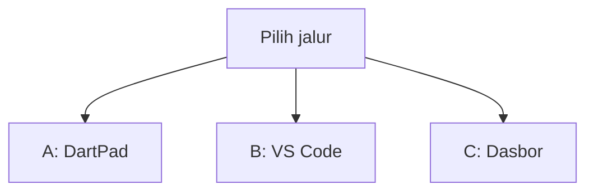
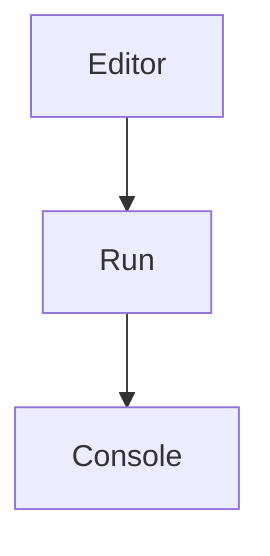
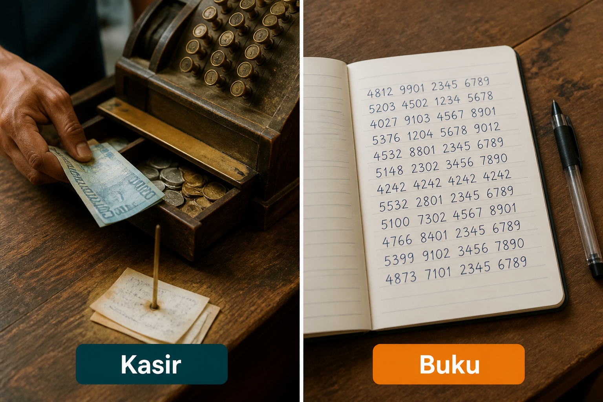
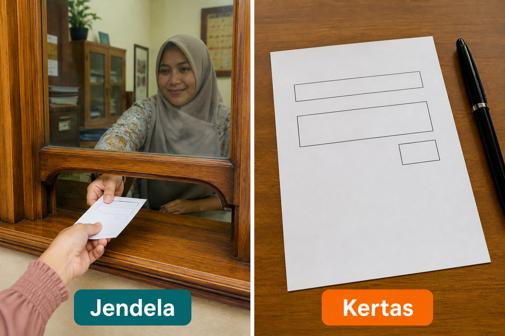
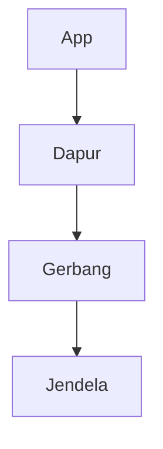
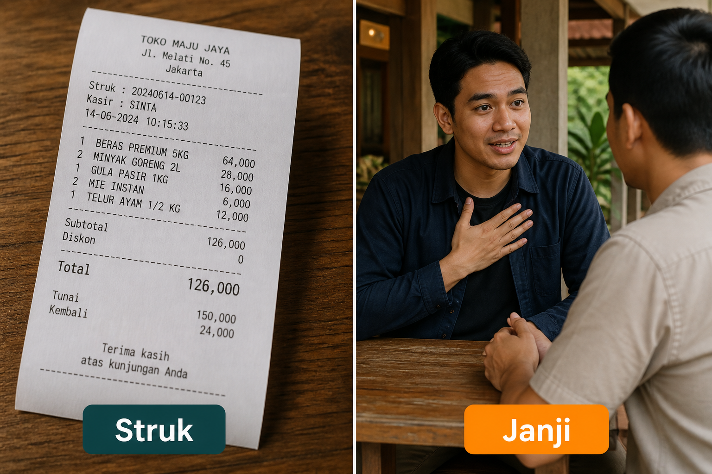
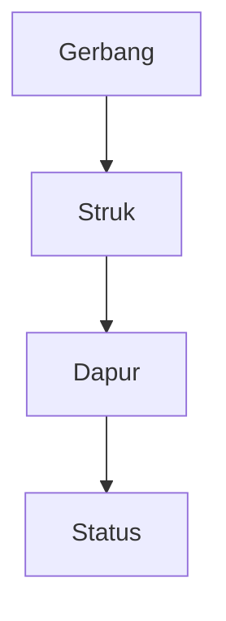
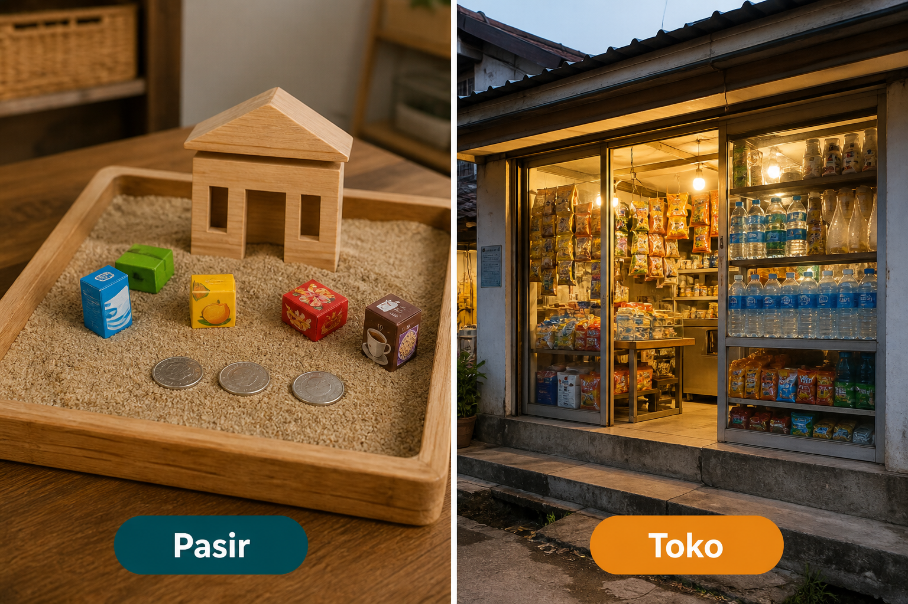
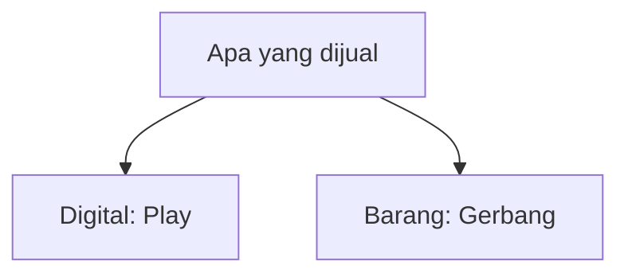

# Lampiran L2 — Pembayaran

**Waktu:** 1–2 sesi  
**Prasyarat:** Modul 07 (dapur REST), Modul 09 (Rupiah / wajah layar), Modul 10 (Play). Setelah capstone.  
**Hasil:** Nanti Anda paham **gerbang bayar** (Midtrans / Xendit): orang membayar di jendela gerbang, app **tidak** menyimpan nomor kartu, kunci server hanya di dapur.

Ini **lampiran**, bukan syarat lulus jalur wajib (Modul 00–11). Buka kalau app Anda butuh “uang ini sudah masuk.”

---

## Buka alat ini dulu

Plugin gerbang bayar **tidak** ada di [daftar paket DartPad](https://github.com/dart-lang/dart-pad/wiki/Package-and-plugin-support). DartPad hanya untuk status pesanan dan jumlah.

| Jalur | Buka | Untuk apa |
| --- | --- | --- |
| A | Browser → [dartpad.dev](https://dartpad.dev) → mode **Dart** | Status pesanan dan jumlah sebagai angka |
| B | VS Code + Terminal (`Ctrl + J`) + emulator/HP | `dio` ke dapur, buka jendela bayar |
| C | Browser → dasbor **sandbox** Midtrans atau Xendit | Kunci uji, bukan uang sungguhan |



Letak tombol di DartPad (bukan sketsa):




Sumber gambar: [dart.dev/tools/dartpad](https://dart.dev/tools/dartpad), Dart team / Google ([CC BY 4.0](https://creativecommons.org/licenses/by/4.0/)). Foto resmi itu **tema gelap** dan **mode Dart**. Kalau kelihatan seperti kotak hitam, gulir sampai editor kiri dan tombol **Run** terlihat; itu bukan gambar rusak. Mode **Dart** pas untuk uji 1. Jendela Snap / Invoice **tidak** diuji di sini.

### Dua jenis kode di halaman ini

| Jenis | Tanda | Caranya |
| --- | --- | --- |
| **Berkas lengkap** | Ada `void main()` | Tempel utuh, lalu **Run** (alat yang disebut di kotak uji) |
| **Cuplikan** | Hanya potongan | Jangan di-Run sendirian |

### Pola uji A — DartPad Dart

| | |
| --- | --- |
| **Buka** | [dartpad.dev](https://dartpad.dev) |
| **Pilih** | mode **Dart** |
| **Tempel** | **berkas lengkap** |
| **Klik** | **Run** |
| **Kalau berhasil** | Console menulis status dan jumlah, bukan error merah |

### Pola uji B — proyek lokal

| | |
| --- | --- |
| **Buka** | VS Code di folder proyek Flutter, emulator atau HP sudah menyala |
| **Terminal** | `Ctrl + J` |
| **Ketik** | perintah di mini proyek, di folder proyek |
| **Kalau berhasil** | tombol Bayar membuka jendela gerbang; status lunas datang dari dapur, bukan dari form kartu |

> **Aturan emas:** perintah `flutter ...` hanya di **Terminal VS Code**. DartPad tidak membuka Snap. Jangan commit kunci server ke GitHub. Jangan `TextField` nomor kartu.

Praktik: **Windows → Android**. iOS: konsep sama (jendela gerbang), membangun iOS butuh Mac.

Ini **bukan** nasihat keuangan atau hukum. Tagihan gerbang dan kebijakan Play berubah; cek halaman resmi sebelum uang sungguhan.

---

## 1. Bayar di kasir, jangan salin kartu ke buku

Gerbang bayar = kasir toko. Orang menyerahkan uang di meja kasir. App Anda **bukan** buku yang menyalin nomor kartu.



*Ilustrasi asli materi mobile2026. Kasir = gerbang (Midtrans / Xendit). Buku = menyalin nomor kartu ke app / GitHub. Jangan jadi buku.*

Angka panjang di gambar **Buku** itu contoh palsu. Jangan disalin ke kode.

Jangan simpan nomor kartu, tanggal kedaluwarsa, atau tiga digit belakang di `SharedPreferences`, `flutter_secure_storage`, Firestore, log, atau repo. Brankas Modul 05/09 untuk **token login**, bukan untuk kartu.

Kalau Anda mengumpulkan kartu sendiri, itu urusan sertifikasi kartu yang berat. Untuk lampiran ini: **biarkan gerbang yang memegang kartu.**

---

## 2. Jendela gerbang, bukan kertas di meja app

Orang membayar di **jendela** milik gerbang (halaman Snap Midtrans, tautan bayar Xendit). App tidak menyediakan kertas isian kartu.



*Ilustrasi asli materi mobile2026. Jendela = halaman bayar gerbang. Kertas = form kartu di app. Mini proyek hari ini: buka jendela, jangan sediakan kertas.*

Alur singkat (bukan siklus):



1. App minta dapur (backend Modul 07) buatkan transaksi.
2. Dapur memakai **kunci server**, dapat token / URL.
3. App membuka URL itu (`url_launcher`, atau WebView di jalur B).
4. Orang memilih VA, e-wallet, atau kartu **di halaman gerbang**.

Sumber pola Snap: [panduan Snap Midtrans](https://docs.midtrans.com/docs/snap-snap-integration-guide). Pola Xendit yang setara: dapur membuat tautan bayar, app membuka URL — [payment link Xendit](https://docs.xendit.co/payment-link/integration-and-testing/payment-links-integration). Pilih **satu** gerbang di mini proyek, jangan dua SDK bertumpuk.

Cuplikan (jalur B) — **jangan** di-Run di DartPad:

```dart
// Cuplikan. urlJendela datang dari dapur Anda, bukan diketik orang.
await launchUrl(
  Uri.parse(urlJendela),
  mode: LaunchMode.externalApplication,
);
```

Sumber: [`url_launcher`](https://pub.dev/packages/url_launcher). Lampiran L6 membahas berbagi tautan secara umum; di sini paket yang sama dipakai untuk **membuka jendela bayar**.

---

## 3. Percaya struk, bukan janji

HP yang kembali ke app bukan bukti uang masuk. Yang dihitung: **struk** dari gerbang ke dapur (notifikasi HTTP / webhook).



*Ilustrasi asli materi mobile2026. Struk = notifikasi gerbang ke dapur. Janji = tombol “saya sudah bayar” di HP. Status lunas hanya dari struk.*



Halaman “selesai” di browser hanya ramah di mata. Jangan `setState` jadi lunas hanya karena orang menekan Kembali.

Dapur memeriksa tanda tangan notifikasi **sesuai dokumen resmi gerbang**, lalu menyimpan status. App membaca status itu lewat `dio` (Modul 07). Jangan percayai query di URL kembali.

---

## 4. Pasir dulu, toko kemudian

Sandbox = meja pasir. Produksi = toko buka. Kunci, dasbor, dan uangnya **berbeda**.



*Ilustrasi asli materi mobile2026. Pasir = sandbox (uji). Toko = produksi (uang sungguhan). Sesi ini cukup di pasir.*

Jalur C: [dasbor sandbox Midtrans](https://dashboard.sandbox.midtrans.com) atau dasbor uji Xendit. Kartu / VA uji ada **di dasbor itu** — jangan tempel nomor kartu uji ke README atau GitHub.

Kunci pasir tidak membuka toko. Kunci toko jangan dipakai di sesi latihan.

---

## 5. Yang dijual menentukan kasir mana

Ini yang sering bikin app ditolak Play, meski kode Dart rapi.



| Yang dijual | Kasir yang dipakai |
| --- | --- |
| Konten digital di dalam app (koin game, langganan materi, fitur dibuka) | **Sistem bayar Play** — belum dilatih di sini |
| Barang atau jasa fisik (makanan diantar, tiket acara langsung, toko kelontong) | Gerbang seperti Midtrans / Xendit |

Sumber: [kebijakan pembayaran Play](https://support.google.com/googleplay/android-developer/answer/10281818). Bukan nasihat hukum. Kalau ragu, baca halaman itu, jangan menebak dari chat.

Monetisasi IAP / iklan **sengaja ditunda** (silabus). Lampiran ini untuk gerbang barang/jasa, bukan untuk mengganti sistem bayar Play.

---

## 6. Kunci dapur bukan kunci etalase

| Kunci | Tinggal di mana |
| --- | --- |
| **Kunci server** / secret | Hanya dapur. Lingkungan server, bukan `lib/` |
| **Kunci klien** | Boleh untuk membuka jendela; tetap jangan asal commit ke repo publik |

Sumber Midtrans: [access keys](https://docs.midtrans.com/docs/access-keys), [FAQ teknis](https://docs.midtrans.com/docs/technical-faq) (jangan panggil API kunci server dari HP). Sumber Xendit: [API keys](https://docs.xendit.co/docs/api-keys).

Pola brankas sama Modul 09: `--dart-define` / env dapur. Kunci bocor = orang lain bisa membuat tagihan atas nama toko Anda.

---

## Uji 1 — status pesanan di DartPad

| | |
| --- | --- |
| **Buka** | [dartpad.dev](https://dartpad.dev) |
| **Pilih** | mode **Dart** |
| **Tempel** | berkas lengkap di bawah |
| **Klik** | **Run** |
| **Kalau berhasil** | Console menulis `Status: menunggu`, jumlah, dan `Tidak ada nomor kartu di app.` |

```dart
bool kelihatanNomorKartu(String teks) {
  final hanyaAngka = teks.replaceAll(RegExp(r'\D'), '');
  return hanyaAngka.length >= 13 && hanyaAngka.length <= 19;
}

void main() {
  const status = 'menunggu';
  const jumlah = 25000;
  print('Status: $status');
  print('Jumlah: Rp $jumlah');

  const dariApp = 'catatan: bayar di jendela gerbang';
  if (kelihatanNomorKartu(dariApp)) {
    print('Jangan simpan. Itu mirip nomor kartu.');
  } else {
    print('Tidak ada nomor kartu di app. Bagus.');
  }
}
```

Di HP, `jumlah` ditampilkan dengan `intl` (Modul 09). Status `lunas` **tidak** di-set dari uji ini — itu datang dari dapur setelah struk.

Cuplikan (jalur B) — **jangan** di-Run di DartPad:

```dart
// Cuplikan. Dapur mengembalikan URL jendela, bukan nomor kartu.
final jawab = await dio.post('/pesanan', data: {'jumlah': 25000});
final urlJendela = jawab.data['url'] as String;
```

Kalau dapur gagal: wajah **gagal** + tombol coba lagi, bukan layar putih (Modul 09).

---

## Mini proyek lampiran ini

Satu layar: jumlah + tombol **Bayar** → dapur → jendela gerbang → status dari dapur. Urutan jangan terbalik. **Tidak ada** kolom nomor kartu.

1. Paket, di folder proyek:

| | |
| --- | --- |
| **Buka** | Terminal VS Code di folder proyek Flutter |
| **Ketik** | perintah di bawah |

```text
flutter pub add dio url_launcher provider
```

**Kalau berhasil:** ketiga nama ada di `pubspec.yaml`.

2. Model `Pesanan`: id, jumlah, status `menunggu` / `lunas` / `gagal`. `provider` memegang satu pesanan (Modul 04).
3. Dapur (Modul 07): satu rute “buat transaksi” memakai kunci server. Ikuti dokumen Snap atau tautan bayar Xendit — **bukan** menempel kunci di `main.dart`.
4. Layar: teks harga dengan `intl` **sebelum** tombol Bayar. Tidak ada `TextField` kartu.
5. `dio` ke dapur Anda → dapat URL → `launchUrl`.
6. Polling atau tarik ulang status dari dapur. Jangan tombol “sudah bayar” yang langsung `lunas`.
7. Wajah: tunggu / gagal / lunas. `SafeArea` (Modul 02).

| | |
| --- | --- |
| **Buka** | VS Code, emulator atau HP menyala |
| **Terminal** | `Ctrl + J` |
| **Ketik** | perintah di bawah |

```text
flutter run
```

**Kalau berhasil:** tombol Bayar membuka halaman gerbang (pasir). Setelah Anda selesai di jendela itu, app menunjukkan lunas **hanya** bila dapur sudah terima struk. Kunci server **tidak** ada di GitHub.

Bonus: simpan `order_id` di `flutter_secure_storage` supaya orang tidak kehilangan nomor pesanan — itu identitas transaksi, **bukan** nomor kartu.

---

## Kesalahan yang sering terjadi

| Gejala | Penyebab yang sering | Perbaikan |
| --- | --- | --- |
| Tagihan aneh di dasbor | kunci server di `lib/` atau GitHub | anggap bocor; ganti kunci; pindah ke dapur |
| Play menolak app | konten digital lewat Midtrans/Xendit | sistem bayar Play; atau jual barang fisik |
| Status lunas palsu | tombol “sudah bayar” / URL kembali | tunggu struk di dapur |
| Jendela tidak terbuka | URL kosong, kunci pasir vs toko tertukar | cek dasbor pasir; URL dari dapur |
| Form kartu di app | meniru checkout web | hapus field; buka jendela gerbang |
| `url_launcher` gagal | belum `pub add`, atau URL bukan `https` | paket + URL dari dapur |
| DartPad `import dio` | plugin tidak ada di DartPad | jalur B |

---

## Latihan

1. (DartPad) Ganti uji 1: status `gagal`, jumlah kota Anda (kelipatan 1000).
2. (DartPad) Ubah `dariApp` jadi deretan angka panjang — pastikan pesan “jangan simpan” muncul.
3. (Jalur B) `git grep` kunci server / `SB-Mid` / `xnd_` — tidak boleh di `lib/`.
4. (Jalur B) Tolak / tutup jendela bayar — pastikan status tetap `menunggu`, bukan `lunas`.
5. (Bonus) Dapur menolak jumlah `0` dan jumlah negatif.

---

## Kuis singkat

1. Kenapa jendela Snap tidak diuji di DartPad?
2. Apakah nomor kartu boleh disimpan di `flutter_secure_storage` “supaya aman”?
3. Orang kembali ke app setelah bayar — cukup untuk menandai lunas?
4. Kunci server boleh ditulis di `lib/main.dart`?
5. Langganan konten digital di Play boleh memakai Midtrans saja?

Kunci jawaban di bawah. Coba jawab dulu.

---

## Apa yang belum dibahas

- Sistem bayar Play / IAP / iklan (ditunda setelah L2)
- Cicilan, recurring, payout ke rekening
- Core API yang menerima kartu di server Anda sendiri
- QR kasir (lampiran L9)
- Lampiran L3 Supabase, L8 biometrik

---

## Kunci kuis

1. Tidak ada plugin gerbang di DartPad; butuh HP/emulator + dapur + dasbor.
2. Tidak. Brankas itu untuk token login, bukan nomor kartu. Kartu dipegang gerbang.
3. Tidak. Struk ke dapur dulu, baru status.
4. Tidak. Kunci server hanya di dapur / brankas server.
5. Tidak. Konten digital di Play memakai sistem bayar Play, kecuali kebijakan resmi mengatakan lain.

---

## Sumber gambar dan tautan

| Aset | Sumber |
| --- | --- |
| `images/analogi-kasir-buku.png` | Ilustrasi asli materi mobile2026 |
| `images/analogi-jendela-kertas.png` | Ilustrasi asli materi mobile2026 |
| `images/analogi-struk-janji.png` | Ilustrasi asli materi mobile2026 |
| `images/analogi-pasir-toko.png` | Ilustrasi asli materi mobile2026 |
| Tampilan DartPad | [dart.dev/assets/img/dartpad-hello.png](https://dart.dev/assets/img/dartpad-hello.png) dari [dart.dev/tools/dartpad](https://dart.dev/tools/dartpad) ([CC BY 4.0](https://creativecommons.org/licenses/by/4.0/)) |
| Snap Midtrans | [docs.midtrans.com/docs/snap-snap-integration-guide](https://docs.midtrans.com/docs/snap-snap-integration-guide) |
| Access keys Midtrans | [docs.midtrans.com/docs/access-keys](https://docs.midtrans.com/docs/access-keys) |
| FAQ teknis Midtrans | [docs.midtrans.com/docs/technical-faq](https://docs.midtrans.com/docs/technical-faq) |
| Dasbor pasir Midtrans | [dashboard.sandbox.midtrans.com](https://dashboard.sandbox.midtrans.com) |
| Tautan bayar Xendit | [docs.xendit.co/payment-link/integration-and-testing/payment-links-integration](https://docs.xendit.co/payment-link/integration-and-testing/payment-links-integration) |
| API keys Xendit | [docs.xendit.co/docs/api-keys](https://docs.xendit.co/docs/api-keys) |
| Kebijakan bayar Play | [support.google.com/googleplay/android-developer/answer/10281818](https://support.google.com/googleplay/android-developer/answer/10281818) |
| `dio` | [pub.dev/packages/dio](https://pub.dev/packages/dio) |
| `url_launcher` | [pub.dev/packages/url_launcher](https://pub.dev/packages/url_launcher) |
| `provider` | [pub.dev/packages/provider](https://pub.dev/packages/provider) |
| Paket DartPad | [github.com/dart-lang/dart-pad/wiki/Package-and-plugin-support](https://github.com/dart-lang/dart-pad/wiki/Package-and-plugin-support) |
| Modul 07 REST | [modul-07-rest/README.md](../../modul-07-rest/README.md) |
| Modul 09 Rupiah | [modul-09-kualitas/README.md](../../modul-09-kualitas/README.md) |
| Modul 10 Play | [modul-10-rilis/README.md](../../modul-10-rilis/README.md) |

Flutter, Firebase, Google Play, Google and the related logos are trademarks of Google LLC. Midtrans is a trademark of Midtrans. Xendit is a trademark of Xendit. We are not endorsed by or affiliated with Google LLC, Midtrans, or Xendit.
