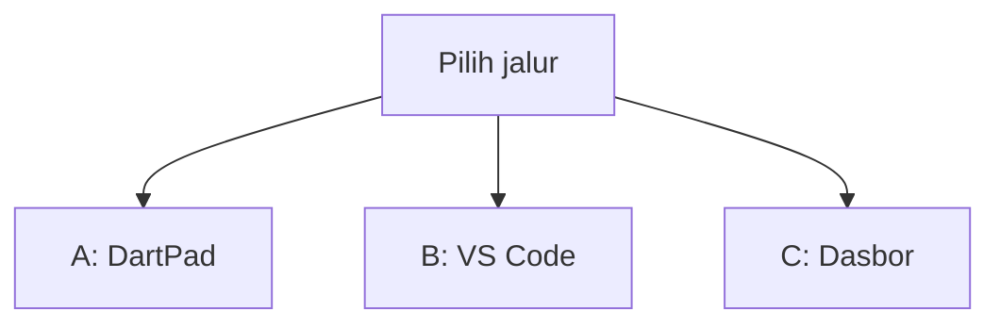
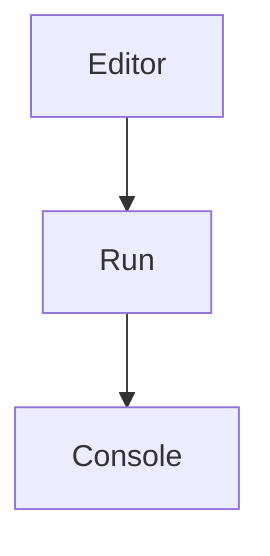
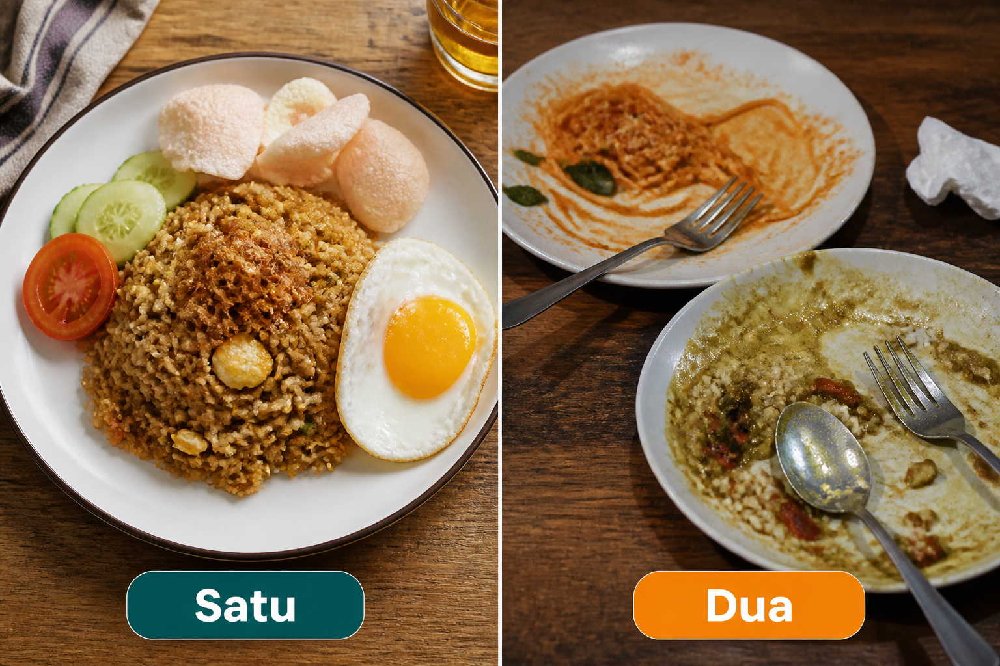
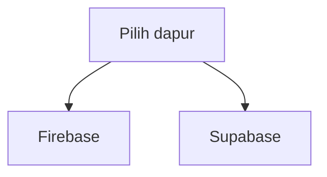
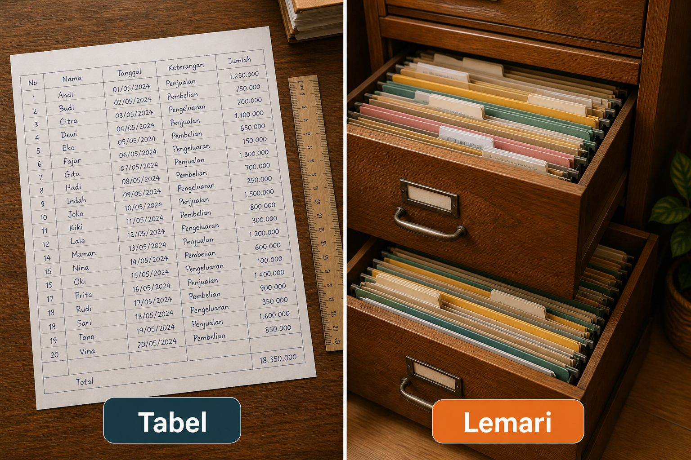
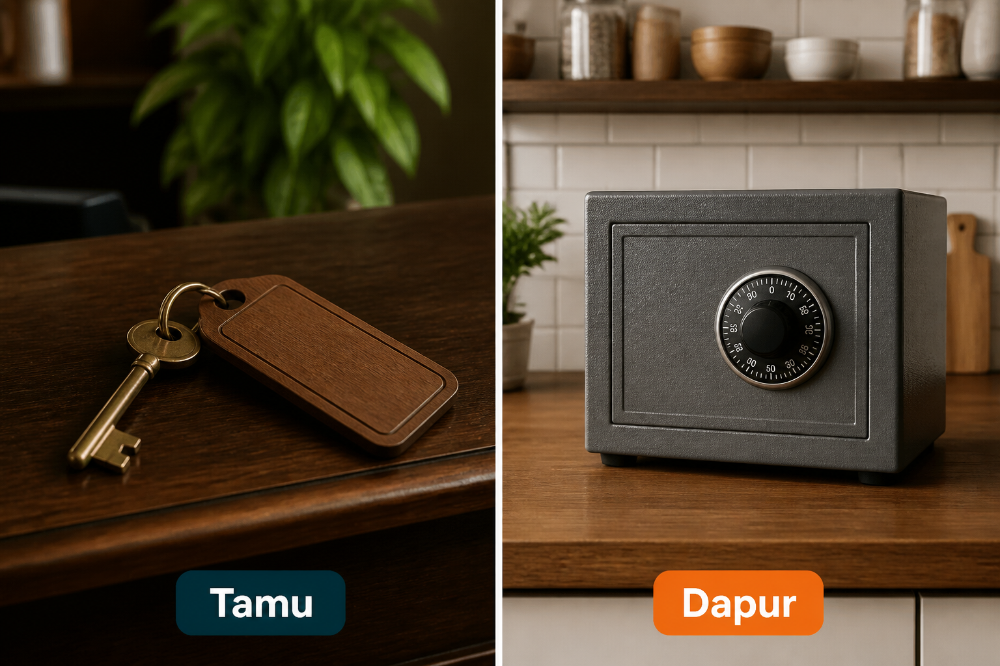
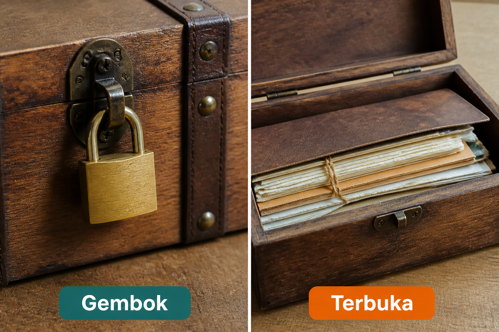
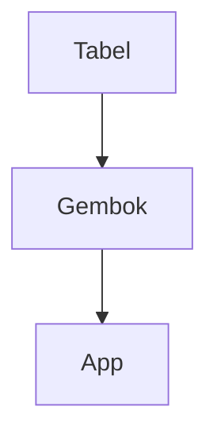

# Lampiran L3 — Supabase

**Waktu:** 1–2 sesi  
**Prasyarat:** Modul 06 (pernah pakai Firestore + aturan) dan Modul 07 (dapur REST).  
**Hasil:** Nanti Anda paham Supabase sebagai **dapur alternatif**: data di **tabel**, login, dan **gembok per baris** — tanpa menaruh kunci dapur di `lib/`.

Ini **lampiran**, bukan syarat lulus jalur wajib (Modul 00–11). Jalur wajib tetap Firebase dulu. Buka kalau proyek Anda butuh tabel rapi, atau dapur selain Firebase.

---

## Buka alat ini dulu

Paket `supabase_flutter` **tidak** ada di [daftar paket DartPad](https://github.com/dart-lang/dart-pad/wiki/Package-and-plugin-support). DartPad hanya untuk bentuk data tabel.

| Jalur | Buka | Untuk apa |
| --- | --- | --- |
| A | Browser → [dartpad.dev](https://dartpad.dev) → mode **Dart** | Baris tabel sebagai `Map` |
| B | VS Code + Terminal (`Ctrl + J`) + emulator/HP | Login, baca/tulis tabel |
| C | Browser → [dasbor Supabase](https://supabase.com/dashboard) | Proyek, tabel, gembok, kunci tamu |



Letak tombol di DartPad (bukan sketsa):




Sumber gambar: [dart.dev/tools/dartpad](https://dart.dev/tools/dartpad), Dart team / Google ([CC BY 4.0](https://creativecommons.org/licenses/by/4.0/)). Foto resmi itu **tema gelap** dan **mode Dart**. Kalau kelihatan seperti kotak hitam, gulir sampai editor kiri dan tombol **Run** terlihat; itu bukan gambar rusak. Mode **Dart** pas untuk uji 1. `supabase_flutter` **tidak** diuji di sini.

### Dua jenis kode di halaman ini

| Jenis | Tanda | Caranya |
| --- | --- | --- |
| **Berkas lengkap** | Ada `void main()` | Tempel utuh, lalu **Run** (alat yang disebut di kotak uji) |
| **Cuplikan** | Hanya potongan | Jangan di-Run sendirian |

### Pola uji A — DartPad Dart

| | |
| --- | --- |
| **Buka** | [dartpad.dev](https://dartpad.dev) |
| **Pilih** | mode **Dart** |
| **Tempel** | **berkas lengkap** |
| **Klik** | **Run** |
| **Kalau berhasil** | Console menulis dua baris nama dan isi, bukan error merah |

### Pola uji B — proyek lokal

| | |
| --- | --- |
| **Buka** | VS Code di folder proyek Flutter, emulator atau HP sudah menyala |
| **Terminal** | `Ctrl + J` |
| **Ketik** | perintah di mini proyek, di folder proyek |
| **Kalau berhasil** | login berhasil; daftar hanya menampilkan baris milik Anda; kunci dapur tidak ada di GitHub |

> **Aturan emas:** perintah `flutter ...` hanya di **Terminal VS Code**. DartPad tidak bicara ke proyek Supabase Anda. Jangan commit kunci dapur ke GitHub.

Praktik: **Windows → Android**. iOS: konsep sama, membangun iOS butuh Mac.

Ini **bukan** nasihat keuangan. Kuota dan harga dasbor berubah; cek halaman resmi sebelum toko buka.

---

## 1. Satu dapur, jangan dua sekaligus

Jalur wajib sudah punya Firebase (Modul 06). Supabase adalah dapur **lain**, bukan tambahan yang wajib ditumpuk.



*Ilustrasi asli materi mobile2026. Satu = pilih Firebase **atau** Supabase untuk data inti. Dua = dua dapur untuk data yang sama, berantakan.*



Mini proyek hari ini: **satu** tabel catatan di Supabase. Jangan menyalin data yang sama ke Firestore “supaya cadangan.”

---

## 2. Tabel rapi, bukan lemari map

Modul 06: Firestore = lemari map (dokumen longgar). Supabase menyimpan data di **tabel**: kolom tetap, tiap catatan satu baris — seperti lembar rapi (mesin di belakangnya Postgres).



*Ilustrasi asli materi mobile2026. Tabel = baris dengan kolom yang sama. Lemari = map longgar (Firestore). Bukan “lebih pintar”; beda bentuk.*

Sumber: [panduan Flutter Supabase](https://supabase.com/docs/guides/getting-started/quickstarts/flutter).

### Uji 1 — baca dua baris di DartPad

| | |
| --- | --- |
| **Buka** | [dartpad.dev](https://dartpad.dev) |
| **Pilih** | mode **Dart** |
| **Tempel** | berkas lengkap di bawah |
| **Klik** | **Run** |
| **Kalau berhasil** | Console menulis `Andi: Catatan satu` dan `Budi: Catatan dua` |

```dart
void main() {
  final baris = [
    {'nama': 'Andi', 'isi': 'Catatan satu'},
    {'nama': 'Budi', 'isi': 'Catatan dua'},
  ];
  for (final r in baris) {
    print('${r['nama']}: ${r['isi']}');
  }
  print('Itu tabel: tiap baris punya kolom yang sama.');
}
```

Di HP, baris itu datang dari `.from('catatan').select()` (jalur B). Jangan menghafal Andi sebagai “data saya.”

Cuplikan (jalur B) — **jangan** di-Run di DartPad:

```dart
// Cuplikan. Setelah login:
final data = await Supabase.instance.client.from('catatan').select();
```

Kalau gagal: wajah **gagal** + tombol coba lagi, bukan layar putih (Modul 09).

---

## 3. Kunci tamu di HP, kunci dapur tetap di dapur

Dasbor memberi dua jenis kunci. Jangan tertukar.



*Ilustrasi asli materi mobile2026. Tamu = kunci yang boleh di app. Dapur = kunci yang menembus gembok. Kunci dapur **tidak** di `lib/`.*

Sumber: [kunci dasbor Supabase](https://supabase.com/docs/guides/getting-started/api-keys). Nama di dasbor bisa *anon* atau *publishable* untuk tamu, *service_role* atau *secret* untuk dapur — artinya sama: tamu vs dapur.

Cuplikan (jalur B):

```dart
// Cuplikan. urlProyek dan kunciTamu dari --dart-define / env, bukan diketik di GitHub.
await Supabase.initialize(
  url: urlProyek,
  anonKey: kunciTamu,
);
```

Pola brankas sama Modul 09. Kunci dapur bocor = orang lain bisa baca **semua** baris, gembok pun tidak menahan.

---

## 4. Gembok per baris, jangan meja terbuka

Tanpa gembok, kunci tamu cukup untuk menyentuh seluruh tabel. Itu seperti lemari tanpa satpam di Modul 06.



*Ilustrasi asli materi mobile2026. Gembok = aturan baris menyala. Terbuka = tabel tanpa aturan. Mini proyek: gembok menyala sebelum data sungguhan.*



Sumber: [aturan baris tabel](https://supabase.com/docs/guides/database/postgres/row-level-security). Di dasbor: nyalakan gembok, lalu kebijakan “orang hanya lihat/ubah baris miliknya” (`auth.uid()` = kolom `user_id`). Ikuti wizard resmi; jangan kebijakan yang mengizinkan semua orang.

Cuplikan di editor dasbor (jalur C) — **bukan** DartPad:

```sql
-- Cuplikan. Nama tabel sesuai yang Anda buat.
alter table catatan enable row level security;
```

Kebijakan lengkapnya ada di dokumen resmi. Jangan meniru contoh internet yang mematikan gembok “supaya cepat.”

---

## 5. Login dulu, baru baris

Sama semangat Modul 06/08: identitas orang di dapur, bukan hanya di HP.

Login Supabase: email + sandi (konsep Google Sign-In ada di dokumen resmi, bukan mini proyek ini). Setelah masuk, `auth.uid()` mengisi `user_id` di tiap baris.

Cuplikan (jalur B):

```dart
// Cuplikan. Jangan simpan sandi di SharedPreferences.
await Supabase.instance.client.auth.signInWithPassword(
  email: email,
  password: sandi,
);
```

Sesi login ditangani paket. Jangan salin sandi ke log. `flutter_secure_storage` untuk rahasia app lain; sandi orang tidak disimpan di HP.

Play **Data safety** (Modul 10): centang login / data catatan hanya jika kode memang memakainya.

---

## Mini proyek lampiran ini

Satu layar: daftar catatan milik orang yang masuk. Urutan jangan terbalik.

1. Paket, di folder proyek:

| | |
| --- | --- |
| **Buka** | Terminal VS Code di folder proyek Flutter |
| **Ketik** | perintah di bawah |

```text
flutter pub add supabase_flutter provider
```

**Kalau berhasil:** kedua nama ada di `pubspec.yaml`.

2. Jalur C: buat proyek di dasbor. Salin **URL** + **kunci tamu** — bukan kunci dapur.
3. Tabel `catatan`: kolom `id`, `user_id`, `isi`, `created_at`. Nyalakan gembok. Kebijakan: hanya baris `user_id` = orang yang masuk.
4. `Supabase.initialize` di `main` dengan `--dart-define` (Modul 09). `provider` memegang sesi (Modul 04).
5. Layar: masuk → daftar → tambah satu catatan. `go_router` kalau sudah dipakai di capstone.
6. Keluar: `signOut`. Data orang lain **tidak** kelihatan.
7. Wajah: tunggu / kosong / gagal / ada isi (Modul 09). `SafeArea` (Modul 02).

| | |
| --- | --- |
| **Buka** | VS Code, emulator atau HP menyala |
| **Terminal** | `Ctrl + J` |
| **Ketik** | perintah di bawah |

```text
flutter run
```

**Kalau berhasil:** setelah masuk, daftar hanya catatan Anda. Akun kedua tidak melihat catatan akun pertama. Kunci dapur **tidak** ada di GitHub.

Bonus: baris baru muncul sendiri saat orang lain menulis — konsep di dokumen resmi, bukan syarat mini proyek.

---

## Kesalahan yang sering terjadi

| Gejala | Penyebab yang sering | Perbaikan |
| --- | --- | --- |
| Semua orang lihat semua baris | gembok mati, atau kebijakan terlalu longgar | nyalakan gembok; kebijakan milik sendiri |
| Error izin di Console | gembok nyala tanpa kebijakan | tambah kebijakan pilih/sisip/ubah |
| Kunci di GitHub | kunci dapur di `lib/` | anggap bocor; ganti kunci; hanya kunci tamu di app |
| Login berhasil, daftar kosong | `user_id` tidak diisi saat sisip | sisipkan `auth.uid()` |
| DartPad `import supabase_flutter` | paket tidak ada di DartPad | jalur B |
| Data dobel aneh | Firestore + Supabase untuk hal yang sama | pilih satu dapur |

---

## Latihan

1. (DartPad) Tambah baris ketiga di uji 1 (nama kota Anda).
2. (Jalur B) `git grep` `service_role` / `sb_secret` — tidak boleh di `lib/`.
3. (Jalur B) Masuk dengan dua akun — pastikan daftar tidak tercampur.
4. (Jalur B) Tolak jaringan / sandi salah — wajah gagal, bukan layar putih.
5. (Bonus) Keluar, buka app lagi — sesi habis atau masih masuk, sesuai yang Anda rancang.

---

## Kuis singkat

1. Kenapa `supabase_flutter` tidak diuji di DartPad?
2. Apakah kunci dapur boleh ditulis di `lib/main.dart` “sementara”?
3. Tabel tanpa gembok, kunci tamu di app — aman?
4. Firebase wajib diganti Supabase di capstone?
5. Login berhasil berarti semua baris tabel boleh dibaca?

Kunci jawaban di bawah. Coba jawab dulu.

---

## Apa yang belum dibahas

- Penyimpanan file, fungsi di dapur, pencarian pintar
- Migrasi penuh dari Firestore
- Login Google / Apple di Supabase
- Lampiran L4 Crashlytics, L5 Actions, L8 biometrik

---

## Kunci kuis

1. Paket itu plugin HP; tidak ada di DartPad. Butuh proyek dasbor + emulator/HP.
2. Tidak. Kunci dapur hanya di dapur / brankas dapur. App memakai kunci tamu.
3. Tidak. Kunci tamu + meja terbuka = data kelihatan. Nyalakan gembok.
4. Tidak. Jalur wajib tetap Firebase. Ini alternatif.
5. Tidak. Setelah masuk, gembok tetap membatasi baris milik orang itu.

---

## Sumber gambar dan tautan

| Aset | Sumber |
| --- | --- |
| `images/analogi-satu-dua.png` | Ilustrasi asli materi mobile2026 |
| `images/analogi-tabel-lemari.png` | Ilustrasi asli materi mobile2026 |
| `images/analogi-tamu-dapur.png` | Ilustrasi asli materi mobile2026 |
| `images/analogi-gembok-terbuka.png` | Ilustrasi asli materi mobile2026 |
| Tampilan DartPad | [dart.dev/assets/img/dartpad-hello.png](https://dart.dev/assets/img/dartpad-hello.png) dari [dart.dev/tools/dartpad](https://dart.dev/tools/dartpad) ([CC BY 4.0](https://creativecommons.org/licenses/by/4.0/)) |
| Quickstart Flutter | [supabase.com/docs/guides/getting-started/quickstarts/flutter](https://supabase.com/docs/guides/getting-started/quickstarts/flutter) |
| Kunci dasbor | [supabase.com/docs/guides/getting-started/api-keys](https://supabase.com/docs/guides/getting-started/api-keys) |
| Aturan baris | [supabase.com/docs/guides/database/postgres/row-level-security](https://supabase.com/docs/guides/database/postgres/row-level-security) |
| Login | [supabase.com/docs/guides/auth](https://supabase.com/docs/guides/auth) |
| `supabase_flutter` | [pub.dev/packages/supabase_flutter](https://pub.dev/packages/supabase_flutter) |
| Dasbor | [supabase.com/dashboard](https://supabase.com/dashboard) |
| Paket DartPad | [github.com/dart-lang/dart-pad/wiki/Package-and-plugin-support](https://github.com/dart-lang/dart-pad/wiki/Package-and-plugin-support) |
| Modul 06 Firebase | [modul-06-firebase/README.md](../../modul-06-firebase/README.md) |
| Modul 07 REST | [modul-07-rest/README.md](../../modul-07-rest/README.md) |
| Modul 09 brankas | [modul-09-kualitas/README.md](../../modul-09-kualitas/README.md) |

Flutter, Firebase, Google and the related logos are trademarks of Google LLC. Supabase is a trademark of Supabase, Inc. We are not endorsed by or affiliated with Google LLC or Supabase, Inc.
