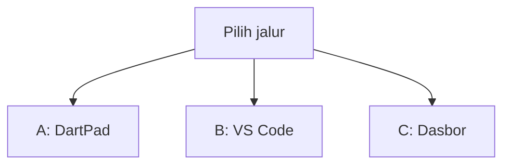
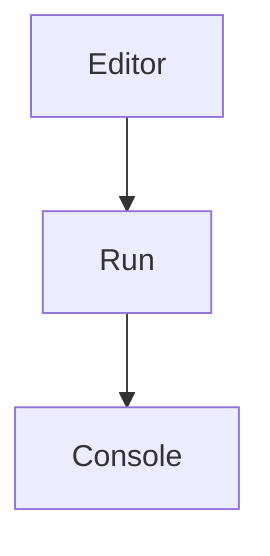
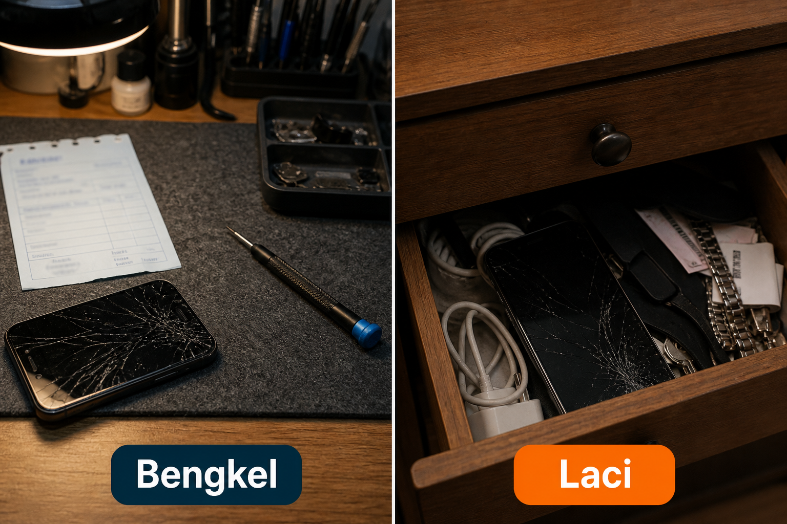
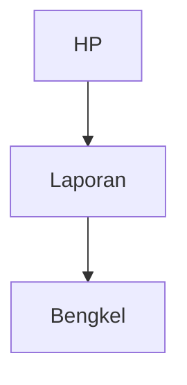
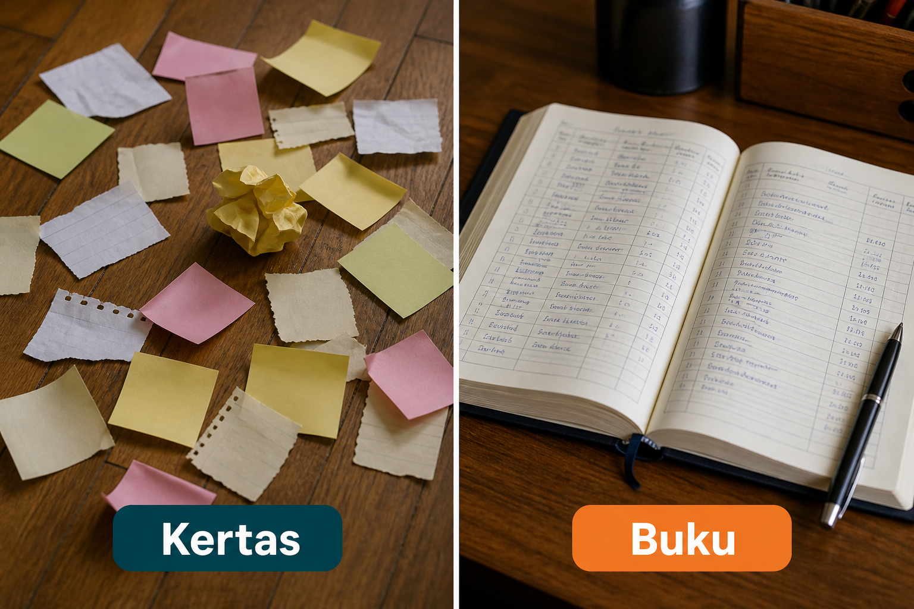
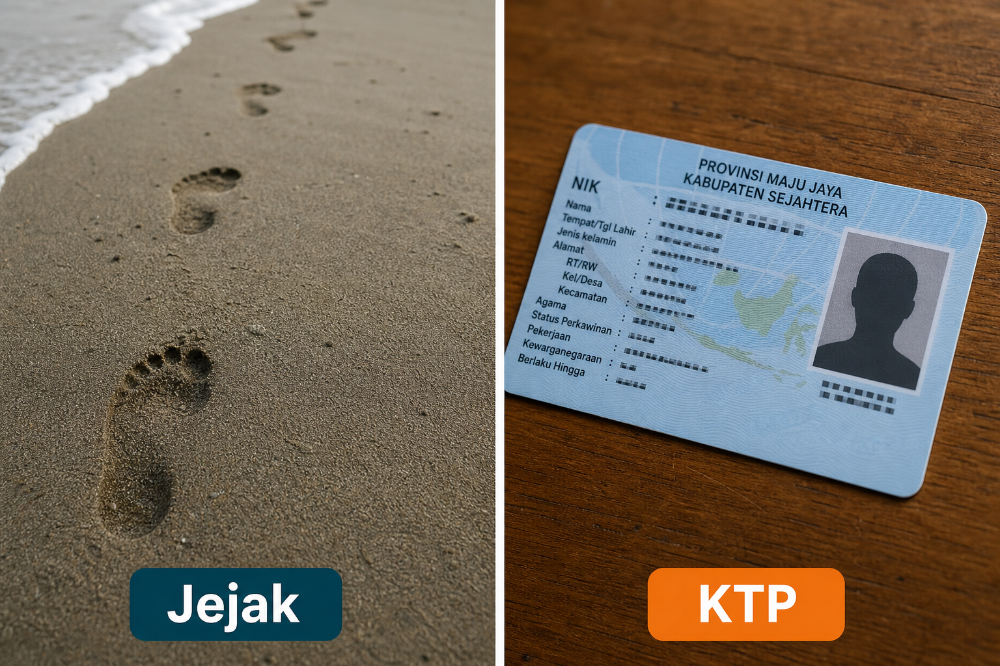
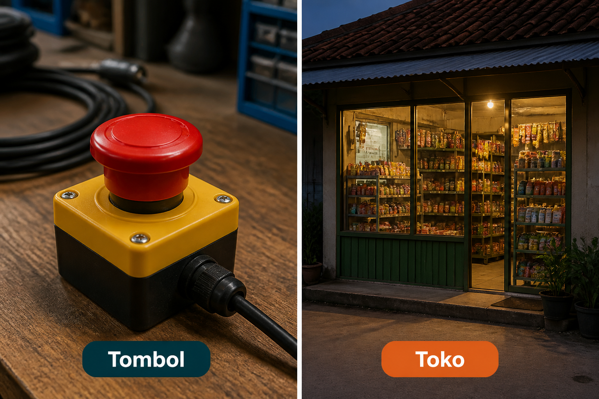

# Lampiran L4 — Crashlytics / Analytics

**Waktu:** 1–2 sesi  
**Prasyarat:** Modul 06 (Firebase di proyek), Modul 09 (`print` hilang saat rilis), Modul 10 (Play, Data safety, peta nama ofuskasi).  
**Hasil:** Nanti Anda paham cara **tahu app rusak di HP orang** — laporan sampai ke bengkel, tanpa mengirim nama atau email.

Ini **lampiran**, bukan syarat lulus jalur wajib (Modul 00–11). Buka kalau app sudah (atau hampir) di toko, dan Anda ingin mendengar HP yang rusak — bukan hanya yang di emulator Anda.

---

## Buka alat ini dulu

Paket `firebase_crashlytics` dan `firebase_analytics` **tidak** ada di [daftar paket DartPad](https://github.com/dart-lang/dart-pad/wiki/Package-and-plugin-support). DartPad hanya untuk bentuk laporan.

| Jalur | Buka | Untuk apa |
| --- | --- | --- |
| A | Browser → [dartpad.dev](https://dartpad.dev) → mode **Dart** | Laporan rusak sebagai `Map` |
| B | VS Code + Terminal (`Ctrl + J`) + emulator/HP | Pasang bengkel, uji rusak |
| C | Browser → [Console Firebase](https://console.firebase.google.com) | Lihat laporan di dasbor bengkel |



Letak tombol di DartPad (bukan sketsa):




Sumber gambar: [dart.dev/tools/dartpad](https://dart.dev/tools/dartpad), Dart team / Google ([CC BY 4.0](https://creativecommons.org/licenses/by/4.0/)). Foto resmi itu **tema gelap** dan **mode Dart**. Kalau kelihatan seperti kotak hitam, gulir sampai editor kiri dan tombol **Run** terlihat; itu bukan gambar rusak. Mode **Dart** pas untuk uji 1. Plugin bengkel **tidak** diuji di sini.

### Dua jenis kode di halaman ini

| Jenis | Tanda | Caranya |
| --- | --- | --- |
| **Berkas lengkap** | Ada `void main()` | Tempel utuh, lalu **Run** (alat yang disebut di kotak uji) |
| **Cuplikan** | Hanya potongan | Jangan di-Run sendirian |

### Pola uji A — DartPad Dart

| | |
| --- | --- |
| **Buka** | [dartpad.dev](https://dartpad.dev) |
| **Pilih** | mode **Dart** |
| **Tempel** | **berkas lengkap** |
| **Klik** | **Run** |
| **Kalau berhasil** | Console menulis baris mana yang boleh dikirim, bukan error merah |

### Pola uji B — proyek lokal

| | |
| --- | --- |
| **Buka** | VS Code di folder proyek Flutter yang sudah Firebase (Modul 06), emulator atau HP sudah menyala |
| **Terminal** | `Ctrl + J` |
| **Ketik** | perintah di mini proyek, di folder proyek |
| **Kalau berhasil** | tombol uji merusak app; setelah dibuka lagi, laporan muncul di dasbor; nama/email tidak ikut |

> **Aturan emas:** perintah `flutter ...` hanya di **Terminal VS Code**. DartPad tidak bicara ke Console Firebase. Jangan kirim nama, email, atau token ke bengkel.

Praktik: **Windows → Android**. iOS: konsep sama, membangun iOS butuh Mac.

Ini **bukan** nasihat hukum. Formulir Data safety dan kuota Firebase berubah; cek halaman resmi sebelum toko buka.

---

## 1. Bengkel, jangan laci

Kalau app rusak hanya di HP orang, dan Anda tidak mendengar apa-apa, itu seperti HP retak tersimpan di laci. Bengkel = laporan rusak sampai ke Anda.



*Ilustrasi asli materi mobile2026. Bengkel = laporan rusak sampai ke Anda. Laci = HP orang rusak, Anda tidak tahu.*

Nama paket: `firebase_crashlytics`. Nama di Console: dasbor **Crashlytics**. Artinya sama: bengkel.



Tanpa bengkel, `print` di emulator Anda tidak membantu orang di jalan (Modul 09).

---

## 2. Buku bengkel, bukan kertas yang jatuh

`print` di rilis biasanya dibuang. Itu kertas yang jatuh di lantai. Bengkel menyimpan **buku**: jejak error tetap ada setelah app mati.



*Ilustrasi asli materi mobile2026. Kertas = print yang hilang saat rilis. Buku = catatan di bengkel.*

Sumber: [mulai Crashlytics Flutter](https://firebase.google.com/docs/crashlytics/flutter/get-started). Cuplikan (jalur B) — **jangan** di-Run di DartPad:

```dart
// Cuplikan. Setelah Firebase.initializeApp (Modul 06):
FlutterError.onError = FirebaseCrashlytics.instance.recordFlutterFatalError;
```

Error yang tidak tertangkap kerangka Flutter (misalnya di `Future` tanpa `catch`) butuh baris tambahan `PlatformDispatcher.instance.onError` — ada di dokumen resmi. Mini proyek hari ini: baris `FlutterError.onError` dulu.

Jangan `print` token, sandi, atau isi profil ke log — itu Modul 09 dan UU PDP, bukan “supaya mudah debug.”

---

## 3. Jejak kaki, jangan KTP

Jejak = layar mana yang dibuka, tombol mana yang diketuk. KTP = nama, email, nomor HP. Jejak boleh. KTP **jangan** dikirim ke bengkel atau ke jejak layar.



*Ilustrasi asli materi mobile2026. Jejak = layar mana yang dibuka. KTP = nama dan email — jangan dikirim.*

Nama paket jejak layar: `firebase_analytics`. Di Modul 06, Google Analytics **boleh** dimatikan untuk latihan Firebase. Di lampiran ini, jejak layar **opsional**. Wajib yang dipahami: bengkel. Kalau jejak dinyalakan, Data safety (Modul 10) harus jujur.

### Uji 1 — laporan mana yang boleh dikirim

| | |
| --- | --- |
| **Buka** | [dartpad.dev](https://dartpad.dev) |
| **Pilih** | mode **Dart** |
| **Tempel** | berkas lengkap di bawah |
| **Klik** | **Run** |
| **Kalau berhasil** | Console menulis `Daftar: boleh dikirim` lalu `Masuk: jangan — ada email` |

```dart
void main() {
  final laporan = [
    {'layar': 'Daftar', 'jenis': 'rusak'},
    {'layar': 'Masuk', 'jenis': 'rusak', 'email': 'andi@contoh.id'},
  ];
  for (final r in laporan) {
    final aman = !r.containsKey('email');
    print('${r['layar']}: ${aman ? 'boleh dikirim' : 'jangan — ada email'}');
  }
}
```

Email di contoh itu **palsu**. Jangan diganti jadi email orang sungguhan, lalu dikirim ke mana pun.

Di HP, laporan yang aman itu yang dikirim bengkel (jalur B). Jangan menghafal Andi sebagai “data saya.”

Cuplikan jejak (jalur B) — **jangan** di-Run di DartPad:

```dart
// Cuplikan. Nama peristiwa = layar, bukan email orang.
await FirebaseAnalytics.instance.logEvent(name: 'buka_daftar');
```

Sumber: [peristiwa Analytics Flutter](https://firebase.google.com/docs/analytics/flutter/events).

Jangan `setUserId` memakai email. Jangan taruh nama orang di kunci kustom laporan. `user_id` di dapur (Modul 06) tetap di Firestore; bengkel cukup tahu “app rusak di layar Daftar.”

---

## 4. Tombol uji, jangan tinggal di toko

Dokumen resmi minta **satu rusak sengaja** supaya dasbor terisi. Itu tombol di meja kerja. Toko = app yang diunduh orang. Jangan biarkan tombol uji di toko.



*Ilustrasi asli materi mobile2026. Tombol = uji sengaja di emulator. Toko = rusak sungguhan di HP orang. Cabut tombol sebelum unggah.*

Cuplikan (jalur B), hanya saat debug:

```dart
// Cuplikan. Bungkus dengan kDebugMode. Cabut sebelum bundel toko.
if (kDebugMode)
  TextButton(
    onPressed: () => throw Exception('uji bengkel'),
    child: const Text('Uji rusak'),
  ),
```

Setelah app mati: **buka lagi**. Laporan sering baru terkirim saat app hidup kembali. Di dasbor, tunggu beberapa menit, lalu segarkan. Kalau kosong terus: cek proyek Firebase yang sama dengan `flutterfire configure`.

Peta nama ofuskasi (Modul 10, folder `symbols`) **jangan** di-commit. Kalau Anda memakai `--obfuscate`, unggah peta itu ke bengkel lewat perintah resmi — konsep di dokumen; bukan syarat mini proyek ini. Tanpa peta, jejak error rilis sulit dibaca.

---

## Mini proyek lampiran ini

Satu layar debug: tombol uji rusak. Urutan jangan terbalik. Pakai proyek yang **sudah** Firebase (Modul 06).

1. Paket, di folder proyek:

| | |
| --- | --- |
| **Buka** | Terminal VS Code di folder proyek Flutter |
| **Ketik** | perintah di bawah |

```text
flutter pub add firebase_crashlytics
```

**Kalau berhasil:** nama paket ada di `pubspec.yaml`.

2. `flutterfire configure` lagi (Modul 06) supaya Gradle Android mendapat plugin bengkel.
3. Di `main`, setelah `Firebase.initializeApp`: pasang `FlutterError.onError` (cuplikan bagian 2).
4. Satu tombol **Uji rusak** di dalam `if (kDebugMode)` (cuplikan bagian 4).
5. Jalankan:

| | |
| --- | --- |
| **Buka** | VS Code, emulator atau HP menyala |
| **Terminal** | `Ctrl + J` |
| **Ketik** | perintah di bawah |

```text
flutter run
```

**Kalau berhasil:** ketuk tombol → app mati. Buka app lagi. Di jalur C, laporan uji muncul (bisa beberapa menit). Nama/email **tidak** ada di laporan.

6. Cabut atau bungkus rapat tombol uji. Jangan ikut bundel toko (Modul 10).
7. Data safety: kalau bengkel nyala, centang diagnostik / laporan rusak sesuai kode. Jangan centang “kami kumpulkan nama” kalau kode tidak mengirimnya.

Bonus (bukan syarat): `flutter pub add firebase_analytics` + satu `logEvent(name: 'buka_daftar')`. Tetap tanpa KTP. Kalau bonus ini dikerjakan, Data safety ikut jujur soal jejak layar.

---

## Kesalahan yang sering terjadi

| Gejala | Penyebab yang sering | Perbaikan |
| --- | --- | --- |
| Dasbor kosong | app belum dibuka lagi setelah rusak, atau proyek Firebase salah | buka app lagi; cek `flutterfire configure` |
| Jejak error tidak kebaca | ofuskasi tanpa peta nama | simpan folder `symbols`; unggah menurut dokumen resmi |
| Nama orang di dasbor | email di kunci kustom / `setUserId` | hapus; kirim layar, bukan KTP |
| Tombol uji di toko | lupa `kDebugMode` | cabut sebelum `flutter build appbundle` |
| `print` di rilis, dasbor kosong | kertas, bukan buku | pasang `FlutterError.onError` |
| Data safety “tidak mengumpulkan” | bengkel atau jejak sudah nyala | jujur di formulir Play |
| DartPad `import firebase_crashlytics` | paket tidak ada di DartPad | jalur B |

---

## Latihan

1. (DartPad) Di uji 1, tambah baris ketiga: layar kota Anda, **tanpa** email.
2. (Jalur B) `git grep` `setUserId` / `email` di sekitar Crashlytics / Analytics — jangan KTP.
3. (Jalur B) Tombol uji hanya kelihatan di `flutter run` debug, hilang di pikiran bundel toko (`kDebugMode`).
4. (Jalur B) Tolak jaringan, ketuk uji — wajah gagal tetap ada (Modul 09); bengkel boleh antri.
5. (Bonus) Satu `logEvent` saat buka daftar — tanpa nama orang.

---

## Kuis singkat

1. Kenapa `firebase_crashlytics` tidak diuji di DartPad?
2. Apakah `print('app rusak')` cukup untuk HP orang di toko?
3. Bolehkah email orang ikut di laporan bengkel “supaya gampang dihubungi”?
4. Tombol uji rusak wajib ada di bundel Play?
5. Google Analytics wajib nyala supaya bengkel berguna?

Kunci jawaban di bawah. Coba jawab dulu.

---

## Apa yang belum dibahas

- Unggah peta nama otomatis di GitHub Actions (lampiran L5)
- App macet tanpa jatuh, gudang data besar, filter jalur Play
- Laporan yang orang harus setuju dulu
- Lampiran L7 update paksa, L8 biometrik

---

## Kunci kuis

1. Paket itu plugin HP; tidak ada di DartPad. Butuh proyek Firebase + emulator/HP.
2. Tidak. `print` rilis biasanya hilang. Perlu buku bengkel.
3. Tidak. Kirim layar / jenis rusak, bukan KTP. UU PDP (Modul 09).
4. Tidak. Tombol hanya di meja kerja. Cabut sebelum toko.
5. Tidak. Jejak layar opsional. Bengkel tetap jalan tanpa Analytics; jejak langkah ke crash lebih lengkap kalau Analytics nyala — itu pilihan, bukan syarat mini proyek.

---

## Sumber gambar dan tautan

| Aset | Sumber |
| --- | --- |
| `images/analogi-bengkel-laci.png` | Ilustrasi asli materi mobile2026 |
| `images/analogi-kertas-buku.png` | Ilustrasi asli materi mobile2026 |
| `images/analogi-jejak-ktp.png` | Ilustrasi asli materi mobile2026 |
| `images/analogi-tombol-toko.png` | Ilustrasi asli materi mobile2026 |
| Tampilan DartPad | [dart.dev/assets/img/dartpad-hello.png](https://dart.dev/assets/img/dartpad-hello.png) dari [dart.dev/tools/dartpad](https://dart.dev/tools/dartpad) ([CC BY 4.0](https://creativecommons.org/licenses/by/4.0/)) |
| Mulai Crashlytics Flutter | [firebase.google.com/docs/crashlytics/flutter/get-started](https://firebase.google.com/docs/crashlytics/flutter/get-started) |
| Jejak error terbaca | [firebase.google.com/docs/crashlytics/flutter/get-deobfuscated-reports](https://firebase.google.com/docs/crashlytics/flutter/get-deobfuscated-reports) |
| Peristiwa Analytics Flutter | [firebase.google.com/docs/analytics/flutter/events](https://firebase.google.com/docs/analytics/flutter/events) |
| Mulai Analytics Flutter | [firebase.google.com/docs/analytics/flutter/get-started](https://firebase.google.com/docs/analytics/flutter/get-started) |
| `firebase_crashlytics` | [pub.dev/packages/firebase_crashlytics](https://pub.dev/packages/firebase_crashlytics) |
| `firebase_analytics` | [pub.dev/packages/firebase_analytics](https://pub.dev/packages/firebase_analytics) |
| Console Firebase | [console.firebase.google.com](https://console.firebase.google.com) |
| Paket DartPad | [github.com/dart-lang/dart-pad/wiki/Package-and-plugin-support](https://github.com/dart-lang/dart-pad/wiki/Package-and-plugin-support) |
| Modul 06 Firebase | [modul-06-firebase/README.md](../../modul-06-firebase/README.md) |
| Modul 09 `print` / PDP | [modul-09-kualitas/README.md](../../modul-09-kualitas/README.md) |
| Modul 10 rilis / Data safety | [modul-10-rilis/README.md](../../modul-10-rilis/README.md) |

Flutter, Firebase, Google Crashlytics, Google Analytics and the related logos are trademarks of Google LLC. We are not endorsed by or affiliated with Google LLC.
