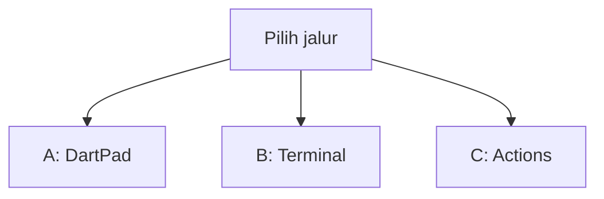
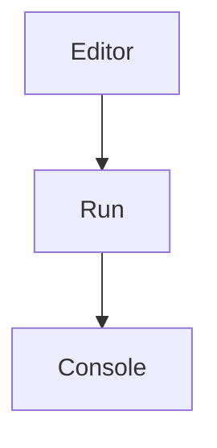
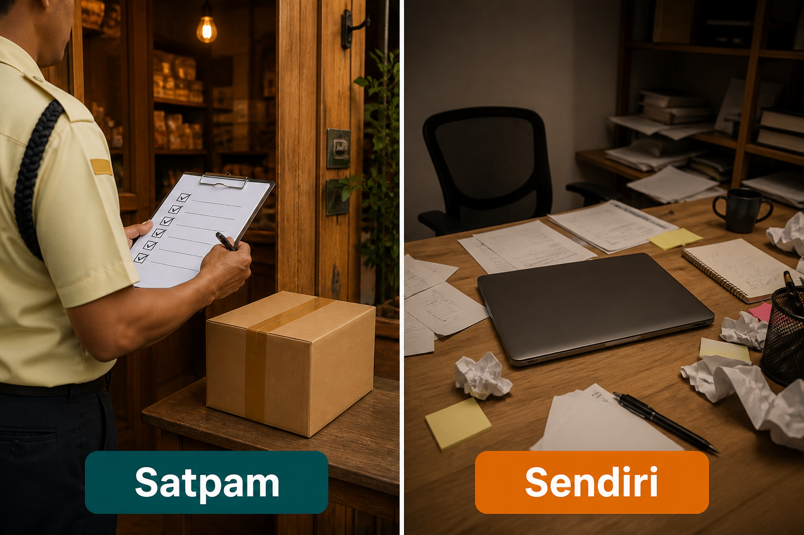
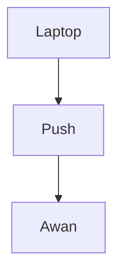
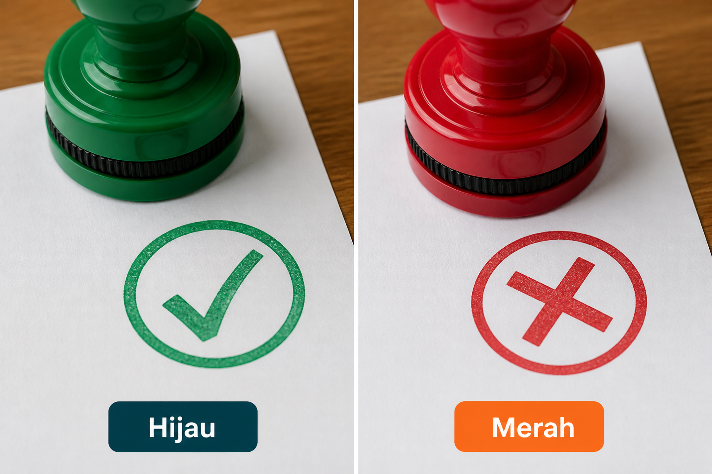

# Lampiran L5 — GitHub Actions mini

**Waktu:** 1–2 sesi  
**Prasyarat:** Modul 00 (Git, GitHub, `git push`) dan Modul 09 (`flutter analyze` di Terminal).  
**Hasil:** Nanti `flutter analyze` jalan **otomatis saat push** — satpam di awan, bukan unggah bundel ke Play.

Ini **lampiran**, bukan syarat lulus jalur wajib (Modul 00–11). Buka kalau proyek Flutter Anda sudah di GitHub, dan Anda ingin mesin mengulang cek yang sama setiap kali kode naik.

---

## Buka alat ini dulu

Berkas langkah GitHub **tidak** dijalankan di [DartPad](https://dartpad.dev). DartPad hanya untuk bentuk daftar isu. Perintah `flutter analyze` tetap di Terminal (Modul 09). Tab **Actions** hanya di browser, di **repositori proyek Flutter Anda** — bukan di repo materi `mobile2026` (itu folder bacaan, bukan app).

| Jalur | Buka | Untuk apa |
| --- | --- | --- |
| A | Browser → [dartpad.dev](https://dartpad.dev) → mode **Dart** | Daftar isu sebagai `Map` (hijau vs merah) |
| B | VS Code + Terminal (`Ctrl + J`) di folder proyek Flutter | `flutter analyze` di laptop dulu |
| C | Browser → GitHub → tab **Actions** | Satpam di awan setelah push |



Letak tombol di DartPad (bukan sketsa):




Sumber gambar: [dart.dev/tools/dartpad](https://dart.dev/tools/dartpad), Dart team / Google ([CC BY 4.0](https://creativecommons.org/licenses/by/4.0/)). Foto resmi itu **tema gelap** dan **mode Dart**. Kalau kelihatan seperti kotak hitam, gulir sampai editor kiri dan tombol **Run** terlihat; itu bukan gambar rusak. Mode **Dart** pas untuk uji 1. Berkas langkah **tidak** diuji di sini.

### Dua jenis kode di halaman ini

| Jenis | Tanda | Caranya |
| --- | --- | --- |
| **Berkas lengkap** | Ada `void main()` | Tempel utuh, lalu **Run** (alat yang disebut di kotak uji) |
| **Cuplikan** | Hanya potongan | Jangan di-Run sendirian |

### Pola uji A — DartPad Dart

| | |
| --- | --- |
| **Buka** | [dartpad.dev](https://dartpad.dev) |
| **Pilih** | mode **Dart** |
| **Tempel** | **berkas lengkap** |
| **Klik** | **Run** |
| **Kalau berhasil** | Console menulis berkas mana yang hijau, mana yang merah |

### Pola uji B — proyek lokal

| | |
| --- | --- |
| **Buka** | VS Code di folder proyek Flutter Anda (ada `pubspec.yaml`) |
| **Terminal** | `Ctrl + J` |
| **Ketik** | perintah di mini proyek, di folder proyek |
| **Kalau berhasil** | Terminal menulis `No issues found!` atau daftar peringatan yang Anda perbaiki dulu |

> **Aturan emas:** perintah `flutter ...` dan `git ...` hanya di **Terminal VS Code**. DartPad tidak bicara ke GitHub. Jangan taruh kunci atau sandi di berkas langkah.

Praktik: **Windows → Android**. iOS: konsep satpam sama; membangun iOS tetap butuh Mac (bukan topik hari ini).

Nama resmi di GitHub: tab **Actions**. Artinya di materi ini: satpam. Tes, bundel Play, dan unggah toko **belum** dibahas — silabus menundanya.

---

## 1. Satpam, jangan sendiri

Cek di laptop saja = Anda sendiri di meja. Kadang terlewat. Satpam = mesin mengulang cek yang sama setiap kali kode naik ke GitHub.



*Ilustrasi asli materi mobile2026. Satpam = cek otomatis saat push. Sendiri = hanya di laptop, kadang terlewat.*

Nama di GitHub: **GitHub Actions**. Artinya sama: satpam.



Tanpa satpam, `flutter analyze` di Terminal Anda tidak menolong cabang yang orang lain push (Modul 00 + 09).

---

## 2. Daftar pendek, bukan karangan

Berkas kerja = daftar langkah pendek: ambil kode, pasang Flutter, `flutter pub get`, `flutter analyze`. Karangan = instruksi panjang yang mudah salah ketik.


*Ilustrasi asli materi mobile2026. Daftar = langkah pendek tiap kali. Karangan = instruksi panjang mudah salah.*

Berkas itu ditulis YAML (satu kali, lalu dipakai mesin). Letaknya di proyek Flutter Anda:

`.github/workflows/analyze.yml`

Bukan di DartPad. Bukan di repo materi ini.

Cuplikan (jalur C) — **jangan** di-Run di DartPad:

```yaml
name: Analyze
on:
  push:
jobs:
  analyze:
    runs-on: ubuntu-latest
    steps:
      - uses: actions/checkout@v4
      - uses: subosito/flutter-action@v2
        with:
          channel: stable
      - run: flutter pub get
      - run: flutter analyze
```

`ubuntu-latest` = komputer Linux di GitHub, bukan laptop Windows Anda. `subosito/flutter-action@v2` = cara komunitas memasang Flutter di komputer itu. Nomor `@v4` di dokumen mereka bisa lebih baru; cuplikan di atas cukup untuk mini proyek.

Sumber: [subosito/flutter-action](https://github.com/subosito/flutter-action), [GitHub Actions](https://docs.github.com/en/actions), [flutter analyze](https://docs.flutter.dev/tools/cli#analyze).

Jangan taruh kunci Maps, Firebase, atau sandi di berkas ini. Satpam mini hari ini tidak butuh kunci.

---

## 3. Hijau, jangan diam di merah

Hijau = analyze bersih, satpam setuju. Merah = ada peringatan atau kesalahan; perbaiki di laptop dulu, baru push lagi.



*Ilustrasi asli materi mobile2026. Hijau = analyze bersih. Merah = ada peringatan; perbaiki di laptop dulu.*

### Uji 1 — berkas mana yang hijau

| | |
| --- | --- |
| **Buka** | [dartpad.dev](https://dartpad.dev) |
| **Pilih** | mode **Dart** |
| **Tempel** | berkas lengkap di bawah |
| **Klik** | **Run** |
| **Kalau berhasil** | Console menulis `lib/main.dart: hijau` lalu `lib/daftar.dart: merah — perbaiki dulu` |

```dart
void main() {
  final cek = [
    {'berkas': 'lib/main.dart', 'isu': 0},
    {'berkas': 'lib/daftar.dart', 'isu': 2},
  ];
  for (final b in cek) {
    final isu = b['isu'] as int;
    print('${b['berkas']}: ${isu == 0 ? 'hijau' : 'merah — perbaiki dulu'}');
  }
}
```

Angka `isu` di contoh itu **latihan bentuk**. Di laptop, yang dihitung mesin adalah keluaran `flutter analyze` sungguhan (jalur B), bukan `Map` ini.

Di GitHub, hijau/merah itu yang kelihatan di tab **Actions** (jalur C). Jangan menghafal `daftar.dart` sebagai “proyek saya.”

---

## 4. Laptop dulu, baru awan

Perintahnya sama: `flutter analyze`. Laptop = Anda ketik di Terminal. Awan = mesin GitHub mengulang perintah itu setelah push.


*Ilustrasi asli materi mobile2026. Laptop = analyze di Terminal. Awan = mesin GitHub mengulang perintah yang sama.*

Kalau laptop masih merah, jangan harap awan jadi hijau. Kalau laptop hijau tapi awan merah: versi Flutter di komputer Linux GitHub bisa beda dengan yang di Windows Anda — samakan saluran `stable`, atau catat versi di `pubspec.yaml` menurut tautan pemasang Flutter di sumber gambar.

Satpam **tidak** mengganti cek di laptop. Modul 09 tetap: rapikan dulu, baru naikkan kode.

---

## Mini proyek lampiran ini

Satu berkas kerja: `flutter analyze` otomatis saat push. Urutan jangan terbalik. Pakai **proyek Flutter Anda** (ada `pubspec.yaml`), yang sudah di GitHub (Modul 00). Jangan menaruh berkas ini di repo materi `mobile2026`.

1. Analyze di laptop, di folder proyek:

| | |
| --- | --- |
| **Buka** | Terminal VS Code di folder proyek Flutter |
| **Ketik** | perintah di bawah |

```text
flutter analyze
```

**Kalau berhasil:** `No issues found!` Kalau ada daftar peringatan: perbaiki dulu. Jangan lanjut langkah 2 sambil merah.

2. Buat folder `.github/workflows/` di **akar** proyek Flutter (sejajar `pubspec.yaml`, bukan di dalam `lib/`).
3. Buat berkas `analyze.yml`. Isi = cuplikan bagian 2. Simpan. Spasi di YAML penting: jangan campur tab.
4. Commit dan push (Modul 00), di folder proyek:

| | |
| --- | --- |
| **Buka** | Terminal VS Code di folder proyek Flutter |
| **Ketik** | perintah di bawah |

```text
git add .github/workflows/analyze.yml
git commit -m "Add analyze check on push"
git push
```

**Kalau berhasil:** `git push` selesai tanpa gagal. Ganti perintah `git push` Anda yang biasa kalau remote-nya sudah disetel.

5. Di browser: buka repositori proyek → tab **Actions**. Pilih cek yang baru. Tunggu sampai selesai.

**Kalau berhasil:** tanda hijau; log memuat `flutter analyze` dan `No issues found!` (atau setara). Nama/kunci **tidak** ada di log.

6. Jangan tambah `flutter build appbundle`, unggah Play, atau kunci toko ke berkas ini. Itu bukan mini proyek hari ini.

Bonus (bukan syarat): jalankan satpam juga saat orang minta gabung, dengan menambah `pull_request:` di bawah `on:`. Tetap hanya `flutter analyze`.

---

## Kesalahan yang sering terjadi

| Gejala | Penyebab yang sering | Perbaikan |
| --- | --- | --- |
| Awan merah, laptop hijau | versi Flutter beda | saluran `stable` di cuplikan; cek log Actions |
| Awan hijau, Anda tidak cek laptop | satpam dianggap pengganti Modul 09 | tetap `flutter analyze` di Terminal dulu |
| DartPad merah setelah tempel YAML | YAML bukan Dart | jalur C; uji 1 hanya `Map` |
| Satpam tidak jalan | berkas bukan di `.github/workflows/` | akar proyek Flutter, nama `.yml` |
| Log memuat kunci | kunci ditulis di YAML | hapus; satpam mini tidak butuh kunci |
| `pubspec.yaml` tidak ketemu | YAML di repo materi, atau folder salah | proyek Flutter Anda, bukan `mobile2026` |
| Mengira L5 = bundel Play | unggah toko ditunda silabus | hari ini hanya analyze |
| YAML rusak | tab campur spasi | salin cuplikan; spasi 2 |

---

## Latihan

1. (DartPad) Di uji 1, tambah baris ketiga: berkas `lib/masuk.dart`, isu `0` (hijau).
2. (Jalur B) `flutter analyze` di proyek Flutter Anda sampai `No issues found!`
3. (Jalur C) Satu berkas `analyze.yml`, push, hijau di tab **Actions**.
4. (Jalur B + C) Sengaja biarkan satu peringatan, push, lihat merah; perbaiki, push lagi, hijau.
5. (Jalur C) Cari di YAML: jangan ada kunci atau sandi.

---

## Kuis singkat

1. Kenapa berkas `analyze.yml` tidak diuji di DartPad?
2. Apakah lampiran ini membangun bundel Play secara otomatis?
3. Bolehkah kunci Firebase ditulis di YAML “supaya satpam bisa jalan”?
4. Laptop hijau, awan merah — langkah pertama yang masuk akal?
5. Apakah satpam mengganti `flutter analyze` di Terminal?

Kunci jawaban di bawah. Coba jawab dulu.

---

## Apa yang belum dibahas

- `flutter test` di Actions, `dart format` otomatis, cache paket
- Unggah `.aab` ke Play, kunci toko di rahasia GitHub
- Unggah peta nama Crashlytics (L4) lewat Actions
- Banyak versi Flutter sekaligus, komputer Mac untuk iOS
- Lampiran L6 Share, URL, WhatsApp

---

## Kunci kuis

1. Itu berkas langkah GitHub, bukan Dart. DartPad tidak push ke repo Anda.
2. Tidak. Mini hari ini hanya `flutter analyze`. Unggah toko ditunda silabus.
3. Tidak. Satpam mini tidak butuh kunci. Jangan tulis sandi di YAML.
4. Baca log Actions; bandingkan versi Flutter. Perbaiki di laptop, push lagi.
5. Tidak. Laptop dulu (Modul 09), satpam mengulang setelah push.

---

## Sumber gambar dan tautan

| Aset | Sumber |
| --- | --- |
| `images/analogi-satpam-sendiri.png` | Ilustrasi asli materi mobile2026 |
| `images/analogi-daftar-karangan.png` | Ilustrasi asli materi mobile2026 |
| `images/analogi-hijau-merah.png` | Ilustrasi asli materi mobile2026 |
| `images/analogi-laptop-awan.png` | Ilustrasi asli materi mobile2026 |
| Tampilan DartPad | [dart.dev/assets/img/dartpad-hello.png](https://dart.dev/assets/img/dartpad-hello.png) dari [dart.dev/tools/dartpad](https://dart.dev/tools/dartpad) ([CC BY 4.0](https://creativecommons.org/licenses/by/4.0/)) |
| GitHub Actions | [docs.github.com/en/actions](https://docs.github.com/en/actions) |
| `subosito/flutter-action` | [github.com/subosito/flutter-action](https://github.com/subosito/flutter-action) |
| `flutter analyze` | [docs.flutter.dev/tools/cli](https://docs.flutter.dev/tools/cli#analyze) |
| Paket DartPad | [github.com/dart-lang/dart-pad/wiki/Package-and-plugin-support](https://github.com/dart-lang/dart-pad/wiki/Package-and-plugin-support) |
| Modul 00 Git / GitHub | [modul-00-persiapan/README.md](../../modul-00-persiapan/README.md) |
| Modul 09 `flutter analyze` | [modul-09-kualitas/README.md](../../modul-09-kualitas/README.md) |

Flutter and the related logo are trademarks of Google LLC. GitHub and GitHub Actions are trademarks of GitHub, Inc. We are not endorsed by or affiliated with Google LLC or GitHub, Inc.
