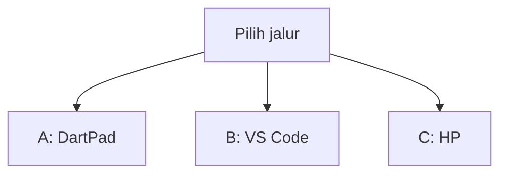
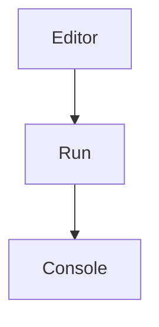
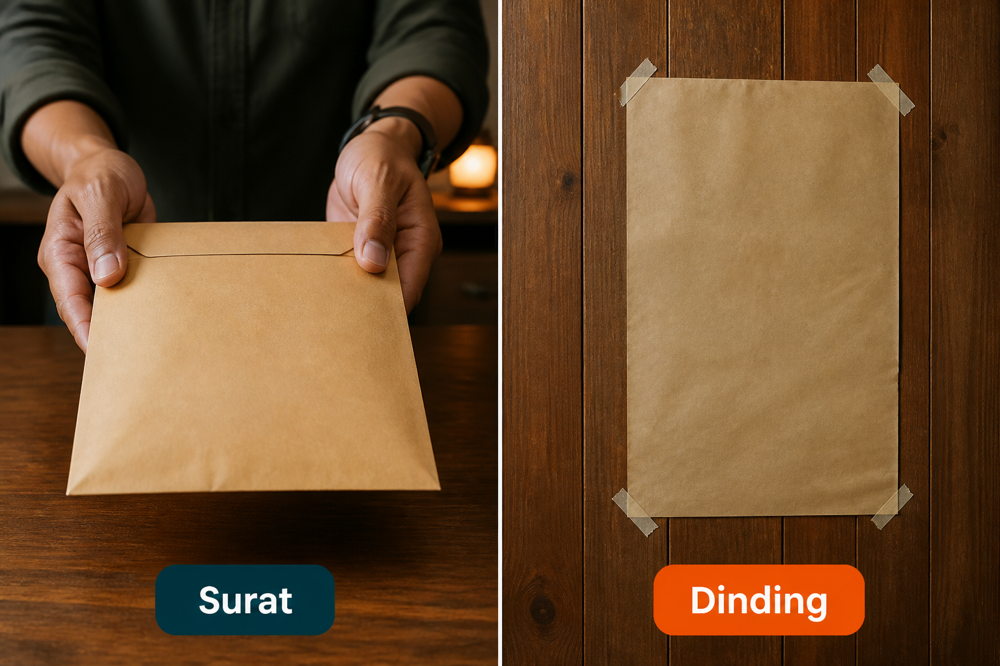
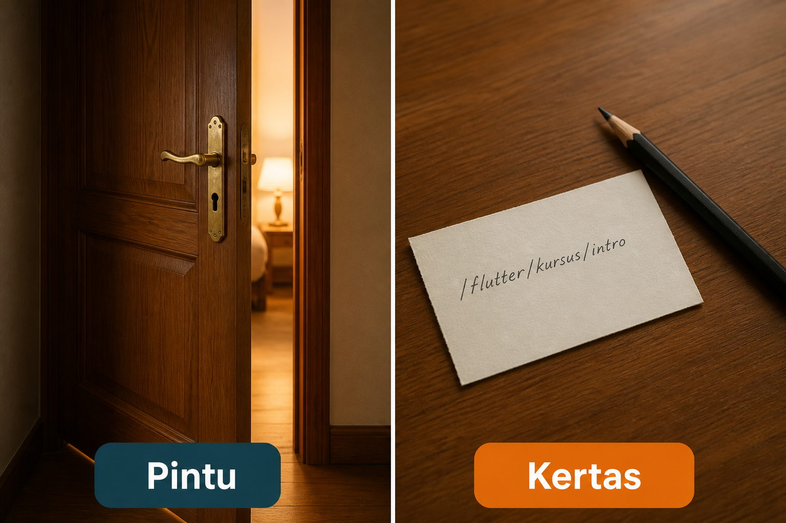
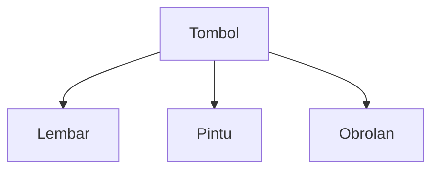
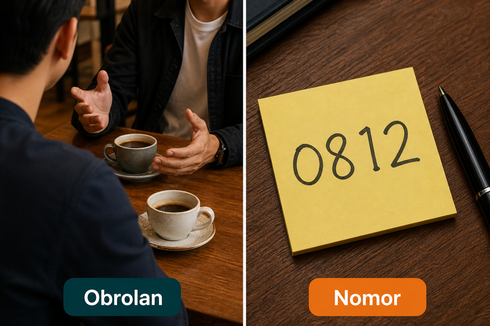
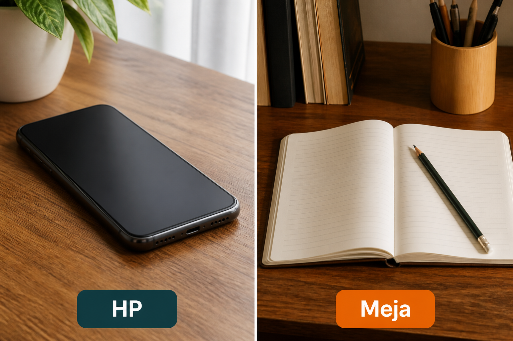

# Lampiran L6 — Share, URL, WhatsApp

**Waktu:** 1–2 sesi  
**Prasyarat:** Modul 03 (tombol, buka tautan di kepala) dan jalur B VS Code + emulator/HP.  
**Hasil:** Nanti Anda bisa **mengirim lembar**, **membuka tautan**, dan **merangkai `wa.me`** — tanpa menaruh nomor orang sungguhan di materi.

Ini **lampiran**, bukan syarat lulus jalur wajib (Modul 00–11). Buka kapan saja setelah Modul 03, kalau app Anda perlu “kirim ke teman” atau “buka percakapan.”

---

## Buka alat ini dulu

Paket `share_plus` dan `url_launcher` **tidak** ada di [daftar paket DartPad](https://github.com/dart-lang/dart-pad/wiki/Package-and-plugin-support). DartPad hanya untuk merangkai tautan sebagai teks. Lembar kirim dan pintu ke app lain butuh HP.

| Jalur | Buka | Untuk apa |
| --- | --- | --- |
| A | Browser → [dartpad.dev](https://dartpad.dev) → mode **Dart** | Bentuk tautan `https` dan `wa.me` |
| B | VS Code + Terminal (`Ctrl + J`) + emulator/HP | Tombol kirim, buka tautan |
| C | HP dengan WhatsApp terpasang | Uji tautan obrolan sungguhan |



Letak tombol di DartPad (bukan sketsa):




Sumber gambar: [dart.dev/tools/dartpad](https://dart.dev/tools/dartpad), Dart team / Google ([CC BY 4.0](https://creativecommons.org/licenses/by/4.0/)). Foto resmi itu **tema gelap** dan **mode Dart**. Kalau kelihatan seperti kotak hitam, gulir sampai editor kiri dan tombol **Run** terlihat; itu bukan gambar rusak. Mode **Dart** pas untuk uji 1. Paket HP **tidak** diuji di sini.

### Dua jenis kode di halaman ini

| Jenis | Tanda | Caranya |
| --- | --- | --- |
| **Berkas lengkap** | Ada `void main()` | Tempel utuh, lalu **Run** (alat yang disebut di kotak uji) |
| **Cuplikan** | Hanya potongan | Jangan di-Run sendirian |

### Pola uji A — DartPad Dart

| | |
| --- | --- |
| **Buka** | [dartpad.dev](https://dartpad.dev) |
| **Pilih** | mode **Dart** |
| **Tempel** | **berkas lengkap** |
| **Klik** | **Run** |
| **Kalau berhasil** | Console menulis tautan mana yang boleh, mana yang jangan |

### Pola uji B — proyek lokal

| | |
| --- | --- |
| **Buka** | VS Code di folder proyek Flutter Anda (ada `pubspec.yaml`), emulator atau HP sudah menyala |
| **Terminal** | `Ctrl + J` |
| **Ketik** | perintah di mini proyek, di folder proyek |
| **Kalau berhasil** | tombol kirim membuka lembar; tombol tautan membuka browser; tombol obrolan membuka WhatsApp (jalur C) |

> **Aturan emas:** perintah `flutter ...` hanya di **Terminal VS Code**. DartPad tidak membuka WhatsApp. Jangan taruh nomor HP orang sungguhan, token, atau sandi di teks yang dikirim.

Praktik: **Windows → Android**. iOS: konsep sama; membangun iOS butuh Mac.

Nama resmi paket: `share_plus` (lembar kirim), `url_launcher` (pintu tautan). Tautan obrolan WhatsApp: `wa.me`. Bukan API bisnis WhatsApp — itu **belum** dibahas.

---

## 1. Surat, jangan dinding

Lembar kirim = surat yang orang pilih mau dikirim ke mana (pesan, email, simpan). Dinding = teks hanya nempel di dalam app, orang tidak bisa membawanya keluar.



*Ilustrasi asli materi mobile2026. Surat = lembar kirim. Dinding = hanya tempel di app.*

Nama paket: `share_plus`. Artinya sama: surat.

Cuplikan (jalur B) — **jangan** di-Run di DartPad:

```dart
// Cuplikan. Teks pendek, tanpa token.
await Share.share('Lihat menu: https://contoh.id/menu');
```

Sumber: [`share_plus`](https://pub.dev/packages/share_plus).

Jangan `Share.share` isi profil, sandi, atau kunci Maps.

---

## 2. Pintu, bukan kertas alamat

Membuka tautan = pintu ke browser atau app lain. Kertas = URL hanya tertulis di layar; orang harus salin manual.



*Ilustrasi asli materi mobile2026. Pintu = buka tautan. Kertas = URL hanya tulisan.*

Nama paket: `url_launcher`. Di lampiran L2 paket yang sama membuka jendela bayar. Di sini: tautan biasa.



Cuplikan (jalur B) — **jangan** di-Run di DartPad:

```dart
// Cuplikan. Pakai https, bukan http.
await launchUrl(
  Uri.parse('https://contoh.id/menu'),
  mode: LaunchMode.externalApplication,
);
```

Sumber: [`url_launcher`](https://pub.dev/packages/url_launcher). Kalau tombol diam di Android: ikuti langkah pemasangan di halaman paket itu (daftar tautan yang boleh dibuka). Jangan tebak dari chat.

---

## 3. Obrolan, jangan nomor di kertas

`wa.me` = tautan yang membuka percakapan WhatsApp, lengkap dengan teks siap kirim. Nomor di kertas = angka HP di layar; orang harus mengetik ulang.



*Ilustrasi asli materi mobile2026. Obrolan = tautan wa.me. Nomor = angka HP yang harus disalin.*

Bentuk resmi (tanpa `+`, tanpa `0` di depan): `https://wa.me/62…?text=…`. Kode negara **62**, bukan `0812…`.

Sumber: [klik untuk chat WhatsApp](https://faq.whatsapp.com/591339215614875).

### Uji 1 — tautan mana yang boleh

| | |
| --- | --- |
| **Buka** | [dartpad.dev](https://dartpad.dev) |
| **Pilih** | mode **Dart** |
| **Tempel** | berkas lengkap di bawah |
| **Klik** | **Run** |
| **Kalau berhasil** | Console menulis `62…: boleh jadi tautan`, `0812…: jangan — pakai 62`, lalu `https: boleh dibuka` dan `http: jangan — bukan https` |

```dart
void main() {
  final daftar = [
    {'jenis': 'wa', 'nomor': '6281200000000'},
    {'jenis': 'wa', 'nomor': '081200000000'},
    {'jenis': 'web', 'url': 'https://contoh.id/menu'},
    {'jenis': 'web', 'url': 'http://contoh.id/menu'},
  ];
  for (final d in daftar) {
    if (d['jenis'] == 'wa') {
      final nomor = d['nomor'] as String;
      final ok = nomor.startsWith('62');
      print('$nomor: ${ok ? 'boleh jadi tautan' : 'jangan — pakai 62, bukan 0'}');
    } else {
      final url = d['url'] as String;
      final ok = url.startsWith('https://');
      print('$url: ${ok ? 'boleh dibuka' : 'jangan — bukan https'}');
    }
  }
}
```

Nomor di contoh itu **palsu**. Jangan diganti jadi nomor orang sungguhan, lalu dikirim ke mana pun.

Cuplikan obrolan (jalur B + C) — **jangan** di-Run di DartPad:

```dart
// Cuplikan. Nomor palsu; ganti hanya di HP Anda, milik Anda.
final tautan = Uri.https('wa.me', '/6281200000000', {
  'text': 'Halo, lihat menu https://contoh.id/menu',
});
await launchUrl(tautan, mode: LaunchMode.externalApplication);
```

`Uri.https` mengisi spasi di `text` supaya tautan tidak rusak. Jangan merangkai `?text=` dengan spasi mentah.

---

## 4. HP dulu, meja hanya merangkai

Paket HP buka di HP. Meja = DartPad: Anda merangkai teks tautan, tidak mengetuk lembar sungguhan.



*Ilustrasi asli materi mobile2026. HP = lembar dan pintu di emulator/HP. Meja = DartPad merangkai tautan sebagai teks.*

Kalau WhatsApp tidak terpasang di emulator, jalur C pakai HP USB. Emulator boleh untuk lembar kirim dan tautan `https`.

---

## Mini proyek lampiran ini

Satu layar, tiga tombol: kirim, buka tautan, obrolan. Urutan jangan terbalik. Pakai **proyek Flutter Anda**.

1. Paket, di folder proyek:

| | |
| --- | --- |
| **Buka** | Terminal VS Code di folder proyek Flutter |
| **Ketik** | perintah di bawah |

```text
flutter pub add share_plus url_launcher
```

**Kalau berhasil:** kedua nama paket ada di `pubspec.yaml`.

2. Ikuti langkah Android di halaman `url_launcher` (daftar tautan yang boleh dibuka). Tanpa itu, tombol pintu sering diam.
3. Satu tombol **Kirim** memakai cuplikan `Share.share` (bagian 1). Teks pendek, tanpa token.
4. Satu tombol **Buka menu** memakai cuplikan `launchUrl` `https://contoh.id/menu` (bagian 2).
5. Satu tombol **Obrolan** memakai cuplikan `wa.me` (bagian 3). Nomor di kode = nomor **Anda**, atau nomor uji yang Anda punya. Jangan nomor orang tanpa izin.
6. Jalankan:

| | |
| --- | --- |
| **Buka** | VS Code, emulator atau HP menyala |
| **Terminal** | `Ctrl + J` |
| **Ketik** | perintah di bawah |

```text
flutter run
```

**Kalau berhasil:** Kirim → lembar pilihan app. Buka menu → browser. Obrolan (jalur C) → WhatsApp dengan teks siap kirim. Tidak ada token di lembar.

7. Jangan kirim sandi, kunci Firebase, atau isi profil. UU PDP (Modul 09) tetap berlaku di teks yang dibagikan.

Bonus (bukan syarat): `canLaunchUrl` sebelum `launchUrl`, lalu tampilkan wajah gagal (Modul 09) kalau WhatsApp tidak ada.

---

## Kesalahan yang sering terjadi

| Gejala | Penyebab yang sering | Perbaikan |
| --- | --- | --- |
| DartPad merah setelah `import share_plus` | paket tidak ada di DartPad | jalur B; uji 1 hanya teks tautan |
| Tombol pintu diam | daftar tautan Android belum diisi | halaman `url_launcher`, bagian Android |
| WhatsApp tidak terbuka | emulator tanpa WhatsApp, atau nomor `0812…` | HP USB; nomor mulai `62` |
| Tautan obrolan aneh | spasi mentah di `?text=` | `Uri.https` seperti cuplikan |
| Nomor orang di kode | disalin dari kontak tanpa izin | nomor Anda, atau hapus sebelum unggah |
| Token ikut terkirim | `Share.share` memakai isi profil | teks menu / tautan publik saja |
| `http://` tidak dibuka | Android menolak http biasa | `https://` |
| Mengira L6 = API bisnis WhatsApp | silabus hanya `wa.me` | tautan obrolan, bukan dapur WhatsApp |

---

## Latihan

1. (DartPad) Di uji 1, tambah baris `wa` ketiga: nomor `62813xxxxxxxx` (palsu, mulai `62`).
2. (Jalur B) `Share.share` satu kalimat + tautan `https` milik contoh, bukan kunci.
3. (Jalur B) Tombol pintu ke `https://flutter.dev` — bukan `http`.
4. (Jalur C) Satu tautan `wa.me` ke nomor Anda; teks tanpa nama orang lain.
5. (Jalur B) `git grep` `Share.share` / `wa.me` — jangan token, jangan `0812` di tautan.

---

## Kuis singkat

1. Kenapa `share_plus` tidak diuji di DartPad?
2. Apakah `081212345678` boleh langsung di belakang `wa.me/`?
3. Bolehkah `Share.share` mengirim token masuk “supaya teman bisa coba app”?
4. Tombol buka tautan diam di Android — langkah pertama yang masuk akal?
5. Apakah lampiran ini memakai API bisnis WhatsApp?

Kunci jawaban di bawah. Coba jawab dulu.

---

## Apa yang belum dibahas

- Kirim berkas / foto lewat lembar, bagikan ke banyak app sekaligus
- API bisnis WhatsApp, bot, atau unggah ke status
- App Link / tautan yang membuka layar tertentu di app Anda (Modul 08 menyebut konsep; bukan mini ini)
- Lampiran L7 update paksa, L8 biometrik, L9 QR

---

## Kunci kuis

1. Itu paket HP; tidak ada di DartPad. Butuh proyek Flutter + emulator/HP.
2. Tidak. Pakai `62…` tanpa `0` di depan. `0812…` bukan bentuk `wa.me`.
3. Tidak. Kirim tautan publik / teks menu, bukan kunci. UU PDP (Modul 09).
4. Cek langkah Android di halaman `url_launcher` (daftar tautan). Lalu `https`, bukan `http`.
5. Tidak. Mini hari ini hanya tautan `wa.me` (klik untuk chat).

---

## Sumber gambar dan tautan

| Aset | Sumber |
| --- | --- |
| `images/analogi-surat-dinding.png` | Ilustrasi asli materi mobile2026 |
| `images/analogi-pintu-kertas.png` | Ilustrasi asli materi mobile2026 |
| `images/analogi-obrolan-nomor.png` | Ilustrasi asli materi mobile2026 |
| `images/analogi-hp-meja.png` | Ilustrasi asli materi mobile2026 |
| Tampilan DartPad | [dart.dev/assets/img/dartpad-hello.png](https://dart.dev/assets/img/dartpad-hello.png) dari [dart.dev/tools/dartpad](https://dart.dev/tools/dartpad) ([CC BY 4.0](https://creativecommons.org/licenses/by/4.0/)) |
| `share_plus` | [pub.dev/packages/share_plus](https://pub.dev/packages/share_plus) |
| `url_launcher` | [pub.dev/packages/url_launcher](https://pub.dev/packages/url_launcher) |
| Klik untuk chat WhatsApp | [faq.whatsapp.com/591339215614875](https://faq.whatsapp.com/591339215614875) |
| Paket DartPad | [github.com/dart-lang/dart-pad/wiki/Package-and-plugin-support](https://github.com/dart-lang/dart-pad/wiki/Package-and-plugin-support) |
| Modul 03 tombol / tautan | [modul-03-interaksi/README.md](../../modul-03-interaksi/README.md) |
| Lampiran L2 jendela bayar | [l2-pembayaran/README.md](../l2-pembayaran/README.md) |
| Modul 09 `print` / PDP | [modul-09-kualitas/README.md](../../modul-09-kualitas/README.md) |

Flutter and the related logo are trademarks of Google LLC. WhatsApp and the related logos are trademarks of WhatsApp LLC (Meta Platforms, Inc.). We are not endorsed by or affiliated with Google LLC or Meta Platforms, Inc.
