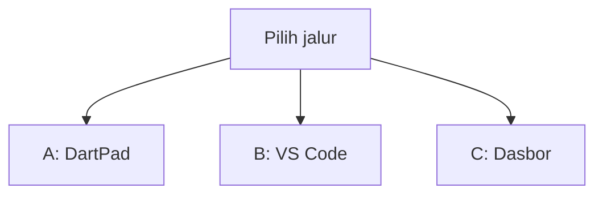
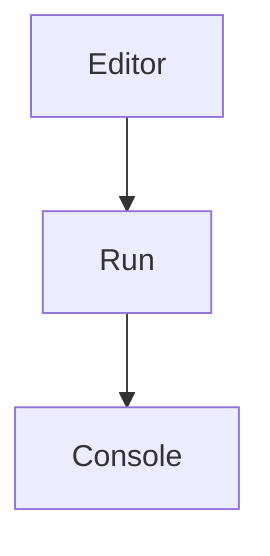
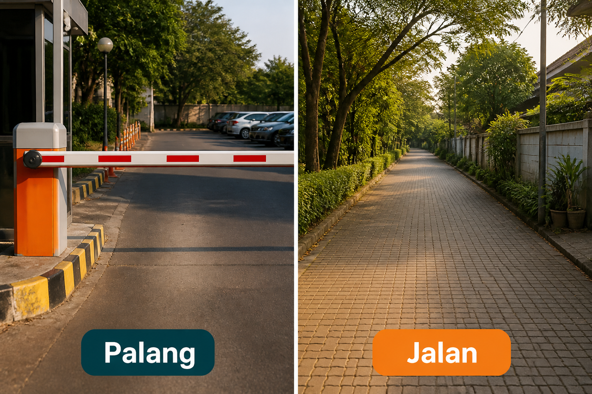
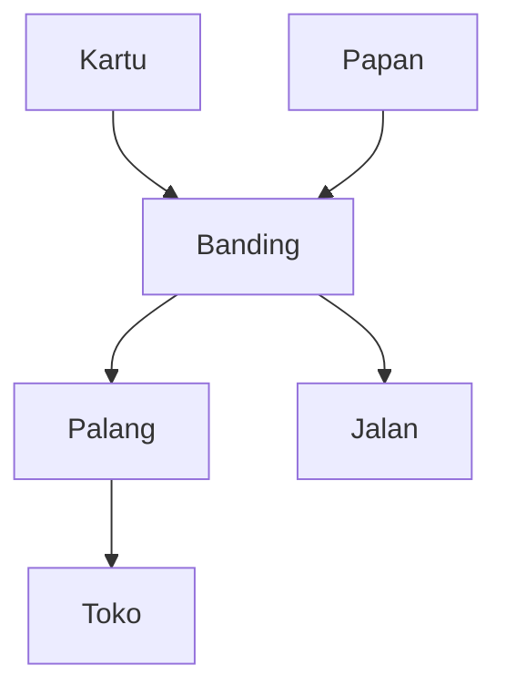
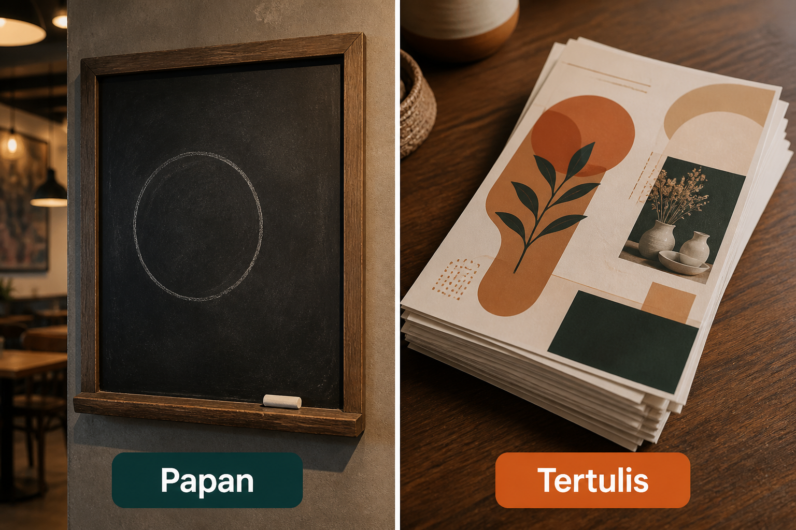
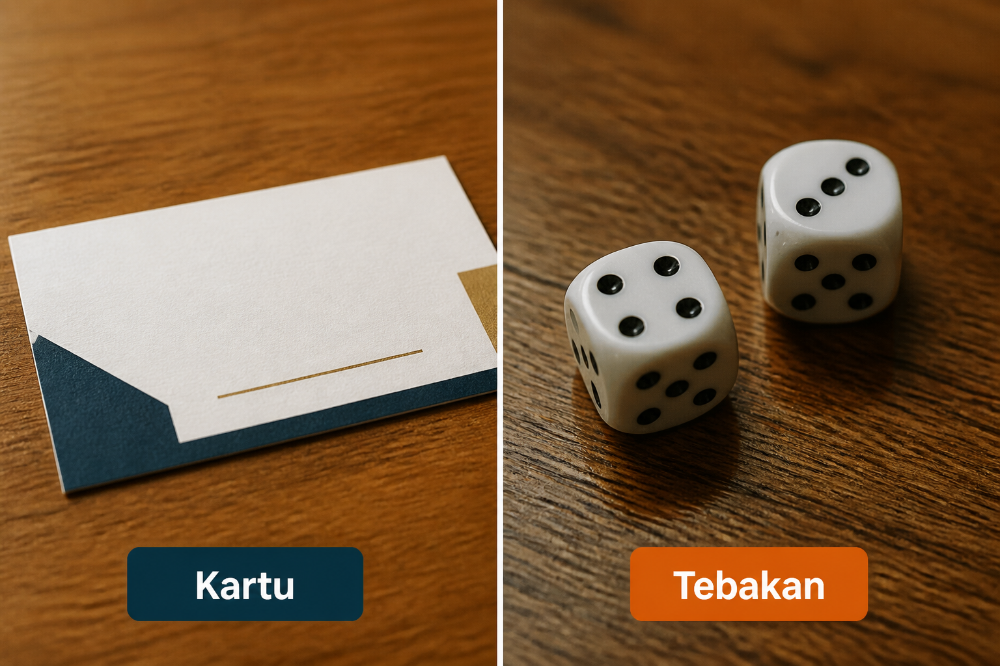
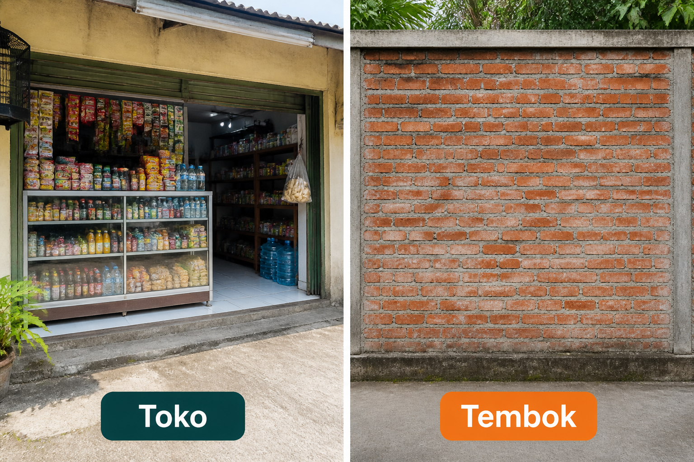

# Lampiran L7 — Update paksa

**Waktu:** 1–2 sesi  
**Prasyarat:** Modul 10 (nama versi vs kode unggah), Modul 06 (satu dokumen Firestore), jalur B VS Code + emulator/HP.  
**Hasil:** Nanti Anda bisa **memasang palang** kalau kode unggah di HP lebih kecil dari angka di papan — lalu membuka **toko**, tanpa menanam angka min di dalam kode.

Ini **lampiran**, bukan syarat lulus jalur wajib (Modul 00–11). Buka setelah Modul 10, kalau app sudah (atau hampir) di Play dan versi lama tidak boleh dipakai.

---

## Buka alat ini dulu

Paket `package_info_plus` dan plugin Firebase **tidak** ada di [daftar paket DartPad](https://github.com/dart-lang/dart-pad/wiki/Package-and-plugin-support). DartPad hanya untuk membandingkan angka. Palang sungguhan butuh HP.

| Jalur | Buka | Untuk apa |
| --- | --- | --- |
| A | Browser → [dartpad.dev](https://dartpad.dev) → mode **Dart** | Banding kode unggah vs angka min |
| B | VS Code + Terminal (`Ctrl + J`) + emulator/HP | Kartu nama app, palang, buka toko |
| C | Browser → [Console Firebase](https://console.firebase.google.com) | Ubah angka di papan, tanpa unggah ulang |



Letak tombol di DartPad (bukan sketsa):




Sumber gambar: [dart.dev/tools/dartpad](https://dart.dev/tools/dartpad), Dart team / Google ([CC BY 4.0](https://creativecommons.org/licenses/by/4.0/)). Foto resmi itu **tema gelap** dan **mode Dart**. Kalau kelihatan seperti kotak hitam, gulir sampai editor kiri dan tombol **Run** terlihat; itu bukan gambar rusak. Mode **Dart** pas untuk uji 1. Paket HP **tidak** diuji di sini.

### Dua jenis kode di halaman ini

| Jenis | Tanda | Caranya |
| --- | --- | --- |
| **Berkas lengkap** | Ada `void main()` | Tempel utuh, lalu **Run** (alat yang disebut di kotak uji) |
| **Cuplikan** | Hanya potongan | Jangan di-Run sendirian |

### Pola uji A — DartPad Dart

| | |
| --- | --- |
| **Buka** | [dartpad.dev](https://dartpad.dev) |
| **Pilih** | mode **Dart** |
| **Tempel** | **berkas lengkap** |
| **Klik** | **Run** |
| **Kalau berhasil** | Console menulis `palang` atau `jalan`, bukan error merah |

### Pola uji B — proyek lokal

| | |
| --- | --- |
| **Buka** | VS Code di folder proyek Flutter yang sudah Firebase (Modul 06), emulator atau HP sudah menyala |
| **Terminal** | `Ctrl + J` |
| **Ketik** | perintah di mini proyek, di folder proyek |
| **Kalau berhasil** | angka min 999 → layar palang + tombol toko; angka min 1 → app biasa |

> **Aturan emas:** perintah `flutter ...` hanya di **Terminal VS Code**. DartPad tidak membaca kartu nama app, dan tidak membuka Play. Jangan kunci orang tanpa tautan toko.

Praktik: **Windows → Android**. iOS: konsep sama; membangun iOS butuh Mac. Tautan etalase App Store **belum** dibahas.

Nama resmi: `package_info_plus` (kartu nama app). Angka min hari ini di **satu dokumen Firestore** (papan). Bukan papan pengumuman terpisah di Firebase, bukan unduhan dari dalam Play — itu **belum** dibahas.

---

## 1. Palang, jangan jalan terus

Versi lama yang merusak data, atau yang Play tolak, tidak boleh masuk. Palang = layar penuh, tidak ada tombol “nanti”. Jalan = kode unggah HP masih cukup.



*Ilustrasi asli materi mobile2026. Palang = versi lama tidak boleh dipakai. Jalan = kode unggah masih cukup.*

Himbauan (“ada versi baru, silakan nanti”) **bukan** mini hari ini. Mini: palang saja.



Banding memakai **kode unggah** (angka setelah `+` di `pubspec.yaml`, Modul 10), bukan nama versi sebagai teks.

---

## 2. Papan, jangan tertulis di kode

Angka min yang tertanam di Dart = kertas sudah dicetak. Mau naikkan palang, Anda harus unggah bundel baru. Papan = dokumen di dapur: Anda ubah angkanya di Console, HP membaca saat buka app.



*Ilustrasi asli materi mobile2026. Papan = angka min di Firestore, bisa diubah tanpa unggah ulang. Tertulis = angka tertanam di kode.*

Satu dokumen, misalnya `config/app`, field angka `minKodeUnggah`. Tulis lewat Console (jalur C), bukan dari HP orang.

Cuplikan (jalur B) — **jangan** di-Run di DartPad:

```dart
// Cuplikan. Setelah Firebase.initializeApp (Modul 06).
final snap =
    await FirebaseFirestore.instance.doc('config/app').get();
final min = snap.data()?['minKodeUnggah'] as int? ?? 0;
```

Aturan baca: dokumen itu harus **bisa dibaca** orang yang belum login — kalau tidak, palang tidak pernah kebaca. Jangan buka seluruh koleksi; hanya `config/app`. Tulis tetap di Console, bukan dari app. Pola rules ada di Modul 06.

Kalau papan **gagal** terbaca (offline, rules ketat): **jangan** otomatis palang. Anda bisa mengunci orang yang versinya masih cukup. Mini: wajah gagal + tombol coba lagi, app tetap boleh dipakai. Palang hanya jika angka min **sudah** ada, dan kode HP lebih kecil.

---

## 3. Kartu, jangan tebakan

Kartu = nama versi dan kode unggah yang terpasang di HP. Tebakan = menulis `1.0.0` di layar, atau membandingkan `"1.10.0"` dengan `"1.9.0"` sebagai teks.



*Ilustrasi asli materi mobile2026. Kartu = package_info_plus. Tebakan = mengira nama versi, atau membandingkannya sebagai teks.*

Nama paket: `package_info_plus`. `version` = nama versi (`versionName`). `buildNumber` = kode unggah (`versionCode`) — masih **teks**, jadi di-parse ke angka.

Sumber: [`package_info_plus`](https://pub.dev/packages/package_info_plus).

Cuplikan (jalur B) — **jangan** di-Run di DartPad:

```dart
// Cuplikan. Setelah WidgetsFlutterBinding.ensureInitialized, atau di dalam runApp.
final info = await PackageInfo.fromPlatform();
final kodeHp = int.parse(info.buildNumber);
```

### Uji 1 — palang atau jalan

| | |
| --- | --- |
| **Buka** | [dartpad.dev](https://dartpad.dev) |
| **Pilih** | mode **Dart** |
| **Tempel** | berkas lengkap di bawah |
| **Klik** | **Run** |
| **Kalau berhasil** | Console menulis `Nama versi sebagai teks: jangan dipakai`, lalu `HP 1, min 3: palang`, `HP 3, min 3: jalan`, `HP 5, min 3: jalan` |

```dart
void main() {
  print('Nama versi sebagai teks: jangan dipakai');
  final daftar = [
    [1, 3],
    [3, 3],
    [5, 3],
  ];
  for (final d in daftar) {
    final hp = d[0];
    final min = d[1];
    final palang = hp < min;
    print('HP $hp, min $min: ${palang ? 'palang' : 'jalan'}');
  }
}
```

Sama dengan min = jalan (masih boleh). Palang hanya jika HP **lebih kecil**.

Kenapa bukan nama versi? `"1.10.0"` sebagai teks kelihatan **lebih kecil** dari `"1.9.0"`, padahal 1.10 lebih baru. Pakai kode unggah.

---

## 4. Toko, jangan tembok

Palang tanpa tautan toko = tembok. Orang terjebak di layar, tidak bisa mengunduh versi baru. Toko = tombol yang membuka etalase Play.



*Ilustrasi asli materi mobile2026. Toko = buka etalase Play. Tembok = palang tanpa tautan.*

Pakai `url_launcher` (lampiran L6, jendela yang sama). Tautan Android:

`https://play.google.com/store/apps/details?id=` + `applicationId` Anda (Modul 10).

Cuplikan (jalur B) — **jangan** di-Run di DartPad:

```dart
// Cuplikan. Ganti id.namaanda.komunitasmini sesuai applicationId.
await launchUrl(
  Uri.parse(
    'https://play.google.com/store/apps/details?id=id.namaanda.komunitasmini',
  ),
  mode: LaunchMode.externalApplication,
);
```

Sumber: [`url_launcher`](https://pub.dev/packages/url_launcher), [tautan ke Play](https://developer.android.com/distribute/marketing-tools/linking-to-google-play).

Kalau app **belum** di Play, etalase bisa menulis tidak ditemukan. Yang diuji mini: **pintu terbuka**, bukan “sudah lolos toko.” Jangan taruh kunci atau sandi di layar palang.

Layar palang jangan bisa ditutup pakai tombol kembali (lihat `PopScope` di Modul 03) — kalau bisa, itu bukan palang.

---

## Mini proyek lampiran ini

Satu gerbang di awal app: baca kartu + papan, lalu palang atau jalan. Urutan jangan terbalik. Pakai **proyek Flutter Anda** yang sudah Firebase.

1. Paket, di folder proyek:

| | |
| --- | --- |
| **Buka** | Terminal VS Code di folder proyek Flutter |
| **Ketik** | perintah di bawah |

```text
flutter pub add package_info_plus url_launcher
```

**Kalau berhasil:** kedua nama paket ada di `pubspec.yaml`. `cloud_firestore` sudah dari Modul 06.

2. Console Firebase (jalur C): koleksi `config`, dokumen `app`, field angka `minKodeUnggah` = `999`. Rules: dokumen itu boleh dibaca; tulis hanya dari Console. Jangan buka seluruh basis.

3. Ikuti langkah Android di halaman `url_launcher` (daftar tautan yang boleh dibuka). Tanpa itu, tombol toko sering diam.

4. Setelah `Firebase.initializeApp`, baca kartu (`PackageInfo`) dan papan (cuplikan bagian 2). Banding seperti uji 1: `kodeHp < min` → palang.

5. Layar palang: teks pendek (“Silakan unduh versi baru”), **satu** tombol **Buka toko** (cuplikan bagian 4). Tidak ada tombol nanti. Tidak ada kunci.

6. Kalau papan gagal: wajah gagal (Modul 09) + coba lagi; **bukan** palang.

7. Jalankan:

| | |
| --- | --- |
| **Buka** | VS Code, emulator atau HP menyala |
| **Terminal** | `Ctrl + J` |
| **Ketik** | perintah di bawah |

```text
flutter run
```

**Kalau berhasil:** `minKodeUnggah` 999 → palang + toko terbuka (Play boleh “tidak ditemukan” jika belum diunggah). Ubah papan jadi `1` di Console, buka app lagi → jalan. Tidak ada unggah bundel di antara dua uji itu.

8. Kembalikan `minKodeUnggah` ke angka yang masuk akal sebelum unggah Play (jangan 999 tertinggal di dapur produksi).

Bonus (bukan syarat): himbauan terpisah, angka min kedua yang lebih kecil dari palang.

---

## Kesalahan yang sering terjadi

| Gejala | Penyebab yang sering | Perbaikan |
| --- | --- | --- |
| DartPad merah setelah `import package_info_plus` | paket tidak ada di DartPad | jalur B; uji 1 hanya angka |
| Palang tidak pernah muncul | `minKodeUnggah` 1, app `+1` atau lebih | uji dulu dengan 999 |
| Palang selalu, meski angka sudah 1 | rules menolak baca; kode mengunci saat gagal | cek rules; gagal = wajah, bukan palang |
| Tombol toko diam | daftar tautan Android belum diisi | halaman `url_launcher`, bagian Android |
| `"1.10"` kalah dari `"1.9"` | nama versi dibanding sebagai teks | kode unggah (`buildNumber`) |
| Mau ubah palang harus unggah bundel | angka min tertulis di Dart | pindah ke dokumen `config/app` |
| Orang tertahan tanpa unduhan | palang tanpa tautan, atau bisa ditutup kembali | tombol toko; `PopScope` |
| 999 tertinggal di produksi | lupa dikembalikan setelah uji | set angka min yang Anda maksud |

---

## Latihan

1. (DartPad) Di uji 1, tambah baris `HP 2, min 3` — harus `palang`.
2. (Jalur C) Naikkan `minKodeUnggah` ke `999`, buka app, pastikan palang.
3. (Jalur C) Turunkan ke `1`, buka app lagi — jalan, tanpa `flutter build appbundle`.
4. (Jalur B) Tombol toko memakai `applicationId` Anda, `https`, bukan `http`.
5. (Jalur B) Matikan jaringan, buka app — wajah gagal, bukan palang.

---

## Kuis singkat

1. Kenapa `package_info_plus` tidak diuji di DartPad?
2. Apakah `"1.10.0"` boleh dibanding `"1.9.0"` sebagai teks untuk palang?
3. Bolehkah angka min hanya ditulis di `main.dart` “supaya simpel”?
4. Papan gagal terbaca (offline) — palang atau tidak?
5. Apakah lampiran ini memakai unduhan dari dalam Play?

Kunci jawaban di bawah. Coba jawab dulu.

---

## Apa yang belum dibahas

- Papan Remote Config Firebase (nama resmi di Console; mini ini Firestore)
- Update dari dalam Play (`in_app_update`), unduhan diam-diam, jalur bertahap di Console
- Tautan etalase App Store / TestFlight (praktik hari ini Android)
- Himbauan “nanti”, dua ambang (himbauan vs palang)
- Lampiran L8 biometrik, L9 QR

---

## Kunci kuis

1. Itu paket HP; tidak ada di DartPad. Butuh proyek Flutter + emulator/HP.
2. Tidak. Pakai kode unggah. Nama versi sebagai teks menipu (1.10 vs 1.9).
3. Tidak. Itu kertas tercetak: ubah palang harus unggah bundel. Pakai papan.
4. Tidak. Palang hanya jika angka min sudah terbaca dan HP lebih kecil. Offline: wajah gagal.
5. Tidak. Mini hari ini palang + tautan etalase Play.

---

## Sumber gambar dan tautan

| Aset | Sumber |
| --- | --- |
| `images/analogi-palang-jalan.png` | Ilustrasi asli materi mobile2026 |
| `images/analogi-papan-tertulis.png` | Ilustrasi asli materi mobile2026 |
| `images/analogi-kartu-tebakan.png` | Ilustrasi asli materi mobile2026 |
| `images/analogi-toko-tembok.png` | Ilustrasi asli materi mobile2026 |
| Tampilan DartPad | [dart.dev/assets/img/dartpad-hello.png](https://dart.dev/assets/img/dartpad-hello.png) dari [dart.dev/tools/dartpad](https://dart.dev/tools/dartpad) ([CC BY 4.0](https://creativecommons.org/licenses/by/4.0/)) |
| `package_info_plus` | [pub.dev/packages/package_info_plus](https://pub.dev/packages/package_info_plus) |
| `url_launcher` | [pub.dev/packages/url_launcher](https://pub.dev/packages/url_launcher) |
| Tautan ke Play | [developer.android.com/distribute/marketing-tools/linking-to-google-play](https://developer.android.com/distribute/marketing-tools/linking-to-google-play) |
| Paket DartPad | [github.com/dart-lang/dart-pad/wiki/Package-and-plugin-support](https://github.com/dart-lang/dart-pad/wiki/Package-and-plugin-support) |
| Modul 10 versi / kode unggah | [modul-10-rilis/README.md](../../modul-10-rilis/README.md) |
| Modul 06 Firestore / rules | [modul-06-firebase/README.md](../../modul-06-firebase/README.md) |
| Lampiran L6 pintu tautan | [l6-share/README.md](../l6-share/README.md) |
| Modul 09 wajah gagal | [modul-09-kualitas/README.md](../../modul-09-kualitas/README.md) |

Flutter and the related logo are trademarks of Google LLC. Google Play and the Google Play logo are trademarks of Google LLC. We are not endorsed by or affiliated with Google LLC.
