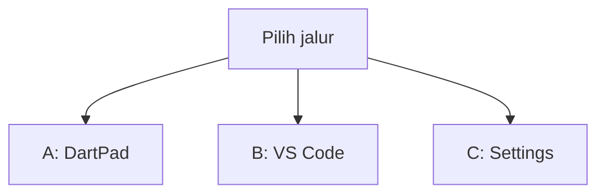
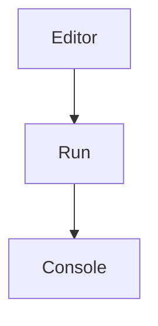
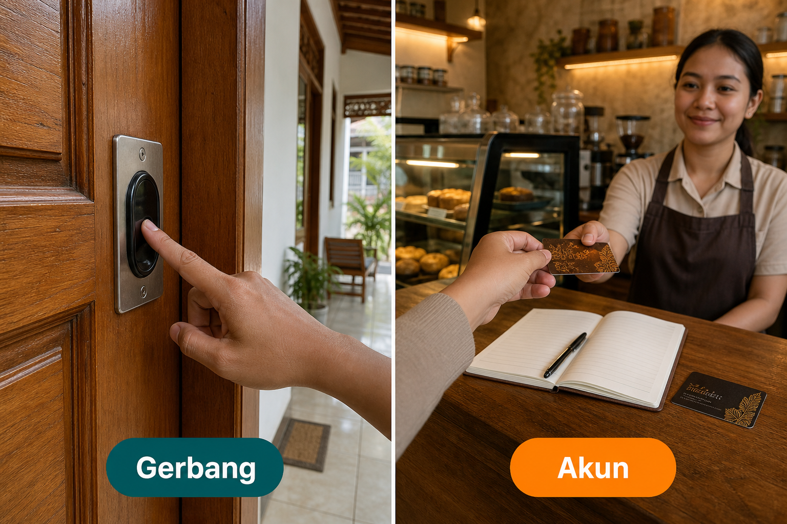
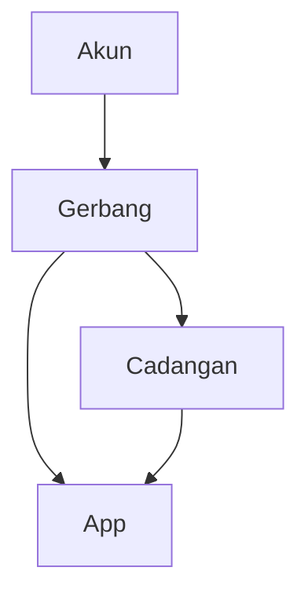
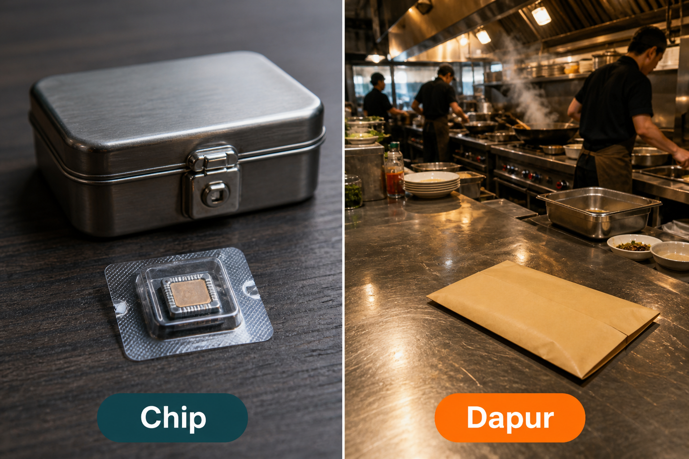
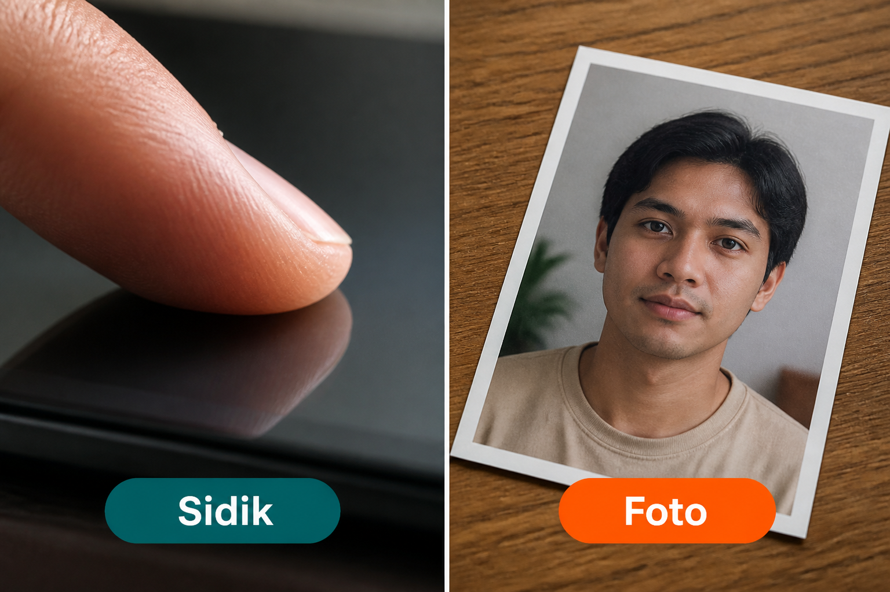
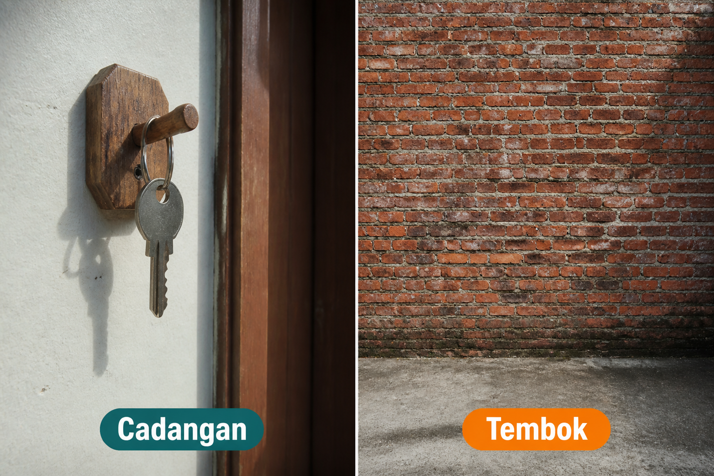

# Lampiran L8 — Biometrik

**Waktu:** 1–2 sesi  
**Prasyarat:** Modul 08 (akun email/Google), Modul 05 (brankas), jalur B VS Code + emulator/HP.  
**Hasil:** Nanti Anda bisa **memasang gerbang** di HP ini — sidik atau wajah sistem — tanpa mengganti login Modul 08, dan tanpa mengirim sidik ke dapur.

Ini **lampiran**, bukan syarat lulus jalur wajib (Modul 00–11). Buka setelah Modul 08, kalau orang sudah bisa masuk, dan Anda ingin kunci tambahan saat app dibuka lagi di HP yang sama.

---

## Buka alat ini dulu

Paket `local_auth` **tidak** ada di [daftar paket DartPad](https://github.com/dart-lang/dart-pad/wiki/Package-and-plugin-support). DartPad hanya untuk memutuskan *buka / cadangan / lewat*. Gerbang sungguhan butuh HP atau emulator.

| Jalur | Buka | Untuk apa |
| --- | --- | --- |
| A | Browser → [dartpad.dev](https://dartpad.dev) → mode **Dart** | Putus: gerbang, cadangan, atau lewat |
| B | VS Code + Terminal (`Ctrl + J`) + emulator/HP | Paket gerbang, layar satu tombol |
| C | Settings di emulator atau HP | Daftar sidik dulu, baru uji gerbang |



Letak tombol di DartPad (bukan sketsa):




Sumber gambar: [dart.dev/tools/dartpad](https://dart.dev/tools/dartpad), Dart team / Google ([CC BY 4.0](https://creativecommons.org/licenses/by/4.0/)). Foto resmi itu **tema gelap** dan **mode Dart**. Kalau kelihatan seperti kotak hitam, gulir sampai editor kiri dan tombol **Run** terlihat; itu bukan gambar rusak. Mode **Dart** pas untuk uji 1. Paket HP **tidak** diuji di sini.

### Dua jenis kode di halaman ini

| Jenis | Tanda | Caranya |
| --- | --- | --- |
| **Berkas lengkap** | Ada `void main()` | Tempel utuh, lalu **Run** (alat yang disebut di kotak uji) |
| **Cuplikan** | Hanya potongan | Jangan di-Run sendirian |

### Pola uji A — DartPad Dart

| | |
| --- | --- |
| **Buka** | [dartpad.dev](https://dartpad.dev) |
| **Pilih** | mode **Dart** |
| **Tempel** | **berkas lengkap** |
| **Klik** | **Run** |
| **Kalau berhasil** | Console menulis `lewat`, `buka`, atau `cadangan`, bukan error merah |

### Pola uji B — proyek lokal

| | |
| --- | --- |
| **Buka** | VS Code di folder proyek Flutter yang sudah login (Modul 08), emulator atau HP sudah menyala |
| **Terminal** | `Ctrl + J` |
| **Ketik** | perintah di mini proyek, di folder proyek |
| **Kalau berhasil** | orang sudah masuk → layar gerbang; sidik benar → rumah; sidik gagal → tetap di gerbang + coba lagi |

> **Aturan emas:** perintah `flutter ...` hanya di **Terminal VS Code**. DartPad tidak membaca sensor HP. Jangan mengunci orang di gerbang tanpa cadangan.

Praktik: **Windows → Android**. iOS: konsep sama (wajah sistem); membangun iOS butuh Mac. Kunci Face ID di berkas iOS **belum** dibahas.

Nama resmi: `local_auth` (gerbang HP). Sidik dan wajah yang dipakai adalah **milik sistem**, bukan kamera app. Bukan kirim gambar wajah ke Firebase — itu **belum** dibahas, dan mini ini **tidak** melakukannya.

---

## 1. Gerbang, jangan akun

Akun = email atau Google di Modul 08. Itu yang membuktikan orang di **dapur**. Gerbang = kunci tambahan di **HP ini**, setelah akun sudah ada. HP baru, atau setelah keluar: gerbang tidak menggantikan akun.



*Ilustrasi asli materi mobile2026. Gerbang = sidik atau PIN HP ini. Akun = login Modul 08.*

Jangan tulis “login pakai sidik saja, tanpa email.” Mini hari ini: akun dulu, gerbang kemudian.



Kalau belum daftar sidik: **lewat** gerbang (langsung app, akun tetap). Jangan memaksa sensor yang tidak ada.

---

## 2. Chip, jangan dapur

Sidik tidak pernah dikirim ke Firestore, Storage, atau log. Sensor menyimpan pola di **chip HP**. App hanya menerima ya atau tidak.



*Ilustrasi asli materi mobile2026. Chip = sidik tetap di HP. Dapur = Firebase; jangan kirim sidik ke sana.*

Brankas `flutter_secure_storage` (Modul 05) untuk kunci masuk hasil **akun**, bukan untuk “menabung” gambar sidik.

Cuplikan (jalur B) — **jangan** di-Run di DartPad:

```dart
// Cuplikan. Setelah login Modul 08, di layar gerbang.
final auth = LocalAuthentication();
final adaSensor = await auth.canCheckBiometrics ||
    await auth.isDeviceSupported();
```

Kalau `adaSensor` salah: **lewat**, jangan error merah.

---

## 3. Sidik, jangan foto

Sidik = jendela sistem (sidik atau wajah yang sudah didaftar di Settings). Foto = mengambil kamera sendiri lalu “mencocokkan” gambar. Itu bukan mini ini, dan mudah salah.



*Ilustrasi asli materi mobile2026. Sidik = jendela sistem. Foto = mencocokkan gambar sendiri; jangan.*

Nama paket: `local_auth`. `authenticate` membuka jendela HP, bukan widget buatan Anda.

Sumber: [`local_auth`](https://pub.dev/packages/local_auth).

Cuplikan (jalur B) — **jangan** di-Run di DartPad:

```dart
// Cuplikan. Jangan set biometricOnly: true di mini ini.
final ok = await auth.authenticate(
  localizedReason: 'Silakan buka gerbang',
);
```

`ok == true` → rumah. `ok == false` atau error → tetap di gerbang, tombol coba lagi. Bungkus `try` / `on LocalAuthException` supaya app tidak pecah.

### Uji 1 — buka, cadangan, atau lewat

| | |
| --- | --- |
| **Buka** | [dartpad.dev](https://dartpad.dev) |
| **Pilih** | mode **Dart** |
| **Tempel** | berkas lengkap di bawah |
| **Klik** | **Run** |
| **Kalau berhasil** | Console menulis `Gerbang HP ini, bukan ganti akun`, lalu `Sensor tidak: lewat`, `Sensor ada, sidik benar: buka`, `Sensor ada, sidik gagal: cadangan` |

```dart
void main() {
  print('Gerbang HP ini, bukan ganti akun');
  final daftar = [
    [0, 0],
    [1, 1],
    [1, 0],
  ];
  for (final d in daftar) {
    final sensor = d[0] == 1;
    final sidikOk = d[1] == 1;
    final hasil = !sensor
        ? 'lewat'
        : (sidikOk ? 'buka' : 'cadangan');
    final ket = !sensor
        ? 'Sensor tidak'
        : (sidikOk ? 'Sensor ada, sidik benar' : 'Sensor ada, sidik gagal');
    print('$ket: $hasil');
  }
}
```

Lewat = tidak ada sensor atau belum daftar sidik. Cadangan di HP sungguhan = PIN atau pola **sistem** (bukan sandi yang Anda tulis di SharedPreferences).

---

## 4. Cadangan, jangan tembok

Gerbang tanpa cadangan = tembok. Sensor kotor, orang memakai sarung, atau emulator belum daftar sidik — app tidak boleh macet.



*Ilustrasi asli materi mobile2026. Cadangan = PIN HP, atau masuk ulang akun. Tembok = gerbang tanpa jalan keluar.*

Mini: `biometricOnly` **tidak** dinyalakan, supaya HP boleh minta PIN/pola sistem. Plus tombol **Masuk ulang** (keluar akun Modul 08). Jangan hanya layar tanpa tombol.

Layar gerbang jangan bisa dilewati tombol kembali ke rumah (lihat `PopScope` di Modul 03) — kalau bisa, itu bukan gerbang.

---

## Mini proyek lampiran ini

Satu gerbang setelah orang **sudah masuk**: sensor → buka, cadangan, atau lewat. Urutan jangan terbalik. Pakai **proyek Flutter Anda** yang sudah login Modul 08.

1. Paket, di folder proyek:

| | |
| --- | --- |
| **Buka** | Terminal VS Code di folder proyek Flutter |
| **Ketik** | perintah di bawah |

```text
flutter pub add local_auth
```

**Kalau berhasil:** nama `local_auth` ada di `pubspec.yaml`. `flutter_secure_storage` sudah dari Modul 05/08.

2. Android (jalur B): ikuti halaman [`local_auth_android`](https://pub.dev/packages/local_auth_android) — induk `MainActivity` jadi `FlutterFragmentActivity`, izin `USE_BIOMETRIC` di `AndroidManifest.xml`. Tanpa itu, gerbang sering pecah saat dibuka.

Cuplikan Kotlin — **jangan** di-Run di DartPad:

```kotlin
// Cuplikan. Berkas MainActivity.kt di folder android.
import io.flutter.embedding.android.FlutterFragmentActivity

class MainActivity : FlutterFragmentActivity()
```

3. Settings (jalur C), di emulator atau HP: daftar **satu** sidik. Emulator: setelah sidik terdaftar, buka jendela tambahan emulator, panel **Fingerprint**, lalu **Touch the sensor** — itu menu emulator, bukan tombol di app Anda. Jangan uji gerbang sebelum ada sidik di Settings.

4. Setelah `Firebase.initializeApp` dan cek `currentUser` (Modul 08): kalau belum masuk → layar akun. Kalau sudah masuk → layar gerbang (cuplikan bagian 2–3).

5. Layar gerbang: teks pendek (“Silakan buka gerbang”), **satu** tombol **Buka gerbang**, plus **Masuk ulang**. Tidak ada tombol “nanti, masuk saja.”

6. Kalau sensor tidak ada: **lewat** ke rumah. Kalau `authenticate` gagal: wajah gagal (Modul 09) + coba lagi; **bukan** tembok.

7. Jalankan:

| | |
| --- | --- |
| **Buka** | VS Code, emulator atau HP menyala |
| **Terminal** | `Ctrl + J` |
| **Ketik** | perintah di bawah |

```text
flutter run
```

**Kalau berhasil:** orang sudah masuk → gerbang. Sidik benar (atau PIN HP) → rumah. Sidik gagal → tetap gerbang. **Masuk ulang** → layar akun Modul 08. Tidak ada sidik terkirim ke Console Firebase.

8. Jangan simpan `gerbangOk` di SharedPreferences sebagai satu-satunya kunci. Setiap buka app yang masih punya akun: tanya gerbang lagi.

Bonus (bukan syarat): `persistAcrossBackgrounding: true` supaya telepon masuk tidak membatalkan gerbang diam-diam.

---

## Kesalahan yang sering terjadi

| Gejala | Penyebab yang sering | Perbaikan |
| --- | --- | --- |
| DartPad merah setelah `import local_auth` | paket tidak ada di DartPad | jalur B; uji 1 hanya angka 0/1 |
| Gerbang pecah saat tombol | `MainActivity` masih `FlutterActivity` | `FlutterFragmentActivity`, halaman Android paket |
| Jendela sidik tidak muncul | belum daftar sidik di Settings | jalur C dulu, baru `flutter run` |
| Emulator: tombol app diam | sidik belum “disentuh” di panel Fingerprint | jendela tambahan emulator, bukan tekan layar app |
| Orang terkunci total | `biometricOnly: true`, tidak ada Masuk ulang | biarkan PIN HP; tombol masuk ulang |
| Sidik “tersimpan” di Firestore | salah kirim ke dapur | app hanya terima ya/tidak |
| Lewat gerbang pakai kembali | bukan gerbang | `PopScope` di Modul 03 |
| `gerbangOk` di SharedPreferences | laci dipakai sebagai gerbang | tanya sensor tiap buka app |

---

## Latihan

1. (DartPad) Di uji 1, tambah baris `[0, 1]` — harus `lewat` (tanpa sensor, angka sidik diabaikan).
2. (Jalur C) Daftar sidik di Settings, baru buka app.
3. (Jalur B) Gagal sekali di gerbang — tetap di layar itu, bukan rumah.
4. (Jalur B) **Masuk ulang** kembali ke akun Modul 08.
5. (Jalur B) Jangan ada koleksi Firestore baru untuk “menyimpan sidik.”

---

## Kuis singkat

1. Kenapa `local_auth` tidak diuji di DartPad?
2. Apakah gerbang boleh mengganti email/Google di HP baru?
3. Bolehkah gambar sidik disimpan di Firestore “supaya cadangan di awan”?
4. Sensor tidak ada di HP — gerbang, lewat, atau tembok?
5. Apakah `biometricOnly: true` wajib di mini ini?

Kunci jawaban di bawah. Coba jawab dulu.

---

## Apa yang belum dibahas

- Wajah sistem iOS (Face ID) dan berkas `Info.plist` (praktik hari ini Android)
- Mencocokkan foto kamera sendiri, liveness, ML wajah
- Sidik sebagai satu-satunya pintu, tanpa akun Modul 08
- Windows Hello / macOS (bukan target Play)

---

## Kunci kuis

1. Itu paket HP; tidak ada di DartPad. Butuh proyek Flutter + emulator/HP.
2. Tidak. Gerbang hanya di HP ini. HP baru: akun dulu.
3. Tidak. Sidik tetap di chip. Dapur tidak boleh terima sidik.
4. Lewat. Jangan tembok. Mini: langsung rumah kalau akun sudah ada.
5. Tidak. Mini membiarkan PIN/pola HP sebagai cadangan.

---

## Sumber gambar dan tautan

| Aset | Sumber |
| --- | --- |
| `images/analogi-gerbang-akun.png` | Ilustrasi asli materi mobile2026 |
| `images/analogi-chip-dapur.png` | Ilustrasi asli materi mobile2026 |
| `images/analogi-sidik-foto.png` | Ilustrasi asli materi mobile2026 |
| `images/analogi-cadangan-tembok.png` | Ilustrasi asli materi mobile2026 |
| Tampilan DartPad | [dart.dev/assets/img/dartpad-hello.png](https://dart.dev/assets/img/dartpad-hello.png) dari [dart.dev/tools/dartpad](https://dart.dev/tools/dartpad) ([CC BY 4.0](https://creativecommons.org/licenses/by/4.0/)) |
| `local_auth` | [pub.dev/packages/local_auth](https://pub.dev/packages/local_auth) |
| Android: `FlutterFragmentActivity`, izin | [pub.dev/packages/local_auth_android](https://pub.dev/packages/local_auth_android) |
| Panel Fingerprint emulator | [developer.android.com/studio/run/emulator-extended-controls](https://developer.android.com/studio/run/emulator-extended-controls) |
| Paket DartPad | [github.com/dart-lang/dart-pad/wiki/Package-and-plugin-support](https://github.com/dart-lang/dart-pad/wiki/Package-and-plugin-support) |
| Modul 08 akun | [modul-08-fitur/README.md](../../modul-08-fitur/README.md) |
| Modul 05 brankas | [modul-05-data-lokal/README.md](../../modul-05-data-lokal/README.md) |
| Modul 09 wajah gagal | [modul-09-kualitas/README.md](../../modul-09-kualitas/README.md) |
| Modul 03 `PopScope` | [modul-03-interaksi/README.md](../../modul-03-interaksi/README.md) |

Flutter and the related logo are trademarks of Google LLC. Android is a trademark of Google LLC. Materi ini tidak didukung Google secara resmi, dan tidak terafiliasi dengan Google LLC.
