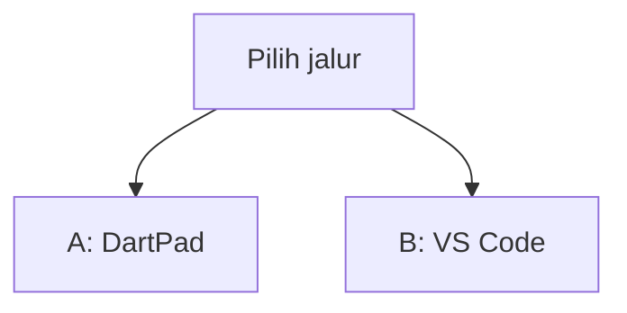
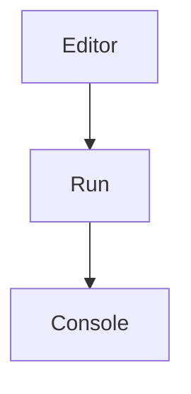
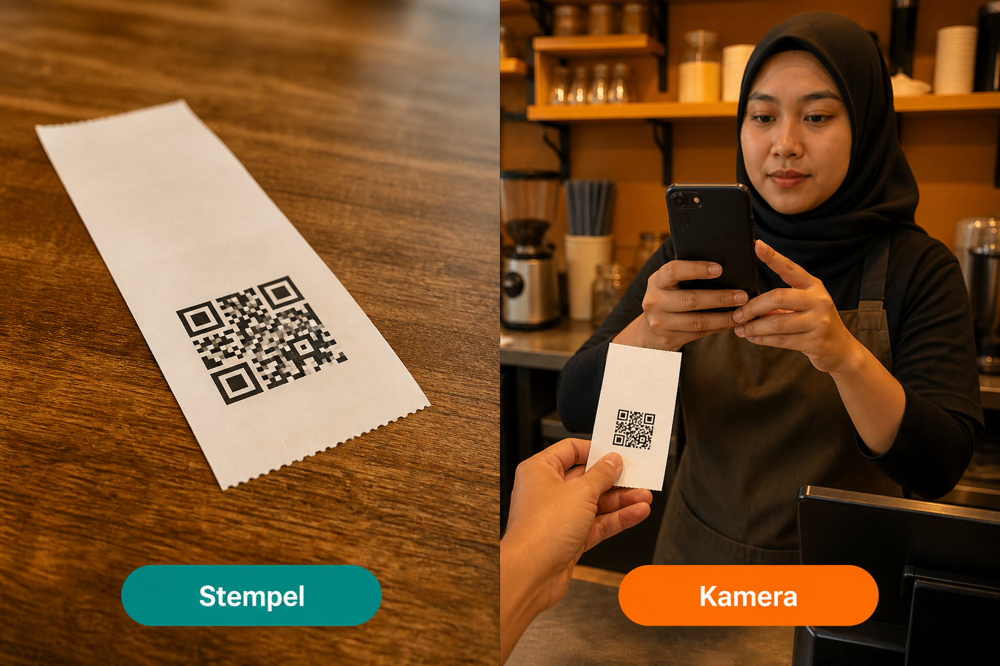
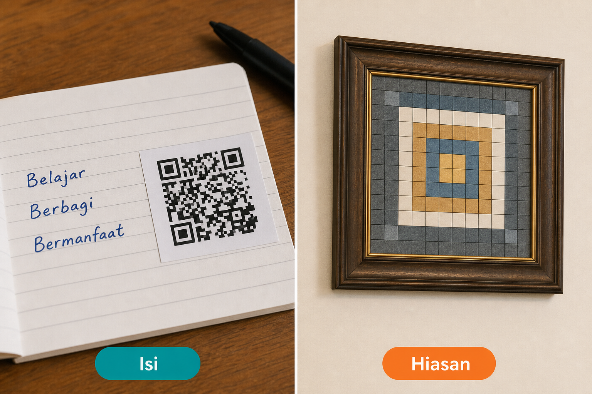
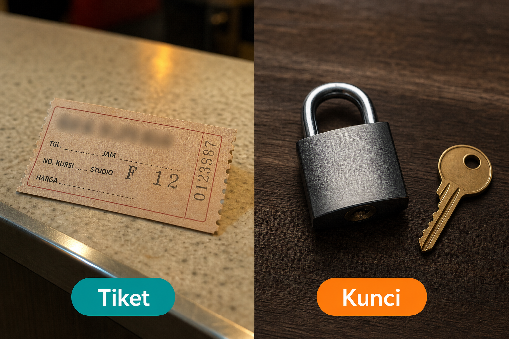
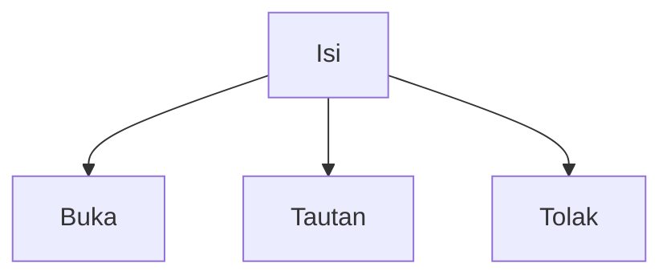
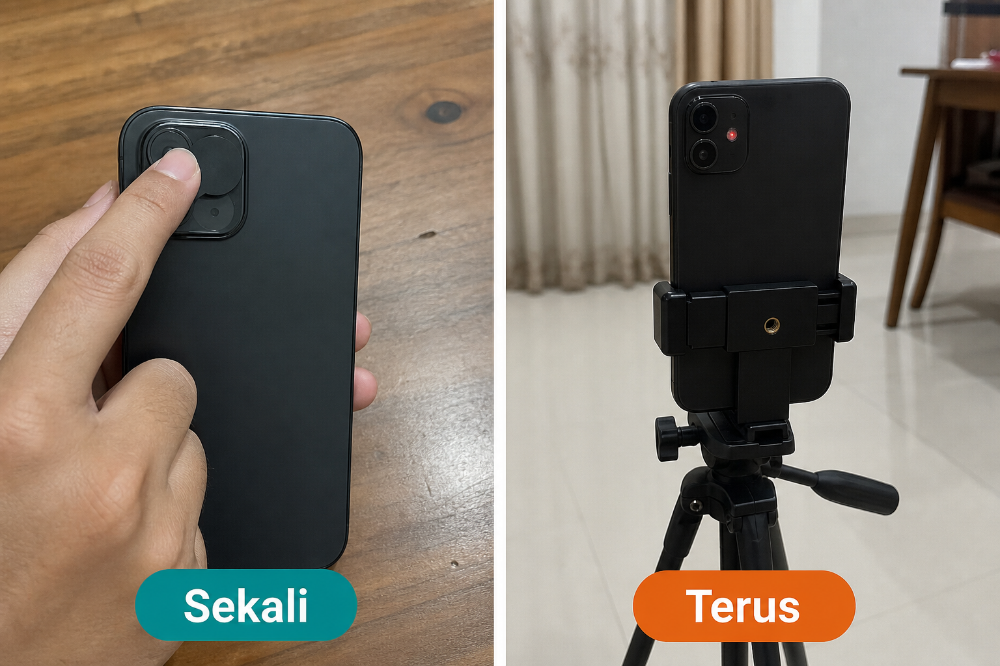

# Lampiran L9 — QR

**Waktu:** 1–2 sesi  
**Prasyarat:** Modul 08 (izin kamera), Modul 03 (`go_router`), jalur B VS Code + emulator/HP.  
**Hasil:** Nanti Anda bisa **menstempel** kode di layar (tiket) dan **membaca** kode itu dengan kamera — tanpa menyimpan sandi di dalam kotak, dan tanpa membiarkan kamera nyala terus.

Ini **lampiran**, bukan syarat lulus jalur wajib (Modul 00–11). Buka setelah Modul 08, kalau izin kamera sudah pernah diminta, dan Anda butuh tiket atau kasir baca kode. Bukan jendela bayar (itu L2).

---

## Buka alat ini dulu

Paket `qr_flutter` dan `mobile_scanner` **tidak** ada di [daftar paket DartPad](https://github.com/dart-lang/dart-pad/wiki/Package-and-plugin-support). DartPad hanya untuk memutuskan *buka / tautan / tolak* dari **teks isi**. Stempel dan kamera sungguhan butuh HP atau emulator.

| Jalur | Buka | Untuk apa |
| --- | --- | --- |
| A | Browser → [dartpad.dev](https://dartpad.dev) → mode **Dart** | Putus: buka, tautan, atau tolak |
| B | VS Code + Terminal (`Ctrl + J`) + emulator/HP | Stempel di layar, kamera baca kode |



Letak tombol di DartPad (bukan sketsa):




Sumber gambar: [dart.dev/tools/dartpad](https://dart.dev/tools/dartpad), Dart team / Google ([CC BY 4.0](https://creativecommons.org/licenses/by/4.0/)). Foto resmi itu **tema gelap** dan **mode Dart**. Kalau kelihatan seperti kotak hitam, gulir sampai editor kiri dan tombol **Run** terlihat; itu bukan gambar rusak. Mode **Dart** pas untuk uji 1. Paket HP **tidak** diuji di sini.

### Dua jenis kode di halaman ini

| Jenis | Tanda | Caranya |
| --- | --- | --- |
| **Berkas lengkap** | Ada `void main()` | Tempel utuh, lalu **Run** (alat yang disebut di kotak uji) |
| **Cuplikan** | Hanya potongan | Jangan di-Run sendirian |

### Pola uji A — DartPad Dart

| | |
| --- | --- |
| **Buka** | [dartpad.dev](https://dartpad.dev) |
| **Pilih** | mode **Dart** |
| **Tempel** | **berkas lengkap** |
| **Klik** | **Run** |
| **Kalau berhasil** | Console menulis `buka`, `tautan`, `tolak`, atau `kosong`, bukan error merah |

### Pola uji B — proyek lokal

| | |
| --- | --- |
| **Buka** | VS Code di folder proyek Flutter (izin kamera Modul 08 sudah pernah), emulator atau HP sudah menyala |
| **Terminal** | `Ctrl + J` |
| **Ketik** | perintah di mini proyek, di folder proyek |
| **Kalau berhasil** | layar stempel menampilkan kotak; kamera baca `tiket:demo-001` → teks tiket; isi lain → wajah gagal; kamera mati setelah satu kode |

> **Aturan emas:** perintah `flutter ...` hanya di **Terminal VS Code**. DartPad tidak membuka kamera dan tidak menggambar stempel. Jangan menaruh sandi di dalam kotak.

Praktik: **Windows → Android**. iOS: konsep sama (kamera + stempel); membangun iOS butuh Mac. Teks izin kamera iOS di berkas `Info.plist` **belum** dibahas.

Nama resmi: `qr_flutter` (stempel di layar), `mobile_scanner` (kamera baca kode). App membaca **teks isi**, bukan “mengenali wajah di foto.”

---

## 1. Stempel, jangan cuma kamera

Stempel = kotak di layar atau kertas, supaya orang lain bisa baca. Kamera = HP kasir atau petugas yang mengarah ke stempel itu. Mini hari ini butuh **dua** layar: satu menstempel, satu membaca.



*Ilustrasi asli materi mobile2026. Stempel = kotak di kertas atau layar. Kamera = HP yang membaca.*

Jangan tulis “cukup kamera, tanpa ada yang ditampilkan.” Kalau tidak ada stempel, tidak ada yang dibaca.

Uji paling enak: tampilkan stempel di layar laptop (jalur B, layar **Tampil**), lalu HP sungguhan menghadap ke situ. Emulator: kamera webcam di jendela tambahan emulator — sering lebih ribet daripada HP.

---

## 2. Isi, jangan hiasan

Yang dibaca app adalah **teks di dalam kode**. Gambar kotak hanya pembungkus. Kalau isi kosong atau rusak, kotak cantik tidak menolong.



*Ilustrasi asli materi mobile2026. Isi = teks yang disimpan di kode. Hiasan = gambar cantik yang tidak dibaca app.*

Jangan unggah **foto** kotak ke Storage “supaya cadangan.” Simpan teks (`tiket:demo-001`), atau jangan simpan sama sekali.

Cuplikan (jalur B) — jangan di-Run di DartPad:

```dart
// Cuplikan. Layar Tampil, setelah flutter pub add qr_flutter.
QrImageView(
  data: 'tiket:demo-001',
  size: 200,
)
```

Sumber: [qr_flutter](https://pub.dev/packages/qr_flutter). `data` itu **isi**. Ukuran hanya hiasan.

---

## 3. Tiket, jangan kunci

Tiket = nomor yang boleh kelihatan: `tiket:demo-001`. Kunci = sandi, token, atau kunci server. Orang bisa memotret stempel; anggap isinya publik.



*Ilustrasi asli materi mobile2026. Tiket = nomor yang boleh kelihatan. Kunci = sandi; jangan masukkan ke kotak.*

Jendela bayar dan nomor kartu tetap di L2 — jangan menstempel kunci gerbang bayar.



Kalau isi `https://...`: itu **tautan** (buka pintu di L6), bukan tiket mini ini. Mini menampilkan wajah gagal, jangan langsung membuka situs.

---

### Uji 1 — buka, tautan, atau tolak

| | |
| --- | --- |
| **Buka** | [dartpad.dev](https://dartpad.dev) |
| **Pilih** | mode **Dart** |
| **Tempel** | **berkas lengkap** di bawah |
| **Klik** | **Run** |
| **Kalau berhasil** | Console menulis `Isi publik, bukan kunci`, lalu `tiket:demo-001: buka`, `https://contoh.invalid/x: tautan`, `sandi:rahasia: tolak`, `: kosong` |

```dart
void main() {
  print('Isi publik, bukan kunci');
  final daftar = [
    'tiket:demo-001',
    'https://contoh.invalid/x',
    'sandi:rahasia',
    '',
  ];
  for (final isi in daftar) {
    final hasil = isi.isEmpty
        ? 'kosong'
        : (isi.startsWith('tiket:')
            ? 'buka'
            : (isi.startsWith('https://') ? 'tautan' : 'tolak'));
    print('$isi: $hasil');
  }
}
```

Lewat tautan = jangan dibuka di mini ini. Tolak = sandi, teks acak, atau format lain.

---

## 4. Sekali, jangan terus

Kamera yang tetap nyala di belakang layar = terus. Setelah satu kode terbaca: **mati**. Kalau tidak, HP panas, orang merasa diawasi, dan isi yang sama bisa masuk berkali-kali.



*Ilustrasi asli materi mobile2026. Sekali = kamera mati setelah satu kode. Terus = kamera tetap nyala di belakang layar.*

Izin kamera: ketuk dulu seperti Modul 08. Jangan minta kamera saat app baru dibuka, sebelum orang menekan **Baca**.

Cuplikan (jalur B) — jangan di-Run di DartPad:

```dart
// Cuplikan. Setelah izin kamera, layar Baca.
final pengontrol = MobileScannerController();

MobileScanner(
  controller: pengontrol,
  onDetect: (hasil) async {
    final isi = hasil.barcodes.first.rawValue ?? '';
    await pengontrol.stop();
    // isi masuk uji 1: buka / tautan / tolak
  },
)
```

Sumber: [mobile_scanner](https://pub.dev/packages/mobile_scanner). Nama kelas di halaman paket bisa bergeser — ikuti contoh terbaru di sana, yang wajib: **stop setelah satu kode**.

---

## Mini proyek lampiran ini

Satu stempel `tiket:demo-001`, satu kamera yang berhenti setelah baca. Urutan jangan terbalik. Pakai proyek Flutter Anda yang sudah izin kamera Modul 08.

1. Paket, di folder proyek:

| | |
| --- | --- |
| **Buka** | Terminal VS Code di folder proyek Flutter |
| **Ketik** | perintah di bawah |

```text
flutter pub add qr_flutter mobile_scanner
```

**Kalau berhasil:** nama `qr_flutter` dan `mobile_scanner` ada di `pubspec.yaml`.

2. Android (jalur B): izin `CAMERA` di `AndroidManifest.xml` — sama seperti Modul 08. Tanpa itu, kamera sering langsung ditolak. Ikuti juga halaman [`mobile_scanner`](https://pub.dev/packages/mobile_scanner) untuk min SDK yang diminta paket.

3. Dua rute `go_router`: `/tampil` dan `/baca`. Jangan satu layar yang sekaligus menggambar dan membuka kamera.

4. Layar **Tampil**: teks pendek (“Silakan tunjukkan tiket”), `QrImageView` dengan `data: 'tiket:demo-001'`, plus tombol **Baca**.

5. Layar **Baca**: ketuk izin kamera dulu (Modul 08). Baru `MobileScanner`. Kode pertama → `stop` → tampilkan teks isi. Kalau `tiket:` → rumah atau “tiket diterima.” Selain itu → wajah gagal (Modul 09), tombol coba lagi. Jangan buka tautan sendiri.

6. HP menghadap layar **Tampil** di laptop. Emulator: jendela tambahan emulator, pilih kamera webcam, lalu arahkan ke stempel di monitor — kalau gagal, pakai HP.

7. Jalankan:

| | |
| --- | --- |
| **Buka** | VS Code, emulator atau HP menyala |
| **Terminal** | `Ctrl + J` |
| **Ketik** | perintah di bawah |

```text
flutter run
```

**Kalau berhasil:** Tampil menampilkan kotak. Baca + `tiket:demo-001` → teks tiket, kamera mati. `sandi:rahasia` (kalau Anda uji dengan stempel lain) → wajah gagal. Tidak ada foto kotak terkirim ke Storage.

8. Jangan simpan `isiQr` ke SharedPreferences sebagai sandi. Tiket demo ini publik. Dapur sungguhan (belum di mini): cek nomor tiket ke server, jangan percaya HP saja.

Bonus (bukan syarat): tombol **Bagikan** memakai `share_plus` (L6) untuk mengirim teks `tiket:demo-001`, bukan mengirim file gambar.

---

## Kesalahan yang sering terjadi

| Gejala | Penyebab yang sering | Perbaikan |
| --- | --- | --- |
| DartPad merah setelah `import qr_flutter` | paket tidak ada di DartPad | jalur B; uji 1 hanya teks isi |
| Kamera hitam / langsung ditolak | tidak ada `CAMERA` di Manifest, atau izin belum diketuk | Modul 08 + langkah 2 |
| Emulator tidak membaca kotak | webcam belum dipilih, atau layar terlalu gelap | jendela tambahan emulator, atau HP sungguhan |
| Isi yang sama masuk 20 kali | kamera tidak di-`stop` | sekali, jangan terus |
| “Login pakai QR” berisi sandi | kunci ditaruh di kotak | tiket publik; akun tetap Modul 08 |
| Foto kotak di Firestore | hiasan disimpan, bukan isi | simpan teks atau jangan simpan |
| App buka situs sendiri | isi `https://` dianggap tiket | tautan = L6; mini ini wajah gagal |
| Satu layar gambar + kamera | dua pekerjaan dicampur | `/tampil` dan `/baca` |

---

## Latihan

1. (DartPad) Di uji 1, tambah `tiket:` (tanpa nomor) — harus `buka` (awalan `tiket:`).
2. (DartPad) Tambah `http://contoh.invalid` — harus `tolak` (bukan `https://`).
3. (Jalur B) Stempel di laptop, baca dengan HP — kamera mati setelah satu kode.
4. (Jalur B) Stempel berisi `halo` — wajah gagal, bukan rumah.
5. (Jalur B) Jangan ada unggahan Storage untuk “foto QR.”

---

## Kuis singkat

1. Kenapa `mobile_scanner` tidak diuji di DartPad?
2. Apakah sandi akun boleh ditulis di dalam kotak “supaya cepat masuk”?
3. Setelah satu kode terbaca, kamera boleh tetap nyala?
4. Isi `https://contoh.invalid/x` di mini ini: buka, tautan, atau tolak?
5. Cukupkah menyimpan foto kotak di Firestore sebagai tiket?

Kunci jawaban di bawah. Coba jawab dulu.

---

## Apa yang belum dibahas

- Barcode garis (EAN di minimarket), PDF417, potret dokumen
- QRIS / jendela bayar (L2) dan gerbang Midtrans/Xendit
- Membuka tautan dari kode (itu L6), App Link, Dynamic Link
- Dapur yang menandai tiket sudah dipakai (anti-ganda)
- Membuat decoder sendiri dari `Image.memory` tanpa paket
- iOS `Info.plist` kamera (praktik hari ini Android)

---

## Kunci kuis

1. Itu paket HP; tidak ada di DartPad. Butuh proyek Flutter + kamera.
2. Tidak. Kotak kelihatan. Tiket boleh; sandi jangan.
3. Tidak. Sekali, lalu `stop`.
4. Tautan. Mini tidak membuka situs; wajah gagal. Pintu tautan ada di L6.
5. Tidak. Simpan teks isi, atau cek ke dapur. Foto hiasan tidak membuktikan tiket.

---

## Sumber gambar dan tautan

| Aset | Sumber |
| --- | --- |
| `images/analogi-stempel-kamera.png` | Ilustrasi asli materi mobile2026 |
| `images/analogi-isi-hiasan.png` | Ilustrasi asli materi mobile2026 |
| `images/analogi-tiket-kunci.png` | Ilustrasi asli materi mobile2026 |
| `images/analogi-satu-terus.png` | Ilustrasi asli materi mobile2026 |
| Tampilan DartPad | [dart.dev/assets/img/dartpad-hello.png](https://dart.dev/assets/img/dartpad-hello.png) dari [dart.dev/tools/dartpad](https://dart.dev/tools/dartpad) ([CC BY 4.0](https://creativecommons.org/licenses/by/4.0/)) |
| `qr_flutter` | [pub.dev/packages/qr_flutter](https://pub.dev/packages/qr_flutter) |
| `mobile_scanner` | [pub.dev/packages/mobile_scanner](https://pub.dev/packages/mobile_scanner) |
| Izin kamera Android | Modul 08 + [developer.android.com/training/permissions/requesting](https://developer.android.com/training/permissions/requesting) |
| Paket DartPad | [github.com/dart-lang/dart-pad/wiki/Package-and-plugin-support](https://github.com/dart-lang/dart-pad/wiki/Package-and-plugin-support) |
| Modul 08 izin kamera | [modul-08-fitur/README.md](../../modul-08-fitur/README.md) |
| Modul 03 `go_router` | [modul-03-interaksi/README.md](../../modul-03-interaksi/README.md) |
| Modul 09 wajah gagal | [modul-09-kualitas/README.md](../../modul-09-kualitas/README.md) |
| L2 jendela bayar | [../l2-pembayaran/README.md](../l2-pembayaran/README.md) |
| L6 tautan | [../l6-share/README.md](../l6-share/README.md) |

Flutter and the related logo are trademarks of Google LLC. Android is a trademark of Google LLC. Materi ini tidak didukung Google secara resmi, dan tidak terafiliasi dengan Google LLC.
