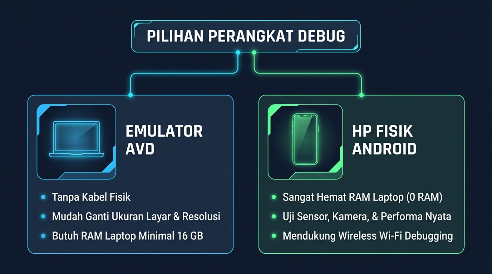

# Modul 00: Setup Lingkungan Kerja & Tooling Modern 2026

Selamat datang di gerbang awal perjalanan **Fullstack Mobile Developer**! Sebelum kita menyelami logika bahasa Dart dan merancang antarmuka Flutter kelas dunia, langkah paling fundamental adalah memastikan "bengkel kerja" dan seluruh perkakas kita terpasang dengan sempurna, kokoh, dan optimal.

Modul ini adalah panduan komprehensif dari nol hingga seluruh indikator pada `flutter doctor -v` berstatus **centang hijau sempurna (All Passed)**, serta aplikasi perdana Anda berjalan lancar di HP fisik maupun emulator.

---

## 🍳 1. Analogi: Dapur Restoran Bintang Lima

Membangun aplikasi mobile profesional dapat diibaratkan seperti mempersiapkan dapur restoran modern:

| Komponen di Flutter | Analogi di Dapur | Peran & Fungsi Teknis |
|---|---|---|
| **Dart SDK** | **Buku Resep & Bahasa Koki** | Menentukan logika perhitungan, alur validasi, dan instruksi program. |
| **Flutter SDK** | **Peralatan Masak & Mesin Penyaji (Impeller)** | Komponen widget, perender grafis, dan layout engine yang menyusun tampilan UI. |
| **Android SDK & JDK** | **Oven & Standar Kemasan Android** | Membungkus dan mengompilasi kode program menjadi format biner resmi Android (`.apk` / `.aab`). |
| **VS Code / IDE** | **Meja Racik & Pisau Koki** | Lingkungan penulisan kode, auto-complete, linter, dan pendeteksi kesalahan seketika. |
| **Emulator / HP Fisik** | **Piring Saji Pelanggan** | Wadah pengujian nyata untuk merasakan interaksi, performa, dan responsivitas aplikasi. |

---

## 💻 2. Spesifikasi Perangkat & Kebutuhan Sistem 2026

Untuk pengalaman pengembangan yang nyaman dan bebas *lag*, pastikan perangkat Anda memenuhi rekomendasi berikut:

* **Sistem Operasi**: Windows 10 / 11 (64-bit), macOS 13+ (Ventura/Sonoma), atau Linux (Ubuntu 22.04+). *(Modul ini difokuskan pada Windows & Android)*.
* **Prosesor (CPU)**: Minimal 4 Core / 8 Thread (Intel Core i5 generasi 8+ / AMD Ryzen 5 generasi 3000+) dengan **Virtualization Technology (VT-x / AMD-V) aktif di BIOS**.
* **Memori (RAM)**:
  - Minimal: **8 GB** *(Direkomendasikan menggunakan HP Fisik untuk debug)*.
  - Ideal: **16 GB – 32 GB** *(Sangat nyaman menjalankan Emulator AVD, Browser, dan VS Code sekaligus)*.
* **Penyimpanan (Storage)**: Minimal sisa ruang kosong **25 GB pada SSD (Solid State Drive)**. Hindari penggunaan HDD konvensional untuk folder SDK dan project.

---

## 🛠️ 3. Panduan Instalasi Langkah demi Langkah

### Langkah 1: Instalasi Git & Pengaturan PowerShell Execution Policy

1. **Unduh & Pasang Git for Windows**:
   - Unduh installer resmi di [git-scm.com/download/win](https://git-scm.com/download/win).
   - Jalankan installer, pilih opsi standar *(default)* hingga selesai.

2. **Aktifkan Dukungan Long Paths di Git**:
   Buka terminal PowerShell sebagai Administrator, lalu jalankan:
   ```powershell
   git config --system core.longpaths true
   ```

3. **Buka Izin Script di PowerShell**:
   Windows secara default memblokir eksekusi script terminal. Buka PowerShell dan jalankan:
   ```powershell
   Set-ExecutionPolicy -Scope CurrentUser -ExecutionPolicy RemoteSigned -Force
   ```

---

### Langkah 2: Unduh & Konfigurasi Flutter SDK

1. **Unduh Flutter SDK Stable**:
   - Kunjungi [docs.flutter.dev/get-started/install/windows](https://docs.flutter.dev/get-started/install/windows).
   - Unduh berkas zip Flutter SDK versi **Stable** terbaru.

2. **Ekstrak ke Folder yang Tepat**:
   - Ekstrak isi file zip ke direktori bersih tanpa spasi, contoh: `C:\src\flutter` atau `C:\flutter`.
   
   > [!CAUTION]
   > **JANGAN PERNAH** menaruh folder Flutter di `C:\Program Files\` atau direktori yang memerlukan hak akses Administrator khusus, karena akan memblokir proses build otomatis dan download package.

3. **Menambahkan Flutter ke Environment Variables (PATH)**:
   - Tekan tombol **Windows**, ketik `env`, lalu pilih **Edit the system environment variables**.
   - Klik tombol **Environment Variables...** di kanan bawah.
   - Pada bagian **User variables**, klik dua kali pada variabel bernama `Path`.
   - Klik **New**, lalu masukkan alamat folder `bin` Flutter Anda:
     ```text
     C:\src\flutter\bin
     ```
   - Klik **OK** pada seluruh jendela.

4. **Verifikasi Awal di Terminal**:
   Buka PowerShell baru dan ketik:
   ```powershell
   flutter --version
   ```

---

### Langkah 3: Setup Java Development Kit (JDK 17 / 21) & `JAVA_HOME`

Gradle (alat build Android) membutuhkan Java JDK versi modern (JDK 17 atau 21).

1. **Unduh JDK**:
   - Unduh **Eclipse Temurin OpenJDK 17 / 21 (LTS)** dari [adoptium.net](https://adoptium.net/).
   - Saat instalasi, pastikan mengaktifkan opsi **"Set JAVA_HOME variable"** dan **"Add to PATH"**.

2. **Verifikasi `JAVA_HOME` di Terminal**:
   ```powershell
   java -version
   $env:JAVA_HOME
   ```
   *Output harus menampilkan path JDK yang valid (contoh: `C:\Program Files\Eclipse Adoptium\jdk-17.x.x-hotspot\`)*.

---

### Langkah 4: Setup Android Studio, Android SDK, & Lisensi

1. **Unduh Android Studio**:
   - Unduh versi terbaru dari [developer.android.com/studio](https://developer.android.com/studio).
   - Jalankan installer hingga selesai, lalu buka Android Studio.

2. **Instal Paket SDK Wajib lewat SDK Manager**:
   - Di layar pembuka Android Studio, klik **More Actions** ➔ **SDK Manager**.
   - **Tab SDK Platforms**:
     - Centang **Android 14.0 ("UpsideDownCake")** / **Android 15**.
   - **Tab SDK Tools** *(Wajib Dipastikan)*:
     - [x] **Android SDK Build-Tools**
     - [x] **Android SDK Command-line Tools (latest)** ➔ *(Sangat krusial untuk Flutter!)*
     - [x] **Android Emulator**
     - [x] **Android SDK Platform-Tools**
   - Klik **Apply** ➔ **OK**, tunggu proses download selesai.

3. **Menyetujui Seluruh Lisensi Android SDK**:
   Buka terminal PowerShell baru, lalu jalankan:
   ```bash
   flutter doctor --android-licenses
   ```
   Ketik `y` lalu tekan **Enter** pada setiap konfirmasi persetujuan lisensi yang muncul.

---

### Langkah 5: Setup Perangkat Debug (Emulator vs HP Fisik)

<p align="center">
  
</p>

#### Opsi A: Setup Emulator Android (AVD)
1. Di Android Studio, buka **Virtual Device Manager** (Device Manager).
2. Klik **Create Device** ➔ Pilih ponsel dengan ikon Play Store (misal: **Pixel 7** atau **Pixel 8**).
3. Pilih image Android versi stabil (`x86_64` API 34), download jika belum tersedia.
4. Pada opsi *Emulated Performance*, pilih Graphics: **Hardware - GLES 2.0**.
5. Klik **Finish**, lalu tekan ikon **Play (▶)** untuk menyalakan emulator.

#### Opsi B: Setup HP Android Fisik (Via Kabel USB)
1. Masuk ke **Pengaturan (Settings)** HP ➔ **Tentang Ponsel (About Phone)**.
2. Ketuk baris **Nomor Bentukan (Build Number)** sebanyak **7 kali berturut-turut** hingga aktif mode pengembang.
3. Buka **Opsi Pengembang (Developer Options)** ➔ Aktifkan **Debugging USB (USB Debugging)**.
4. Sambungkan HP ke laptop dengan kabel data. Saat muncul prompt di layar HP, centang *"Selalu izinkan dari komputer ini"* lalu pilih **Izinkan (OK)**.

#### 💡 Bonus Pro-Tip: Wireless ADB (Debug Tanpa Kabel USB!)
Bagi pengguna Android 11+, Anda bisa debug lewat jaringan Wi-Fi lokal yang sama:
1. Sambungkan HP dengan kabel USB satu kali terlebih dahulu.
2. Jalankan di terminal:
   ```bash
   adb tcpip 5555
   ```
3. Cek IP Address HP Anda di menu Wi-Fi (misal: `192.168.1.50`), lalu lepaskan kabel USB dan ketik:
   ```bash
   adb connect 192.168.1.50:5555
   ```
4. Sekarang HP Anda terhubung secara nirkabel dan muncul di `flutter devices`!

---

### Langkah 6: Setup Visual Studio Code & Ekstensi Produktif

1. **Unduh VS Code**: dari [code.visualstudio.com](https://code.visualstudio.com/).
2. **Pasang Ekstensi Esensial**:
   Buka VS Code, tekan `Ctrl + Shift + X`, cari dan pasang:
   - 🌟 **Flutter** (Otomatis menyertakan ekstensi bahasa Dart).
   - 🔍 **Error Lens** (Menyorot letak error langsung di baris kode).
   - ⚡ **Flutter Riverpod Snippets** & **Bloc** (Snippet generator state management).
   - 📦 **Pubspec Assist** (Mencari dan menambah dependensi dari pub.dev otomatis).
   - 🎨 **Material Icon Theme** (Memberikan ikon visual rapi pada file project).

3. **Tabel Shortcut Sakti VS Code untuk Flutter**:

| Shortcut (Windows) | Fungsi & Kegunaan |
|---|---|
| `Ctrl + Shift + P` | Membuka **Command Palette** (Ketik perintah Flutter). |
| `Ctrl + .` / `Alt + Enter` | **Refactor & Wrap Widget** (Bungkus Padding, Column, Center, hapus widget). |
| `F5` | Menjalankan aplikasi dengan mode **Debug**. |
| `Ctrl + F5` | Menjalankan aplikasi mode **Run Without Debugging** (Lebih cepat & ringan). |
| `r` *(di terminal run)* | **Hot Reload** (Pembaruan UI instan < 1 detik tanpa menghilangkan state data). |
| `R` *(di terminal run)* | **Hot Restart** (Memuat ulang aplikasi dari fungsi `main()` awal). |

---

## 🩺 4. Uji Verifikasi Diagnosa Sistem (`flutter doctor -v`)

Jalankan perintah diagnosa lengkap di terminal PowerShell:

```bash
flutter doctor -v
```

### ✅ Indikator Status Ideal:

```text
[✓] Flutter (Channel stable, 3.x.x, on Microsoft Windows, locale id-ID)
[✓] Android toolchain - develop for Android devices (Android SDK version 34.0.0)
[✓] Chrome - develop for the web
[✓] Android Studio (version 2024.x)
[✓] VS Code (version 1.9x.x)
[✓] Connected device (2 available)
[✓] Network resources

• No issues found!
```

> [!NOTE]
> **Catatan soal "Visual Studio - develop Windows apps":**  
> Jika muncul tanda seru `[!] Visual Studio - develop Windows apps`, Anda **TIDAK WAJIB** memasangnya jika fokus Anda adalah membangun aplikasi mobile Android/iOS. Tanda ini hanya diperlukan jika Anda ingin mengompilasi aplikasi desktop Windows `.exe`.

---

## 📁 5. Anatomi Struktur Folder Proyek Flutter

Saat membuat proyek Flutter, Anda akan melihat struktur folder standar berikut:

```text
proyek_pertama/
├── android/            # Kode & konfigurasi native Android (Gradle, Manifest, Keystore)
├── ios/                # Kode & konfigurasi native iOS (Xcode project, Podfile, Info.plist)
├── web/ / windows/     # Runner untuk platform Web dan Desktop
├── lib/                # 🌟 WADAH UTAMA: Seluruh kode logika & tampilan Dart Anda
│   └── main.dart       # Titik awal masuk eksekusi aplikasi (Fungsi main())
├── test/               # Berkas pengujian otomatis (Unit Test & Widget Test)
├── assets/             # Folder gambar, ikon, file font, dan file mock data (opsional)
├── pubspec.yaml        # 🌟 JANTUNG PROYEK: Daftar dependensi library, font, & versi app
├── pubspec.lock        # Catatan versi pasti setiap dependensi yang terpasang
└── .gitignore          # Daftar file yang diabaikan saat commit ke Git
```

---

## 🚀 6. Praktik Perdana: Membuat & Menjalankan Proyek Pertama

Mari kita uji coba seluruh sistem dengan membuat proyek baru:

1. **Buka Terminal di direktori workspace**:
   ```bash
   cd c:\Users\anton\vibecoding\mobile2026
   ```

2. **Buat Proyek Flutter**:
   ```bash
   flutter create proyek_pertama --org com.mobile2026
   ```

3. **Buka di VS Code**:
   ```bash
   code proyek_pertama
   ```

4. **Jalankan Aplikasi**:
   - Pastikan HP / Emulator terhubung dan terdeteksi di pojok kanan bawah VS Code.
   - Buka berkas `lib/main.dart`.
   - Tekan `Ctrl + F5` atau ketik di terminal VS Code:
     ```bash
     flutter run
     ```
5. **Uji Coba Hot Reload**:
   - Di `lib/main.dart`, cari baris:
     ```dart
     title: const Text('Flutter Demo Home Page'),
     ```
   - Ganti menjadi:
     ```dart
     title: const Text('Halo Fullstack Mobile 2026! 🚀'),
     ```
   - Tekan `Ctrl + S`. Dalam hitungan milidetik, teks pada layar HP langsung berganti tanpa aplikasi menutup!

---

## ⚡ 7. Trik Optimalisasi: Mempercepat Build Gradle di Windows

Proses *build* awal Android terkadang lambat karena alokasi memori Gradle default yang kecil. Anda bisa mempercepatnya dengan langkah berikut:

1. Buka folder user Windows Anda: `C:\Users\<NamaUserAnda>\.gradle\`
2. Buat berkas bernama `gradle.properties` (jika belum ada), lalu tambahkan baris berikut:
   ```properties
   org.gradle.daemon=true
   org.gradle.parallel=true
   org.gradle.jvmargs=-Xmx3072m -XX:MaxMetaspaceSize=512m
   ```
*Trik ini membuat proses kompilasi Gradle hingga 2x lebih cepat pada build berikutnya.*

---

## ⚠️ 8. Kompendium Masalah & Solusi Kilat (*Troubleshooting*)

| Gejala Error | Penyebab Utama | Solusi Kilat |
|---|---|---|
| `cmdline-tools component is missing` | Paket command-line tools belum dicentang di Android Studio. | Buka Android Studio ➔ SDK Manager ➔ SDK Tools ➔ Centang **Android SDK Command-line Tools** ➔ Apply. |
| `Android license status unknown` | Lisensi SDK belum disetujui secara legal. | Jalankan `flutter doctor --android-licenses` di terminal, ketik `y` untuk semua prompt. |
| `'flutter' is not recognized` | Path folder `bin` belum masuk ke Environment Variables `Path`. | Tambahkan `C:\src\flutter\bin` ke variabel `Path` sistem, lalu restart terminal. |
| `Unable to locate Android SDK` | Flutter tidak menemukan lokasi folder SDK Android. | Jalankan: `flutter config --android-sdk "C:\Users\<User>\AppData\Local\Android\Sdk"`. |
| `VT-x / AMD-V is disabled in BIOS` | Virtualisasi CPU mati di motherboard. | Masuk ke menu BIOS/UEFI saat laptop baru dinyalakan, aktifkan **Intel Virtualization (VT-x)** atau **AMD SVM**. |
| `PSSecurityException` di PowerShell | Policy Windows melarang eksekusi script. | Jalankan: `Set-ExecutionPolicy -Scope CurrentUser -ExecutionPolicy RemoteSigned -Force`. |
| `Device unauthorized` di `adb devices` | Belum menyetujui prompt dialog USB Debugging di layar HP. | Buka kunci layar HP, cabut & colok ulang kabel USB, centang *"Selalu izinkan"* lalu klik OK. |

---

## 📝 9. Kuis Pemahaman Modul 00

Uji pemahaman Anda sebelum melangkah ke Modul 01:

1. **Apa perbedaan mendasar antara Hot Reload (`r`) dan Hot Restart (`R`)?**  
   *Jawaban:* Hot Reload memperbarui tampilan kode UI secara instan ke Dart VM tanpa menghilangkan state/data yang sedang aktif di layar. Hot Restart menginisialisasi ulang seluruh aplikasi dari fungsi `main()` awal dan mengosongkan state.
2. **Mengapa berkas `pubspec.yaml` disebut sebagai jantung proyek Flutter?**  
   *Jawaban:* Karena di file itulah kita mendaftarkan seluruh library/package pihak ketiga (dari pub.dev), konfigurasi aset gambar, ikon, font khusus, hingga metadata versi aplikasi.
3. **Apakah tanda seru `[!] Visual Studio` di `flutter doctor` menghalangi kita membuat aplikasi Android?**  
   *Jawaban:* Tidak. Visual Studio Desktop C++ hanya dibutuhkan jika kita ingin mengompilasi aplikasi desktop Windows `.exe`. Untuk Android, cukup Android SDK dan JDK yang berstatus centang hijau.

---

## 🎯 Rangkuman & Checklist Kesiapan Belajar

- [x] Flutter SDK Stable & Dart SDK terpasang di PATH sistem.
- [x] Java JDK 17/21 terpasang dan variabel `JAVA_HOME` aktif.
- [x] Android Studio, Android SDK Platform-Tools, dan `cmdline-tools` terpasang.
- [x] Lisensi Android telah disetujui (`flutter doctor --android-licenses`).
- [x] Emulator AVD atau HP Fisik berhasil terdeteksi di `flutter devices`.
- [x] VS Code dan ekstensi Flutter/Dart terkonfigurasi.
- [x] Proyek pertama berhasil dijalankan dan Hot Reload telah teruji.
- [x] `flutter doctor -v` menunjukkan status bebas masalah (*No issues found!*).

---

👉 **Langkah Selanjutnya**: Lingkungan kerja dan alat tempur Anda kini 100% sempurna! Mari melangkah ke **[Modul 01: Fondasi Dart 3+, OOP, & Concurrency (Isolates)](../modul-01-dart-dan-concurrency/README.md)** untuk menguasai bahasa Dart modern secara tuntas.
