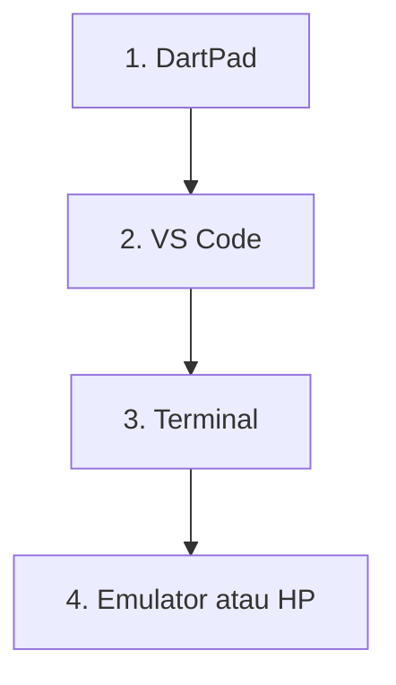
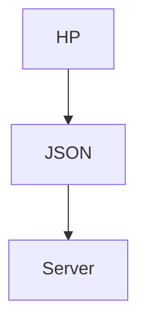
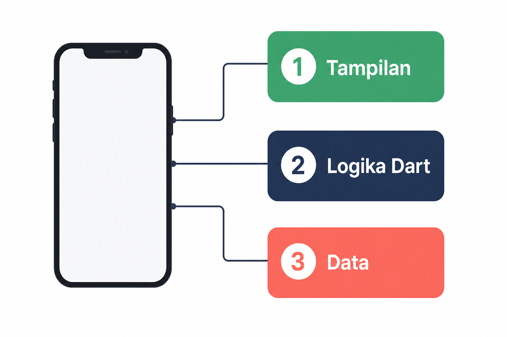
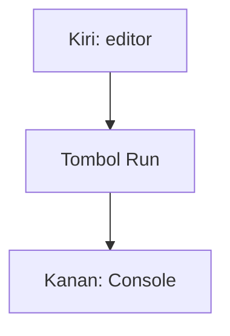
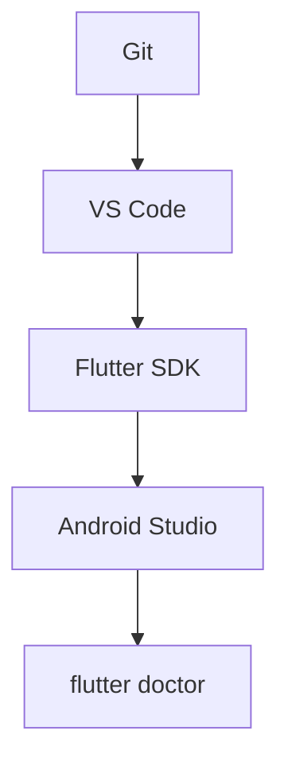

# Modul 00 — Persiapan: buka bengkel kerja

**Waktu:** 1–2 sesi  
**Hasil:** komputer siap, perintah `flutter doctor` bisa dibaca, aplikasi "Halo" berjalan di emulator atau HP.

---

## Buka alat ini dulu

Sebelum ketik perintah apa pun, lihat tabel ini. Salah alat = perintah "tidak dikenali", padahal Flutter SDK-nya sudah terpasang.

| Urutan | Buka | Untuk apa |
| --- | --- | --- |
| 1 | Browser → [dartpad.dev](https://dartpad.dev) | Coba kode tanpa instalasi |
| 2 | [Git for Windows](https://git-scm.com/download/win) | Perlu untuk Flutter SDK dan unggah ke GitHub |
| 3 | [Visual Studio Code](https://code.visualstudio.com/) | Menulis kode + mengunduh Flutter SDK |
| 4 | Terminal di VS Code (`Ctrl + J`) | Menjalankan `git`, `flutter`, `dart` |
| 5 | [Android Studio](https://developer.android.com/studio) | SDK Android, emulator, driver USB |
| 6 | Emulator Android **atau** HP Android | Melihat aplikasi |



Teks di diagram sengaja singkat. Detailnya ada di tabel di atas, supaya tidak ada tulisan kecil yang pecah saat GitHub mengecilkan gambar.

### Pintasan yang akan sering dipakai

| Di Windows | Artinya |
| --- | --- |
| `Ctrl + J` | Buka / tutup **Terminal** di VS Code |
| `Ctrl + Shift + P` | Palet perintah VS Code |
| `Ctrl + S` | Simpan file |
| `Ctrl + `` ` | Terminal (alternatif, tombol backtick) |

> Terminal yang dimaksud materi ini adalah **panel Terminal di VS Code**, bukan kotak "Ketik di sini untuk mencari" di bilah tugas Windows.

---

## 1. Apa yang sedang Anda bangun

Aplikasi mobile berbeda dari situs web dalam tiga hal yang terasa di tangan:

1. **Sentuhan** — targetnya jari, bukan kursor mouse.
2. **Siklus hidup** — aplikasi bisa diperkecil, kehabisan memori, atau kehilangan sinyal.
3. **Toko aplikasi** — Google Play punya aturan privasi, versi, dan kunci tanda tangan.

Di belakang layar, aplikasi Anda tetap seperti restoran:


*Ilustrasi asli materi mobile2026. Tiga peran: HP, JSON, server. Penjelasan ada di tabel.*



| Di restoran | Di aplikasi |
| --- | --- |
| Tamu | HP / aplikasi Flutter |
| Nota pesanan | JSON |
| Dapur | Backend (Firebase atau API HTTP) |

Detail JSON dan HTTP ada di Modul 07. Sekarang cukup ingat: **tampilan dan data tidak tinggal di tempat yang sama**.

Tiga lapisan di dalam app:

| Lapisan | Artinya |
| --- | --- |
| **Tampilan** | tombol, daftar, formulir |
| **Logika** | aturan, ditulis dalam Dart |
| **Data** | di HP, di Firebase, atau di API |



*Ilustrasi asli materi mobile2026. Tiga lapisan: tampilan, logika, data. Penjelasan ada di tabel.*

---

## 2. Kenapa Flutter SDK

Satu kode Dart bisa jadi aplikasi Android dan iOS. Materi ini pakai Flutter SDK sebagai alat utama.

**Penting untuk Windows:** dari Windows Anda bisa membangun dan menguji **Android**. Untuk iOS perlu Mac. Konsep iOS tetap dijelaskan. Praktik rilis (Modul 10) ke Google Play Store.

Sumber instalasi: [docs.flutter.dev/install](https://docs.flutter.dev/install).

Diagram arsitektur Flutter (boleh dibuka, tidak perlu dihapal sekarang): [Flutter architectural overview](https://docs.flutter.dev/resources/architectural-overview). Sumber: Flutter.dev / Google. Flutter and the related logo are trademarks of Google LLC.

---

## 3. Coba dulu tanpa instalasi lokal

Jangan menunggu unduhan 5 GB selesai baru merasa "sudah mulai". Buka DartPad sekarang.

### Uji 3A — Halo di browser

| | |
| --- | --- |
| **Buka** | Browser (Chrome, Edge, atau Firefox) → [https://dartpad.dev](https://dartpad.dev) |
| **Pilih** | Mode **Dart** (bukan Flutter), jika ada sakelar di kiri atas |
| **Hapus** kode bawaan, **tempel** kode di bawah, lalu klik **Run** |
| **Kalau berhasil** | Panel kanan menampilkan `Halo dari DartPad` |

```dart
void main() {
  print('Halo dari DartPad');
}
```

Letak tombol di DartPad (tampilan sungguhan, bukan sketsa):




Sumber gambar: [dart.dev/tools/dartpad](https://dart.dev/tools/dartpad), Dart team / Google ([CC BY 4.0](https://creativecommons.org/licenses/by/4.0/)). Foto resmi itu **tema gelap** dan **mode Dart**. Kalau kelihatan seperti kotak hitam, gulir sampai editor kiri dan tombol **Run** terlihat; itu bukan gambar rusak.

Kalau tombol Run tidak bereaksi, matikan pemblokir iklan untuk situs itu, atau ganti browser.

DartPad juga bisa menjalankan widget Flutter di web. Itu cukup untuk mencoba tampilan. **Emulator / HP tetap wajib** mulai proyek sungguhan, karena kamera, notifikasi, dan toko aplikasi tidak lengkap di DartPad.

---

## 4. Urutan instalasi di Windows

Ikuti **urutannya**. Melompat ke Flutter SDK sebelum Git terpasang akan gagal.



Sumber alur instalasi yang disarankan: [Install Flutter using VS Code](https://docs.flutter.dev/install/with-vs-code).

---

## 5. Pasang Git for Windows

| | |
| --- | --- |
| **Buka** | Browser → [https://git-scm.com/download/win](https://git-scm.com/download/win) |
| **Unduh** | pemasang 64-bit |
| **Saat wizard** | biarkan pilihan bawaan (termasuk "Git from the command line") |
| **Uji di** | Terminal VS Code — jika VS Code belum ada, buka **PowerShell** dulu |

```powershell
git --version
```

**Kalau berhasil:** muncul baris seperti `git version 2.x.x`.

Tutup semua jendela terminal yang sudah terbuka sebelum langkah berikutnya, supaya PATH yang baru terbaca.

---

## 6. Pasang Visual Studio Code

| | |
| --- | --- |
| **Buka** | Browser → [https://code.visualstudio.com/](https://code.visualstudio.com/) |
| **Unduh** | User Installer 64-bit |
| **Centang** | "Add to PATH" jika muncul |

Setelah terpasang:

1. Buka **Visual Studio Code**.
2. Klik ikon Extensi di kiri (atau `Ctrl + Shift + X`).
3. Cari **Flutter** (penerbit: Dart Code).
4. Klik **Install**. Ekstensi Dart ikut terpasang.

Sumber: [docs.flutter.dev/tools/vs-code](https://docs.flutter.dev/tools/vs-code).

---

## 7. Unduh Flutter SDK lewat VS Code

Ini cara yang sekarang disarankan dokumentasi Flutter.

| | |
| --- | --- |
| **Buka** | Visual Studio Code |
| **Tekan** | `Ctrl + Shift + P` |
| **Ketik** | `Flutter: New Project` |
| **Pilih** | **Download SDK** jika SDK belum ada |
| **Folder** | pilih lokasi tanpa spasi dan tanpa `Program Files`, contoh `C:\src` |

Setelah SDK selesai:

1. Kalau diminta **Add SDK to PATH**, setujui.
2. **Tutup VS Code sepenuhnya**, lalu buka lagi.
3. Buka Terminal (`Ctrl + J`).

```powershell
flutter --version
```

**Kalau berhasil:** muncul nomor versi Flutter dan Dart, bukan pesan `flutter : The term 'flutter' is not recognized`.

Kalau masih tidak dikenali:

1. Tutup VS Code, buka lagi (PATH sering baru terbaca setelah restart).
2. Jangan taruh SDK di `C:\Program Files\` — butuh hak Administrator. Dokumentasi menyarankan folder seperti `C:\src\flutter`. Sumber: [Troubleshooting installation](https://docs.flutter.dev/install/troubleshoot).

Cara manual (cadangan) ada di [docs.flutter.dev/install/manual](https://docs.flutter.dev/install/manual).

---

## 8. Pasang Android Studio (bukan pengganti VS Code)

VS Code untuk menulis kode. Android Studio untuk **SDK Android, emulator, dan lisensi**. Keduanya dipakai.

| | |
| --- | --- |
| **Buka** | Browser → [https://developer.android.com/studio](https://developer.android.com/studio) |
| **Pasang** | biarkan komponen bawaan |

Lalu di **Android Studio**:

1. **More Actions → SDK Manager** (atau **Tools → SDK Manager** jika proyek sudah terbuka).
2. Tab **SDK Platforms**: centang Android API terbaru (dokumentasi Flutter menyebut API 36 pada saat penulisan). Sumber: [Set up Android development](https://docs.flutter.dev/platform-integration/android/setup).
3. Tab **SDK Tools**, pastikan tercentang:
   - Android SDK Build-Tools
   - Android SDK Command-line Tools
   - Android Emulator
   - Android SDK Platform-Tools

Klik **Apply**, tunggu unduhan selesai.

---

## 9. Perintah dokter: `flutter doctor`

Ini perintah paling penting di modul ini. Ia **bukan** menyembuhkan otomatis. Ia memberi daftar pekerjaan rumah.

| | |
| --- | --- |
| **Buka** | VS Code → Terminal (`Ctrl + J`) |
| **Ketik** | perintah di bawah |
| **Baca** | dari atas ke bawah, satu per satu |

```powershell
flutter doctor
```

Contoh bentuk keluaran (isi di komputer Anda akan berbeda):

```text
Doctor summary (to see all details, run flutter doctor -v):
[√] Flutter (Channel stable, ...)
[!] Android toolchain - develop for Android devices
    ! Some Android licenses not accepted.
[√] Chrome - develop for the web
[!] Android Studio (not installed)
[√] VS Code (version ...)
[√] Connected device (1 available)
[√] Network resources
```

Cara membaca:

| Simbol | Artinya | Tindakan |
| --- | --- | --- |
| `[√]` atau `[✓]` | Siap | Lanjut |
| `[!]` | Ada yang kurang | Ikuti teks di bawahnya |
| `[X]` | Belum siap | Jangan diabaikan |

Untuk detail:

```powershell
flutter doctor -v
```

Baris **Windows Version / Visual Studio (C++)** boleh diabaikan jika Anda **tidak** membangun aplikasi desktop Windows. Materi ini menargetkan **Android**.

### Terima lisensi Android

| | |
| --- | --- |
| **Buka** | Terminal VS Code yang sama |
| **Ketik** | perintah di bawah |

```powershell
flutter doctor --android-licenses
```

Tekan `y` untuk setiap lisensi yang Anda setujui. Baca ringkasannya. Kalau berhasil, kira-kira muncul:

```text
All SDK package licenses accepted.
```

Sumber: [Set up Android development](https://docs.flutter.dev/platform-integration/android/setup).

Jalankan `flutter doctor` lagi sampai bagian **Android toolchain** dan **Android Studio** bersih, atau hanya menyisakan peringatan yang memang tidak Anda pakai (misalnya Visual Studio C++).

---

## 10. Emulator Android

| | |
| --- | --- |
| **Buka** | Android Studio → **Device Manager** |
| **Buat** | Virtual Device, form factor **Phone**, pilih perangkat Pixel |
| **System image** | unduh satu image resmi (API yang sama dengan SDK Anda) |
| **Graphics** | pilih opsi yang menyebut **Hardware** jika tersedia |

Nyalakan emulator (ikon putar). Tunggu sampai layar awal Android selesai, bukan hanya jendela hitam.

Uji dari VS Code:

```powershell
flutter devices
```

**Kalau berhasil:** ada baris `android` (emulator atau HP).

Kalau emulator lambat: tutup browser yang berat, pastikan virtualisasi (VT-x / SVM) aktif di BIOS, dan RAM tersisa cukup. Sumber perangkat virtual: [Create and manage virtual devices](https://developer.android.com/studio/run/managing-avds).

---

## 11. HP Android fisik (disarankan)

Emulator berat. HP sungguhan lebih jujur soal sentuhan dan kamera.

1. Di HP: **Pengaturan → Tentang ponsel** → ketuk **Nomor build** tujuh kali sampai "Opsi pengembang" aktif.
2. Buka **Opsi pengembang** → aktifkan **USB debugging**.
3. Sambungkan kabel USB. Di HP, izinkan komputer ini.
4. Di Windows, unduh [driver USB pabrikan](https://developer.android.com/studio/run/oem-usb) jika perangkat tidak muncul.

```powershell
flutter devices
```

Sumber opsi pengembang: [Configure on-device developer options](https://developer.android.com/studio/debug/dev-options).

---

## 12. Aplikasi pertama: Halo

| | |
| --- | --- |
| **Buka** | VS Code |
| **Pastikan** | emulator menyala **atau** HP tersambung |
| **Terminal** | `Ctrl + J` |
| **Pindah folder** | ke tempat Anda menyimpan latihan, contoh `C:\src` |

```powershell
cd C:\src
flutter create halo_nama
cd halo_nama
flutter run
```

Tunggu kompilasi pertama (bisa beberapa menit). Aplikasi penghitung bawaan akan muncul.

Buka `lib/main.dart` di VS Code. Cari teks `You have pushed the button this many times`. Ganti menjadi:

```dart
'Halo, namaku Anton',
```

(Ganti `Anton` dengan nama Anda.) Simpan (`Ctrl + S`).

| Perintah di terminal saat app berjalan | Kapan |
| --- | --- |
| tekan `r` | **Hot reload** — ubah tampilan, state (angka penghitung) sering tetap |
| tekan `R` | **Hot restart** — mulai ulang app, lebih bersih |
| tekan `q` | Keluar dari `flutter run` |

Kalau hot reload tidak terasa, pastikan file sudah disimpan dan terminal `flutter run` masih aktif (jangan ditutup).

---

## 13. Struktur folder yang boleh diubah

```text
halo_nama/
  lib/            ← kode Dart Anda hampir selalu di sini
    main.dart     ← pintu masuk aplikasi
  pubspec.yaml    ← nama app, versi, paket, aset gambar
  android/        ← pengaturan asli Android (izin, ikon, kunci)
  test/           ← uji (Modul 09)
  README.md
```

Yang perlu diingat:

- Tulis fitur di `lib/`.
- Tambah paket lewat terminal, jangan mengedit `pubspec.yaml` secara membabi buta:

```powershell
flutter pub add http
```

- Folder `android/` disentuh saat izin, nama paket, atau rilis (modul belakangan).
- Jangan mengunggah kunci tanda tangan (`.jks`, `key.properties`) ke GitHub.

---

## 14. Git: simpan jejak kerja

Git adalah buku catatan versi. GitHub adalah tempat salinannya di internet.

| | |
| --- | --- |
| **Buka** | Terminal VS Code, sudah berada di folder `halo_nama` |

```powershell
git init
git status
git add .
git commit -m "Aplikasi halo pertama"
```

**Kalau berhasil:** `git status` kemudian bilang working tree clean, atau setidaknya commit pertama tercatat.

Untuk mengunggah ke GitHub:

1. Buat repositori kosong di [github.com/new](https://github.com/new) (tanpa README jika folder lokal sudah ada isinya).
2. Ikuti perintah `git remote add` yang ditampilkan GitHub, lalu:

```powershell
git push -u origin main
```

Kalau cabang lokal bernama `master`:

```powershell
git branch -M main
git push -u origin main
```

Materi ini cukup sampai `add`, `commit`, `push`. Cabang fitur dibahas singkat di latihan, tidak dipaksa.

---

## 15. Cara baca dokumentasi Flutter

Jangan hapal API. Biasakan ini:

1. Buka [docs.flutter.dev](https://docs.flutter.dev).
2. Pakai kotak pencari di situs itu, bukan hasil acak di media sosial.
3. Perhatikan versi (stable) dan potongan kode yang bisa dijalankan.
4. Kalau contoh memakai paket, cek [pub.dev](https://pub.dev).

---

## Kesalahan yang sering terjadi

| Gejala | Penyebab yang sering | Perbaikan |
| --- | --- | --- |
| `flutter` tidak dikenali | Terminal dibuka **sebelum** PATH diubah, atau SDK di `Program Files` | Tutup VS Code, buka lagi; pindahkan SDK ke `C:\src\flutter` |
| `cmdline-tools component is missing` | Android SDK Command-line Tools belum dicentang | SDK Manager → SDK Tools |
| Emulator hitam / sangat lambat | Virtualisasi mati, RAM kurang | Aktifkan VT-x; tutup aplikasi berat; uji di HP fisik |
| HP tidak muncul di `flutter devices` | USB debugging mati, driver OEM, kabel "cas only" | Opsi pengembang; driver pabrikan; kabel data |
| Hot reload tidak mengubah apa pun | Berkas belum disimpan, atau yang diubah bukan widget | `Ctrl + S`, tekan `r`; jika perlu `R` |
| `Execute-Policy` / skrip PowerShell | Kebijakan eksekusi Windows | Ikuti [troubleshooting resmi](https://docs.flutter.dev/install/troubleshoot) |
| Ingin membangun iOS dari Windows | Tidak didukung | Pakai Mac / CI dengan runner macOS nanti |

---

## Latihan

1. Jalankan `flutter doctor -v`. Simpan keluaran ke berkas teks. Tandai baris `[!]` dan `[X]` plus tindakan Anda.
2. Ubah aplikasi `halo_nama` agar AppBar menampilkan nama Anda, dan isi halaman menampilkan kota Anda.
3. Lakukan hot reload (`r`) dan hot restart (`R`). Catat bedanya dalam satu kalimat.
4. `git add`, `commit`, dan (jika sudah punya remote) `push`.

---

## Kuis singkat

1. Perintah `flutter doctor` diketik di mana: DartPad, pencarian Windows, atau Terminal VS Code?
2. Apa beda hot reload dan hot restart?
3. Folder mana yang paling sering Anda ubah: `lib/` atau `android/`?
4. Dari Windows, target rilis utama materi ini apa: App Store atau Play Store? Mengapa?

Kunci ada di akhir berkas ini. Coba jawab dulu.

---

## Apa yang belum dibahas

- Bahasa Dart dari dasar → **Modul 01** (alat uji: DartPad)
- Widget, tema, daftar → Modul 02
- iOS, TestFlight, sertifikat Apple → konsep saja sampai ada Mac
- `pubspec.yaml` mendalam dan aset gambar → mulai Modul 02

---

## Mini proyek modul ini

Aplikasi **Halo, namaku …** berjalan di emulator atau HP, diubah dari templat `flutter create`, lalu di-commit Git.

Urutan kerja, jangan terbalik:

1. Buka **VS Code**, Terminal (`Ctrl + J`), emulator atau HP sudah menyala.
2. Ketik `flutter create halo_nama` lalu `cd halo_nama` lalu `flutter run` (bukan di DartPad).
3. Ubah teks di `lib/main.dart`, simpan, tekan `r` di terminal.
4. `git add`, `git commit`. Kalau repo GitHub sudah ada: `git push`.

---

## Kunci kuis

1. Terminal VS Code (atau PowerShell/CMD yang PATH-nya sudah memuat Flutter SDK). Bukan DartPad, bukan pencarian Windows.
2. Hot reload menyuntik ulang kode tampilan, sering tanpa mengosongkan state. Hot restart memulai ulang aplikasi dari awal.
3. `lib/`.
4. Play Store, karena dari Windows tidak dapat membangun iOS.

---

## Sumber gambar dan tautan

| Aset | Sumber |
| --- | --- |
| `images/analogi-hp-json-server.png` | Ilustrasi asli materi mobile2026 |
| `images/tiga-lapisan-app.png` | Ilustrasi asli materi mobile2026 |
| Diagram alur alat dan instalasi | Mermaid di berkas ini (dirender GitHub) |
| Tampilan DartPad | [dart.dev/assets/img/dartpad-hello.png](https://dart.dev/assets/img/dartpad-hello.png) dari [dart.dev/tools/dartpad](https://dart.dev/tools/dartpad) ([CC BY 4.0](https://creativecommons.org/licenses/by/4.0/)) |
| Langkah instalasi Flutter SDK | [docs.flutter.dev/install/with-vs-code](https://docs.flutter.dev/install/with-vs-code) |
| Android toolchain | [docs.flutter.dev/platform-integration/android/setup](https://docs.flutter.dev/platform-integration/android/setup) |
| Troubleshooting | [docs.flutter.dev/install/troubleshoot](https://docs.flutter.dev/install/troubleshoot) |
| Merek Flutter | [docs.flutter.dev/brand](https://docs.flutter.dev/brand) |

Flutter and the related logo are trademarks of Google LLC. We are not endorsed by or affiliated with Google LLC.
