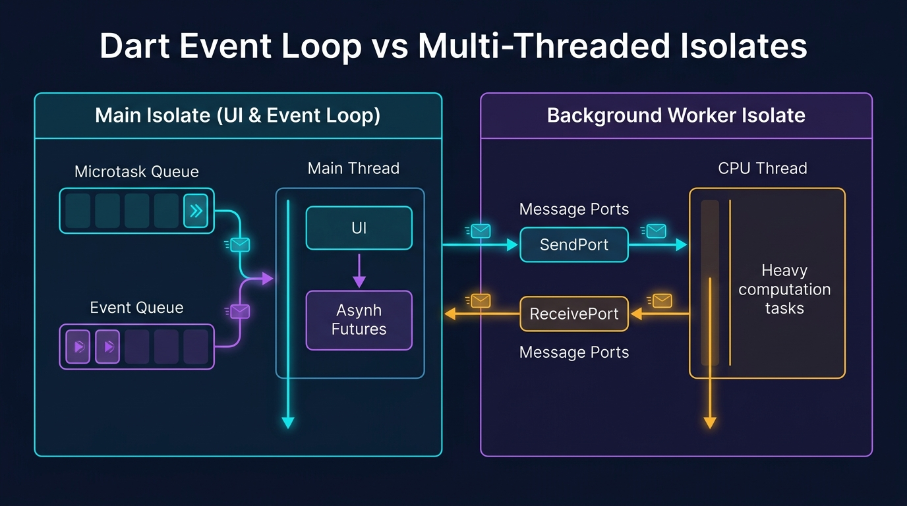

# Modul 01: Fondasi Dart 3+, OOP, & Concurrency (Isolates)

Selamat datang di **Modul 01**! Bahasa **Dart** adalah otak dan tulang punggung dari setiap aplikasi Flutter. Di modul ini, Anda akan menguasai sintaks modern **Dart 3+**, sistem tipe yang aman (*Sound Null Safety*), paradigma *Object-Oriented Programming (OOP)* tingkat lanjut, hingga eksekusi *asynchronous* dan **Multithreading dengan Isolates** agar aplikasi Anda berjalan super cepat tanpa pernah mengalami *freeze* (UI jank).

---

## 🧠 1. Analogi: Bahasa Pemikiran & Mesin Eksekusi

Bayangkan Anda sedang memimpin sebuah restoran cepat saji berstandar internasional:

| Konsep Dart | Analogi Restoran | Penjelasan Teknis |
|---|---|---|
| **Sound Null Safety** | **Pemeriksaan Stok Tanpa Gelas Kosong** | Mencegah aplikasi crash akibat memanggil data yang tidak ada (`null`) sebelum program dijalankan. |
| **Dart 3 Records & Pattern Matching** | **Piring Kombo & Sortir Pesanan Otomatis** | Mengemas banyak data sekaligus tanpa repot membuat wadah baru, serta menyortir tipe data dalam 1 baris ekspresi. |
| **Sealed Classes** | **Menu Tertutup Resmi** | Memastikan semua kemungkinan state (Loading, Success, Error) tertangani secara mutlak tanpa ada yang terlewat. |
| **Event Loop (Future & async/await)** | **Koki yang Menunggu Air Mendidih Sambil Memotong Sayur** | Menjalankan proses yang butuh waktu (misal: panggil API) tanpa menghentikan pelayanan pelanggan (UI). |
| **Isolates (Multithreading)** | **Koki Khusus di Dapur Belakang untuk Menghitung Stok Ribuan Barang** | Thread terpisah di CPU untuk tugas komputasi super berat agar kasir depan (UI) tetap melayani dengan mulus 120 FPS. |

---

## 🔒 2. Sistem Tipe Modern & Sound Null Safety

Dart adalah bahasa yang bertipe kuat (*strongly typed*) dengan fitur **Sound Null Safety**. Artinya, secara bawaan sebuah variabel **tidak boleh bernilai `null`** kecuali Anda mengizinkannya secara eksplisit.

### 2.1 Deklarasi Variabel & Immutability

```dart
void main() {
  // Type Inference: Tipe data dideteksi otomatis saat inisialisasi
  var nama = 'Anton'; // String
  var umur = 25;      // int

  // Immutability: Sangat dianjurkan di Flutter
  final waktuSekarang = DateTime.now(); // Nilai ditentukan saat runtime, tidak bisa diubah
  const phi = 3.14159;                 // Nilai konstan mutlak saat compile-time

  // Late Initialization: Diisi nanti sebelum digunakan
  late String tokenRahasia;
  tokenRahasia = 'JWT_ABC_123';
  print('Token: $tokenRahasia');
}
```

---

### 2.2 Operator Sakti Null Safety

| Operator | Nama | Kegunaan | Contoh Kode |
|:---:|---|---|---|
| `?` | **Nullable Type** | Menandakan variabel boleh bernilai `null`. | `String? namaPengguna;` |
| `!` | **Null Assertion** | Memaksa variabel nullable dianggap non-null (Gunakan hati-hati!). | `int panjang = namaPengguna!.length;` |
| `??` | **If-Null Operator** | Memberikan nilai cadangan *(fallback)* jika variabel bernilai `null`. | `String tampilan = namaPengguna ?? 'Tamu';` |
| `?.` | **Null-Aware Access** | Memanggil method/properti hanya jika objeknya bukan `null`. | `int? panjang = namaPengguna?.length;` |
| `??=` | **Null-Aware Assignment**| Mengisi nilai hanya jika variabel saat ini masih `null`. | `namaPengguna ??= 'Pengguna Baru';` |

#### ⚠️ Contoh Kasus Penting pada List:
```dart
List<String> a = ['A', 'B'];        // List tidak boleh null, isinya tidak boleh null
List<String?> b = ['A', null, 'B']; // List tidak boleh null, tapi isinya boleh null
List<String>? c = null;             // List boleh null, tapi isinya tidak boleh null
List<String?>? d = null;            // List boleh null, isinya pun boleh null
```

---

## ⚡ 3. Fitur Unggulan Dart 3+ Modern

Dart 3 memperkenalkan fitur revolusioner yang membuat kode lebih ringkas, aman, dan ekspresif.

### 3.1 Records & Tuples (Multiple Return Values)
Anda tidak perlu lagi membuat class model sementara hanya untuk mengembalikan 2 atau lebih nilai dari sebuah fungsi.

```dart
// Mengembalikan Record dengan posisi dan nama
(double lat, double lng, {String alamat}) getKoordinatToko() {
  return (-6.200000, 106.816666, alamat: 'Jakarta Pusat');
}

void main() {
  // Destructuring Record langsung ke variabel
  var (latitude, longitude, alamat: lokasi) = getKoordinatToko();
  print('Lokasi: $lokasi ($latitude, $longitude)');
}
```

---

### 3.2 Pattern Matching & Switch Expression
Menulis logika percabangan kompleks menjadi sangat ringkas dalam satu ekspresi:

```dart
String formatStatusPesanan(int statusCode) => switch (statusCode) {
  200 => 'Pesanan Berhasil Diproses ✅',
  400 || 422 => 'Data Tidak Valid ⚠️',
  401 => 'Sesi Berakhir, Silakan Login Ulang 🔒',
  >= 500 && <= 599 => 'Server Sedang Gangguan 💥',
  _ => 'Status Tidak Dikenal ❓', // Default case
};
```

---

### 3.3 Sealed Classes & Exhaustive Checking
`sealed class` sangat ideal untuk memodelkan **State Aplikasi** (digunakan di BLoC / Riverpod). Compiler akan menjamin seluruh kondisi tertangani tanpa butuh `default` case:

```dart
// Mendefinisikan seluruh kemungkinan status autentikasi
sealed class AuthState {}

class AuthInitial extends AuthState {}
class AuthLoading extends AuthState {}
class AuthSuccess extends AuthState {
  final String email;
  AuthSuccess(this.email);
}
class AuthFailure extends AuthState {
  final String errorMessage;
  AuthFailure(this.errorMessage);
}

// Compiler akan ERROR jika salah satu state lupa di-handle!
String renderUI(AuthState state) {
  return switch (state) {
    AuthInitial() => 'Tampilkan Tombol Login',
    AuthLoading() => 'Tampilkan Spinner Loading...',
    AuthSuccess(:final email) => 'Selamat Datang, $email!',
    AuthFailure(:final errorMessage) => 'Gagal Masuk: $errorMessage',
  };
}
```

---

## 📦 4. Koleksi & Functional Programming

Dart memiliki koleksi data yang sangat fleksibel untuk memanipulasi data sebelum ditampilkan ke UI.

```dart
void main() {
  final daftarHarga = [15000, 25000, 50000, 100000];
  final isAdmin = true;

  // 1. Collection-If & Spread Operator (...)
  final menuNavigasi = [
    'Home',
    'Katalog',
    if (isAdmin) 'Dashboard Admin', // Hanya muncul jika admin
    ...['Pengaturan', 'Keluar'],    // Menggabungkan list lain
  ];

  // 2. Functional Methods: map, where, fold
  final hargaDiskon = daftarHarga
      .where((harga) => harga >= 25000)      // Filter: harga >= 25000
      .map((harga) => harga * 0.9)          // Transformasi: Diskon 10%
      .toList();

  final totalBelanja = hargaDiskon.fold<double>(
    0.0, 
    (total, item) => total + item,
  );

  print('Menu: $menuNavigasi');
  print('Harga Diskon: $hargaDiskon');
  print('Total Tagihan: Rp $totalBelanja');
}
```

---

## 🏛️ 5. Object-Oriented Programming (OOP) Lanjutan

### 5.1 Constructor Khusus: Factory, Named, & Const

```dart
class Pengguna {
  final String id;
  final String nama;
  final String email;
  
  // Private field (Encapsulation)
  final String _apiKey;

  // 1. Generative Constructor
  const Pengguna({
    required this.id,
    required this.nama,
    required this.email,
    required String apiKey,
  }) : _apiKey = apiKey;

  // 2. Named Constructor
  Pengguna.tamu()
      : id = 'guest_0',
        nama = 'Pengunjung Tamu',
        email = 'guest@app.com',
        _apiKey = 'PUBLIC_KEY';

  // 3. Factory Constructor (Berguna untuk JSON Parsing & Caching Singleton)
  factory Pengguna.fromJson(Map<String, dynamic> json) {
    return Pengguna(
      id: json['id'] as String? ?? '0',
      nama: json['nama'] as String? ?? '',
      email: json['email'] as String? ?? '',
      apiKey: json['apiKey'] as String? ?? '',
    );
  }
}
```

---

### 5.2 Mixins & Extension Methods

* **Mixin (`with`)**: Berbagi kode antar class tanpa perlu inheritance bertingkat:
  ```dart
  mixin LoggerMixin {
    void logInfo(String pesan) {
      print('[INFO - ${DateTime.now()}]: $pesan');
    }
  }

  class AuthService with LoggerMixin {
    void login() {
      logInfo('User berhasil login');
    }
  }
  ```

* **Extension Methods**: Menambahkan fungsi baru ke tipe data bawaan yang sudah ada:
  ```dart
  extension RupiahFormatter on int {
    String toRupiah() {
      return 'Rp ${this.toString().replaceAllMapped(
        RegExp(r'(\d{1,3})(?=(\d{3})+(?!\d))'),
        (Match m) => '${m[1]}.',
      )}';
    }
  }

  void main() {
    int saldo = 1500000;
    print(saldo.toRupiah()); // Output: Rp 1.500.000
  }
  ```

---

## ⏳ 6. Asynchronous Programming (Future, Stream, async/await)

### 6.1 Event Loop di Dart
Dart menjalankan program dalam model **Single-Threaded Event Loop**:
1. **Microtask Queue**: Tugas internal prioritas tinggi (dieksekusi lebih dulu).
2. **Event Queue**: Event eksternal (I/O, klik mouse, response HTTP, timer).

### 6.2 Future & async/await
`Future` mewakili data yang belum tersedia sekarang, tetapi akan selesai di masa depan:

```dart
Future<String> ambilDataUser() async {
  // Simulasi penundaan jaringan 2 detik
  await Future.delayed(const Duration(seconds: 2));
  return 'Data Pengguna Berhasil Diambil';
}

void main() async {
  print('1. Mulai Request Data');
  try {
    final hasil = await ambilDataUser();
    print('2. Hasil: $hasil');
  } catch (error) {
    print('Terjadi Error: $error');
  } finally {
    print('3. Selesai');
  }
}
```

---

### 6.3 Stream: Aliran Data Realtime
`Stream` digunakan saat data datang berkali-kali secara kontinu (misal: WebSocket, sensor GPS, detak jam):

```dart
Stream<int> hitungMundur(int detik) async* {
  for (int i = detik; i >= 1; i--) {
    await Future.delayed(const Duration(seconds: 1));
    yield i; // Mengalirkan nilai ke listener
  }
}

void main() async {
  print('Waktu Peluncuran:');
  await for (final hitungan in hitungMundur(3)) {
    print('$hitungan...');
  }
  print('🚀 Meluncur!');
}
```

---

## 🧵 7. Concurrency & Multithreading dengan Dart Isolates

Ketika Anda harus memproses **komputasi super berat** (misal: enkripsi password ribuan kali, manipulasi matriks gambar resolusi tinggi, atau mem-parsing JSON ratusan megabyte), menjalankannya di `Future` biasa tetap bisa membuat UI aplikasi **macet/freeze**, karena `Future` tetap berbagi thread CPU utama (*Main Thread*).

Solusinya adalah menggunakan **Isolates**!

---

<p align="center">
  
</p>

---

### 7.1 Cara Mudah: Menggunakan `compute()`
`compute()` secara otomatis membuat Isolate baru, mengeksekusi fungsi berat di latar belakang, lalu mengembalikan hasilnya ke thread utama:

```dart
import 'package:flutter/foundation.dart';

// Fungsi berat HARUS berupa fungsi top-level atau static
int hitungFibonacciBerat(int n) {
  if (n <= 1) return n;
  return hitungFibonacciBerat(n - 1) + hitungFibonacciBerat(n - 2);
}

void main() async {
  print('Mulai komputasi berat di background thread...');
  
  // Dijalankan di Isolate terpisah tanpa membuat UI freeze
  final hasil = await compute(hitungFibonacciBerat, 40);
  
  print('Hasil Fibonacci: $hasil');
}
```

---

### 7.2 Tingkat Mahir: Komunikasi Port Dua Arah (`Isolate.spawn`)
Untuk komunikasi kontinu antar thread, gunakan `ReceivePort` dan `SendPort`:

```dart
import 'dart:isolate';

// Fungsi worker yang berjalan di thread terpisah
void backgroundWorker(SendPort mainSendPort) {
  // Buat port untuk menerima pesan dari main thread
  final workerReceivePort = ReceivePort();
  
  // Kirim balik SendPort milik worker ini ke main thread
  mainSendPort.send(workerReceivePort.sendPort);

  // Dengarkan pesan yang masuk
  workerReceivePort.listen((pesan) {
    if (pesan is Map<String, dynamic>) {
      final angka = pesan['angka'] as int;
      final kuadrat = angka * angka;
      // Kirim hasil kembali ke main thread
      mainSendPort.send({'status': 'SUCCESS', 'hasil': kuadrat});
    }
  });
}

void main() async {
  final mainReceivePort = ReceivePort();
  
  // 1. Buat Isolate baru
  await Isolate.spawn(backgroundWorker, mainReceivePort.sendPort);

  SendPort? workerSendPort;

  // 2. Dengarkan jawaban dari worker
  mainReceivePort.listen((pesan) {
    if (pesan is SendPort) {
      workerSendPort = pesan;
      print('✅ Terhubung ke Background Worker Isolate!');
      
      // Kirim data pekerjaan ke worker
      workerSendPort?.send({'angka': 125});
    } else if (pesan is Map<String, dynamic>) {
      print('🎉 Hasil Diterima dari Worker: ${pesan['hasil']}');
      mainReceivePort.close(); // Tutup port setelah selesai
    }
  });
}
```

---

## 💻 8. Hands-on Project: CLI High-Performance Data & Matrix Processor

Mari buat proyek mini CLI Dart lengkap yang memproses perhitungan data besar menggunakan multithreading Isolates:

1. **Buat file baru** `cli_processor.dart` di folder Anda.
2. **Salin kode lengkap berikut**:

```dart
import 'dart:isolate';
import 'dart:math';

// Data transfer object untuk komputasi
class MatrixTask {
  final int id;
  final int size;
  MatrixTask(this.id, this.size);
}

class MatrixResult {
  final int id;
  final double sum;
  final Duration duration;
  MatrixResult(this.id, this.sum, this.duration);
}

// Fungsi komputasi berat
MatrixResult processMatrix(MatrixTask task) {
  final stopwatch = Stopwatch()..start();
  final random = Random();
  double total = 0.0;

  // Simulasi perhitungan matriks besar
  for (int i = 0; i < task.size; i++) {
    for (int j = 0; j < task.size; j++) {
      total += sin(random.nextDouble()) * cos(random.nextDouble());
    }
  }
  stopwatch.stop();
  return MatrixResult(task.id, total, stopwatch.elapsed);
}

void main() async {
  print('====================================================');
  print('🚀 MEMULAI PEMROSESAN PARALEL DART ISOLATES');
  print('====================================================');

  final totalTasks = 4;
  final taskSize = 2500; // Ukuran matriks 2500 x 2500 elemen
  final results = <Future<MatrixResult>>[];

  final totalTimer = Stopwatch()..start();

  for (int i = 1; i <= totalTasks; i++) {
    final task = MatrixTask(i, taskSize);
    print('Mengirim Tugas #$i ke Thread Isolate...');
    
    // Menjalankan di Isolate terpisah
    results.add(Isolate.run(() => processMatrix(task)));
  }

  // Menunggu seluruh Isolate selesai bekerja
  final finishedResults = await Future.wait(results);
  totalTimer.stop();

  print('\n------------------- HASIL PERHITUNGAN -------------------');
  for (final res in finishedResults) {
    print('Tugas #${res.id} Selesai | Total: ${res.sum.toStringAsFixed(2)} | Waktu: ${res.duration.inMilliseconds} ms');
  }

  print('====================================================');
  print('⚡ Total Waktu Paralel: ${totalTimer.elapsedMilliseconds} ms');
  print('====================================================');
}
```

3. **Jalankan via Terminal**:
   ```bash
   dart run cli_processor.dart
   ```
   *Anda akan melihat 4 tugas matriks jutaan operasi selesai diproses secara paralel memanfaatkan seluruh core CPU Anda tanpa hambatan!*

---

## ⚠️ 9. Jebakan Umum (*Common Pitfalls*) & Solusi Kilat

| Kesalahan Umum | Contoh Kasus Error | Solusi yang Benar |
|---|---|---|
| **1. Unhandled Null (`!`)** | `String? email; print(email!.length);` ➔ Crash `Null check operator on null`. | Gunakan fallback operator: `print(email?.length ?? 0);` |
| **2. Lupa `await` pada Future** | `var data = fetchData(); print(data.nama);` ➔ Error: `Future<User>` tidak punya properti `nama`. | Selalu gunakan `await`: `var data = await fetchData();` |
| **3. Non-Exhaustive Switch** | Switch pada `sealed class` lupa menangani salah satu state error. | Pastikan seluruh class turunan masuk ke dalam cabang `switch`. |
| **4. Komputasi Berat di Main Thread** | Loop 10.000.000 kali di dalam event UI ➔ Layar HP freeze 2 detik. | Bungkus proses komputasi ke dalam `compute()` atau `Isolate.run()`. |
| **5. Mengirim Closure ke Isolate** | Mengirim fungsi anonim yang menangkap variabel lokal ke `Isolate.spawn`. | Fungsi worker untuk Isolate **harus berupa Top-Level function atau Static method**. |

---

## 📝 10. Kuis Pemahaman Modul 01

1. **Apa perbedaan antara `final` dan `const` di Dart?**  
   *Jawaban:* `const` adalah nilai konstan mutlak yang sudah diketahui pada saat *compile-time*. `final` adalah nilai yang hanya bisa diinisialisasi satu kali saat *runtime* (misal: hasil `DateTime.now()`).
2. **Kapan kita harus menggunakan `Isolates` dibandingkan `Future` biasa?**  
   *Jawaban:* Gunakan `Future` untuk operasi asinkron I/O (seperti request API, membaca disk) yang sifatnya menunggu. Gunakan `Isolates` saat melakukan komputasi CPU berat (seperti kompresi video/gambar, enkripsi, parsing data besar) agar Main Thread UI tidak mengalami *freeze/jank*.
3. **Apa fungsi utama dari `sealed class` di Dart 3?**  
   *Jawaban:* Untuk membuat hierarki class tertutup yang memungkinkan compiler melakukan *exhaustive checking* saat dicocokkan dengan pattern matching (`switch`), sehingga tidak ada state aplikasi yang lupa ditangani.

---

## 🎯 Rangkuman & Checklist Kompetensi

- [x] Memahami Sound Null Safety (`?`, `!`, `??`, `?.`, `??=`).
- [x] Menguasai fitur Dart 3: Records, Pattern Matching, Destructuring, dan Sealed Classes.
- [x] Mampu memanipulasi List/Map/Set dengan functional programming (`where`, `map`, `fold`).
- [x] Menguasai OOP: Factory Constructors, Mixins, Generics, dan Extension Methods.
- [x] Memahami arsitektur Event Loop, Future, dan Stream asynchronous.
- [x] Mampu mengimplementasikan Multithreading Concurrency dengan `compute()` dan `Isolate.run()`.
- [x] Berhasil menguji coba proyek mini CLI Data Processor paralel.

---

👉 **Langkah Selanjutnya**: Logika bahasa Dart dan Concurrency Anda sudah sangat matang! Mari melangkah ke **[Modul 02: Flutter UI Mastery, Impeller Engine, & Slivers](../modul-02-ui-dan-slivers/README.md)** untuk mulai merancang antarmuka visual aplikasi yang responsif dan elegan.
