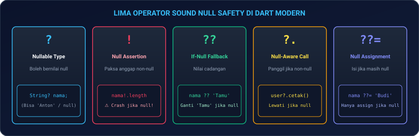
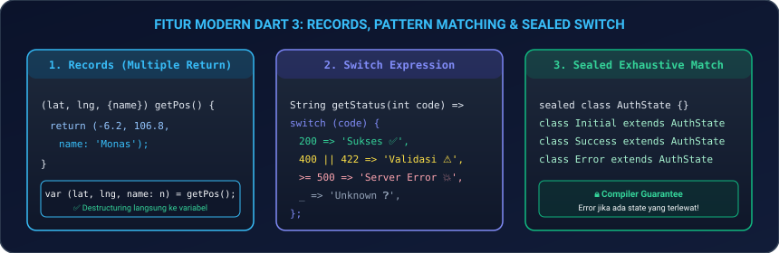
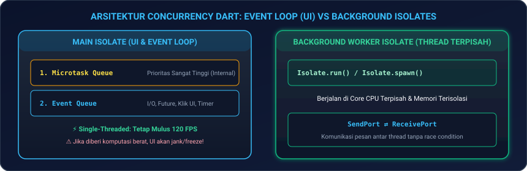

# Modul 01: Fondasi Dart 3+, OOP, & Concurrency (Isolates)

Selamat datang di **Modul 01**! Bahasa **Dart** adalah otak dan tulang punggung dari setiap aplikasi Flutter. Di modul ini, Anda akan menguasai sintaks modern **Dart 3+**, sistem tipe yang aman (*Sound Null Safety*), paradigma *Object-Oriented Programming (OOP)* tingkat lanjut, hingga eksekusi *asynchronous* dan **Multithreading dengan Isolates** agar aplikasi Anda berjalan super cepat tanpa pernah mengalami *freeze* (UI jank).

---

## 🧠 1. Analogi: Bahasa Pemikiran & Mesin Eksekusi

Bayangkan Anda sedang memimpin sebuah restoran cepat saji berstandar internasional:

| Konsep Dart | Analogi Restoran | Penjelasan Teknis |
|---|---|---|
| **Sound Null Safety** | **Pemeriksaan Stok Tanpa Gelas Kosong** | Mencegah aplikasi crash akibat memanggil data yang tidak ada (`null`) sebelum program dijalankan. |
| **Dart 3 Records & Pattern Matching** | **Piring Kombo & Sortir Pesanan Otomatis** | Mengemas banyak data sekaligus tanpa repot membuat wadah baru, serta menyortir tipe data dalam 1 baris ekspresi. |
| **Sealed Classes & Enhanced Enums** | **Menu Standar Tertutup Resmi** | Memastikan semua kemungkinan status data tertangani secara mutlak tanpa ada yang terlewat oleh compiler. |
| **Event Loop (Future & async/await)** | **Koki yang Menunggu Air Mendidih Sambil Memotong Sayur** | Menjalankan proses yang butuh waktu (misal: panggil API) tanpa menghentikan pelayanan pelanggan (UI). |
| **Isolates (Multithreading)** | **Koki Khusus di Dapur Belakang untuk Menghitung Stok Ribuan Barang** | Thread terpisah di CPU untuk tugas komputasi super berat agar kasir depan (UI) tetap melayani dengan mulus 120 FPS. |

---

## 🔒 2. Sistem Tipe Modern & Sound Null Safety

Dart adalah bahasa yang bertipe kuat (*strongly typed*) dengan fitur **Sound Null Safety**. Artinya, secara bawaan sebuah variabel **tidak boleh bernilai `null`** kecuali Anda mengizinkannya secara eksplisit.

<p align="center">
  
</p>

### 2.1 Deklarasi Variabel & Immutability

```dart
void main() {
  // 1. Type Inference: Tipe data dideteksi otomatis saat inisialisasi
  var nama = 'Anton'; // String
  var umur = 25;      // int

  // 2. Immutability: Sangat dianjurkan di Flutter untuk performa optimal
  final waktuSekarang = DateTime.now(); // Ditentukan saat runtime, tidak bisa diubah
  const phi = 3.14159;                 // Nilai konstan mutlak saat compile-time

  // 3. Late Initialization: Diisi nanti sebelum digunakan
  late String tokenRahasia;
  tokenRahasia = 'JWT_ABC_123';
  print('Token: $tokenRahasia');
}
```

---

### 2.2 Operator Sakti Null Safety

| Operator | Nama | Kegunaan | Contoh Kode |
|:---:|---|---|---|
| `?` | **Nullable Type** | Menandakan variabel boleh bernilai `null`. | `String? namaPengguna;` |
| `!` | **Null Assertion** | Memaksa variabel nullable dianggap non-null (Gunakan hati-hati!). | `int panjang = namaPengguna!.length;` |
| `??` | **If-Null Operator** | Memberikan nilai cadangan *(fallback)* jika variabel bernilai `null`. | `String tampilan = namaPengguna ?? 'Tamu';` |
| `?.` | **Null-Aware Access** | Memanggil method/properti hanya jika objeknya bukan `null`. | `int? panjang = namaPengguna?.length;` |
| `??=` | **Null-Aware Assignment**| Mengisi nilai hanya jika variabel saat ini masih `null`. | `namaPengguna ??= 'Pengguna Baru';` |

#### ⚠️ Contoh Kasus Penting pada List & Generics:
```dart
List<String> a = ['A', 'B'];        // List tidak boleh null, isinya tidak boleh null
List<String?> b = ['A', null, 'B']; // List tidak boleh null, tapi isinya boleh null
List<String>? c = null;             // List boleh null, tapi isinya tidak boleh null
List<String?>? d = null;            // List boleh null, isinya pun boleh null
```

---

## ⚡ 3. Fitur Unggulan Dart 3+ Modern

Dart 3 memperkenalkan fitur revolusioner yang membuat kode lebih ringkas, aman, dan ekspresif.

<p align="center">
  
</p>

### 3.1 Records & Tuples (Multiple Return Values)
Anda tidak perlu lagi membuat class model sementara hanya untuk mengembalikan 2 atau lebih nilai dari sebuah fungsi:

```dart
// Mengembalikan Record dengan posisi dan nama (Positional & Named fields)
(double lat, double lng, {String alamat}) getKoordinatToko() {
  return (-6.200000, 106.816666, alamat: 'Jakarta Pusat');
}

void main() {
  // Destructuring Record langsung ke variabel terpisah
  var (latitude, longitude, alamat: lokasi) = getKoordinatToko();
  print('Lokasi: $lokasi ($latitude, $longitude)');
}
```

---

### 3.2 Pattern Matching & Switch Expression
Menulis logika percabangan kompleks menjadi sangat ringkas dalam satu ekspresi:

```dart
String formatStatusPesanan(int statusCode) => switch (statusCode) {
  200 => 'Pesanan Berhasil Diproses ✅',
  400 || 422 => 'Data Tidak Valid ⚠️',
  401 => 'Sesi Berakhir, Silakan Login Ulang 🔒',
  >= 500 && <= 599 => 'Server Sedang Gangguan 💥',
  _ => 'Status Tidak Dikenal ❓', // Default case
};
```

---

### 3.3 Class Modifiers di Dart 3
Dart 3 memperkenalkan pengatur izin class yang sangat ketat untuk pembuatan library dan arsitektur enterprise:

| Modifier | Dapat Di-extend (`extends`)? | Dapat Di-implement (`implements`)? | Dapat Di-instansiasi (`new`)? | Kapan Digunakan? |
|---|:---:|:---:|:---:|---|
| **`sealed`** | Hanya di berkas yang sama | Hanya di berkas yang sama | ❌ Tidak | State Management (BLoC/Riverpod) untuk *exhaustive matching*. |
| **`abstract`** | ✅ Ya | ✅ Ya | ❌ Tidak | Kontrak dasar interface atau template class. |
| **`base`** | ✅ Ya (subclass wajib `base`/`final`/`sealed`) | ❌ Tidak | ✅ Ya | Memaksa pewarisan method utuh tanpa boleh dirombak kontraknya. |
| **`interface`**| ❌ Di luar library | ✅ Ya | ✅ Ya | Kontrak murni yang wajib diimplementasikan ulang di luar library. |
| **`final`** | ❌ Tidak boleh di luar library | ❌ Tidak boleh di luar library | ✅ Ya | Mencegah pembajakan / perubahan class dari luar package. |
| **`mixin class`**| ✅ Ya | ✅ Ya | ✅ Ya (bisa `with`) | Class yang bisa digunakan sebagai `mixin` sekaligus class biasa. |

```dart
// Contoh Sealed Class Hierarchy
sealed class AuthState {}
class AuthInitial extends AuthState {}
class AuthLoading extends AuthState {}
class AuthSuccess extends AuthState {
  final String email;
  AuthSuccess(this.email);
}
class AuthFailure extends AuthState {
  final String errorMessage;
  AuthFailure(this.errorMessage);
}
```

---

### 3.4 Enhanced Enums (Enum dengan Properti & Method)
Dart 3 memungkinkan enum memiliki variabel anggota, constructor, dan method kustom:

```dart
enum PaymentMethod {
  qris('QRIS Instant', fee: 1000),
  virtualAccount('BCA Virtual Account', fee: 4000),
  creditCard('Kartu Kredit', fee: 5000);

  final String label;
  final int fee;
  
  const PaymentMethod(this.label, {required this.fee});

  int hitungTotal(int harga) => harga + fee;
}
```

---

### 3.5 Extension Types (Dart 3.3+ Zero-Cost Abstraction)
`extension type` memberikan keamanan tipe data saat *compile-time* tanpa membebani alokasi memori (*zero runtime overhead*):

```dart
// Membungkus tipe int murni menjadi UserId bertipe kuat
extension type const UserId(int id) {
  bool get isValid => id > 0;
  void cetakInfo() => print('User ID: #$id');
}

void main() {
  final user = UserId(101);
  if (user.isValid) user.cetakInfo();
}
```

---

## 📦 4. Koleksi & Functional Programming

Dart memiliki koleksi data yang sangat fleksibel (`List`, `Map`, `Set`, `Queue`) untuk memanipulasi data:

```dart
import 'dart:collection';

void main() {
  final daftarHarga = [15000, 25000, 50000, 100000, 75000];
  final isAdmin = true;

  // 1. Collection-If & Spread Operator (...)
  final menuNavigasi = [
    'Home',
    'Katalog',
    if (isAdmin) 'Dashboard Admin',
    ...['Pengaturan', 'Keluar'],
  ];

  // 2. Functional Methods: where, map, fold, reduce
  final hargaDiskon = daftarHarga
      .where((h) => h >= 25000)
      .map((h) => (h * 0.9).round())
      .toList();

  final total = hargaDiskon.fold<int>(0, (sum, item) => sum + item);
  final hargaTertinggi = hargaDiskon.reduce((curr, next) => curr > next ? curr : next);

  // 3. Utilitas Tambahan: any, every, take, skip
  final adaHargaMahal = hargaDiskon.any((h) => h > 80000); // true
  final semuaValid = hargaDiskon.every((h) => h > 0);      // true
  final duaPertama = hargaDiskon.take(2).toList();
  final sisaSetelahDua = hargaDiskon.skip(2).toList();

  // 4. Queue (Antrean FIFO / LIFO Efisien)
  final Queue<String> antreanTiket = Queue()..addAll(['Antrean 1', 'Antrean 2']);
  antreanTiket.addLast('Antrean 3');
  final diproses = antreanTiket.removeFirst();
}
```

---

## 🏛️ 5. Object-Oriented Programming (OOP) Lanjutan

### 5.1 Constructor Khusus: Generative, Named, Factory, & Initializer Lists

```dart
class Pengguna {
  final String id;
  final String nama;
  final String email;
  final String _apiKey;

  // 1. Initializer List & Assert
  Pengguna({
    required this.id,
    required this.nama,
    required this.email,
    required String apiKey,
  }) : _apiKey = apiKey,
       assert(id.isNotEmpty, 'ID tidak boleh kosong');

  // 2. Named & Redirecting Constructor
  Pengguna.tamu() : this(id: 'guest_0', nama: 'Tamu', email: 'guest@app.com', apiKey: 'PUBLIC');

  // 3. Factory Constructor (Berguna untuk Caching & JSON Parsing)
  factory Pengguna.fromJson(Map<String, dynamic> json) {
    return Pengguna(
      id: json['id'] as String? ?? '0',
      nama: json['nama'] as String? ?? '',
      email: json['email'] as String? ?? '',
      apiKey: json['apiKey'] as String? ?? '',
    );
  }
}
```

---

### 5.2 Kesetaraan Objek (*Object Equality & HashCode*)
Secara default, Dart membandingkan objek berdasarkan **referensi memori**, bukan isinya:

```dart
class Produk {
  final String id;
  final int harga;
  const Produk(this.id, this.harga);

  @override
  bool operator ==(Object other) =>
      identical(this, other) ||
      other is Produk &&
          runtimeType == other.runtimeType &&
          id == other.id &&
          harga == other.harga;

  @override
  int get hashCode => id.hashCode ^ harga.hashCode;
}
```

---

### 5.3 Mixins & Extension Methods

* **Mixin (`with`)**: Berbagi fungsionalitas antar class tanpa pewarisan bertingkat:
  ```dart
  mixin LoggerMixin {
    void logInfo(String pesan) => print('[LOG]: $pesan');
  }
  class AuthService with LoggerMixin {}
  ```

* **Extension Methods**: Menambahkan method baru pada tipe bawaan:
  ```dart
  extension RupiahFormatter on int {
    String toRupiah() => 'Rp ${toString().replaceAllMapped(RegExp(r'(\d{1,3})(?=(\d{3})+(?!\d))'), (m) => '${m[1]}.')}';
  }
  ```

---

## ⏳ 6. Asynchronous Programming (Future, Stream, async/await)

### 6.1 Event Loop & Penanganan Future
```dart
Future<void> demoAsync() async {
  // Future.wait untuk menjalankan banyak Future secara paralel
  final results = await Future.wait([
    Future.delayed(const Duration(seconds: 1), () => 'Data Profil'),
    Future.delayed(const Duration(seconds: 1), () => 'Data Transaksi'),
  ]);

  // Timeout Handling
  try {
    final res = await Future.delayed(const Duration(seconds: 5), () => 'OK')
        .timeout(const Duration(seconds: 2));
  } catch (e) {
    print('Request Timeout! ⏱️');
  }
}
```

---

### 6.2 Completer: Mengubah Callback Menjadi Future
```dart
import 'dart:async';

Future<String> downloadFileAsync() {
  final completer = Completer<String>();
  Timer(const Duration(seconds: 1), () {
    completer.complete('Download File Selesai! 📂');
  });
  return completer.future;
}
```

---

### 6.3 Stream & Broadcast Streams
```dart
Stream<int> hitungMundur(int detik) async* {
  for (int i = detik; i >= 1; i--) {
    await Future.delayed(const Duration(seconds: 1));
    yield i;
  }
}

void main() async {
  final stream = hitungMundur(3).asBroadcastStream();
  // Banyak listener dapat mendengarkan sekaligus
  stream.listen((v) => print('Listener A: $v'));
  stream.listen((v) => print('Listener B: $v'));
}
```

---

## 🧵 7. Concurrency & Multithreading dengan Dart Isolates

Ketika memproses komputasi berat (misal: enkripsi password ribuan kali, manipulasi matriks gambar resolusi tinggi, atau mem-parsing JSON ratusan megabyte), menjalankannya di `Future` biasa tetap membuat UI aplikasi **macet/freeze (jank)**. Solusinya adalah **Isolates**!

<p align="center">
  
</p>

---

### 7.1 Cara Mudah: `Isolate.run()` atau `compute()`
```dart
import 'dart:isolate';

int hitungFibonacci(int n) {
  if (n <= 1) return n;
  return hitungFibonacci(n - 1) + hitungFibonacci(n - 2);
}

void main() async {
  // Dijalankan di Isolate thread terpisah tanpa membuat UI freeze
  final hasil = await Isolate.run(() => hitungFibonacci(40));
  print('Hasil Fibonacci: $hasil');
}
```

---

### 7.2 Tingkat Mahir: Komunikasi Port Dua Arah (`Isolate.spawn`)
```dart
import 'dart:isolate';

void backgroundWorker(SendPort mainSendPort) {
  final workerReceivePort = ReceivePort();
  mainSendPort.send(workerReceivePort.sendPort);

  workerReceivePort.listen((pesan) {
    if (pesan is Map<String, dynamic>) {
      final angka = pesan['angka'] as int;
      mainSendPort.send({'status': 'SUCCESS', 'hasil': angka * angka});
    }
  });
}

void main() async {
  final mainReceivePort = ReceivePort();
  await Isolate.spawn(backgroundWorker, mainReceivePort.sendPort);

  mainReceivePort.listen((pesan) {
    if (pesan is SendPort) {
      pesan.send({'angka': 125});
    } else if (pesan is Map<String, dynamic>) {
      print('🎉 Hasil Diterima dari Worker: ${pesan['hasil']}');
      mainReceivePort.close();
    }
  });
}
```

> [!TIP]
> **Penting untuk Flutter Plugin di Background Isolate**:  
> Jika Anda menggunakan plugin Flutter (seperti SQLite atau SharedPreferences) di dalam Isolate manual, panggil `BackgroundIsolateBinaryMessenger.ensureInitialized(token)` menggunakan `RootIsolateToken.instance!` agar komunikasi platform channel tetap aktif.

---

## 💻 8. Hands-on Project: CLI High-Performance Data & Matrix Processor

Mari buat program CLI Dart lengkap yang memproses perhitungan data besar menggunakan multithreading Isolates:

1. **Buat file baru** `cli_processor.dart` di folder Anda.
2. **Salin kode lengkap berikut**:

```dart
import 'dart:isolate';
import 'dart:math';

// Data transfer object untuk komputasi
class MatrixTask {
  final int id;
  final int size;
  MatrixTask(this.id, this.size);
}

class MatrixResult {
  final int id;
  final double sum;
  final Duration duration;
  MatrixResult(this.id, this.sum, this.duration);
}

// Fungsi komputasi berat
MatrixResult processMatrix(MatrixTask task) {
  final stopwatch = Stopwatch()..start();
  final random = Random();
  double total = 0.0;

  // Simulasi perhitungan matriks besar
  for (int i = 0; i < task.size; i++) {
    for (int j = 0; j < task.size; j++) {
      total += sin(random.nextDouble()) * cos(random.nextDouble());
    }
  }
  stopwatch.stop();
  return MatrixResult(task.id, total, stopwatch.elapsed);
}

void main() async {
  print('====================================================');
  print('🚀 MEMULAI PEMROSESAN PARALEL DART ISOLATES');
  print('====================================================');

  final totalTasks = 4;
  final taskSize = 2500; // Matriks 2500 x 2500 elemen
  final results = <Future<MatrixResult>>[];

  final totalTimer = Stopwatch()..start();

  for (int i = 1; i <= totalTasks; i++) {
    final task = MatrixTask(i, taskSize);
    print('Mengirim Tugas #$i ke Thread Isolate...');
    
    // Menjalankan di Isolate terpisah
    results.add(Isolate.run(() => processMatrix(task)));
  }

  // Menunggu seluruh Isolate selesai bekerja
  final finishedResults = await Future.wait(results);
  totalTimer.stop();

  print('\n------------------- HASIL PERHITUNGAN -------------------');
  for (final res in finishedResults) {
    print('Tugas #${res.id} Selesai | Total: ${res.sum.toStringAsFixed(2)} | Waktu: ${res.duration.inMilliseconds} ms');
  }

  print('====================================================');
  print('⚡ Total Waktu Paralel: ${totalTimer.elapsedMilliseconds} ms');
  print('====================================================');
}
```

3. **Jalankan via Terminal**:
   ```bash
   dart run cli_processor.dart
   ```
   *Anda akan melihat 4 tugas komputasi jutaan operasi selesai diproses secara paralel memanfaatkan seluruh core CPU Anda tanpa hambatan!*

---

## ⚠️ 9. Jebakan Umum (*Common Pitfalls*) & Solusi Kilat

| Kesalahan Umum | Contoh Kasus Error | Solusi yang Benar |
|---|---|---|
| **1. Unhandled Null (`!`)** | `String? email; print(email!.length);` ➔ Crash `Null check operator on null`. | Gunakan fallback operator: `print(email?.length ?? 0);` |
| **2. Lupa `await` pada Future** | `var data = fetchData(); print(data.nama);` ➔ Error: `Future<User>` tidak punya properti `nama`. | Selalu gunakan `await`: `var data = await fetchData();` |
| **3. Non-Exhaustive Switch** | Switch pada `sealed class` lupa menangani salah satu state error. | Pastikan seluruh class turunan masuk ke dalam cabang `switch`. |
| **4. Komputasi Berat di Main Thread** | Loop 10.000.000 kali di dalam event UI ➔ Layar HP freeze 2 detik. | Bungkus proses komputasi ke dalam `compute()` atau `Isolate.run()`. |
| **5. Mengirim Closure ke Isolate** | Mengirim fungsi anonim yang menangkap variabel lokal ke `Isolate.spawn`. | Fungsi worker untuk Isolate **harus berupa Top-Level function atau Static method**. |

---

## 📝 10. Kuis Pemahaman Modul 01

1. **Apa perbedaan antara `final` dan `const` di Dart?**  
   *Jawaban:* `const` adalah nilai konstan mutlak yang sudah diketahui pada saat *compile-time*. `final` adalah nilai yang hanya bisa diinisialisasi satu kali saat *runtime* (misal: hasil `DateTime.now()`).
2. **Kapan kita harus menggunakan `Isolates` dibandingkan `Future` biasa?**  
   *Jawaban:* Gunakan `Future` untuk operasi asinkron I/O (seperti request API, membaca disk) yang sifatnya menunggu. Gunakan `Isolates` saat melakukan komputasi CPU berat (seperti kompresi video/gambar, enkripsi, parsing data besar) agar Main Thread UI tidak mengalami *freeze/jank*.
3. **Apa fungsi utama dari `sealed class` di Dart 3?**  
   *Jawaban:* Untuk membuat hierarki class tertutup yang memungkinkan compiler melakukan *exhaustive checking* saat dicocokkan dengan pattern matching (`switch`), sehingga tidak ada state aplikasi yang lupa ditangani.

---

## 🎯 Rangkuman & Checklist Kompetensi

- [x] Memahami Sound Null Safety (`?`, `!`, `??`, `?.`, `??=`).
- [x] Menguasai fitur Dart 3: Records, Pattern Matching, Destructuring, Sealed Classes, Class Modifiers, dan Enhanced Enums.
- [x] Memahami Extension Types (Dart 3.3+ zero-cost wrapper).
- [x] Mampu memanipulasi List/Map/Set/Queue dengan functional programming (`where`, `map`, `fold`, `reduce`, `any`, `every`, `take`, `skip`).
- [x] Menguasai OOP: Factory, Named, Redirecting Constructors, Initializer Lists, Generics, Extension Methods, dan Object Equality (`==`).
- [x] Memahami arsitektur Event Loop, Future, Future.wait, Completer, dan Broadcast Stream.
- [x] Mampu mengimplementasikan Multithreading Concurrency dengan `compute()`, `Isolate.run()`, dan `Isolate.spawn()`.
- [x] Berhasil menguji coba proyek mini CLI Data Processor paralel.

---

👉 **Langkah Selanjutnya**: Logika bahasa Dart dan Concurrency Anda sudah sangat matang! Mari melangkah ke **[Modul 02A: Fondasi Flutter UI, Layouting, & Scrolling Dasar](../modul-02a-dasar-ui-dan-layout/README.md)** untuk mulai merancang antarmuka visual aplikasi dari dasar dengan mudah dan percaya diri.
