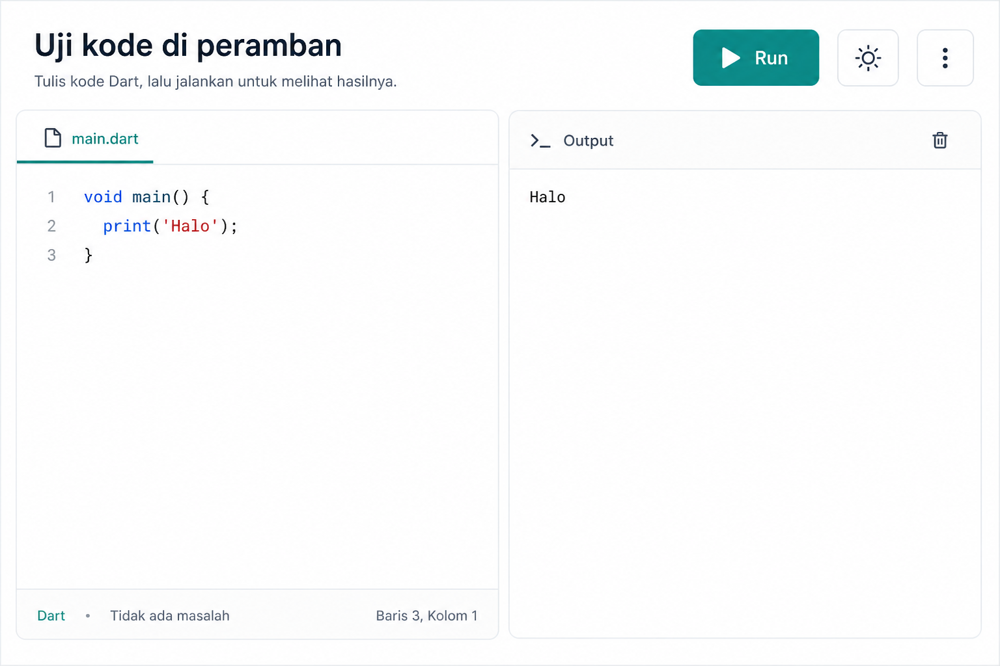
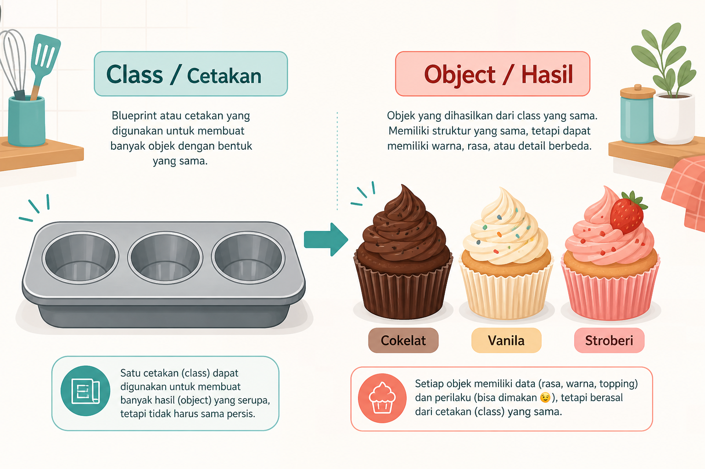

# Modul 01 — Dart: bahasa yang dipakai Flutter SDK

**Waktu:** 2 sesi  
**Prasyarat:** Modul 00 (minimal DartPad sudah dicoba). Flutter SDK lokal disarankan, belum wajib untuk sesi ini.  
**Hasil:** Anda dapat membaca cuplikan Dart, menulis fungsi, dan menangani kesalahan sederhana.

---

## Buka alat ini terlebih dahulu

Hampir semua contoh di modul ini diuji di **DartPad**, supaya hasilnya terlihat tanpa menunggu emulator.

| Urutan | Buka | Untuk apa |
| --- | --- | --- |
| 1 | Peramban → [https://dartpad.dev](https://dartpad.dev) | Uji setiap cuplikan |
| 2 | Sakelar mode **Dart** (bukan Flutter) | `print` muncul di panel konsol |
| 3 | Tombol **Run** | Menjalankan `main()` |
| 4 | (Opsional) Terminal VS Code | `dart` lokal, setelah Modul 00 selesai |



*Ilustrasi asli materi mobile2026. Tampilan DartPad sungguhan: [dartpad.dev](https://dartpad.dev).*

### Pola uji (ulangi setiap contoh)

| | |
| --- | --- |
| **Buka** | [dartpad.dev](https://dartpad.dev) → mode **Dart** |
| **Tempel** | seluruh berkas, termasuk `void main() { ... }` |
| **Klik** | **Run** |
| **Lihat** | panel **Console** di kanan |

Tanpa `main()`, DartPad tidak punya pintu masuk. Jangan hanya menempelkan satu baris `var nama = ...`.

---

## 1. Kenapa harus ada bahasa, bukan hanya "geser widget"

Flutter SDK merakit tampilan. Dart memutuskan **apa yang terjadi**:

- harga setelah diskon berapa;
- daftar kosong atau berisi;
- unduhan sudah selesai atau masih menunggu.

Analogi: widget adalah meja makan. Dart adalah resep di dapur.

---

## 2. Variabel dan tipe

Variabel adalah kotak berlabel. Tipe adalah aturan isi kotak itu.

| | |
| --- | --- |
| **Buka** | DartPad, mode Dart |
| **Tempel** | kode berikut |
| **Run** | |

```dart
void main() {
  String nama = 'Siti';
  int umur = 21;
  double berat = 51.5;
  bool sudahLogin = false;

  print(nama);
  print(umur);
  print(berat);
  print(sudahLogin);
}
```

| Tipe | Isi | Contoh |
| --- | --- | --- |
| `String` | teks | `'Siti'` — pakai tanda kutip |
| `int` | bilangan bulat | `21` |
| `double` | pecahan | `51.5` |
| `bool` | ya / tidak | `true` atau `false` |
| `num` | `int` atau `double` | jarang Anda tulis sendiri |

`var` membiarkan Dart menyimpulkan tipe dari nilai pertama:

```dart
void main() {
  var kota = 'Samarinda'; // String
  print(kota);
}
```

`final` = diisi sekali, tidak diganti. `const` = sudah diketahui saat kompilasi.

```dart
void main() {
  final hariIni = DateTime.now(); // sah: nilainya baru diketahui saat dijalankan
  const pi = 3.14; // sah: angka tetap
  print(hariIni);
  print(pi);
}
```

**Kesalahan klasik:** `const DateTime.now()` — ditolak, karena "sekarang" bukan nilai tetap.

---

## 3. Kondisi dan perulangan

```dart
void main() {
  final total = 150000;

  if (total >= 100000) {
    print('Dapat diskon ongkir');
  } else {
    print('Belum dapat diskon ongkir');
  }

  for (var i = 1; i <= 3; i++) {
    print('Cetak struk ke-$i');
  }
}
```

| | |
| --- | --- |
| **Buka** | DartPad |
| **Ubah** | `total` menjadi `50000`, lalu Run lagi |
| **Berhasil jika** | teks cabang `else` yang muncul |

`ke-$i` adalah interpolasi string: nilai variabel disisipkan ke teks.

---

## 4. Fungsi: named vs positional

Fungsi = pekerjaan yang bisa dipanggil berulang.

```dart
void main() {
  print(jumlahkan(2, 3));
  print(sapa(nama: 'Budi', gelar: 'Pak'));
}

int jumlahkan(int a, int b) {
  return a + b;
}

String sapa({required String nama, String gelar = 'Kak'}) {
  return '$gelar $nama';
}
```

- `jumlahkan(2, 3)` — **positional**: urutan argumen penting.
- `sapa(nama: 'Budi')` — **named**: nama parameter yang penting; cocok jika argumen banyak.

Flutter SDK penuh named parameter (`color:`, `onPressed:`). Itulah sebabnya topik ini masuk awal.

---

## 5. List, Map, Set

| Jenis | Analogi | Penulisan |
| --- | --- | --- |
| `List` | antrean | `['nasi', 'teh']` |
| `Map` | kamus: kunci → nilai | `{'nama': 'Siti'}` |
| `Set` | kumpulan tanpa duplikat | `{'A', 'B'}` |

```dart
void main() {
  final keranjang = ['nasi', 'teh', 'nasi'];
  print(keranjang.length); // 3
  print(keranjang[0]); // nasi

  final unik = {'nasi', 'teh', 'nasi'};
  print(unik); // {nasi, teh}

  final pengguna = {
    'nama': 'Siti',
    'kota': 'Samarinda',
  };
  print(pengguna['nama']);
}
```

Indeks List mulai dari **0**. `keranjang[3]` pada list berisi 3 item akan melempar error.

---

## 6. Generics: tulisan di dalam `<...>`

`List<String>` artinya "daftar yang isinya teks". `Future<User>` artinya "janji yang kelak menghasilkan User".

Tanpa ini, dokumentasi resmi terasa seperti sandi.

```dart
void main() {
  final List<String> menu = ['kopi', 'teh'];
  // menu.add(12); // salah: 12 bukan String
  menu.add('susu');
  print(menu);
}
```

Di DartPad, hapus komentar pada `menu.add(12)` lalu Run. Baca pesan error. Itu pelajaran, bukan kegagalan.

---

## 7. Spread dan collection-if

Sering muncul saat merakit daftar widget.

```dart
void main() {
  final extra = ['es', 'jeruk'];
  final lapar = true;

  final pesanan = [
    'nasi',
    ...extra, // sebar isi extra
    if (lapar) 'sambal',
  ];

  print(pesanan);
}
```

Ubah `lapar` menjadi `false`, Run lagi. `sambal` hilang dari daftar.

---

## 8. Null safety

`null` = kotak kosong. Dart memaksa Anda mengakui kekosongan itu.

```dart
void main() {
  String wajibAda = 'Ada isinya';
  String? bolehKosong; // tanda ? = boleh null

  print(wajibAda);
  print(bolehKosong);

  print(bolehKosong ?? 'Cadangan');
  print(bolehKosong?.length);
}
```

| Penulisan | Artinya |
| --- | --- |
| `String nama` | tidak boleh null |
| `String? nama` | boleh null |
| `??` | pakai cadangan jika null |
| `?.` | panggil anggota hanya jika tidak null |

Jangan membiasakan `nama!` (tanda seru) kecuali Anda benar-benar yakin. Itu cara berkata "percayalah, tidak null" — dan akan meledak jika salah.

---

## 9. Class dan object

**Class** = cetakan. **Object** (instance) = hasil cetakan.



*Ilustrasi asli materi mobile2026.*

```dart
class Kue {
  Kue(this.rasa);

  final String rasa;

  void sapa() {
    print('Saya kue rasa $rasa');
  }
}

void main() {
  final a = Kue('cokelat');
  final b = Kue('vanila');
  a.sapa();
  b.sapa();
}
```

Satu cetakan, banyak hasil. Di Flutter SDK, `Text('Halo')` adalah object dari class `Text`.

---

## 10. Enum: pilihan terbatas

Status pesanan tidak boleh teks bebas (`"selesai"`, `"Selesai"`, `"done"`). Enum menutup pilihan.

```dart
enum StatusPesanan { menunggu, dibayar, dikirim }

void main() {
  const status = StatusPesanan.dibayar;

  switch (status) {
    case StatusPesanan.menunggu:
      print('Bayar dulu');
    case StatusPesanan.dibayar:
      print('Sedang dikemas');
    case StatusPesanan.dikirim:
      print('Cek resi');
  }
}
```

---

## 11. `import`

`import` meminjam kode dari berkas atau paket lain.

Di DartPad, pustaka inti sudah tersedia:

```dart
import 'dart:math';

void main() {
  print(max(3, 9));
}
```

Di proyek Flutter SDK nanti, Anda akan melihat:

```dart
import 'package:flutter/material.dart';
```

Artinya: ambil pustaka Material dari paket `flutter`. Jangan hafal isinya. Ikuti saran otomatis di VS Code (`Ctrl + .`).

---

## 12. `try/catch`: ketika pekerjaan gagal

```dart
void main() {
  try {
    final harga = int.parse('bukan-angka');
    print(harga);
  } on FormatException catch (e) {
    print('Angka tidak sah: $e');
  } catch (e) {
    print('Gagal lain: $e');
  }
}
```

| | |
| --- | --- |
| **Buka** | DartPad |
| **Run** | |
| **Berhasil jika** | yang tercetak cabang `FormatException`, **bukan** layar merah tanpa pesan Anda |

Aplikasi yang baik menerjemahkan error ini menjadi teks untuk manusia, bukan menumpuk jejak teknis di wajah pengguna. Itu dilatih lagi di Modul 09.

---

## 13. `async` / `await`: menunggu tanpa membekukan

Mengunduh data butuh waktu. `async` menandai fungsi yang boleh menunggu. `await` adalah jeda yang sopan.

```dart
Future<String> ambilNamaDariServer() async {
  await Future.delayed(const Duration(milliseconds: 500));
  return 'Siti';
}

void main() async {
  print('Mulai');
  final nama = await ambilNamaDariServer();
  print('Halo, $nama');
  print('Selesai');
}
```

Urutan cetak yang diharapkan:

```text
Mulai
Halo, Siti
Selesai
```

`Future<String>` = janji yang kelak menghasilkan `String`. Inilah generics di kehidupan nyata.

Jika Anda lupa `await`, yang tercetak adalah instance `Future`, bukan `'Siti'`.

---

## 14. DateTime: lokal vs UTC

Sumber bug klasik: jam bergeser 7 jam (WIB).

```dart
void main() {
  final sekarangLokal = DateTime.now();
  final sekarangUtc = DateTime.now().toUtc();

  print('Lokal: $sekarangLokal');
  print('UTC  : $sekarangUtc');
  print('Offset: ${sekarangLokal.timeZoneName}');
}
```

Aturan praktis yang akan dipakai lagi di Modul 07 dan 09:

- **Simpan** di server dalam UTC jika Anda mengendalikan API.
- **Tampilkan** ke pengguna dalam zona lokal, lewat paket `intl` (Modul 09).

Jangan menghitung selisih hari dari `toString()`. Bandingkan `DateTime` sebagai objek, atau normalisasi ke UTC dulu.

---

## Mini proyek: kasir mini di DartPad

| | |
| --- | --- |
| **Buka** | [dartpad.dev](https://dartpad.dev) mode **Dart** |
| **Tempel** | kode di bawah |
| **Run** | |
| **Ubah** | daftar `belanja`, Run lagi |

```dart
void main() {
  final belanja = [15000, 22000, 'lapan ribu', 8000];
  var total = 0;

  for (final item in belanja) {
    try {
      final harga = item is int ? item : int.parse('$item');
      total += harga;
    } on FormatException {
      print('Lewati item rusak: $item');
    }
  }

  final diskon = total >= 40000 ? 5000 : 0;
  final bayar = total - diskon;

  print('Total: $total');
  print('Diskon: $diskon');
  print('Bayar: $bayar');
}
```

**Tantangan:** ubah supaya diskon 10% jika total ≥ 50.000. Jangan keras-kode angka di tiga tempat; buat fungsi `int hitungDiskon(int total)`.

---

## Uji opsional di komputer lokal

Jika Modul 00 sudah selesai:

| | |
| --- | --- |
| **Buka** | VS Code → Terminal (`Ctrl + J`) |
| **Ketik** | |

```powershell
dart --version
```

Membuat berkas lepas:

```powershell
mkdir C:\src\kasir_mini
cd C:\src\kasir_mini
dart create .
```

Sunting `bin/kasir_mini.dart`, lalu:

```powershell
dart run
```

Kalau `dart` tidak dikenali, Flutter SDK belum masuk PATH — kembali ke Modul 00, bagian `flutter doctor`.

---

## Kesalahan yang sering terjadi

| Gejala | Penyebab lazim | Perbaikan |
| --- | --- | --- |
| DartPad diam saja | Mode Flutter, atau tidak ada `main` | Mode **Dart** + `void main()` |
| Error `Null check operator used on a null value` | Pemakaian `!` pada nilai null | Pakai `?` / `??`, jangan `!` |
| `RangeError` | Indeks list di luar batas | Cek `.length` dulu |
| `print` menampilkan `Instance of 'Future<String>'` | Lupa `await` | Tambahkan `await` dan `async` |
| `const DateTime.now()` gagal | `now()` bukan nilai kompilasi | Pakai `final` |
| Bingung `var` vs `final` | — | `final` jika tidak akan diganti; itu kebiasaan yang aman |

---

## Latihan

1. Fungsi `String sapaan(String nama, {int jam = 9})` yang mencetak `Selamat pagi` jika `jam < 12`, selain itu `Selamat sore`.
2. `List<int>` berisi 5 harga. Cetak hanya harga di atas 10.000 memakai collection-if atau `where`.
3. Class `Produk` dengan `nama` dan `harga`. Buat dua object, cetak `"Nasi — Rp15000"` (format Rupiah yang rapi menyusul di Modul 09).
4. Parsing `'12.5'` dengan `int.parse` — tangkap error-nya. Lalu perbaiki dengan `double.parse`.

---

## Kuis singkat

1. Apa beda `String` dan `String?`?
2. Kenapa Flutter SDK banyak named parameter?
3. `Future<String>` artinya apa, dalam satu kalimat?
4. Kapan memakai enum, bukan `String` status?

Kunci di akhir berkas. Jawab dulu.

---

## Apa yang belum dibahas

- Widget, `StatelessWidget`, layout → **Modul 02** (alat: VS Code + emulator, atau DartPad mode Flutter)
- `FutureBuilder` / state → Modul 04
- `fromJson` model data → Modul 05
- Isolates, record, pattern matching mendalam → ditunda

---

## Kunci kuis

1. `String` tidak boleh null; `String?` boleh.
2. Karena widget punya banyak opsi (`color`, `onPressed`, `padding`); named membuat panggilan terbaca.
3. Janji yang kelak menghasilkan teks.
4. Jika nilai sah tinggal beberapa pilihan tetap (status, peran, jenis kelamin data, dsb.).

---

## Sumber gambar dan tautan

| Aset | Sumber |
| --- | --- |
| `images/uji-kode-peramban.png` | Ilustrasi asli materi mobile2026; alat acuan [dartpad.dev](https://dartpad.dev) |
| `images/analogi-class-object.png` | Ilustrasi asli materi mobile2026 |
| Bahasa Dart | [dart.dev/language](https://dart.dev/language) |
| Null safety | [dart.dev/null-safety](https://dart.dev/null-safety) |
| DartPad | [dartpad.dev](https://dartpad.dev) |

Flutter and the related logo are trademarks of Google LLC. We are not endorsed by or affiliated with Google LLC.
