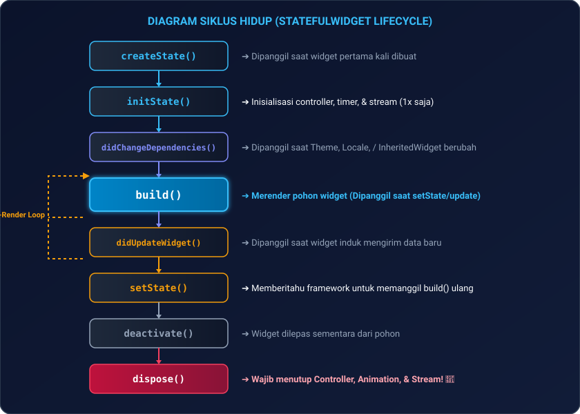
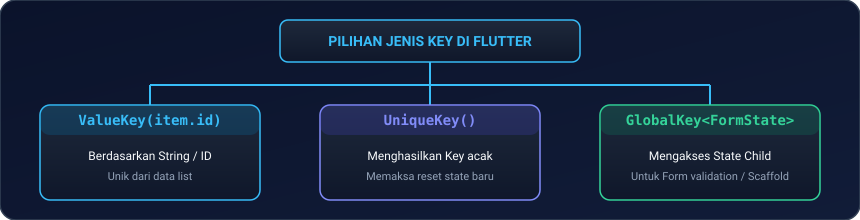
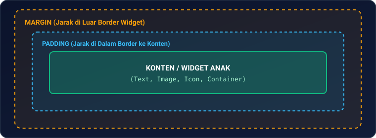
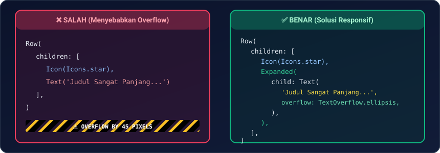
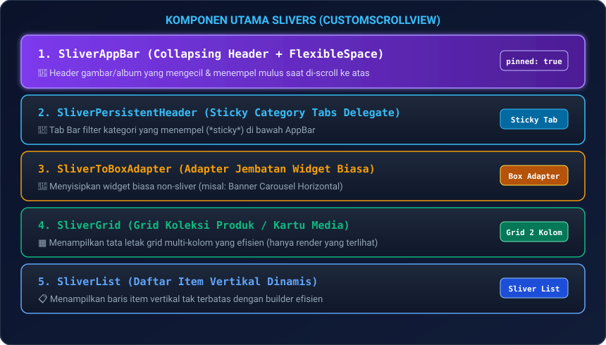

# Modul 02: Flutter UI Mastery, Impeller Engine, & Slivers

Selamat datang di **Modul 02**! Di modul ini, Anda akan mempelajari bagaimana mesin Flutter merender grafis dengan mulus 60/120 FPS melalui **Impeller Rendering Engine**, menguasai konsep fundamental **Tiga Pohon Flutter (*The 3 Trees*)**, memahami siklus hidup widget (*Widget Lifecycle*), aturan emas tata letak (*Box Constraints*), sistem **Keys**, mekanisme **InheritedWidget di balik layar**, hingga merancang antarmuka modern yang memukau menggunakan **Slivers Architecture** dan **Material Design 3**.

---

## 🎭 1. Analogi: Panggung Pertunjukan Teater

Untuk memahami cara kerja Flutter UI, bayangkan sebuah pertunjukan teater megah:

| Komponen Flutter | Analogi Teater | Peran & Karakteristik |
|---|---|---|
| **Widget Tree** | **Naskah & Blueprint Cerita** | *Immutable* (tidak bisa diubah). Berisi deskripsi bagaimana tampilan harus terlihat (misal: "Buat kotak biru dengan teks di tengah"). Sangat ringan dibuat dan dihancurkan berulang kali. |
| **Element Tree** | **Aktor & Manajer Panggung** | *Mutable* (hidup & dinamis). Mengelola siklus hidup, menyimpan state di memori, dan menghubungkan naskah (Widget) dengan pelaksana visual (RenderObject). |
| **RenderObject Tree** | **Tukang Cat, Penata Lampu, & Tukang Ukur** | Mengukur ukuran persis (*Layout/Constraints*), menentukan posisi koordinat pixel (*Paint*), dan menggambar tampilan nyata ke layar HP. |
| **Impeller Engine** | **Proyektor Laser Berkecepatan Ultra-Tinggi** | Mesin grafis modern pengganti Skia yang mengompilasi *shader* terlebih dahulu (Ahead-Of-Time) sehingga animasi tidak pernah mengalami patah-patah (*anti-jank*). |

---

## ⚙️ 2. Arsitektur Internal & Rendering Engine (Impeller)

### 2.1 Mengapa Impeller Menggantikan Skia di Flutter Modern?

Pada versi Flutter terdahulu yang menggunakan engine Skia, pengguna terkadang merasakan patah-patah sesaat (*jank*) ketika animasi pertama kali dijalankan. Ini disebut **Shader Compilation Jank** (GPU harus mengompilasi efek visual saat runtime).

**Impeller menyelesaikan masalah ini secara tuntas dengan:**
1. **Pre-compiled Shaders**: Semua efek grafis sudah dikompilasi sebelumnya saat build time (*Ahead-Of-Time*).
2. **Native GPU Backend**: Memanfaatkan API grafis modern langsung ke hardware (Metal di iOS, Vulkan di Android).
3. **Hasil**: Animasi scrolling, transisi halaman, dan efek bayangan berjalan konstan di 60 FPS / 120 FPS.

---

### 2.2 Alur Rendering Pipeline 5 Tahap

<p align="center">
  
</p>

> [!TIP]
> **Optimasi dengan `RepaintBoundary`**:  
> Jika Anda memiliki widget animasi (seperti jarum jam atau spinner) di tengah halaman yang statis, bungkus widget tersebut dengan `RepaintBoundary`. Ini mencegah Flutter me-repaint seluruh layar secara sia-sia!

---

## 🔄 3. Siklus Hidup Widget (*Widget Lifecycle*)

### 3.1 `StatelessWidget` vs `StatefulWidget`

* **`StatelessWidget`**: Digunakan untuk tampilan statis yang datanya tidak pernah berubah selama widget ditampilkan (misal: label judul, ikon, tombol statis).
* **`StatefulWidget`**: Digunakan ketika tampilan perlu diperbarui secara dinamis saat ada interaksi pengguna, respon API, atau perubahan waktu.

---

### 3.2 Diagram Alur Siklus Hidup `StatefulWidget`

<p align="center">
  
</p>

#### Contoh Implementasi Lengkap:
```dart
import 'package:flutter/material.dart';

class CounterWidget extends StatefulWidget {
  final String judul;
  const CounterWidget({super.key, required this.judul});

  @override
  State<CounterWidget> createState() => _CounterWidgetState();
}

class _CounterWidgetState extends State<CounterWidget> {
  int _counter = 0;
  late final TextEditingController _controller;

  @override
  void initState() {
    super.initState();
    _controller = TextEditingController(text: '0');
  }

  @override
  void didUpdateWidget(covariant CounterWidget oldWidget) {
    super.didUpdateWidget(oldWidget);
    if (oldWidget.judul != widget.judul) {
      print('Judul berganti dari ${oldWidget.judul} ke ${widget.judul}');
    }
  }

  @override
  void dispose() {
    // WAJIB: Bersihkan controller agar tidak terjadi memory leak!
    _controller.dispose();
    super.dispose();
  }

  void _tambah() {
    setState(() {
      _counter++;
      _controller.text = '$_counter';
    });
  }

  @override
  Widget build(BuildContext context) {
    return Column(
      children: [
        Text(widget.judul, style: Theme.of(context).textTheme.titleLarge),
        Text('Jumlah: $_counter', style: const TextStyle(fontSize: 24)),
        ElevatedButton(onPressed: _tambah, child: const Text('Tambah')),
      ],
    );
  }
}
```

---

### 3.3 Mendeteksi Status Aplikasi dengan `AppLifecycleListener`
Di Flutter modern, Anda bisa mendeteksi saat pengguna meminimalkan aplikasi atau kembali membuka aplikasi:

```dart
late final AppLifecycleListener _lifecycleListener;

@override
void initState() {
  super.initState();
  _lifecycleListener = AppLifecycleListener(
    onResume: () => print('Aplikasi kembali aktif di layar depan 📱'),
    onPause: () => print('Aplikasi diminimalkan ke background ⏸️'),
    onDetach: () => print('Aplikasi ditutup sepenuhnya 🛑'),
  );
}

@override
void dispose() {
  _lifecycleListener.dispose();
  super.dispose();
}
```

---

## 🔑 4. Sistem Keys di Flutter: Kapan dan Mengapa Butuh Key?

Flutter mencocokkan *Widget* dengan *Element* berdasarkan **Tipe Widget (`runtimeType`)** dan **`Key`**. Jika Anda memiliki daftar widget bertipe sama yang bisa diurutkan ulang (*reorder*), dihapus, atau digeser, Flutter membutuhkan `Key` agar state data tidak tertukar!

<p align="center">
  
</p>

* **`ValueKey(item.id)`**: Paling sering digunakan untuk daftar item di `ListView` / `ReorderableListView`.
* **`UniqueKey()`**: Memaksa widget selalu membuat state baru setiap kali di-render ulang.
* **`GlobalKey<FormState>()`**: Memberikan akses global untuk memvalidasi form (`formKey.currentState!.validate()`).

---

## 🧬 5. Mekanisme `InheritedWidget` di Balik Layar

Pernahkah Anda bertanya bagaimana `Theme.of(context)` atau `MediaQuery.of(context)` bisa memberikan data tema ke seluruh widget anak tanpa perlu mengirim parameter secara manual (*prop drilling*)? Jawabannya adalah **`InheritedWidget`**.

```dart
class UserSessionProvider extends InheritedWidget {
  final String username;
  final String role;

  const UserSessionProvider({
    super.key,
    required this.username,
    required this.role,
    required super.child,
  });

  // Helper method agar anak bisa mengakses data dengan mudah
  static UserSessionProvider? of(BuildContext context) {
    return context.dependOnInheritedWidgetOfExactType<UserSessionProvider>();
  }

  // Menentukan apakah widget anak perlu di-rebuild saat data berubah
  @override
  bool updateShouldNotify(UserSessionProvider oldWidget) {
    return oldWidget.username != username || oldWidget.role != role;
  }
}
```

*Inilah fondasi dasar yang melahirkan state management modern seperti **Provider** dan **Riverpod**!*

---

## 📐 6. Aturan Emas Layouting & Box Constraints

Tiga aturan suci yang mengatur seluruh sistem tata letak Flutter:

> **1. Batasan turun (*Constraints go down*):** Widget induk memberi tahu anak berapa batas ukuran minimal dan maksimalnya.  
> **2. Ukuran naik (*Sizes go up*):** Widget anak menentukan ukurannya sendiri di dalam batas tersebut dan melaporkannya ke induk.  
> **3. Posisi ditentukan induk (*Parent sets position*):** Widget induk yang menentukan di koordinat pixel mana anak akan diletakkan.

---

### 6.1 Box Model & Komponen Tata Letak

<p align="center">
  
</p>

* **`Container`**: Kotak serbaguna dengan margin, padding, dekorasi (warna, border, border radius, bayangan).
* **`SizedBox`**: Memberikan jarak tetap atau memaksa anak memiliki lebar/tinggi spesifik (Gunakan `SizedBox` dibanding `Container` kosong untuk performa lebih cepat).
* **`AspectRatio`**: Mengunci rasio aspek (misal: rasio 16:9 untuk video player atau 1:1 untuk avatar persegi).
* **`Align` & `Center`**: Menempatkan widget anak pada posisi tertentu di dalam ruang induk (misal: `Alignment.bottomRight`).

---

### 6.2 Flexbox: `Row`, `Column`, `Expanded`, `Flexible`, & `Spacer`

```dart
Row(
  mainAxisAlignment: MainAxisAlignment.spaceBetween, // Distribusi horizontal
  crossAxisAlignment: CrossAxisAlignment.center,     // Perataan vertikal
  children: [
    const Icon(Icons.star, color: Colors.amber),
    const SizedBox(width: 8),
    
    // Expanded: Memaksa anak mengisi seluruh sisa ruang yang tersedia
    Expanded(
      child: Text(
        'Judul Berita yang Sangat Panjang Sekali Agar Tidak Terjadi Overflow',
        overflow: TextOverflow.ellipsis,
      ),
    ),
    
    const Spacer(), // Memberikan jarak kosong fleksibel
    ElevatedButton(onPressed: () {}, child: const Text('Beli')),
  ],
)
```

| Widget | Perilaku terhadap Ruang Kosong |
|---|---|
| **`Expanded`** | Memaksa anak mengambil **100% sisa ruang** yang tersedia (`fit: FlexFit.tight`). |
| **`Flexible`** | Mengizinkan anak mengambil sisa ruang **sesuai kebutuhannya saja** (`fit: FlexFit.loose`). |
| **`Spacer`** | Membuat ruang kosong fleksibel di antara dua widget. |

---

### 6.3 Mengatasi Error Garis Kuning-Hitam (*RenderFlex Overflow*)

Garis belang kuning-hitam muncul saat ukuran konten melebihi batas layar yang diberikan induknya.

<p align="center">
  
</p>

---

## 👆 7. Interaksi Sentuh & Gestures

### 7.1 `GestureDetector` vs `InkWell`

* **`GestureDetector`**: Menangkap semua jenis gestur sentuhan (tap, double tap, long press, drag pan, pinch to zoom) tanpa efek animasi ripple visual.
* **`InkWell`**: Menghasilkan efek animasi percikan air (*Material Ripple Effect*) saat disentuh (Wajib ditaruh di dalam widget `Material`).

```dart
// Contoh InkWell dengan efek ripple material
Material(
  color: Colors.transparent,
  child: InkWell(
    borderRadius: BorderRadius.circular(12),
    onTap: () => print('Kartu diketuk!'),
    child: const Padding(
      padding: EdgeInsets.all(16.0),
      child: Text('Ketuk Saya untuk Efek Ripple'),
    ),
  ),
);
```

---

### 7.2 Fitur Swipe-to-Delete dengan `Dismissible`

```dart
Dismissible(
  key: ValueKey(item.id),
  direction: DismissDirection.endToStart, // Geser ke kiri untuk hapus
  background: Container(
    color: Colors.red,
    alignment: Alignment.centerRight,
    padding: const EdgeInsets.only(right: 20),
    child: const Icon(Icons.delete, color: Colors.white),
  ),
  onDismissed: (direction) {
    // Hapus data dari list & tampilkan snackbar
  },
  child: ListTile(title: Text(item.nama)),
)
```

---

## 📜 8. Advanced Scrolling & Slivers Architecture

Saat Anda membuat aplikasi seperti **Spotify**, **Netflix**, atau **Tokopedia**, Anda membutuhkan efek *collapsing header* yang mengecil saat di-scroll, tab bar yang menempel di atas (*sticky*), dan kombinasi daftar horizontal serta vertikal. Inilah fungsi dari **Slivers**!

### 8.1 Komponen Utama Slivers

<p align="center">
  
</p>

---

### 8.2 Kustomisasi `SliverPersistentHeaderDelegate` (Sticky Header)

Untuk membuat tab bar atau filter kategori yang **menempel di atas** saat di-scroll:

```dart
class StickyHeaderDelegate extends SliverPersistentHeaderDelegate {
  final String title;
  StickyHeaderDelegate(this.title);

  @override
  double get minExtent => 50.0; // Tinggi saat menempel (paling kecil)
  @override
  double get maxExtent => 50.0; // Tinggi saat posisi awal

  @override
  Widget build(BuildContext context, double shrinkOffset, bool overlapsContent) {
    return Container(
      color: Theme.of(context).scaffoldBackgroundColor,
      alignment: Alignment.centerLeft,
      padding: const EdgeInsets.symmetric(horizontal: 16),
      child: Text(
        title,
        style: const TextStyle(fontSize: 18, fontWeight: FontWeight.bold),
      ),
    );
  }

  @override
  bool shouldRebuild(covariant StickyHeaderDelegate oldDelegate) {
    return oldDelegate.title != title;
  }
}
```

---

### 8.3 Kustomisasi Scroll Physics
* **`BouncingScrollPhysics()`**: Karakteristik scroll membal khas iOS.
* **`ClampingScrollPhysics()`**: Karakteristik scroll berhenti tegas khas Android klasik.
* **`NeverScrollableScrollPhysics()`**: Mematikan scroll pada `ListView` anak saat ditaruh di dalam `SingleChildScrollView`.

---

## 🎨 9. Material Design 3, Cupertino, & ThemeExtension

### 9.1 Konfigurasi Material 3 & Skema Warna Otomatis

Material 3 (M3) dapat menghasilkan palet warna harmonis secara otomatis hanya dari satu warna acuan (*seed color*):

```dart
MaterialApp(
  themeMode: ThemeMode.system, // Mengikuti setting Dark/Light mode di HP
  theme: ThemeData(
    useMaterial3: true,
    colorScheme: ColorScheme.fromSeed(
      seedColor: Colors.indigo,
      brightness: Brightness.light,
    ),
  ),
  darkTheme: ThemeData(
    useMaterial3: true,
    colorScheme: ColorScheme.fromSeed(
      seedColor: Colors.indigo,
      brightness: Brightness.dark,
    ),
  ),
  home: const SpotifyAlbumPage(),
);
```

---

### 9.2 `ThemeExtension`: Membuat Token Warna Khusus

Saat aplikasi Anda memiliki warna branding khusus (misal: warna status transaksi *Sukses*, *Pending*, *Gagal*) yang harus ikut beradaptasi saat Dark Mode:

```dart
@immutable
class StatusColors extends ThemeExtension<StatusColors> {
  final Color? sukses;
  final Color? pending;
  final Color? gagal;

  const StatusColors({required this.sukses, required this.pending, required this.gagal});

  @override
  StatusColors copyWith({Color? sukses, Color? pending, Color? gagal}) {
    return StatusColors(
      sukses: sukses ?? this.sukses,
      pending: pending ?? this.pending,
      gagal: gagal ?? this.gagal,
    );
  }

  @override
  StatusColors lerp(ThemeExtension<StatusColors>? other, double t) {
    if (other is! StatusColors) return this;
    return StatusColors(
      sukses: Color.lerp(sukses, other.sukses, t),
      pending: Color.lerp(pending, other.pending, t),
      gagal: Color.lerp(gagal, other.gagal, t),
    );
  }
}
```

---

## 🖼️ 10. Manajemen Aset & Resolusi Layar (1x, 2x, 3x)

Untuk memastikan gambar tajam di semua kerapatan layar (*Retina Display*), Flutter menggunakan konvensi folder berbasis rasio densitas pixel:

<p align="center">
  
</p>

Daftarkan di `pubspec.yaml`:
```yaml
flutter:
  assets:
    - assets/images/
  fonts:
    - family: PlusJakartaSans
      fonts:
        - asset: assets/fonts/PlusJakartaSans-Bold.ttf
          weight: 700
```

---

## 💻 11. Hands-on Project: Spotify & Netflix Media Feed Replica

Mari kita satukan seluruh konsep modul ini menjadi satu halaman katalog media yang responsif dan elegan:

1. **Buat file baru** `lib/media_feed_page.dart` di proyek Anda.
2. **Salin kode lengkap berikut**:

```dart
import 'package:flutter/material.dart';

void main() {
  runApp(const MyApp());
}

class MyApp extends StatelessWidget {
  const MyApp({super.key});

  @override
  Widget build(BuildContext context) {
    return MaterialApp(
      debugShowCheckedModeBanner: false,
      theme: ThemeData(
        useMaterial3: true,
        brightness: Brightness.dark,
        colorSchemeSeed: Colors.deepPurple,
      ),
      home: const MediaFeedPage(),
    );
  }
}

class MediaFeedPage extends StatelessWidget {
  const MediaFeedPage({super.key});

  @override
  Widget build(BuildContext context) {
    return Scaffold(
      body: CustomScrollView(
        physics: const BouncingScrollPhysics(),
        slivers: [
          // 1. Collapsing Hero App Bar
          SliverAppBar(
            expandedHeight: 260.0,
            pinned: true,
            stretch: true,
            flexibleSpace: FlexibleSpaceBar(
              title: const Text('Pilihan Editor 2026', style: TextStyle(fontWeight: FontWeight.bold)),
              background: Container(
                decoration: const BoxDecoration(
                  gradient: LinearGradient(
                    colors: [Colors.deepPurple, Colors.black],
                    begin: Alignment.topCenter,
                    end: Alignment.bottomCenter,
                  ),
                ),
                child: const Center(
                  child: Icon(Icons.movie_creation_outlined, size: 80, color: Colors.white54),
                ),
              ),
            ),
          ),

          // 2. Horizontal Carousel Section
          SliverToBoxAdapter(
            child: Column(
              crossAxisAlignment: CrossAxisAlignment.start,
              children: [
                const Padding(
                  padding: EdgeInsets.all(16.0),
                  child: Text('Sedang Tren Sekarang 🔥', style: TextStyle(fontSize: 20, fontWeight: FontWeight.bold)),
                ),
                SizedBox(
                  height: 160,
                  child: ListView.builder(
                    scrollDirection: Axis.horizontal,
                    padding: const EdgeInsets.symmetric(horizontal: 12.0),
                    itemCount: 8,
                    itemBuilder: (context, index) {
                      return Container(
                        width: 120,
                        margin: const EdgeInsets.symmetric(horizontal: 6.0),
                        decoration: BoxDecoration(
                          color: Colors.deepPurple.shade900,
                          borderRadius: BorderRadius.circular(12),
                        ),
                        child: Center(
                          child: Text('Item #${index + 1}', style: const TextStyle(fontWeight: FontWeight.bold)),
                        ),
                      );
                    },
                  ),
                ),
              ],
            ),
          ),

          // 3. Sticky Category Header
          const SliverToBoxAdapter(
            child: Padding(
              padding: EdgeInsets.fromLTRB(16, 24, 16, 12),
              child: Text('Daftar Rekomendasi Terpopuler', style: TextStyle(fontSize: 20, fontWeight: FontWeight.bold)),
            ),
          ),

          // 4. Adaptive Grid Item
          SliverPadding(
            padding: const EdgeInsets.symmetric(horizontal: 16.0),
            sliver: SliverGrid(
              gridDelegate: const SliverGridDelegateWithFixedCrossAxisCount(
                crossAxisCount: 2,
                crossAxisSpacing: 12.0,
                mainAxisSpacing: 12.0,
                childAspectRatio: 1.4,
              ),
              delegate: SliverChildBuilderDelegate(
                (context, index) {
                  return Card(
                    color: Colors.grey.shade900,
                    shape: RoundedRectangleBorder(borderRadius: BorderRadius.circular(12)),
                    child: Padding(
                      padding: const EdgeInsets.all(12.0),
                      child: Column(
                        crossAxisAlignment: CrossAxisAlignment.start,
                        children: [
                          Icon(Icons.play_circle_fill, color: Theme.of(context).colorScheme.primary),
                          const Spacer(),
                          Text('Koleksi #${index + 1}', style: const TextStyle(fontWeight: FontWeight.bold)),
                          Text('12.4K Penonton', style: TextStyle(fontSize: 12, color: Colors.grey.shade400)),
                        ],
                      ),
                    ),
                  );
                },
                childCount: 10,
              ),
            ),
          ),
          
          const SliverToBoxAdapter(child: SizedBox(height: 32)),
        ],
      ),
    );
  }
}
```

3. **Jalankan ke Perangkat**:
   ```bash
   flutter run
   ```
   *Rasakan mulusnya efek collapsing header dan perpaduan scrolling horizontal dan vertikal tanpa ada lag sedikit pun!*

---

## ⚠️ 12. Jebakan Umum (*Common Pitfalls*) & Solusi Kilat

| Kesalahan Umum | Gejala Error | Solusi yang Benar |
|---|---|---|
| **1. Unbounded Height di ListView** | `Vertical viewport was given unbounded height` (Menaruh `ListView` di dalam `Column`). | Bungkus `ListView` dengan `Expanded` atau beri tinggi tetap dengan `SizedBox(height: ...)` / set `shrinkWrap: true`. |
| **2. Lupa `dispose()` Controller** | Memory leak lambat laun membuat aplikasi berat dan crash. | Selalu panggil `controller.dispose()` di dalam method `dispose()`. |
| **3. Rebuild Liar Tanpa `const`** | Tampilan UI terasa berat saat di-scroll cepat. | Gunakan constructor `const` pada widget statis agar Flutter tidak membuat ulang objeknya di memori. |
| **4. Menaruh Widget Biasa di `CustomScrollView`** | `A RenderRepaintBoundary expected a child of type RenderSliver` | Seluruh anak di dalam `CustomScrollView` harus berupa Sliver. Bungkus widget biasa dengan `SliverToBoxAdapter`. |
| **5. Salah Paham `Expanded` vs `Flexible`** | Tampilan memanjang tidak wajar atau meluap dari layar. | Gunakan `Expanded` jika ingin memaksa mengisi 100% sisa ruang, gunakan `Flexible` jika ukurannya dinamis sesuai isi konten. |

---

## 📝 13. Kuis Pemahaman Modul 02

1. **Apa perbedaan antara Widget Tree dan RenderObject Tree?**  
   *Jawaban:* Widget Tree adalah blueprint/naskah konfigurasi UI yang bersifat *immutable* dan sangat ringan. RenderObject Tree adalah objek nyata yang menghitung koordinat layout, batas ukuran (*constraints*), dan mengecat pixel visual ke layar HP.
2. **Kapan kita wajib menggunakan `ValueKey` di dalam daftar item list?**  
   *Jawaban:* Ketika daftar item memiliki tipe widget yang sama dan item tersebut dapat diurutkan ulang (*reorder*), dihapus, atau dipindahkan posisi, agar Flutter tidak salah mencocokkan state data antar elemen.
3. **Bagaimana cara kerja `InheritedWidget` dalam menyalurkan data ke widget turunan?**  
   *Jawaban:* Widget anak mendaftarkan dependensi melalui `context.dependOnInheritedWidgetOfExactType<T>()`. Ketika `InheritedWidget` diperbarui dan `updateShouldNotify` mengembalikan nilai `true`, Flutter secara otomatis me-rebuild widget anak yang bergantung pada data tersebut.

---

## 🎯 Rangkuman & Checklist Kompetensi

- [x] Memahami arsitektur internal Flutter: Impeller Engine & Tiga Pohon (*The 3 Trees*).
- [x] Menguasai siklus hidup `StatefulWidget` (`initState`, `didUpdateWidget`, `dispose`) dan `AppLifecycleListener`.
- [x] Memahami fungsi dan jenis `Key` (`ValueKey`, `UniqueKey`, `GlobalKey`).
- [x] Memahami mekanisme `InheritedWidget` dan `updateShouldNotify` di balik layar.
- [x] Menguasai aturan emas layouting: *Constraints go down, sizes go up, parent sets position*.
- [x] Menguasai interaksi sentuh: `GestureDetector`, `InkWell`, dan `Dismissible` swipe-to-delete.
- [x] Menguasai arsitektur Slivers: `CustomScrollView`, `SliverAppBar`, `SliverPersistentHeaderDelegate`, `SliverList`, `SliverGrid`, dan `SliverToBoxAdapter`.
- [x] Mengimplementasikan Material Design 3, Dark/Light Mode, dan custom `ThemeExtension`.
- [x] Mengelola aset gambar multi-densitas (1x, 2x, 3x) dan font kustom.
- [x] Berhasil membangun proyek mini Media Feed Replica dengan efek collapsing header modern.

---

👉 **Langkah Selanjutnya**: Kemampuan merancang UI Flutter Anda sudah berada di standar industri! Mari melangkah ke **[Modul 03: Navigasi Deklaratif (go_router), Deep Linking, & Form System](../modul-03-routing-dan-form/README.md)** untuk menghubungkan antar layar aplikasi dan menangani data form interaktif.
