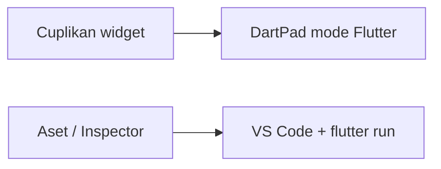
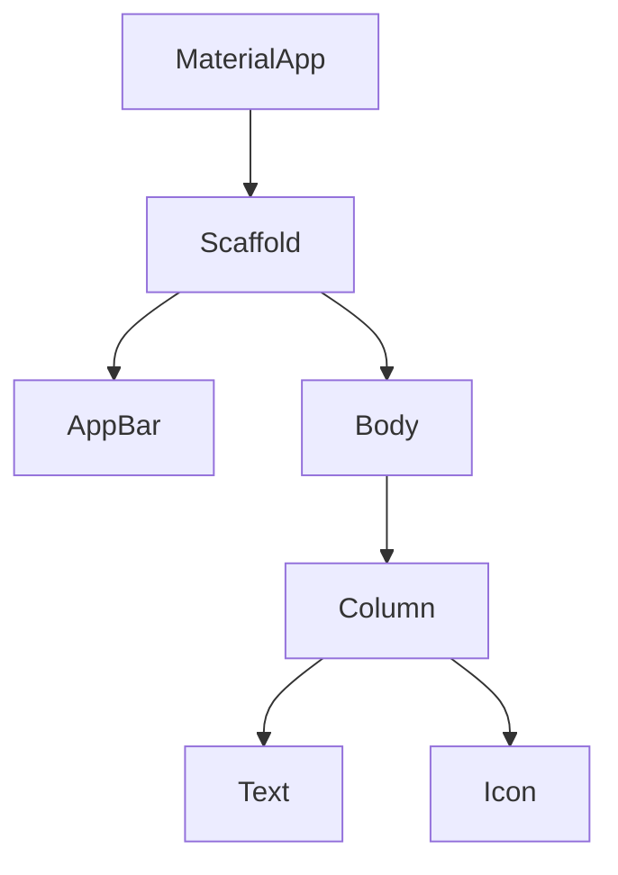
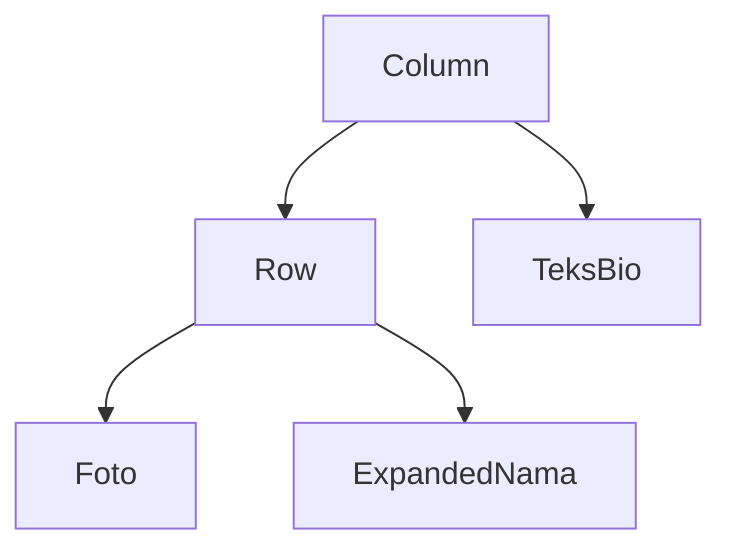

# Modul 02 — Flutter UI: merakit tampilan

**Waktu:** 2 sesi  
**Prasyarat:** Modul 00 (Flutter SDK + emulator atau HP) dan Modul 01 (Dart).  
**Hasil:** Anda dapat merakit halaman dengan widget, menghindari overflow kuning-hitam, dan memakai `ListView.builder` untuk daftar.

---

## Buka alat ini terlebih dahulu

Modul ini memakai **dua jalur uji**. Jangan tertukar.

| Jalur | Buka | Untuk apa |
| --- | --- | --- |
| A | Peramban → [dartpad.dev](https://dartpad.dev) → mode **Flutter** (bukan Dart) | Cuplikan widget, layout, overflow, list |
| B | VS Code + Terminal (`Ctrl + J`) + emulator/HP | Aset gambar, `google_fonts`, Widget Inspector |




Sumber gambar DartPad: [dart.dev/tools/dartpad](https://dart.dev/tools/dartpad), Dart team / Google ([CC BY 4.0](https://creativecommons.org/licenses/by/4.0/)). Untuk modul ini, pilih mode **Flutter** agar yang muncul di kanan adalah **layar aplikasi**, bukan Console teks.

### Pola uji A — DartPad Flutter

| | |
| --- | --- |
| **Buka** | [dartpad.dev](https://dartpad.dev) |
| **Pilih** | mode **Flutter** |
| **Tempel** | seluruh berkas, termasuk `import` dan `void main()` |
| **Klik** | **Run** |
| **Lihat** | panel kanan: pratinjau aplikasi |

### Pola uji B — proyek lokal

| | |
| --- | --- |
| **Buka** | VS Code di folder proyek, emulator atau HP sudah menyala |
| **Terminal** | `Ctrl + J` |
| **Ketik** | `flutter run` |
| **Ubah kode** | simpan (`Ctrl + S`), lalu tekan `r` di terminal yang menjalankan app |

> **Aturan emas:** perintah `flutter ...` hanya di **Terminal VS Code**. DartPad tidak mengenal `flutter pub add`.

---

## 1. Semua adalah widget

Di Flutter SDK, tombol, teks, padding, bahkan seluruh aplikasi adalah **widget**: potongan UI yang bisa disusun.


*Ilustrasi asli materi mobile2026. Analogi: widget disusun seperti balok. Penjelasan ada di teks, bukan di dalam gambar.*



Sumber konsep: [docs.flutter.dev/ui/widgets](https://docs.flutter.dev/ui/widgets). Flutter and the related logo are trademarks of Google LLC.

### Uji 1 — Halo widget

| | |
| --- | --- |
| **Buka** | DartPad, mode **Flutter** |
| **Tempel** | kode berikut |
| **Run** | |

```dart
import 'package:flutter/material.dart';

void main() => runApp(const MateriApp());

class MateriApp extends StatelessWidget {
  const MateriApp({super.key});

  @override
  Widget build(BuildContext context) {
    return const MaterialApp(
      home: Scaffold(
        body: Center(
          child: Column(
            mainAxisAlignment: MainAxisAlignment.center,
            children: [
              Icon(Icons.phone_android, size: 48),
              SizedBox(height: 12),
              Text('Halo, ini widget'),
            ],
          ),
        ),
      ),
    );
  }
}
```

**Berhasil jika** panel kanan menampilkan ikon dan teks, bukan error merah.

`const` di depan widget yang isinya tetap: kebiasaan hemat rebuild. Pakai sejak awal.

---

## 2. Stateless vs Stateful

| Jenis | Artinya | Kapan |
| --- | --- | --- |
| `StatelessWidget` | tampilan diam | kartu profil, ikon, teks judul |
| `StatefulWidget` | tampilan bisa berubah | penghitung, sakelar tema, formulir |

Stateful butuh dua class: widget + `State`. Angka penghitung tinggal di `State`, bukan di widget.

### Uji 2 — penghitung kecil

| | |
| --- | --- |
| **Buka** | DartPad, mode Flutter |
| **Run** | lalu ketuk tombol `+` |

```dart
import 'package:flutter/material.dart';

void main() => runApp(const MateriApp());

class MateriApp extends StatelessWidget {
  const MateriApp({super.key});

  @override
  Widget build(BuildContext context) {
    return const MaterialApp(home: PenghitungPage());
  }
}

class PenghitungPage extends StatefulWidget {
  const PenghitungPage({super.key});

  @override
  State<PenghitungPage> createState() => _PenghitungPageState();
}

class _PenghitungPageState extends State<PenghitungPage> {
  int angka = 0;

  @override
  Widget build(BuildContext context) {
    return Scaffold(
      appBar: AppBar(title: const Text('Penghitung')),
      body: Center(child: Text('Nilai: $angka')),
      floatingActionButton: FloatingActionButton(
        onPressed: () => setState(() => angka++),
        child: const Icon(Icons.add),
      ),
    );
  }
}
```

Tanpa `setState`, angka di memori berubah tetapi layar tidak menggambar ulang. `textScaler` tetap `1` di contoh ini supaya ukuran huruf tidak merusak uji; skalasi sistem dibahas di bagian 9.

State yang lebih rapi (Provider) ada di **Modul 04**. Di sini cukup `setState`.

---

## 3. Layout: Row, Column, Stack, Padding, Expanded

- `Column` = tumpuk **vertikal** (atas ke bawah).
- `Row` = jajar **horizontal** (kiri ke kanan).
- `Padding` = jarak di sekeliling anak.
- `Expanded` = “ambil sisa ruang” di dalam Row/Column.
- `Stack` = tumpuk bertumpuk (foto + lencana di sudut).



Sumber: [Layouts in Flutter](https://docs.flutter.dev/ui/layout).

### Uji 3 — Row di dalam Column

```dart
import 'package:flutter/material.dart';

void main() => runApp(const MateriApp());

class MateriApp extends StatelessWidget {
  const MateriApp({super.key});

  @override
  Widget build(BuildContext context) {
    return MaterialApp(
      home: Scaffold(
        body: Padding(
          padding: const EdgeInsets.all(24),
          child: Column(
            crossAxisAlignment: CrossAxisAlignment.start,
            children: [
              Row(
                children: [
                  const CircleAvatar(radius: 28, child: Icon(Icons.person)),
                  const SizedBox(width: 12),
                  Expanded(
                    child: Text(
                      'Siti Nurhaliza dari Samarinda',
                      style: Theme.of(context).textTheme.titleMedium,
                    ),
                  ),
                ],
              ),
              const SizedBox(height: 16),
              const Text('Bio singkat: belajar merakit tampilan.'),
            ],
          ),
        ),
      ),
    );
  }
}
```

**Kesalahan klasik:** `Row` berisi `Text` panjang **tanpa** `Expanded` → garis kuning-hitam di tepi kanan. Itu overflow.

---

## 4. SafeArea dan MediaQuery

Poni HP dan bilah status bisa menimpa teks. `SafeArea` menggeser isi ke area yang aman disentuh.

`MediaQuery` membaca ukuran layar dan faktor huruf sistem.

```dart
SafeArea(
  child: Padding(
    padding: const EdgeInsets.all(16),
    child: Text('Tidak tertutup status bar'),
  ),
)
```

Di DartPad web, efek notch kadang tidak terlihat. Uji **jalur B** di HP fisik untuk merasakan bedanya.

---

## 5. Overflow kuning-hitam (keyboard & list)

Garis kuning-hitam = anak widget **lebih besar** daripada ruang orang tua. Bukan virus. Penyebab sering:

1. `Column` penuh di dalam layar, lalu keyboard muncul.
2. `Row` berisi teks panjang tanpa `Expanded` / `Flexible`.
3. `ListView` di dalam `Column` tanpa batas tinggi.

### Uji 5 — perbaiki Column yang overflow

| | |
| --- | --- |
| **Buka** | DartPad, mode Flutter |
| **Run** | kode “rusak”, lihat garis kuning |
| **Ganti** | `Column` menjadi `ListView` atau bungkus `SingleChildScrollView` |

**Rusak (sengaja):**

```dart
body: Column(
  children: List.generate(
    20,
    (i) => ListTile(title: Text('Baris $i')),
  ),
),
```

**Perbaikan:**

```dart
body: ListView(
  children: List.generate(
    20,
    (i) => ListTile(title: Text('Baris $i')),
  ),
),
```

Untuk formulir + keyboard: bungkus dengan `SingleChildScrollView`, atau pakai `resizeToAvoidBottomInset: true` (bawaan Scaffold). Latihan form lengkap ada di **Modul 03**.

---

## 6. Material: Scaffold, AppBar, tombol, kartu, Drawer

`Scaffold` = kerangka halaman: AppBar, body, tombol mengambang, laci (`Drawer`).

```dart
Scaffold(
  appBar: AppBar(title: const Text('Beranda')),
  drawer: const Drawer(child: SafeArea(child: Text('Menu'))),
  body: Card(
    margin: const EdgeInsets.all(16),
    child: ListTile(
      leading: const Icon(Icons.school),
      title: const Text('Kartu contoh'),
      trailing: FilledButton(
        onPressed: () {},
        child: const Text('Buka'),
      ),
    ),
  ),
)
```

| Widget | Kegunaan |
| --- | --- |
| `FilledButton` | aksi utama |
| `OutlinedButton` | aksi sekunder |
| `TextButton` | aksi ringan |
| `Card` | kelompok informasi |
| `Drawer` | menu samping |

Sumber: [Material widgets](https://docs.flutter.dev/ui/widgets/material).

---

## 7. Tema dan mode gelap

Satu `ThemeData` menjaga warna dan huruf tetap selaras.

```dart
MaterialApp(
  theme: ThemeData(
    colorScheme: ColorScheme.fromSeed(seedColor: Colors.teal),
    useMaterial3: true,
  ),
  darkTheme: ThemeData(
    colorScheme: ColorScheme.fromSeed(
      seedColor: Colors.teal,
      brightness: Brightness.dark,
    ),
    useMaterial3: true,
  ),
  themeMode: ThemeMode.system,
  home: const Scaffold(body: Center(child: Text('Ikuti tema HP'))),
);
```

`ThemeMode.system` mengikuti sakelar gelap di pengaturan HP. Menyimpan pilihan pengguna (gelap selalu / terang selalu) memakai data lokal di **Modul 05**.

---

## 8. Font kustom — hanya jalur B

[google_fonts](https://pub.dev/packages/google_fonts) **tidak** diuji di DartPad (paket pub terbatas).

| | |
| --- | --- |
| **Buka** | Terminal VS Code, di folder proyek |
| **Ketik** | |

```powershell
flutter pub add google_fonts
```

Lalu:

```dart
import 'package:google_fonts/google_fonts.dart';

Text(
  'Judul',
  style: GoogleFonts.plusJakartaSans(fontWeight: FontWeight.w700),
);
```

Cukup **satu** keluarga huruf. Jangan memasang 20 font.

---

## 9. Skalasi teks

Sebagian pengguna membesarkan huruf di pengaturan HP. Layout tidak boleh pecah.

- Hindari tinggi tetap yang sempit untuk teks panjang.
- Uji: **Pengaturan HP → Tampilan → Ukuran font** (nama menu berbeda per pabrik).
- `FittedBox` atau biarkan teks pindah baris (`softWrap: true`, bawaan).

Jangan memaksa `textScaler: TextScaler.linear(1)` di aplikasi sungguhan kecuali untuk uji singkat. Itu mengabaikan kebutuhan aksesibilitas.

---

## 10. ListView.builder (wajib untuk daftar)

| Cara | Kapan |
| --- | --- |
| `ListView(children: [...])` | sedikit item, jumlah tetap |
| **`ListView.builder`** | daftar bisa panjang (chat, produk, catatan) |

`builder` hanya membangun baris yang kelihatan di layar.

### Uji 10

```dart
ListView.builder(
  itemCount: 100,
  itemBuilder: (context, index) {
    return ListTile(
      key: ValueKey('item-$index'),
      title: Text('Item $index'),
    );
  },
)
```

`Key` pada item: Flutter tidak tertukar baris saat urutan data berubah (hapus, sisip). Pakai `ValueKey` yang stabil (id catatan), bukan indeks jika daftar bisa dihapus.

---

## 11. Animasi implisit

Satu contoh cukup: `AnimatedContainer`. Tanpa `AnimationController`.

```dart
AnimatedContainer(
  duration: const Duration(milliseconds: 250),
  width: lebar ? 200 : 80,
  height: 80,
  color: lebar ? Colors.teal : Colors.orange,
)
```

Ubah `lebar` lewat `setState`. Kotak beranimasi sendiri.

---

## 12. Aset gambar — hanya jalur B

Di DartPad pakai `Image.network('https://...')` untuk uji cepat.

Di proyek lokal:

1. Simpan berkas di `assets/images/foto.png`.
2. Daftarkan di `pubspec.yaml`:

```yaml
flutter:
  assets:
    - assets/images/
```

3. Tampilkan:

```dart
Image.asset('assets/images/foto.png')
```

Sumber: [Adding assets and images](https://docs.flutter.dev/ui/assets/assets-and-images).

Splash layar (gambar pembuka toko) diatur di Android nanti (Modul 10). Jangan bingung dengan widget `Splash` di Dart.

---

## 13. Widget Inspector — hanya jalur B

Inspector menampilkan **pohon widget** aplikasi yang sedang berjalan.

| | |
| --- | --- |
| **Buka** | VS Code, app sudah `flutter run` |
| **Lalu** | palet perintah `Ctrl + Shift + P` → **Flutter: Open DevTools** |
| **Atau** | ikon Flutter DevTools di bilah samping VS Code |

Pilih widget di HP, pohon di DevTools ikut bergulir. Berguna saat overflow: lihat widget mana yang terlalu lebar.

Sumber langkah dan tangkapan layar resmi: [Use the Flutter inspector](https://docs.flutter.dev/tools/devtools/inspector). Flutter and the related logo are trademarks of Google LLC.

---

## Mini proyek: kartu profil

Syarat (silabus): foto, nama, bio, 3 tombol; tidak pecah di HP kecil; tetap kebaca jika font sistem dibesarkan.

| | |
| --- | --- |
| **Buka** | DartPad mode Flutter **atau** proyek lokal |
| **Bangun** | satu `StatelessWidget` `KartuProfil` |

Kerangka:

```dart
class KartuProfil extends StatelessWidget {
  const KartuProfil({super.key});

  @override
  Widget build(BuildContext context) {
    return Scaffold(
      appBar: AppBar(title: const Text('Profil')),
      body: SafeArea(
        child: SingleChildScrollView(
          padding: const EdgeInsets.all(24),
          child: Column(
            children: [
              const CircleAvatar(radius: 48, child: Icon(Icons.person, size: 48)),
              const SizedBox(height: 12),
              Text('Nama Anda', style: Theme.of(context).textTheme.headlineSmall),
              const SizedBox(height: 8),
              const Text(
                'Bio dua atau tiga kalimat yang boleh pindah baris.',
                textAlign: TextAlign.center,
              ),
              const SizedBox(height: 24),
              Row(
                children: [
                  Expanded(child: OutlinedButton(onPressed: () {}, child: const Text('Surel'))),
                  const SizedBox(width: 8),
                  Expanded(child: OutlinedButton(onPressed: () {}, child: const Text('GitHub'))),
                  const SizedBox(width: 8),
                  Expanded(child: FilledButton(onPressed: () {}, child: const Text('Telepon'))),
                ],
              ),
            ],
          ),
        ),
      ),
    );
  }
}
```

`Expanded` pada ketiga tombol: di HP sempit, tombol berbagi lebar, tidak overflow.

---

## Kesalahan yang sering terjadi

| Gejala | Penyebab lazim | Perbaikan |
| --- | --- | --- |
| DartPad hanya `print`, tidak ada layar | Mode **Dart**, bukan Flutter | Ganti mode Flutter |
| Kuning-hitam di tepi | Overflow Row/Column | `Expanded`, `ListView`, atau `SingleChildScrollView` |
| `setState` dipanggil tetapi UI diam | Dipanggil di luar `State` | Pindahkan logika ke class `State` |
| `Image.asset` gagal | Belum didaftar di `pubspec.yaml` | Tambah `assets:`, lalu `flutter pub get` |
| `google_fonts` error di DartPad | Paket tidak tersedia di DartPad | Jalur B (proyek lokal) |
| Inspector kosong | App tidak sedang `flutter run` | Jalankan dulu, baru buka DevTools |

---

## Latihan

1. Ganti `Center` + `Text` menjadi `Column` berisi ikon, judul, dan `FilledButton`.
2. Buat `Row` tiga `Icon`. Tambahkan `MainAxisAlignment.spaceEvenly`.
3. Picu overflow sengaja (teks panjang di `Row` tanpa `Expanded`), lalu perbaiki.
4. `ListView.builder` 30 item, tiap baris punya `ValueKey`.
5. (Jalur B) Tambah satu gambar aset dan tampilkan di kartu profil.

---

## Kuis singkat

1. Kapan wajib `ListView.builder`, bukan `ListView(children: ...)`?
2. Apa arti garis kuning-hitam di tepi widget?
3. Perintah `flutter pub add google_fonts` diketik di mana?
4. Kenapa tombol di kartu profil dibungkus `Expanded`?

Kunci di akhir berkas. Jawab terlebih dahulu.

---

## Apa yang belum dibahas

- Formulir, validasi, DatePicker, navigasi, `go_router` → **Modul 03**
- Provider / state lintas halaman → Modul 04
- Menyimpan tema gelap ke HP → Modul 05
- `AnimationController` kustom → ditunda

---

## Kunci kuis

1. Jika jumlah item bisa banyak atau tidak tetap; `builder` hanya membangun yang terlihat.
2. Anak lebih besar daripada ruang orang tua (overflow).
3. Terminal VS Code di folder proyek, bukan DartPad.
4. Agar tiga tombol berbagi lebar layar dan tidak mendorong Row sampai overflow.

---

## Sumber gambar dan tautan

| Aset | Sumber |
| --- | --- |
| `images/analogi-widget-lego.png` | Ilustrasi asli materi mobile2026 |
| Tampilan DartPad | [dart.dev/assets/img/dartpad-hello.png](https://dart.dev/assets/img/dartpad-hello.png) dari [dart.dev/tools/dartpad](https://dart.dev/tools/dartpad) ([CC BY 4.0](https://creativecommons.org/licenses/by/4.0/)) |
| Konsep widget | [docs.flutter.dev/ui/widgets](https://docs.flutter.dev/ui/widgets) |
| Layout Row/Column | [docs.flutter.dev/ui/layout](https://docs.flutter.dev/ui/layout) |
| Aset gambar | [docs.flutter.dev/ui/assets/assets-and-images](https://docs.flutter.dev/ui/assets/assets-and-images) |
| Widget Inspector | [docs.flutter.dev/tools/devtools/inspector](https://docs.flutter.dev/tools/devtools/inspector) |
| google_fonts | [pub.dev/packages/google_fonts](https://pub.dev/packages/google_fonts) |

Flutter and the related logo are trademarks of Google LLC. We are not endorsed by or affiliated with Google LLC.
