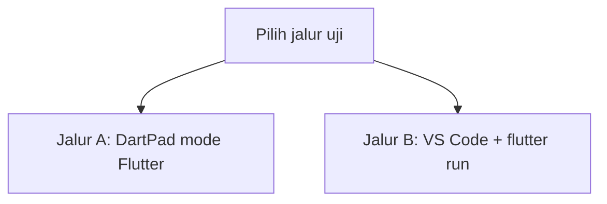
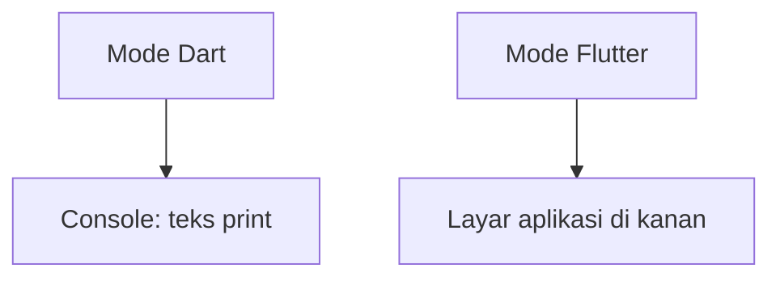
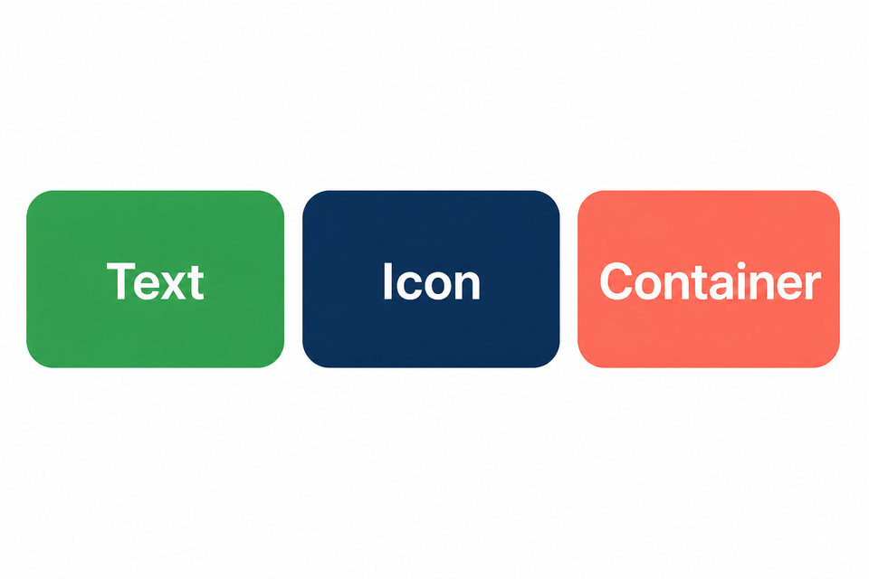
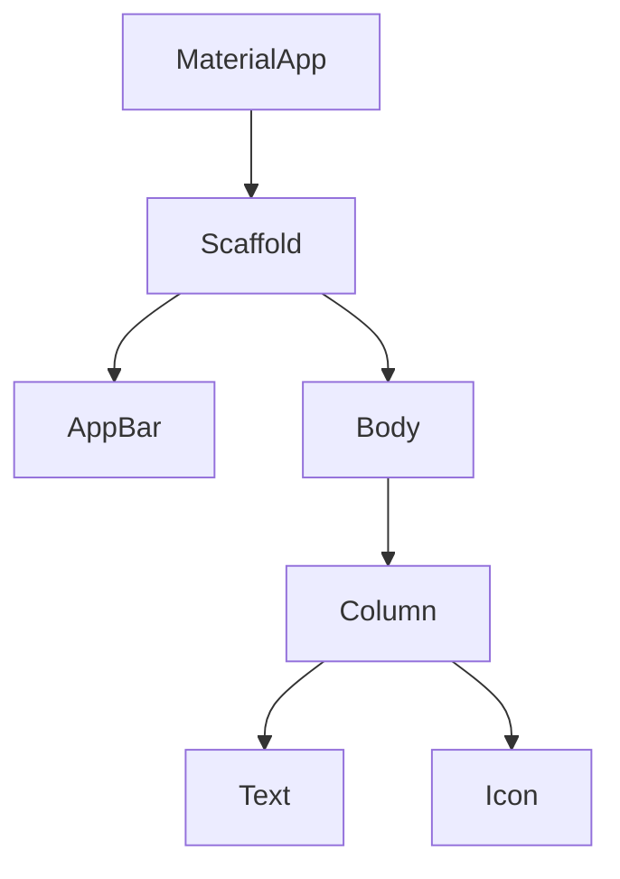
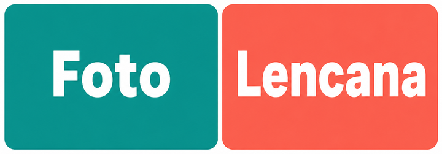
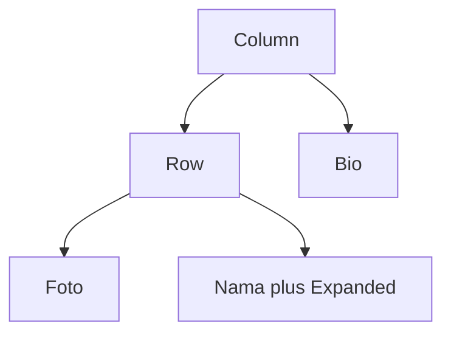
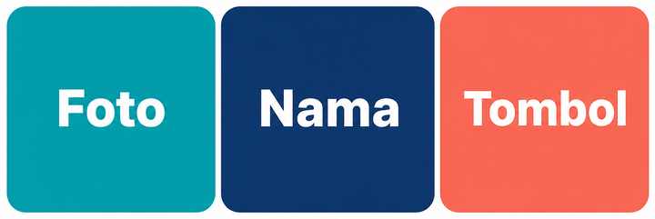
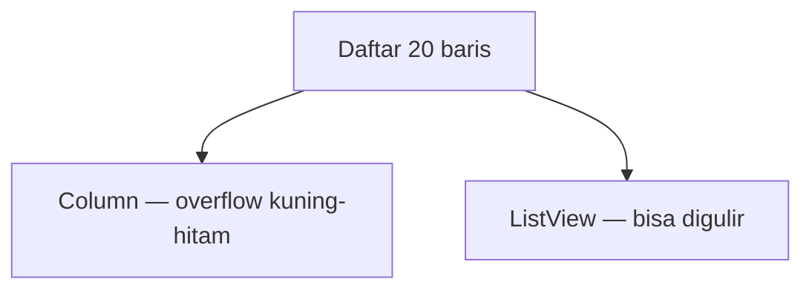

# Modul 02 — Flutter UI: merakit tampilan

**Waktu:** 2 sesi  
**Prasyarat:** Modul 00 (Flutter SDK + emulator atau HP) dan Modul 01 (Dart).  
**Hasil:** Nanti Anda bisa merakit halaman dengan widget, menghindari overflow kuning-hitam, dan pakai `ListView.builder` untuk daftar.

---

## Buka alat ini dulu

Ada **dua jalur uji**. Jangan sampai tertukar.

| Jalur | Buka | Untuk apa |
| --- | --- | --- |
| A | Browser → [dartpad.dev](https://dartpad.dev) → mode **Flutter** (bukan Dart) | Berkas widget lengkap: layout, overflow, list |
| B | VS Code + Terminal (`Ctrl + J`) + emulator/HP | Aset gambar, `google_fonts`, Widget Inspector |




Sumber gambar: [dart.dev/tools/dartpad](https://dart.dev/tools/dartpad), Dart team / Google ([CC BY 4.0](https://creativecommons.org/licenses/by/4.0/)). Foto resmi itu **tema gelap** dan **mode Dart** (keluaran teks di Console). Kalau kelihatan seperti kotak hitam, gulir sampai editor kiri dan tombol **Run** terlihat; itu bukan gambar rusak. Untuk modul ini, di pojok DartPad pilih mode **Flutter** supaya panel kanan jadi **layar aplikasi**, bukan Console.



### Dua jenis kode di halaman ini

| Jenis | Tanda | Caranya |
| --- | --- | --- |
| **Berkas lengkap** | Ada `import` dan `void main()` | Tempel utuh, lalu **Run** |
| **Cuplikan** | Hanya potongan (`body: ...`, satu widget) | Jangan di-Run sendirian. Pahami dulu, atau salin ke dalam kerangka Uji 1 |

### Pola uji A — DartPad Flutter

| | |
| --- | --- |
| **Buka** | [dartpad.dev](https://dartpad.dev) |
| **Pilih** | mode **Flutter** |
| **Tempel** | seluruh **berkas lengkap**, termasuk `import` dan `void main()` |
| **Klik** | **Run** |
| **Lihat** | panel kanan: pratinjau aplikasi |

### Pola uji B — proyek lokal

| | |
| --- | --- |
| **Buka** | VS Code di folder proyek, emulator atau HP sudah menyala |
| **Terminal** | `Ctrl + J` |
| **Ketik** | `flutter run` |
| **Ubah kode** | simpan (`Ctrl + S`), lalu tekan `r` di terminal yang menjalankan app |

> **Aturan emas:** perintah `flutter ...` hanya di **Terminal VS Code**. DartPad tidak menjalankan `flutter pub add`.

---

## 1. Semua adalah widget

Di Flutter SDK, tombol, teks, padding, bahkan seluruh aplikasi adalah **widget**: potongan UI yang bisa disusun.



*Ilustrasi asli materi mobile2026. Tiga contoh widget yang sering dipakai: `Text`, `Icon`, dan `Container`. Penjelasan ada di teks, bukan di dalam gambar.*



Sumber konsep: [docs.flutter.dev/ui/widgets](https://docs.flutter.dev/ui/widgets). Flutter and the related logo are trademarks of Google LLC.

### Uji 1 — Halo widget

| | |
| --- | --- |
| **Buka** | [dartpad.dev](https://dartpad.dev), mode **Flutter** |
| **Tempel** | berkas lengkap di bawah |
| **Klik** | **Run** |

```dart
import 'package:flutter/material.dart';

void main() => runApp(const MateriApp());

class MateriApp extends StatelessWidget {
  const MateriApp({super.key});

  @override
  Widget build(BuildContext context) {
    return const MaterialApp(
      home: Scaffold(
        body: Center(
          child: Column(
            mainAxisAlignment: MainAxisAlignment.center,
            children: [
              Icon(Icons.phone_android, size: 48),
              SizedBox(height: 12),
              Text('Halo, ini widget'),
            ],
          ),
        ),
      ),
    );
  }
}
```

**Kalau berhasil:** panel kanan menampilkan ikon dan teks, bukan error merah.

`const` di depan widget yang isinya tetap: kebiasaan hemat rebuild. Pakai sejak awal.

---

## 2. Stateless vs Stateful

| Jenis | Artinya | Kapan |
| --- | --- | --- |
| `StatelessWidget` | tampilan diam | kartu profil, ikon, teks judul |
| `StatefulWidget` | tampilan bisa berubah | penghitung, sakelar tema, formulir |

Stateful butuh dua class: widget + `State`. Angka penghitung tinggal di `State`, bukan di widget.

### Uji 2 — penghitung kecil

| | |
| --- | --- |
| **Buka** | DartPad, mode Flutter |
| **Tempel** | berkas lengkap |
| **Klik** | **Run**, lalu ketuk tombol `+` di layar kanan |

```dart
import 'package:flutter/material.dart';

void main() => runApp(const MateriApp());

class MateriApp extends StatelessWidget {
  const MateriApp({super.key});

  @override
  Widget build(BuildContext context) {
    return const MaterialApp(home: PenghitungPage());
  }
}

class PenghitungPage extends StatefulWidget {
  const PenghitungPage({super.key});

  @override
  State<PenghitungPage> createState() => _PenghitungPageState();
}

class _PenghitungPageState extends State<PenghitungPage> {
  int angka = 0;

  @override
  Widget build(BuildContext context) {
    return Scaffold(
      appBar: AppBar(title: const Text('Penghitung')),
      body: Center(child: Text('Nilai: $angka')),
      floatingActionButton: FloatingActionButton(
        onPressed: () => setState(() => angka++),
        child: const Icon(Icons.add),
      ),
    );
  }
}
```

Tanpa `setState`, angka di memori berubah tetapi layar tidak menggambar ulang.

Huruf sistem yang dibesarkan dibahas di bagian 9. Jangan menonaktifkan skalasi teks di aplikasi yang akan dipakai orang lain.

State yang lebih rapi (Provider) ada di **Modul 04**. Di sini cukup `setState`.

---

## 3. Layout: Row, Column, Stack, Padding, Expanded

- `Column` = tumpuk **vertikal** (atas ke bawah).
- `Row` = jajar **horizontal** (kiri ke kanan).
- `Padding` = jarak di sekeliling anak.
- `Expanded` = “ambil sisa ruang” di dalam Row/Column.
- `Stack` = tumpuk bertumpuk (foto + lencana di sudut).



*Ilustrasi asli materi mobile2026. Stack: foto di bawah, lencana di atasnya. Penjelasan ada di teks.*



Halaman kartu biasanya tiga bagian: foto, nama, tombol.



*Ilustrasi asli materi mobile2026. Tiga bagian halaman: foto, nama, tombol. Penjelasan ada di teks.*

Contoh resmi Flutter (danau + baris CALL / ROUTE / SHARE) ada di [Build a Flutter layout](https://docs.flutter.dev/ui/layout/tutorial). Foto di tutorial itu: [Dino Reichmuth di Unsplash](https://unsplash.com/@dinoreichmuth) ([Unsplash License](https://unsplash.com/license)). Konsep layout: [Layouts in Flutter](https://docs.flutter.dev/ui/layout) ([CC BY 4.0](https://creativecommons.org/licenses/by/4.0/)). Flutter and the related logo are trademarks of Google LLC.

### Uji 3 — Row di dalam Column

| | |
| --- | --- |
| **Buka** | DartPad, mode Flutter |
| **Tempel** | berkas lengkap |
| **Klik** | **Run** |

```dart
import 'package:flutter/material.dart';

void main() => runApp(const MateriApp());

class MateriApp extends StatelessWidget {
  const MateriApp({super.key});

  @override
  Widget build(BuildContext context) {
    return MaterialApp(
      home: Scaffold(
        body: Padding(
          padding: const EdgeInsets.all(24),
          child: Column(
            crossAxisAlignment: CrossAxisAlignment.start,
            children: [
              Row(
                children: [
                  const CircleAvatar(radius: 28, child: Icon(Icons.person)),
                  const SizedBox(width: 12),
                  Expanded(
                    child: Text(
                      'Siti Nurhaliza dari Samarinda',
                      style: Theme.of(context).textTheme.titleMedium,
                    ),
                  ),
                ],
              ),
              const SizedBox(height: 16),
              const Text('Bio singkat: belajar merakit tampilan.'),
            ],
          ),
        ),
      ),
    );
  }
}
```

**Kesalahan klasik:** `Row` berisi `Text` panjang **tanpa** `Expanded` → garis kuning-hitam di tepi kanan. Itu overflow.

Coba sendiri: hapus `Expanded` (biarkan `Text` langsung di dalam `Row`), **Run** lagi, lalu kembalikan `Expanded`.

---

## 4. SafeArea dan MediaQuery

Lekukan layar (notch) dan bilah status bisa menimpa teks. `SafeArea` menggeser isi ke area yang aman disentuh.

`MediaQuery` membaca ukuran layar dan faktor huruf sistem. Contoh: `MediaQuery.sizeOf(context).width` = lebar layar saat ini. Itu berguna nanti saat kartu harus rapat di HP kecil.

Cuplikan (tempel di dalam `body` kerangka Uji 1, jangan di-Run sendirian):

```dart
SafeArea(
  child: Padding(
    padding: const EdgeInsets.all(16),
    child: Text('Tidak tertutup status bar'),
  ),
)
```

Di DartPad web, efek notch kadang tidak terlihat. Uji **jalur B** di HP fisik untuk merasakan bedanya.

---

## 5. Overflow kuning-hitam (keyboard dan list)

Garis kuning-hitam = anak widget **lebih besar** daripada ruang widget induk. Bukan instalasi yang rusak. Dokumentasi Flutter menyebutnya *yellow and black striped pattern* ([Common Flutter errors](https://docs.flutter.dev/testing/common-errors)). Penyebab yang sering:

1. `Column` penuh di dalam layar, lalu keyboard muncul.
2. `Row` berisi teks panjang tanpa `Expanded` / `Flexible`.
3. `ListView` di dalam `Column` tanpa batas tinggi.



### Uji 5 — perbaiki Column yang overflow

| | |
| --- | --- |
| **Buka** | DartPad, mode Flutter |
| **Tempel** | berkas **Rusak**, klik **Run**, lihat garis kuning |
| **Ganti** | isi `body` menjadi `ListView` seperti berkas **Perbaikan**, **Run** lagi |

**Berkas lengkap — rusak (sengaja):**

```dart
import 'package:flutter/material.dart';

void main() => runApp(const MateriApp());

class MateriApp extends StatelessWidget {
  const MateriApp({super.key});

  @override
  Widget build(BuildContext context) {
    return MaterialApp(
      home: Scaffold(
        appBar: AppBar(title: const Text('Overflow sengaja')),
        body: Column(
          children: List.generate(
            20,
            (i) => ListTile(title: Text('Baris $i')),
          ),
        ),
      ),
    );
  }
}
```

**Berkas lengkap — perbaikan:**

```dart
import 'package:flutter/material.dart';

void main() => runApp(const MateriApp());

class MateriApp extends StatelessWidget {
  const MateriApp({super.key});

  @override
  Widget build(BuildContext context) {
    return MaterialApp(
      home: Scaffold(
        appBar: AppBar(title: const Text('ListView')),
        body: ListView(
          children: List.generate(
            20,
            (i) => ListTile(title: Text('Baris $i')),
          ),
        ),
      ),
    );
  }
}
```

Untuk formulir + keyboard: bungkus dengan `SingleChildScrollView`, atau pakai `resizeToAvoidBottomInset: true` (bawaan Scaffold). Latihan form lengkap ada di **Modul 03**.

---

## 6. Material: Scaffold, AppBar, tombol, kartu, Drawer

`Scaffold` = kerangka halaman: AppBar, body, tombol mengambang, laci (`Drawer`).

### Uji 6 — kerangka halaman

| | |
| --- | --- |
| **Buka** | DartPad, mode Flutter |
| **Tempel** | berkas lengkap |
| **Klik** | **Run**, lalu ketuk ikon menu di kiri AppBar untuk membuka Drawer |

```dart
import 'package:flutter/material.dart';

void main() => runApp(const MateriApp());

class MateriApp extends StatelessWidget {
  const MateriApp({super.key});

  @override
  Widget build(BuildContext context) {
    return MaterialApp(
      home: Scaffold(
        appBar: AppBar(title: const Text('Beranda')),
        drawer: const Drawer(
          child: SafeArea(
            child: ListTile(title: Text('Menu')),
          ),
        ),
        body: Card(
          margin: const EdgeInsets.all(16),
          child: ListTile(
            leading: const Icon(Icons.school),
            title: const Text('Kartu contoh'),
            trailing: FilledButton(
              onPressed: () {},
              child: const Text('Buka'),
            ),
          ),
        ),
      ),
    );
  }
}
```

| Widget | Kegunaan |
| --- | --- |
| `FilledButton` | aksi utama |
| `OutlinedButton` | aksi sekunder |
| `TextButton` | aksi ringan |
| `Card` | kelompok informasi |
| `Drawer` | menu samping |

Sumber: [Material widgets](https://docs.flutter.dev/ui/widgets/material).

---

## 7. Tema dan mode gelap

Satu `ThemeData` menjaga warna dan huruf tetap selaras.

### Uji 7 — tema dari seed color

| | |
| --- | --- |
| **Buka** | DartPad, mode Flutter |
| **Tempel** | berkas lengkap |
| **Klik** | **Run** |

```dart
import 'package:flutter/material.dart';

void main() => runApp(const MateriApp());

class MateriApp extends StatelessWidget {
  const MateriApp({super.key});

  @override
  Widget build(BuildContext context) {
    return MaterialApp(
      theme: ThemeData(
        colorScheme: ColorScheme.fromSeed(seedColor: Colors.teal),
        useMaterial3: true,
      ),
      darkTheme: ThemeData(
        colorScheme: ColorScheme.fromSeed(
          seedColor: Colors.teal,
          brightness: Brightness.dark,
        ),
        useMaterial3: true,
      ),
      themeMode: ThemeMode.system,
      home: const Scaffold(
        body: Center(child: Text('Ikuti tema perangkat')),
      ),
    );
  }
}
```

`ThemeMode.system` mengikuti sakelar gelap di pengaturan HP. Menyimpan pilihan pengguna (gelap selalu / terang selalu) memakai data lokal di **Modul 05**.

---

## 8. Font kustom — hanya jalur B

[google_fonts](https://pub.dev/packages/google_fonts) butuh paket pub. DartPad hanya menyediakan **sebagian** paket. Jika error, pindah ke jalur B.

| | |
| --- | --- |
| **Buka** | VS Code, folder proyek Flutter |
| **Terminal** | `Ctrl + J` |
| **Ketik** | perintah di bawah, lalu Enter |

```powershell
flutter pub add google_fonts
```

**Kalau berhasil:** terminal menulis bahwa `google_fonts` ditambahkan, dan `pubspec.yaml` memuat baris paket itu.

Lalu di berkas Dart proyek (bukan DartPad):

```dart
import 'package:google_fonts/google_fonts.dart';

Text(
  'Judul',
  style: GoogleFonts.plusJakartaSans(fontWeight: FontWeight.w700),
);
```

Cukup **satu** keluarga huruf. Jangan memasang 20 font.

---

## 9. Skalasi teks

Sebagian pengguna membesarkan huruf di pengaturan HP. Layout tidak boleh pecah.

- Hindari tinggi tetap yang sempit untuk teks panjang.
- Uji jalur B: **Pengaturan HP → Tampilan → Ukuran font** (nama menu berbeda per pabrik).
- `FittedBox` atau biarkan teks pindah baris (`softWrap: true`, bawaan).

Jangan memaksa `textScaler: TextScaler.linear(1)` di aplikasi yang dipakai orang lain, kecuali untuk uji singkat. Itu mengabaikan kebutuhan aksesibilitas.

---

## 10. ListView.builder (wajib untuk daftar)

| Cara | Kapan |
| --- | --- |
| `ListView(children: [...])` | sedikit item, jumlah tetap |
| **`ListView.builder`** | daftar bisa panjang (chat, produk, catatan) |

`builder` hanya membangun baris yang kelihatan di layar.

### Uji 10

| | |
| --- | --- |
| **Buka** | DartPad, mode Flutter |
| **Tempel** | berkas lengkap |
| **Klik** | **Run**, gulir daftar di panel kanan |

```dart
import 'package:flutter/material.dart';

void main() => runApp(const MateriApp());

class MateriApp extends StatelessWidget {
  const MateriApp({super.key});

  @override
  Widget build(BuildContext context) {
    return MaterialApp(
      home: Scaffold(
        appBar: AppBar(title: const Text('100 item')),
        body: ListView.builder(
          itemCount: 100,
          itemBuilder: (context, index) {
            return ListTile(
              key: ValueKey('item-$index'),
              title: Text('Item $index'),
            );
          },
        ),
      ),
    );
  }
}
```

`Key` pada item: Flutter tidak tertukar baris saat urutan data berubah (hapus, sisip). Pakai `ValueKey` yang stabil (id catatan), bukan indeks jika daftar bisa dihapus.

---

## 11. Animasi implisit

Satu contoh cukup: `AnimatedContainer`. Tanpa `AnimationController`.

### Uji 11

| | |
| --- | --- |
| **Buka** | DartPad, mode Flutter |
| **Tempel** | berkas lengkap |
| **Klik** | **Run**, lalu ketuk tombol untuk mengubah ukuran kotak |

```dart
import 'package:flutter/material.dart';

void main() => runApp(const MateriApp());

class MateriApp extends StatelessWidget {
  const MateriApp({super.key});

  @override
  Widget build(BuildContext context) {
    return const MaterialApp(home: AnimasiPage());
  }
}

class AnimasiPage extends StatefulWidget {
  const AnimasiPage({super.key});

  @override
  State<AnimasiPage> createState() => _AnimasiPageState();
}

class _AnimasiPageState extends State<AnimasiPage> {
  bool lebar = false;

  @override
  Widget build(BuildContext context) {
    return Scaffold(
      appBar: AppBar(title: const Text('AnimatedContainer')),
      body: Center(
        child: AnimatedContainer(
          duration: const Duration(milliseconds: 250),
          width: lebar ? 200 : 80,
          height: 80,
          color: lebar ? Colors.teal : Colors.orange,
        ),
      ),
      floatingActionButton: FloatingActionButton(
        onPressed: () => setState(() => lebar = !lebar),
        child: const Icon(Icons.play_arrow),
      ),
    );
  }
}
```

---

## 12. Aset gambar — jalur A dulu, lalu jalur B

### Uji 12A — gambar dari internet (DartPad)

Di DartPad tidak ada folder `assets/`. Pakai `Image.network`.

| | |
| --- | --- |
| **Buka** | DartPad, mode Flutter |
| **Tempel** | berkas lengkap |
| **Klik** | **Run** |

```dart
import 'package:flutter/material.dart';

void main() => runApp(const MateriApp());

class MateriApp extends StatelessWidget {
  const MateriApp({super.key});

  @override
  Widget build(BuildContext context) {
    return MaterialApp(
      home: Scaffold(
        appBar: AppBar(title: const Text('Gambar jaringan')),
        body: Center(
          child: Image.network(
            'https://picsum.photos/id/9/250/250',
          ),
        ),
      ),
    );
  }
}
```

Foto uji: [picsum.photos/id/9/250/250](https://picsum.photos/id/9/250/250) (Lorem Picsum, foto dari [Unsplash](https://unsplash.com); layanan [picsum.photos](https://picsum.photos)). Pola yang sama dipakai di [Display images from the internet](https://docs.flutter.dev/cookbook/images/network-image).

**Kalau berhasil:** panel kanan menampilkan foto. Kalau gagal, cek koneksi internet; DartPad perlu mengunduh gambar.

### Jalur B — gambar di dalam proyek

1. Simpan berkas di `assets/images/foto.png`.
2. Daftarkan di `pubspec.yaml`:

```yaml
flutter:
  assets:
    - assets/images/
```

3. Di Terminal VS Code ketik `flutter pub get`, lalu tampilkan:

```dart
Image.asset('assets/images/foto.png')
```

Sumber langkah: [Adding assets and images](https://docs.flutter.dev/ui/assets/assets-and-images).

Layar pembuka toko (splash Android) diatur nanti di Modul 10. Itu berbeda dari widget bernama `Splash` di Dart.

---

## 13. Widget Inspector — hanya jalur B

Inspector menampilkan **pohon widget** aplikasi yang sedang berjalan.

| | |
| --- | --- |
| **Buka** | VS Code, app sudah `flutter run` |
| **Lalu** | palet perintah `Ctrl + Shift + P` → ketik **Flutter: Open DevTools** |
| **Atau** | ikon Flutter DevTools di bilah samping VS Code |

Pilih widget di HP, pohon di DevTools ikut bergulir. Berguna saat overflow: lihat widget mana yang terlalu lebar.


Sumber gambar: [Use the Flutter inspector](https://docs.flutter.dev/tools/devtools/inspector), Flutter team / Google. Konten halaman dokumentasi itu, kecuali dinyatakan lain, berlisensi [CC BY 4.0](https://creativecommons.org/licenses/by/4.0/). Flutter and the related logo are trademarks of Google LLC.

---

## Mini proyek: kartu profil

Syarat (silabus): foto, nama, bio, 3 tombol; tidak pecah di HP kecil; tetap terbaca jika font sistem dibesarkan.

Urutan kerja, jangan terbalik:

1. Buka [dartpad.dev](https://dartpad.dev), pilih mode **Flutter** (bukan Dart).
2. Tempel berkas lengkap di bawah, klik **Run**.
3. Lihat panel kanan: foto, nama, bio, tiga tombol.
4. (Opsional, jalur B) Ganti foto jaringan dengan `Image.asset` setelah aset didaftar.

| | |
| --- | --- |
| **Buka** | DartPad mode Flutter (foto memakai `Image.network`) **atau** proyek lokal (jalur B, `Image.asset`) |
| **Tempel** | berkas lengkap di bawah |
| **Klik** | **Run** |

```dart
import 'package:flutter/material.dart';

void main() => runApp(const MateriApp());

class MateriApp extends StatelessWidget {
  const MateriApp({super.key});

  @override
  Widget build(BuildContext context) {
    return const MaterialApp(home: KartuProfil());
  }
}

class KartuProfil extends StatelessWidget {
  const KartuProfil({super.key});

  @override
  Widget build(BuildContext context) {
    return Scaffold(
      appBar: AppBar(title: const Text('Profil')),
      body: SafeArea(
        child: SingleChildScrollView(
          padding: const EdgeInsets.all(24),
          child: Column(
            children: [
              const CircleAvatar(
                radius: 48,
                backgroundImage: NetworkImage(
                  'https://picsum.photos/id/64/200/200',
                ),
              ),
              const SizedBox(height: 12),
              Text(
                'Nama Anda',
                style: Theme.of(context).textTheme.headlineSmall,
              ),
              const SizedBox(height: 8),
              const Text(
                'Bio dua atau tiga kalimat yang boleh pindah baris.',
                textAlign: TextAlign.center,
              ),
              const SizedBox(height: 24),
              Row(
                children: [
                  Expanded(
                    child: OutlinedButton(
                      onPressed: () {},
                      child: const Text('Surel'),
                    ),
                  ),
                  const SizedBox(width: 8),
                  Expanded(
                    child: OutlinedButton(
                      onPressed: () {},
                      child: const Text('GitHub'),
                    ),
                  ),
                  const SizedBox(width: 8),
                  Expanded(
                    child: FilledButton(
                      onPressed: () {},
                      child: const Text('Telepon'),
                    ),
                  ),
                ],
              ),
            ],
          ),
        ),
      ),
    );
  }
}
```

Foto avatar: [picsum.photos/id/64/200/200](https://picsum.photos/id/64/200/200) (Lorem Picsum / Unsplash). Ganti URL atau, di jalur B, ganti `CircleAvatar` dengan `backgroundImage: AssetImage('assets/images/foto.png')` setelah aset didaftar.

`Expanded` pada ketiga tombol: di HP sempit, tombol berbagi lebar, tidak overflow.

---

## Kesalahan yang sering terjadi

| Gejala | Penyebab yang sering | Perbaikan |
| --- | --- | --- |
| DartPad hanya `print`, tidak ada layar | Mode **Dart**, bukan Flutter | Ganti mode Flutter |
| Error merah setelah **Run** | Yang ditempel hanya cuplikan, tanpa `main()` | Tempel **berkas lengkap** |
| Kuning-hitam di tepi | Overflow Row/Column | `Expanded`, `ListView`, atau `SingleChildScrollView` |
| `setState` dipanggil tetapi UI diam | Dipanggil di luar `State` | Pindahkan logika ke class `State` |
| `Image.asset` gagal | Belum didaftar di `pubspec.yaml` | Tambah `assets:`, lalu `flutter pub get` di Terminal VS Code |
| `google_fonts` error di DartPad | Paket tidak tersedia di DartPad | Jalur B (proyek lokal) |
| Inspector kosong | App tidak sedang `flutter run` | Jalankan dulu, baru buka DevTools |

---

## Latihan

1. Ganti `Center` + `Text` menjadi `Column` berisi ikon, judul, dan `FilledButton`. Uji di DartPad mode Flutter.
2. Buat `Row` tiga `Icon`. Tambahkan `MainAxisAlignment.spaceEvenly`.
3. Picu overflow sengaja (teks panjang di `Row` tanpa `Expanded`), lalu perbaiki.
4. `ListView.builder` 30 item, tiap baris punya `ValueKey`.
5. (Jalur B) Tambah satu gambar aset dan tampilkan di kartu profil.

---

## Kuis singkat

1. Kapan wajib `ListView.builder`, bukan `ListView(children: ...)`?
2. Apa arti garis kuning-hitam di tepi widget?
3. Perintah `flutter pub add google_fonts` diketik di mana?
4. Kenapa tombol di kartu profil dibungkus `Expanded`?

Kunci jawaban di bawah. Coba jawab dulu.

---

## Apa yang belum dibahas

- Formulir, validasi, DatePicker, navigasi, `go_router` → **Modul 03**
- Provider / state lintas halaman → Modul 04
- Menyimpan tema gelap ke HP → Modul 05
- `AnimationController` kustom → ditunda

---

## Kunci kuis

1. Jika jumlah item bisa banyak atau tidak tetap; `builder` hanya membangun yang terlihat.
2. Anak lebih besar daripada ruang widget induk (overflow).
3. Terminal VS Code di folder proyek, bukan DartPad.
4. Agar tiga tombol berbagi lebar layar dan tidak mendorong Row sampai overflow.

---

## Sumber gambar dan tautan

| Aset | Sumber |
| --- | --- |
| `images/analogi-widget-lego.png` | Ilustrasi asli materi mobile2026 |
| `images/analogi-stack.png` | Ilustrasi asli materi mobile2026 |
| `images/analogi-layout-kartu.png` | Ilustrasi asli materi mobile2026 |
| Tampilan DartPad (mode Dart) | [dart.dev/assets/img/dartpad-hello.png](https://dart.dev/assets/img/dartpad-hello.png) dari [dart.dev/tools/dartpad](https://dart.dev/tools/dartpad) ([CC BY 4.0](https://creativecommons.org/licenses/by/4.0/)) |
| Tutorial layout resmi | [docs.flutter.dev/ui/layout/tutorial](https://docs.flutter.dev/ui/layout/tutorial) ([CC BY 4.0](https://creativecommons.org/licenses/by/4.0/)); foto danau di tutorial itu: [Dino Reichmuth / Unsplash](https://unsplash.com/@dinoreichmuth) ([Unsplash License](https://unsplash.com/license)) |
| Flutter Inspector | [inspector_screenshot.png](https://docs.flutter.dev/assets/images/docs/tools/devtools/inspector_screenshot.png) dari [Use the Flutter inspector](https://docs.flutter.dev/tools/devtools/inspector) ([CC BY 4.0](https://creativecommons.org/licenses/by/4.0/)) |
| Foto uji `Image.network` | [picsum.photos](https://picsum.photos) (Lorem Picsum; foto Unsplash), pola dari [cookbook jaringan](https://docs.flutter.dev/cookbook/images/network-image) |
| Overflow kuning-hitam | [Common Flutter errors](https://docs.flutter.dev/testing/common-errors) |
| Konsep widget | [docs.flutter.dev/ui/widgets](https://docs.flutter.dev/ui/widgets) |
| Aset gambar | [docs.flutter.dev/ui/assets/assets-and-images](https://docs.flutter.dev/ui/assets/assets-and-images) |
| google_fonts | [pub.dev/packages/google_fonts](https://pub.dev/packages/google_fonts) |

Flutter and the related logo are trademarks of Google LLC. We are not endorsed by or affiliated with Google LLC.
