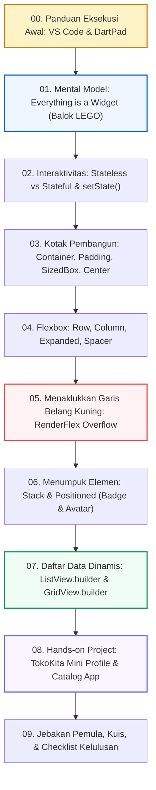
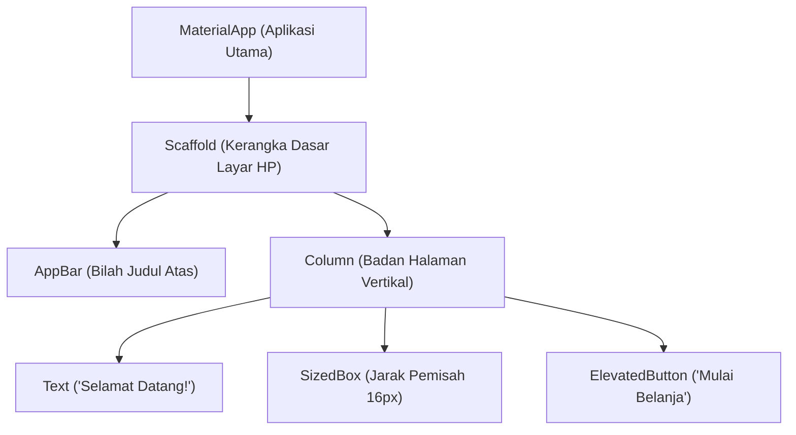
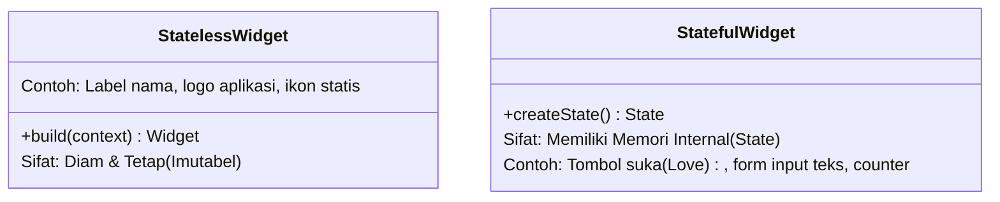
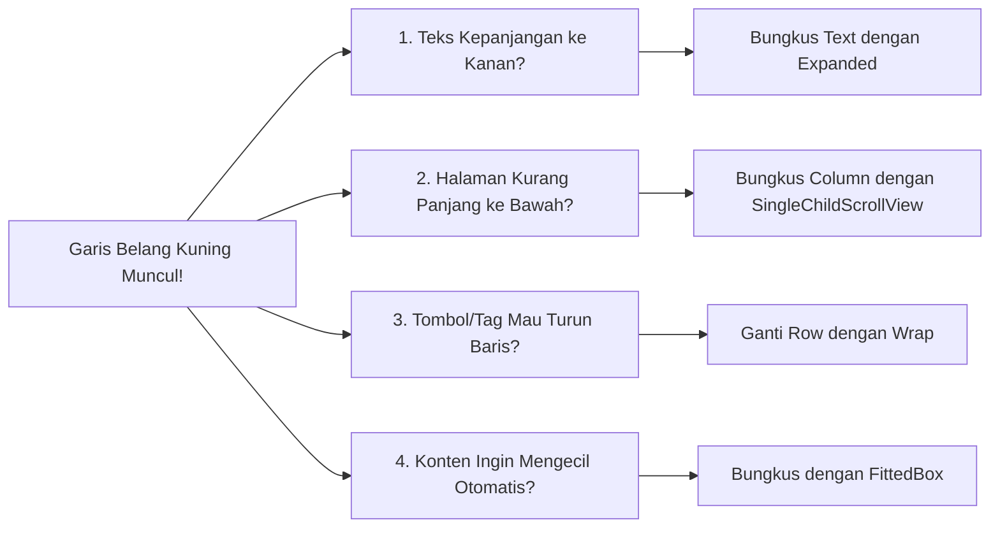
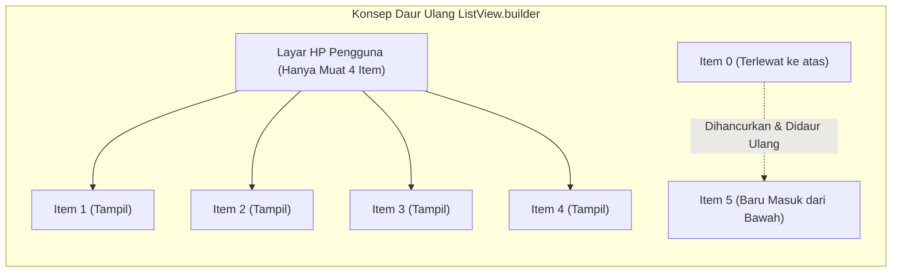

# Modul 02A: Fondasi Flutter UI, Layouting, & Scrolling Dasar

Selamat datang di **Modul 02A: Fondasi Flutter UI, Layouting, & Scrolling Dasar**! 

Modul ini disusun khusus dengan gaya bahasa yang santai, bersahabat, terstruktur rapi sesuai kaidah EYD/PUEBI, dan sangat ramah bagi Anda yang baru pertama kali menyentuh antarmuka visual Flutter (*entry-level / beginner-friendly*). 

Jika pada **Modul 01** Anda telah menguasai logika berpikir bahasa pemrograman Dart, di modul inilah Anda akan merasakan keasyikan sejati sebagai pengembang mobile: **menyulap baris-baris kode menjadi tampilan aplikasi ponsel cerdas (HP) yang cantik, interaktif, dan mulus!**

---

## 🧭 Peta Pembelajaran Modul 02A



---

## 🛠️ 00. Panduan Persiapan Praktik: Di Mana dan Bagaimana Menjalankan Kode?

Bagi Anda yang masih awam, melihat contoh potongan kode sering kali memicu pertanyaan:  
*"Di mana saya harus menempelkan kode ini? File apa yang harus dibuka? Tools apa yang harus saya gunakan?"*

Tenang! Anda memiliki **dua cara mudah** untuk langsung mencoba dan menguji setiap contoh kode pada modul ini:

---

### Cara 1: Menggunakan VS Code & HP Fisik / Emulator (Standar Industri)

Ini adalah cara standar yang digunakan oleh *software engineer* profesional di industri:

1. **Buka Terminal / Command Prompt**, lalu buat proyek latihan baru dengan mengetik:
   ```bash
   flutter create belajar_ui_flutter
   ```
2. **Buka folder proyek tersebut di VS Code**:
   ```bash
   cd belajar_ui_flutter
   code .
   ```
3. **Buka file utama aplikasi**:  
   Di panel penjelajah berkas (*explorer*) sebelah kiri, buka folder **`lib/`** lalu klik file **`main.dart`**.
4. **Ganti isi kodenya**:  
   Hapus seluruh isi kode bawaan (contoh aplikasi kalkulator *counter*), lalu tempelkan (*paste*) kode yang ingin Anda uji.
5. **Jalankan ke Layar HP atau Emulator**:
   - Pastikan Emulator Android sudah menyala (atau HP fisik Anda sudah terhubung via kabel USB dengan opsi *USB Debugging* aktif).
   - Tekan tombol keyboard **F5**, atau klik menu **Run ➔ Run Without Debugging**, atau ketik di terminal VS Code:
     ```bash
     flutter run
     ```
6. **Keajaiban Hot Reload (`Ctrl + S`)**:  
   Begitu aplikasi menyala di layar HP, Anda tidak perlu mematikan dan mengompilasi ulang saat ingin mengubah warna atau teks! Cukup simpan file Anda (**Ctrl + S** di Windows atau **Cmd + S** di Mac), dan dalam sekejap (< 1 detik), perubahan tampilan langsung tampak di layar HP Anda!

---

### Cara 2: Menggunakan DartPad (Instan di Browser, 0 Menit Instalasi)

Jika laptop Anda belum sempat dipasangi Flutter SDK atau terasa berat membuka emulator Android, Anda tetap bisa belajar secara instan lewat peramban web:

1. Buka peramban (Google Chrome, Edge, Safari, dll.) dan kunjungi: **[https://dartpad.dev/flutter](https://dartpad.dev/flutter)**.
2. Di panel sebelah kiri, hapus kodenya lalu tempelkan kode contoh dari modul ini.
3. Klik tombol biru **"Run"** di pojok kanan atas.
4. Tampilan aplikasi interaktif akan langsung muncul di panel sebelah kanan menyerupai layar ponsel pintar sungguhan!

---

> 💡 **Tips Emas Pemula (Kanvas Aman Pengujian Kode)**:  
> Seluruh potongan widget kecil pada Bab 02 hingga 07 (seperti `Container`, `Row`, `Stack`, dll.) bisa langsung Anda uji dengan menaruhnya di dalam kerangka dasar (*boilerplate*) berikut di file `lib/main.dart`:
> ```dart
> import 'package:flutter/material.dart';
> 
> void main() {
>   runApp(const MaterialApp(
>     debugShowCheckedModeBanner: false,
>     home: Scaffold(
>       body: Center(
>         child: /* Masukkan potongan kode widget Anda di sini */,
>       ),
>     ),
>   ));
> }
> ```

---

## 🧱 01. Mental Model: "Everything is a Widget" (Filosofi Balok LEGO)

Di dunia Flutter, pegang teguh satu aturan fundamental: **Semua hal yang Anda lihat di layar adalah Widget**.

Bayangkan Anda sedang menyusun **balok LEGO**:
* Teks tulisan adalah balok `Text`.
* Tombol biru yang bisa diklik adalah balok `ElevatedButton`.
* Spasi jarak kosong adalah balok `SizedBox`.
* Wadah kotak berlatar warna dengan sudut melengkung adalah balok `Container`.
* Bahkan tata letak (perataan tengah, mendatar, atau menurun) juga merupakan balok: `Center`, `Row`, dan `Column`!



Di Flutter, pohon susunan balok ini disebut **Widget Tree**. Layar aplikasi Anda dibangun dari kombinasi balok-balok kecil yang saling menyusun (*composition*). Anda tidak perlu membangun antarmuka rumit dari nol; cukup pilih dan susun balok-balok dasar yang sudah disediakan Flutter!

---

## ⚡ 02. Interaktivitas Dasar: StatelessWidget vs StatefulWidget & Sihir `setState()`

Kapan antarmuka aplikasi kita bersifat diam (*statis*), dan kapan harus bergerak merespons sentuhan jari pengguna (*dinamis*)?



### 1. StatelessWidget (Tampilan Tetap)
Gunakan `StatelessWidget` jika data pada tampilan tersebut **tidak akan pernah berubah** sepanjang aplikasi berjalan:

```dart
import 'package:flutter/material.dart';

class KartuUcapan extends StatelessWidget {
  final String nama;
  const KartuUcapan({super.key, required this.nama});

  @override
  Widget build(BuildContext context) {
    return Text(
      'Halo, $nama! Selamat belajar Flutter.',
      style: const TextStyle(fontSize: 16, fontWeight: FontWeight.bold),
    );
  }
}
```

---

### 2. StatefulWidget & Siklus Hidupnya
Jika tampilan harus bereaksi saat disentuh pengguna (misalnya angka bertambah atau tombol berubah warna), gunakan `StatefulWidget`.

Mari kita amati bagaimana siklus hidup internal sebuah `StatefulWidget` berjalan:

<p align="center">
  
</p>
<p align="center"><em>Gambar 1: Alur Siklus Hidup StatefulWidget dari Inisialisasi hingga Re-Render Loop. (Sumber: Dokumentasi Resmi Flutter - flutter.dev).</em></p>

* **`createState()`**: Dipanggil pertama kali saat widget dipasang ke layar.
* **`initState()`**: Tempat mempersiapkan data awal (hanya dijalankan satu kali saja).
* **`build()`**: Tempat Flutter menggambar tampilan visual ke layar ponsel.
* **`setState()`**: **Tombol pemicu!** Memberitahu Flutter: *"Data saya berubah, tolong gambar ulang (re-render) tampilan ini sekarang juga!"*
* **`dispose()`**: Tempat membersihkan memori saat layar ditutup pengguna.

> 💡 **Catatan untuk Pemula**:  
> Sebagai pemula, Anda cukup fokus pada **3 method utama**:
> 1. `initState()`: Menyiapkan variabel awal.
> 2. `build()`: Menggambar tampilan visual.
> 3. `setState()`: Memperbarui tampilan saat data berganti.  
> Method siklus hidup lainnya (seperti `didChangeDependencies` atau `didUpdateWidget`) akan dipelajari lebih dalam saat Anda membangun aplikasi skala menengah/besar.

#### Contoh Nyata: Tombol Suka (Favorite Button) Interaktif
Salin kode berikut ke `lib/main.dart` Anda dan coba klik tombolnya di HP:

```dart
import 'package:flutter/material.dart';

void main() {
  runApp(const MaterialApp(
    debugShowCheckedModeBanner: false,
    home: Scaffold(
      body: Center(child: TombolSuka()),
    ),
  ));
}

class TombolSuka extends StatefulWidget {
  const TombolSuka({super.key});

  @override
  State<TombolSuka> createState() => _TombolSukaState();
}

class _TombolSukaState extends State<TombolSuka> {
  bool _isLiked = false;
  int _totalSuka = 120;

  void _klikSuka() {
    // KUNCI PENTING: Bungkus perubahan data dengan setState()!
    setState(() {
      _isLiked = !_isLiked;
      _totalSuka += _isLiked ? 1 : -1;
    });
  }

  @override
  Widget build(BuildContext context) {
    return ElevatedButton.icon(
      onPressed: _klikSuka,
      icon: Icon(
        _isLiked ? Icons.favorite : Icons.favorite_border,
        color: _isLiked ? Colors.red : Colors.grey,
      ),
      label: Text('$_totalSuka Suka'),
    );
  }
}
```

> ⚠️ **Peringatan Pemula**: Jika Anda lupa memanggil `setState()` dan hanya menulis `_totalSuka++`, variabel di memori memang bertambah, tetapi layar HP Anda **tidak akan pernah berubah** karena Flutter tidak tahu kalau data tersebut sudah berganti!

---

## 📦 03. Kotak Pembangun: Container, Padding, SizedBox, & Center

Sebelum menyusun tata letak halaman yang mewah, pahami dulu konsep **Box Model** (Model Kotak) di Flutter:

<p align="center">
  
</p>
<p align="center"><em>Gambar 2: Konsep Box Model di Flutter (Margin, Padding, dan Konten). (Sumber: Dokumentasi Resmi Flutter - flutter.dev/docs).</em></p>

* **Konten / Widget Anak**: Elemen inti seperti teks, tombol, atau foto.
* **Padding**: Busa pelindung di sisi dalam agar teks tidak menempel ke garis pinggir kartu.
* **Margin**: Jarak renggang di sisi luar agar kartu tidak menempel ke kartu lainnya atau ke tepi layar HP.

---

### Perbandingan 4 Kotak Paling Penting:

| Widget | Fungsi Utama | Contoh Kasus Penggunaan |
|---|---|---|
| **`Container`** | Kotak serbaguna (warna, border melengkung, bayangan, margin, dan padding). | Membuat kartu profil, kartu produk, atau kotak info berlatar warna. |
| **`Padding`** | Memberi jarak ruang di dalam widget secara khusus. | Memberi ruang nafas di sekeliling teks atau tombol. |
| **`SizedBox`** | Kotak kosong dengan ukuran pasti (`width` dan `height`). | Memberi spasi renggang vertikal (`SizedBox(height: 16)`) atau horizontal. |
| **`Center`** | Memposisikan komponen tepat di titik tengah area yang ada. | Memusatkan teks, tombol, atau animasi loading di layar. |

#### Contoh Implementasi Kartu Profil Elegan:

```dart
Widget bangunKartuProfil() {
  return Container(
    margin: const EdgeInsets.all(16), // Jarak renggang di luar kartu
    padding: const EdgeInsets.all(20), // Jarak nafas di dalam kartu
    decoration: BoxDecoration(
      color: Colors.white,
      borderRadius: BorderRadius.circular(16), // Sudut melengkung halus
      boxShadow: [
        BoxShadow(
          color: Colors.black.withOpacity(0.06),
          blurRadius: 10,
          offset: const Offset(0, 4), // Efek bayangan jatuh ke bawah
        ),
      ],
    ),
    child: const Column(
      mainAxisSize: MainAxisSize.min,
      children: [
        CircleAvatar(radius: 36, child: Icon(Icons.person, size: 40)),
        SizedBox(height: 12), // Spasi pemisah
        Text('Anton Prafanto', style: TextStyle(fontSize: 18, fontWeight: FontWeight.bold)),
        SizedBox(height: 4),
        Text('Fullstack Mobile Engineer', style: TextStyle(color: Colors.grey)),
      ],
    ),
  );
}
```

---

## 📐 04. Flexbox: Row, Column, Expanded, & Spacer

Bagaimana cara menata elemen berjejer ke samping atau bersusun ke bawah? Jawabannya adalah sistem **Flexbox** bawaan Flutter: **Row** dan **Column**.

<p align="center">
  
</p>
<p align="center"><em>Gambar 3: Aturan Sumbu Flexbox pada Row (Horizontal) dan Column (Vertikal). (Sumber: Ilustrasi Desain Antarmuka Flutter - flutter.dev).</em></p>

### 1. MainAxisAlignment vs CrossAxisAlignment
* **`Row`**:
  - `mainAxisAlignment`: Mengatur perataan mendatar (kiri `start`, tengah `center`, kanan `end`, atau rata kanan-kiri `spaceBetween`).
  - `crossAxisAlignment`: Mengatur perataan atas-bawah (sejajar atas, tengah, atau bawah).
* **`Column`**:
  - `mainAxisAlignment`: Mengatur perataan atas-bawah.
  - `crossAxisAlignment`: Mengatur perataan kiri-kanan.

---

### 2. Mengisi Sisa Ruang Kosong: `Expanded` & `Spacer`
* **`Expanded`**: Memaksa widget anak untuk merenggang memenuhi seluruh sisa ruang kosong yang tersedia pada sumbu utama. Sangat berguna agar teks panjang tidak meluber ke luar layar!
* **`Spacer`**: Balok perenggang kosong otomatis yang mendorong elemen di sebelahnya ke ujung tepi berlawanan.

```dart
Row(
  children: [
    const Icon(Icons.storefront, color: Colors.indigo),
    const SizedBox(width: 8),
    // Expanded membuat teks panjang otomatis menyesuaikan sisa lebar layar:
    const Expanded(
      child: Text(
        'Kemeja Flannel Pria Lengan Panjang Katun Halus Premium',
        maxLines: 1,
        overflow: TextOverflow.ellipsis, // Memberi tanda "..." di ujung teks
      ),
    ),
    const SizedBox(width: 12),
    // Harga di ujung kanan:
    const Text('Rp 189.000', style: TextStyle(fontWeight: FontWeight.bold)),
  ],
)
```

---

## 🚨 05. Menaklukkan Error Keramat: RenderFlex Overflow

Pernahkah Anda melihat layar aplikasi Flutter Anda tiba-tiba menampilkan **garis belang kuning dan hitam** seperti pita pembatas garis polisi (*police line*)?

```text
A RenderFlex overflowed by 48 pixels on the right / bottom.
```

<p align="center">
  
</p>
<p align="center"><em>Gambar 4: Perbandingan Kode Penyebab Overflow vs Solusi Responsif dengan Expanded. (Sumber: Dokumentasi Resmi Flutter - flutter.dev/docs).</em></p>

### Mengapa Ini Terjadi?
`Row` dan `Column` secara alami memiliki sifat **tidak bisa digulirkan (*non-scrollable*)**. Batas ruangnya terpaku pada luas layar HP fisik. Jika isi widget di dalamnya lebih besar dari ukuran fisik layar (misalnya teks terlalu panjang, atau keyboard virtual tiba-tiba muncul dari bawah saat mengetik), Flutter akan memunculkan garis belang kuning-hitam sebagai peringatan bahwa ada elemen yang terpotong!

---

### 4 Jurus Ampuh Mengatasi Overflow:



1. **Gunakan `Expanded`** jika teks di dalam `Row` kepanjangan ke samping.
2. **Gunakan `SingleChildScrollView`** jika formulir atau isi kartu Anda melebihi tinggi layar HP (terutama saat keyboard virtual mengetik muncul!).
3. **Gunakan `Wrap` (Pengganti `Row`)** jika Anda memiliki deretan tombol kategori/filter yang ingin otomatis turun ke baris baru saat tidak muat di kanan layar:
   ```dart
   Wrap(
     spacing: 8.0, // Jarak renggang mendatar
     runSpacing: 8.0, // Jarak renggang saat turun baris baru
     children: const [
       Chip(label: Text('Semua')),
       Chip(label: Text('Elektronik')),
       Chip(label: Text('Pakaian Pria')),
       Chip(label: Text('Kamera & Aksesoris')),
     ],
   )
   ```
4. **Gunakan `FittedBox`** jika Anda memiliki logo atau angka besar yang ingin otomatis mengecil proporsional tanpa terpotong.

---

## 🥞 06. Menumpuk Elemen: Stack & Positioned

Bagaimana jika Anda ingin meletakkan suatu elemen **tepat di atas** elemen lainnya (seperti lapisan keju di atas roti burger)?

Gunakan **`Stack`**!

```text
    +-----------------------------+
    | [Foto Produk (Lapisan 1)]   |
    |                             |
    |                   [DISKON]  | <-- Positioned (Lapisan 2 di atasnya)
    +-----------------------------+
```

### Contoh Kasus Penggunaan Nyata:
* Badge tulisan merah "DISKON 50%" di pojok kanan atas foto produk.
* Titik hijau status "Online" di pojok foto profil pengguna.
* Tombol aksi melayang (*Floating Action Button*) di sudut bawah layar.

```dart
Widget bangunFotoDenganBadgeDiskon() {
  return Stack(
    children: [
      // Lapisan 1 (Paling Bawah): Foto Produk
      ClipRRect(
        borderRadius: BorderRadius.circular(12),
        child: Image.network(
          'https://picsum.photos/300/200',
          width: 200,
          height: 140,
          fit: BoxFit.cover,
        ),
      ),
      // Lapisan 2 (Di Atasnya): Badge Diskon di Pojok Kanan Atas
      Positioned(
        top: 8,
        right: 8,
        child: Container(
          padding: const EdgeInsets.symmetric(horizontal: 8, vertical: 4),
          decoration: BoxDecoration(
            color: Colors.red,
            borderRadius: BorderRadius.circular(8),
          ),
          child: const Text(
            'DISKON 50%',
            style: TextStyle(color: Colors.white, fontSize: 10, fontWeight: FontWeight.bold),
          ),
        ),
      ),
    ],
  );
}
```

---

## 📜 07. Daftar Data Dinamis: ListView.builder & GridView.builder

Bayangkan toko Anda memiliki **1.000 barang**.  
Jika Anda menaruh 1.000 barang itu di dalam `Column` atau `ListView` biasa, HP pengguna akan langsung kehabisan memori (*out of memory*) dan aplikasi akan macet total (*lag*)!

Mengapa? Karena `Column` memaksa seluruh 1.000 widget digambar di memori sekaligus, padahal layar HP hanya muat menampilkan 4 hingga 5 barang saja!

### Solusinya: Gunakan `.builder` (Daur Ulang Memori)!



Teknik ini disebut ***lazy loading / memory recycling***: Flutter hanya membuat widget yang sedang terlihat di layar fisik HP. Item yang sudah lewat di-scroll ke atas akan langsung dihancurkan dari memori dan didaur ulang untuk item baru yang masuk dari bawah!

---

### 1. `ListView.builder` (Daftar Baris Menurun)

```dart
final List<String> daftarKategori = ['Elektronik', 'Pakaian', 'Makanan', 'Otomotif', 'Buku'];

Widget bangunDaftarKategori() {
  return ListView.builder(
    itemCount: daftarKategori.length,
    itemBuilder: (context, index) {
      final namaKategori = daftarKategori[index];
      return ListTile(
        leading: const Icon(Icons.category, color: Colors.indigo),
        title: Text(namaKategori, style: const TextStyle(fontWeight: FontWeight.w600)),
        trailing: const Icon(Icons.chevron_right),
        onTap: () {
          ScaffoldMessenger.of(context).showSnackBar(
            SnackBar(content: Text('Kategori $namaKategori dipilih!')),
          );
        },
      );
    },
  );
}
```

---

### 2. `GridView.builder` (Katalog Etalase 2 Kolom)
Sangat ideal untuk membuat etalase toko online produk bersebelahan:

```dart
Widget bangunEtalaseGrid() {
  return GridView.builder(
    padding: const EdgeInsets.all(12),
    gridDelegate: const SliverGridDelegateWithFixedCrossAxisCount(
      crossAxisCount: 2, // 2 Kolom ke samping
      crossAxisSpacing: 10,
      mainAxisSpacing: 10,
      childAspectRatio: 0.8, // Rasio perbandingan tinggi : lebar kartu
    ),
    itemCount: 8,
    itemBuilder: (context, index) {
      return Card(
        elevation: 1.5,
        shape: RoundedRectangleBorder(borderRadius: BorderRadius.circular(12)),
        child: Column(
          crossAxisAlignment: CrossAxisAlignment.start,
          children: [
            Expanded(
              child: Container(
                decoration: BoxDecoration(
                  color: Colors.indigo.shade50,
                  borderRadius: const BorderRadius.vertical(top: Radius.circular(12)),
                ),
                child: const Center(child: Icon(Icons.shopping_bag_outlined, size: 40, color: Colors.indigo)),
              ),
            ),
            Padding(
              padding: const EdgeInsets.all(8.0),
              child: Column(
                crossAxisAlignment: CrossAxisAlignment.start,
                children: [
                  Text('Produk Unggulan #${index + 1}', style: const TextStyle(fontWeight: FontWeight.bold)),
                  const SizedBox(height: 4),
                  const Text('Rp 99.000', style: TextStyle(color: Colors.green, fontWeight: FontWeight.bold)),
                ],
              ),
            ),
          ],
        ),
      );
    },
  );
}
```

---

## 💻 08. Hands-on Project: TokoKita Mini Profile & Catalog App

Sekarang, mari kita rangkai seluruh balok LEGO yang telah kita pelajari (`Stateless`, `Stateful`, `setState`, `Container`, `Row`, `Column`, `Expanded`, `Stack`, `Wrap`, dan `SingleChildScrollView`) ke dalam satu aplikasi toko online mini yang utuh!

### Langkah Menjalankannya:
1. Buka file `lib/main.dart` di proyek latihan Anda (atau buka **DartPad**).
2. Ganti seluruh isinya dengan kode lengkap berikut:

```dart
import 'package:flutter/material.dart';

void main() {
  runApp(const TokoKitaMiniApp());
}

class TokoKitaMiniApp extends StatelessWidget {
  const TokoKitaMiniApp({super.key});

  @override
  Widget build(BuildContext context) {
    return MaterialApp(
      debugShowCheckedModeBanner: false,
      theme: ThemeData(
        useMaterial3: true,
        colorSchemeSeed: Colors.indigo,
      ),
      home: const TokoKitaHalamanUtama(),
    );
  }
}

class TokoKitaHalamanUtama extends StatefulWidget {
  const TokoKitaHalamanUtama({super.key});

  @override
  State<TokoKitaHalamanUtama> createState() => _TokoKitaHalamanUtamaState();
}

class _TokoKitaHalamanUtamaState extends State<TokoKitaHalamanUtama> {
  int _jumlahKeranjang = 0;

  void _tambahKeKeranjang() {
    setState(() {
      _jumlahKeranjang++;
    });

    ScaffoldMessenger.of(context).showSnackBar(
      const SnackBar(
        content: Text('✅ Produk berhasil dimasukkan ke keranjang belanja!'),
        duration: Duration(seconds: 1),
      ),
    );
  }

  @override
  Widget build(BuildContext context) {
    return Scaffold(
      backgroundColor: const Color(0xFFF8FAFC),
      appBar: AppBar(
        title: const Text('TokoKita 2026', style: TextStyle(fontWeight: FontWeight.bold)),
        backgroundColor: Colors.white,
        elevation: 0,
        actions: [
          // Stack untuk meletakkan badge angka merah di pojok ikon keranjang
          Stack(
            alignment: Alignment.center,
            children: [
              IconButton(
                icon: const Icon(Icons.shopping_cart_outlined),
                onPressed: () {},
              ),
              if (_jumlahKeranjang > 0)
                Positioned(
                  top: 6,
                  right: 6,
                  child: Container(
                    padding: const EdgeInsets.all(4),
                    decoration: const BoxDecoration(
                      color: Colors.red,
                      shape: BoxShape.circle,
                    ),
                    child: Text(
                      '$_jumlahKeranjang',
                      style: const TextStyle(color: Colors.white, fontSize: 10, fontWeight: FontWeight.bold),
                    ),
                  ),
                ),
            ],
          ),
          const SizedBox(width: 8),
        ],
      ),
      // SingleChildScrollView membuat seluruh halaman bisa di-scroll bebas overflow!
      body: SingleChildScrollView(
        padding: const EdgeInsets.all(16.0),
        child: Column(
          crossAxisAlignment: CrossAxisAlignment.start,
          children: [
            // 1. KARTU PROFIL PENJUAL (Container + Row)
            Container(
              padding: const EdgeInsets.all(16),
              decoration: BoxDecoration(
                color: Colors.white,
                borderRadius: BorderRadius.circular(16),
                border: Border.all(color: const Color(0xFFE2E8F0)),
              ),
              child: Row(
                children: [
                  const CircleAvatar(
                    radius: 28,
                    backgroundColor: Colors.indigo,
                    child: Icon(Icons.storefront, color: Colors.white, size: 30),
                  ),
                  const SizedBox(width: 14),
                  Expanded(
                    child: Column(
                      crossAxisAlignment: CrossAxisAlignment.start,
                      children: [
                        const Text(
                          'Toko Elektronik Makmur',
                          style: TextStyle(fontSize: 16, fontWeight: FontWeight.bold),
                        ),
                        const SizedBox(height: 4),
                        Text(
                          'Buka 24 Jam • Bandung, Indonesia',
                          style: TextStyle(color: Colors.grey.shade600, fontSize: 12),
                        ),
                      ],
                    ),
                  ),
                ],
              ),
            ),
            const SizedBox(height: 20),

            // 2. KATEGORI PILIHAN (Wrap otomatis turun baris baru)
            const Text('Kategori Pilihan', style: TextStyle(fontSize: 16, fontWeight: FontWeight.bold)),
            const SizedBox(height: 10),
            Wrap(
              spacing: 8,
              runSpacing: 8,
              children: [
                ActionChip(label: const Text('Semua'), onPressed: () {}),
                ActionChip(label: const Text('Gadget & HP'), onPressed: () {}),
                ActionChip(label: const Text('Laptop Gaming'), onPressed: () {}),
                ActionChip(label: const Text('Aksesoris Audio'), onPressed: () {}),
              ],
            ),
            const SizedBox(height: 24),

            // 3. KARTU PRODUK UNGGULAN (Stack + Row + Expanded)
            const Text('Produk Hari Ini', style: TextStyle(fontSize: 16, fontWeight: FontWeight.bold)),
            const SizedBox(height: 12),
            Container(
              padding: const EdgeInsets.all(16),
              decoration: BoxDecoration(
                color: Colors.white,
                borderRadius: BorderRadius.circular(16),
                border: Border.all(color: const Color(0xFFE2E8F0)),
              ),
              child: Row(
                children: [
                  Stack(
                    children: [
                      Container(
                        width: 90,
                        height: 90,
                        decoration: BoxDecoration(
                          color: Colors.indigo.shade50,
                          borderRadius: BorderRadius.circular(12),
                        ),
                        child: const Icon(Icons.headphones, size: 48, color: Colors.indigo),
                      ),
                      Positioned(
                        top: 4,
                        left: 4,
                        child: Container(
                          padding: const EdgeInsets.symmetric(horizontal: 6, vertical: 2),
                          decoration: BoxDecoration(
                            color: Colors.red,
                            borderRadius: BorderRadius.circular(6),
                          ),
                          child: const Text('HOT', style: TextStyle(color: Colors.white, fontSize: 9, fontWeight: FontWeight.bold)),
                        ),
                      ),
                    ],
                  ),
                  const SizedBox(width: 16),
                  Expanded(
                    child: Column(
                      crossAxisAlignment: CrossAxisAlignment.start,
                      children: [
                        const Text(
                          'Headset Wireless ANC Pro 2026',
                          style: TextStyle(fontWeight: FontWeight.bold, fontSize: 14),
                          maxLines: 2,
                          overflow: TextOverflow.ellipsis,
                        ),
                        const SizedBox(height: 6),
                        const Text('Rp 499.000', style: TextStyle(color: Colors.indigo, fontWeight: FontWeight.bold)),
                        const SizedBox(height: 8),
                        ElevatedButton.icon(
                          onPressed: _tambahKeKeranjang,
                          icon: const Icon(Icons.add_shopping_cart, size: 16),
                          label: const Text('Tambah'),
                          style: ElevatedButton.styleFrom(
                            backgroundColor: Colors.indigo,
                            foregroundColor: Colors.white,
                            padding: const EdgeInsets.symmetric(horizontal: 14, vertical: 8),
                          ),
                        ),
                      ],
                    ),
                  ),
                ],
              ),
            ),
          ],
        ),
      ),
    );
  }
}
```

---

## ⚠️ 09. 5 Jebakan Fatal Pemula & Solusi Kilat

| No | Jebakan Pemula | Gejala / Error di Layar | Solusi yang Tepat |
|---|---|---|---|
| **1** | **RenderFlex Overflow Bawah** | Garis kuning-hitam saat keyboard virtual HP terbuka. | Bungkus `Column` dengan `SingleChildScrollView`. |
| **2** | **RenderFlex Overflow Samping** | Garis kuning-hitam di dalam `Row` saat teks terlalu panjang. | Bungkus widget teks dengan `Expanded`. |
| **3** | **Lupa Memanggil `setState()`** | Data variabel di kode sudah bertambah, tapi layar HP tetap diam. | Selalu masukkan perubahan nilai variabel ke dalam blok `setState(() { ... });`. |
| **4** | **ListView di dalam Column Crash** | Layar abu-abu bertuliskan *"Vertical viewport was given unbounded height"*. | Berikan properti `shrinkWrap: true` dan `physics: const NeverScrollableScrollPhysics()` pada ListView, atau bungkus dengan `Expanded`. |
| **5** | **Menaruh 1.000 Data di Column Biasa** | Aplikasi mendadak patah-patah (*lag*) dan memori HP membengkak. | Selalu gunakan `ListView.builder()` atau `GridView.builder()` untuk mendaur ulang memori. |

---

## 📝 10. Kuis Pemahaman Modul 02A

1. **Apa yang sebenarnya dilakukan oleh fungsi `setState()` di Flutter?**  
   *Jawaban:* `setState()` memberitahu framework Flutter bahwa data internal telah berubah, sehingga Flutter secara otomatis mengeksekusi kembali method `build()` untuk memperbarui tampilan visual di layar.
2. **Kapan Anda sebaiknya memilih `Wrap` daripada `Row`?**  
   *Jawaban:* Pilih `Wrap` saat Anda memiliki daftar tombol atau tag yang berpotensi melebihi lebar layar HP dan Anda ingin tombol yang tidak muat otomatis turun ke baris baru di bawahnya.
3. **Mengapa `ListView.builder` jauh lebih ringan di memori daripada `ListView` biasa?**  
   *Jawaban:* Karena `ListView.builder` menerapkan prinsip *lazy loading* (daur ulang memori), di mana hanya item yang sedang tampil di layar yang dibuat di memori, sedangkan item yang sudah lewat di-scroll dihancurkan.

---

## 🎯 11. Checklist Kelulusan Kompetensi Modul 02A

Tandai pemahaman Anda sebelum melangkah ke modul berikutnya:
- [x] Menguasai filosofi balok LEGO (*Everything is a Widget*) dan struktur pohon *Widget Tree*.
- [x] Memahami cara membuat proyek dan menguji coba kode via VS Code maupun DartPad.
- [x] Memahami perbedaan `StatelessWidget` dan `StatefulWidget`.
- [x] Mahir memicu pembaruan tampilan interaktif menggunakan `setState()`.
- [x] Menguasai 4 kotak dasar: `Container`, `Padding`, `SizedBox`, dan `Center`.
- [x] Mahir mengatur Flexbox: `Row`, `Column`, `Expanded`, dan `Spacer`.
- [x] Mampu mengatasi error garis belang kuning-hitam (**RenderFlex Overflow**) dengan 4 solusi.
- [x] Mampu menumpuk elemen secara rapi menggunakan `Stack` dan `Positioned`.
- [x] Mampu menampilkan daftar data gulir efisien dengan `ListView.builder` dan `GridView.builder`.
- [x] Berhasil menjalankan dan memahami aplikasi **TokoKita Mini Profile & Catalog App**.

---

👉 **Langkah Selanjutnya**: Selamat! Fondasi pemahaman tata letak visual Anda sekarang sudah sangat mantap dan kokoh! Kini Anda sudah sangat siap untuk melangkah ke modul antarmuka tingkat lanjut:  
**[Modul 02B: Advanced Slivers, Theming Material 3, & Arsitektur Mesin Render](../modul-02b-advanced-slivers-dan-arsitektur/README.md)**!
