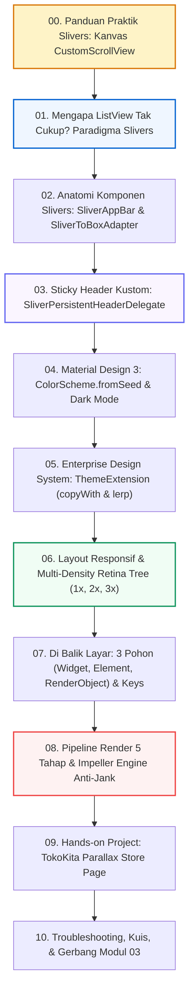
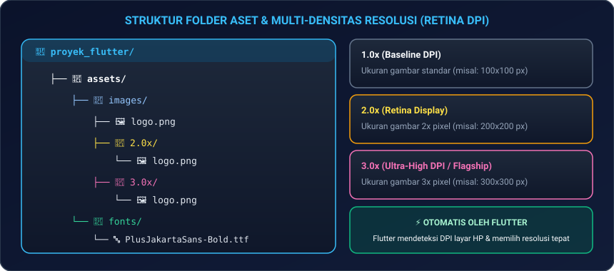
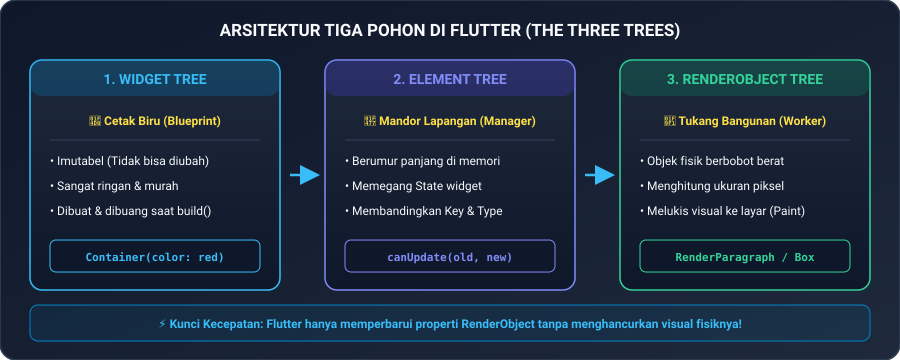
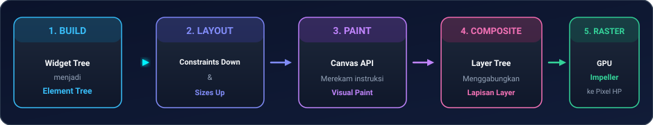

# Modul 02B: Advanced Slivers, Theming Material 3, & Arsitektur Mesin Render

Selamat datang di **Modul 02B: Advanced Slivers, Theming Material 3, & Arsitektur Mesin Render**! 

Jika pada **Modul 02A** Anda telah menguasai fondasi tata letak (*layouting*) dan daftar data gulir dasar yang ramah pemula, kini saatnya Anda melangkah lebih jauh ke standar **arsitektur antarmuka tingkat industri (*enterprise-grade*)**.

Di modul ini, kita akan membedah rahasia di balik aplikasi mobile kelas dunia seperti Spotify, Tokopedia, dan Airbnb: mulai dari **efek paralaks header yang mengecil saat digulir (Slivers)**, **sistem pewarnaan cerdas Material 3**, hingga membongkar **jeroan mesin render Flutter (Impeller Engine & Arsitektur 3 Pohon)** dengan bahasa yang tetap santai, komunikatif, dan mudah dipahami.

---

## 🧭 Peta Pembelajaran Modul 02B



---

## 🛠️ 00. Panduan Persiapan Praktik: Cara Menguji Kode Slivers

Sebelum Anda mulai menyalin contoh kode di modul ini, ada satu aturan terpenting yang wajib dipahami oleh siapa pun:

> ⚠️ **Aturan Emas Slivers**:  
> Seluruh widget keluarga **Sliver** (seperti `SliverAppBar`, `SliverList`, atau `SliverGrid`) berbicara dalam bahasa khusus (*Sliver Protocol*). Mereka **TIDAK BISA** diletakkan langsung di dalam `Column` atau `Container` biasa! Jika Anda memaksa menaruhnya di dalam `Column`, Flutter akan memunculkan pesan error merah:  
> `A RenderViewport expected a child of type RenderBox, but received a child of type RenderSliver`.

---

### Kanvas Uji Coba Aman (*Boilerplate Canvas*)
Agar Anda bisa langsung mencoba setiap potongan kode tanpa hambatan di **VS Code** maupun di **[DartPad.dev](https://dartpad.dev/flutter)**, selalu gunakan kerangka dasar berikut di file `lib/main.dart`:

```dart
import 'package:flutter/material.dart';

void main() {
  runApp(const MaterialApp(
    debugShowCheckedModeBanner: false,
    home: Scaffold(
      // KUNCI: Wadah utama seluruh keluarga Sliver adalah CustomScrollView!
      body: CustomScrollView(
        slivers: [
          /* Tempelkan potongan kode Sliver Anda di sini */
        ],
      ),
    ),
  ));
}
```

> 💡 **Jembatan Dua Bahasa**:  
> Jika Anda ingin memasukkan widget kotak biasa (seperti `Container`, `Card`, atau banner horizontal) ke dalam `CustomScrollView`, Anda wajib membungkusnya dengan widget penerjemah bernama **`SliverToBoxAdapter`**!

---

## 🌪️ 01. Mengapa ListView Biasa Tak Cukup? Paradigma Slivers

Pada Modul 02A, Anda telah belajar membuat daftar menggunakan `ListView.builder` dan `GridView.builder`. Namun, bayangkan desainer UI/UX Anda meminta halaman etalase toko dengan desain modern berikut:
1. Di bagian paling atas ada foto sampul toko yang **mengecil perlahan (*collapse*)** saat layar digulir.
2. Di bawah foto sampul, ada deretan tab kategori (*Promo*, *Terlaris*, *Ulasan*) yang **menempel di tepi atas layar (*sticky header*)** saat halaman terus digulir ke bawah.
3. Di bawah tab bar, ada bagian **Grid 2 kolom**, dilanjutkan dengan deretan ulasan pembeli dalam bentuk **List 1 kolom**, dan semuanya berada dalam **satu kesatuan scroll yang sangat mulus tanpa scrollbar ganda**.

Jika Anda mencoba menumpuk `GridView` di bawah `ListView`, Flutter akan mengalami konflik ukuran (*viewport unbounded height*) atau menghasilkan efek scroll yang tersendat (*janky*).

### Solusinya: Dunia Slivers!
Kata **"Sliver"** secara harfiah berarti *irisan*. Di Flutter, Sliver adalah bagian dari area layar yang tahu persis posisinya terhadap guliran jari pengguna. Seluruh irisan sliver dirajut bersama di dalam satu wadah utama bernama **`CustomScrollView`**.

<p align="center">
  
</p>
<p align="center"><em>Gambar 1: Komponen Utama dalam Ekosistem CustomScrollView. (Sumber: Dokumentasi Resmi Flutter - flutter.dev).</em></p>

---

## 🎛️ 02. Anatomi Komponen Slivers: SliverAppBar & SliverToBoxAdapter

Mari kita bedah dua komponen sliver yang paling sering digunakan dalam aplikasi modern:

### 1. `SliverAppBar` (Bilah Atas Cerdas & Fleksibel)
`SliverAppBar` menggantikan `AppBar` biasa dengan kemampuan animasi gulir yang sangat memukau melalui 4 pengaturan boolean:

| Properti | Efek Saat Diatur ke Nilai `true`: |
|---|---|
| **`pinned`** | Bilah AppBar tetap menempel di pucuk atas layar dan tidak akan hilang saat halaman digulir ke bawah. |
| **`floating`** | Begitu pengguna menggeser jari ke atas sedikit saja, AppBar langsung muncul kembali tanpa harus menunggu scroll sampai ke paling puncak. |
| **`snap`** | AppBar akan langsung membuka penuh secara otomatis begitu jari digeser (wajib dipadukan dengan `floating: true`). |
| **`stretch`** | Foto latar belakang akan membesar melar (*overscroll stretch*) saat layar ditarik melebihi batas atas (gaya khas aplikasi iOS). |

```dart
SliverAppBar(
  expandedHeight: 220.0,
  pinned: true,
  stretch: true,
  backgroundColor: Colors.indigo,
  flexibleSpace: FlexibleSpaceBar(
    title: const Text('Official Store 2026', style: TextStyle(fontWeight: FontWeight.bold)),
    background: Image.network(
      'https://picsum.photos/800/400',
      fit: BoxFit.cover,
    ),
    stretchModes: const [
      StretchMode.zoomBackground,
      StretchMode.blurBackground,
    ],
  ),
)
```

---

### 2. `SliverToBoxAdapter` (Jembatan Penerjemah Widget Kotak Biasa)
Widget ini berfungsi sebagai paspor penerjemah agar komponen biasa (seperti banner info berlatar warna atau kartu promo) dapat hidup berdampingan di dalam `CustomScrollView`:

```dart
SliverToBoxAdapter(
  child: Container(
    margin: const EdgeInsets.all(16),
    padding: const EdgeInsets.all(16),
    decoration: BoxDecoration(
      color: Colors.amber.shade100,
      borderRadius: BorderRadius.circular(12),
      border: Border.all(color: Colors.amber.shade400),
    ),
    child: const Row(
      children: [
        Icon(Icons.discount, color: Colors.orange),
        SizedBox(width: 12),
        Expanded(
          child: Text(
            'Gunakan kupon "HEMAT2026" untuk diskon ongkir hingga Rp 20.000!',
            style: TextStyle(fontWeight: FontWeight.w600),
          ),
        ),
      ],
    ),
  ),
)
```

---

## 📌 03. Sticky Header Kustom: SliverPersistentHeaderDelegate

Pernahkah Anda melihat tab bar kategori di aplikasi Tokopedia atau Shopee yang terus menempel di bawah AppBar saat halaman digulir? Efek tersebut dibuat menggunakan **`SliverPersistentHeader`**.

Untuk membuatnya, Anda cukup membuat kelas pendelegasi (*delegate*) yang mengimplementasikan **`SliverPersistentHeaderDelegate`**:

```dart
class TabKategoriDelegate extends SliverPersistentHeaderDelegate {
  final TabController controller;
  TabKategoriDelegate({required this.controller});

  @override
  double get minExtent => 48.0; // Tinggi minimal saat menempel di atas

  @override
  double get maxExtent => 48.0; // Tinggi maksimal saat terbuka

  @override
  Widget build(BuildContext context, double shrinkOffset, bool overlapsContent) {
    return Container(
      color: Colors.white,
      child: TabBar(
        controller: controller,
        indicatorColor: Colors.indigo,
        labelColor: Colors.indigo,
        unselectedLabelColor: Colors.grey,
        tabs: const [
          Tab(text: 'Produk Terlaris'),
          Tab(text: 'Promo Flash'),
          Tab(text: 'Ulasan Pembeli'),
        ],
      ),
    );
  }

  @override
  bool shouldRebuild(covariant TabKategoriDelegate oldDelegate) => false;
}
```

Cara memakainya di dalam `CustomScrollView`:
```dart
SliverPersistentHeader(
  pinned: true, // true = menempel di atas saat di-scroll
  delegate: TabKategoriDelegate(controller: _tabController),
)
```

---

## 🎨 04. Material Design 3 (M3): ColorScheme.fromSeed & Dark Mode

Di era Flutter 3.x ke atas, Google telah mengadopsi standar desain **Material 3 (M3)** secara penuh.

### Keajaiban `ColorScheme.fromSeed`
Dahulu, pengembang harus mendefinisikan puluhan warna secara manual (`primaryColor`, `accentColor`, `cardColor`, dll.).  
Kini, Anda cukup memberikan **1 warna benih (*seed color*)**, dan algoritma Material 3 akan secara matematis meracik seluruh palet nada warna (*tonal palettes*) yang harmonis, termasuk kontras teks yang aman bagi mata!

```dart
ThemeData buildAplikasiTheme() {
  return ThemeData(
    useMaterial3: true,
    // Cukup satu warna benih, seluruh warna tombol, kartu, dan teks otomatis serasi:
    colorScheme: ColorScheme.fromSeed(
      seedColor: const Color(0xFF4F46E5), // Indigo Modern
      brightness: Brightness.light,       // Otomatis membuat versi Light Mode
    ),
  );
}

ThemeData buildAplikasiDarkTheme() {
  return ThemeData(
    useMaterial3: true,
    colorScheme: ColorScheme.fromSeed(
      seedColor: const Color(0xFF4F46E5),
      brightness: Brightness.dark,        // Otomatis membuat versi Dark Mode
    ),
  );
}
```

---

## 🏷️ 05. Enterprise Design System: ThemeExtension (copyWith & lerp)

Apa yang terjadi jika perusahaan Anda memiliki warna khas merek sendiri (misalnya warna jingga promo khusus atau tingkat keberhasilan status badge) yang tidak tersedia di palet bawaan Material 3?

Solusi tingkat *senior engineer* adalah membuat **`ThemeExtension`**. Dengan cara ini, warna kustom Anda terikat langsung ke dalam tema aplikasi dan dapat berganti secara otomatis dengan animasi transisi halus saat berganti Dark Mode!

```dart
@immutable
class WarnaKhususToko extends ThemeExtension<WarnaKhususToko> {
  final Color? warnaBadgePromo;
  final Color? warnaStatusSukses;

  const WarnaKhususToko({
    required this.warnaBadgePromo,
    required this.warnaStatusSukses,
  });

  @override
  ThemeExtension<WarnaKhususToko> copyWith({Color? warnaBadgePromo, Color? warnaStatusSukses}) {
    return WarnaKhususToko(
      warnaBadgePromo: warnaBadgePromo ?? this.warnaBadgePromo,
      warnaStatusSukses: warnaStatusSukses ?? this.warnaStatusSukses,
    );
  }

  @override
  ThemeExtension<WarnaKhususToko> lerp(ThemeExtension<WarnaKhususToko>? other, double t) {
    if (other is! WarnaKhususToko) return this;
    return WarnaKhususToko(
      warnaBadgePromo: Color.lerp(warnaBadgePromo, other.warnaBadgePromo, t),
      warnaStatusSukses: Color.lerp(warnaStatusSukses, other.warnaStatusSukses, t),
    );
  }
}
```

### Cara Memanggilnya di Tampilan Layar:
```dart
final warnaKustom = Theme.of(context).extension<WarnaKhususToko>()!;
return Text('Promo Spesial!', style: TextStyle(color: warnaKustom.warnaBadgePromo));
```

---

## 📱 06. Layout Responsif & Multi-Density Retina Tree (1x, 2x, 3x)

Aplikasi mobile Anda akan dijalankan di berbagai perangkat, mulai dari HP murah berlayar kecil hingga tablet berlayar lebar seperti iPad Pro.

### 1. `LayoutBuilder` (Mengetahui Batas Ruang Layar)
Gunakan `LayoutBuilder` untuk memutuskan apakah tampilan harus menggunakan 2 kolom (HP) atau 4 kolom (Tablet):

```dart
Widget bangunKatalogResponsif() {
  return LayoutBuilder(
    builder: (context, constraints) {
      // Jika lebar layar lebih besar dari 600px, anggap sebagai Tablet:
      final int jumlahKolom = constraints.maxWidth > 600 ? 4 : 2;

      return GridView.builder(
        gridDelegate: SliverGridDelegateWithFixedCrossAxisCount(
          crossAxisCount: jumlahKolom,
          childAspectRatio: 0.75,
        ),
        itemCount: 12,
        itemBuilder: (context, index) => Card(child: Center(child: Text('Barang #$index'))),
      );
    },
  );
}
```

---

### 2. Multi-Density Asset Tree (Resolusi Layar Retina 1x, 2.0x, 3.0x)
Pernahkah Anda melihat logo aplikasi tampak buram atau pecah-pecah di HP flagship (seperti Samsung Galaxy S Ultra atau iPhone Pro)? Hal tersebut terjadi karena gambar tidak disediakan dalam berbagai skala kepadatan piksel (*Retina Display*).

Flutter memiliki sistem resolusi aset otomatis jika Anda mengikuti struktur folder berikut:

<p align="center">
  
</p>
<p align="center"><em>Gambar 2: Konvensi Struktur Folder Aset Multi-Densitas di Flutter. (Sumber: Dokumentasi Resmi Flutter - flutter.dev/docs).</em></p>

Di file `pubspec.yaml`, Anda **cukup mendaftarkan file 1.0x saja**:
```yaml
flutter:
  assets:
    - assets/images/logo.png
```
Flutter secara cerdas akan mendeteksi kepadatan layar HP pengguna dan otomatis memilih gambar dari folder `2.0x/` atau `3.0x/` tanpa Anda perlu menulis kode perkondisian manual!

---

## 🌲 07. Di Balik Layar: 3 Pohon di Flutter & Peran Keys

Untuk memahami mengapa Flutter bisa berjalan dengan kecepatan 120 FPS tanpa lag, Anda harus mengenal **Arsitektur Tiga Pohon**:

<p align="center">
  
</p>
<p align="center"><em>Gambar 3: Arsitektur Tiga Pohon di Flutter (Widget, Element, & RenderObject). (Sumber: Dokumentasi Arsitektur Flutter - flutter.dev).</em></p>

1. **Widget Tree (Imutabel / Cetak Biru)**:  
   Objek konfigurasi yang sangat murah dan cepat dibuat. Setiap kali `setState()` dipanggil, widget lama dibuang dan widget baru dibuat.
2. **Element Tree (Jembatan / Manajer)**:  
   Objek yang berumur panjang di memori. Ia membandingkan apakah widget baru memiliki tipe dan `Key` yang sama dengan yang lama. Jika sama, Element **tidak akan merusak tampilan fisik**, melainkan hanya memperbarui datanya saja!
3. **RenderObject Tree (Visual Nyata di Layar)**:  
   Objek yang benar-benar menghitung ukuran piksel (*layouting*) dan menggambar warna ke layar ponsel (*painting*). Ini adalah objek yang berat, sehingga Flutter berusaha sekuat tenaga untuk tidak membuatnya berulang kali.

---

### Memilih Jenis `Key` yang Tepat
Jika Anda memiliki daftar item yang bisa dihapus atau ditukar urutannya, Flutter butuh tanda pengenal unik (*Key*) agar Element Tree tidak salah mengenali data:

<p align="center">
  
</p>
<p align="center"><em>Gambar 4: Panduan Memilih Jenis Key yang Tepat di Flutter. (Sumber: Analisis Arsitektur Flutter Engine - flutter.dev).</em></p>

* **`ValueKey('item_id')`**: Pilihan standar terbaik jika data Anda memiliki ID unik dari database.
* **`UniqueKey()`**: Menghasilkan ID acak baru untuk memaksa widget mereset ulang seluruh statenya dari awal.
* **`GlobalKey<FormState>()`**: Kunci khusus untuk mengakses state anak dari luar (misalnya validasi form).

---

## ⚡ 08. Pipeline Render 5 Tahap & Impeller Engine Anti-Jank

Bagaimana setiap bingkai tampilan (*frame*) diproses hingga sampai ke mata pengguna?

<p align="center">
  
</p>
<p align="center"><em>Gambar 5: Lima Tahapan Pipeline Render Flutter dari Build hingga Rasterize. (Sumber: flutter.dev/docs).</em></p>

1. **Animate**: Memperbarui nilai interpolasi waktu animasi (misal posisi transisi 0.0 ke 1.0).
2. **Build**: Mengeksekusi method `build()` untuk menyusun pohon widget baru.
3. **Layout**: Menghitung batas ukuran fisik dengan prinsip emas: *"Constraints go down, Sizes go up, Parents set positions"*.
4. **Paint**: Merekam perintah grafis Canvas (menggambar teks, garis sudut melengkung, bayangan).
5. **Composite & Rasterize**: Menggabungkan layer visual dan mengirim instruksi GPU langsung ke chip grafis HP via **Impeller Engine**.

---

### Mengapa Impeller Engine Mengubah Segalanya?
Pada Flutter versi lama (sebelum Impeller), mesin render menggunakan *Skia*. Kelemahan Skia adalah ia mengompilasi shader GPU secara langsung di tengah-tengah pengguna sedang menggeser layar (*just-in-time runtime compilation*). Hal ini menyebabkan patah-patah singkat pada animasi pertama kali, yang dikenal dengan istilah **Shader Compilation Jank**.

**Impeller menyelesaikan masalah ini selamanya**:  
Impeller melakukan pra-kompilasi seluruh shader grafis ke dalam format biner sejak aplikasi di-build (**Ahead-Of-Time / AOT**). Hasilnya, guliran antarmuka di layar 120Hz berjalan dengan mulus tanpa hambatan jank!

---

## 💻 09. Hands-on Project: TokoKita E-Commerce Parallax Store Page

Mari satukan seluruh konsep tingkat lanjut ini (`CustomScrollView`, `SliverAppBar` paralaks, `SliverPersistentHeader` sticky tabs, `SliverToBoxAdapter`, dan `SliverGrid`) ke dalam satu halaman toko e-commerce enterprise!

### Kode Lengkap Mandiri (*Self-Contained Runnable Code*):
Salin seluruh kode ini ke file `lib/main.dart` Anda (atau coba langsung di **DartPad**):

```dart
import 'package:flutter/material.dart';

void main() {
  runApp(const TokoKitaEnterpriseApp());
}

class TokoKitaEnterpriseApp extends StatelessWidget {
  const TokoKitaEnterpriseApp({super.key});

  @override
  Widget build(BuildContext context) {
    return MaterialApp(
      debugShowCheckedModeBanner: false,
      theme: ThemeData(
        useMaterial3: true,
        colorScheme: ColorScheme.fromSeed(
          seedColor: const Color(0xFF4338CA), // Deep Indigo
          brightness: Brightness.light,
        ),
      ),
      home: const TokoKitaStoreDetailPage(),
    );
  }
}

class TokoKitaStoreDetailPage extends StatefulWidget {
  const TokoKitaStoreDetailPage({super.key});

  @override
  State<TokoKitaStoreDetailPage> createState() => _TokoKitaStoreDetailPageState();
}

class _TokoKitaStoreDetailPageState extends State<TokoKitaStoreDetailPage>
    with SingleTickerProviderStateMixin {
  late final TabController _tabController;

  @override
  void initState() {
    super.initState();
    _tabController = TabController(length: 3, vsync: this);
  }

  @override
  void dispose() {
    _tabController.dispose();
    super.dispose();
  }

  @override
  Widget build(BuildContext context) {
    return Scaffold(
      backgroundColor: const Color(0xFFF8FAFC),
      body: CustomScrollView(
        physics: const BouncingScrollPhysics(),
        slivers: [
          // 1. SLIVER APPBAR (Parallax + Stretch + Pinned)
          SliverAppBar(
            expandedHeight: 220.0,
            pinned: true,
            stretch: true,
            backgroundColor: const Color(0xFF4338CA),
            foregroundColor: Colors.white,
            flexibleSpace: FlexibleSpaceBar(
              title: const Text('Mega Gadget Store 2026', style: TextStyle(fontWeight: FontWeight.bold, fontSize: 16)),
              background: Image.network(
                'https://picsum.photos/800/400',
                fit: BoxFit.cover,
              ),
              stretchModes: const [
                StretchMode.zoomBackground,
                StretchMode.blurBackground,
              ],
            ),
            actions: [
              IconButton(icon: const Icon(Icons.share), onPressed: () {}),
              IconButton(icon: const Icon(Icons.search), onPressed: () {}),
            ],
          ),

          // 2. SLIVER TO BOX ADAPTER (Banner Info Toko)
          SliverToBoxAdapter(
            child: Container(
              margin: const EdgeInsets.all(16),
              padding: const EdgeInsets.all(16),
              decoration: BoxDecoration(
                color: Colors.white,
                borderRadius: BorderRadius.circular(16),
                border: Border.all(color: const Color(0xFFE2E8F0)),
              ),
              child: const Row(
                children: [
                  CircleAvatar(radius: 24, backgroundColor: Color(0xFF4338CA), child: Icon(Icons.verified, color: Colors.white)),
                  SizedBox(width: 14),
                  Expanded(
                    child: Column(
                      crossAxisAlignment: CrossAxisAlignment.start,
                      children: [
                        Text('Toko Resmi Terverifikasi ⭐ 4.9', style: TextStyle(fontWeight: FontWeight.bold, fontSize: 15)),
                        SizedBox(height: 4),
                        Text('Rating 99% Positif • Pengiriman Cepat 24 Jam', style: TextStyle(color: Colors.grey, fontSize: 12)),
                      ],
                    ),
                  ),
                ],
              ),
            ),
          ),

          // 3. SLIVER PERSISTENT HEADER (Sticky Tab Bar Kategori)
          SliverPersistentHeader(
            pinned: true,
            delegate: _KategoriTabDelegate(controller: _tabController),
          ),

          // 4. SLIVER GRID (Katalog Produk 2 Kolom)
          SliverPadding(
            padding: const EdgeInsets.all(16),
            sliver: SliverGrid(
              gridDelegate: const SliverGridDelegateWithFixedCrossAxisCount(
                crossAxisCount: 2,
                crossAxisSpacing: 12,
                mainAxisSpacing: 12,
                childAspectRatio: 0.8,
              ),
              delegate: SliverChildBuilderDelegate(
                (context, index) {
                  return Container(
                    decoration: BoxDecoration(
                      color: Colors.white,
                      borderRadius: BorderRadius.circular(12),
                      border: Border.all(color: const Color(0xFFE2E8F0)),
                    ),
                    child: Column(
                      crossAxisAlignment: CrossAxisAlignment.start,
                      children: [
                        Expanded(
                          child: Container(
                            decoration: BoxDecoration(
                              color: Colors.indigo.shade50,
                              borderRadius: const BorderRadius.vertical(top: Radius.circular(12)),
                            ),
                            child: const Center(child: Icon(Icons.devices, size: 40, color: Color(0xFF4338CA))),
                          ),
                        ),
                        Padding(
                          padding: const EdgeInsets.all(10.0),
                          child: Column(
                            crossAxisAlignment: CrossAxisAlignment.start,
                            children: [
                              Text('Gadget Pro #$index', style: const TextStyle(fontWeight: FontWeight.bold, fontSize: 13)),
                              const SizedBox(height: 4),
                              const Text('Rp 1.299.000', style: TextStyle(color: Color(0xFF4338CA), fontWeight: FontWeight.bold)),
                            ],
                          ),
                        ),
                      ],
                    ),
                  );
                },
                childCount: 8,
              ),
            ),
          ),
        ],
      ),
    );
  }
}

class _KategoriTabDelegate extends SliverPersistentHeaderDelegate {
  final TabController controller;
  _KategoriTabDelegate({required this.controller});

  @override
  double get minExtent => 46.0;

  @override
  double get maxExtent => 46.0;

  @override
  Widget build(BuildContext context, double shrinkOffset, bool overlapsContent) {
    return Container(
      color: Colors.white,
      child: TabBar(
        controller: controller,
        labelColor: const Color(0xFF4338CA),
        unselectedLabelColor: Colors.grey,
        indicatorColor: const Color(0xFF4338CA),
        indicatorWeight: 3,
        tabs: const [
          Tab(text: 'Semua Produk'),
          Tab(text: 'Flash Sale 🔥'),
          Tab(text: 'Ulasan (1.2rb)'),
        ],
      ),
    );
  }

  @override
  bool shouldRebuild(covariant _KategoriTabDelegate oldDelegate) => false;
}
```

---

## ⚠️ 10. 5 Jebakan Fatal Tingkat Lanjut & Solusi Kilat

| No | Jebakan Tingkat Lanjut | Pesan Kesalahan / Gejala | Solusi yang Benar |
|---|---|---|---|
| **1** | **Menaruh Sliver di dalam Column** | Error: *"RenderViewport expected a child of type RenderBox..."* | Seluruh keluarga Sliver wajib dimasukkan ke dalam `CustomScrollView.slivers`. |
| **2** | **Menaruh Widget Biasa di CustomScrollView** | Error: *"A RenderViewport expected a child of type RenderSliver..."* | Bungkus widget kotak biasa Anda dengan `SliverToBoxAdapter(child: ...)`. |
| **3** | **Lupa Mendefinisikan minExtent & maxExtent** | Header sticky tidak mau mengecil atau crash saat di-scroll. | Berikan nilai ketinggian pasti pada getter `minExtent` dan `maxExtent`. |
| **4** | **Re-render Berulang Tanpa Batas** | Animasi patah-patah saat scroll halaman panjang. | Pisahkan widget yang sering berganti ke dalam sub-widget mandiri atau gunakan `RepaintBoundary`. |
| **5** | **Gambar Buram di Layar Retina** | Logo terlihat pecah di HP layar beresolusi tinggi. | Buat struktur sub-folder `2.0x/` dan `3.0x/` di dalam folder `assets/images/`. |

### 🛠️ Cara Membuka Flutter DevTools untuk Profiling di VS Code
Untuk membuktikan bahwa antarmuka Slivers dan animasi Anda berjalan mulus di 60/120 FPS tanpa *jank*:
1. Jalankan aplikasi Anda di emulator atau HP fisik (`F5` atau `flutter run`).
2. Tekan kombinasi tombol **`Ctrl + Shift + P`** (atau `Cmd + Shift + P` di macOS) di VS Code.
3. Ketik dan pilih: **`Flutter: Open DevTools`** (pilih untuk dibuka di browser atau panel terintegrasi VS Code).
4. **Tab Performance**: Perhatikan diagram batang rendering frame GPU. Pastikan warna batang selalu berada di bawah garis horizontal **16.6ms** (indikator 60 FPS) atau **8.3ms** (indikator 120 FPS).
5. **Tab Widget Inspector**: Aktifkan fitur *Select Widget Mode*, lalu sentuh salah satu komponen pada layar HP untuk melihat langsung struktur hierarki *Widget*, *Element*, dan data dimensi *RenderObject*-nya secara visual!

---

## 📝 11. Kuis Pemahaman Modul 02B

1. **Apa perbedaan mendasar antara `ListView` biasa dan `CustomScrollView`?**  
   *Jawaban:* `ListView` hanya mampu menampilkan daftar satu dimensi yang homogen. Sebaliknya, `CustomScrollView` adalah orkestrator tingkat lanjut yang dapat menggabungkan header paralaks mengecil (`SliverAppBar`), sticky tabs (`SliverPersistentHeader`), kotak banner biasa (`SliverToBoxAdapter`), serta grid dan list ke dalam satu guliran mulus terpadu.
2. **Apa yang dilakukan oleh `ColorScheme.fromSeed` di Material 3?**  
   *Jawaban:* Algoritma Material 3 secara matematis menghasilkan seluruh palet warna harmonis (Light dan Dark Mode) hanya dengan menerima satu warna dasar (*seed color*).
3. **Bagaimana Impeller Engine melenyapkan fenomena "Shader Compilation Jank"?**  
   *Jawaban:* Impeller melakukan pra-kompilasi seluruh shader GPU secara AOT (*Ahead-Of-Time*) pada saat build aplikasi, bukan mengompilasinya secara mendadak (*Just-In-Time*) saat layar pertama kali beranimasi.

---

## 🎯 12. Checklist Kelulusan Kompetensi Modul 02B

Tandai penguasaan Anda sebelum melangkah ke modul navigasi:
- [x] Menguasai filosofi Slivers dan cara kerja `CustomScrollView`.
- [x] Mahir mengonfigurasi `SliverAppBar` dengan efek `pinned`, `floating`, `snap`, dan `stretch`.
- [x] Mampu membuat sticky category tab bar menggunakan `SliverPersistentHeaderDelegate`.
- [x] Memahami cara menyisipkan widget biasa menggunakan `SliverToBoxAdapter`.
- [x] Menguasai sistem pewarnaan otomatis Material 3 via `ColorScheme.fromSeed`.
- [x] Mampu membuat token brand khusus enterprise via `ThemeExtension`.
- [x] Menguasai desain responsif `LayoutBuilder` dan struktur folder Retina `1x`, `2.0x`, `3.0x`.
- [x] Memahami arsitektur internal 3 Pohon di Flutter (*Widget*, *Element*, *RenderObject*).
- [x] Memahami pipeline render 5 tahap dan keunggulan anti-jank dari **Impeller Engine**.
- [x] Berhasil menjalankan dan memahami kode aplikasi **TokoKita Parallax Store Page**.

---

👉 **Langkah Selanjutnya**: Selamat! Anda telah menyelesaikan seluruh fase penguasaan antarmuka visual Flutter dari tingkat dasar hingga tingkat arsitektur mesin render! Kini Anda sudah sangat siap melangkah ke:  
**[Modul 03: Navigasi Deklaratif (go_router), Deep Linking, & Form System](../modul-03-routing-dan-form/README.md)**!
