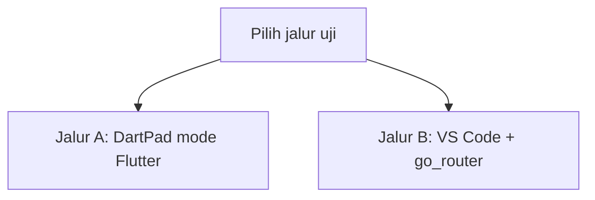
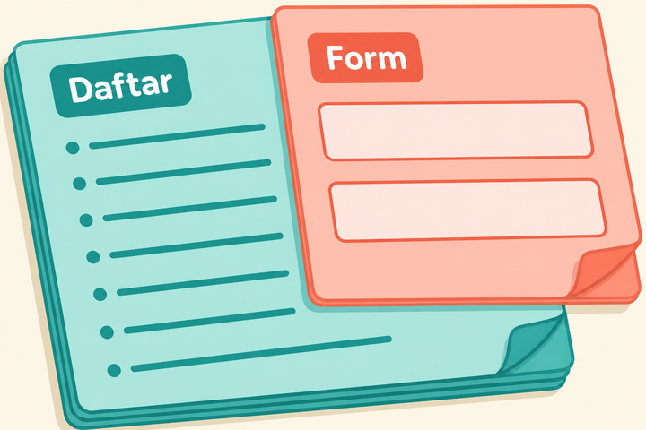
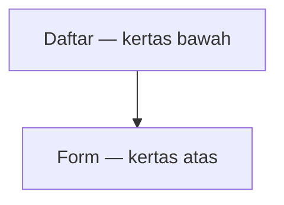
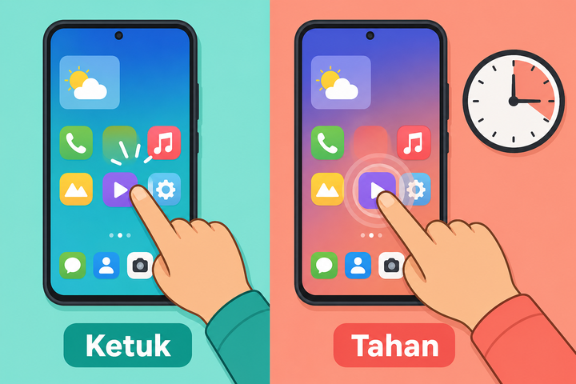
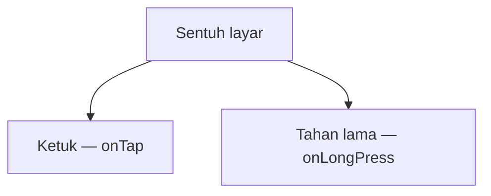

# Modul 03 — Interaksi, form, dan pindah halaman

**Waktu:** 2 sesi  
**Prasyarat:** Modul 00–02.  
**Hasil:** Nanti Anda bisa merakit formulir, tampilkan dialog, dan pindah halaman dengan `go_router`.

---

## Buka alat ini dulu

Ada **dua jalur uji**. Jangan sampai tertukar.

| Jalur | Buka | Untuk apa |
| --- | --- | --- |
| A | Browser → [dartpad.dev](https://dartpad.dev) → mode **Flutter** | Gesture, form, dialog, `Navigator.push` |
| B | VS Code + Terminal (`Ctrl + J`) + emulator/HP | `go_router`, `PopScope` di rute paket, mini proyek |




Sumber gambar: [dart.dev/tools/dartpad](https://dart.dev/tools/dartpad), Dart team / Google ([CC BY 4.0](https://creativecommons.org/licenses/by/4.0/)). Foto resmi itu **tema gelap** dan **mode Dart**. Kalau kelihatan seperti kotak hitam, gulir sampai editor kiri dan tombol **Run** terlihat; itu bukan gambar rusak. Untuk modul ini pilih mode **Flutter** supaya panel kanan jadi **layar aplikasi**.

Paket `go_router` **tidak** ada di daftar paket DartPad ([Package and plugin support](https://github.com/dart-lang/dart-pad/wiki/Package-and-plugin-support)). Jangan tempel `import 'package:go_router/go_router.dart'` di DartPad.

### Dua jenis kode di halaman ini

| Jenis | Tanda | Caranya |
| --- | --- | --- |
| **Berkas lengkap** | Ada `import` dan `void main()` | Tempel utuh, lalu **Run** |
| **Cuplikan** | Hanya potongan | Jangan di-Run sendirian |

### Pola uji A — DartPad Flutter

| | |
| --- | --- |
| **Buka** | [dartpad.dev](https://dartpad.dev) |
| **Pilih** | mode **Flutter** |
| **Tempel** | **berkas lengkap** |
| **Klik** | **Run** |
| **Kalau berhasil** | panel kanan menampilkan pratinjau aplikasi, bukan error merah |

### Pola uji B — proyek lokal

| | |
| --- | --- |
| **Buka** | VS Code di folder proyek Flutter, emulator atau HP sudah menyala |
| **Terminal** | `Ctrl + J` |
| **Ketik** | `flutter pub add go_router` lalu `flutter run` |
| **Kalau berhasil** | `pubspec.yaml` memuat `go_router`; app terbuka di emulator atau HP |

> **Aturan emas:** perintah `flutter ...` hanya di **Terminal VS Code**.

---

## 1. Halaman bertumpuk, bukan “ganti file ajaib”

Analogi: tumpukan kertas. Halaman baru diletakkan **di atas**. Tombol kembali mengangkat kertas paling atas.



*Ilustrasi asli materi mobile2026. Form menumpuk di atas Daftar (push). Tombol kembali mengangkat Form (pop). Penjelasan ada di teks.*



Di Flutter SDK, satu “kertas” disebut **route**. `Navigator` menjaga tumpukannya. `go_router` mengatur tumpukan itu lewat URL (`/`, `/tambah`).

Sumber konsep: [Navigation and routing](https://docs.flutter.dev/ui/navigation). Flutter and the related logo are trademarks of Google LLC.

Dokumentasi Flutter sendiri bilang: untuk app baru, jangan pakai `Navigator.pushNamed` + `MaterialApp.routes`. Mulai sini kita pakai **`go_router`**.

---

## 2. Gesture: InkWell vs GestureDetector

| Widget | Kegunaan |
| --- | --- |
| `InkWell` | ketuk dengan riak tinta; butuh widget `Material` di atasnya |
| `GestureDetector` | ketuk, tahan lama, geser; tanpa riak |



*Ilustrasi asli materi mobile2026. Ketuk sebentar (`onTap`) vs tahan lama (`onLongPress`). Penjelasan ada di teks.*



### Uji 2 — ketuk dan tahan

| | |
| --- | --- |
| **Buka** | DartPad, mode Flutter |
| **Tempel** | berkas lengkap |
| **Klik** | **Run**, lalu ketuk kartu dan tahan lama |
| **Kalau berhasil** | muncul SnackBar berbeda untuk ketuk dan tahan lama |

```dart
import 'package:flutter/material.dart';

void main() => runApp(const MateriApp());

class MateriApp extends StatelessWidget {
  const MateriApp({super.key});

  @override
  Widget build(BuildContext context) {
    return const MaterialApp(home: GesturePage());
  }
}

class GesturePage extends StatelessWidget {
  const GesturePage({super.key});

  @override
  Widget build(BuildContext context) {
    return Scaffold(
      appBar: AppBar(title: const Text('Gesture')),
      body: Center(
        child: Card(
          child: InkWell(
            onTap: () {
              ScaffoldMessenger.of(context).showSnackBar(
                const SnackBar(content: Text('Ketuk singkat')),
              );
            },
            onLongPress: () {
              ScaffoldMessenger.of(context).showSnackBar(
                const SnackBar(content: Text('Tahan lama')),
              );
            },
            child: const Padding(
              padding: EdgeInsets.all(24),
              child: Text('Ketuk atau tahan di sini'),
            ),
          ),
        ),
      ),
    );
  }
}
```

**Kalau berhasil:** muncul SnackBar berbeda untuk ketuk dan tahan lama.

Geser untuk menghapus memakai `Dismissible` di bagian 7. Jangan menulis deteksi geser sendiri jika pola daftar sudah cukup.

---

## 3. Form, validasi, dan keyboard

`Form` + `GlobalKey<FormState>` = satu tombol memeriksa semua isian. `TextFormField` punya `validator`.

Bungkus form dengan `SingleChildScrollView` supaya keyboard tidak memicu overflow kuning-hitam (Modul 02).

### Uji 3 — validasi judul catatan

| | |
| --- | --- |
| **Buka** | DartPad, mode Flutter |
| **Tempel** | berkas lengkap |
| **Klik** | **Run**, ketuk **Simpan** saat kolom kosong, lalu isi teks dan Simpan lagi |
| **Kalau berhasil** | kolom kosong menolak Simpan; setelah diisi, Simpan berhasil |

```dart
import 'package:flutter/material.dart';

void main() => runApp(const MateriApp());

class MateriApp extends StatelessWidget {
  const MateriApp({super.key});

  @override
  Widget build(BuildContext context) {
    return const MaterialApp(home: FormValidasiPage());
  }
}

class FormValidasiPage extends StatefulWidget {
  const FormValidasiPage({super.key});

  @override
  State<FormValidasiPage> createState() => _FormValidasiPageState();
}

class _FormValidasiPageState extends State<FormValidasiPage> {
  final _formKey = GlobalKey<FormState>();

  @override
  Widget build(BuildContext context) {
    return Scaffold(
      appBar: AppBar(title: const Text('Form')),
      body: SafeArea(
        child: SingleChildScrollView(
          padding: const EdgeInsets.all(16),
          child: Form(
            key: _formKey,
            child: Column(
              children: [
                TextFormField(
                  decoration: const InputDecoration(
                    labelText: 'Judul catatan',
                    border: OutlineInputBorder(),
                  ),
                  validator: (value) {
                    if (value == null || value.trim().isEmpty) {
                      return 'Judul wajib diisi';
                    }
                    return null;
                  },
                ),
                const SizedBox(height: 16),
                FilledButton(
                  onPressed: () {
                    if (_formKey.currentState!.validate()) {
                      ScaffoldMessenger.of(context).showSnackBar(
                        const SnackBar(content: Text('Judul sah')),
                      );
                    }
                  },
                  child: const Text('Simpan'),
                ),
              ],
            ),
          ),
        ),
      ),
    );
  }
}
```

Sumber pola: [Build a form with validation](https://docs.flutter.dev/cookbook/forms/validation).

`keyboardType: TextInputType.emailAddress` mengubah papan tombol. Untuk angka, lihat bagian 6.

---

## 4. Dropdown, Checkbox, Switch, DatePicker, TimePicker

Widget ini sering terlewat, padahal hampir setiap aplikasi sungguhan memakainya.

### Uji 4 — satu halaman, lima kontrol

| | |
| --- | --- |
| **Buka** | DartPad, mode Flutter |
| **Tempel** | berkas lengkap |
| **Klik** | **Run**, ubah setiap kontrol |
| **Kalau berhasil** | dropdown, centang, sakelar, tanggal, dan jam berubah di layar |

```dart
import 'package:flutter/material.dart';

void main() => runApp(const MateriApp());

class MateriApp extends StatelessWidget {
  const MateriApp({super.key});

  @override
  Widget build(BuildContext context) {
    return const MaterialApp(home: KontrolFormPage());
  }
}

class KontrolFormPage extends StatefulWidget {
  const KontrolFormPage({super.key});

  @override
  State<KontrolFormPage> createState() => _KontrolFormPageState();
}

class _KontrolFormPageState extends State<KontrolFormPage> {
  String kategori = 'kerja';
  bool penting = false;
  bool pengingat = true;
  DateTime tanggal = DateTime.now();
  TimeOfDay jam = TimeOfDay.now();

  @override
  Widget build(BuildContext context) {
    return Scaffold(
      appBar: AppBar(title: const Text('Kontrol form')),
      body: SafeArea(
        child: ListView(
          padding: const EdgeInsets.all(16),
          children: [
            DropdownMenu<String>(
              initialSelection: kategori,
              label: const Text('Kategori'),
              dropdownMenuEntries: const [
                DropdownMenuEntry(value: 'kerja', label: 'Kerja'),
                DropdownMenuEntry(value: 'rumah', label: 'Rumah'),
              ],
              onSelected: (value) {
                if (value != null) setState(() => kategori = value);
              },
            ),
            CheckboxListTile(
              title: const Text('Penting'),
              value: penting,
              onChanged: (value) => setState(() => penting = value ?? false),
            ),
            SwitchListTile(
              title: const Text('Pengingat'),
              value: pengingat,
              onChanged: (value) => setState(() => pengingat = value),
            ),
            ListTile(
              title: Text('Tanggal: ${tanggal.day}/${tanggal.month}/${tanggal.year}'),
              trailing: const Icon(Icons.calendar_today),
              onTap: () async {
                final pilih = await showDatePicker(
                  context: context,
                  initialDate: tanggal,
                  firstDate: DateTime(2020),
                  lastDate: DateTime(2035),
                );
                if (pilih != null) setState(() => tanggal = pilih);
              },
            ),
            ListTile(
              title: Text('Jam: ${jam.format(context)}'),
              trailing: const Icon(Icons.schedule),
              onTap: () async {
                final pilih = await showTimePicker(
                  context: context,
                  initialTime: jam,
                );
                if (pilih != null) setState(() => jam = pilih);
              },
            ),
          ],
        ),
      ),
    );
  }
}
```

`showDatePicker` / `showTimePicker` mengembalikan `null` kalau dibatalkan. Periksa `null` sebelum `setState`.

---

## 5. FocusNode: pindah ke kolom berikutnya

Tombol **Berikutnya** di keyboard memindahkan kursor, bukan menyimpan.

### Uji 5

| | |
| --- | --- |
| **Buka** | DartPad, mode Flutter |
| **Tempel** | berkas lengkap |
| **Klik** | **Run**, isi kolom pertama, ketuk **Berikutnya** di keyboard |
| **Kalau berhasil** | kursor pindah ke kolom berikutnya |

```dart
import 'package:flutter/material.dart';

void main() => runApp(const MateriApp());

class MateriApp extends StatelessWidget {
  const MateriApp({super.key});

  @override
  Widget build(BuildContext context) {
    return const MaterialApp(home: FokusPage());
  }
}

class FokusPage extends StatefulWidget {
  const FokusPage({super.key});

  @override
  State<FokusPage> createState() => _FokusPageState();
}

class _FokusPageState extends State<FokusPage> {
  final fokusJudul = FocusNode();
  final fokusIsi = FocusNode();

  @override
  void dispose() {
    fokusJudul.dispose();
    fokusIsi.dispose();
    super.dispose();
  }

  @override
  Widget build(BuildContext context) {
    return Scaffold(
      appBar: AppBar(title: const Text('FocusNode')),
      body: Padding(
        padding: const EdgeInsets.all(16),
        child: Column(
          children: [
            TextField(
              focusNode: fokusJudul,
              textInputAction: TextInputAction.next,
              decoration: const InputDecoration(labelText: 'Judul'),
              onSubmitted: (_) => fokusIsi.requestFocus(),
            ),
            TextField(
              focusNode: fokusIsi,
              textInputAction: TextInputAction.done,
              decoration: const InputDecoration(labelText: 'Isi'),
              onSubmitted: (_) => fokusIsi.unfocus(),
            ),
          ],
        ),
      ),
    );
  }
}
```

Setiap `FocusNode` yang Anda buat sendiri wajib `dispose`. Kalau tidak, terjadi kebocoran memori.

---

## 6. TextInputFormatter: saring ketikan

Kolom nomor HP tidak boleh menerima huruf.

### Uji 6

| | |
| --- | --- |
| **Buka** | DartPad, mode Flutter |
| **Tempel** | berkas lengkap |
| **Klik** | **Run**, coba ketik huruf di kolom |
| **Kalau berhasil** | huruf tidak masuk; hanya angka |

```dart
import 'package:flutter/material.dart';
import 'package:flutter/services.dart';

void main() => runApp(const MateriApp());

class MateriApp extends StatelessWidget {
  const MateriApp({super.key});

  @override
  Widget build(BuildContext context) {
    return MaterialApp(
      home: Scaffold(
        appBar: AppBar(title: const Text('Formatter')),
        body: Padding(
          padding: const EdgeInsets.all(16),
          child: TextField(
            keyboardType: TextInputType.number,
            inputFormatters: [
              FilteringTextInputFormatter.digitsOnly,
              LengthLimitingTextInputFormatter(12),
            ],
            decoration: const InputDecoration(
              labelText: 'Nomor HP (angka saja)',
              border: OutlineInputBorder(),
            ),
          ),
        ),
      ),
    );
  }
}
```

Huruf tidak masuk. Itu sengaja. Validasi (`validator`) memeriksa **setelah** ketik; formatter menyaring **saat** ketik.

---

## 7. Dialog, SnackBar, BottomSheet, Dismissible

Cara aplikasi “berbicara” tanpa pindah halaman.

| Alat | Kapan |
| --- | --- |
| `SnackBar` | pesan singkat di bawah |
| `showDialog` | keputusan (Ya / Batal) |
| `showModalBottomSheet` | pilihan tambahan |
| `Dismissible` | geser baris untuk hapus |

### Uji 7 — geser untuk hapus

| | |
| --- | --- |
| **Buka** | DartPad, mode Flutter |
| **Tempel** | berkas lengkap |
| **Klik** | **Run**, geser sebuah baris ke kiri |
| **Kalau berhasil** | baris hilang dari daftar |

```dart
import 'package:flutter/material.dart';

void main() => runApp(const MateriApp());

class MateriApp extends StatelessWidget {
  const MateriApp({super.key});

  @override
  Widget build(BuildContext context) {
    return const MaterialApp(home: DaftarGeserPage());
  }
}

class DaftarGeserPage extends StatefulWidget {
  const DaftarGeserPage({super.key});

  @override
  State<DaftarGeserPage> createState() => _DaftarGeserPageState();
}

class _DaftarGeserPageState extends State<DaftarGeserPage> {
  final items = ['Beli beras', 'Panggil Siti', 'Bayar listrik'];

  @override
  Widget build(BuildContext context) {
    return Scaffold(
      appBar: AppBar(title: const Text('Geser untuk hapus')),
      body: ListView.builder(
        itemCount: items.length,
        itemBuilder: (context, index) {
          final teks = items[index];
          return Dismissible(
            key: ValueKey(teks),
            background: Container(color: Colors.red),
            onDismissed: (_) {
              setState(() => items.removeAt(index));
              ScaffoldMessenger.of(context).showSnackBar(
                SnackBar(content: Text('Dihapus: $teks')),
              );
            },
            child: ListTile(title: Text(teks)),
          );
        },
      ),
    );
  }
}
```

`ValueKey` wajib unik. Jangan memakai indeks jika baris bisa dihapus (Modul 02).

Cuplikan dialog (tempel di dalam `onPressed`, bukan di-Run sendirian):

```dart
final ok = await showDialog<bool>(
  context: context,
  builder: (context) => AlertDialog(
    title: const Text('Hapus?'),
    actions: [
      TextButton(onPressed: () => Navigator.pop(context, false), child: const Text('Batal')),
      FilledButton(onPressed: () => Navigator.pop(context, true), child: const Text('Hapus')),
    ],
  ),
);
```

---

## 8. Navigator: konsep tumpukan (jalur A)

Sebelum `go_router`, rasakan `push` dan `pop` di DartPad.

### Uji 8 — dua halaman

| | |
| --- | --- |
| **Buka** | DartPad, mode Flutter |
| **Tempel** | berkas lengkap |
| **Klik** | **Run**, buka halaman kedua, lalu kembali |
| **Kalau berhasil** | halaman kedua menumpuk; kembali mengangkatnya |

```dart
import 'package:flutter/material.dart';

void main() => runApp(const MaterialApp(home: HalamanDaftar()));

class HalamanDaftar extends StatelessWidget {
  const HalamanDaftar({super.key});

  @override
  Widget build(BuildContext context) {
    return Scaffold(
      appBar: AppBar(title: const Text('Daftar')),
      body: Center(
        child: FilledButton(
          onPressed: () {
            Navigator.of(context).push(
              MaterialPageRoute<void>(
                builder: (context) => const HalamanForm(),
              ),
            );
          },
          child: const Text('Buka form'),
        ),
      ),
    );
  }
}

class HalamanForm extends StatelessWidget {
  const HalamanForm({super.key});

  @override
  Widget build(BuildContext context) {
    return Scaffold(
      appBar: AppBar(title: const Text('Form')),
      body: Center(
        child: OutlinedButton(
          onPressed: () => Navigator.of(context).pop(),
          child: const Text('Kembali'),
        ),
      ),
    );
  }
}
```

Sumber: [Navigate to a new screen and back](https://docs.flutter.dev/cookbook/navigation/navigation-basics).

Kirim data: `Navigator.pop(context, 'isi yang dikembalikan')` lalu `final hasil = await Navigator.push<String>(...)`.

---

## 9. go_router — hanya jalur B

Dari sini sampai Modul 11, kita pakai `go_router`: URL-nya jelas, tombol kembali Android jalan, tautan yang membuka layar tertentu (deep link) menyusul.

| | |
| --- | --- |
| **Buka** | Terminal VS Code, folder proyek |
| **Ketik** | perintah di bawah |
| **Kalau berhasil** | `pubspec.yaml` memuat `go_router` |

```powershell
flutter pub add go_router
```

**Kalau berhasil:** `pubspec.yaml` memuat `go_router`.

Berkas lengkap (jalur B — tempel ke `lib/main.dart`, **jangan** di-Run di DartPad):

```dart
import 'package:flutter/material.dart';
import 'package:go_router/go_router.dart';

void main() => runApp(MateriApp());

class MateriApp extends StatelessWidget {
  MateriApp({super.key});

  final router = GoRouter(
    routes: [
      GoRoute(
        path: '/',
        builder: (context, state) => const HalamanDaftar(),
        routes: [
          GoRoute(
            path: 'tambah',
            builder: (context, state) => const HalamanForm(),
          ),
          GoRoute(
            path: 'detail/:id',
            builder: (context, state) {
              final id = state.pathParameters['id']!;
              return HalamanDetail(id: id);
            },
          ),
        ],
      ),
    ],
  );

  @override
  Widget build(BuildContext context) {
    return MaterialApp.router(routerConfig: router);
  }
}

class HalamanDaftar extends StatelessWidget {
  const HalamanDaftar({super.key});

  @override
  Widget build(BuildContext context) {
    return Scaffold(
      appBar: AppBar(title: const Text('Catatan')),
      floatingActionButton: FloatingActionButton(
        onPressed: () => context.push('/tambah'),
        child: const Icon(Icons.add),
      ),
      body: ListTile(
        title: const Text('Catatan 42'),
        onTap: () => context.push('/detail/42'),
      ),
    );
  }
}

class HalamanForm extends StatelessWidget {
  const HalamanForm({super.key});

  @override
  Widget build(BuildContext context) {
    return Scaffold(
      appBar: AppBar(title: const Text('Tambah')),
      body: Center(
        child: FilledButton(
          onPressed: () => context.pop(),
          child: const Text('Selesai'),
        ),
      ),
    );
  }
}

class HalamanDetail extends StatelessWidget {
  const HalamanDetail({required this.id, super.key});

  final String id;

  @override
  Widget build(BuildContext context) {
    return Scaffold(
      appBar: AppBar(title: Text('Detail $id')),
      body: Center(child: Text('id lewat URL: $id')),
    );
  }
}
```

| Perintah | Artinya |
| --- | --- |
| `context.go('/x')` | ganti tumpukan ke URL itu |
| `context.push('/x')` | taruh halaman baru di atas |
| `context.pop()` | angkat halaman paling atas |

Anak rute `'tambah'` di bawah `'/'` menghasilkan URL `/tambah`. Parameter `:id` dibaca dari `state.pathParameters`.

Objek rumit (bukan sekadar id) boleh lewat `extra`, lalu diambil dengan `state.extra`. Jangan menyimpan objek besar di URL.

Sumber: [pub.dev/packages/go_router](https://pub.dev/packages/go_router) dan [Navigation topic](https://pub.dev/documentation/go_router/latest/topics/Navigation-topic.html).

---

## 10. PopScope dan tombol kembali Android

`WillPopScope` sudah usang. Ganti **`PopScope`**.

Di DartPad (`Navigator.push`), `PopScope` bisa menahan keluar dari form. Ketuk panah kembali di AppBar (bukan tombol sistem HP).

### Uji 10 — tahan keluar form

| | |
| --- | --- |
| **Buka** | DartPad, mode Flutter |
| **Tempel** | berkas lengkap |
| **Klik** | **Run**, buka form, lalu ketuk panah kembali di AppBar |
| **Kalau berhasil** | dialog muncul; halaman tertutup hanya setelah **Buang** |

```dart
import 'package:flutter/material.dart';

void main() => runApp(const MateriApp());

class MateriApp extends StatelessWidget {
  const MateriApp({super.key});

  @override
  Widget build(BuildContext context) {
    return const MaterialApp(home: HalamanDaftar());
  }
}

class HalamanDaftar extends StatelessWidget {
  const HalamanDaftar({super.key});

  @override
  Widget build(BuildContext context) {
    return Scaffold(
      appBar: AppBar(title: const Text('Daftar')),
      body: Center(
        child: FilledButton(
          onPressed: () {
            Navigator.of(context).push(
              MaterialPageRoute<void>(
                builder: (context) => const HalamanForm(),
              ),
            );
          },
          child: const Text('Buka form'),
        ),
      ),
    );
  }
}

class HalamanForm extends StatelessWidget {
  const HalamanForm({super.key});

  @override
  Widget build(BuildContext context) {
    return PopScope(
      canPop: false,
      onPopInvokedWithResult: (didPop, result) async {
        if (didPop) return;
        final keluar = await showDialog<bool>(
          context: context,
          builder: (context) => AlertDialog(
            title: const Text('Buang isian?'),
            actions: [
              TextButton(
                onPressed: () => Navigator.pop(context, false),
                child: const Text('Tetap'),
              ),
              FilledButton(
                onPressed: () => Navigator.pop(context, true),
                child: const Text('Buang'),
              ),
            ],
          ),
        );
        if (keluar == true && context.mounted) {
          Navigator.of(context).pop();
        }
      },
      child: Scaffold(
        appBar: AppBar(title: const Text('Form')),
        body: const Center(child: Text('Isi form, lalu ketuk kembali')),
      ),
    );
  }
}
```

**Kalau berhasil:** dialog muncul saat Anda menekan kembali, dan halaman form tertutup hanya setelah **Buang**.

Dengan **`go_router`** (jalur B), rute `GoRoute` adalah *page-backed*. Dokumentasi Flutter: `PopScope` **tidak** menahan navigasi jenis itu. Pakai `onExit` pada `GoRoute` (cuplikan, tempel ke konfigurasi router, jangan di-Run di DartPad):

```dart
GoRoute(
  path: 'tambah',
  onExit: (context, state) async {
    final keluar = await showDialog<bool>(
      context: context,
      builder: (context) => AlertDialog(
        title: const Text('Tinggalkan form?'),
        actions: [
          TextButton(onPressed: () => Navigator.pop(context, false), child: const Text('Batal')),
          FilledButton(onPressed: () => Navigator.pop(context, true), child: const Text('Ya')),
        ],
      ),
    );
    return keluar ?? false;
  },
  builder: (context, state) => const HalamanForm(),
)
```

Sumber: [Navigation and routing](https://docs.flutter.dev/ui/navigation) (bagian Router + Navigator) dan [Android predictive back](https://docs.flutter.dev/release/breaking-changes/android-predictive-back).

Uji tombol kembali **di HP Android** (jalur B). Di DartPad web tidak ada tombol kembali sistem.

---

## 11. Bottom navigation yang tetap kelihatan

`NavigationBar` di `Scaffold` biasa hilang saat `push`. Supaya menu bawah tetap ada, `go_router` memakai `StatefulShellRoute.indexedStack`.

Cuplikan kerangka (jalur B, gabungkan ke `GoRouter`; jangan di-Run di DartPad):

```dart
StatefulShellRoute.indexedStack(
  builder: (context, state, navigationShell) {
    return Scaffold(
      body: navigationShell,
      bottomNavigationBar: NavigationBar(
        selectedIndex: navigationShell.currentIndex,
        onDestinationSelected: navigationShell.goBranch,
        destinations: const [
          NavigationDestination(icon: Icon(Icons.notes), label: 'Catatan'),
          NavigationDestination(icon: Icon(Icons.person), label: 'Profil'),
        ],
      ),
    );
  },
  branches: [
    StatefulShellBranch(
      routes: [
        GoRoute(
          path: '/catatan',
          builder: (context, state) => const HalamanDaftar(),
        ),
      ],
    ),
    StatefulShellBranch(
      routes: [
        GoRoute(
          path: '/profil',
          builder: (context, state) => const Scaffold(
            body: Center(child: Text('Profil')),
          ),
        ),
      ],
    ),
  ],
)
```

`goBranch` pindah tab tanpa merusak tumpukan di tab lain. Sumber: [Configuration topic — Stateful nested navigation](https://pub.dev/documentation/go_router/latest/topics/Configuration-topic.html).

Mini proyek di bawah **belum** wajib memakai shell. Cukup dua halaman dulu.

---

## 12. Splash singkat dan onboarding

Ini pola aplikasi sungguhan, bukan animasi yang rumit.

1. `initialLocation: '/'` menampilkan splash 1–2 detik.
2. Lalu `context.go('/onboarding')` atau langsung `/catatan`.
3. Onboarding: 2–3 halaman `PageView`, tombol **Lewati** / **Mulai**.

Cuplikan splash (jalur B):

```dart
class SplashPage extends StatefulWidget {
  const SplashPage({super.key});

  @override
  State<SplashPage> createState() => _SplashPageState();
}

class _SplashPageState extends State<SplashPage> {
  @override
  void initState() {
    super.initState();
    Future<void>.delayed(const Duration(milliseconds: 1200), () {
      if (!mounted) return;
      context.go('/catatan');
    });
  }

  @override
  Widget build(BuildContext context) {
    return const Scaffold(
      body: Center(child: Text('Catatan')),
    );
  }
}
```

Menyimpan “sudah pernah onboarding” ke HP ada di **Modul 05**. Di sini cukup `go` ke halaman berikutnya.

---

## Mini proyek: catatan dua halaman (jalur B)

Syarat silabus: daftar + form tambah + tanggal + geser-untuk-hapus, memakai `go_router`.

Urutan kerja, jangan terbalik:

1. Buka **VS Code** di folder proyek Flutter (bukan DartPad).
2. Nyalakan emulator atau HP USB.
3. Terminal (`Ctrl + J`): `flutter pub add go_router`.
4. Ganti isi `lib/main.dart` dengan berkas lengkap di bawah.
5. Ketik `flutter run`.
6. Uji: tambah catatan, lihat daftar, geser untuk hapus, tombol kembali Android.

| | |
| --- | --- |
| **Buka** | VS Code, proyek Flutter |
| **Terminal** | `Ctrl + J` |
| **Ketik** | `flutter pub add go_router` lalu `flutter run` |
| **Tempel** | berkas lengkap ke `lib/main.dart` |
| **Kalau berhasil** | Anda bisa menambah catatan, melihat daftar, dan menghapus dengan geser |

```dart
import 'package:flutter/material.dart';
import 'package:go_router/go_router.dart';

class Catatan {
  Catatan({required this.judul, required this.tanggal});

  final String judul;
  final DateTime tanggal;
}

final List<Catatan> gudang = [];

void main() => runApp(CatatanApp());

class CatatanApp extends StatelessWidget {
  CatatanApp({super.key});

  final router = GoRouter(
    routes: [
      GoRoute(
        path: '/',
        builder: (context, state) => const DaftarPage(),
        routes: [
          GoRoute(
            path: 'tambah',
            builder: (context, state) => const TambahPage(),
          ),
        ],
      ),
    ],
  );

  @override
  Widget build(BuildContext context) {
    return MaterialApp.router(routerConfig: router);
  }
}

class DaftarPage extends StatefulWidget {
  const DaftarPage({super.key});

  @override
  State<DaftarPage> createState() => _DaftarPageState();
}

class _DaftarPageState extends State<DaftarPage> {
  @override
  Widget build(BuildContext context) {
    return Scaffold(
      appBar: AppBar(title: const Text('Catatan')),
      floatingActionButton: FloatingActionButton(
        onPressed: () async {
          await context.push('/tambah');
          setState(() {});
        },
        child: const Icon(Icons.add),
      ),
      body: gudang.isEmpty
          ? const Center(child: Text('Belum ada catatan'))
          : ListView.builder(
              itemCount: gudang.length,
              itemBuilder: (context, index) {
                final item = gudang[index];
                return Dismissible(
                  key: ValueKey('${item.judul}-${item.tanggal}'),
                  background: Container(color: Colors.red),
                  onDismissed: (_) => setState(() => gudang.removeAt(index)),
                  child: ListTile(
                    title: Text(item.judul),
                    subtitle: Text(
                      '${item.tanggal.day}/${item.tanggal.month}/${item.tanggal.year}',
                    ),
                  ),
                );
              },
            ),
    );
  }
}

class TambahPage extends StatefulWidget {
  const TambahPage({super.key});

  @override
  State<TambahPage> createState() => _TambahPageState();
}

class _TambahPageState extends State<TambahPage> {
  final _formKey = GlobalKey<FormState>();
  final judulCtrl = TextEditingController();
  DateTime tanggal = DateTime.now();

  @override
  void dispose() {
    judulCtrl.dispose();
    super.dispose();
  }

  @override
  Widget build(BuildContext context) {
    return Scaffold(
      appBar: AppBar(title: const Text('Tambah')),
      body: SafeArea(
        child: SingleChildScrollView(
          padding: const EdgeInsets.all(16),
          child: Form(
            key: _formKey,
            child: Column(
              children: [
                TextFormField(
                  controller: judulCtrl,
                  decoration: const InputDecoration(
                    labelText: 'Judul',
                    border: OutlineInputBorder(),
                  ),
                  validator: (value) {
                    if (value == null || value.trim().isEmpty) {
                      return 'Judul wajib diisi';
                    }
                    return null;
                  },
                ),
                ListTile(
                  title: Text(
                    'Tanggal: ${tanggal.day}/${tanggal.month}/${tanggal.year}',
                  ),
                  trailing: const Icon(Icons.calendar_today),
                  onTap: () async {
                    final pilih = await showDatePicker(
                      context: context,
                      initialDate: tanggal,
                      firstDate: DateTime(2020),
                      lastDate: DateTime(2035),
                    );
                    if (pilih != null) setState(() => tanggal = pilih);
                  },
                ),
                FilledButton(
                  onPressed: () {
                    if (!_formKey.currentState!.validate()) return;
                    gudang.add(
                      Catatan(judul: judulCtrl.text.trim(), tanggal: tanggal),
                    );
                    context.pop();
                  },
                  child: const Text('Simpan'),
                ),
              ],
            ),
          ),
        ),
      ),
    );
  }
}
```

`gudang` di tingkat berkas hanya untuk latihan ini. Penyimpanan rapi (Provider) ada di **Modul 04**. Data hilang saat app ditutup; itu wajar sampai Modul 05.

**Kalau berhasil:** Anda bisa menambah catatan berjudul dan bertanggal, melihatnya di daftar, dan menghapusnya dengan geser.

---

## Kesalahan yang sering terjadi

| Gejala | Penyebab yang sering | Perbaikan |
| --- | --- | --- |
| `go_router` error di DartPad | Paket tidak ada di DartPad | Jalur B, `flutter pub add go_router` |
| Overflow saat keyboard | `Column` tanpa gulir | `SingleChildScrollView` |
| `FocusNode` warning setelah tutup halaman | Tidak `dispose` | Panggil `dispose` di `State` |
| `Dismissible` tertukar baris | `key` memakai indeks | `ValueKey` yang stabil |
| Tombol kembali tidak menahan form di `go_router` | `PopScope` pada rute `GoRoute` | Pakai `onExit` |
| `context.go` / `push` merah | Bukan di bawah `MaterialApp.router` | Pasang `routerConfig` |
| Form kosong tetap “sah” | Tidak memanggil `validate()` | `if (!_formKey.currentState!.validate()) return;` |

---

## Latihan

1. (DartPad) Tambah `onDoubleTap` pada Uji 2; tampilkan SnackBar ketiga.
2. (DartPad) Di Uji 3, wajibkan judul minimal 3 huruf.
3. (DartPad) Di Uji 7, tampilkan `AlertDialog` sebelum menghapus (`confirmDismiss`).
4. (Jalur B) Tambah rute `/detail/:id` yang menampilkan judul catatan.
5. (Jalur B) Tambah `onExit` pada `/tambah` jika judul sudah diketik.

---

## Kuis singkat

1. Perintah `flutter pub add go_router` diketik di mana?
2. Apa beda `context.go` dan `context.push`?
3. Kenapa `PopScope` sering tidak menahan tombol kembali pada halaman `GoRoute`?
4. Kapan `TextInputFormatter` dipakai, bukan hanya `validator`?

Kunci jawaban di bawah. Coba jawab dulu.

---

## Apa yang belum dibahas

- Provider / data yang tidak hilang saat pindah halaman → **Modul 04**
- Menyimpan catatan ke HP → Modul 05
- Login dan deep link auth → Modul 06–08

---

## Kunci kuis

1. Terminal VS Code di folder proyek, bukan DartPad.
2. `go` mengganti tumpukan ke URL itu; `push` menambah halaman di atas.
3. Rute `GoRoute` *page-backed*; dokumentasi Flutter meminta API paket (`onExit`), bukan `PopScope`.
4. Saat ketikan harus disaring langsung (angka, panjang), bukan hanya saat tombol Simpan.

---

## Sumber gambar dan tautan

| Aset | Sumber |
| --- | --- |
| `images/analogi-tumpukan-kertas.png` | Ilustrasi asli materi mobile2026 |
| `images/analogi-gestur.png` | Ilustrasi asli materi mobile2026 |
| Tampilan DartPad | [dart.dev/assets/img/dartpad-hello.png](https://dart.dev/assets/img/dartpad-hello.png) dari [dart.dev/tools/dartpad](https://dart.dev/tools/dartpad) ([CC BY 4.0](https://creativecommons.org/licenses/by/4.0/)) |
| Navigasi | [docs.flutter.dev/ui/navigation](https://docs.flutter.dev/ui/navigation) |
| Validasi form | [docs.flutter.dev/cookbook/forms/validation](https://docs.flutter.dev/cookbook/forms/validation) |
| Navigator push/pop | [docs.flutter.dev/cookbook/navigation/navigation-basics](https://docs.flutter.dev/cookbook/navigation/navigation-basics) |
| go_router | [pub.dev/packages/go_router](https://pub.dev/packages/go_router) |
| Paket DartPad | [dart-lang/dart-pad wiki](https://github.com/dart-lang/dart-pad/wiki/Package-and-plugin-support) |
| PopScope / predictive back | [docs.flutter.dev/release/breaking-changes/android-predictive-back](https://docs.flutter.dev/release/breaking-changes/android-predictive-back) |

Flutter and the related logo are trademarks of Google LLC. We are not endorsed by or affiliated with Google LLC.
