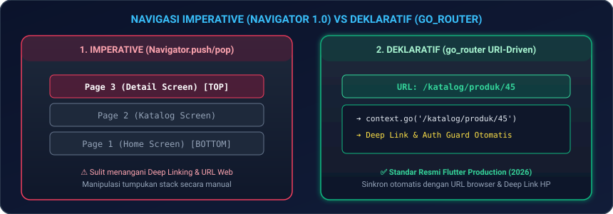
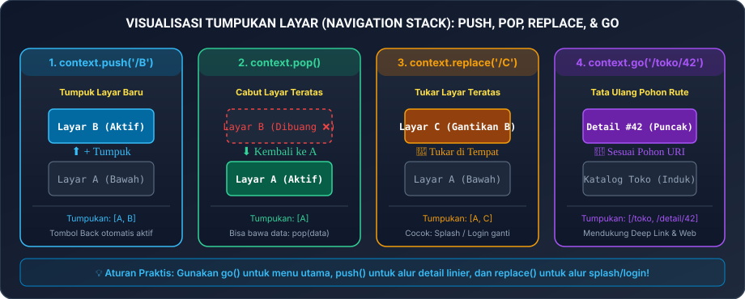
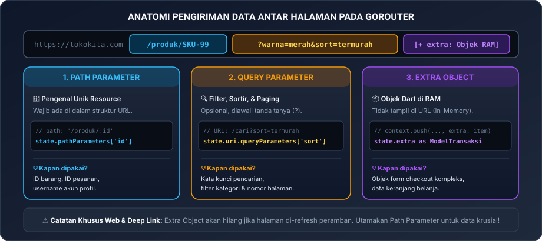
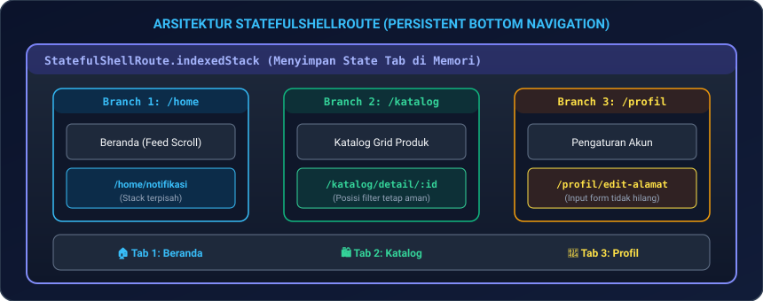
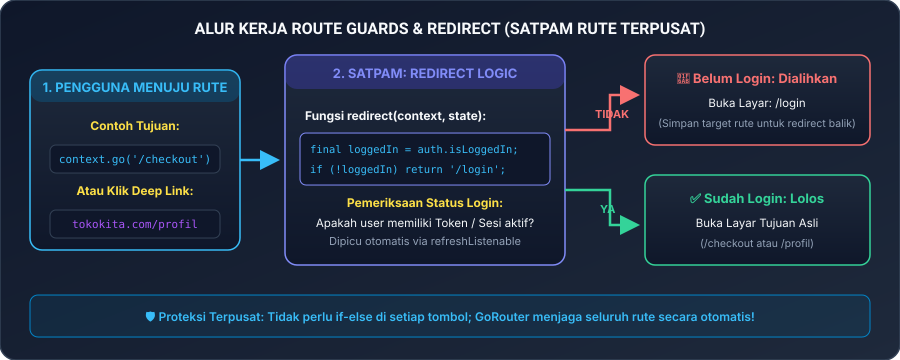
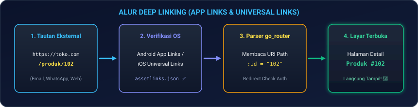

# Modul 03A: Navigasi Modern, Deklaratif Routing (go_router), & Deep Linking

Selamat datang di **Modul 03A**! Di modul ini, kita akan mempelajari cara menghubungkan layar-layar aplikasi mobile Anda dengan standar industri modern Flutter 2026. Anda akan menguasai pustaka resmi **`go_router`**, memahami perbedaan mendasar navigasi gaya lama (1.0) versus deklaratif (2.0), membangun sistem navigasi multi-tab yang tidak mereset data scroll pengguna (**`StatefulShellRoute`**), memasang satpam rute otomatis (*Route Guards / Authentication Redirect*), hingga membuka aplikasi secara instan dari tautan web (*Deep Linking*).

---

## 🛠️ 00. Persiapan Praktik: Di Mana & Bagaimana Menguji Kode Navigasi?

Sebelum mulai menulis sintaks navigasi, mari pastikan lingkungan kerja Anda siap. Anda tidak perlu bingung harus membuka apa terlebih dahulu!

### 1. Langkah Persiapan Proyek di VS Code
Jika Anda baru memulai dari nol atau ingin membuat wadah latihan baru:
1. Buka **Terminal** di komputer Anda, lalu buat proyek latihan baru:
   ```bash
   flutter create belajar_navigasi_2026
   ```
2. Buka folder proyek tersebut di **VS Code**:
   ```bash
   code belajar_navigasi_2026
   ```
   *(Atau lewat menu: `File -> Open Folder...` lalu pilih folder `belajar_navigasi_2026`)*.
3. Buka file utama: [`lib/main.dart`](file:///lib/main.dart).
4. Buka **Terminal Terintegrasi** di VS Code dengan menekan tombol **``Ctrl + ` ``** (atau `Cmd + ` di macOS).

### 2. Memasang Pustaka Resmi `go_router`
Pustaka `go_router` adalah paket resmi yang dikelola langsung oleh tim inti Flutter Google. Ketikkan perintah berikut di terminal VS Code Anda:

```bash
flutter pub add go_router
```

Perintah ini akan secara otomatis menambahkan versi terbaru `go_router` ke dalam berkas `pubspec.yaml` Anda tanpa perlu diedit manual.

> [!TIP]
> **Menguji Langsung di Browser (Tanpa Perlu Instalasi Lokal)**:  
> Jika Anda sedang belajar di laptop kantor, warnet, atau perangkat dengan spesifikasi terbatas, Anda bisa mencoba seluruh kode di modul ini secara langsung di peramban web melalui **[DartPad Flutter](https://dartpad.dev/flutter)**. Cukup pilih paket `go_router` yang tersedia di menu dependensi DartPad!

### 3. Tabel Pintasan Esensial (*Cheat-Sheet Tools*)
Agar Anda tidak merasa asing dengan lingkungan pengembangan, berikut tombol pintasan yang akan selalu Anda gunakan:

| Aksi / Kebutuhan | Tombol Pintasan / Perintah | Keterangan Praktis |
|---|---|---|
| **Buka Terminal VS Code** | **``Ctrl + ` ``** (atau `Cmd + ` di Mac) | Mengetikkan perintah `flutter pub add ...` |
| **Jalankan Aplikasi** | **`F5`** atau `flutter run` | Menjalankan aplikasi ke emulator / HP |
| **Hot Reload (Instan)** | **`Ctrl + S`** atau tekan **`r`** di terminal | Menyegarkan perubahan kode dalam 0.5 detik |
| **Hot Restart (Penuh)** | **`Ctrl + Shift + F5`** atau tekan **`R`** | Mereset ulang tumpukan router dari awal |
| **Buka Flutter DevTools** | **`Ctrl + Shift + P`** -> ketik *DevTools* | Memeriksa struktur widget tree dan performa |

---

### 4. Kanvas Uji Coba Aman (*Boilerplate Canvas*)
Ketika menggunakan `go_router`, kita tidak lagi menggunakan `MaterialApp(home: ...)` biasa, melainkan menggunakan konstruktor khusus **`MaterialApp.router`**. 

Berikut adalah kerangka kanvas minimal yang bisa Anda salin ke `lib/main.dart` untuk memastikan semuanya berjalan lancar:

```dart
import 'package:flutter/material.dart';
import 'package:go_router/go_router.dart';

// 1. Konfigurasi Daftar Rute Navigasi
final GoRouter _router = GoRouter(
  initialLocation: '/',
  routes: [
    GoRoute(
      path: '/',
      builder: (context, state) => const HalamanUtama(),
    ),
    GoRoute(
      path: '/detail',
      builder: (context, state) => const HalamanDetail(),
    ),
  ],
);

// 2. Pasang Router ke MaterialApp
void main() {
  runApp(const AplikasiSaya());
}

class AplikasiSaya extends StatelessWidget {
  const AplikasiSaya({super.key});

  @override
  Widget build(BuildContext context) {
    return MaterialApp.router(
      title: 'Belajar Navigasi 2026',
      theme: ThemeData(
        useMaterial3: true,
        colorSchemeSeed: Colors.indigo,
        fontFamily: 'sans-serif', // Menggunakan font sistem lokal agar bebas error download font Web
      ),
      routerConfig: _router, // Seluruh kendali rute diserahkan ke GoRouter
    );
  }
}

// Widget Halaman Placeholder Sederhana
class HalamanUtama extends StatelessWidget {
  const HalamanUtama({super.key});
  @override
  Widget build(BuildContext context) {
    return Scaffold(
      appBar: AppBar(title: const Text('Beranda')),
      body: Center(
        child: ElevatedButton(
          // Gunakan push() agar halaman Detail ditumpuk di atas halaman Beranda!
          onPressed: () => context.push('/detail'),
          child: const Text('Buka Halaman Detail 🚀'),
        ),
      ),
    );
  }
}

class HalamanDetail extends StatelessWidget {
  const HalamanDetail({super.key});
  @override
  Widget build(BuildContext context) {
    return Scaffold(
      appBar: AppBar(title: const Text('Detail')),
      body: Center(
        child: ElevatedButton(
          onPressed: () {
            // Pola Navigasi Aman (Defensive Navigation):
            if (context.canPop()) {
              context.pop(); // Cabut halaman jika ada halaman di bawahnya
            } else {
              context.go('/'); // Jika dibuka langsung via link URL browser, arahkan ke beranda
            }
          },
          child: const Text('Kembali ⬅️'),
        ),
      ),
    );
  }
}
```

Jalankan aplikasi dengan menekan **`F5`** di VS Code atau jalankan `flutter run` di terminal. Setiap kali Anda mengubah rute, cukup simpan berkas (**`Ctrl + S`**) untuk melakukan *Hot Reload*!

> [!IMPORTANT]
> **💡 Mengapa Muncul Error `"GoError: There is nothing to pop"` saat Tombol Kembali Diklik?**  
> Jika Anda berpindah menggunakan **`context.go('/detail')`** pada rute yang didaftarkan sejajar (*sibling*), `GoRouter` menganggap Anda berpindah alamat secara independen dan **mengganti seluruh tumpukan** navigator sehingga hanya tersisa 1 halaman (`HalamanDetail`). Ketika tombol `context.pop()` ditekan, Flutter kebingungan karena tidak ada halaman beranda di bawahnya, lalu melempar error: `There is nothing to pop` dan aplikasi tampak diam macet!
>
> **Solusi Standar Industri**:
> 1. Gunakan **`context.push('/detail')`** ketika ingin menumpuk layar detail di atas beranda.
> 2. Selalu gunakan pengecekan **`if (context.canPop()) context.pop() else context.go('/')`** agar tombol kembali tetap berfungsi mulus meskipun pengguna me-refresh halaman peramban web di `localhost:xxx/#/detail`.

---

## 🧭 01. Analogi Nyata: GPS Satelit vs Buku Resepsionis Hotel

Mengapa tim Flutter menciptakan sistem navigasi deklaratif 2.0 (`go_router`) menggantikan cara lama (`Navigator.push`)?

| Konsep Flutter | Analogi Kehidupan Nyata | Cara Kerja Teknis |
|---|---|---|
| **Navigasi Imperative (1.0)** | **Buku Resepsionis Hotel Kuno** | Anda menumpuk lembaran kartu tamu di atas meja (`push`) dan mengambilnya satu per satu dari atas (`pop`). Jika tamu masuk lewat jendela atau balkon (klik tautan link dari WhatsApp), resepsionis bingung karena tumpukan kartu di bawahnya tidak pernah ada! |
| **Navigasi Deklaratif (`go_router`)** | **Sistem GPS Alamat Satelit (URL-Driven)** | Navigasi digerakkan oleh alamat jalan yang pasti (misalnya `/toko/sepatu/42`). Mau dibuka dari dalam aplikasi, diketik di peramban web, atau diklik dari tautan SMS/WhatsApp, satelit langsung tahu rute mana yang harus dibuka beserta tumpukan layar sebelumnya! |

<p align="center">
  
</p>
<p align="center"><em>Gambar 1: Perbandingan Alur Navigasi Imperative (1.0) vs Deklaratif (2.0). (Sumber: Dokumentasi Resmi Flutter - flutter.dev).</em></p>

### Keunggulan Utama `go_router` di Standar Industri 2026:
1. **Dukungan Multiplatform Sejati**: Berfungsi identik di Android, iOS, Web, macOS, Windows, dan Linux. Di Web, tombol *Back* dan *Forward* browser sinkron secara alami.
2. **Deep Linking Otomatis**: Membuka halaman produk spesifik dari tautan media sosial tanpa menulis kode parser URI manual yang rawan bug.
3. **Route Guards Terpusat**: Memeriksa apakah pengguna sudah login sebelum layar dibuka, tanpa perlu menulis pengecekan berulang di setiap tombol.

---

## 🚀 02. Peta Perjalanan Navigasi: `context.go()` vs `context.push()` vs `context.replace()` vs `context.pop()`

Ketika ingin berpindah layar di Flutter, pemula sering bingung kapan harus menggunakan `go()`, kapan harus `push()`, dan kapan harus `replace()`. Mari kita bedah melalui visualisasi tumpukan kartu (*Navigation Stack*):

<p align="center">
  
</p>
<p align="center"><em>Gambar 2: Perbandingan Operasi Tumpukan Layar (Navigation Stack) di GoRouter. (Sumber: Dokumentasi Resmi Flutter - flutter.dev).</em></p>

### 1. `context.push('/jalur')` — "Tumpuk Layar Baru di Atas Layar Ini"
* **Karakteristik**: Menambahkan layar baru tepat di atas layar yang sedang aktif, tanpa menghapus layar sebelumnya dari memori tumpukan (*stack*). Tombol panah kembali (*back arrow*) di `AppBar` akan otomatis muncul.
* **Kapan Digunakan?**: Sangat ideal untuk alur linier seperti membuka halaman detail barang atau formulir pengeditan data di mana pengguna diharapkan bisa kembali ke layar sebelumnya.
* **Contoh**:
  ```dart
  // Menumpuk halaman detail produk di atas katalog:
  context.push('/produk-detail');
  ```

---

### 2. `context.pop([hasil])` — "Tutup Layar Saat Ini & Cabut Kartu Teratas"
* **Karakteristik**: Menutup layar teratas dan mengembalikan pengguna ke layar sebelumnya.
* **Mengembalikan Data Balikan**: Anda bisa menyisipkan nilai balikan di dalam `pop()` untuk diterima oleh layar sebelumnya!
* **Contoh**:
  ```dart
  // Di Layar Pilihan Alamat (Layar B):
  context.pop('Jl. Sudirman No. 45, Jakarta');

  // Di Layar Pemanggil (Layar A):
  final alamatDipilih = await context.push<String>('/pilih-alamat');
  if (alamatDipilih != null) {
    print('Alamat yang dipilih: $alamatDipilih');
  }
  ```

---

### 3. `context.replace('/jalur')` — "Tukar Layar Teratas Tanpa Menambah Tumpukan"
* **Karakteristik**: Menghapus layar teratas saat ini dari memori dan langsung menggantikannya dengan layar baru di posisi yang sama.
* **Kapan Digunakan?**: Sangat krusial untuk alur perpindahan dari **Splash Screen ke Login** atau dari **Login ke Dashboard Beranda**. Tujuannya agar saat pengguna menekan tombol Back fisik di HP, mereka **tidak akan kembali lagi ke layar Login atau Splash Screen**!
* **Contoh**:
  ```dart
  // Setelah berhasil login, gantikan layar login dengan dashboard:
  context.replace('/beranda');
  ```

---

### 4. `context.go('/jalur')` — "Pindah Alamat Tujuan Berdasarkan Pohon URI"
* **Karakteristik**: Mengatur ulang seluruh tumpukan layar saat ini sesuai dengan struktur hierarki rute yang didefinisikan di `GoRouter`.
* **Kapan Digunakan?**: Sangat ideal untuk perpindahan antar menu utama (misal dari Beranda ke Katalog atau Profil) dan merupakan fondasi dari Deep Linking.
* **Contoh**:
  ```dart
  // Berpindah ke menu katalog:
  context.go('/katalog');
  ```

---

### 🌟 Tips Enterprise: Gunakan Rute Bernama (*Named Routes*)
Menulis alamat rute berupa teks mentah seperti `context.go('/katalog/detail/45')` rentan salah ketik (*typo*). Jika suatu hari tim produk memutuskan mengubah URL menjadi `/produk/detail/45`, Anda harus mencari dan mengubah puluhan file kode!

Solusi standar industri adalah memberi nama unik pada setiap rute (**`name`**) dan memanggilnya via **`context.goNamed()`**:

```dart
// 1. Berikan nama pada deklarasi rute:
GoRoute(
  name: 'detail-barang', // Tanda pengenal unik
  path: '/katalog/detail/:id',
  builder: (context, state) => DetailPage(id: state.pathParameters['id']!),
);

// 2. Panggil via goNamed (aman dari perubahan URL di masa depan!):
context.goNamed(
  'detail-barang',
  pathParameters: {'id': 'SKU-8821'},
  queryParameters: {'diskon': 'true'},
);
```

---

## 📦 03. Mengirim Data Antar Halaman Tanpa Ribet

Dalam aplikasi nyata, kita sering perlu mengirim ID barang, kata kunci pencarian, atau objek belanjaan ke layar berikutnya. Bagaimana struktur data tersebut dikirimkan?

<p align="center">
  
</p>
<p align="center"><em>Gambar 3: Anatomi Pengiriman Data Antar Layar pada GoRouter. (Sumber: Dokumentasi Resmi Flutter - flutter.dev).</em></p>

`go_router` menyediakan 3 mekanisme bersih:

```dart
final GoRouter appRouter = GoRouter(
  initialLocation: '/katalog',
  routes: [
    // 1. PATH PARAMETER: Bagian dinamis dari alamat URL (/produk/:id)
    GoRoute(
      path: '/produk/:id',
      builder: (context, state) {
        // Ambil nilai ':id' dari URL:
        final String idProduk = state.pathParameters['id']!;
        return DetailProdukPage(id: idProduk);
      },
    ),

    // 2. QUERY PARAMETER: Parameter penyaring opsional (/cari?kategori=laptop&sort=termurah)
    GoRoute(
      path: '/cari',
      builder: (context, state) {
        final String kategori = state.uri.queryParameters['kategori'] ?? 'semua';
        final String urutan = state.uri.queryParameters['sort'] ?? 'rekomendasi';
        return HalamanPencarian(kategori: kategori, urutan: urutan);
      },
    ),

    // 3. EXTRA OBJECT: Mengirim objek data kompleks di memori RAM
    GoRoute(
      path: '/ringkasan-order',
      builder: (context, state) {
        // Mengambil objek model yang dikirim via parameter extra:
        final TransaksiModel transaksi = state.extra as TransaksiModel;
        return RingkasanOrderPage(transaksi: transaksi);
      },
    ),
  ],
);
```

### Cara Memanggilnya dari Tombol UI:
```dart
// 1. Memanggil Path Parameter:
context.go('/produk/SKU-9921');

// 2. Memanggil Query Parameter:
context.go('/cari?kategori=elektronik&sort=termurah');

// 3. Memanggil dengan Extra Object:
context.push('/ringkasan-order', extra: dataTransaksiSaya);
```

---

## 📱 04. Multi-Tab Tanpa Reset State: `StatefulShellRoute`

Pernahkah Anda membuka aplikasi toko online, mencari barang di Tab **Katalog** hingga menggulir ke baris ke-50, lalu Anda beralih sejenak ke Tab **Profil** untuk melihat saldo koin, dan saat kembali ke Tab **Katalog**, posisi gulir Anda tiba-tiba kembali ke paling atas? Rasanya sangat menjengkelkan, bukan?

Penyebabnya adalah navigasi biasa menghancurkan (*dispose*) halaman lama saat berpindah tab. Solusi modern di Flutter adalah **`StatefulShellRoute.indexedStack`**.

<p align="center">
  
</p>
<p align="center"><em>Gambar 4: Arsitektur StatefulShellRoute yang Mempertahankan State Antar Tab. (Sumber: Dokumentasi Resmi Flutter - flutter.dev).</em></p>

### Cara Kerja `StatefulShellRoute`:
Setiap Tab memiliki cabangnya sendiri (**`StatefulShellBranch`**). Seluruh cabang tetap hidup di memori latar belakang dalam `IndexedStack`, sehingga posisi scroll, teks form yang sedang diketik, dan data gambar tidak pernah hilang saat Anda berpindah tab!

```dart
final GoRouter shellRouter = GoRouter(
  initialLocation: '/beranda',
  routes: [
    StatefulShellRoute.indexedStack(
      builder: (context, state, navigationShell) {
        // Layar utama yang memegang BottomNavigationBar:
        return Scaffold(
          body: navigationShell, // Menampilkan tab aktif saat ini
          bottomNavigationBar: NavigationBar(
            selectedIndex: navigationShell.currentIndex,
            onDestinationSelected: (index) {
              // Berpindah tab tanpa menghapus riwayat halaman sebelumnya:
              navigationShell.goBranch(
                index,
                initialLocation: index == navigationShell.currentIndex,
              );
            },
            destinations: const [
              NavigationDestination(icon: Icon(Icons.home), label: 'Beranda'),
              NavigationDestination(icon: Icon(Icons.store), label: 'Katalog'),
              NavigationDestination(icon: Icon(Icons.person), label: 'Profil'),
            ],
          ),
        );
      },
      branches: [
        // Cabang 1: Beranda
        StatefulShellBranch(
          routes: [
            GoRoute(path: '/beranda', builder: (c, s) => const BerandaPage()),
          ],
        ),
        // Cabang 2: Katalog
        StatefulShellBranch(
          routes: [
            GoRoute(
              path: '/katalog',
              builder: (c, s) => const KatalogPage(),
              routes: [
                // Sub-rute detail di dalam tab katalog:
                GoRoute(
                  path: 'detail/:id',
                  builder: (c, s) => DetailPage(id: s.pathParameters['id']!),
                ),
              ],
            ),
          ],
        ),
        // Cabang 3: Profil
        StatefulShellBranch(
          routes: [
            GoRoute(path: '/profil', builder: (c, s) => const ProfilPage()),
          ],
        ),
      ],
    ),
  ],
);
```

---

## 🎬 05. Animasi Transisi Halaman Kustom & Halaman 404

### 1. Animasi Transisi Kustom (*Custom Transitions*)
Secara bawaan, Flutter menggunakan animasi standar sistem operasi (geser kanan di iOS, pudar naik di Android). Anda bisa membuat animasi kustom (seperti kombinasi geser halus dan pudar) menggunakan `CustomTransitionPage`:

```dart
GoRoute(
  path: '/promo-khusus',
  pageBuilder: (context, state) {
    return CustomTransitionPage(
      key: state.pageKey,
      child: const HalamanPromoKhusus(),
      transitionsBuilder: (context, animation, secondaryAnimation, child) {
        // Animasi geser dari kanan ke kiri yang dipadukan dengan efek Fade:
        const Offset posisiAwal = Offset(1.0, 0.0);
        const Offset posisiAkhir = Offset.zero;
        final animCurved = CurvedAnimation(parent: animation, curve: Curves.easeOutCubic);

        return SlideTransition(
          position: Tween<Offset>(begin: posisiAwal, end: posisiAkhir).animate(animCurved),
          child: FadeTransition(opacity: animCurved, child: child),
        );
      },
      transitionDuration: const Duration(milliseconds: 400),
    );
  },
)
```

---

### 2. Halaman Error 404 Kustom
Jika pengguna salah mengetik alamat URL di browser atau link yang diklik rusak, `go_router` menyediakan callback `errorBuilder`:

```dart
final GoRouter router = GoRouter(
  errorBuilder: (context, state) => Scaffold(
    appBar: AppBar(title: const Text('Halaman Tidak Ditemukan')),
    body: Center(
      child: Column(
        mainAxisAlignment: MainAxisAlignment.center,
        children: [
          const Icon(Icons.search_off, size: 90, color: Colors.orange),
          const SizedBox(height: 16),
          Text(
            'Ups! Jalur "${state.uri.path}" tidak tersedia.',
            style: const TextStyle(fontSize: 16, fontWeight: FontWeight.bold),
          ),
          const SizedBox(height: 20),
          ElevatedButton(
            onPressed: () => context.go('/beranda'),
            child: const Text('Kembali ke Beranda'),
          ),
        ],
      ),
    ),
  ),
  routes: [...],
);
```

---

## 🔒 06. Satpam Pemeriksa Autentikasi Terpusat (Route Guards & Redirect)

Bayangkan sebuah gedung kantor dengan satpam di pintu depan. Siapa pun yang ingin masuk ke ruang manajer wajib menunjukkan tanda pengenal (ID Card). Jika belum punya, satpam akan langsung menggiring orang tersebut ke meja resepsionis untuk mendaftar.

Itulah cara kerja **`redirect` logic** di `go_router`!

<p align="center">
  
</p>
<p align="center"><em>Gambar 5: Alur Pemeriksaan Autentikasi Terpusat dengan Route Guards. (Sumber: Analisis Arsitektur go_router - flutter.dev).</em></p>

### Implementasi Route Guard Bersih:
```dart
class LayananAuth extends ChangeNotifier {
  bool _sudahLogin = false;
  bool get sudahLogin => _sudahLogin;

  void masukAkun() {
    _sudahLogin = true;
    notifyListeners(); // Beritahu router bahwa status login telah berubah!
  }

  void keluarAkun() {
    _sudahLogin = false;
    notifyListeners();
  }
}

final layananAuth = LayananAuth();

final GoRouter guardRouter = GoRouter(
  // Dengarkan perubahan status login secara otomatis:
  refreshListenable: layananAuth,
  initialLocation: '/beranda',
  redirect: (BuildContext context, GoRouterState state) {
    final bool isUserLogin = layananAuth.sudahLogin;
    final bool sedangBukaHalamanLogin = state.matchedLocation == '/login';

    // 1. Jika belum login dan mencoba masuk ke rute aman, alihkan ke /login:
    if (!isUserLogin && !sedangBukaHalamanLogin) {
      return '/login';
    }

    // 2. Jika sudah login tapi iseng membuka /login lagi, alihkan ke /beranda:
    if (isUserLogin && sedangBukaHalamanLogin) {
      return '/beranda';
    }

    // 3. Jika kondisi normal, biarkan pengguna lewat:
    return null;
  },
  routes: [
    GoRoute(path: '/login', builder: (c, s) => const LoginPage()),
    GoRoute(path: '/beranda', builder: (c, s) => const BerandaPage()),
    GoRoute(path: '/profil', builder: (c, s) => const ProfilPage()),
  ],
);
```

Dengan teknik ini, Anda **tidak perlu lagi menulis puluhan pengecekan `if (!isLoggedIn)` di setiap tombol aplikasi**. `GoRouter` menjadi satpam tunggal yang menjaga seluruh rute secara otomatis!

---

## 🔗 07. Deep Linking Tanpa Pusing (Android App Links & iOS Universal Links)

**Deep Linking** memungkinkan pengguna membuka tautan web (misalnya `https://tokokita2026.com/produk/sepatu-sneakers`) dari aplikasi lain (seperti WhatsApp, Instagram, atau email), dan tautan tersebut akan **langsung meluncurkan aplikasi Flutter Anda dan membuka halaman produk yang bersangkutan**.

<p align="center">
  
</p>
<p align="center"><em>Gambar 6: Alur Deep Linking dari Tautan Eksternal Menuju Halaman Spesifik Aplikasi. (Sumber: Dokumentasi Resmi Flutter - flutter.dev/docs).</em></p>

### Langkah Konfigurasi Android App Links:
1. Buka berkas `android/app/src/main/AndroidManifest.xml`.
2. Di dalam tag `<activity android:name=".MainActivity" ...>`, tambahkan blok `intent-filter` berikut:

```xml
<intent-filter android:autoVerify="true">
    <action android:name="android.intent.action.VIEW" />
    <category android:name="android.intent.category.DEFAULT" />
    <category android:name="android.intent.category.BROWSABLE" />
    <!-- Tentukan skema protokol dan nama domain resmi aplikasi Anda -->
    <data android:scheme="https" android:host="tokokita2026.com" />
</intent-filter>
```

3. Unggah berkas pembuktian kepemilikan domain di server web Anda di URL:  
   `https://tokokita2026.com/.well-known/assetlinks.json`

Karena Anda sudah menggunakan `GoRouter` dengan rute `/katalog/detail/:id`, ketika tautan `https://tokokita2026.com/katalog/detail/P01` diklik, `GoRouter` secara otomatis membaca path tersebut dan langsung membuka layar produk yang tepat tanpa Anda perlu menulis kode pengurai (*URI parser*) tambahan!

### 🛠️ Cara Menguji Deep Link di Emulator Android via Terminal ADB
Bagaimana jika Anda belum memiliki server web atau domain asli `tokokita2026.com`? Tenang! Anda bisa menyimulasikan ketukan tautan eksternal secara langsung dari terminal VS Code ke emulator Android menggunakan perintah **ADB** (*Android Debug Bridge*):

1. Pastikan emulator Android Anda sedang menyala dan aplikasi Flutter sudah terpasang (`flutter run`).
2. Buka terminal VS Code, lalu jalankan perintah sakti berikut:

```bash
adb shell am start -a android.intent.action.VIEW -c android.intent.category.BROWSABLE -d "https://tokokita2026.com/katalog/detail/P01"
```

Aplikasi di layar emulator akan seketika merespons dan langsung melompat ke halaman detail produk `P01`!

---

## 📊 08. Pelacakan Analitik Rute Otomatis (NavigatorObserver)

Dalam aplikasi profesional, tim produk dan pemasaran perlu melacak halaman mana saja yang paling sering dikunjungi pengguna untuk analitik (seperti Firebase Analytics). Anda cukup mendaftarkan satu pengawas (**`NavigatorObserver`**):

```dart
class PelacakNavigasiObserver extends NavigatorObserver {
  @override
  void didPush(Route<dynamic> route, Route<dynamic>? previousRoute) {
    super.didPush(route, previousRoute);
    final namaRute = route.settings.name ?? route.settings;
    debugPrint('📊 [Analitik]: Pengguna masuk ke layar -> $namaRute');
  }
}

// Pasang pengawas di dalam konfigurasi router Anda:
final GoRouter routerTerpantau = GoRouter(
  observers: [PelacakNavigasiObserver()],
  routes: [...],
);
```

---

## 💻 09. Hands-On Project: Portal Navigasi Multi-Tab & Detail Toko Mandiri

Mari kita satukan seluruh materi di modul ini ke dalam satu aplikasi toko mini yang **lengkap, mandiri, dan dapat langsung dijalankan**.

### Cara Menjalankan Kode Ini:
1. Pastikan Anda sudah menjalankan `flutter pub add go_router` di terminal.
2. Hapus seluruh isi file `lib/main.dart` Anda, lalu ganti dengan kode di bawah ini:
3. Tekan **`F5`** untuk menjalankan di emulator atau peramban web!

```dart
import 'package:flutter/material.dart';
import 'package:go_router/go_router.dart';

void main() {
  runApp(const TokoKitaNavigasiApp());
}

// ==========================================
// 1. DATA MODEL PRODUK & STATUS LOGIN (INTERAKTIF)
// ==========================================
class ProdukItem {
  final String id;
  final String nama;
  final String harga;
  final IconData ikon;

  const ProdukItem({required this.id, required this.nama, required this.harga, required this.ikon});
}

const List<ProdukItem> daftarProdukContoh = [
  ProdukItem(id: 'P01', nama: 'Sepatu Lari Ultralight', harga: 'Rp 750.000', ikon: Icons.directions_run),
  ProdukItem(id: 'P02', nama: 'Jam Tangan Pintar Pro', harga: 'Rp 1.200.000', ikon: Icons.watch),
  ProdukItem(id: 'P03', nama: 'Headphone Wireless Bass', harga: 'Rp 950.000', ikon: Icons.headphones),
];

// Notifier sederhana untuk memantau status login (Uji Coba Route Guard):
class StatusAuthNotifier extends ChangeNotifier {
  bool _sudahLogin = false;
  bool get sudahLogin => _sudahLogin;

  void ubahStatusLogin() {
    _sudahLogin = !_sudahLogin;
    notifyListeners(); // Beritahu GoRouter bahwa status login berubah!
  }
}

final statusAuth = StatusAuthNotifier();

// ==========================================
// 2. KONFIGURASI GOROUTER LENGKAP DENGAN ROUTE GUARD
// ==========================================
final GoRouter routerAplikasi = GoRouter(
  initialLocation: '/katalog',
  refreshListenable: statusAuth, // Dengarkan perubahan status auth
  redirect: (BuildContext context, GoRouterState state) {
    final bool isLogin = statusAuth.sudahLogin;
    final bool mauBukaVip = state.matchedLocation == '/profil/vip-club';

    // Jika pengguna belum login tapi nekat membuka /profil/vip-club:
    if (mauBukaVip && !isLogin) {
      // Satpam mengembalikan pengguna ke halaman profil:
      return '/profil';
    }
    return null; // Bebas lewat
  },
  routes: [
    StatefulShellRoute.indexedStack(
      builder: (context, state, navigationShell) {
        return ShellScaffold(navigationShell: navigationShell);
      },
      branches: [
        // Cabang 1: Katalog Produk
        StatefulShellBranch(
          routes: [
            GoRoute(
              name: 'katalog',
              path: '/katalog',
              builder: (context, state) => const HalamanKatalog(),
              routes: [
                GoRoute(
                  name: 'katalog-detail', // Named route standar industri
                  path: 'detail/:id',
                  builder: (context, state) {
                    final String idProduk = state.pathParameters['id']!;
                    return HalamanDetailProduk(idProduk: idProduk);
                  },
                ),
              ],
            ),
          ],
        ),

        // Cabang 2: Profil Pengguna & Uji Route Guard
        StatefulShellBranch(
          routes: [
            GoRoute(
              name: 'profil',
              path: '/profil',
              builder: (context, state) => const HalamanProfil(),
              routes: [
                GoRoute(
                  name: 'vip-club',
                  path: 'vip-club', // Rute rahasia yang dijaga satpam
                  builder: (context, state) => const HalamanVipClub(),
                ),
              ],
            ),
          ],
        ),
      ],
    ),
  ],
);

// ==========================================
// 3. WIDGET APLIKASI UTAMA
// ==========================================
class TokoKitaNavigasiApp extends StatelessWidget {
  const TokoKitaNavigasiApp({super.key});

  @override
  Widget build(BuildContext context) {
    return MaterialApp.router(
      title: 'TokoKita Navigasi 2026',
      debugShowCheckedModeBanner: false,
      theme: ThemeData(
        useMaterial3: true,
        colorSchemeSeed: const Color(0xFF4338CA),
      ),
      routerConfig: routerAplikasi,
    );
  }
}

// ==========================================
// 4. SHELL CONTAINER DENGAN NAVIGATIONBAR
// ==========================================
class ShellScaffold extends StatelessWidget {
  final StatefulNavigationShell navigationShell;

  const ShellScaffold({super.key, required this.navigationShell});

  @override
  Widget build(BuildContext context) {
    return Scaffold(
      body: navigationShell,
      bottomNavigationBar: NavigationBar(
        selectedIndex: navigationShell.currentIndex,
        onDestinationSelected: (int index) {
          navigationShell.goBranch(
            index,
            initialLocation: index == navigationShell.currentIndex,
          );
        },
        destinations: const [
          NavigationDestination(
            icon: Icon(Icons.storefront_outlined),
            selectedIcon: Icon(Icons.storefront),
            label: 'Katalog',
          ),
          NavigationDestination(
            icon: Icon(Icons.person_outline),
            selectedIcon: Icon(Icons.person),
            label: 'Profil Saya',
          ),
        ],
      ),
    );
  }
}

// ==========================================
// 5. LAYAR KATALOG PRODUK
// ==========================================
class HalamanKatalog extends StatelessWidget {
  const HalamanKatalog({super.key});

  @override
  Widget build(BuildContext context) {
    return Scaffold(
      appBar: AppBar(
        title: const Text('Katalog TokoKita 2026', style: TextStyle(fontWeight: FontWeight.bold)),
        backgroundColor: const Color(0xFF4338CA),
        foregroundColor: Colors.white,
      ),
      body: ListView.builder(
        padding: const EdgeInsets.all(12),
        itemCount: daftarProdukContoh.length,
        itemBuilder: (context, index) {
          final produk = daftarProdukContoh[index];
          return Card(
            elevation: 2,
            margin: const EdgeInsets.only(bottom: 12),
            child: ListTile(
              leading: CircleAvatar(
                backgroundColor: const Color(0xFFEEF2FF),
                child: Icon(produk.ikon, color: const Color(0xFF4338CA)),
              ),
              title: Text(produk.nama, style: const TextStyle(fontWeight: FontWeight.bold)),
              subtitle: Text(produk.harga, style: TextStyle(color: Colors.green[700], fontWeight: FontWeight.w600)),
              trailing: const Icon(Icons.arrow_forward_ios, size: 16),
              onTap: () {
                // Memanggil rute bernama via goNamed (aman dari perubahan URL):
                context.goNamed(
                  'katalog-detail',
                  pathParameters: {'id': produk.id},
                );
              },
            ),
          );
        },
      ),
    );
  }
}

// ==========================================
// 6. LAYAR DETAIL PRODUK
// ==========================================
class HalamanDetailProduk extends StatelessWidget {
  final String idProduk;

  const HalamanDetailProduk({super.key, required this.idProduk});

  @override
  Widget build(BuildContext context) {
    final produk = daftarProdukContoh.firstWhere(
      (p) => p.id == idProduk,
      orElse: () => const ProdukItem(id: '404', nama: 'Barang Misterius', harga: 'Rp 0', ikon: Icons.help),
    );

    return Scaffold(
      appBar: AppBar(
        title: Text('Detail ${produk.nama}'),
        backgroundColor: const Color(0xFF4338CA),
        foregroundColor: Colors.white,
      ),
      body: Padding(
        padding: const EdgeInsets.all(24),
        child: Column(
          children: [
            Center(
              child: Container(
                width: 120,
                height: 120,
                decoration: BoxDecoration(
                  color: const Color(0xFFEEF2FF),
                  borderRadius: BorderRadius.circular(24),
                ),
                child: Icon(produk.ikon, size: 64, color: const Color(0xFF4338CA)),
              ),
            ),
            const SizedBox(height: 20),
            Text(produk.nama, style: const TextStyle(fontSize: 22, fontWeight: FontWeight.bold)),
            const SizedBox(height: 8),
            Text(produk.harga, style: TextStyle(fontSize: 18, color: Colors.green[700], fontWeight: FontWeight.bold)),
            const SizedBox(height: 8),
            Text('ID SKU Resmi: ${produk.id}', style: const TextStyle(color: Colors.grey)),
            const Spacer(),
            Row(
              children: [
                // Tombol Kembali eksplisit mempraktikkan context.pop():
                Expanded(
                  child: OutlinedButton.icon(
                    onPressed: () => context.pop(),
                    icon: const Icon(Icons.arrow_back),
                    label: const Text('Kembali'),
                    style: OutlinedButton.styleFrom(
                      minimumSize: const Size.fromHeight(50),
                    ),
                  ),
                ),
                const SizedBox(width: 12),
                // Tombol Checkout:
                Expanded(
                  flex: 2,
                  child: ElevatedButton.icon(
                    onPressed: () {
                      ScaffoldMessenger.of(context).showSnackBar(
                        SnackBar(content: Text('Berhasil menambahkan ${produk.nama} ke keranjang!')),
                      );
                    },
                    icon: const Icon(Icons.shopping_cart),
                    label: const Text('Beli Sekarang'),
                    style: ElevatedButton.styleFrom(
                      backgroundColor: const Color(0xFF4338CA),
                      foregroundColor: Colors.white,
                      minimumSize: const Size.fromHeight(50),
                    ),
                  ),
                ),
              ],
            ),
          ],
        ),
      ),
    );
  }
}

// ==========================================
// 7. LAYAR PROFIL & SIMULASI ROUTE GUARD
// ==========================================
class HalamanProfil extends StatelessWidget {
  const HalamanProfil({super.key});

  @override
  Widget build(BuildContext context) {
    return ListenableBuilder(
      listenable: statusAuth,
      builder: (context, _) {
        final bool isLogin = statusAuth.sudahLogin;
        return Scaffold(
          appBar: AppBar(
            title: const Text('Profil Saya'),
            backgroundColor: const Color(0xFF4338CA),
            foregroundColor: Colors.white,
          ),
          body: Padding(
            padding: const EdgeInsets.all(20),
            child: Column(
              children: [
                const CircleAvatar(radius: 44, child: Icon(Icons.person, size: 48)),
                const SizedBox(height: 12),
                const Text('Ahmad Fullstack Developer', style: TextStyle(fontSize: 18, fontWeight: FontWeight.bold)),
                const Text('ahmad@example.com', style: TextStyle(color: Colors.grey)),
                const SizedBox(height: 24),

                // Switch Interaktif Simulasi Login:
                Card(
                  color: isLogin ? Colors.green.shade50 : Colors.amber.shade50,
                  elevation: 1,
                  child: SwitchListTile(
                    title: Text(
                      isLogin ? 'Status Akun: Sudah Login' : 'Status Akun: Belum Login',
                      style: TextStyle(fontWeight: FontWeight.bold, color: isLogin ? Colors.green.shade900 : Colors.amber.shade900),
                    ),
                    subtitle: const Text('Ubah saklar ini untuk menguji satpam Route Guard!'),
                    value: isLogin,
                    onChanged: (_) => statusAuth.ubahStatusLogin(),
                  ),
                ),
                const SizedBox(height: 16),

                // Tombol Akses Halaman Terlindungi:
                SizedBox(
                  width: double.infinity,
                  height: 48,
                  child: ElevatedButton.icon(
                    onPressed: () {
                      if (!isLogin) {
                        ScaffoldMessenger.of(context).showSnackBar(
                          const SnackBar(
                            content: Text('⛔ Akses Ditolak oleh Route Guard! Aktifkan saklar login di atas terlebih dahulu.'),
                            backgroundColor: Colors.red,
                          ),
                        );
                      }
                      // Mencoba membuka rute yang dijaga satpam:
                      context.go('/profil/vip-club');
                    },
                    icon: const Icon(Icons.workspace_premium),
                    label: const Text('Buka Halaman Rahasia VIP Club 🌟'),
                    style: ElevatedButton.styleFrom(
                      backgroundColor: const Color(0xFF4338CA),
                      foregroundColor: Colors.white,
                    ),
                  ),
                ),
              ],
            ),
          ),
        );
      },
    );
  }
}

// ==========================================
// 8. LAYAR VIP CLUB (AREA TERLINDUNGI)
// ==========================================
class HalamanVipClub extends StatelessWidget {
  const HalamanVipClub({super.key});

  @override
  Widget build(BuildContext context) {
    return Scaffold(
      appBar: AppBar(
        title: const Text('Area Rahasia VIP Club'),
        backgroundColor: Colors.amber.shade800,
        foregroundColor: Colors.white,
      ),
      body: Center(
        child: Padding(
          padding: const EdgeInsets.all(24),
          child: Column(
            mainAxisAlignment: MainAxisAlignment.center,
            children: [
              const Icon(Icons.workspace_premium, size: 90, color: Colors.amber),
              const SizedBox(height: 16),
              const Text('Selamat Datang di VIP Club!', style: TextStyle(fontSize: 22, fontWeight: FontWeight.bold)),
              const SizedBox(height: 8),
              const Text(
                'Hebat! Anda berhasil melewati pemeriksaan satpam Route Guard secara otomatis!',
                textAlign: TextAlign.center,
                style: TextStyle(color: Colors.grey),
              ),
              const SizedBox(height: 24),
              ElevatedButton.icon(
                onPressed: () => context.pop(),
                icon: const Icon(Icons.arrow_back),
                label: const Text('Kembali ke Profil'),
              ),
            ],
          ),
        ),
      ),
    );
  }
}
```

---

## ⚠️ 10. Troubleshooting & 7 Jebakan Navigasi Umum

| No | Gejala / Pesan Kesalahan | Penyebab Utama | Solusi Kilat |
|---|---|---|---|
| **1** | *"GoRouter was not found in the widget tree"* | Anda memanggil `context.go()` di aplikasi yang masih memakai `MaterialApp(home: ...)` biasa. | Ganti deklarasi aplikasi menjadi `MaterialApp.router(routerConfig: router)`. |
| **2** | Tumpukan halaman hilang saat ganti Tab | Anda memakai `context.go()` biasa alih-alih `StatefulShellRoute`. | Bungkus cabang rute BottomNav ke dalam `StatefulShellRoute.indexedStack`. |
| **3** | *Type Cast Error* saat membaca parameter | Lupa memeriksa nullability `state.pathParameters['id']`. | Berikan tanda seru `!` atau nilai default menggunakan operator `??`. |
| **4** | Halaman stuck / loop redirect tiada henti | Logika `redirect` tidak mengecek apakah user sudah berada di `/login`. | Tambahkan kondisi: `if (isLoggedIn && isGoingToLogin) return '/home';`. |
| **5** | Deep Link tidak membuka aplikasi di HP | Kurang konfigurasi `intent-filter` di `AndroidManifest.xml`. | Tambahkan atribut `android:autoVerify="true"` dan skema `https` domain Anda. |
| **6** | *"GoError: There is nothing to pop"* (Tombol kembali macet) | Berpindah menggunakan `context.go('/detail')` pada rute sejajar sehingga tumpukan hanya tersisa 1 layar detail saja tanpa ada beranda di bawahnya. | Gunakan `context.push('/detail')` untuk menumpuk layar, atau gunakan navigasi defensif: `if (context.canPop()) context.pop() else context.go('/')`. |
| **7** | Teks menjadi kotak-kotak (*tofu* `▯▯▯`) di Web | Flutter Web (CanvasKit) gagal mengunduh font Roboto dari CDN Google (`fonts.gstatic.com failed to fetch`). | Tambahkan `fontFamily: 'sans-serif'` di dalam `ThemeData`, atau jalankan peramban via terminal: `flutter run -d chrome --web-renderer html`. |

---

## 📝 11. Kuis Pemahaman Modul 03A

1. **Kapan Anda sebaiknya menggunakan `context.push()` dibandingkan `context.go()`?**  
   *Jawaban:* Gunakan `context.push()` ketika Anda ingin menumpuk layar baru di atas layar saat ini dalam sebuah alur linier (seperti membuka layar detail atau form pembayaran) di mana pengguna diharapkan bisa kembali dengan menekan tombol panah *Back*. Gunakan `context.go()` untuk berpindah alamat atau menu utama secara deklaratif.
2. **Apa peran utama `StatefulShellRoute.indexedStack` pada aplikasi multi-tab?**  
   *Jawaban:* Menjaga agar state halaman di dalam setiap tab (seperti posisi scroll daftar barang atau teks formulir yang sedang diketik) tetap tersimpan di memori dan tidak di-reset ke kondisi awal saat pengguna berpindah-pindah tab.
3. **Mengapa Route Guard (`redirect`) di `GoRouter` jauh lebih aman daripada pengecekan manual di tombol UI?**  
   *Jawaban:* Karena proteksi ditaruh secara terpusat pada tingkat router. Tidak peduli dari mana pengguna masuk (baik lewat tombol tombol aplikasi, tombol browser, ataupun Deep Link dari luar), router akan selalu mencegat dan memvalidasi status izin pengguna terlebih dahulu sebelum layar sempat dibuka.

---

## 🎯 12. Checklist Kelulusan Kompetensi Modul 03A

Tandai penguasaan Anda sebelum beralih ke formulir interaktif di Modul 03B:
- [x] Memahami filosofi navigasi deklaratif 2.0 dan perbedaan dengan navigasi 1.0.
- [x] Mampu mengonfigurasi `MaterialApp.router` dan mendefinisikan rute dengan `GoRouter`.
- [x] Mahir menggunakan operasi stack: `context.go()`, `context.push()`, `context.replace()`, dan `context.pop()`.
- [x] Menguasai penggunaan *Named Routes* (`context.goNamed`) untuk arsitektur tahan *refactoring*.
- [x] Bisa mengirimkan data melalui *Path Parameters*, *Query Parameters*, dan *Extra Object*.
- [x] Mampu mengimplementasikan navigasi multi-tab tanpa reset state via `StatefulShellRoute`.
- [x] Mampu membuat transisi animasi halaman kustom (*CustomTransitionPage*).
- [x] Menguasai sistem keamanan rute terpusat (*Route Guards & Redirect Logic*).
- [x] Memahami konsep *Deep Linking* serta cara mengujinya di emulator Android via terminal ADB.
- [x] Berhasil menjalankan dan memahami kode proyek mandiri **TokoKita Navigasi 2026**.

---

👉 **Langkah Selanjutnya**: Selamat! Anda telah menguasai fondasi arsitektur navigasi modern standar industri! Sekarang, mari kita lanjutkan ke **[Modul 03B: Form System, Input, Validasi Interaktif, & Penanganan Layar Mundur (PopScope)](../modul-03b-form-input-dan-validasi/README.md)** untuk belajar cara mengelola formulir pendaftaran, format mata uang otomatis, dan memproteksi pengguna dari kehilangan data! 🚀
