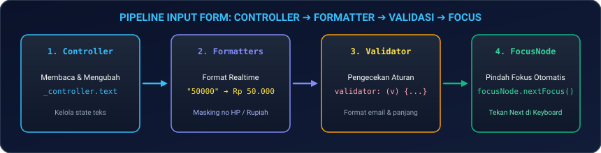
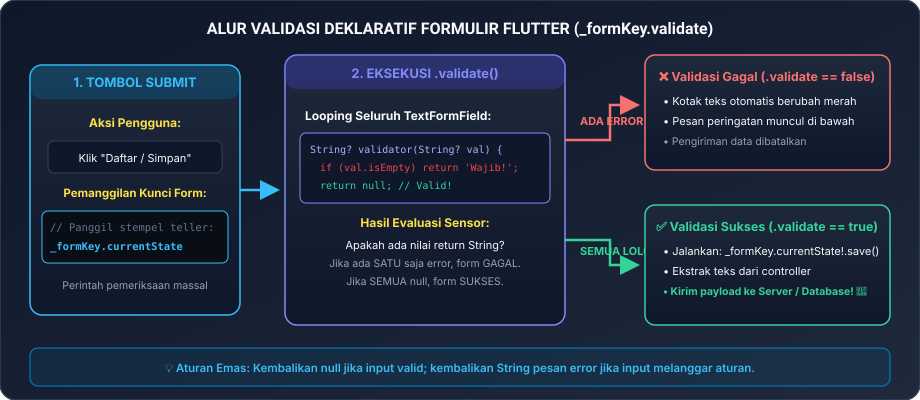
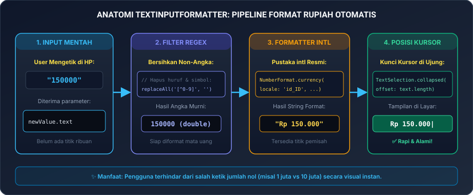
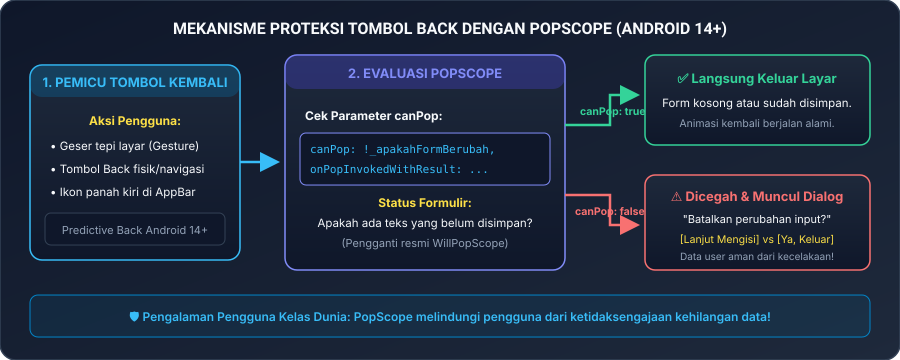

# Modul 03B: Form System, Input, Validasi Interaktif, & Penanganan Layar Mundur (PopScope)

Selamat datang di **Modul 03B**! Mengumpulkan data dari pengguna—mulai dari pendaftaran akun, login, pencarian barang, hingga transaksi pembayaran—adalah jantung dari hampir semua aplikasi mobile. Di modul ini, Anda akan mempelajari cara membangun **Sistem Formulir (Form System)** yang aman, ramah pengguna, tervalidasi secara instan, dilengkapi pemformatan mata uang Rupiah otomatis, serta menerapkan standar modern intersepsi tombol kembali (**`PopScope`**) untuk mencegah hilangnya data pengguna secara tidak sengaja di Android 14+ dan iOS.

---

## 🛠️ 00. Persiapan Praktik: Di Mana & Bagaimana Menguji Kode Formulir?

Sebelum mulai membuat formulir, mari persiapkan peralatan di proyek Flutter Anda:

### 1. Langkah Persiapan Proyek di VS Code
Jika Anda baru memulai dari awal atau ingin menyiapkan proyek khusus formulir:
1. Buka **Terminal**, lalu jalankan perintah:
   ```bash
   flutter create belajar_form_2026
   code belajar_form_2026
   ```
   *(Atau buka VS Code, pilih menu `File -> Open Folder...` lalu pilih folder kerja Anda)*.
2. Buka berkas utama: [`lib/main.dart`](file:///lib/main.dart).
3. Buka **Terminal Terintegrasi** di VS Code dengan menekan tombol **``Ctrl + ` ``** (atau `Cmd + ` di macOS).

### 2. Memasang Pustaka Resmi `intl`
Paket resmi **`intl`** dari tim Dart Google digunakan untuk memformat mata uang (seperti simbol Rupiah `Rp 150.000`) dan tanggal lokal Indonesia:

```bash
flutter pub add intl
```

> [!TIP]
> **Uji Coba Instan via Browser**:  
> Seluruh kode di modul ini juga dapat dijalankan secara instan di peramban web melalui **[DartPad Flutter](https://dartpad.dev/flutter)** tanpa perlu instalasi SDK lokal.

### 3. Tabel Pintasan Esensial (*Cheat-Sheet Tools*)
Berikut tombol pintasan yang akan sangat memudahkan Anda saat menguji coba formulir:

| Aksi / Kebutuhan | Tombol Pintasan / Perintah | Keterangan Praktis |
|---|---|---|
| **Buka Terminal VS Code** | **``Ctrl + ` ``** (atau `Cmd + ` di Mac) | Mengetik perintah paket `flutter pub add ...` |
| **Jalankan Aplikasi** | **`F5`** atau `flutter run` | Menjalankan aplikasi ke emulator / HP |
| **Hot Reload (Instan)** | **`Ctrl + S`** atau tekan **`r`** di terminal | Menyegarkan perubahan form dalam hitungan detik |
| **Hot Restart (Penuh)** | **`Ctrl + Shift + F5`** atau tekan **`R`** | Mengosongkan form dan mereset state dari awal |
| **Buka Flutter DevTools** | **`Ctrl + Shift + P`** -> ketik *DevTools* | Memeriksa tree widget & mendiagnosa kebocoran memori |

---

### 4. Kanvas Uji Coba Aman (*Boilerplate Canvas*)
Formulir memerlukan status dinamis (*state*) untuk menyimpan data yang diketik oleh pengguna, sehingga kita menggunakan **`StatefulWidget`**.

Berikut kanvas dasar yang siap Anda salin ke `lib/main.dart`:

```dart
import 'package:flutter/material.dart';

void main() {
  runApp(const AplikasiFormSaya());
}

class AplikasiFormSaya extends StatelessWidget {
  const AplikasiFormSaya({super.key});

  @override
  Widget build(BuildContext context) {
    return MaterialApp(
      title: 'Belajar Form 2026',
      debugShowCheckedModeBanner: false,
      theme: ThemeData(
        useMaterial3: true,
        colorSchemeSeed: Colors.teal,
        fontFamily: 'sans-serif', // Menggunakan font sistem lokal agar bebas error download font Web
      ),
      home: const HalamanFormLatihan(),
    );
  }
}

class HalamanFormLatihan extends StatefulWidget {
  const HalamanFormLatihan({super.key});

  @override
  State<HalamanFormLatihan> createState() => _HalamanFormLatihanState();
}

class _HalamanFormLatihanState extends State<HalamanFormLatihan> {
  // 1. Kunci Pengendali Form
  final _formKey = GlobalKey<FormState>();

  // 2. Pengendali Input Teks (Pena Pencatat)
  final _namaController = TextEditingController();

  @override
  void dispose() {
    // Selalu bersihkan controller agar tidak bocor memori (memory leak)!
    _namaController.dispose();
    super.dispose();
  }

  void _kirimData() {
    // Jalankan seluruh fungsi validasi di dalam Form:
    if (_formKey.currentState!.validate()) {
      ScaffoldMessenger.of(context).showSnackBar(
        SnackBar(content: Text('Halo, ${_namaController.text}! Data berhasil divalidasi.')),
      );
    }
  }

  @override
  Widget build(BuildContext context) {
    return Scaffold(
      appBar: AppBar(title: const Text('Latihan Form Dasar')),
      // Gunakan SingleChildScrollView agar layar tidak error terpotong saat keyboard HP muncul!
      body: SingleChildScrollView(
        padding: const EdgeInsets.all(20),
        child: Form(
          key: _formKey,
          child: Column(
            children: [
              TextFormField(
                controller: _namaController,
                decoration: const InputDecoration(
                  labelText: 'Nama Lengkap',
                  hintText: 'Contoh: Budi Santoso',
                  prefixIcon: Icon(Icons.person),
                  border: OutlineInputBorder(),
                ),
                validator: (value) {
                  if (value == null || value.trim().isEmpty) {
                    return 'Nama tidak boleh kosong!';
                  }
                  return null; // Null berarti input valid dan lolos sensor!
                },
              ),
              const SizedBox(height: 20),
              SizedBox(
                width: double.infinity,
                height: 48,
                child: ElevatedButton(
                  onPressed: _kirimData,
                  child: const Text('Kirim Formulir'),
                ),
              ),
            ],
          ),
        ),
      ),
    );
  }
}
```

Jalankan aplikasi dengan **`F5`**. Coba klik tombol "Kirim Formulir" saat kolom nama masih kosong, dan perhatikan pesan peringatan merah yang muncul secara otomatis!

---

## 🏦 01. Analogi Nyata: Formulir Teller Bank & Scanner Otomatis

Untuk memahami bagaimana komponen-komponen formulir di Flutter bekerja sama:

| Komponen Flutter | Analogi Teller Bank | Penjelasan Teknis |
|---|---|---|
| **`Form`** | **Map Berkas Formulir** | Wadah induk yang membungkus seluruh kotak isian menjadi satu kesatuan dokumen. |
| **`GlobalKey<FormState>`** | **Stempel Petugas Teller** | Alat pengendali untuk memeriksa seluruh isian lembaran dokumen secara serentak (`_formKey.currentState!.validate()`). |
| **`TextEditingController`** | **Pena Khusus Pencatat** | Alat penyimpan nilai teks yang sedang diketik secara *real-time*. Wajib ditutup (`dispose()`) setelah selesai agar tinta tidak tumpah (bocor memori RAM). |
| **`FocusNode`** | **Lampu Sorot Meja Teller** | Menentukan kotak isian mana yang saat ini sedang aktif menerima ketikan keyboard dan mengarahkan kursor ke kotak berikutnya. |
| **`PopScope`** | **Pintu Keluar Berpalang Sensor** | Menahan pengguna yang hendak keluar gedung saat dokumen pentingnya masih setengah terisi dan belum disimpan. |

<p align="center">
  
</p>
<p align="center"><em>Gambar 1: Alur Siklus Hidup Input Teks, Controller, dan FocusNode. (Sumber: Dokumentasi Resmi Flutter - flutter.dev).</em></p>

---

## 📋 02. Anatomi Form & Validasi Data Pengguna

### 1. Menulis Fungsi Validator yang Bersih
Fungsi `validator` pada `TextFormField` menerima nilai teks yang sedang diketik (`value`). Aturannya sangat sederhana:
* Kembalikan **`String pesan error`** jika data tidak sesuai aturan.
* Kembalikan **`null`** jika data lolos sensor dan valid!

```dart
// Validator Email:
String? validasiEmail(String? value) {
  if (value == null || value.trim().isEmpty) {
    return 'Alamat email wajib diisi!';
  }
  // Regex sederhana untuk memeriksa format email:
  final emailRegex = RegExp(r'^[\w-\.]+@([\w-]+\.)+[\w-]{2,4}$');
  if (!emailRegex.hasMatch(value.trim())) {
    return 'Format email tidak valid (contoh: user@gmail.com)';
  }
  return null; // Lolos!
}

// Validator Kata Sandi (Password):
String? validasiPassword(String? value) {
  if (value == null || value.isEmpty) {
    return 'Kata sandi tidak boleh kosong!';
  }
  if (value.length < 8) {
    return 'Kata sandi minimal 8 karakter!';
  }
  return null; // Lolos!
}
```

---

### 2. Mode Validasi Otomatis (`AutovalidateMode`)
Secara bawaan, Flutter hanya mengecek validasi ketika tombol kirim ditekan. Namun, Anda bisa membuat validasi interaktif yang langsung merespons saat pengguna mengetik:

* **`AutovalidateMode.disabled`** (Default): Hanya divalidasi ketika tombol ditekan.
* **`AutovalidateMode.onUserInteraction`**: Begitu pengguna mulai mengetik atau menyentuh kotak input, pesan error akan langsung muncul atau hilang secara dinamis. Ini adalah standar kenyamanan aplikasi modern!

```dart
TextFormField(
  controller: _emailController,
  autovalidateMode: AutovalidateMode.onUserInteraction,
  validator: validasiEmail,
  decoration: const InputDecoration(labelText: 'Email'),
)
```

---

<p align="center">
  
</p>
<p align="center"><em>Gambar 2: Alur Validasi Deklaratif Form dan Pengecekan Validator. (Sumber: Dokumentasi Resmi Flutter - flutter.dev).</em></p>

---

### 3. Fitur Esensial: Ikon Buka-Tutup Kata Sandi (*Password Visibility Toggle*)
Dalam formulir pendaftaran atau login, pengguna sering kali ingin melihat apa yang mereka ketik untuk memastikan tidak ada salah ketik sebelum menekan tombol kirim. Anda bisa membuatnya dengan memanfaatkan variabel boolean dan properti `obscureText`:

```dart
class _InputPasswordState extends State<InputPassword> {
  // Variabel status apakah sandi sedang disembunyikan:
  bool _sembunyikanSandi = true;

  @override
  Widget build(BuildContext context) {
    return TextFormField(
      controller: _passwordController,
      obscureText: _sembunyikanSandi, // True = Karakter disamarkan jadi titik
      decoration: InputDecoration(
        labelText: 'Kata Sandi',
        prefixIcon: const Icon(Icons.lock_outline),
        border: const OutlineInputBorder(),
        // Tombol ikon mata di ujung kanan kotak teks:
        suffixIcon: IconButton(
          icon: Icon(
            _sembunyikanSandi ? Icons.visibility_off : Icons.visibility,
            color: Colors.grey,
          ),
          onPressed: () {
            setState(() {
              _sembunyikanSandi = !_sembunyikanSandi; // Balik nilai true/false
            });
          },
        ),
      ),
      validator: validasiPassword,
    );
  }
}
```

---

### 4. Tiga Perintah Sakti `FormState`: `.validate()`, `.save()`, & `.reset()`
Melalui `_formKey.currentState`, Anda memiliki kendali penuh atas seluruh dokumen formulir:

| Method `FormState` | Kapan Digunakan? | Aksi yang Terjadi di Balik Layar |
|---|---|---|
| **`.validate()`** | Saat tombol "Daftar / Simpan" diklik | Menjalankan seluruh fungsi `validator`. Mengembalikan nilai `true` jika seluruh kotak isian valid, atau `false` jika ada minimal satu kotak yang salah. |
| **`.save()`** | Setelah lolos sensor validasi | Memicu callback `onSaved` pada setiap field untuk memindahkan teks input ke dalam variabel model data Anda secara serentak. |
| **`.reset()`** | Tombol "Bersihkan Form / Batal" | Mengembalikan seluruh isian form ke nilai awalnya (`initialValue`) dan menghapus seluruh pesan kesalahan merah yang sedang tampil. |

---

### 5. Anatomi Elemen Visual `InputDecoration` (Standar UI/UX Mobile)
Agar kotak isian tampak modern, intuitif, dan tidak membingungkan pengguna, pahami peran setiap properti di dalam `InputDecoration`:

| Properti | Peran Visual di Layar | Contoh Kode Praktis |
|---|---|---|
| **`labelText`** | Judul kotak input yang melayang (*floating*) ke atas saat kursor aktif | `labelText: 'Alamat Email'` |
| **`hintText`** | Teks petunjuk abu-abu samar yang hilang begitu pengguna mulai mengetik | `hintText: 'user@example.com'` |
| **`helperText`** | Teks panduan kecil di bawah kotak (misal: syarat kombinasi sandi) | `helperText: 'Minimal 8 karakter unik'` |
| **`prefixIcon`** | Ikon visual penjelas di sisi paling kiri kotak input | `prefixIcon: Icon(Icons.lock_outline)` |
| **`suffixIcon`** | Ikon atau tombol aksi di sisi paling kanan kotak input | `suffixIcon: IconButton(...)` |
| **`border`** | Garis tepi bingkai kotak input (rekomendasi: `OutlineInputBorder`) | `border: OutlineInputBorder()` |

---

## ⚡ 03. Siklus Hidup Controller & FocusNode Anti-Bocor Memori

### 1. Wajib Memanggil `dispose()`
`TextEditingController` dan `FocusNode` adalah objek yang mendengarkan sistem operasi (*Listener*). Jika Anda tidak menutupnya saat halaman ditutup, objek tersebut akan terus hidup di memori RAM HP pengguna, menyebabkan aplikasi semakin lama semakin berat (*Memory Leak*).

```dart
class _ContohFormState extends State<ContohForm> {
  final _emailCtrl = TextEditingController();
  final _passCtrl = TextEditingController();
  final _passFocus = FocusNode();

  @override
  void dispose() {
    // Bersihkan seluruh objek controller dan focus node:
    _emailCtrl.dispose();
    _passCtrl.dispose();
    _passFocus.dispose();
    super.dispose();
  }
  ...
}
```

---

### 2. Memindahkan Kursor Otomatis (Keyboard Action Next)
Saat pengguna menekan tombol **"Next"** di keyboard HP, kita ingin kursor langsung melompat ke kotak sandi tanpa pengguna harus menyentuh layar secara manual:

```dart
TextFormField(
  controller: _emailCtrl,
  textInputAction: TextInputAction.next, // Ubah tombol enter keyboard menjadi tombol "Next"
  onFieldSubmitted: (_) {
    // Pindahkan fokus ke kotak password secara otomatis:
    FocusScope.of(context).requestFocus(_passFocus);
  },
),
TextFormField(
  controller: _passCtrl,
  focusNode: _passFocus, // Hubungkan lampu sorot fokus di sini
  obscureText: true, // Sembunyikan karakter sandi menjadi bulatan bintang
  textInputAction: TextInputAction.done,
)
```

---

### 3. Integrasi Autofill Pengisi Sandi Bawaan HP (`AutofillGroup`)
Fitur modern ini memungkinkan Google Autofill di Android atau Apple Keychain di iOS untuk otomatis menawarkan email dan sandi yang tersimpan:

```dart
AutofillGroup(
  child: Column(
    children: [
      TextFormField(
        controller: _emailCtrl,
        autofillHints: const [AutofillHints.email],
      ),
      TextFormField(
        controller: _passCtrl,
        autofillHints: const [AutofillHints.password],
      ),
    ],
  ),
)
```

---

### 4. Memilih Jenis Keyboard HP yang Tepat (`TextInputType`)
Mengatur tipe keyboard yang sesuai dengan kebutuhan input akan mempermudah pengguna dan mencegah salah ketik:

| Tipe Keyboard (`keyboardType`) | Tampilan Keyboard di HP | Kapan Digunakan? |
|---|---|---|
| **`TextInputType.text`** | Keyboard huruf standar | Nama lengkap, judul, deskripsi umum |
| **`TextInputType.emailAddress`** | Menyertakan tombol `@` dan `.com` | Alamat email pendaftaran/login |
| **`TextInputType.phone`** | Keypad angka telepon dengan tombol `+`, `*`, `#` | Nomor WhatsApp / kontak seluler |
| **`TextInputType.number`** | Papan tombol angka murni | PIN Transaksi, umur, nominal uang, kode OTP |
| **`TextInputType.multiline`** | Tombol Enter menjadi tombol ganti baris (*Enter/Newline*) | Alamat lengkap pengiriman, pesan keluhan |
| **`TextInputType.url`** | Menyertakan tombol `/` dan domain web | Link situs web, portofolio online |

---

### 5. Menutup Keyboard Saat Mengetuk Area Kosong (*Dismiss on Tap Outside*)
Keluhan paling umum dari pemula adalah: *"Mengapa saat selesai mengetik, keyboard HP tetap menutupi layar dan tombol Simpan tidak kelihatan?"*  
Di Flutter, keyboard tidak otomatis turun jika pengguna menyentuh area kosong, kecuali jika Anda membungkus tampilan halaman dengan **`GestureDetector`** dan memanggil **`FocusScope.of(context).unfocus()`**:

```dart
GestureDetector(
  // Turunkan keyboard begitu pengguna menyentuh area mana pun di luar kotak input:
  onTap: () => FocusScope.of(context).unfocus(),
  behavior: HitTestBehavior.opaque,
  child: SingleChildScrollView(
    padding: const EdgeInsets.all(20),
    child: Form(...),
  ),
)
```

---

## 💰 04. Format Mata Uang Rupiah Otomatis (`TextInputFormatter`)

Dalam aplikasi e-commerce atau dompet digital, meminta pengguna mengetik nominal uang tanpa pemisah ribuan sangat membingungkan. Pengguna kesulitan membedakan antara `1000000` (satu juta) dan `10000000` (sepuluh juta).

Mari buat pemformat otomatis menggunakan pustaka **`intl`**:

```dart
import 'package:flutter/services.dart';
import 'package:intl/intl.dart';

class CurrencyRupiahFormatter extends TextInputFormatter {
  @override
  TextEditingValue formatEditUpdate(
    TextEditingValue oldValue,
    TextEditingValue newValue,
  ) {
    if (newValue.selection.baseOffset == 0) return newValue;

    // 1. Bersihkan seluruh karakter selain angka:
    final cleanNumbers = newValue.text.replaceAll(RegExp(r'[^0-9]'), '');
    if (cleanNumbers.isEmpty) return newValue.copyWith(text: '');

    // 2. Ubah menjadi format mata uang Indonesia:
    final double value = double.parse(cleanNumbers);
    final formatter = NumberFormat.currency(
      locale: 'id_ID',
      symbol: 'Rp ',
      decimalDigits: 0,
    );
    final formattedString = formatter.format(value);

    // 3. Pertahankan posisi kursor tetap di ujung akhir teks:
    return TextEditingValue(
      text: formattedString,
      selection: TextSelection.collapsed(offset: formattedString.length),
    );
  }
}
```

### Cara Memasangnya di Input Nominal:
```dart
TextFormField(
  controller: _nominalController,
  keyboardType: TextInputType.number,
  inputFormatters: [
    FilteringTextInputFormatter.digitsOnly, // Hanya terima ketikan angka
    CurrencyRupiahFormatter(), // Format otomatis menjadi: Rp 150.000
  ],
  decoration: const InputDecoration(
    labelText: 'Nominal Transfer / Top Up',
    prefixIcon: Icon(Icons.payments_outlined),
  ),
)
```

Setiap kali pengguna mengetik angka `1` `5` `0` `0` `0` `0`, teks di layar otomatis tertata rapi menjadi **`Rp 150.000`**!

---

<p align="center">
  
</p>
<p align="center"><em>Gambar 3: Pipeline Pemrosesan Nilai Mentah Menjadi Format Mata Uang Rupiah Menggunakan TextInputFormatter. (Sumber: Dokumentasi Resmi Flutter - flutter.dev).</em></p>

---

## 🎛️ 05. Komponen Form Esensial: Dropdown, Checkbox, & UI Pickers

Formulir di dunia nyata tidak hanya berisi kotak teks, tetapi juga pilihan daftar dropdown, kotak centang persetujuan, pemilih tanggal kalender, hingga lembar modal dari bawah:

### 1. Kotak Pilihan Dropdown Terintegrasi Form (`DropdownButtonFormField`)
`DropdownButtonFormField` adalah widget resmi Flutter yang menggabungkan kemudahan menu dropdown dengan sistem validasi `FormState`:

```dart
String? _metodePembayaranDipilih;

DropdownButtonFormField<String>(
  value: _metodePembayaranDipilih,
  decoration: const InputDecoration(
    labelText: 'Metode Pembayaran',
    prefixIcon: Icon(Icons.account_balance_wallet_outlined),
    border: OutlineInputBorder(),
  ),
  items: const [
    DropdownMenuItem(value: 'qris', child: Text('QRIS (ShopeePay, GoPay, OVO)')),
    DropdownMenuItem(value: 'va', child: Text('Virtual Account Bank Mandiri / BCA')),
    DropdownMenuItem(value: 'cod', child: Text('Bayar di Tempat (COD)')),
  ],
  onChanged: (nilaiBaru) {
    setState(() => _metodePembayaranDipilih = nilaiBaru);
  },
  validator: (val) {
    if (val == null || val.isEmpty) {
      return 'Harap pilih salah satu metode pembayaran!';
    }
    return null;
  },
)
```

---

### 2. Kotak Centang Persetujuan (`CheckboxListTile`)
Sangat umum digunakan untuk konfirmasi *"Saya menyetujui Syarat & Ketentuan Layanan"*:

```dart
bool _setujuSyaratKetentuan = false;

CheckboxListTile(
  value: _setujuSyaratKetentuan,
  controlAffinity: ListTileControlAffinity.leading, // Letakkan kotak centang di kiri teks
  contentPadding: EdgeInsets.zero,
  title: const Text(
    'Saya telah membaca dan menyetujui Syarat & Ketentuan Transaksi 2026',
    style: TextStyle(fontSize: 13),
  ),
  onChanged: (statusCentang) {
    setState(() => _setujuSyaratKetentuan = statusCentang ?? false);
  },
)
```

---

### 3. Pemilih Tanggal Kalender (`showDatePicker`)
```dart
Future<void> bukaKalender(BuildContext context) async {
  final DateTime? tanggalDipilih = await showDatePicker(
    context: context,
    initialDate: DateTime.now().add(const Duration(days: 1)),
    firstDate: DateTime.now(),
    lastDate: DateTime.now().add(const Duration(days: 30)),
    helpText: 'Pilih Tanggal Estimasi Pengiriman',
  );

  if (tanggalDipilih != null) {
    print('Tanggal yang dipilih: ${tanggalDipilih.toLocal()}');
  }
}
```

---

### 4. Lembar Pilihan Bawah (`showModalBottomSheet`)
Sangat cocok untuk memilih metode kurir atau opsi pengiriman:

```dart
void bukaPilihanKurir(BuildContext context) {
  showModalBottomSheet(
    context: context,
    showDragHandle: true, // Garis pegangan elegan di bagian atas lembar
    shape: const RoundedRectangleBorder(
      borderRadius: BorderRadius.vertical(top: Radius.circular(20)),
    ),
    builder: (ctx) {
      return Container(
        padding: const EdgeInsets.all(20),
        child: Column(
          mainAxisSize: MainAxisSize.min,
          children: [
            const Text('Pilih Layanan Pengiriman', style: TextStyle(fontSize: 18, fontWeight: FontWeight.bold)),
            const SizedBox(height: 12),
            ListTile(
              leading: const Icon(Icons.flash_on, color: Colors.amber),
              title: const Text('Kurir Instan (1-2 Jam)'),
              subtitle: const Text('Rp 20.000'),
              onTap: () => Navigator.pop(ctx, 'Instan'),
            ),
            ListTile(
              leading: const Icon(Icons.local_shipping_outlined, color: Colors.teal),
              title: const Text('Kurir Reguler (2-3 Hari)'),
              subtitle: const Text('Rp 9.000'),
              onTap: () => Navigator.pop(ctx, 'Reguler'),
            ),
          ],
        ),
      );
    },
  );
}
```

---

## 🛡️ 06. Proteksi Tombol Back Modern dengan `PopScope` (Android 14+)

Bayangkan Anda sedang mengisi formulir pengajuan kredit atau alamat checkout yang sangat panjang. Di tengah-tengah proses, jari Anda tanpa sengaja menggeser tepi layar HP (*gesture swipe back* di Android 14+) atau menekan tombol Back fisik. Tiba-tiba halaman tertutup dan seluruh data yang sudah Anda ketik hilang lenyap!

Untuk mencegah mimpi buruk ini, Flutter menyediakan widget resmi **`PopScope`** (pengganti resmi widget lama `WillPopScope` yang telah usang sejak Flutter 3.16).

<p align="center">
  
</p>
<p align="center"><em>Gambar 4: Mekanisme Proteksi Tombol Back Modern Menggunakan PopScope. (Sumber: Dokumentasi Resmi Flutter & Panduan Predictive Back Android - flutter.dev).</em></p>

### Implementasi Bersih `PopScope`:
```dart
class _FormulirAmanState extends State<FormulirAman> {
  bool _apakahDataBerubah = false;

  Future<bool> _tampilkanDialogKonfirmasi() async {
    final bool? keluar = await showDialog<bool>(
      context: context,
      builder: (ctx) => AlertDialog(
        title: const Text('Batalkan Pengisian?'),
        content: const Text('Data yang Anda isi belum disimpan. Apakah Anda yakin ingin keluar?'),
        actions: [
          TextButton(
            onPressed: () => Navigator.of(ctx).pop(false), // Batal keluar, tetap di form
            child: const Text('Lanjut Mengisi'),
          ),
          ElevatedButton(
            onPressed: () => Navigator.of(ctx).pop(true), // Setuju keluar
            style: ElevatedButton.styleFrom(backgroundColor: Colors.red, foregroundColor: Colors.white),
            child: const Text('Ya, Batalkan'),
          ),
        ],
      ),
    );
    return keluar ?? false;
  }

  @override
  Widget build(BuildContext context) {
    return PopScope(
      // canPop: true artinya boleh langsung keluar jika form masih bersih
      canPop: !_apakahDataBerubah,
      onPopInvokedWithResult: (bool didPop, dynamic result) async {
        // Jika sudah berhasil keluar (didPop == true), jangan lakukan apa-apa:
        if (didPop) return;

        // Jika dicegah keluar (didPop == false), tanyakan konfirmasi kepada user:
        final bool userYakinKeluar = await _tampilkanDialogKonfirmasi();
        if (userYakinKeluar && context.mounted) {
          // Tutup halaman secara terprogram:
          Navigator.of(context).pop();
        }
      },
      child: Scaffold(
        appBar: AppBar(title: const Text('Form Pendaftaran')),
        body: TextFormField(
          onChanged: (val) {
            // Tandai form kotor begitu pengguna mulai mengetik:
            if (!_apakahDataBerubah) {
              setState(() => _apakahDataBerubah = true);
            }
          },
        ),
      ),
    );
  }
}
```

---

## 💻 07. Hands-On Project: Formulir Pendaftaran & Checkout Lengkap Mandiri

Mari kita satukan seluruh materi ke dalam satu aplikasi lengkap yang **mandiri dan siap dijalankan**.

### Salin Seluruh Kode Ini ke `lib/main.dart`:
```dart
import 'package:flutter/material.dart';
import 'package:flutter/services.dart';
import 'package:intl/intl.dart';

void main() {
  runApp(const CheckoutSuperApp());
}

// ==========================================
// 1. FORMATTER MATA UANG RUPIAH
// ==========================================
class CurrencyRupiahFormatter extends TextInputFormatter {
  @override
  TextEditingValue formatEditUpdate(
    TextEditingValue oldValue,
    TextEditingValue newValue,
  ) {
    if (newValue.selection.baseOffset == 0) return newValue;

    final cleanDigits = newValue.text.replaceAll(RegExp(r'[^0-9]'), '');
    if (cleanDigits.isEmpty) return newValue.copyWith(text: '');

    final double? val = double.tryParse(cleanDigits);
    if (val == null) return newValue;
    final formatter = NumberFormat.currency(locale: 'id_ID', symbol: 'Rp ', decimalDigits: 0);
    final formatted = formatter.format(val);

    return TextEditingValue(
      text: formatted,
      selection: TextSelection.collapsed(offset: formatted.length),
    );
  }
}

// ==========================================
// 2. ROOT APLIKASI
// ==========================================
class CheckoutSuperApp extends StatelessWidget {
  const CheckoutSuperApp({super.key});

  @override
  Widget build(BuildContext context) {
    return MaterialApp(
      title: 'TokoKita Checkout Wizard 2026',
      debugShowCheckedModeBanner: false,
      theme: ThemeData(
        useMaterial3: true,
        colorSchemeSeed: const Color(0xFF0D9488), // Warna Teal Elegan
        fontFamily: 'sans-serif', // Mencegah error font tofu di Web
      ),
      home: const FormCheckoutPage(),
    );
  }
}

// ==========================================
// 3. HALAMAN FORMULIR CHECKOUT AMAN
// ==========================================
class FormCheckoutPage extends StatefulWidget {
  const FormCheckoutPage({super.key});

  @override
  State<FormCheckoutPage> createState() => _FormCheckoutPageState();
}

class _FormCheckoutPageState extends State<FormCheckoutPage> {
  final _formKey = GlobalKey<FormState>();

  // 1. Pengendali Input Teks (Text Editing Controllers)
  final _namaController = TextEditingController();
  final _emailController = TextEditingController();
  final _pinController = TextEditingController();
  final _nominalController = TextEditingController();

  // 2. Pengatur Fokus Kursor (FocusNodes)
  final _emailFocus = FocusNode();
  final _pinFocus = FocusNode();
  final _nominalFocus = FocusNode();

  // 3. Status State Formulir
  bool _isFormDirty = false;
  bool _sembunyikanPin = true;
  String _metodeKurirDipilih = 'Pilih Pengiriman';
  DateTime? _tanggalPengiriman;
  String? _metodePembayaran;
  bool _setujuSyarat = false;

  @override
  void dispose() {
    // Selalu bersihkan semua controller dan focus node untuk cegah memory leak!
    _namaController.dispose();
    _emailController.dispose();
    _pinController.dispose();
    _nominalController.dispose();
    _emailFocus.dispose();
    _pinFocus.dispose();
    _nominalFocus.dispose();
    super.dispose();
  }

  void _tandaiFormKotor() {
    if (!_isFormDirty) {
      setState(() => _isFormDirty = true);
    }
  }

  // Dialog Konfirmasi saat pengguna hendak membatalkan pengisian
  Future<bool> _konfirmasiKeluar() async {
    final bool? hasil = await showDialog<bool>(
      context: context,
      builder: (ctx) => AlertDialog(
        title: const Text('Batalkan Pengisian?'),
        content: const Text('Data pemesanan yang Anda ketik belum disimpan dan akan hilang jika keluar.'),
        actions: [
          TextButton(
            onPressed: () => Navigator.pop(ctx, false), // Batal keluar
            child: const Text('Lanjut Mengisi'),
          ),
          ElevatedButton(
            onPressed: () => Navigator.pop(ctx, true), // Setuju keluar
            style: ElevatedButton.styleFrom(backgroundColor: Colors.red, foregroundColor: Colors.white),
            child: const Text('Ya, Batalkan'),
          ),
        ],
      ),
    );
    return hasil ?? false;
  }

  // Pemilih Tanggal Kalender (showDatePicker)
  Future<void> _pilihTanggalPengiriman() async {
    final DateTime? hasil = await showDatePicker(
      context: context,
      initialDate: DateTime.now().add(const Duration(days: 1)),
      firstDate: DateTime.now(),
      lastDate: DateTime.now().add(const Duration(days: 30)),
      helpText: 'PILIH ESTIMASI TANGGAL PENGIRIMAN',
    );

    if (hasil != null) {
      setState(() {
        _tanggalPengiriman = hasil;
        _tandaiFormKotor();
      });
    }
  }

  // Pemilih Kurir Bawah (showModalBottomSheet)
  void _pilihKurirModal() {
    showModalBottomSheet<String>(
      context: context,
      showDragHandle: true,
      shape: const RoundedRectangleBorder(
        borderRadius: BorderRadius.vertical(top: Radius.circular(20)),
      ),
      builder: (ctx) => Container(
        padding: const EdgeInsets.all(20),
        child: Column(
          mainAxisSize: MainAxisSize.min,
          children: [
            const Text('Pilih Opsi Pengiriman', style: TextStyle(fontSize: 18, fontWeight: FontWeight.bold)),
            const SizedBox(height: 12),
            ListTile(
              leading: const Icon(Icons.bolt, color: Colors.amber),
              title: const Text('Kurir Kilat Instan (2 Jam)'),
              subtitle: const Text('Rp 25.000'),
              onTap: () => Navigator.pop(ctx, 'Kurir Kilat Instan (Rp 25.000)'),
            ),
            ListTile(
              leading: const Icon(Icons.local_shipping, color: Colors.teal),
              title: const Text('Kurir Kargo Standar (2 Hari)'),
              subtitle: const Text('Rp 12.000'),
              onTap: () => Navigator.pop(ctx, 'Kurir Kargo Standar (Rp 12.000)'),
            ),
          ],
        ),
      ),
    ).then((pilihan) {
      if (pilihan != null) {
        setState(() {
          _metodeKurirDipilih = pilihan;
          _tandaiFormKotor();
        });
      }
    });
  }

  // Eksekusi Simpan & Validasi Terpusat
  void _simpanTransaksi() {
    if (_formKey.currentState!.validate()) {
      if (_tanggalPengiriman == null) {
        ScaffoldMessenger.of(context).showSnackBar(
          const SnackBar(content: Text('⚠️ Harap pilih estimasi tanggal pengiriman!'), backgroundColor: Colors.orange),
        );
        return;
      }

      if (_metodeKurirDipilih == 'Pilih Pengiriman') {
        ScaffoldMessenger.of(context).showSnackBar(
          const SnackBar(content: Text('⚠️ Harap tentukan metode kurir pengiriman!'), backgroundColor: Colors.orange),
        );
        return;
      }

      if (_metodePembayaran == null) {
        ScaffoldMessenger.of(context).showSnackBar(
          const SnackBar(content: Text('⚠️ Harap pilih metode pembayaran!'), backgroundColor: Colors.orange),
        );
        return;
      }

      if (!_setujuSyarat) {
        ScaffoldMessenger.of(context).showSnackBar(
          const SnackBar(content: Text('⚠️ Harap centang persetujuan Syarat & Ketentuan!'), backgroundColor: Colors.red),
        );
        return;
      }

      setState(() => _isFormDirty = false); // Bersihkan status kotor form

      final tglFormat = DateFormat('dd MMMM yyyy').format(_tanggalPengiriman!);

      showDialog(
        context: context,
        builder: (ctx) => AlertDialog(
          icon: const Icon(Icons.check_circle, color: Colors.green, size: 60),
          title: const Text('Pemesanan Sukses!'),
          content: Text(
            'Terima kasih, ${_namaController.text}!\n\n'
            '• Nominal: ${_nominalController.text}\n'
            '• Estimasi Tiba: $tglFormat\n'
            '• Kurir: $_metodeKurirDipilih\n'
            '• Metode Bayar: $_metodePembayaran\n\n'
            'Bukti transaksi resmi telah dikirim ke ${_emailController.text}.',
          ),
          actions: [
            ElevatedButton(
              onPressed: () {
                Navigator.pop(ctx);
                // Reset form kembali bersih:
                _formKey.currentState!.reset();
                _namaController.clear();
                _emailController.clear();
                _pinController.clear();
                _nominalController.clear();
                setState(() {
                  _metodeKurirDipilih = 'Pilih Pengiriman';
                  _tanggalPengiriman = null;
                  _metodePembayaran = null;
                  _setujuSyarat = false;
                });
              },
              child: const Text('Selesai'),
            ),
          ],
        ),
      );
    }
  }

  @override
  Widget build(BuildContext context) {
    // 4. Proteksi PopScope Android 14+ / Predictive Back
    return PopScope(
      canPop: !_isFormDirty,
      onPopInvokedWithResult: (didPop, result) async {
        if (didPop) return;
        final bool yakin = await _konfirmasiKeluar();
        if (yakin && context.mounted) {
          if (Navigator.of(context).canPop()) {
            Navigator.of(context).pop();
          } else {
            SystemNavigator.pop(); // Menutup layar/aplikasi dengan aman jika merupakan layar root
          }
        }
      },
      child: Scaffold(
        appBar: AppBar(
          title: const Text('Checkout Super App 2026', style: TextStyle(fontWeight: FontWeight.bold)),
          backgroundColor: const Color(0xFF0D9488),
          foregroundColor: Colors.white,
        ),
        body: GestureDetector(
          onTap: () => FocusScope.of(context).unfocus(),
          behavior: HitTestBehavior.opaque,
          child: SingleChildScrollView(
            padding: const EdgeInsets.all(20),
            child: Form(
            key: _formKey,
            autovalidateMode: AutovalidateMode.onUserInteraction,
            child: Column(
              crossAxisAlignment: CrossAxisAlignment.start,
              children: [
                const Text('Informasi Pemesan', style: TextStyle(fontSize: 18, fontWeight: FontWeight.bold)),
                const SizedBox(height: 14),

                // 1. Nama Lengkap
                TextFormField(
                  controller: _namaController,
                  textInputAction: TextInputAction.next,
                  onChanged: (_) => _tandaiFormKotor(),
                  onFieldSubmitted: (_) => FocusScope.of(context).requestFocus(_emailFocus),
                  decoration: const InputDecoration(
                    labelText: 'Nama Lengkap Penerima',
                    prefixIcon: Icon(Icons.person_outline),
                    border: OutlineInputBorder(),
                  ),
                  validator: (val) {
                    if (val == null || val.trim().isEmpty) return 'Nama wajib diisi!';
                    if (val.trim().length < 3) return 'Nama minimal 3 huruf!';
                    return null;
                  },
                ),
                const SizedBox(height: 16),

                // 2. Email Penerima
                TextFormField(
                  controller: _emailController,
                  focusNode: _emailFocus,
                  textInputAction: TextInputAction.next,
                  keyboardType: TextInputType.emailAddress,
                  onChanged: (_) => _tandaiFormKotor(),
                  onFieldSubmitted: (_) => FocusScope.of(context).requestFocus(_pinFocus),
                  decoration: const InputDecoration(
                    labelText: 'Alamat Email Notifikasi',
                    prefixIcon: Icon(Icons.email_outlined),
                    border: OutlineInputBorder(),
                  ),
                  validator: (val) {
                    if (val == null || val.trim().isEmpty) return 'Email wajib diisi!';
                    if (!val.contains('@') || !val.contains('.')) return 'Format email tidak valid!';
                    return null;
                  },
                ),
                const SizedBox(height: 16),

                // 3. PIN / Sandi Keamanan Transaksi (dengan Eye Toggle!)
                TextFormField(
                  controller: _pinController,
                  focusNode: _pinFocus,
                  textInputAction: TextInputAction.next,
                  obscureText: _sembunyikanPin,
                  keyboardType: TextInputType.number,
                  onChanged: (_) => _tandaiFormKotor(),
                  onFieldSubmitted: (_) => FocusScope.of(context).requestFocus(_nominalFocus),
                  decoration: InputDecoration(
                    labelText: 'PIN Transaksi (6 Digit)',
                    prefixIcon: const Icon(Icons.lock_outline),
                    border: const OutlineInputBorder(),
                    suffixIcon: IconButton(
                      icon: Icon(_sembunyikanPin ? Icons.visibility_off : Icons.visibility),
                      onPressed: () => setState(() => _sembunyikanPin = !_sembunyikanPin),
                    ),
                  ),
                  validator: (val) {
                    if (val == null || val.isEmpty) return 'PIN wajib diisi!';
                    if (val.length != 6) return 'PIN harus tepat 6 digit angka!';
                    return null;
                  },
                ),
                const SizedBox(height: 16),

                // 4. Nominal Pembayaran (Format Rupiah Otomatis)
                TextFormField(
                  controller: _nominalController,
                  focusNode: _nominalFocus,
                  keyboardType: TextInputType.number,
                  onChanged: (_) => _tandaiFormKotor(),
                  inputFormatters: [
                    FilteringTextInputFormatter.digitsOnly,
                    CurrencyRupiahFormatter(),
                  ],
                  decoration: const InputDecoration(
                    labelText: 'Nominal Tagihan / Pembayaran',
                    prefixIcon: Icon(Icons.account_balance_wallet_outlined),
                    border: OutlineInputBorder(),
                    hintText: 'Ketik angka, misal: 250000',
                  ),
                  validator: (val) {
                    if (val == null || val.trim().isEmpty) return 'Nominal wajib diisi!';
                    return null;
                  },
                ),
                const SizedBox(height: 16),

                // 5. Pemilih Tanggal Pengiriman (showDatePicker)
                InkWell(
                  onTap: _pilihTanggalPengiriman,
                  borderRadius: BorderRadius.circular(8),
                  child: Container(
                    padding: const EdgeInsets.symmetric(horizontal: 14, vertical: 16),
                    decoration: BoxDecoration(
                      border: Border.all(color: Colors.grey.shade400),
                      borderRadius: BorderRadius.circular(8),
                    ),
                    child: Row(
                      mainAxisAlignment: MainAxisAlignment.spaceBetween,
                      children: [
                        Row(
                          children: [
                            const Icon(Icons.calendar_month_outlined, color: Colors.teal),
                            const SizedBox(width: 12),
                            Text(
                              _tanggalPengiriman != null
                                  ? DateFormat('dd MMMM yyyy').format(_tanggalPengiriman!)
                                  : 'Pilih Tanggal Estimasi Pengiriman',
                              style: TextStyle(
                                fontSize: 15,
                                fontWeight: _tanggalPengiriman != null ? FontWeight.bold : FontWeight.normal,
                                color: _tanggalPengiriman != null ? Colors.black87 : Colors.grey.shade600,
                              ),
                            ),
                          ],
                        ),
                        const Icon(Icons.arrow_drop_down),
                      ],
                    ),
                  ),
                ),
                const SizedBox(height: 16),

                // 6. Opsi Pengiriman (showModalBottomSheet)
                InkWell(
                  onTap: _pilihKurirModal,
                  borderRadius: BorderRadius.circular(8),
                  child: Container(
                    padding: const EdgeInsets.symmetric(horizontal: 14, vertical: 16),
                    decoration: BoxDecoration(
                      border: Border.all(color: Colors.grey.shade400),
                      borderRadius: BorderRadius.circular(8),
                    ),
                    child: Row(
                      mainAxisAlignment: MainAxisAlignment.spaceBetween,
                      children: [
                        Row(
                          children: [
                            const Icon(Icons.local_shipping_outlined, color: Colors.teal),
                            const SizedBox(width: 12),
                            Text(
                              _metodeKurirDipilih,
                              style: TextStyle(
                                fontSize: 15,
                                fontWeight: _metodeKurirDipilih != 'Pilih Pengiriman' ? FontWeight.bold : FontWeight.normal,
                                color: _metodeKurirDipilih != 'Pilih Pengiriman' ? Colors.black87 : Colors.grey.shade600,
                              ),
                            ),
                          ],
                        ),
                        const Icon(Icons.keyboard_arrow_down),
                      ],
                    ),
                  ),
                ),
                const SizedBox(height: 16),

                // 7. Dropdown Metode Pembayaran (DropdownButtonFormField)
                DropdownButtonFormField<String>(
                  value: _metodePembayaran,
                  decoration: const InputDecoration(
                    labelText: 'Metode Pembayaran',
                    prefixIcon: Icon(Icons.credit_card_outlined),
                    border: OutlineInputBorder(),
                  ),
                  items: const [
                    DropdownMenuItem(value: 'QRIS Instan', child: Text('QRIS (GoPay, OVO, ShopeePay)')),
                    DropdownMenuItem(value: 'Virtual Account BCA', child: Text('BCA Virtual Account')),
                    DropdownMenuItem(value: 'Virtual Account Mandiri', child: Text('Mandiri Virtual Account')),
                    DropdownMenuItem(value: 'Bayar di Tempat (COD)', child: Text('Bayar di Tempat (COD)')),
                  ],
                  onChanged: (val) {
                    setState(() {
                      _metodePembayaran = val;
                      _tandaiFormKotor();
                    });
                  },
                  validator: (val) => val == null ? 'Metode pembayaran wajib dipilih!' : null,
                ),
                const SizedBox(height: 12),

                // 8. Checkbox Persetujuan Syarat & Ketentuan (CheckboxListTile)
                CheckboxListTile(
                  value: _setujuSyarat,
                  controlAffinity: ListTileControlAffinity.leading,
                  contentPadding: EdgeInsets.zero,
                  title: const Text(
                    'Saya menyetujui Syarat & Ketentuan Transaksi TokoKita 2026',
                    style: TextStyle(fontSize: 13),
                  ),
                  onChanged: (val) {
                    setState(() {
                      _setujuSyarat = val ?? false;
                      _tandaiFormKotor();
                    });
                  },
                ),
                const SizedBox(height: 20),

                // 9. Tombol Konfirmasi Transaksi
                SizedBox(
                  width: double.infinity,
                  height: 52,
                  child: ElevatedButton.icon(
                    onPressed: _simpanTransaksi,
                    icon: const Icon(Icons.payment),
                    label: const Text('Konfirmasi & Bayar Sekarang', style: TextStyle(fontSize: 16, fontWeight: FontWeight.bold)),
                    style: ElevatedButton.styleFrom(
                      backgroundColor: const Color(0xFF0D9488),
                      foregroundColor: Colors.white,
                      shape: RoundedRectangleBorder(borderRadius: BorderRadius.circular(10)),
                    ),
                  ),
                ),
              ],
            ),
          ),
        ),
      ),
    ),
  );
  }
}
```

---

## ⚠️ 08. Troubleshooting & 8 Jebakan Form Umum

| No | Gejala / Pesan Kesalahan | Penyebab Utama | Solusi Kilat |
|---|---|---|---|
| **1** | *"A RenderFlex overflowed by xxx pixels"* | Layar tertutup keyboard HP saat pengguna mengetik di bagian bawah form. | Bungkus `Form` dengan `SingleChildScrollView`. |
| **2** | Performa HP lambat saat form dibuka berulang | Lupa memanggil `.dispose()` pada `TextEditingController` atau `FocusNode`. | Selalu panggil `.dispose()` di dalam method `dispose()`. |
| **3** | Validasi tidak jalan saat tombol ditekan | Lupa menyambungkan `GlobalKey<FormState>` ke properti `key: _formKey` di widget `Form`. | Pasang `key: _formKey` tepat di deklarasi widget `Form`. |
| **4** | Nilai `value` selalu kosong pada validator | Menggunakan controller yang sama untuk dua input berbeda. | Buat satu instance `TextEditingController` mandiri untuk setiap input. |
| **5** | Tampilan kembali ke layar sebelumnya tanpa konfirmasi | Properti `canPop` pada `PopScope` dibiarkan bernilai `true` saat form kotor. | Berikan logika dinamis: `canPop: !_isFormDirty`. |
| **6** | Keyboard HP tidak mau turun saat mengetuk area luar | Area background form belum diberi listener sentuhan untuk melepaskan fokus kursor. | Bungkus body dengan `GestureDetector(onTap: () => FocusScope.of(context).unfocus(), behavior: HitTestBehavior.opaque)`. |
| **7** | *LocaleDataException* saat format tanggal Indonesia | Pustaka `intl` belum memuat data lokalisasi nama bulan Bahasa Indonesia. | Jalankan `await initializeDateFormatting('id_ID', null)` di fungsi `main()`. |
| **8** | Teks menjadi kotak-kotak (*tofu* `▯▯▯`) di Web | Flutter Web (CanvasKit) gagal mengunduh font Roboto dari CDN Google (`fonts.gstatic.com failed to fetch`). | Tambahkan `fontFamily: 'sans-serif'` di dalam `ThemeData`, atau jalankan peramban via terminal: `flutter run -d chrome --web-renderer html`. |

---

## 📝 09. Kuis Pemahaman Modul 03B

1. **Mengapa pemanggilan `dispose()` pada `TextEditingController` dan `FocusNode` mutlak wajib dilakukan?**  
   *Jawaban:* Karena kedua objek tersebut mendaftarkan pendengar (*listener*) ke sistem operasi. Jika tidak dihancurkan saat layar ditutup, objek-objek tersebut akan terus tertinggal dan memakan memori RAM, yang berujung pada kebocoran memori (*memory leak*).
2. **Apa keuntungan menggunakan `AutovalidateMode.onUserInteraction` dibandingkan validasi manual biasa?**  
   *Jawaban:* `onUserInteraction` memberikan respons instan kepada pengguna begitu mereka menyentuh atau mengetik di kotak isian, sehingga pengguna langsung tahu apakah format yang diketik sudah benar tanpa harus menunggu sampai menekan tombol simpan.
3. **Mengapa widget `PopScope` menggantikan `WillPopScope` di Flutter modern?**  
   *Jawaban:* Widget lama `WillPopScope` bersifat synchronous dan tidak mendukung fitur *Predictive Back Gesture* yang diperkenalkan pada Android 14+ (di mana pengguna bisa melihat bayangan layar sebelumnya saat menggeser tepi layar). `PopScope` dirancang khusus untuk mendukung arsitektur baru ini dengan aman.

---

## 🎯 10. Checklist Kelulusan Kompetensi Modul 03B

Tandai penguasaan Anda setelah mempraktikkan materi formulir ini:
- [x] Memahami peran dan anatomi `Form`, `GlobalKey<FormState>`, dan `TextFormField`.
- [x] Memahami 3 method sakti `FormState`: `.validate()`, `.save()`, dan `.reset()`.
- [x] Menguasai styling anatomi `InputDecoration` (`labelText`, `hintText`, `helperText`, icon, border).
- [x] Mampu menulis fungsi `validator` bertipe kuat untuk email, password, dan teks wajib.
- [x] Mampu membuat fitur buka-tutup kata sandi (*Password Visibility Toggle*) dengan `obscureText`.
- [x] Menguasai pengelolaan memori dan siklus hidup `TextEditingController` serta `FocusNode`.
- [x] Menguasai konfigurasi `TextInputType` dan trik otomatis menutup keyboard (*Unfocus on Tap Outside*).
- [x] Mampu memindahkan kursor keyboard antar input secara otomatis via `FocusScope`.
- [x] Mampu membuat `TextInputFormatter` kustom untuk memformat mata uang Rupiah otomatis.
- [x] Mampu menerapkan `DropdownButtonFormField` dan `CheckboxListTile` dengan validasi form.
- [x] Mampu menampilkan pemilih interaktif `showDatePicker` dan `showModalBottomSheet`.
- [x] Menguasai teknik proteksi tombol kembali modern menggunakan **`PopScope`** (Android 14+).
- [x] Berhasil menjalankan dan menguji proyek mandiri **Checkout Super App 2026**.

---

👉 **Langkah Selanjutnya**: Selamat! Anda telah berhasil menuntaskan seluruh Fase 1 (Fondasi, Tata Letak, Navigasi, dan Formulir Interaktif). Sekarang Anda telah memiliki fondasi kokoh untuk melangkah ke **Fase 2: State Management Modern (Provider, Riverpod 2.x, BLoC/Cubit)**! 🚀

