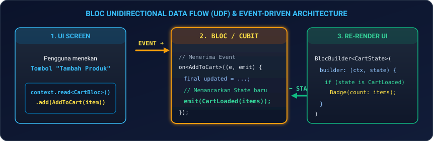
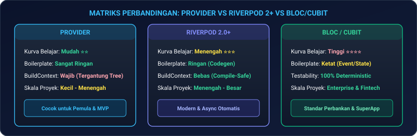

# Modul 04: State Management Lanjutan (Provider, Riverpod 2+, BLoC/Cubit)

Selamat datang di **Modul 04**! State Management adalah jantung dari setiap aplikasi mobile skala produksi. Di modul ini, Anda akan menguasai spektrum manajemen state secara menyeluruh: mulai dari reaktivitas bawaan Flutter (**`ValueNotifier` & `ListenableBuilder`**), pendekatan fundamental **`Provider`**, paradigma modern generasi baru **`Riverpod 2.0+`**, hingga standar ketat industri enterprise & fintech **`BLoC / Cubit`** beserta persistensi otomatis **`HydratedBloc`** dan **`bloc_concurrency`**.

---

## 📻 1. Analogi: Menara Siaran Radio & Pabrik Konveyor

Untuk memahami bagaimana data mengalir ke berbagai layar aplikasi:

| Paradigma | Analogi Nyata | Cara Kerja Teknis |
|---|---|---|
| **Ephemeral State (`setState`)** | **Lampu Meja Belajar Pribadi** | Saklar hanya menyalakan/mematikan lampu di meja Anda sendiri tanpa memengaruhi ruangan lain. |
| **Provider** | **Speaker Pengumuman Ruangan Kelas** | Guru mengumumkan informasi (`notifyListeners()`), dan murid di dalam kelas yang mendengarkan (`Consumer` / `context.watch()`) mencatat perubahan. |
| **Riverpod 2.0+** | **Jaringan Satelit Fiber-Optik Global** | Akses data super cepat dari mana saja tanpa membutuhkan tiang penyangga (`BuildContext`), aman dari error saat kompilasi (*compile-safe*), dan otomatis menangani loading/error. |
| **BLoC / Cubit** | **Pabrik Konveyor Otomatis Berstandar ISO** | Operator hanya boleh menekan tombol perintah resmi (**Event**), mesin pabrik memproses data secara tertutup (**BLoC**), lalu mengeluarkan produk dengan stempel resmi (**Immutable State**). |

---

## 🧭 2. Spektrum State Management: Ephemeral vs App State

<p align="center">
  
</p>

### 2.1 Reaktivitas Ringan Tanpa Package: `ValueNotifier` & `ListenableBuilder`
Di Flutter modern, Anda tidak selalu membutuhkan library pihak ketiga untuk state lokal yang sedikit kompleks:

```dart
class CounterWidget extends StatelessWidget {
  final ValueNotifier<int> _counter = ValueNotifier<int>(0);

  CounterWidget({super.key});

  @override
  Widget build(BuildContext context) {
    return ListenableBuilder(
      listenable: _counter,
      builder: (context, child) {
        return Row(
          children: [
            Text('Jumlah: ${_counter.value}'),
            IconButton(
              icon: const Icon(Icons.add),
              onPressed: () => _counter.value++,
            ),
          ],
        );
      },
    );
  }
}
```

---

## ⚡ 3. Provider: Fondasi Manajemen State Reaktif

`Provider` adalah wrapper resmi yang menyederhanakan `InheritedWidget` dengan arsitektur `ChangeNotifier`.

### 3.1 `context.watch()` vs `context.read()` vs `context.select()`

```dart
// 1. Model State dengan ChangeNotifier
class CartModel extends ChangeNotifier {
  final List<String> _items = [];
  List<String> get items => List.unmodifiable(_items);
  int get totalCount => _items.length;

  void tambahItem(String nama) {
    _items.add(nama);
    notifyListeners();
  }
}

// 2. Di dalam Widget UI:
Widget build(BuildContext context) {
  // ✅ BENAR untuk aksi tombol: Hanya membaca 1x tanpa berlangganan rebuild
  return ElevatedButton(
    onPressed: () => context.read<CartModel>().tambahItem('MacBook Pro M4'),
    child: const Text('Beli'),
  );
}

// 3. Optimasi Rebuild dengan context.select():
Widget buildBadge(BuildContext context) {
  // HANYA rebuild jika nilai totalCount berubah, perubahan lain diabaikan!
  final count = context.select<CartModel, int>((cart) => cart.totalCount);
  return Badge(label: Text('$count'));
}
```

---

## 🌊 4. Riverpod 2.0+ (Modern, Compile-Safe, & Code Generation)

Riverpod diciptakan oleh pembuat Provider (Remi Rousselet) untuk mengatasi semua keterbatasan Provider:
* **Tidak membutuhkan `BuildContext`** untuk membaca provider.
* **Bebas dari `ProviderNotFoundException`** saat runtime.
* **Dukungan `AsyncValue` bawaan** untuk status data jaringan (*loading*, *error*, *data*).

<p align="center">
  
</p>

### 4.1 Implementasi Modern Riverpod (Notifier & AsyncNotifier)

```dart
import 'package:flutter/material.dart';
import 'package:flutter_riverpod/flutter_riverpod.dart';

// 1. Provider Keranjang Belanja
class CartNotifier extends Notifier<List<String>> {
  @override
  List<String> build() => [];

  void tambah(String produk) {
    state = [...state, produk];
  }

  void hapus(int index) {
    state = [
      for (int i = 0; i < state.length; i++)
        if (i != index) state[i],
    ];
  }
}

final cartProvider = NotifierProvider<CartNotifier, List<String>>(CartNotifier.new);

// 2. UI dengan ConsumerWidget
class RiverpodCartPage extends ConsumerWidget {
  const RiverpodCartPage({super.key});

  @override
  Widget build(BuildContext context, WidgetRef ref) {
    final items = ref.watch(cartProvider);

    ref.listen<List<String>>(cartProvider, (previous, next) {
      if (next.length > (previous?.length ?? 0)) {
        ScaffoldMessenger.of(context).showSnackBar(
          const SnackBar(content: Text('Item berhasil ditambahkan ke troli! 🛒')),
        );
      }
    });

    return Scaffold(
      appBar: AppBar(title: Text('Troli (${items.length} Item)')),
      body: ListView.builder(
        itemCount: items.length,
        itemBuilder: (ctx, i) => ListTile(
          title: Text(items[i]),
          trailing: IconButton(
            icon: const Icon(Icons.delete, color: Colors.red),
            onPressed: () => ref.read(cartProvider.notifier).hapus(i),
          ),
        ),
      ),
      floatingActionButton: FloatingActionButton(
        onPressed: () => ref.read(cartProvider.notifier).tambah('iPhone 17 Pro'),
        child: const Icon(Icons.add),
      ),
    );
  }
}
```

---

### 4.2 Provider Modifiers: `.autoDispose` & `.family`

* **`.autoDispose`**: Otomatis menghancurkan (*dispose*) state dari memori saat layar ditutup agar tidak terjadi pemborosan RAM.
* **`.family`**: Mengizinkan provider menerima parameter dinamis (misal: ID produk untuk detail query).

```dart
// Mengambil detail produk berdasarkan productId dengan auto-cleanup memori
final productDetailProvider = FutureProvider.autoDispose.family<Product, String>((ref, productId) async {
  return await fetchProductFromApi(productId);
});
```

---

## 🏛️ 5. BLoC & Cubit: Standar Enterprise & Fintech

BLoC (*Business Logic Component*) memisahkan tampilan antarmuka secara mutlak dari logika bisnis menggunakan **Aliran Data Searah (*Unidirectional Data Flow / UDF*)**.

<p align="center">
  
</p>

### 5.1 Cubit (Solusi Cepat Berbasis Fungsi Langsung)
```dart
import 'package:flutter_bloc/flutter_bloc.dart';

class CounterCubit extends Cubit<int> {
  CounterCubit() : super(0);

  void increment() => emit(state + 1);
  void decrement() => emit(state - 1);
}
```

---

### 5.2 BLoC Penuh (Event-Driven untuk Sistem Kompleks)

```dart
import 'package:flutter_bloc/flutter_bloc.dart';

// 1. EVENTS
sealed class ProductEvent {}
class FetchProducts extends ProductEvent {}
class FilterByCategory extends ProductEvent {
  final String category;
  FilterByCategory(this.category);
}

// 2. STATES (Immutable Sealed Hierarchy)
sealed class ProductState {}
class ProductInitial extends ProductState {}
class ProductLoading extends ProductState {}
class ProductLoaded extends ProductState {
  final List<String> products;
  ProductLoaded(this.products);
}
class ProductError extends ProductState {
  final String message;
  ProductError(this.message);
}

// 3. BLOC LOGIC
class ProductBloc extends Bloc<ProductEvent, ProductState> {
  ProductBloc() : super(ProductInitial()) {
    on<FetchProducts>((event, emit) async {
      emit(ProductLoading());
      try {
        await Future.delayed(const Duration(seconds: 1));
        emit(ProductLoaded(['Laptop Gaming', 'Mechanical Keyboard', 'Monitor 4K']));
      } catch (e) {
        emit(ProductError('Gagal memuat produk dari server'));
      }
    });
  }
}
```

---

### 5.3 Komponen Widget BLoC di Flutter

| Widget BLoC | Kapan Digunakan? | Perilaku Re-render |
|---|---|---|
| **`BlocBuilder`** | Merender UI berdasarkan state saat ini. | Rebuild widget setiap kali ada `emit()` baru. |
| **`BlocListener`** | Menjalankan aksi efek samping (Navigasi halaman, SnackBar, Dialog). | **Tidak me-rebuild UI**, hanya memicu aksi 1 kali per state baru. |
| **`BlocConsumer`** | Menggabungkan fungsi `builder` dan `listener` sekaligus. | Rebuild UI sekaligus jalankan notifikasi SnackBar. |
| **`BlocSelector`** | Memfilter bagian spesifik dari state untuk rebuild super hemat memori. | Rebuild HANYA jika field yang dipilih berubah. |

---

### 5.4 Concurrency Transformers (`bloc_concurrency`)
Untuk mengontrol bagaimana event yang datang bertubi-tubi diproses (misal: tombol ditekan 5 kali dalam 1 detik):

```dart
import 'package:bloc_concurrency/bloc_concurrency.dart';

class SearchBloc extends Bloc<SearchEvent, SearchState> {
  SearchBloc() : super(SearchInitial()) {
    // restartable(): Membatalkan request pencarian lama jika pengguna mengetik huruf baru (Debounce alami)
    on<QueryChanged>((event, emit) async {
      final results = await searchApi(event.query);
      emit(SearchLoaded(results));
    }, transformer: restartable());

    // droppable(): Mengabaikan klik tombol baru jika proses sebelumnya belum selesai (Anti-Double Submit)
    on<SubmitPayment>((event, emit) async {
      await processPayment();
      emit(PaymentSuccess());
    }, transformer: droppable());
  }
}
```

---

### 5.5 Persistensi Otomatis dengan `HydratedBloc`
```dart
import 'package:hydrated_bloc/hydrated_bloc.dart';

class ThemeCubit extends HydratedCubit<bool> {
  ThemeCubit() : super(false);

  void toggleTheme() => emit(!state);

  @override
  Map<String, dynamic>? toJson(bool state) => {'isDark': state};

  @override
  bool? fromJson(Map<String, dynamic> json) => json['isDark'] as bool?;
}
```

---

## 📊 6. Matriks Perbandingan Industri: Kapan Pakai Apa?

<p align="center">
  
</p>

| Parameter Evaluasi | Provider | Riverpod 2.0+ | BLoC / Cubit |
|---|---|---|---|
| **Kurva Belajar** | Sangat Mudah ⭐⭐ | Menengah ⭐⭐⭐ | Menengah-Tinggi ⭐⭐⭐⭐ |
| **Boilerplate Kode** | Sangat Rendah | Rendah (dengan generator) | Sedang - Ketat |
| **Keterikatan BuildContext** | Wajib (di dalam tree) | Bebas (Compile-safe) | Tergantung Provider Tree |
| **Kemudahan Testing (Unit Test)** | Mudah | Sangat Mudah (`ProviderContainer`) | Sangat Mudah & Deterministik (`bloc_test`) |
| **Skala Rekomendasi** | Aplikasi Kecil - Menengah | Startup, SaaS, Skala Menengah ke Besar | Korporasi, Fintech, Bank, SuperApp |

---

## 💻 7. Hands-on Super Project: E-Commerce Multi-Filter & Reactive Cart Engine

Mari kita bangun aplikasi nyata berkinerja tinggi menggunakan pola **Cubit & BLoC** yang mengelola penyaringan produk secara instan dan keranjang belanja reaktif:

1. **Buat file baru** `lib/ecommerce_state_page.dart` di proyek Flutter Anda.
2. **Salin kode lengkap berikut**:

```dart
import 'package:flutter/material.dart';
import 'package:flutter_bloc/flutter_bloc.dart';

// ==========================================
// 1. DOMAIN MODEL & CUBIT STATE
// ==========================================
class Produk {
  final int id;
  final String nama;
  final String kategori;
  final int harga;
  const Produk(this.id, this.nama, this.kategori, this.harga);
}

final List<Produk> dataKatalog = [
  const Produk(1, 'MacBook Pro M4', 'Elektronik', 28000000),
  const Produk(2, 'iPhone 17 Pro', 'Elektronik', 21000000),
  const Produk(3, 'Hoodie Oversized', 'Pakaian', 350000),
  const Produk(4, 'Sneakers Retro 2026', 'Pakaian', 1250000),
  const Produk(5, 'Espresso Roast Beans', 'Makanan', 120000),
];

// CUBIT: Filter Kategori
class FilterCubit extends Cubit<String> {
  FilterCubit() : super('Semua');
  void pilihKategori(String kategori) => emit(kategori);
}

// CUBIT: Keranjang Belanja
class CartCubit extends Cubit<Map<Produk, int>> {
  CartCubit() : super({});

  void tambahProduk(Produk produk) {
    final updated = Map<Produk, int>.from(state);
    updated[produk] = (updated[produk] ?? 0) + 1;
    emit(updated);
  }

  void kurangiProduk(Produk produk) {
    final updated = Map<Produk, int>.from(state);
    if (updated.containsKey(produk)) {
      if (updated[produk]! > 1) {
        updated[produk] = updated[produk]! - 1;
      } else {
        updated.remove(produk);
      }
      emit(updated);
    }
  }

  int get totalHarga => state.entries.fold(0, (sum, entry) => sum + (entry.key.harga * entry.value));
  int get totalItem => state.values.fold(0, (sum, qty) => sum + qty);
}

// ==========================================
// 2. MAIN APP & PROVIDERS
// ==========================================
void main() {
  runApp(const SuperStoreApp());
}

class SuperStoreApp extends StatelessWidget {
  const SuperStoreApp({super.key});

  @override
  Widget build(BuildContext context) {
    return MultiBlocProvider(
      providers: [
        BlocProvider(create: (_) => FilterCubit()),
        BlocProvider(create: (_) => CartCubit()),
      ],
      child: MaterialApp(
        debugShowCheckedModeBanner: false,
        theme: ThemeData(useMaterial3: true, colorSchemeSeed: Colors.deepPurple),
        home: const CatalogPage(),
      ),
    );
  }
}

// ==========================================
// 3. UI SCREEN
// ==========================================
class CatalogPage extends StatelessWidget {
  const CatalogPage({super.key});

  @override
  Widget build(BuildContext context) {
    return Scaffold(
      appBar: AppBar(
        title: const Text('SuperStore 2026', style: TextStyle(fontWeight: FontWeight.bold)),
        actions: [
          // BlocBuilder untuk Badge Keranjang
          BlocBuilder<CartCubit, Map<Produk, int>>(
            builder: (context, cart) {
              final count = context.read<CartCubit>().totalItem;
              return Padding(
                padding: const EdgeInsets.only(right: 16.0),
                child: Badge(
                  label: Text('$count'),
                  isLabelVisible: count > 0,
                  child: IconButton(
                    icon: const Icon(Icons.shopping_cart),
                    onPressed: () => _bukaModalKeranjang(context),
                  ),
                ),
              );
            },
          ),
        ],
      ),
      body: Column(
        children: [
          // Filter Chips
          BlocBuilder<FilterCubit, String>(
            builder: (context, selectedCategory) {
              final kategoriList = ['Semua', 'Elektronik', 'Pakaian', 'Makanan'];
              return SingleChildScrollView(
                scrollDirection: Axis.horizontal,
                padding: const EdgeInsets.symmetric(horizontal: 16, vertical: 8),
                child: Row(
                  children: kategoriList.map((kat) {
                    final isSelected = selectedCategory == kat;
                    return Padding(
                      padding: const EdgeInsets.only(right: 8.0),
                      child: FilterChip(
                        selected: isSelected,
                        label: Text(kat),
                        onSelected: (_) => context.read<FilterCubit>().pilihKategori(kat),
                      ),
                    );
                  }).toList(),
                ),
              );
            },
          ),

          // Daftar Produk Terfilter
          Expanded(
            child: BlocBuilder<FilterCubit, String>(
              builder: (context, selectedCategory) {
                final filtered = selectedCategory == 'Semua'
                    ? dataKatalog
                    : dataKatalog.where((p) => p.kategori == selectedCategory).toList();

                return ListView.builder(
                  padding: const EdgeInsets.all(16),
                  itemCount: filtered.length,
                  itemBuilder: (ctx, i) {
                    final item = filtered[i];
                    return Card(
                      margin: const EdgeInsets.only(bottom: 12),
                      shape: RoundedRectangleBorder(borderRadius: BorderRadius.circular(12)),
                      child: ListTile(
                        title: Text(item.nama, style: const TextStyle(fontWeight: FontWeight.bold)),
                        subtitle: Text('Rp ${item.harga.toString().replaceAllMapped(RegExp(r'(\d{1,3})(?=(\d{3})+(?!\d))'), (m) => '${m[1]}.')}'),
                        trailing: ElevatedButton.icon(
                          onPressed: () {
                            context.read<CartCubit>().tambahProduk(item);
                            ScaffoldMessenger.of(context).hideCurrentSnackBar();
                            ScaffoldMessenger.of(context).showSnackBar(
                              SnackBar(
                                duration: const Duration(seconds: 1),
                                content: Text('Ditambahkan: ${item.nama}'),
                              ),
                            );
                          },
                          icon: const Icon(Icons.add_shopping_cart, size: 16),
                          label: const Text('Beli'),
                        ),
                      ),
                    );
                  },
                );
              },
            ),
          ),
        ],
      ),
    );
  }

  void _bukaModalKeranjang(BuildContext context) {
    showModalBottomSheet(
      context: context,
      isScrollControlled: true,
      builder: (_) {
        return BlocProvider.value(
          value: context.read<CartCubit>(),
          child: const CartBottomSheet(),
        );
      },
    );
  }
}

// Modal Rincian Keranjang
class CartBottomSheet extends StatelessWidget {
  const CartBottomSheet({super.key});

  @override
  Widget build(BuildContext context) {
    return Container(
      height: MediaQuery.of(context).size.height * 0.6,
      padding: const EdgeInsets.all(20),
      child: BlocBuilder<CartCubit, Map<Produk, int>>(
        builder: (context, cart) {
          if (cart.isEmpty) {
            return const Center(
              child: Text('Keranjang Belanja Kosong 🛒', style: TextStyle(fontSize: 16)),
            );
          }

          final cartItems = cart.entries.toList();
          final total = context.read<CartCubit>().totalHarga;

          return Column(
            crossAxisAlignment: CrossAxisAlignment.stretch,
            children: [
              const Text('Rincian Belanja', style: TextStyle(fontSize: 20, fontWeight: FontWeight.bold)),
              const Divider(),
              Expanded(
                child: ListView.builder(
                  itemCount: cartItems.length,
                  itemBuilder: (ctx, i) {
                    final entry = cartItems[i];
                    return ListTile(
                      title: Text(entry.key.nama),
                      subtitle: Text('${entry.value} x Rp ${entry.key.harga}'),
                      trailing: Row(
                        mainAxisSize: MainAxisSize.min,
                        children: [
                          IconButton(
                            icon: const Icon(Icons.remove_circle_outline),
                            onPressed: () => context.read<CartCubit>().kurangiProduk(entry.key),
                          ),
                          Text('${entry.value}', style: const TextStyle(fontWeight: FontWeight.bold)),
                          IconButton(
                            icon: const Icon(Icons.add_circle_outline),
                            onPressed: () => context.read<CartCubit>().tambahProduk(entry.key),
                          ),
                        ],
                      ),
                    );
                  },
                ),
              ),
              const Divider(),
              Text('Total Pembayaran: Rp $total', style: const TextStyle(fontSize: 18, fontWeight: FontWeight.bold, color: Colors.deepPurple)),
              const SizedBox(height: 12),
              ElevatedButton(
                onPressed: () => Navigator.pop(context),
                style: ElevatedButton.styleFrom(backgroundColor: Colors.deepPurple, foregroundColor: Colors.white, padding: const EdgeInsets.symmetric(vertical: 14)),
                child: const Text('Lanjut ke Pembayaran'),
              ),
            ],
          );
        },
      ),
    );
  }
}
```

3. **Jalankan Aplikasi**:
   ```bash
   flutter run
   ```
   *Amati bagaimana state filter dan keranjang belanja saling berkomunikasi secara instan tanpa ada lag sedikit pun!*

---

## ⚠️ 8. Jebakan Umum (*Common Pitfalls*) & Solusi Kilat

| Kesalahan Umum | Dampak Error | Solusi yang Benar |
|---|---|---|
| **1. Menggunakan `context.watch()` di luar `build()`** | `InheritedWidget.dependOnInheritedElement() called outside of build()` | Gunakan `context.read()` saat berada di dalam tombol `onPressed` atau method lifecycle. |
| **2. Mutasi State Langsung (*Direct State Mutation*)** | UI tidak mau me-rebuild karena referensi objek tidak berubah (`state.add(item)`). | Selalu buat salinan objek/list baru: `emit([...state, item])` atau `state = [...state, item]`. |
| **3. Lupa `ProviderScope` di Root Riverpod** | Error saat runtime: `ProviderScope not found in widget tree`. | Selalu bungkus `runApp(const ProviderScope(child: MyApp()))`. |
| **4. Membuka Dialog di dalam `BlocBuilder`** | Dialog muncul berulang kali setiap kali layar me-rebuild. | Pindahkan logika dialog ke dalam **`BlocListener`** (hanya dieksekusi 1 kali per perubahan state). |
| **5. Menempatkan BlocProvider Terlalu Rendah** | Halaman baru tidak bisa menemukan instance BLoC saat di-push ke rute baru. | Gunakan `BlocProvider.value()` untuk meneruskan instance, atau inisialisasi di level global via `MultiBlocProvider`. |

---

## 📝 9. Kuis Pemahaman Modul 04

1. **Kapan kita harus menggunakan `context.read()` dibandingkan `context.watch()` pada Provider?**  
   *Jawaban:* Gunakan `context.read()` untuk membaca nilai atau memanggil method satu kali saja (misal: di dalam event callback `onPressed`) tanpa berlangganan terhadap perubahan data. Gunakan `context.watch()` di dalam method `build()` ketika tampilan UI harus otomatis me-rebuild setiap kali datanya berubah.
2. **Apa keunggulan utama `AsyncValue` pada Riverpod 2.0+?**  
   *Jawaban:* `AsyncValue` menyediakan pattern matching terstruktur (`.when()`) yang secara otomatis menangani tiga status data asynchronous sekaligus (*data*, *loading*, dan *error*) sehingga mencegah runtime crash akibat data null yang belum selesai diambil dari API.
3. **Bagaimana peran `bloc_concurrency` dalam mencegah double-submit formulir?**  
   *Jawaban:* Transformer `droppable()` dari `bloc_concurrency` mengabaikan (*drop*) semua event baru yang masuk saat event sebelumnya masih diproses, sehingga mencegah pengiriman transaksi ganda jika tombol ditekan berulang kali secara agresif.

---

## 🎯 Rangkuman & Checklist Kompetensi

- [x] Memahami perbedaan mendasar Ephemeral State vs App State.
- [x] Menguasai reaktivitas bawaan Flutter dengan `ValueNotifier` dan `ListenableBuilder`.
- [x] Menguasai `Provider`: `ChangeNotifier`, `context.watch()`, `context.read()`, dan `context.select()`.
- [x] Menguasai `Riverpod 2.0+`: `NotifierProvider`, `ConsumerWidget`, `ref.watch()`, `ref.listen()`, `AsyncValue`, `.autoDispose`, dan `.family`.
- [x] Menguasai arsitektur enterprise `BLoC` & `Cubit`: Events, Immutable States, `BlocBuilder`, `BlocListener`, `BlocConsumer`, dan `BlocSelector`.
- [x] Mengimplementasikan Concurrency Event Transformers (`bloc_concurrency`: `restartable`, `droppable`).
- [x] Memahami persistensi state otomatis menggunakan `HydratedBloc`.
- [x] Mampu memilih solusi state management yang tepat berdasarkan skala proyek.
- [x] Berhasil membangun proyek mini E-Commerce Multi-Filter & Reactive Cart Engine.

---

👉 **Langkah Selanjutnya**: Fondasi manajemen state Anda sudah sekelas profesional! Mari melangkah ke **[Modul 05: Networking Lanjutan, REST API (Dio), & WebSockets Realtime](../modul-05-networking-dan-api/README.md)** untuk menghubungkan aplikasi Anda ke server backend modern.
