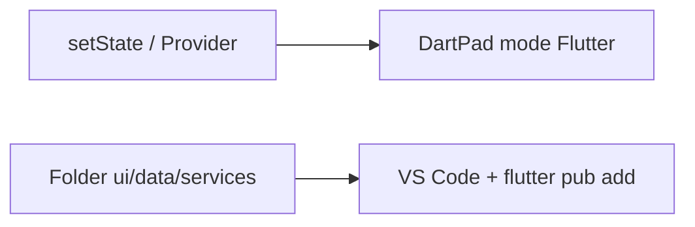
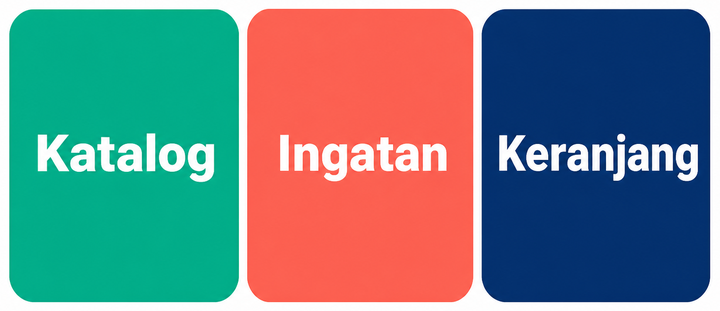
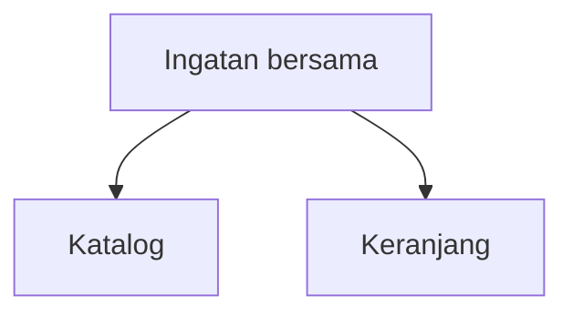
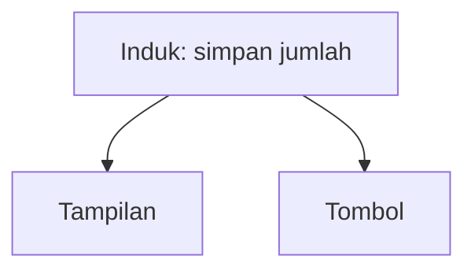
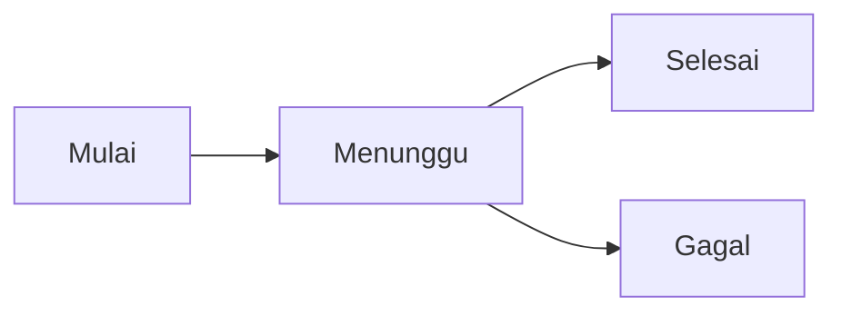
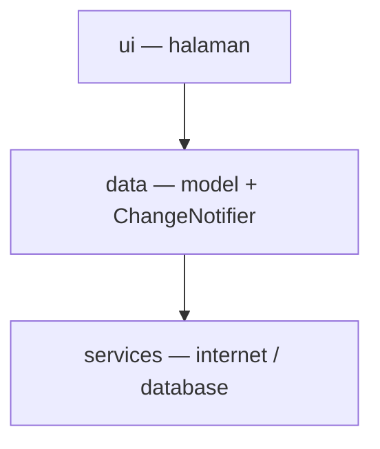

# Modul 04 — State: siapa yang ingat data?

**Waktu:** 2 sesi  
**Prasyarat:** Modul 00–03.  
**Hasil:** Nanti Anda bisa menyimpan data yang tidak hilang saat pindah halaman, pakai `provider`, dan pisahkan tampilan dari logika.

---

## Buka alat ini dulu

Ada **dua jalur uji**. Jangan sampai tertukar.

| Jalur | Buka | Untuk apa |
| --- | --- | --- |
| A | Browser → [dartpad.dev](https://dartpad.dev) → mode **Flutter** | `setState`, lift state, FutureBuilder, StreamBuilder, **Provider** |
| B | VS Code + Terminal (`Ctrl + J`) + emulator/HP | `flutter pub add provider`, folder `ui / data / services` |




Sumber gambar: [dart.dev/tools/dartpad](https://dart.dev/tools/dartpad), Dart team / Google ([CC BY 4.0](https://creativecommons.org/licenses/by/4.0/)). Foto di atas **mode Dart**. Untuk modul ini pilih mode **Flutter**.

Paket `provider` **ada** di daftar paket DartPad ([Package and plugin support](https://github.com/dart-lang/dart-pad/wiki/Package-and-plugin-support)). Jadi `import 'package:provider/provider.dart'` boleh di DartPad. Beda dengan `go_router` di Modul 03.

### Dua jenis kode di halaman ini

| Jenis | Tanda | Caranya |
| --- | --- | --- |
| **Berkas lengkap** | Ada `import` dan `void main()` | Tempel utuh, lalu **Run** |
| **Cuplikan** | Hanya potongan | Jangan di-Run sendirian |

### Pola uji A — DartPad Flutter

| | |
| --- | --- |
| **Buka** | [dartpad.dev](https://dartpad.dev) |
| **Pilih** | mode **Flutter** |
| **Tempel** | **berkas lengkap** |
| **Klik** | **Run** |
| **Lihat** | panel kanan: pratinjau aplikasi |

### Pola uji B — proyek lokal

| | |
| --- | --- |
| **Buka** | VS Code di folder proyek Flutter, emulator atau HP sudah menyala |
| **Terminal** | `Ctrl + J` |
| **Ketik** | `flutter pub add provider` lalu `flutter run` |

> **Aturan emas:** perintah `flutter ...` hanya di **Terminal VS Code**. DartPad tidak menjalankan `flutter pub add` — tapi `provider` sudah tersedia di DartPad, jadi uji jalur A tidak perlu perintah itu.

---

## 1. State = ingatan aplikasi saat ini

State bukan file di HP. Itu **Modul 05**. State di modul ini: angka, daftar, status loading yang hidup **selama app masih terbuka**. Tutup app → ingatan ini hilang. Itu wajar.

Analogi: toko. Halaman **Katalog** dan halaman **Keranjang** harus baca ingatan yang **sama**. Kalau masing-masing ingat sendiri, total belanja bisa beda.



*Ilustrasi asli materi mobile2026. Tiga peran: halaman katalog, ingatan bersama, halaman keranjang. Penjelasan ada di teks.*



Dokumentasi Flutter membedakan dua jenis ([Ephemeral vs app state](https://docs.flutter.dev/data-and-backend/state-mgmt/ephemeral-vs-app)):

| Jenis | Artinya | Contoh | Alat |
| --- | --- | --- | --- |
| **Lokal** (*ephemeral*) | cukup di satu widget | tab yang sedang dipilih, animasi | `setState` |
| **Bersama** (*app state*) | dipakai banyak halaman | isi keranjang, status login | Provider (materi ini) |

Tidak ada garis ajaib. Tab bawah bisa tetap `setState`. Keranjang yang harus kelihatan di AppBar **dan** di halaman lain: itu state bersama.

Sumber konsep: [State management](https://docs.flutter.dev/data-and-backend/state-mgmt/intro). Flutter and the related logo are trademarks of Google LLC.

---

## 2. `setState` — cukup untuk yang kecil

`setState` bilang ke Flutter: “data berubah, gambar ulang widget ini.” App penghitung bawaan `flutter create` memakai pola ini.

### Uji 1 — penghitung di satu halaman

| | |
| --- | --- |
| **Buka** | DartPad, mode Flutter |
| **Tempel** | berkas lengkap |
| **Klik** | **Run**, lalu ketuk **Tambah** |

```dart
import 'package:flutter/material.dart';

void main() => runApp(const MateriApp());

class MateriApp extends StatelessWidget {
  const MateriApp({super.key});

  @override
  Widget build(BuildContext context) {
    return const MaterialApp(home: PenghitungPage());
  }
}

class PenghitungPage extends StatefulWidget {
  const PenghitungPage({super.key});

  @override
  State<PenghitungPage> createState() => _PenghitungPageState();
}

class _PenghitungPageState extends State<PenghitungPage> {
  int jumlah = 0;

  @override
  Widget build(BuildContext context) {
    return Scaffold(
      appBar: AppBar(title: const Text('setState')),
      body: Center(
        child: Column(
          mainAxisSize: MainAxisSize.min,
          children: [
            Text('Jumlah: $jumlah', style: Theme.of(context).textTheme.headlineMedium),
            const SizedBox(height: 16),
            FilledButton(
              onPressed: () {
                setState(() {
                  jumlah++;
                });
              },
              child: const Text('Tambah'),
            ),
          ],
        ),
      ),
    );
  }
}
```

**Kalau berhasil:** angka di layar naik setiap ketuk.

`setState` mulai terasa sesak kalau:

- data dibutuhkan di **dua halaman**;
- banyak widget harus ikut berubah;
- ada loading dari internet (status `menunggu` / `gagal` / `isi`).

---

## 3. Lift state up: data naik ke induk

Kalau dua anak widget butuh angka yang sama, angka itu **tidak** disimpan di anak. Naikkan ke widget induk, lalu turunkan sebagai argumen. Dokumentasi Flutter menyebutnya *lifting state up* ([Simple app state management](https://docs.flutter.dev/data-and-backend/state-mgmt/simple)).



### Uji 2 — dua widget, satu angka

| | |
| --- | --- |
| **Buka** | DartPad, mode Flutter |
| **Tempel** | berkas lengkap |
| **Klik** | **Run**, ketuk **Tambah** — teks di atas ikut berubah |

```dart
import 'package:flutter/material.dart';

void main() => runApp(const MateriApp());

class MateriApp extends StatelessWidget {
  const MateriApp({super.key});

  @override
  Widget build(BuildContext context) {
    return const MaterialApp(home: IndukPage());
  }
}

class IndukPage extends StatefulWidget {
  const IndukPage({super.key});

  @override
  State<IndukPage> createState() => _IndukPageState();
}

class _IndukPageState extends State<IndukPage> {
  int jumlah = 0;

  void tambah() {
    setState(() {
      jumlah++;
    });
  }

  @override
  Widget build(BuildContext context) {
    return Scaffold(
      appBar: AppBar(title: const Text('Lift state')),
      body: Center(
        child: Column(
          mainAxisSize: MainAxisSize.min,
          children: [
            LabelJumlah(jumlah: jumlah),
            const SizedBox(height: 16),
            TombolTambah(onTambah: tambah),
          ],
        ),
      ),
    );
  }
}

class LabelJumlah extends StatelessWidget {
  const LabelJumlah({super.key, required this.jumlah});

  final int jumlah;

  @override
  Widget build(BuildContext context) {
    return Text('Jumlah: $jumlah', style: Theme.of(context).textTheme.headlineMedium);
  }
}

class TombolTambah extends StatelessWidget {
  const TombolTambah({super.key, required this.onTambah});

  final VoidCallback onTambah;

  @override
  Widget build(BuildContext context) {
    return FilledButton(onPressed: onTambah, child: const Text('Tambah'));
  }
}
```

**Kalau berhasil:** tombol dan teks tidak saling “berbisik”. Induk yang memegang angka.

Pola ini jujur, tapi cepat berantakan: callback diturunkan lewat banyak lapisan (*prop drilling*). Provider menggantikan antrean callback itu.

---

## 4. FutureBuilder dan StreamBuilder

Kadang datanya **belum ada**. Unduhan, jeda palsu, detak waktu. Jangan membekukan layar. Tampilkan loading dulu.



### Uji 3 — FutureBuilder (loading palsu)

| | |
| --- | --- |
| **Buka** | DartPad, mode Flutter |
| **Tempel** | berkas lengkap |
| **Klik** | **Run**, tunggu ±2 detik |

```dart
import 'package:flutter/material.dart';

void main() => runApp(const MateriApp());

class MateriApp extends StatelessWidget {
  const MateriApp({super.key});

  @override
  Widget build(BuildContext context) {
    return const MaterialApp(home: UnduhPage());
  }
}

Future<String> ambilNama() async {
  await Future.delayed(const Duration(seconds: 2));
  return 'Siti';
}

class UnduhPage extends StatelessWidget {
  const UnduhPage({super.key});

  @override
  Widget build(BuildContext context) {
    return Scaffold(
      appBar: AppBar(title: const Text('FutureBuilder')),
      body: Center(
        child: FutureBuilder<String>(
          future: ambilNama(),
          builder: (context, snapshot) {
            if (snapshot.connectionState == ConnectionState.waiting) {
              return const CircularProgressIndicator();
            }
            if (snapshot.hasError) {
              return Text('Gagal: ${snapshot.error}');
            }
            return Text(
              'Halo, ${snapshot.data}',
              style: Theme.of(context).textTheme.headlineMedium,
            );
          },
        ),
      ),
    );
  }
}
```

**Kalau berhasil:** spinner dulu, lalu teks `Halo, Siti`.

Jangan membuat `Future` baru di dalam `build()` untuk data sungguhan — `build` bisa dipanggil berkali-kali, unduhan ikut diulang. Di uji ini `ambilNama()` dipanggil dari `future:` supaya kelihatan; pola rapi: simpan `Future` di `State.initState`, atau (lebih baik untuk app) di ChangeNotifier. Cookbook: [Fetch data from the internet](https://docs.flutter.dev/cookbook/networking/fetch-data).

### Uji 4 — StreamBuilder (detik)

| | |
| --- | --- |
| **Buka** | DartPad, mode Flutter |
| **Tempel** | berkas lengkap |
| **Klik** | **Run**, lihat angka naik tiap detik |

```dart
import 'package:flutter/material.dart';

void main() => runApp(const MateriApp());

class MateriApp extends StatelessWidget {
  const MateriApp({super.key});

  @override
  Widget build(BuildContext context) {
    return const MaterialApp(home: DetikPage());
  }
}

class DetikPage extends StatelessWidget {
  const DetikPage({super.key});

  @override
  Widget build(BuildContext context) {
    return Scaffold(
      appBar: AppBar(title: const Text('StreamBuilder')),
      body: Center(
        child: StreamBuilder<int>(
          stream: Stream<int>.periodic(
            const Duration(seconds: 1),
            (i) => i,
          ),
          builder: (context, snapshot) {
            final n = snapshot.data ?? 0;
            return Text('Detik: $n', style: Theme.of(context).textTheme.headlineMedium);
          },
        ),
      ),
    );
  }
}
```

**Kalau berhasil:** angka bertambah sendiri, tanpa tombol.

`Future` = satu kali. `Stream` = berulang. Firebase dan beberapa API memakai stream; itu **Modul 06**.

---

## 5. Provider — pilihan utama materi ini

Dokumentasi Flutter bilang: kalau tidak ada alasan kuat memilih yang lain, mulai dari paket `provider`. API-nya pendek, dan konsepnya (model → beri tahu pendengar → gambar ulang) dipakai pendekatan lain juga. Sumber: [Simple app state management](https://docs.flutter.dev/data-and-backend/state-mgmt/simple).

Tiga nama yang perlu diingat:

| Nama | Peran |
| --- | --- |
| `ChangeNotifier` | kotak ingatan; panggil `notifyListeners()` setelah data berubah |
| `ChangeNotifierProvider` | taruh kotak itu **di atas** halaman yang butuh |
| `Consumer` | widget yang ikut gambar ulang saat kotak berubah |

Di DartPad: langsung `import`. Di proyek lokal: `flutter pub add` dulu (pola uji B).

### Uji 5 — keranjang mini dengan Provider

| | |
| --- | --- |
| **Buka** | DartPad, mode Flutter |
| **Tempel** | berkas lengkap |
| **Klik** | **Run**, ketuk **Tambah nasi** |

```dart
import 'package:flutter/material.dart';
import 'package:provider/provider.dart';

void main() {
  runApp(
    ChangeNotifierProvider(
      create: (_) => Keranjang(),
      child: const MateriApp(),
    ),
  );
}

class MateriApp extends StatelessWidget {
  const MateriApp({super.key});

  @override
  Widget build(BuildContext context) {
    return const MaterialApp(home: TokoPage());
  }
}

class Keranjang extends ChangeNotifier {
  int jumlahNasi = 0;

  void tambahNasi() {
    jumlahNasi++;
    notifyListeners();
  }
}

class TokoPage extends StatelessWidget {
  const TokoPage({super.key});

  @override
  Widget build(BuildContext context) {
    return Scaffold(
      appBar: AppBar(title: const Text('Provider')),
      body: Center(
        child: Column(
          mainAxisSize: MainAxisSize.min,
          children: [
            Consumer<Keranjang>(
              builder: (context, keranjang, child) {
                return Text(
                  'Nasi: ${keranjang.jumlahNasi}',
                  style: Theme.of(context).textTheme.headlineMedium,
                );
              },
            ),
            const SizedBox(height: 16),
            FilledButton(
              onPressed: () {
                context.read<Keranjang>().tambahNasi();
              },
              child: const Text('Tambah nasi'),
            ),
          ],
        ),
      ),
    );
  }
}
```

**Kalau berhasil:** angka naik, tanpa `setState` di halaman.

`ChangeNotifierProvider` sebaiknya tidak lebih tinggi dari yang perlu. Untuk app kecil, membungkus `MaterialApp` (atau `MaterialApp.router`) sudah cukup.

Beberapa model sekaligus: `MultiProvider` (cuplikan, jangan di-Run sendirian):

```dart
MultiProvider(
  providers: [
    ChangeNotifierProvider(create: (_) => Keranjang()),
    ChangeNotifierProvider(create: (_) => TemaModel()),
  ],
  child: const MateriApp(),
)
```

---

## 6. `read`, `watch`, `Consumer`, `Selector`

Sama-sama mengambil `Keranjang`. Bedanya: **siapa yang ikut rebuild**.

| Cara | Kapan | Rebuild? |
| --- | --- | --- |
| `context.read<Keranjang>()` | di `onPressed`, panggil metode | tidak |
| `context.watch<Keranjang>()` | di `build`, butuh semua field | widget itu ya |
| `Consumer<Keranjang>` | hanya sebagian pohon widget | builder-nya ya |
| `Selector` / `context.select` | hanya satu nilai, misalnya total | hanya kalau nilai itu berubah |

`read` di dalam `build` (bukan di tombol) biasanya salah: layar tidak ikut update.

### Uji 6 — hanya total yang di-watch

| | |
| --- | --- |
| **Buka** | DartPad, mode Flutter |
| **Tempel** | berkas lengkap |
| **Klik** | **Run**, tambah / kurang |

```dart
import 'package:flutter/material.dart';
import 'package:provider/provider.dart';

void main() {
  runApp(
    ChangeNotifierProvider(
      create: (_) => Keranjang(),
      child: const MateriApp(),
    ),
  );
}

class MateriApp extends StatelessWidget {
  const MateriApp({super.key});

  @override
  Widget build(BuildContext context) {
    return const MaterialApp(home: KasirPage());
  }
}

class Keranjang extends ChangeNotifier {
  int nasi = 0;
  int teh = 0;

  int get totalItem => nasi + teh;

  void tambahNasi() {
    nasi++;
    notifyListeners();
  }

  void kurangNasi() {
    if (nasi == 0) return;
    nasi--;
    notifyListeners();
  }
}

class KasirPage extends StatelessWidget {
  const KasirPage({super.key});

  @override
  Widget build(BuildContext context) {
    final total = context.select<Keranjang, int>((k) => k.totalItem);

    return Scaffold(
      appBar: AppBar(title: Text('Item: $total')),
      body: Center(
        child: Column(
          mainAxisSize: MainAxisSize.min,
          children: [
            Selector<Keranjang, int>(
              selector: (_, k) => k.nasi,
              builder: (_, nasi, __) => Text('Nasi: $nasi'),
            ),
            const SizedBox(height: 12),
            FilledButton(
              onPressed: () => context.read<Keranjang>().tambahNasi(),
              child: const Text('Tambah nasi'),
            ),
            const SizedBox(height: 8),
            OutlinedButton(
              onPressed: () => context.read<Keranjang>().kurangNasi(),
              child: const Text('Kurang nasi'),
            ),
          ],
        ),
      ),
    );
  }
}
```

**Kalau berhasil:** AppBar menampilkan jumlah item; tombol kurang tidak membuat angka negatif.

Taruh `Consumer` / `Selector` **sedalam mungkin**. Jangan membungkus seluruh `Scaffold` kalau yang berubah cuma satu `Text`.

---

## 7. Sekilas Riverpod dan Bloc

Tidak perlu dipilih sekarang. Cukup tahu namanya, supaya tidak kaget di lowongan kerja.

| Paket | Kapan orang memakainya | Di materi ini |
| --- | --- | --- |
| `provider` | mulai, API lurus, dekat dokumentasi Flutter | **standar** |
| `riverpod` | butuh pengecekan lebih ketat saat kompilasi | pengenalan saja |
| `flutter_bloc` | event dan state dipisah; sering di tim besar | pengenalan saja |

Ketiganya ada di [daftar paket DartPad](https://github.com/dart-lang/dart-pad/wiki/Package-and-plugin-support). Tetap: latihan dan mini proyek memakai **Provider**.

---

## 8. GetX: sering muncul, bukan standar materi ini

Di video berbahasa Indonesia, GetX sering jadi paket “semua urusan”. Paket itu **boleh** dipakai di proyek lain. Materi ini **tidak** memakainya sebagai standar. Alasannya, bukan karena “salah”:

1. Dokumentasi Flutter mengarahkan ke Provider dulu.
2. Modul 03 sudah memakai `go_router`. GetX punya cara rute sendiri; mencampur dua gaya bikin peta halaman kacau.
3. Provider dekat dengan cara Flutter bekerja (`ChangeNotifier`, pohon widget). Pindah ke Riverpod nanti tidak mulai dari nol.

Kalau tempat kerja mewajibkan GetX, fondasi di sini tetap kepakai: state bersama, loading, dan “UI jangan panggil internet langsung”.

---

## 9. Folder `ui / data / services` — hanya jalur B

Halaman jangan mengetik `http.get` di tengah tombol. Pisahkan tiga peran. Analogi: ruang tamu, buku catatan, dan kurir.


*Ilustrasi asli materi mobile2026. Tiga folder: tampilan, data, layanan. Penjelasan ada di teks.*



| Folder | Isi | Contoh |
| --- | --- | --- |
| `lib/ui/` | halaman, widget | `katalog_page.dart` |
| `lib/data/` | model, `ChangeNotifier` | `keranjang.dart` |
| `lib/services/` | unduhan, Firebase, file | menyusul Modul 05–07 |

**Aturan:** UI tidak memanggil internet / database secara langsung. UI bicara ke `Keranjang` (data). `Keranjang` yang bicara ke `services`. Di modul ini, “layanan”-nya masih palsu: `Future.delayed`.

### Uji 7 — pasang paket di proyek lokal

| | |
| --- | --- |
| **Buka** | VS Code, folder proyek Flutter |
| **Terminal** | `Ctrl + J` |
| **Ketik** | |

```powershell
flutter pub add provider
```

**Kalau berhasil:** `pubspec.yaml` memuat baris `provider`.

Lalu buat folder (tidak perlu DartPad):

```text
lib/
  main.dart
  ui/
    katalog_page.dart
    keranjang_page.dart
  data/
    keranjang.dart
  services/
    katalog_palsu.dart
```

Cuplikan `lib/services/katalog_palsu.dart` (jangan di-Run sendirian):

```dart
class KatalogPalsu {
  Future<List<String>> ambilNama() async {
    await Future.delayed(const Duration(milliseconds: 600));
    return ['Nasi goreng', 'Es teh', 'Kopi'];
  }
}
```

`Keranjang` memanggil `KatalogPalsu`. Halaman **tidak**.

---

## Mini proyek: keranjang belanja (jalur A)

Syarat silabus: tambah, kurang, total selalu benar, plus status loading palsu.

| | |
| --- | --- |
| **Buka** | DartPad, mode Flutter |
| **Tempel** | berkas lengkap |
| **Klik** | **Run** — tambah dari katalog, buka keranjang, kurang di sana |

```dart
import 'package:flutter/material.dart';
import 'package:provider/provider.dart';

void main() {
  runApp(
    ChangeNotifierProvider(
      create: (_) => Keranjang(),
      child: const MateriApp(),
    ),
  );
}

class MateriApp extends StatelessWidget {
  const MateriApp({super.key});

  @override
  Widget build(BuildContext context) {
    return const MaterialApp(home: KatalogPage());
  }
}

class Barang {
  const Barang(this.nama, this.harga);
  final String nama;
  final int harga;
}

const daftarKatalog = [
  Barang('Nasi goreng', 15000),
  Barang('Es teh', 5000),
  Barang('Kopi', 8000),
];

class Keranjang extends ChangeNotifier {
  final Map<String, int> _jumlah = {};
  bool sedangMuat = false;

  int jumlahOf(String nama) => _jumlah[nama] ?? 0;

  int get totalItem => _jumlah.values.fold(0, (a, b) => a + b);

  int get totalRupiah {
    var total = 0;
    for (final b in daftarKatalog) {
      total += b.harga * jumlahOf(b.nama);
    }
    return total;
  }

  Future<void> tambah(Barang barang) async {
    sedangMuat = true;
    notifyListeners();
    await Future.delayed(const Duration(milliseconds: 400));
    _jumlah[barang.nama] = jumlahOf(barang.nama) + 1;
    sedangMuat = false;
    notifyListeners();
  }

  void kurang(Barang barang) {
    final n = jumlahOf(barang.nama);
    if (n == 0) return;
    if (n == 1) {
      _jumlah.remove(barang.nama);
    } else {
      _jumlah[barang.nama] = n - 1;
    }
    notifyListeners();
  }
}

class KatalogPage extends StatelessWidget {
  const KatalogPage({super.key});

  @override
  Widget build(BuildContext context) {
    final totalItem = context.select<Keranjang, int>((k) => k.totalItem);
    final muat = context.select<Keranjang, bool>((k) => k.sedangMuat);

    return Scaffold(
      appBar: AppBar(
        title: const Text('Katalog'),
        actions: [
          if (muat)
            const Padding(
              padding: EdgeInsets.all(16),
              child: SizedBox(
                width: 20,
                height: 20,
                child: CircularProgressIndicator(strokeWidth: 2),
              ),
            ),
          IconButton(
            tooltip: 'Keranjang',
            onPressed: () {
              Navigator.of(context).push(
                MaterialPageRoute<void>(
                  builder: (_) => const KeranjangPage(),
                ),
              );
            },
            icon: Badge(
              isLabelVisible: totalItem > 0,
              label: Text('$totalItem'),
              child: const Icon(Icons.shopping_cart_outlined),
            ),
          ),
        ],
      ),
      body: ListView.builder(
        itemCount: daftarKatalog.length,
        itemBuilder: (context, i) {
          final b = daftarKatalog[i];
          return ListTile(
            title: Text(b.nama),
            subtitle: Text('Rp${b.harga}'),
            trailing: FilledButton(
              onPressed: muat ? null : () => context.read<Keranjang>().tambah(b),
              child: const Text('Tambah'),
            ),
          );
        },
      ),
    );
  }
}

class KeranjangPage extends StatelessWidget {
  const KeranjangPage({super.key});

  @override
  Widget build(BuildContext context) {
    final keranjang = context.watch<Keranjang>();

    return Scaffold(
      appBar: AppBar(title: const Text('Keranjang')),
      body: Column(
        children: [
          Expanded(
            child: ListView(
              children: [
                for (final b in daftarKatalog)
                  if (keranjang.jumlahOf(b.nama) > 0)
                    ListTile(
                      title: Text(b.nama),
                      subtitle: Text('x${keranjang.jumlahOf(b.nama)}'),
                      trailing: IconButton(
                        onPressed: () => keranjang.kurang(b),
                        icon: const Icon(Icons.remove_circle_outline),
                      ),
                    ),
              ],
            ),
          ),
          Padding(
            padding: const EdgeInsets.all(16),
            child: Text(
              'Total: Rp${keranjang.totalRupiah}',
              style: Theme.of(context).textTheme.titleLarge,
            ),
          ),
        ],
      ),
    );
  }
}
```

**Kalau berhasil:** badge keranjang naik, spinner singkat saat tambah, halaman keranjang menampilkan isi yang sama, total cocok dengan harga × jumlah, tombol kurang menurunkan isi.

Di jalur B, pecah berkas itu ke `lib/data/keranjang.dart` dan `lib/ui/`. `ChangeNotifierProvider` tetap di `main.dart`, **di atas** `MaterialApp` (atau `MaterialApp.router` kalau memakai `go_router` dari Modul 03). Data masih hilang saat app ditutup; itu wajar sampai Modul 05.

---

## Kesalahan yang sering terjadi

| Gejala | Penyebab yang sering | Perbaikan |
| --- | --- | --- |
| `provider` error di DartPad | mode **Dart**, bukan Flutter | Ganti mode Flutter |
| `Could not find the correct Provider` | `read`/`watch` di luar `ChangeNotifierProvider` | Bungkus app di `main()` |
| Tombol menambah, layar diam | `read` di `build`, atau lupa `notifyListeners()` | `watch` / `Consumer`; panggil `notifyListeners` |
| Loading muter terus | `Future` baru di setiap `build` | Simpan Future di `State` atau di notifier |
| Total keranjang beda di dua halaman | dua object `Keranjang` | Satu `create:`, jangan `Keranjang()` di tiap halaman |
| `flutter pub add` di DartPad | salah alat | Terminal VS Code, atau langsung import di DartPad |
| Seluruh halaman rebuild berat | `watch` di puncak `Scaffold` | `Selector` / `Consumer` di widget yang berubah |

---

## Latihan

1. (DartPad) Di Uji 1, tambah tombol **Reset** ke 0.
2. (DartPad) Di Uji 3, ganti `ambilNama` supaya kadang `throw Exception('Jaringan putus')`, lalu tampilkan cabang error.
3. (DartPad) Di mini proyek, tambah metode `kosongkan()` di `Keranjang` (hapus semua isi + `notifyListeners`), lalu tombol **Kosongkan** di halaman keranjang.
4. (DartPad) Pakai `Selector` untuk `totalRupiah` di AppBar halaman keranjang.
5. (Jalur B) Pecah mini proyek ke folder `ui/` dan `data/`, lalu `flutter run`.

---

## Kuis singkat

1. Kapan `setState` masih pantas, dan kapan data harus naik ke Provider?
2. `context.read` dipakai di mana: di `build`, atau di `onPressed`?
3. Perintah `flutter pub add provider` diketik di mana?
4. UI boleh memanggil internet langsung? Kenapa?

Kunci jawaban di bawah. Coba jawab dulu.

---

## Apa yang belum dibahas

- Menyimpan keranjang ke HP (SharedPreferences, Drift, token) → **Modul 05**
- Firebase sebagai “dapur” sungguhan → Modul 06
- REST + `dio` → Modul 07
- Riverpod / Bloc mendalam → tidak di jalur wajib

---

## Kunci kuis

1. `setState` untuk ingatan satu widget (tab, penghitung lokal). Provider saat data dipakai banyak halaman, misalnya keranjang.
2. Di `onPressed` (atau callback). Di `build` pakai `watch` / `select` / `Consumer`.
3. Terminal VS Code di folder proyek. Di DartPad tidak perlu: `provider` sudah tersedia.
4. Tidak. UI bicara ke lapisan data; unduhan ada di `services` (di modul ini masih palsu).

---

## Sumber gambar dan tautan

| Aset | Sumber |
| --- | --- |
| `images/analogi-ingatan.png` | Ilustrasi asli materi mobile2026 |
| `images/analogi-folder.png` | Ilustrasi asli materi mobile2026 |
| Tampilan DartPad | [dart.dev/assets/img/dartpad-hello.png](https://dart.dev/assets/img/dartpad-hello.png) dari [dart.dev/tools/dartpad](https://dart.dev/tools/dartpad) ([CC BY 4.0](https://creativecommons.org/licenses/by/4.0/)) |
| Pengantar state | [docs.flutter.dev/data-and-backend/state-mgmt/intro](https://docs.flutter.dev/data-and-backend/state-mgmt/intro) |
| Ephemeral vs app state | [docs.flutter.dev/data-and-backend/state-mgmt/ephemeral-vs-app](https://docs.flutter.dev/data-and-backend/state-mgmt/ephemeral-vs-app) |
| Provider di dokumentasi Flutter | [docs.flutter.dev/data-and-backend/state-mgmt/simple](https://docs.flutter.dev/data-and-backend/state-mgmt/simple) |
| Paket `provider` | [pub.dev/packages/provider](https://pub.dev/packages/provider) |
| FutureBuilder / unduhan | [docs.flutter.dev/cookbook/networking/fetch-data](https://docs.flutter.dev/cookbook/networking/fetch-data) |
| Paket DartPad | [dart-lang/dart-pad wiki](https://github.com/dart-lang/dart-pad/wiki/Package-and-plugin-support) |

Flutter and the related logo are trademarks of Google LLC. We are not endorsed by or affiliated with Google LLC.
