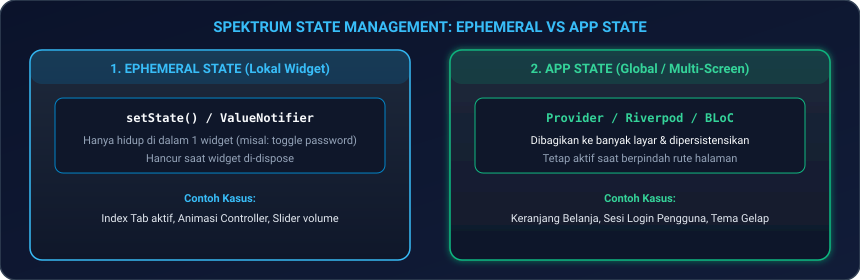
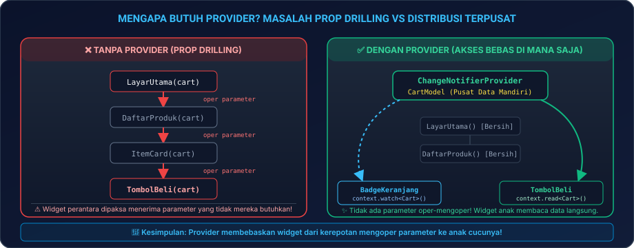
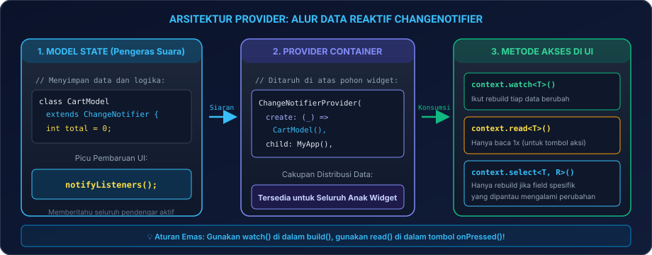
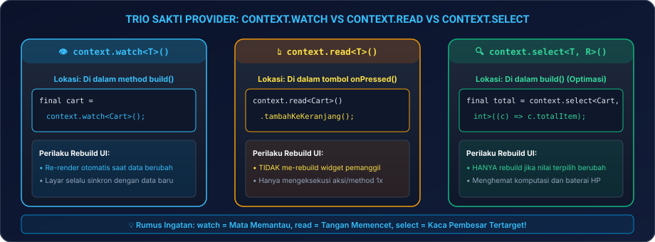

# Modul 04A: Fondasi State, Reaktivitas Bawaan, & Provider

Selamat datang di **Modul 04A**! Jika tampilan antarmuka (widget) adalah "wajah" dari aplikasi Flutter Anda, maka **State (Data/Kondisi Aplikasi)** adalah "ingatan dan jalan pikirannya". 

Banyak pemula merasa gentar ketika mendengar istilah *State Management*. Namun, jangan khawatir! Di modul ini, kita akan membedah konsep state mulai dari hal paling mendasar dengan bahasa yang santai, visual, dan ramah pemula. Anda akan mempelajari bagaimana data disimpan, diubah, dan disiarkan ke berbagai penjuru layar aplikasi menggunakan pustaka resmi yang paling fundamental: **Provider**!

---

## 🛠️ 00. Persiapan Praktik: Di Mana & Bagaimana Menguji Kode State?

Sebelum mulai menulis logika data, mari kita siapkan lingkungan kerja di laptop Anda agar tidak ada rasa bingung:

### 1. Langkah Persiapan Proyek di VS Code
1. Buka terminal laptop Anda (PowerShell di Windows, Terminal di Mac/Linux), lalu jalankan perintah:
   ```bash
   flutter create belajar_state_04a
   code belajar_state_04a
   ```
2. Di dalam VS Code, buka berkas utama yang akan menjadi kanvas eksperimen Anda: [`lib/main.dart`](file:///lib/main.dart).
3. Buka **Terminal Terintegrasi** di VS Code dengan menekan tombol kombinasi **``Ctrl + ` ``** (atau `Cmd + ` di macOS).

### 2. Memasang Pustaka Provider Resmi
Pustaka Provider adalah rekomendasi resmi tim Flutter Google untuk pemula. Pasang pustaka ini dengan mengetik perintah berikut di terminal VS Code:

```bash
flutter pub add provider
```
*Tunggu beberapa detik hingga proses instalasi selesai dan terminal menampilkan pesan sukses.*

> [!TIP]
> **Uji Coba Cepat Tanpa Instalasi via Browser**:  
> Jika laptop Anda sedang tidak membuka emulator atau perangkat fisik, seluruh konsep pada modul ini dapat Anda coba secara langsung di peramban web Chrome melalui **[DartPad Flutter](https://dartpad.dev/flutter)**.

### 3. Tabel Pintasan Esensial (*Cheat-Sheet Tools*)
Pintasan berikut akan sangat menghemat waktu Anda saat bereksperimen dengan pembaruan data:

| Aksi / Kebutuhan | Tombol Pintasan / Perintah | Keterangan Praktis |
|---|---|---|
| **Buka Terminal VS Code** | **``Ctrl + ` ``** (atau `Cmd + ` di Mac) | Memasang paket pustaka via `flutter pub add provider` |
| **Jalankan Aplikasi** | **`F5`** atau `flutter run` | Menjalankan aplikasi ke emulator Android / Google Chrome |
| **Hot Reload (Instan)** | **`Ctrl + S`** atau tekan **`r`** di terminal | Menyegarkan pembaruan tampilan UI dalam hitungan milidetik |
| **Hot Restart (Penuh)** | **`Ctrl + Shift + F5`** atau tekan **`R`** | Mengosongkan memori dan mereset data state dari nilai awal |
| **Flutter DevTools** | **`Ctrl + Shift + P`** -> ketik *DevTools* | Memeriksa pohon widget dan mendeteksi pemborosan rebuild |

---

### 4. Panduan Cara Menguji Setiap Contoh Kode di Modul Ini
Agar Anda tidak bingung di mana harus menempelkan (*paste*) potongan-potongan sintaks yang Anda temukan di bab-bab selanjutnya:
1. **Untuk Contoh Potongan Kode Kecil (Bab 03, Bab 04, Bab 05)**:
   Gunakan **Kanvas Uji Coba Mandiri** di bawah ini sebagai wadah. Cukup ganti widget `HalamanLatihanState` dengan widget latihan yang sedang Anda pelajari!
2. **Untuk Proyek Akhir (Bab 07)**:
   Hapus seluruh isi berkas `lib/main.dart`, lalu tempelkan seluruh kode proyek Bab 07 secara utuh.

---

### 5. Kanvas Uji Coba Mandiri (*Boilerplate Canvas*)
Berikut adalah kerangka kerja dasar berbasis **`Provider`** yang siap Anda salin ke `lib/main.dart` untuk menguji reaktivitas data pertama Anda:

```dart
import 'package:flutter/material.dart';
import 'package:provider/provider.dart';

void main() {
  runApp(
    // 1. Bungkus aplikasi dengan Provider agar datanya bisa diakses dari layar mana saja:
    ChangeNotifierProvider(
      create: (context) => PenghitungModel(),
      child: const AplikasiStateSaya(),
    ),
  );
}

// 2. Model Data Reaktif:
class PenghitungModel extends ChangeNotifier {
  int _angka = 0;
  int get angka => _angka;

  void tambah() {
    _angka++;
    notifyListeners(); // Siarkan kabar perubahan ke seluruh widget yang mendengarkan!
  }
}

class AplikasiStateSaya extends StatelessWidget {
  const AplikasiStateSaya({super.key});

  @override
  Widget build(BuildContext context) {
    return MaterialApp(
      title: 'Belajar State 2026',
      debugShowCheckedModeBanner: false,
      theme: ThemeData(
        useMaterial3: true,
        colorSchemeSeed: Colors.deepPurple,
        fontFamily: 'sans-serif', // Menggunakan font lokal agar bebas error font tofu di Web
      ),
      home: const HalamanLatihanState(),
    );
  }
}

class HalamanLatihanState extends StatelessWidget {
  const HalamanLatihanState({super.key});

  @override
  Widget build(BuildContext context) {
    // 3. context.watch: Mendengarkan perubahan angka secara otomatis
    final totalAngka = context.watch<PenghitungModel>().angka;

    return Scaffold(
      appBar: AppBar(
        title: const Text('Latihan State Dasar'),
        backgroundColor: Colors.deepPurple,
        foregroundColor: Colors.white,
      ),
      body: Center(
        child: Column(
          mainAxisAlignment: MainAxisAlignment.center,
          children: [
            const Text('Angka Saat Ini:', style: TextStyle(fontSize: 16)),
            Text(
              '$totalAngka',
              style: const TextStyle(fontSize: 48, fontWeight: FontWeight.bold, color: Colors.deepPurple),
            ),
          ],
        ),
      ),
      floatingActionButton: FloatingActionButton(
        // 4. context.read: Menjalankan aksi tombol tanpa me-rebuild tombol itu sendiri
        onPressed: () => context.read<PenghitungModel>().tambah(),
        child: const Icon(Icons.add),
      ),
    );
  }
}
```

Tekan **`F5`** untuk menjalankan aplikasi. Setiap kali tombol `+` ditekan, teks angka akan langsung bertambah secara reaktif!

---

## 📻 01. Analogi Sederhana: Saklar Lampu Kamar vs Pengeras Suara Kelas

Untuk memahami mengapa kita butuh manajemen state, bayangkan dua skenario nyata ini:

| Pendekatan Flutter | Analogi Kehidupan Nyata | Cara Kerja Teknis |
|---|---|---|
| **`setState` Bawaan** | **Lampu Meja Belajar Pribadi** | Saklar hanya menyalakan atau mematikan lampu di meja kamar Anda sendiri. Kamar lain atau orang di luar rumah tidak tahu dan tidak terpengaruh. |
| **Pustaka `Provider`** | **Pengeras Suara Ruang Kelas** | Guru berbicara lewat mikrofon (`notifyListeners()`), dan seluruh murid di dalam kelas yang sedang mendengarkan (`context.watch()`) serentak mencatat informasi baru. |

---

## 🧭 02. Spektrum State: Ephemeral State vs App State

Dalam aplikasi mobile dunia nyata, data terbagi menjadi dua kelompok besar:

<p align="center">
  
</p>
<p align="center"><em>Gambar 1: Spektrum State Management Flutter: Ephemeral State vs App State. (Sumber: Dokumentasi Resmi Flutter - flutter.dev).</em></p>

### 1. Ephemeral State (Local UI State)
* **Pengertian**: Data yang hanya diperlukan oleh **satu widget tunggal** dan tidak ada widget lain di halaman lain yang peduli pada data tersebut.
* **Contoh Kasus**:
  - Status centang pada kotak *Checkbox*.
  - Posisi halaman aktif pada banner *PageView*.
  - Status buka-tutup teks kata sandi (*Password Visibility Toggle*).
* **Solusi**: Cukup gunakan `setState()` atau `ValueNotifier`.

### 2. App State (Shared / Global State)
* **Pengertian**: Data yang dibutuhkan bersama oleh **banyak halaman sekaligus** dan harus tetap tersimpan saat pengguna berpindah-pindah rute.
* **Contoh Kasus**:
  - Keranjang belanja toko online (diakses di katalog, di AppBar, dan di layar checkout).
  - Status autentikasi login dan profil akun pengguna.
  - Pilihan tema aplikasi (Mode Terang vs Mode Gelap).
* **Solusi**: Wajib menggunakan **Provider** (atau Riverpod/BLoC).

---

## 💡 03. Reaktivitas Ringan Bawaan Flutter: `ValueNotifier` & `ListenableBuilder`

Tahukah Anda bahwa untuk state lokal yang agak kompleks, Anda tidak selalu harus memasang package pihak ketiga? Flutter modern telah menyediakan alat bawaan bernama **`ValueNotifier`** dan **`ListenableBuilder`**.

### Kapan Menggunakan `ValueNotifier`?
Gunakan ketika Anda memiliki data tunggal yang sering berubah (misal: skor permainan, status animasi, counter waktu) dan Anda **tidak ingin seluruh layar me-rebuild**, melainkan hanya teks angkanya saja!

Berikut adalah contoh mandiri yang siap Anda uji:

```dart
import 'package:flutter/material.dart';

void main() {
  runApp(const MaterialApp(
    debugShowCheckedModeBanner: false,
    home: Scaffold(body: Center(child: KotakHitungSkor())),
  ));
}

class KotakHitungSkor extends StatelessWidget {
  // 1. Variabel reaktif bernilai tunggal bawaan Flutter:
  final ValueNotifier<int> _skor = ValueNotifier<int>(0);

  KotakHitungSkor({super.key});

  @override
  Widget build(BuildContext context) {
    return Column(
      mainAxisAlignment: MainAxisAlignment.center,
      children: [
        // 2. ListenableBuilder HANYA me-rebuild teks di dalamnya, sangat hemat baterai HP!
        ListenableBuilder(
          listenable: _skor,
          builder: (context, child) {
            return Text(
              'Skor Game: ${_skor.value}',
              style: const TextStyle(fontSize: 24, fontWeight: FontWeight.bold),
            );
          },
        ),
        const SizedBox(height: 16),
        ElevatedButton.icon(
          icon: const Icon(Icons.star, color: Colors.amber),
          label: const Text('Tambah Skor (+10)'),
          onPressed: () => _skor.value += 10,
        ),
      ],
    );
  }
}
```

---

## ⚡ 04. Pustaka Resmi Provider: Solusi Masalah Prop Drilling

Ketika aplikasi Anda mulai memiliki banyak halaman (misal: Halaman Katalog, Kartu Produk, dan Layar Checkout), mengoper data lewat parameter konstruktor widget dari atas ke bawah (*Prop Drilling*) akan membuat kode Anda sangat rapuh dan berantakan.

<p align="center">
  
</p>
<p align="center"><em>Gambar 2: Perbandingan Masalah Prop Drilling tanpa Provider vs Distribusi Data Terpusat dengan Provider. (Sumber: Dokumentasi Resmi Flutter - flutter.dev).</em></p>

### Mengapa Provider Menjadi Solusi Terbaik?
Seperti yang terlihat pada Gambar 2 di atas:
* **Tanpa Provider**: Setiap widget perantara (meskipun tidak butuh data keranjang) terpaksa harus menerima parameter dan meneruskannya ke anaknya.
* **Dengan Provider**: Model diletakkan di wadah terpusat. Widget anak di kedalaman mana pun bisa langsung membaca atau mengubah data tanpa merepotkan widget perantara!

---

<p align="center">
  
</p>
<p align="center"><em>Gambar 3: Alur Data Reaktif ChangeNotifier pada Pustaka Provider. (Sumber: Dokumentasi Resmi Flutter - flutter.dev).</em></p>

### Anatomi 2 Komponen Inti Provider:
1. **`ChangeNotifier` (Pabrik / Model Data)**:
   Kelas Dart biasa yang dicampur (*mixin*) atau mewarisi `ChangeNotifier`. Di dalamnya, kita menulis variabel data dan method untuk mengubah data. Di akhir perubahan, kita memanggil `notifyListeners()`.
2. **`ChangeNotifierProvider` (Kabel Penghubung)**:
   Widget yang membungkus pohon aplikasi Anda, bertugas menyediakan instance model data ke seluruh widget anak di bawahnya.

---

## 🎯 05. Tiga Mantra Sakti Provider: `watch`, `read`, & `select`

Ini adalah bagian paling penting dalam memahami Provider! Jangan sampai tertukar dalam penggunaannya:

<p align="center">
  
</p>
<p align="center"><em>Gambar 4: Perbandingan Perilaku Akses Data Trio Sakti Provider: watch, read, dan select. (Sumber: Dokumentasi Resmi Provider - pub.dev/packages/provider).</em></p>

| Mantra Akses | Lokasi Pemanggilan Wajib | Dampak terhadap Rebuild UI |
|---|---|---|
| **`context.watch<T>()`** | Di dalam method **`build()`** | **Ikut Rebuild**. Setiap kali ada data baru, widget tempat kode ini berada akan digambar ulang secara otomatis. |
| **`context.read<T>()`** | Di dalam tombol **`onPressed`** / fungsi aksi | **TIDAK Rebuild**. Hanya membaca nilai satu kali atau memanggil fungsi aksi tanpa mendaftar untuk ikut rebuild. |
| **`context.select<T, R>()`** | Di dalam method **`build()`** (Optimasi) | **Rebuild Bersyarat**. Hanya me-rebuild jika properti spesifik yang dipantau mengalami perubahan. |

---

### Mengenal Widget `Consumer<T>`: Isolasi Rebuild yang Rapi
Selain `context.watch()`, Anda akan sering menjumpai widget **`Consumer<T>`** di berbagai dokumentasi dan tutorial resmi. Apa itu `Consumer`?

`Consumer` adalah widget pembungkus yang berfungsi mengisolasi pemanggilan `watch` agar **hanya area di dalam `builder` Consumer saja yang me-rebuild**, sementara widget di sekelilingnya tetap tenang:

```dart
// Menggunakan Consumer:
Consumer<PenghitungModel>(
  builder: (context, model, child) {
    // HANYA widget Text ini yang akan digambar ulang saat angka berubah:
    return Text('Nilai: ${model.angka}');
  },
)
```

> [!TIP]
> **Trik Optimasi Parameter `child` pada Consumer**:  
> Jika di dalam Consumer Anda memiliki komponen berat (misalnya gambar poster produk berukuran besar), oper komponen tersebut ke parameter `child`. Flutter tidak akan me-rebuild komponen `child` tersebut berulang kali!

---

### Kotak Panduan: Do's and Don'ts
> [!CAUTION]
> **JANGAN PERNAH** memanggil `context.watch()` di dalam fungsi callback tombol seperti `onPressed()`!
> 
> ```dart
> // ❌ SALAH (Memicu runtime crash: dependOnInheritedElement called outside build):
> ElevatedButton(
>   onPressed: () {
>     context.watch<CartModel>().tambahItem(); 
>   },
>   child: const Text('Beli Sekarang'),
> )
> 
> // ✅ BENAR (Gunakan read untuk tombol aksi):
> ElevatedButton(
>   onPressed: () {
>     context.read<CartModel>().tambahItem();
>   },
>   child: const Text('Beli Sekarang'),
> )
> ```

---

## 📦 06. Mengelola Banyak Data dengan `MultiProvider`

Dalam aplikasi skala riil, Anda akan memiliki banyak model data (misalnya: status login, keranjang belanja, dan pengaturan tema). Gunakan **`MultiProvider`** agar kode aplikasi Anda rapi dan tidak bersarang (*nesting*) terlalu dalam:

```dart
void main() {
  runApp(
    MultiProvider(
      providers: [
        ChangeNotifierProvider(create: (_) => AutentikasiModel()),
        ChangeNotifierProvider(create: (_) => KeranjangBelanjaModel()),
        ChangeNotifierProvider(create: (_) => PengaturanTemaModel()),
      ],
      child: const AplikasiTokoKita(),
    ),
  );
}
```

> [!NOTE]
> **Catatan Pemula**: Kode di atas adalah susunan cetak biru konseptual (*blueprint*) ketika aplikasi Anda memiliki lebih dari satu model data. Anda tidak perlu membuat model-model tersebut sekarang. Untuk melihat aplikasi lengkap yang siap dijalankan dari awal hingga akhir, mari langsung melangkah ke **Bab 07** di bawah!

---

## 💻 07. Hands-On Project 04A: TokoKita Cart & Wishlist Reaktif

Mari kita satukan seluruh pemahaman Provider ke dalam aplikasi katalog toko online lengkap yang **mandiri, rapi, dan siap dijalankan**.

### Salin Seluruh Kode Ini ke `lib/main.dart`:

```dart
import 'package:flutter/material.dart';
import 'package:provider/provider.dart';

// ==========================================
// 1. MODEL DATA PRODUK
// ==========================================
class Produk {
  final int id;
  final String nama;
  final String kategori;
  final int harga;

  const Produk({
    required this.id,
    required this.nama,
    required this.kategori,
    required this.harga,
  });
}

// Data Dummy Katalog TokoKita
final List<Produk> dataKatalogToko = [
  const Produk(id: 1, nama: 'MacBook Air M3', kategori: 'Laptop', harga: 18500000),
  const Produk(id: 2, nama: 'Mechanical Keyboard RGB', kategori: 'Aksesoris', harga: 850000),
  const Produk(id: 3, nama: 'Headset Wireless Pro', kategori: 'Audio', harga: 1200000),
  const Produk(id: 4, nama: 'Mouse Ergonomis 2026', kategori: 'Aksesoris', harga: 450000),
  const Produk(id: 5, nama: 'Monitor 4K UltraWide', kategori: 'Display', harga: 6500000),
];

// ==========================================
// 2. MODEL STATE PROVIDER: KERANJANG & WISHLIST
// ==========================================
class TokoKitaProvider extends ChangeNotifier {
  // Data Keranjang: Map<Produk, Jumlah>
  final Map<Produk, int> _keranjang = {};
  // Data Wishlist: Set ID Produk Favorit
  final Set<int> _wishlist = {};

  Map<Produk, int> get keranjang => Map.unmodifiable(_keranjang);
  Set<int> get wishlist => Set.unmodifiable(_wishlist);

  // Hitung Total Item dan Total Biaya Belanja
  int get totalItemKeranjang => _keranjang.values.fold(0, (sum, qty) => sum + qty);
  int get totalHargaBelanja => _keranjang.entries.fold(0, (sum, entry) => sum + (entry.key.harga * entry.value));

  // Aksi Tambah ke Keranjang
  void tambahKeKeranjang(Produk produk) {
    if (_keranjang.containsKey(produk)) {
      _keranjang[produk] = _keranjang[produk]! + 1;
    } else {
      _keranjang[produk] = 1;
    }
    notifyListeners(); // Siarkan kabar perubahan data ke UI!
  }

  // Aksi Kurangi dari Keranjang
  void kurangiDariKeranjang(Produk produk) {
    if (_keranjang.containsKey(produk)) {
      if (_keranjang[produk]! > 1) {
        _keranjang[produk] = _keranjang[produk]! - 1;
      } else {
        _keranjang.remove(produk);
      }
      notifyListeners();
    }
  }

  // Aksi Kosongkan Keranjang setelah Checkout
  void kosongkanKeranjang() {
    _keranjang.clear();
    notifyListeners();
  }

  // Aksi Toggle Wishlist (Favorit)
  void toggleWishlist(int produkId) {
    if (_wishlist.contains(produkId)) {
      _wishlist.remove(produkId);
    } else {
      _wishlist.add(produkId);
    }
    notifyListeners();
  }

  bool isFavorite(int produkId) => _wishlist.contains(produkId);
}

// ==========================================
// 3. ROOT APLIKASI
// ==========================================
void main() {
  runApp(
    // Daftarkan Provider di atas MaterialApp agar dapat diakses dari halaman & modal mana saja:
    ChangeNotifierProvider(
      create: (_) => TokoKitaProvider(),
      child: const TokoKitaApp(),
    ),
  );
}

class TokoKitaApp extends StatelessWidget {
  const TokoKitaApp({super.key});

  @override
  Widget build(BuildContext context) {
    return MaterialApp(
      title: 'TokoKita Provider 2026',
      debugShowCheckedModeBanner: false,
      theme: ThemeData(
        useMaterial3: true,
        colorSchemeSeed: const Color(0xFF2563EB), // Warna Biru Elegan
        fontFamily: 'sans-serif', // Mencegah error font tofu di Flutter Web
      ),
      home: const HalamanKatalogProduk(),
    );
  }
}

// ==========================================
// 4. HALAMAN KATALOG PRODUK
// ==========================================
class HalamanKatalogProduk extends StatelessWidget {
  const HalamanKatalogProduk({super.key});

  @override
  Widget build(BuildContext context) {
    return Scaffold(
      appBar: AppBar(
        title: const Text('TokoKita Gadget 2026', style: TextStyle(fontWeight: FontWeight.bold)),
        backgroundColor: const Color(0xFF2563EB),
        foregroundColor: Colors.white,
        actions: [
          // Pantau jumlah item keranjang menggunakan context.select untuk performa maksimal:
          Builder(
            builder: (ctx) {
              final totalItem = ctx.select<TokoKitaProvider, int>((p) => p.totalItemKeranjang);
              return Padding(
                padding: const EdgeInsets.only(right: 12.0),
                child: Badge(
                  label: Text('$totalItem'),
                  isLabelVisible: totalItem > 0,
                  child: IconButton(
                    icon: const Icon(Icons.shopping_cart_outlined),
                    onPressed: () => _tampilkanModalKeranjang(context),
                  ),
                ),
              );
            },
          ),
        ],
      ),
      body: ListView.builder(
        padding: const EdgeInsets.all(12),
        itemCount: dataKatalogToko.length,
        itemBuilder: (ctx, i) {
          final produk = dataKatalogToko[i];
          // Pantau status wishlist produk ini secara spesifik:
          final isFav = ctx.select<TokoKitaProvider, bool>((p) => p.isFavorite(produk.id));

          return Card(
            margin: const EdgeInsets.only(bottom: 12),
            elevation: 2,
            shape: RoundedRectangleBorder(borderRadius: BorderRadius.circular(12)),
            child: ListTile(
              leading: CircleAvatar(
                backgroundColor: const Color(0xFFEFF6FF),
                child: Icon(Icons.devices, color: Theme.of(context).primaryColor),
              ),
              title: Text(produk.nama, style: const TextStyle(fontWeight: FontWeight.bold)),
              subtitle: Text(
                'Rp ${produk.harga.toString().replaceAllMapped(RegExp(r'(\d{1,3})(?=(\d{3})+(?!\d))'), (m) => '${m[1]}.')}',
                style: const TextStyle(color: Color(0xFF2563EB), fontWeight: FontWeight.w600),
              ),
              trailing: Row(
                mainAxisSize: MainAxisSize.min,
                children: [
                  // Tombol Toggle Wishlist (Hati)
                  IconButton(
                    icon: Icon(isFav ? Icons.favorite : Icons.favorite_border, color: isFav ? Colors.red : Colors.grey),
                    onPressed: () => ctx.read<TokoKitaProvider>().toggleWishlist(produk.id),
                  ),
                  // Tombol Tambah ke Keranjang (Beli)
                  ElevatedButton(
                    onPressed: () {
                      ctx.read<TokoKitaProvider>().tambahKeKeranjang(produk);
                      ScaffoldMessenger.of(context).hideCurrentSnackBar();
                      ScaffoldMessenger.of(context).showSnackBar(
                        SnackBar(
                          duration: const Duration(milliseconds: 800),
                          content: Text('🛒 Ditambahkan ke keranjang: ${produk.nama}'),
                        ),
                      );
                    },
                    style: ElevatedButton.styleFrom(
                      backgroundColor: const Color(0xFF2563EB),
                      foregroundColor: Colors.white,
                    ),
                    child: const Text('Beli'),
                  ),
                ],
              ),
            ),
          );
        },
      ),
    );
  }

  void _tampilkanModalKeranjang(BuildContext context) {
    showModalBottomSheet(
      context: context,
      isScrollControlled: true,
      showDragHandle: true,
      shape: const RoundedRectangleBorder(
        borderRadius: BorderRadius.vertical(top: Radius.circular(20)),
      ),
      builder: (_) {
        return const LembarRincianKeranjang();
      },
    );
  }
}

// ==========================================
// 5. MODAL BOTTOM SHEET RINCIAN KERANJANG
// ==========================================
class LembarRincianKeranjang extends StatelessWidget {
  const LembarRincianKeranjang({super.key});

  @override
  Widget build(BuildContext context) {
    // Gunakan context.watch untuk mendengarkan pembaruan daftar belanja di dalam modal:
    final provider = context.watch<TokoKitaProvider>();
    final daftarKeranjang = provider.keranjang.entries.toList();

    return Container(
      height: MediaQuery.of(context).size.height * 0.65,
      padding: const EdgeInsets.symmetric(horizontal: 20, vertical: 10),
      child: daftarKeranjang.isEmpty
          ? const Center(
              child: Column(
                mainAxisAlignment: MainAxisAlignment.center,
                children: [
                  Icon(Icons.remove_shopping_cart_outlined, size: 70, color: Colors.grey),
                  SizedBox(height: 12),
                  Text('Keranjang belanja Anda masih kosong!', style: TextStyle(fontSize: 16, color: Colors.grey)),
                ],
              ),
            )
          : Column(
              crossAxisAlignment: CrossAxisAlignment.stretch,
              children: [
                const Text('Keranjang Belanja Anda', style: TextStyle(fontSize: 18, fontWeight: FontWeight.bold)),
                const Divider(height: 20),
                Expanded(
                  child: ListView.builder(
                    itemCount: daftarKeranjang.length,
                    itemBuilder: (ctx, i) {
                      final item = daftarKeranjang[i];
                      return ListTile(
                        contentPadding: EdgeInsets.zero,
                        title: Text(item.key.nama, style: const TextStyle(fontWeight: FontWeight.w600)),
                        subtitle: Text(
                          '${item.value} x Rp ${item.key.harga.toString().replaceAllMapped(RegExp(r'(\d{1,3})(?=(\d{3})+(?!\d))'), (m) => '${m[1]}.')}',
                        ),
                        trailing: Row(
                          mainAxisSize: MainAxisSize.min,
                          children: [
                            IconButton(
                              icon: const Icon(Icons.remove_circle_outline, color: Colors.red),
                              onPressed: () => ctx.read<TokoKitaProvider>().kurangiDariKeranjang(item.key),
                            ),
                            Text('${item.value}', style: const TextStyle(fontSize: 16, fontWeight: FontWeight.bold)),
                            IconButton(
                              icon: const Icon(Icons.add_circle_outline, color: Colors.green),
                              onPressed: () => ctx.read<TokoKitaProvider>().tambahKeKeranjang(item.key),
                            ),
                          ],
                        ),
                      );
                    },
                  ),
                ),
                const Divider(height: 20),
                Row(
                  mainAxisAlignment: MainAxisAlignment.spaceBetween,
                  children: [
                    const Text('Total Biaya:', style: TextStyle(fontSize: 16, fontWeight: FontWeight.w600)),
                    Text(
                      'Rp ${provider.totalHargaBelanja.toString().replaceAllMapped(RegExp(r'(\d{1,3})(?=(\d{3})+(?!\d))'), (m) => '${m[1]}.')}',
                      style: const TextStyle(fontSize: 20, fontWeight: FontWeight.bold, color: Color(0xFF2563EB)),
                    ),
                  ],
                ),
                const SizedBox(height: 16),
                ElevatedButton(
                  onPressed: () {
                    // Amankan referensi sebelum menutup modal (Pola Defensif):
                    final messenger = ScaffoldMessenger.of(context);
                    final provider = context.read<TokoKitaProvider>();

                    // 1. Tutup modal keranjang:
                    Navigator.pop(context);
                    // 2. Kosongkan keranjang belanja:
                    provider.kosongkanKeranjang();
                    // 3. Tampilkan notifikasi sukses belanja:
                    messenger.showSnackBar(
                      const SnackBar(
                        backgroundColor: Colors.green,
                        duration: Duration(seconds: 2),
                        content: Text('🎉 Pembayaran Berhasil! Pesanan Anda segera dikirim.'),
                      ),
                    );
                  },
                  style: ElevatedButton.styleFrom(
                    backgroundColor: const Color(0xFF2563EB),
                    foregroundColor: Colors.white,
                    padding: const EdgeInsets.symmetric(vertical: 14),
                    shape: RoundedRectangleBorder(borderRadius: BorderRadius.circular(10)),
                  ),
                  child: const Text('Lanjut Pembayaran 💳', style: TextStyle(fontSize: 16, fontWeight: FontWeight.bold)),
                ),
                const SizedBox(height: 10),
              ],
            ),
    );
  }
}
```

Jalankan dengan menekan **`F5`**! Coba tekan tombol hati untuk wishlist dan beli beberapa barang untuk melihat badge serta kalkulasi total harga reaktif di dalam keranjang!

---

## ⚠️ 08. Troubleshooting & 7 Jebakan Provider Umum

| No | Gejala / Pesan Kesalahan | Penyebab Utama | Solusi Kilat |
|---|---|---|---|
| **1** | *"dependOnInheritedElement() called outside of build()"* | Anda memanggil `context.watch()` di dalam fungsi callback tombol `onPressed()` atau di method `initState()`. | Ganti menjadi `context.read()` saat berada di dalam tombol aksi atau event handler. |
| **2** | *"Could not find the correct Provider<T> above this Widget"* | Anda mencoba membaca provider dari widget yang posisinya berada di atas deklarasi `ChangeNotifierProvider`. | Pindahkan `ChangeNotifierProvider` lebih tinggi di pohon widget (misalnya di atas `MaterialApp`). |
| **3** | UI tidak mau me-rebuild saat data berubah | Lupa memanggil fungsi `notifyListeners()` di akhir method perubahan data. | Pastikan selalu menulis baris `notifyListeners();` setiap kali data di model berubah. |
| **4** | Seluruh halaman me-rebuild padahal hanya 1 teks yang berubah | Menggunakan `context.watch()` pada widget induk paling atas. | Pindahkan pemanggilan `watch` ke komponen anak terdalam atau gunakan `Consumer` / `context.select()`. |
| **5** | Data keranjang belanja ter-reset saat berpindah tab | Instance model dibuat ulang setiap kali tab dibuka. | Daftarkan `ChangeNotifierProvider` satu kali saja di tingkat global `void main()`. |
| **6** | *"ProviderNotFoundException"* saat membuka Dialog / Modal Bottom Sheet | Deklarasi Provider ditaruh di dalam halaman, sehingga rute baru modal tidak bisa menjangkaunya. | Daftarkan Provider di atas `MaterialApp` atau gunakan `ChangeNotifierProvider.value()` saat membuka modal. |
| **7** | Teks menjadi kotak-kotak (*tofu* `▯▯▯`) di Web | Flutter Web gagal men-download font Roboto dari Google CDN. | Tambahkan `fontFamily: 'sans-serif'` di dalam `ThemeData` pada berkas `lib/main.dart`. |

---

## 📝 09. Kuis Pemahaman Modul 04A

1. **Kapan kita harus menggunakan `context.read()` dibandingkan `context.watch()`?**  
   *Jawaban:* Gunakan `context.read()` saat berada di dalam tombol aksi (seperti `onPressed`) untuk memanggil fungsi perubahan data satu kali saja tanpa ikut berlangganan rebuild. Gunakan `context.watch()` di dalam method `build()` ketika tampilan antarmuka memang harus ikut digambar ulang setiap kali datanya mengalami perubahan.
2. **Apa fungsi dari `notifyListeners()` pada kelas `ChangeNotifier`?**  
   *Jawaban:* Berfungsi sebagai pengeras suara yang memberitahu seluruh widget aktif yang sedang memantau (*listening*) model tersebut agar segera menggambar ulang tampilannya dengan data terbaru.
3. **Bagaimana cara kerja `context.select()` dalam menghemat baterai dan memori HP?**  
   *Jawaban:* `context.select()` hanya memperhatikan perubahan pada satu properti spesifik yang dipilih saja. Jika ada properti lain di dalam model yang berubah namun properti yang kita pilih tidak berubah, widget tersebut tidak akan me-rebuild, sehingga menghemat komputasi render secara drastis.

---

## 🎯 10. Checklist Kelulusan Kompetensi Modul 04A

Tandai penguasaan Anda setelah mempraktikkan materi fondasi state ini:
- [x] Memahami perbedaan mendasar Ephemeral State vs App State.
- [x] Mampu menggunakan reaktivitas bawaan Flutter dengan `ValueNotifier` dan `ListenableBuilder`.
- [x] Memahami masalah Prop Drilling dan bagaimana Provider mengatasinya.
- [x] Menguasai peran `ChangeNotifier`, `notifyListeners()`, dan `ChangeNotifierProvider`.
- [x] Menguasai aturan emas pemanggilan `context.watch()`, `context.read()`, dan `context.select()`.
- [x] Memahami penggunaan `Consumer<T>` untuk mengisolasi area rebuild UI.
- [x] Mampu mengorganisir banyak model data menggunakan `MultiProvider`.
- [x] Berhasil menjalankan dan memahami proyek mandiri **TokoKita Cart & Wishlist Reaktif**.

---

👉 **Langkah Selanjutnya**: Luar biasa! Fondasi reaktivitas Anda telah kokoh. Sekarang mari melangkah ke **[Modul 04B: State Management Modern Generasi Baru (Riverpod 2.x)](../modul-04b-modern-state-riverpod/README.md)** untuk mempelajari paradigma modern yang bebas context dan *compile-safe*! 🚀
