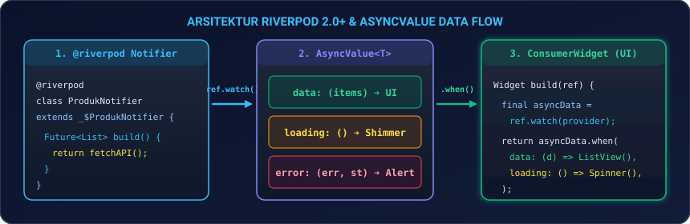
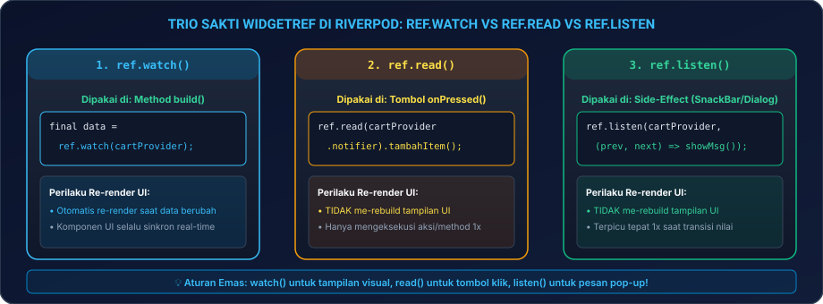
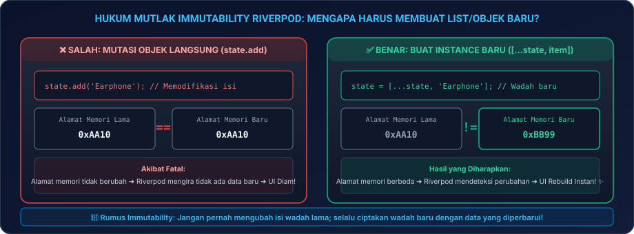
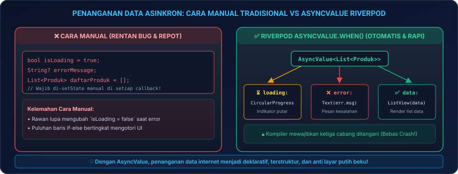

# Modul 04B: State Management Modern Generasi Baru (Riverpod 2.x)

Selamat datang di **Modul 04B**! Di Modul 04A, Anda telah menguasai dasar-dasar state management menggunakan Provider. Sekarang, saatnya kita melangkah ke generasi berikutnya yang sedang menjadi standar baru di dunia startup dan teknologi global: **Riverpod 2.x**!

Tahukah Anda bahwa kata **Riverpod** sebenarnya adalah anagram (susunan ulang huruf) dari kata **Provider**? Keduanya dibuat oleh orang yang sama, yaitu **Remi Rousselet**. Riverpod diciptakan untuk menyempurnakan kelemahan Provider: menghilangkan ketergantungan pada `BuildContext`, menjamin keamanan kompilasi (*compile-safety*), dan menangani status loading data internet secara otomatis!

---

## 🛠️ 00. Persiapan Praktik: Di Mana & Bagaimana Menguji Riverpod?

Mari siapkan lingkungan kerja di laptop Anda agar seluruh eksperimen berjalan lancar tanpa kebingungan:

### 1. Langkah Persiapan Proyek di VS Code
1. Buka terminal laptop Anda (PowerShell di Windows, Terminal di Mac/Linux), lalu jalankan perintah:
   ```bash
   flutter create belajar_riverpod_04b
   code belajar_riverpod_04b
   ```
2. Di dalam VS Code, buka berkas utama yang akan menjadi kanvas eksperimen Anda: [`lib/main.dart`](file:///lib/main.dart).
3. Buka **Terminal Terintegrasi** di VS Code dengan menekan tombol kombinasi **``Ctrl + ` ``** (atau `Cmd + ` di macOS).

### 2. Memasang Pustaka Flutter Riverpod
Pasang pustaka resmi `flutter_riverpod` melalui terminal VS Code dengan mengetik:

```bash
flutter pub add flutter_riverpod
```
*Tunggu beberapa detik hingga proses instalasi selesai dan berkas `pubspec.yaml` otomatis diperbarui.*

> [!TIP]
> **Uji Coba Cepat Tanpa Instalasi via Browser**:  
> Seluruh kode pada modul ini juga dapat Anda uji coba secara langsung tanpa instalasi apa pun melalui **[DartPad Flutter](https://dartpad.dev/flutter)**. Cukup pastikan Anda mengimpor `package:flutter_riverpod/flutter_riverpod.dart`.

### 3. Tabel Pintasan Esensial (*Cheat-Sheet Tools*)
Pintasan berikut akan sangat membantu Anda saat bereksperimen dengan pembaruan data di Riverpod:

| Aksi / Kebutuhan | Tombol Pintasan / Perintah | Keterangan Praktis |
|---|---|---|
| **Buka Terminal VS Code** | **``Ctrl + ` ``** (atau `Cmd + ` di Mac) | Memasang paket pustaka via `flutter pub add flutter_riverpod` |
| **Jalankan Aplikasi** | **`F5`** atau `flutter run` | Menjalankan aplikasi ke emulator Android / Google Chrome |
| **Hot Reload (Instan)** | **`Ctrl + S`** atau tekan **`r`** di terminal | Menyegarkan perubahan UI dalam hitungan milidetik |
| **Hot Restart (Penuh)** | **`Ctrl + Shift + F5`** atau tekan **`R`** | Mengosongkan memori dan mereset provider ke nilai awal |

---

### 4. Panduan Cara Menguji Setiap Contoh Kode di Modul Ini
Agar Anda tidak bingung di mana harus menempelkan (*paste*) potongan sintaks yang ada di modul ini:
1. **Untuk Eksperimen Cepat (Bab 04 Notifier & Bab 05 AsyncValue)**:
   Gunakan **Kanvas Uji Coba Mandiri** di bawah ini sebagai wadah. Cukup ganti widget atau provider di dalamnya dengan materi yang sedang Anda pelajari!
2. **Untuk Proyek Mandiri (Bab 07)**:
   Hapus seluruh isi berkas `lib/main.dart`, lalu tempelkan seluruh kode proyek Bab 07 secara utuh.

---

### 5. Kanvas Uji Coba Mandiri (*Boilerplate Canvas*)
Berikut adalah kerangka kerja dasar berbasis **`Riverpod 2.x`** yang siap Anda salin ke `lib/main.dart` untuk membuktikan reaktivitas data modern:

```dart
import 'package:flutter/material.dart';
import 'package:flutter_riverpod/flutter_riverpod.dart';

void main() {
  runApp(
    // 1. Wajib bungkus root aplikasi dengan ProviderScope:
    const ProviderScope(
      child: AplikasiRiverpodSaya(),
    ),
  );
}

// 2. Deklarasi Notifier Provider sederhana:
class AngkaNotifier extends Notifier<int> {
  @override
  int build() => 0; // Nilai awal angka

  void tambah() => state++;
}

final angkaProvider = NotifierProvider<AngkaNotifier, int>(AngkaNotifier.new);

// 3. UI menggunakan ConsumerWidget (bukan StatelessWidget biasa):
class AplikasiRiverpodSaya extends StatelessWidget {
  const AplikasiRiverpodSaya({super.key});

  @override
  Widget build(BuildContext context) {
    return MaterialApp(
      title: 'Belajar Riverpod 2026',
      debugShowCheckedModeBanner: false,
      theme: ThemeData(
        useMaterial3: true,
        colorSchemeSeed: Colors.teal,
        fontFamily: 'sans-serif', // Menggunakan font lokal agar bebas error font tofu di Web
      ),
      home: const HalamanLatihanRiverpod(),
    );
  }
}

class HalamanLatihanRiverpod extends ConsumerWidget {
  const HalamanLatihanRiverpod({super.key});

  // Perhatikan ada parameter tambahan: WidgetRef ref
  @override
  Widget build(BuildContext context, WidgetRef ref) {
    // 4. ref.watch: Membaca dan mendengarkan data secara reaktif
    final totalAngka = ref.watch(angkaProvider);

    return Scaffold(
      appBar: AppBar(
        title: const Text('Latihan Riverpod 2.x'),
        backgroundColor: Colors.teal,
        foregroundColor: Colors.white,
      ),
      body: Center(
        child: Column(
          mainAxisAlignment: MainAxisAlignment.center,
          children: [
            const Text('Total Angka Riverpod:', style: TextStyle(fontSize: 16)),
            Text(
              '$totalAngka',
              style: const TextStyle(fontSize: 48, fontWeight: FontWeight.bold, color: Colors.teal),
            ),
          ],
        ),
      ),
      floatingActionButton: FloatingActionButton(
        // 5. ref.read: Menjalankan aksi penambahan angka via .notifier
        onPressed: () => ref.read(angkaProvider.notifier).tambah(),
        child: const Icon(Icons.add),
      ),
    );
  }
}
```

Jalankan dengan menekan **`F5`**. Angka akan bertambah dengan mulus tanpa Anda perlu repot mengoper `BuildContext` ke mana-mana!

---

## 🛰️ 01. Mengapa Dunia Flutter Beralih ke Riverpod?

Meskipun Provider klasik sangat bagus, para pengembang profesional sering mengalami 3 kendala berikut pada proyek skala menengah-besar:

1. **Bebas Keterikatan `BuildContext` (*Zero-Context*)**:
   Pada Provider klasik, Anda wajib memiliki akses ke objek `context` untuk membaca data. Ini menyulitkan jika Anda ingin membaca state dari background service, repository, atau fungsi di luar widget.  
   *Solusi Riverpod*: **Zero-Context**. State bisa dibaca dan dikendalikan dari mana saja menggunakan objek `ref`.
2. **Garansi Bebas Crash Runtime (*Compile-Safe*)**:
   Pada Provider klasik, jika Anda lupa mendaftarkan provider di atas rute widget tree, aplikasi akan langsung *crash* saat dijalankan pengguna di HP dengan pesan error legendaris `ProviderNotFoundException`.  
   *Solusi Riverpod*: **Compile-Safe**. Riverpod dideklarasikan sebagai variabel global statis bertipe kuat, sehingga editor VS Code langsung memberi tahu jika ada tipe data yang tidak cocok sebelum aplikasi sempat dijalankan.
3. **Otomatisasi Status Loading Data Internet (*AsyncValue*)**:
   Pada Provider klasik, Anda harus membuat variabel manual yang melelahkan seperti `bool isLoading = true`, `String? errorMessage`, dll.  
   *Solusi Riverpod*: Menyediakan tipe data **`AsyncValue`** yang otomatis membagi kondisi aplikasi ke dalam 3 cabang: *Data*, *Loading*, dan *Error*.

---

## 🌊 02. Arsitektur Riverpod 2.x & `ProviderScope`

<p align="center">
  
</p>
<p align="center"><em>Gambar 1: Arsitektur Riverpod 2.x dan Alur Penanganan Status Asinkron dengan AsyncValue. (Sumber: Dokumentasi Resmi Riverpod - riverpod.dev).</em></p>

### Kunci Utama: `ProviderScope`
Di Riverpod, seluruh data state tidak disimpan di dalam pohon widget, melainkan di dalam sebuah wadah memori terpusat yang dikelola oleh **`ProviderScope`**.
* Oleh karena itu, **`ProviderScope` wajib diletakkan membungkus root aplikasi di fungsi `main()`**.

---

## 🎯 03. Trio Sakti `WidgetRef`: `ref.watch()`, `ref.read()`, & `ref.listen()`

Jika pada Provider Anda menggunakan `context`, maka di Riverpod alat kendali utama Anda adalah **`ref` (WidgetRef)**:

<p align="center">
  
</p>
<p align="center"><em>Gambar 2: Perbandingan 3 Metode Utama Akses Data Melalui WidgetRef di Riverpod. (Sumber: Dokumentasi Resmi Riverpod - riverpod.dev).</em></p>

| Perintah `ref` | Lokasi Pemanggilan Wajib | Perilaku terhadap UI |
|---|---|---|
| **`ref.watch(provider)`** | Di dalam method **`build()`** | **Ikut Rebuild**. Menghubungkan tampilan ke data. Setiap kali data di provider berubah, tampilan akan digambar ulang secara instan. |
| **`ref.read(provider.notifier)`** | Di dalam tombol **`onPressed()`** | **TIDAK Rebuild**. Hanya digunakan untuk memanggil method/aksi satu kali tanpa ikut berlangganan pembaruan. |
| **`ref.listen(provider, (prev, next) => ...)`** | Di dalam method **`build()`** | **TIDAK Rebuild**. Memantau perubahan nilai untuk menjalankan efek samping (seperti memunculkan SnackBar atau dialog). |

---

### Kapan Menggunakan `ConsumerStatefulWidget`?
Secara umum, Anda cukup menggunakan **`ConsumerWidget`** (sebagai pengganti `StatelessWidget`). Namun, jika layar Anda memerlukan lifecycle lokal seperti **`initState()`**, **`dispose()`**, atau controller lokal seperti **`TextEditingController`** dan **`AnimationController`**, gunakanlah **`ConsumerStatefulWidget`**:

```dart
class HalamanFormRiverpod extends ConsumerStatefulWidget {
  const HalamanFormRiverpod({super.key});

  @override
  ConsumerState<HalamanFormRiverpod> createState() => _HalamanFormRiverpodState();
}

class _HalamanFormRiverpodState extends ConsumerState<HalamanFormRiverpod> {
  late final TextEditingController _controller;

  @override
  void initState() {
    super.initState();
    _controller = TextEditingController();
  }

  @override
  void dispose() {
    _controller.dispose();
    super.dispose();
  }

  @override
  Widget build(BuildContext context) {
    // Pada ConsumerState, objek `ref` tersedia secara global di seluruh class!
    final nama = ref.watch(namaUserProvider);
    return TextField(controller: _controller);
  }
}
```

---

## ⚡ 04. Model State Modern: `NotifierProvider` & Immutability

Di Riverpod 2.x, pendekatan resmi yang direkomendasikan adalah menggunakan **`Notifier`**:

<p align="center">
  
</p>
<p align="center"><em>Gambar 3: Perbandingan Mutasi Objek Langsung vs Pembuatan Instance Baru pada Notifier Riverpod. (Sumber: Dokumentasi Resmi Riverpod - riverpod.dev).</em></p>

```dart
// 1. Definisikan Notifier yang mengelola List Produk Favorit:
class FavoritNotifier extends Notifier<List<String>> {
  @override
  List<String> build() => []; // Nilai awal berupa list kosong

  void toggleFavorit(String namaProduk) {
    if (state.contains(namaProduk)) {
      // ⚠️ Hapus: Jangan mutasi state.remove(), tetapi buat list baru:
      state = state.where((item) => item != namaProduk).toList();
    } else {
      // ⚠️ Tambah: Jangan mutasi state.add(), gunakan spread operator [...state, item]:
      state = [...state, namaProduk];
    }
  }
}

// 2. Buat Provider Global:
final favoritProvider = NotifierProvider<FavoritNotifier, List<String>>(
  FavoritNotifier.new,
);
```

> [!IMPORTANT]
> **Hukum Mutlak Immutability (Wadah Baru vs Wadah Lama)**:  
> Seperti terlihat pada Gambar 3 di atas, Riverpod mendeteksi perubahan data berdasarkan perbandingan alamat memori (`oldState != newState`). Jika Anda menulis `state.add('Barang')`, alamat memorinya tetap sama, sehingga Riverpod mengira tidak ada perubahan dan UI tidak akan me-rebuild! **Selalu tetapkan `state` ke wadah list atau objek baru menggunakan operator `[...state, item]`!**

---

## 🔄 05. Menguasai Data Asinkron API dengan `AsyncValue.when()`

Salah satu fitur paling dicintai dari Riverpod adalah kemampuannya menangani request jaringan/API secara otomatis menggunakan **`FutureProvider`** dan **`AsyncValue`**.

<p align="center">
  
</p>
<p align="center"><em>Gambar 4: Siklus Penanganan Data Internet: Cara Manual Tradisional vs Otomatisasi AsyncValue.when di Riverpod. (Sumber: Dokumentasi Resmi Riverpod - riverpod.dev).</em></p>

### Contoh Mandiri Siap Jalan untuk Menguji `AsyncValue`:
Salin kode mandiri di bawah ini ke `lib/main.dart` untuk merasakan langsung transisi otomatis dari kondisi *loading* ke *data*:

```dart
import 'package:flutter/material.dart';
import 'package:flutter_riverpod/flutter_riverpod.dart';

// 1. Provider yang mengambil data dari internet (simulasi delay 2 detik):
final daftarMenuProvider = FutureProvider<List<String>>((ref) async {
  await Future.delayed(const Duration(seconds: 2)); // Simulasi jeda loading jaringan
  return ['Nasi Goreng Spesial', 'Ayam Bakar Madu', 'Es Teh Manis Jumbo'];
});

void main() {
  runApp(const ProviderScope(child: MaterialApp(home: HalamanMenuMakan())));
}

class HalamanMenuMakan extends ConsumerWidget {
  const HalamanMenuMakan({super.key});

  @override
  Widget build(BuildContext context, WidgetRef ref) {
    // 2. Baca state asinkron menggunakan ref.watch:
    final menuAsync = ref.watch(daftarMenuProvider);

    return Scaffold(
      appBar: AppBar(
        title: const Text('Daftar Menu Resto (AsyncValue)'),
        backgroundColor: Colors.teal,
        foregroundColor: Colors.white,
      ),
      // 3. .when() secara cerdas memaksa Anda menangani 3 kondisi sekaligus tanpa if-else:
      body: menuAsync.when(
        data: (daftarMenu) => ListView.builder(
          itemCount: daftarMenu.length,
          itemBuilder: (ctx, i) => ListTile(
            leading: const Icon(Icons.restaurant, color: Colors.teal),
            title: Text(daftarMenu[i], style: const TextStyle(fontWeight: FontWeight.bold)),
          ),
        ),
        loading: () => const Center(
          child: Column(
            mainAxisAlignment: MainAxisAlignment.center,
            children: [
              CircularProgressIndicator(color: Colors.teal),
              SizedBox(height: 12),
              Text('Mengunduh menu lezat...', style: TextStyle(color: Colors.grey)),
            ],
          ),
        ),
        error: (error, stack) => Center(
          child: Text('Terjadi Kesalahan: $error', style: const TextStyle(color: Colors.red)),
        ),
      ),
    );
  }
}
```

---

## 🛡️ 06. Dua Pengubah Sakti: `.autoDispose` & `.family`

Riverpod menyediakan modifier bawaan yang sangat mempermudah optimasi aplikasi:

1. **`.autoDispose` (Pembersih Memori Otomatis)**:
   Menghancurkan (*dispose*) state dari memori RAM secara otomatis saat layar ditutup oleh pengguna. Sangat ampuh mencegah kebocoran memori (*memory leak*):
   ```dart
   final detailProdukProvider = FutureProvider.autoDispose<DetailProduk>((ref) async {
     return await fetchDetailDariServer();
   });
   ```

2. **`.family` (Pengirim Parameter Dinamis)**:
   Mengizinkan provider menerima argumen dari luar (misalnya ID barang):
   ```dart
   final produkByIdProvider = FutureProvider.family<Produk, int>((ref, id) async {
     return await fetchProdukById(id);
   });
   
   // Pemanggilan di UI:
   final produk = ref.watch(produkByIdProvider(102));
   ```

> [!NOTE]
> **Catatan Pemula**: Modifier `.autoDispose` dan `.family` bahkan dapat digabungkan sekaligus menjadi satu baris: `FutureProvider.autoDispose.family<Produk, int>((ref, id) async { ... })`. Sangat praktis untuk halaman detail produk yang menerima parameter ID dan langsung membersihkan memori saat pengguna menekan tombol kembali!

---

## ⚙️ 06B. Menyingkap Riverpod Generator (`@riverpod`): Gaya Manual vs Otomatis

Ketika Anda menjelajahi internet, YouTube, atau dokumentasi resmi Riverpod 2.x, Anda mungkin akan melihat sintaks baru yang menggunakan tanda centang anotasi **`@riverpod`**. Mengapa ada dua cara penulisan di dunia Riverpod?

### 1. Dua Aliran Penulisan di Riverpod 2.x:

| Aspek Perbandingan | Gaya 1: Manual Notifier (Yang Kita Pelajari) | Gaya 2: Riverpod Generator (`@riverpod`) |
|---|---|---|
| **Kebutuhan Alat** | Murni Dart bawaan (cukup pasang `flutter_riverpod`). | Butuh paket tambahan: `riverpod_annotation`, `riverpod_generator`, dan `build_runner`. |
| **Proses Menjalankan** | Langsung tekan **`F5`** tanpa kompilasi tambahan. | Wajib menjalankan perintah terminal: `dart run build_runner watch`. |
| **Berkas Tambahan** | **Tidak ada**. Seluruh kode berada di satu tempat yang bersih. | Menghasilkan berkas pendamping raksasa dengan akhiran **`.g.dart`**. |
| **Aturan `autoDispose`** | Bersifat manual/opsional via `.autoDispose`. | **Aktif secara otomatis** (default). Jika ingin persisten, gunakan `@Riverpod(keepAlive: true)`. |
| **Kelebihan Utama** | **Sangat ramah pemula**, kode transparan, tidak perlu menunggu proses build runner yang lama. | Menghilangkan penulisan boilerplate tipe data yang panjang pada proyek skala enterprise besar. |

### 2. Contoh Komparasi Sintaks:
```dart
// -------------------------------------------------------------
// CARA MANUAL (Ramah Pemula - Tidak Perlu Build Runner):
// -------------------------------------------------------------
class CounterNotifier extends Notifier<int> {
  @override
  int build() => 0;
  void tambah() => state++;
}
final counterProvider = NotifierProvider<CounterNotifier, int>(CounterNotifier.new);

// -------------------------------------------------------------
// CARA GENERATOR (Membutuhkan build_runner & menghasilkan file .g.dart):
// -------------------------------------------------------------
// part 'counter.g.dart';
//
// @riverpod
// class Counter extends _$Counter {
//   @override
//   int build() => 0;
//   void tambah() => state++;
// }
```

> [!TIP]
> **Rekomendasi Belajar untuk Pemula**:  
> Mulailah selalu dengan **Gaya Manual** seperti yang kita praktikkan di seluruh modul ini! Memahami cara kerja manual membuat Anda benar-benar paham "apa yang terjadi di balik layar". Setelah fondasi Anda kokoh, beralih ke gaya generator di proyek besar nanti akan terasa sangat mudah!

---

## 💻 07. Hands-on Project 04B: TokoKita Live Catalog & Wishlist dengan Riverpod 2.x

Mari kita satukan seluruh pemahaman Riverpod 2.x ke dalam aplikasi katalog produk interaktif dengan fitur pencarian real-time dan pemantauan efek samping SnackBar otomatis.

### Salin Seluruh Kode Ini ke `lib/main.dart`:

```dart
import 'package:flutter/material.dart';
import 'package:flutter_riverpod/flutter_riverpod.dart';

// ==========================================
// 1. MODEL DATA PRODUK
// ==========================================
class Produk {
  final int id;
  final String nama;
  final String kategori;
  final int harga;

  const Produk({
    required this.id,
    required this.nama,
    required this.kategori,
    required this.harga,
  });
}

// Dummy Database Produk TokoKita
final List<Produk> databaseProduk = [
  const Produk(id: 1, nama: 'iPad Pro M4 Ultra', kategori: 'Tablet', harga: 19500000),
  const Produk(id: 2, nama: 'Galaxy Tab S10+', kategori: 'Tablet', harga: 15500000),
  const Produk(id: 3, nama: 'Smartwatch Titan 2026', kategori: 'Wearable', harga: 3800000),
  const Produk(id: 4, nama: 'TWS Noise Cancelling', kategori: 'Audio', harga: 2100000),
  const Produk(id: 5, nama: 'Wireless Charging Pad', kategori: 'Aksesoris', harga: 450000),
];

// ==========================================
// 2. STATE MANAGERS (RIVERPOD 2.x NOTIFIERS)
// ==========================================

// Provider 1: Kata Kunci Pencarian (Search Query)
class SearchQueryNotifier extends Notifier<String> {
  @override
  String build() => '';

  void updateQuery(String text) => state = text;
}

final searchQueryProvider = NotifierProvider<SearchQueryNotifier, String>(
  SearchQueryNotifier.new,
);

// Provider 2: Wishlist (Set ID Produk Favorit)
class WishlistNotifier extends Notifier<Set<int>> {
  @override
  Set<int> build() => {};

  void toggleWishlist(int produkId) {
    if (state.contains(produkId)) {
      // Hapus dari favorit dengan membuat Set baru:
      state = state.where((id) => id != produkId).toSet();
    } else {
      // Tambah ke favorit dengan membuat Set baru:
      state = {...state, produkId};
    }
  }
}

final wishlistProvider = NotifierProvider<WishlistNotifier, Set<int>>(
  WishlistNotifier.new,
);

// Provider 3: Produk Terfilter Otomatis (Dependent Provider)
final filteredProdukProvider = Provider<List<Produk>>((ref) {
  final query = ref.watch(searchQueryProvider).toLowerCase();
  if (query.isEmpty) return databaseProduk;

  return databaseProduk.where((p) {
    return p.nama.toLowerCase().contains(query) || p.kategori.toLowerCase().contains(query);
  }).toList();
});

// ==========================================
// 3. ROOT APPLICATION
// ==========================================
void main() {
  runApp(
    // 1. ProviderScope wajib di puncak aplikasi:
    const ProviderScope(
      child: TokoKitaRiverpodApp(),
    ),
  );
}

class TokoKitaRiverpodApp extends StatelessWidget {
  const TokoKitaRiverpodApp({super.key});

  @override
  Widget build(BuildContext context) {
    return MaterialApp(
      title: 'TokoKita Riverpod 2026',
      debugShowCheckedModeBanner: false,
      theme: ThemeData(
        useMaterial3: true,
        colorSchemeSeed: const Color(0xFF0284C7), // Warna Sky Blue Elegan
        fontFamily: 'sans-serif', // Mencegah error font tofu di Web
      ),
      home: const HalamanKatalogRiverpod(),
    );
  }
}

// ==========================================
// 4. HALAMAN KATALOG INTERAKTIF
// ==========================================
class HalamanKatalogRiverpod extends ConsumerWidget {
  const HalamanKatalogRiverpod({super.key});

  @override
  Widget build(BuildContext context, WidgetRef ref) {
    // Membaca daftar produk yang sudah terfilter secara reaktif:
    final daftarProduk = ref.watch(filteredProdukProvider);
    final totalWishlist = ref.watch(wishlistProvider).length;

    // ref.listen untuk memicu SnackBar saat item wishlist bertambah atau berkurang:
    ref.listen<Set<int>>(wishlistProvider, (sebelum, sesudah) {
      final beda = (sesudah?.length ?? 0) - (sebelum?.length ?? 0);
      if (beda > 0) {
        ScaffoldMessenger.of(context).hideCurrentSnackBar();
        ScaffoldMessenger.of(context).showSnackBar(
          const SnackBar(
            duration: Duration(milliseconds: 900),
            content: Text('❤️ Produk berhasil ditambahkan ke Wishlist!'),
          ),
        );
      } else if (beda < 0) {
        ScaffoldMessenger.of(context).hideCurrentSnackBar();
        ScaffoldMessenger.of(context).showSnackBar(
          const SnackBar(
            duration: Duration(milliseconds: 900),
            content: Text('💔 Produk dihapus dari Wishlist.'),
          ),
        );
      }
    });

    return Scaffold(
      appBar: AppBar(
        title: const Text('TokoKita Gadget (Riverpod)', style: TextStyle(fontWeight: FontWeight.bold)),
        backgroundColor: const Color(0xFF0284C7),
        foregroundColor: Colors.white,
        actions: [
          Padding(
            padding: const EdgeInsets.only(right: 12.0),
            child: Badge(
              label: Text('$totalWishlist'),
              isLabelVisible: totalWishlist > 0,
              child: const Icon(Icons.favorite, color: Colors.white),
            ),
          ),
        ],
      ),
      body: Column(
        children: [
          // Kotak Pencarian Live
          Padding(
            padding: const EdgeInsets.all(14.0),
            child: TextField(
              decoration: InputDecoration(
                hintText: 'Cari tablet, audio, aksesoris...',
                prefixIcon: const Icon(Icons.search),
                filled: true,
                fillColor: const Color(0xFFF0F9FF),
                border: OutlineInputBorder(
                  borderRadius: BorderRadius.circular(12),
                  borderSide: BorderSide.none,
                ),
              ),
              onChanged: (teks) {
                // Perbarui query pencarian via ref.read:
                ref.read(searchQueryProvider.notifier).updateQuery(teks);
              },
            ),
          ),

          // Daftar Produk Real-time
          Expanded(
            child: daftarProduk.isEmpty
                ? const Center(
                    child: Text('Tidak ada produk yang cocok 🔍', style: TextStyle(fontSize: 16, color: Colors.grey)),
                  )
                : ListView.builder(
                    padding: const EdgeInsets.symmetric(horizontal: 14),
                    itemCount: daftarProduk.length,
                    itemBuilder: (ctx, i) {
                      final produk = daftarProduk[i];
                      // Periksa apakah produk ini ada di wishlist:
                      final isFav = ref.watch(wishlistProvider).contains(produk.id);

                      return Card(
                        margin: const EdgeInsets.only(bottom: 12),
                        shape: RoundedRectangleBorder(borderRadius: BorderRadius.circular(12)),
                        elevation: 2,
                        child: ListTile(
                          leading: const CircleAvatar(
                            backgroundColor: Color(0xFFE0F2FE),
                            child: Icon(Icons.bolt, color: Color(0xFF0284C7)),
                          ),
                          title: Text(produk.nama, style: const TextStyle(fontWeight: FontWeight.bold)),
                          subtitle: Text(
                            'Rp ${produk.harga.toString().replaceAllMapped(RegExp(r'(\d{1,3})(?=(\d{3})+(?!\d))'), (m) => '${m[1]}.')}',
                            style: const TextStyle(color: Color(0xFF0284C7), fontWeight: FontWeight.w600),
                          ),
                          trailing: IconButton(
                            icon: Icon(
                              isFav ? Icons.favorite : Icons.favorite_border,
                              color: isFav ? Colors.red : Colors.grey,
                            ),
                            onPressed: () {
                              ref.read(wishlistProvider.notifier).toggleWishlist(produk.id);
                            },
                          ),
                        ),
                      );
                    },
                  ),
          ),
        ],
      ),
    );
  }
}
```

Jalankan dengan **`F5`**! Ketik kata kunci di kotak pencarian untuk melihat reaktivitas pencarian instan dan sentuh ikon hati untuk melihat SnackBar hasil pemantauan `ref.listen`!

---

## ⚠️ 08. Troubleshooting & 7 Jebakan Riverpod Umum

| No | Gejala / Pesan Kesalahan | Penyebab Utama | Solusi Kilat |
|---|---|---|---|
| **1** | *"ProviderScope not found in widget tree"* | Lupa membungkus widget induk dengan `ProviderScope`. | Bungkus `runApp(const ProviderScope(child: MyApp()))` di baris pertama fungsi `main()`. |
| **2** | UI tidak mau me-rebuild saat data bertambah | Memodifikasi list secara langsung tanpa membuat instance baru (`state.add()`). | Selalu gunakan wadah baru: `state = [...state, item]`. |
| **3** | *"Cannot use ref.watch inside a button callback"* | Memanggil `ref.watch()` di dalam fungsi tombol aksi seperti `onPressed()`. | Ganti menjadi `ref.read(provider.notifier).aksi()` di dalam tombol aksi. |
| **4** | Lupa menulis `.notifier` saat memanggil method | Menulis `ref.read(angkaProvider).tambah()` alih-alih mengambil notifernya. | Tulis `ref.read(angkaProvider.notifier).tambah()` untuk mengakses method logika. |
| **5** | SnackBar muncul berkali-kali saat layar diputar | Menampilkan SnackBar langsung di dalam method `build()`. | Pindahkan logika pesan notifikasi ke dalam **`ref.listen()`**. |
| **6** | Data pencarian lama tidak terhapus saat berpindah rute | State tetap tersimpan di memori global karena tidak dibersihkan. | Tambahkan modifier `.autoDispose` pada provider terkait. |
| **7** | Teks menjadi kotak-kotak (*tofu* `▯▯▯`) di Web | Flutter Web gagal mengunduh font Roboto dari CDN Google. | Tambahkan `fontFamily: 'sans-serif'` di dalam `ThemeData` pada berkas `lib/main.dart`. |

---

## 📝 09. Kuis Pemahaman Modul 04B

1. **Mengapa Riverpod disebut sebagai solusi yang "Compile-Safe"?**  
   *Jawaban:* Karena seluruh provider di Riverpod dideklarasikan sebagai variabel global statis bertipe kuat. Jika Anda salah mengetik nama provider atau salah tipe data, editor VS Code akan langsung mendeteksinya sebagai error kompilasi berwarna merah sebelum aplikasi sempat dijalankan.
2. **Kapan Anda sebaiknya menggunakan `ref.listen()` dibandingkan `ref.watch()`?**  
   *Jawaban:* Gunakan `ref.watch()` ketika Anda ingin memperbarui tampilan visual antarmuka (rebuild UI). Gunakan `ref.listen()` ketika Anda ingin memicu aksi efek samping satu kali saat nilai state berubah tanpa perlu menggambar ulang layar (misalnya: menampilkan SnackBar, dialog, atau navigasi).
3. **Mengapa kita membutuhkan modifier `.autoDispose`?**  
   *Jawaban:* Untuk menghemat konsumsi memori RAM perangkat, karena Riverpod akan secara otomatis menghapus state yang tidak lagi dipakai saat pengguna menutup atau meninggalkan halaman tersebut.

---

## 🎯 10. Checklist Kelulusan Kompetensi Modul 04B

Tandai penguasaan Anda setelah mempraktikkan materi Riverpod ini:
- [x] Memahami alasan arsitektural mengapa dunia Flutter beralih ke Riverpod (Zero-Context & Compile-Safe).
- [x] Mampu mengonfigurasi `ProviderScope` di root aplikasi.
- [x] Menguasai perbedaan penggunaan `ref.watch()`, `ref.read()`, dan `ref.listen()`.
- [x] Memahami perbedaan `ConsumerWidget` vs `ConsumerStatefulWidget`.
- [x] Memahami prinsip immutability pada `NotifierProvider` (wadah baru vs wadah lama).
- [x] Menguasai penanganan status asinkron jaringan via `AsyncValue.when(data, loading, error)`.
- [x] Mampu memanfaatkan modifier `.autoDispose` dan `.family`.
- [x] Memahami perbedaan gaya penulisan manual Notifier vs Riverpod Generator (`@riverpod`).
- [x] Berhasil menjalankan dan memahami proyek mandiri **TokoKita Live Catalog & Wishlist dengan Riverpod 2.x**.

---

👉 **Langkah Selanjutnya**: Selamat! Anda telah menguasai manajemen state modern generasi baru! Sekarang, mari kita melangkah ke puncak arsitektur enterprise standar perbankan dan fintech di **[Modul 04C: Arsitektur Enterprise & Standar Industri Fintech (BLoC & Cubit)](../modul-04c-enterprise-state-bloc/README.md)**! 🚀
