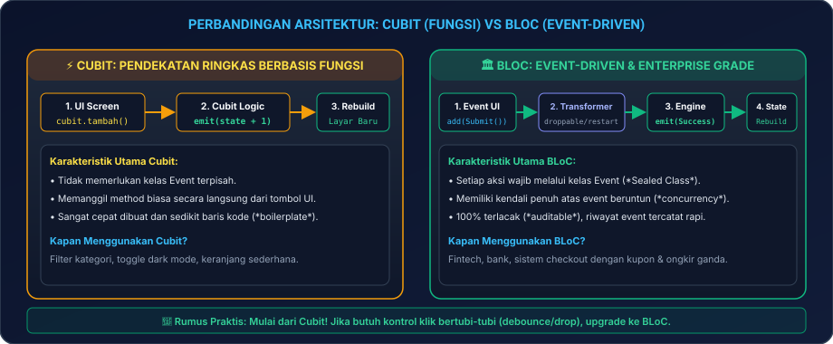
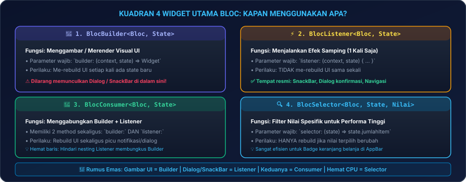
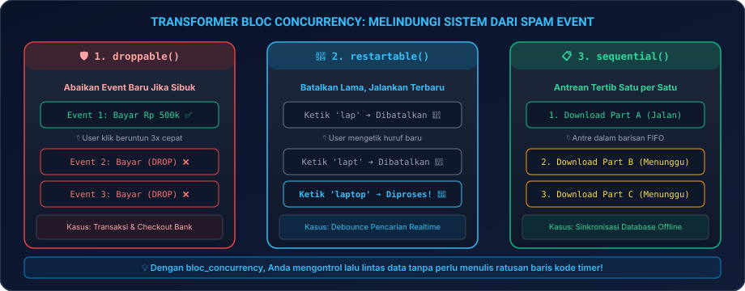

# Modul 04C: Arsitektur Enterprise & Standar Industri Fintech (BLoC & Cubit)

Selamat datang di **Modul 04C**! Setelah memahami fondasi Provider di Modul 04A dan paradigma modern Riverpod di Modul 04B, kini Anda tiba di puncak arsitektur state management industri: **BLoC (Business Logic Component) & Cubit**!

BLoC adalah standar emas (*de facto standard*) yang paling banyak digunakan oleh **aplikasi perbankan, perusahaan teknologi multinasional, fintech, dan SuperApp**. Mengapa? Karena BLoC menerapkan pemisahan mutlak antara antarmuka visual dan logika bisnis melalui aliran data satu arah yang sangat ketat, 100% terlacak (*auditable*), dan mudah diuji secara otomatis (*unit testable*).

---

## 🛠️ 00. Persiapan Praktik: Di Mana & Bagaimana Menguji BLoC?

Mari siapkan proyek Anda agar seluruh latihan arsitektur enterprise ini dapat langsung Anda buktikan di laptop Anda:

### 1. Langkah Persiapan Proyek di VS Code
1. Buka terminal laptop Anda (PowerShell di Windows, Terminal di Mac/Linux), lalu jalankan perintah:
   ```bash
   flutter create belajar_bloc_04c
   code belajar_bloc_04c
   ```
2. Di dalam VS Code, buka berkas utama yang akan menjadi kanvas eksperimen: [`lib/main.dart`](file:///lib/main.dart).
3. Buka **Terminal Terintegrasi** di VS Code dengan menekan tombol kombinasi **``Ctrl + ` ``** (atau `Cmd + ` di macOS).

### 2. Memasang Pustaka Resmi BLoC & Toolkit Pendukung
Pasang paket resmi `flutter_bloc` dan pustaka concurrency melalui terminal:

```bash
flutter pub add flutter_bloc bloc_concurrency
```
*Tunggu beberapa detik hingga proses instalasi selesai dan terminal menampilkan pesan sukses.*

> [!TIP]
> **Uji Coba Cepat via Browser**:  
> Seluruh kode BLoC dan Cubit pada modul ini juga dapat Anda jalankan langsung di peramban web tanpa instalasi lokal melalui **[DartPad Flutter](https://dartpad.dev/flutter)**. Cukup pastikan Anda mengimpor `package:flutter_bloc/flutter_bloc.dart`.

### 3. Tabel Pintasan Esensial (*Cheat-Sheet Tools*)
| Aksi / Kebutuhan | Tombol Pintasan / Perintah | Keterangan Praktis |
|---|---|---|
| **Buka Terminal VS Code** | **``Ctrl + ` ``** (atau `Cmd + ` di Mac) | Memasang paket pustaka via `flutter pub add flutter_bloc` |
| **Jalankan Aplikasi** | **`F5`** atau `flutter run` | Menjalankan aplikasi ke emulator Android / Google Chrome |
| **Hot Reload (Instan)** | **`Ctrl + S`** atau tekan **`r`** di terminal | Menyegarkan pembaruan tampilan UI secara instan |
| **Hot Restart (Penuh)** | **`Ctrl + Shift + F5`** atau tekan **`R`** | Mereset seluruh instance BLoC/Cubit kembali ke state awal |

---

### 4. Panduan Cara Menguji Setiap Contoh Kode di Modul Ini
Agar Anda tidak bingung di mana harus menempelkan (*paste*) kode yang disajikan di modul ini:
1. **Untuk Eksperimen Dasar Cubit**: Gunakan **Kanvas Uji Coba Mandiri (Bab 00)** di bawah ini.
2. **Untuk Eksperimen BLoC Berbasis Event**: Salin kode mandiri pada **Bab 03** ke `lib/main.dart`.
3. **Untuk Proyek Enterprise SuperStore**: Salin kode utuh pada **Bab 08** ke `lib/main.dart`.

---

### 5. Kanvas Uji Coba Mandiri (*Boilerplate Canvas Cubit*)
Berikut adalah kerangka kerja dasar berbasis **`Cubit`** yang siap Anda salin ke `lib/main.dart` untuk menguji reaktivitas pertama Anda:

```dart
import 'package:flutter/material.dart';
import 'package:flutter_bloc/flutter_bloc.dart';

// 1. Cubit Sederhana untuk Menghitung Angka:
class CounterCubit extends Cubit<int> {
  CounterCubit() : super(0); // Nilai awal angka adalah 0

  void tambah() => emit(state + 1);
  void kurang() => emit(state - 1);
}

void main() {
  runApp(
    // 2. Sediakan instance Cubit di atas pohon aplikasi:
    BlocProvider(
      create: (_) => CounterCubit(),
      child: const AplikasiBlocSaya(),
    ),
  );
}

class AplikasiBlocSaya extends StatelessWidget {
  const AplikasiBlocSaya({super.key});

  @override
  Widget build(BuildContext context) {
    return MaterialApp(
      title: 'Belajar BLoC 2026',
      debugShowCheckedModeBanner: false,
      theme: ThemeData(
        useMaterial3: true,
        colorSchemeSeed: Colors.indigo,
        fontFamily: 'sans-serif', // Menggunakan font lokal agar bebas error font tofu di Web
      ),
      home: const HalamanLatihanBloc(),
    );
  }
}

class HalamanLatihanBloc extends StatelessWidget {
  const HalamanLatihanBloc({super.key});

  @override
  Widget build(BuildContext context) {
    return Scaffold(
      appBar: AppBar(
        title: const Text('Latihan BLoC / Cubit Dasar'),
        backgroundColor: Colors.indigo,
        foregroundColor: Colors.white,
      ),
      body: Center(
        child: Column(
          mainAxisAlignment: MainAxisAlignment.center,
          children: [
            const Text('Angka Saat Ini:', style: TextStyle(fontSize: 16)),
            // 3. BlocBuilder: Merender ulang widget teks saat state angka berubah
            BlocBuilder<CounterCubit, int>(
              builder: (context, angka) {
                return Text(
                  '$angka',
                  style: const TextStyle(fontSize: 48, fontWeight: FontWeight.bold, color: Colors.indigo),
                );
              },
            ),
          ],
        ),
      ),
      floatingActionButton: Row(
        mainAxisAlignment: MainAxisAlignment.end,
        children: [
          FloatingActionButton(
            heroTag: 'btnKurang',
            onPressed: () => context.read<CounterCubit>().kurang(),
            child: const Icon(Icons.remove),
          ),
          const SizedBox(width: 12),
          FloatingActionButton(
            heroTag: 'btnTambah',
            onPressed: () => context.read<CounterCubit>().tambah(),
            child: const Icon(Icons.add),
          ),
        ],
      ),
    );
  }
}
```

Jalankan dengan menekan **`F5`** untuk melihat bagaimana Cubit memproses perubahan nilai melalui pemanggilan method `emit()`.

---

## 🏛️ 01. Mengapa Bank & Fintech Memilih BLoC?

Di industri keuangan dan e-commerce bernilai transaksi miliaran rupiah, aplikasi tidak boleh memiliki celah salah hitung atau aksi liar. BLoC dipilih karena 3 alasan mendasar:

1. **Jalur Data Searah (*Unidirectional Data Flow*)**: Tampilan UI hanya bisa meminta perubahan lewat perintah resmi (**Event**). UI sama sekali tidak punya hak mengubah variabel data secara langsung.
2. **Jejak Audit Penuh (*Audit Trail*)**: Setiap event yang dipicu pengguna (misal: `TekanTombolTransfer`, `IsiPIN`, `BatalkanTransaksi`) tercatat dalam log secara terpusat, sehingga mempermudah pelacakan saat terjadi investigasi kesalahan transaksi.
3. **100% Deterministik**: Diberikan Event yang sama, BLoC akan selalu menghasilkan State yang sama secara konsisten, membuatnya sangat mudah diuji secara otomatis (*Unit Test*) menggunakan paket `bloc_test`.

### Cara Kerja Jejak Audit Nyata: Memasang `BlocObserver`
Bagaimana cara aplikasi perbankan merekam seluruh aksi pengguna secara otomatis tanpa harus menulis baris log manual di setiap halaman? Pustaka BLoC menyediakan alat sakti bernama **`BlocObserver`**:

```dart
// 1. Buat kelas pengamat jejak audit global:
class AuditLoggerBlocObserver extends BlocObserver {
  @override
  void onChange(BlocBase bloc, Change change) {
    super.onChange(bloc, change);
    // Log ini otomatis tercetak di terminal setiap kali data state di mana saja berubah:
    debugPrint('📝 [AUDIT LOG] ${bloc.runtimeType} ➔ Perubahan: ${change.currentState} ➔ ${change.nextState}');
  }

  @override
  void onError(BlocBase bloc, Object error, StackTrace stackTrace) {
    debugPrint('🚨 [AUDIT ERROR] Terjadi kegagalan pada ${bloc.runtimeType}: $error');
    super.onError(bloc, error, stackTrace);
  }
}

// 2. Pasang di baris pertama fungsi main():
void main() {
  Bloc.observer = AuditLoggerBlocObserver(); // Seluruh BLoC di aplikasi kini terpantau!
  runApp(const AplikasiBlocSaya());
}
```

---

## 🔄 02. Arsitektur Unidirectional Data Flow (UDF)

<p align="center">
  
</p>
<p align="center"><em>Gambar 1: Aliran Data Searah (Unidirectional Data Flow / UDF) pada Arsitektur BLoC. (Sumber: Dokumentasi Resmi Bloc - bloclibrary.dev).</em></p>

### Cara Kerja Siklus BLoC:
1. **User Action**: Pengguna menekan tombol "Beli" di layar aplikasi.
2. **Dispatch Event**: UI memicu event resmi: `context.read<CartBloc>().add(TambahItemEvent(barang))`.
3. **Business Logic**: BLoC memvalidasi stok, menghitung diskon, dan memproses data.
4. **Emit New State**: BLoC memancarkan state baru yang sah: `emit(CartLoaded(daftarBarangBaru))`.
5. **Re-render UI**: Widget `BlocBuilder` menangkap state baru dan menggambar ulang layar secara instan.

---

## ⚖️ 03. Cubit vs BLoC: Mana yang Harus Dipilih?

Pustaka `flutter_bloc` sebenarnya menyediakan dua opsi arsitektur: **Cubit** dan **BLoC Penuh**.

<p align="center">
  
</p>
<p align="center"><em>Gambar 2: Perbandingan Arsitektur Cubit (Berbasis Fungsi) vs BLoC (Berbasis Event). (Sumber: Dokumentasi Resmi Bloc - bloclibrary.dev).</em></p>

| Kategori | Cubit (Solusi Cepat) | BLoC Penuh (Solusi Enterprise) |
|---|---|---|
| **Pemicu Perubahan** | Memanggil method biasa secara langsung (`cubit.tambah()`) | Mengirim objek event resmi (`bloc.add(TambahEvent())`) |
| **Jumlah Baris Kode** | Sedikit & sangat ringkas | Lebih banyak (memerlukan deklarasi kelas Event & State) |
| **Kemampuan Concurrency** | Terbatas | Penuh (didukung transformer `droppable`, `restartable`) |
| **Kapan Menggunakannya?** | Filter kategori, toggle tema, form sederhana | Transaksi pembayaran, keranjang belanja multi-diskon, live chat |

---

### Contoh Nyata: Kode BLoC Berbasis Event Mandiri Siap Jalan
Berikut adalah contoh bagaimana arsitektur **BLoC Penuh (Event-Driven)** ditulis menggunakan fitur modern Dart 3 (*Sealed Class*):

```dart
import 'package:flutter/material.dart';
import 'package:flutter_bloc/flutter_bloc.dart';

// 1. Definisikan Event Resmi Menggunakan Sealed Class:
sealed class CounterEvent {}
class CounterIncrementPressed extends CounterEvent {}
class CounterDecrementPressed extends CounterEvent {}

// 2. Definisikan BLoC Kelas:
class CounterBloc extends Bloc<CounterEvent, int> {
  CounterBloc() : super(0) {
    // Daftarkan handler event menggunakan on<Event>:
    on<CounterIncrementPressed>((event, emit) => emit(state + 1));
    on<CounterDecrementPressed>((event, emit) => emit(state - 1));
  }
}

void main() {
  runApp(
    BlocProvider(
      create: (_) => CounterBloc(),
      child: const MaterialApp(
        debugShowCheckedModeBanner: false,
        home: HalamanEventBloc(),
      ),
    ),
  );
}

class HalamanEventBloc extends StatelessWidget {
  const HalamanEventBloc({super.key});

  @override
  Widget build(BuildContext context) {
    return Scaffold(
      appBar: AppBar(title: const Text('Event-Driven BLoC')),
      body: Center(
        child: BlocBuilder<CounterBloc, int>(
          builder: (context, angka) => Text('$angka', style: const TextStyle(fontSize: 48, fontWeight: FontWeight.bold)),
        ),
      ),
      floatingActionButton: FloatingActionButton(
        // Perhatikan: Mengirim objek event via .add(), BUKAN memanggil method langsung!
        onPressed: () => context.read<CounterBloc>().add(CounterIncrementPressed()),
        child: const Icon(Icons.add),
      ),
    );
  }
}
```

---

## 🧩 04. Dekonstruksi 4 Widget Pemantau BLoC

Dalam membangun antarmuka dengan BLoC, ada 4 widget penting yang wajib Anda pahami fungsinya:

<p align="center">
  
</p>
<p align="center"><em>Gambar 3: Kuadran 4 Widget Utama Pemantau State pada Pustaka BLoC. (Sumber: Dokumentasi Resmi Bloc - bloclibrary.dev).</em></p>

| Widget BLoC | Kapan Digunakan? | Perilaku terhadap Render UI |
|---|---|---|
| **`BlocBuilder`** | Merender tampilan antarmuka visual sesuai kondisi state saat ini. | **Rebuild UI** setiap kali method `emit()` memancarkan state baru. |
| **`BlocListener`** | Menjalankan aksi efek samping (*Navigasi rute*, *SnackBar*, *Dialog konfirmasi*). | **TIDAK me-rebuild UI**, hanya memicu aksi tepat 1 kali per perubahan state. |
| **`BlocConsumer`** | Menggabungkan fungsi `builder` dan `listener` dalam satu wadah. | **Rebuild UI** sekaligus mengeksekusi pesan SnackBar atau dialog. |
| **`BlocSelector`** | Memfilter bagian data spesifik dari state untuk optimasi performa tinggi. | **Hanya Rebuild** jika bagian data spesifik yang dipantau mengalami perubahan. |

---

## 🛑 05. Pengendali Event Bertubi-tubi: `bloc_concurrency`

Pernahkah Anda melihat pengguna menekan tombol *"Bayar Sekarang"* secara agresif 5 kali dalam 1 detik? Tanpa proteksi, server bisa memproses 5 kali tagihan ganda!

Paket **`bloc_concurrency`** menyediakan transformer penyelamat:

<p align="center">
  
</p>
<p align="center"><em>Gambar 4: Pengendalian Lalu Lintas Event dengan Transformer bloc_concurrency: droppable, restartable, dan sequential. (Sumber: Dokumentasi Resmi Bloc - bloclibrary.dev).</em></p>

```dart
import 'package:bloc_concurrency/bloc_concurrency.dart';

class PembayaranBloc extends Bloc<PembayaranEvent, PembayaranState> {
  PembayaranBloc() : super(PembayaranAwal()) {
    // 1. droppable(): Abaikan semua klik baru jika proses pembayaran sebelumnya belum beres!
    on<ProsesBayarEvent>((event, emit) async {
      emit(PembayaranLoading());
      await kirimKeGateway();
      emit(PembayaranSukses());
    }, transformer: droppable());

    // 2. restartable(): Batalkan pencarian lama jika pengguna mengetik huruf baru (Debounce alami)
    on<CariProdukEvent>((event, emit) async {
      final hasil = await panggilApiSearch(event.query);
      emit(PencarianLoaded(hasil));
    }, transformer: restartable());
  }
}
```

---

## 💾 06. Persistensi State Otomatis dengan `HydratedBloc`

Ingin data tema gelap atau keranjang belanja tetap tersimpan di memori HP bahkan setelah aplikasi ditutup paksa (*force close*)? Gunakan **`HydratedBloc`**:

```dart
import 'package:hydrated_bloc/hydrated_bloc.dart';

class TemaCubit extends HydratedCubit<bool> {
  TemaCubit() : super(false); // false = Light Mode

  void toggleTema() => emit(!state);

  // Otomatis disimpan ke disk lokal:
  @override
  Map<String, dynamic>? toJson(bool state) => {'isDark': state};

  // Otomatis dipulihkan saat aplikasi dibuka kembali:
  @override
  bool? fromJson(Map<String, dynamic> json) => json['isDark'] as bool?;
}
```

> [!NOTE]
> **Catatan Pemula**: Untuk menjalankan `HydratedBloc` di aplikasi perangkat fisik, Anda perlu menginisialisasi `HydratedBloc.storage = await HydratedStorage.build(...)` di fungsi `main()`. Untuk proyek latihan mandiri, Anda dapat fokus terlebih dahulu pada Cubit dan BLoC standar di Bab 08 di bawah.

---

## 📊 07. Matriks Keputusan Industri 2026: Kapan Memilih Apa?

Kini Anda telah menguasai tiga pilar utama manajemen state di Flutter. Berikut adalah panduan industri untuk menentukan pilihan di dunia kerja:

<p align="center">
  
</p>
<p align="center"><em>Gambar 5: Matriks Perbandingan Parameter Evaluasi Tiga Pilar State Management Flutter. (Sumber: Riset Tren Ekosistem Flutter 2026).</em></p>

| Parameter Evaluasi | Provider (Modul 04A) | Riverpod 2.x (Modul 04B) | BLoC / Cubit (Modul 04C) |
|---|---|---|---|
| **Tingkat Kesulitan** | Sangat Mudah ⭐⭐ | Menengah ⭐⭐⭐ | Menengah - Tinggi ⭐⭐⭐⭐ |
| **Kebutuhan Boilerplate** | Sangat Rendah | Rendah & Elegan | Terstruktur & Ketat |
| **Keterikatan Context** | Wajib (`BuildContext`) | Bebas (*Zero-Context*) | Terikat `BlocProvider` |
| **Kekuatan Unit Test** | Menengah | Sangat Tinggi | Standar Tertinggi (`bloc_test`) |
| **Rekomendasi Proyek** | Aplikasi Pemula, Portofolio, MVP | Startup Modern, SaaS, Aplikasi Menengah-Besar | Perbankan, Fintech, SuperApp Korporat |

---

## 💻 08. Hands-on Super Project 04C: E-Commerce Multi-Filter & Reactive Cart Engine

Mari kita satukan seluruh konsep ke dalam proyek nyata tingkat lanjut menggunakan **Cubit** yang mandiri, rapi, dan siap dijalankan.

### Salin Seluruh Kode Ini ke `lib/main.dart`:

```dart
import 'package:flutter/material.dart';
import 'package:flutter_bloc/flutter_bloc.dart';

// ==========================================
// 1. DOMAIN MODEL PRODUK
// ==========================================
class Produk {
  final int id;
  final String nama;
  final String kategori;
  final int harga;

  const Produk({
    required this.id,
    required this.nama,
    required this.kategori,
    required this.harga,
  });
}

// Dummy Database Produk
final List<Produk> dataKatalog = [
  const Produk(id: 1, nama: 'MacBook Pro M4 Max', kategori: 'Elektronik', harga: 38000000),
  const Produk(id: 2, nama: 'iPhone 17 Pro Ultra', kategori: 'Elektronik', harga: 23500000),
  const Produk(id: 3, nama: 'Hoodie Oversized Cyber', kategori: 'Pakaian', harga: 450000),
  const Produk(id: 4, nama: 'Sneakers Retro Speed', kategori: 'Pakaian', harga: 1450000),
  const Produk(id: 5, nama: 'Biji Kopi Arabika Toraja 1kg', kategori: 'Makanan', harga: 165000),
];

// ==========================================
// 2. STATE MANAGERS (CUBIT)
// ==========================================

// Cubit 1: Mengelola Kategori yang Sedang Dipilih
class FilterKategoriCubit extends Cubit<String> {
  FilterKategoriCubit() : super('Semua');

  void pilihKategori(String kategoriBaru) => emit(kategoriBaru);
}

// Cubit 2: Mengelola Keranjang Belanja Reaktif
class KeranjangCubit extends Cubit<Map<Produk, int>> {
  KeranjangCubit() : super({});

  void tambahProduk(Produk produk) {
    final salinan = Map<Produk, int>.from(state);
    salinan[produk] = (salinan[produk] ?? 0) + 1;
    emit(salinan); // Wajib pancarkan salinan baru (Immutability)!
  }

  void kurangiProduk(Produk produk) {
    final salinan = Map<Produk, int>.from(state);
    if (salinan.containsKey(produk)) {
      if (salinan[produk]! > 1) {
        salinan[produk] = salinan[produk]! - 1;
      } else {
        salinan.remove(produk);
      }
      emit(salinan);
    }
  }

  void kosongkanKeranjang() => emit({});

  int get totalItem => state.values.fold(0, (sum, qty) => sum + qty);
  int get totalHarga => state.entries.fold(0, (sum, item) => sum + (item.key.harga * item.value));
}

// ==========================================
// 3. ROOT APPLICATION
// ==========================================
void main() {
  runApp(const SuperStoreStateApp());
}

class SuperStoreStateApp extends StatelessWidget {
  const SuperStoreStateApp({super.key});

  @override
  Widget build(BuildContext context) {
    return MultiBlocProvider(
      providers: [
        BlocProvider(create: (_) => FilterKategoriCubit()),
        BlocProvider(create: (_) => KeranjangCubit()),
      ],
      child: MaterialApp(
        title: 'SuperStore BLoC 2026',
        debugShowCheckedModeBanner: false,
        theme: ThemeData(
          useMaterial3: true,
          colorSchemeSeed: const Color(0xFF4F46E5), // Warna Indigo Modern
          fontFamily: 'sans-serif', // Mencegah error font tofu di Web
        ),
        home: const HalamanKatalogStore(),
      ),
    );
  }
}

// ==========================================
// 4. HALAMAN KATALOG PRODUK
// ==========================================
class HalamanKatalogStore extends StatelessWidget {
  const HalamanKatalogStore({super.key});

  @override
  Widget build(BuildContext context) {
    return Scaffold(
      appBar: AppBar(
        title: const Text('SuperStore BLoC 2026', style: TextStyle(fontWeight: FontWeight.bold)),
        backgroundColor: const Color(0xFF4F46E5),
        foregroundColor: Colors.white,
        actions: [
          // BlocBuilder khusus memantau badge jumlah item keranjang:
          BlocBuilder<KeranjangCubit, Map<Produk, int>>(
            builder: (context, keranjang) {
              final total = context.read<KeranjangCubit>().totalItem;
              return Padding(
                padding: const EdgeInsets.only(right: 12.0),
                child: Badge(
                  label: Text('$total'),
                  isLabelVisible: total > 0,
                  child: IconButton(
                    icon: const Icon(Icons.shopping_cart_outlined),
                    onPressed: () => _bukaModalKeranjang(context),
                  ),
                ),
              );
            },
          ),
        ],
      ),
      body: Column(
        children: [
          // 1. Deretan Tombol Filter Kategori (Filter Chips)
          BlocBuilder<FilterKategoriCubit, String>(
            builder: (context, kategoriAktif) {
              const daftarKategori = ['Semua', 'Elektronik', 'Pakaian', 'Makanan'];
              return SingleChildScrollView(
                scrollDirection: Axis.horizontal,
                padding: const EdgeInsets.symmetric(horizontal: 14, vertical: 10),
                child: Row(
                  children: daftarKategori.map((kategori) {
                    final isDipilih = kategoriAktif == kategori;
                    return Padding(
                      padding: const EdgeInsets.only(right: 8.0),
                      child: FilterChip(
                        selected: isDipilih,
                        label: Text(kategori),
                        onSelected: (_) => context.read<FilterKategoriCubit>().pilihKategori(kategori),
                      ),
                    );
                  }).toList(),
                ),
              );
            },
          ),

          // 2. Daftar Barang yang Terfilter Otomatis
          Expanded(
            child: BlocBuilder<FilterKategoriCubit, String>(
              builder: (context, kategoriAktif) {
                final produkTampil = kategoriAktif == 'Semua'
                    ? dataKatalog
                    : dataKatalog.where((p) => p.kategori == kategoriAktif).toList();

                return ListView.builder(
                  padding: const EdgeInsets.all(14),
                  itemCount: produkTampil.length,
                  itemBuilder: (ctx, i) {
                    final produk = produkTampil[i];
                    return Card(
                      margin: const EdgeInsets.only(bottom: 12),
                      shape: RoundedRectangleBorder(borderRadius: BorderRadius.circular(12)),
                      child: ListTile(
                        leading: const CircleAvatar(
                          backgroundColor: Color(0xFFEEF2FF),
                          child: Icon(Icons.shopping_bag, color: Color(0xFF4F46E5)),
                        ),
                        title: Text(produk.nama, style: const TextStyle(fontWeight: FontWeight.bold)),
                        subtitle: Text(
                          'Rp ${produk.harga.toString().replaceAllMapped(RegExp(r'(\d{1,3})(?=(\d{3})+(?!\d))'), (m) => '${m[1]}.')}',
                          style: const TextStyle(color: Color(0xFF4F46E5), fontWeight: FontWeight.w600),
                        ),
                        trailing: ElevatedButton.icon(
                          onPressed: () {
                            context.read<KeranjangCubit>().tambahProduk(produk);
                            ScaffoldMessenger.of(context).hideCurrentSnackBar();
                            ScaffoldMessenger.of(context).showSnackBar(
                              SnackBar(
                                duration: const Duration(milliseconds: 900),
                                content: Text('🛒 Ditambahkan: ${produk.nama}'),
                              ),
                            );
                          },
                          icon: const Icon(Icons.add_shopping_cart, size: 16),
                          label: const Text('Beli'),
                        ),
                      ),
                    );
                  },
                );
              },
            ),
          ),
        ],
      ),
    );
  }

  void _bukaModalKeranjang(BuildContext context) {
    showModalBottomSheet(
      context: context,
      isScrollControlled: true,
      showDragHandle: true,
      shape: const RoundedRectangleBorder(
        borderRadius: BorderRadius.vertical(top: Radius.circular(20)),
      ),
      builder: (_) {
        // Teruskan instance KeranjangCubit ke dalam modal bottom sheet:
        return BlocProvider.value(
          value: context.read<KeranjangCubit>(),
          child: const LembarRincianKeranjang(),
        );
      },
    );
  }
}

// ==========================================
// 5. MODAL BOTTOM SHEET KERANJANG REAKTIF
// ==========================================
class LembarRincianKeranjang extends StatelessWidget {
  const LembarRincianKeranjang({super.key});

  @override
  Widget build(BuildContext context) {
    return Container(
      height: MediaQuery.of(context).size.height * 0.65,
      padding: const EdgeInsets.symmetric(horizontal: 20, vertical: 10),
      child: BlocBuilder<KeranjangCubit, Map<Produk, int>>(
        builder: (context, keranjang) {
          if (keranjang.isEmpty) {
            return const Center(
              child: Column(
                mainAxisAlignment: MainAxisAlignment.center,
                children: [
                  Icon(Icons.remove_shopping_cart_outlined, size: 70, color: Colors.grey),
                  SizedBox(height: 12),
                  Text('Keranjang Belanja Anda Masih Kosong 🛒', style: TextStyle(fontSize: 16, color: Colors.grey)),
                ],
              ),
            );
          }

          final daftarItem = keranjang.entries.toList();
          final totalBayar = context.read<KeranjangCubit>().totalHarga;

          return Column(
            crossAxisAlignment: CrossAxisAlignment.stretch,
            children: [
              const Text('Rincian Pesanan Anda', style: TextStyle(fontSize: 18, fontWeight: FontWeight.bold)),
              const Divider(height: 20),
              Expanded(
                child: ListView.builder(
                  itemCount: daftarItem.length,
                  itemBuilder: (ctx, i) {
                    final item = daftarItem[i];
                    return ListTile(
                      contentPadding: EdgeInsets.zero,
                      title: Text(item.key.nama, style: const TextStyle(fontWeight: FontWeight.w600)),
                      subtitle: Text(
                        '${item.value} x Rp ${item.key.harga.toString().replaceAllMapped(RegExp(r'(\d{1,3})(?=(\d{3})+(?!\d))'), (m) => '${m[1]}.')}',
                      ),
                      trailing: Row(
                        mainAxisSize: MainAxisSize.min,
                        children: [
                          IconButton(
                            icon: const Icon(Icons.remove_circle_outline, color: Colors.red),
                            onPressed: () => context.read<KeranjangCubit>().kurangiProduk(item.key),
                          ),
                          Text('${item.value}', style: const TextStyle(fontWeight: FontWeight.bold, fontSize: 16)),
                          IconButton(
                            icon: const Icon(Icons.add_circle_outline, color: Colors.green),
                            onPressed: () => context.read<KeranjangCubit>().tambahProduk(item.key),
                          ),
                        ],
                      ),
                    );
                  },
                ),
              ),
              const Divider(height: 20),
              Row(
                mainAxisAlignment: MainAxisAlignment.spaceBetween,
                children: [
                  const Text('Total Pembayaran:', style: TextStyle(fontSize: 16, fontWeight: FontWeight.w600)),
                  Text(
                    'Rp ${totalBayar.toString().replaceAllMapped(RegExp(r'(\d{1,3})(?=(\d{3})+(?!\d))'), (m) => '${m[1]}.')}',
                    style: const TextStyle(fontSize: 20, fontWeight: FontWeight.bold, color: Color(0xFF4F46E5)),
                  ),
                ],
              ),
              const SizedBox(height: 16),
              ElevatedButton(
                onPressed: () {
                  // Amankan referensi sebelum menutup modal bottom sheet:
                  final messenger = ScaffoldMessenger.of(context);
                  final cubit = context.read<KeranjangCubit>();

                  // 1. Tutup modal:
                  Navigator.pop(context);
                  // 2. Kosongkan keranjang:
                  cubit.kosongkanKeranjang();
                  // 3. Beri notifikasi sukses:
                  messenger.showSnackBar(
                    const SnackBar(
                      backgroundColor: Colors.green,
                      duration: Duration(seconds: 2),
                      content: Text('🎉 Pembayaran Berhasil! Pesanan Anda sedang disiapkan oleh toko.'),
                    ),
                  );
                },
                style: ElevatedButton.styleFrom(
                  backgroundColor: const Color(0xFF4F46E5),
                  foregroundColor: Colors.white,
                  padding: const EdgeInsets.symmetric(vertical: 14),
                  shape: RoundedRectangleBorder(borderRadius: BorderRadius.circular(10)),
                ),
                child: const Text('Lanjut ke Pembayaran 💳', style: TextStyle(fontSize: 16, fontWeight: FontWeight.bold)),
              ),
              const SizedBox(height: 10),
            ],
          );
        },
      ),
    );
  }
}
```

Jalankan dengan menekan **`F5`**! Filter kategori dan isi keranjang belanja untuk mengamati reaktivitas secepat kilat berstandar enterprise!

---

## ⚠️ 09. Troubleshooting & 8 Jebakan BLoC Umum

| No | Gejala / Pesan Kesalahan | Penyebab Utama | Solusi Kilat |
|---|---|---|---|
| **1** | UI tidak mau me-rebuild saat state berubah | Memodifikasi objek atau List state lama secara langsung (`state.add(item)`). BLoC menganggap referensinya sama sehingga tidak memancarkan pembaruan. | Selalu gunakan salinan baru: `emit(Map.from(state))` atau `emit([...state, item])`. |
| **2** | Dialog atau SnackBar muncul berkali-kali tanpa henti | Memanggil dialog atau SnackBar di dalam fungsi `builder` pada `BlocBuilder`. | Pindahkan logika dialog ke dalam **`BlocListener`** (hanya terpicu 1x per event). |
| **3** | *"Could not find the correct BlocProvider"* saat pindah rute | Instance BLoC ditaruh di bawah rute halaman sehingga tidak terakses di rute baru. | Teruskan instance dengan `BlocProvider.value(value: ...)` atau inisialisasi di tingkat global via `MultiBlocProvider`. |
| **4** | Transaksi terkirim ganda saat tombol ditekan cepat | Handler event BLoC tidak memiliki kendali concurrency. | Pasang transformer **`droppable()`** dari pustaka `bloc_concurrency`. |
| **5** | Memory leak saat halaman BLoC ditutup | Lupa menutup stream atau controller kustom di dalam BLoC. | Method `close()` pada BLoC otomatis dipanggil jika diinisialisasi melalui `BlocProvider(create: ...)`. |
| **6** | *"Cannot emit new states after calling close"* | Memanggil `emit()` pada operasi asinkron setelah widget ditutup oleh pengguna. | Periksa kondisi `if (!isClosed) emit(...)` sebelum memancarkan state baru. |
| **7** | Data filter produk tertukar antar layar | Menggunakan instance BLoC yang sama untuk dua fitur independen. | Buat instance BLoC terpisah untuk masing-masing fitur. |
| **8** | Teks menjadi kotak-kotak (*tofu* `▯▯▯`) di Web | Flutter Web gagal mengunduh font Roboto dari CDN Google. | Tambahkan `fontFamily: 'sans-serif'` di dalam `ThemeData` pada berkas `lib/main.dart`. |

---

## 📝 10. Kuis Pemahaman Modul 04C

1. **Mengapa konsep Immutability (Data Tidak Boleh Diubah Langsung) adalah syarat mutlak dalam arsitektur BLoC?**  
   *Jawaban:* Karena BLoC memeriksa apakah ada perubahan data dengan membandingkan alamat memori objek lama vs objek baru (`oldState != newState`). Jika Anda memutasi list lama secara langsung (`state.add()`), referensi memorinya tetap sama, sehingga BLoC mengira tidak ada perubahan baru dan UI tidak akan digambar ulang.
2. **Kapan Anda sebaiknya menggunakan `BlocListener` dibandingkan `BlocBuilder`?**  
   *Jawaban:* Gunakan `BlocBuilder` khusus untuk merender dan menggambar komponen visual UI. Gunakan `BlocListener` khusus untuk mengeksekusi aksi satu kali (*efek samping*) seperti menampilkan SnackBar, membuka Dialog, atau berpindah halaman rute tanpa me-rebuild tampilan.
3. **Bagaimana transformer `droppable()` dari `bloc_concurrency` melindungi aplikasi perbankan dari kerugian transaksi?**  
   *Jawaban:* `droppable()` akan secara otomatis mengabaikan (*drop*) semua event transaksi baru yang masuk selama event transaksi sebelumnya masih berjalan di latar belakang, sehingga secara mutlak mencegah terjadinya klik ganda atau transfer ganda akibat tombol ditekan berulang kali.

---

## 🎯 11. Checklist Kelulusan Kompetensi Modul 04C

Tandai penguasaan Anda setelah mempraktikkan materi BLoC & Cubit ini:
- [x] Memahami alasan mengapa industri perbankan dan fintech menggunakan BLoC.
- [x] Menguasai konsep Unidirectional Data Flow (UDF) dan siklus Event ➔ BLoC ➔ State.
- [x] Memahami perbedaan implementasi Cubit (berbasis fungsi) vs BLoC (berbasis event).
- [x] Mampu menulis Event resmi menggunakan fitur modern Dart 3 `sealed class`.
- [x] Menguasai dekonstruksi 4 widget BLoC: `BlocBuilder`, `BlocListener`, `BlocConsumer`, dan `BlocSelector`.
- [x] Mampu mengendalikan event beruntun menggunakan `bloc_concurrency` (`droppable` & `restartable`).
- [x] Memahami persistensi state otomatis menggunakan `HydratedBloc`.
- [x] Mampu mengevaluasi pemilihan Provider, Riverpod, atau BLoC berdasarkan matriks keputusan industri.
- [x] Berhasil menjalankan dan memahami proyek mandiri **E-Commerce Multi-Filter & Reactive Cart Engine**.

---

👉 **Langkah Selanjutnya**: Selamat! Anda telah menuntaskan seluruh trilogi State Management (Modul 04A, 04B, dan 04C)! Sekarang saatnya kita menghubungkan aplikasi Anda ke server dunia nyata di **[Modul 05: Networking Lanjutan, REST API (Dio), & WebSockets Realtime](../modul-05-networking-dan-api/README.md)**! 🚀
