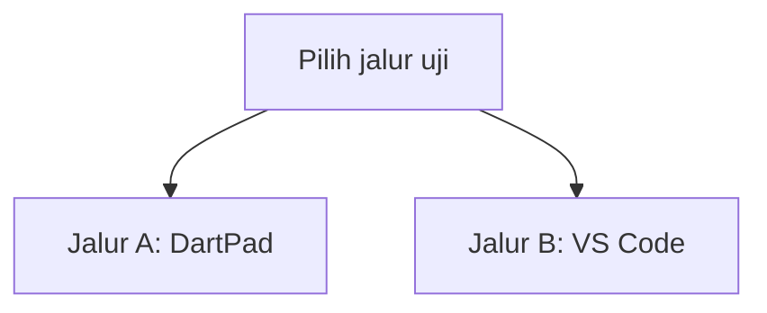
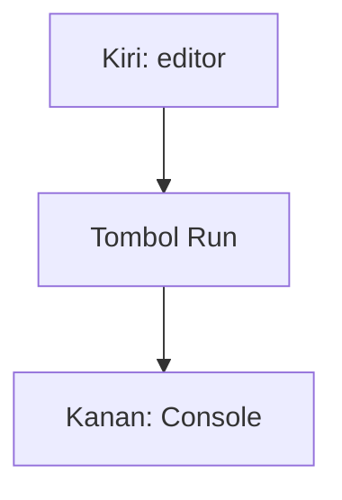
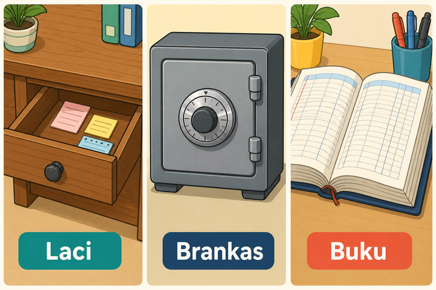
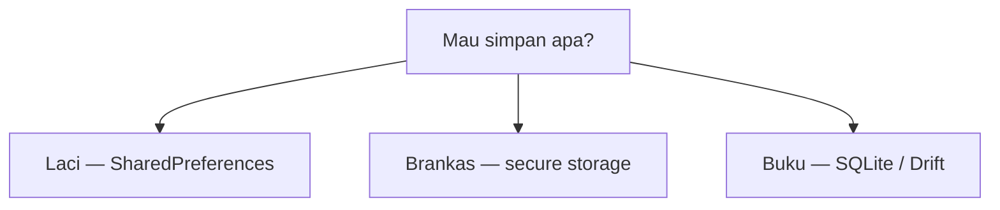
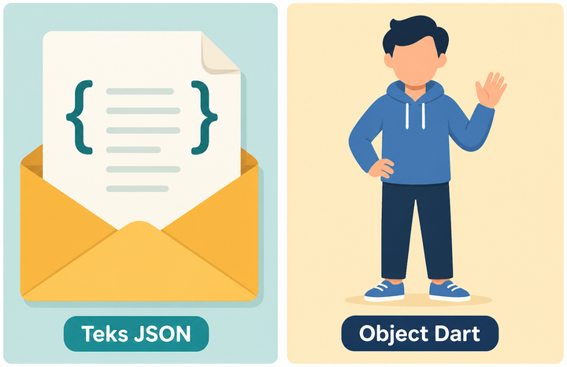
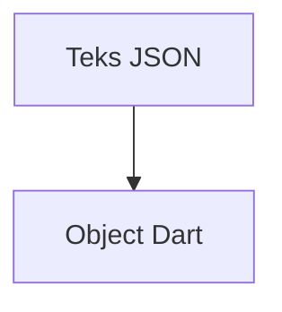
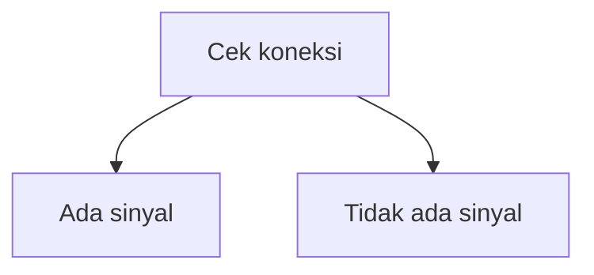
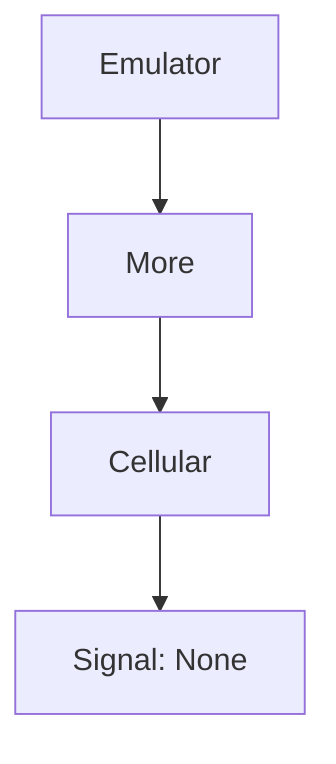
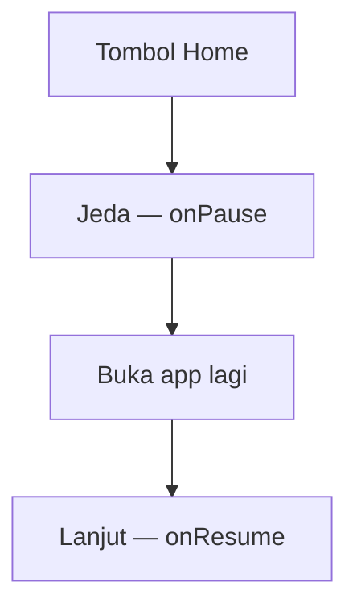

# Modul 05 — Data lokal & kondisi HP

**Waktu:** 2 sesi  
**Prasyarat:** Modul 00–04.  
**Hasil:** Nanti Anda bisa menyimpan data di HP (bukan cuma di memori), menaruh token di tempat yang aman, dan menampilkan banner saat sinyal hilang.

---

## Buka alat ini dulu

Ada **dua jalur uji**. Jangan sampai tertukar.

Paket di modul ini hampir semua **plugin HP** (butuh Android sungguhan). Mereka **tidak** ada di [daftar paket DartPad](https://github.com/dart-lang/dart-pad/wiki/Package-and-plugin-support). Jangan tempel `import 'package:shared_preferences/...'` di DartPad.

| Jalur | Buka | Untuk apa |
| --- | --- | --- |
| A | Browser → [dartpad.dev](https://dartpad.dev) → mode **Dart** atau **Flutter** | `fromJson` / `toJson`, `dart:convert` |
| B | VS Code + Terminal (`Ctrl + J`) + emulator/HP | SharedPreferences, secure storage, file, SQLite, offline |



Letak tombol di DartPad (bukan sketsa):




Sumber gambar: [dart.dev/tools/dartpad](https://dart.dev/tools/dartpad), Dart team / Google ([CC BY 4.0](https://creativecommons.org/licenses/by/4.0/)). Foto resmi itu **tema gelap** (mode **Dart**, keluaran teks di Console) — kalau kelihatan seperti kotak hitam, gulir sampai editor kiri dan tombol **Run** terlihat; itu bukan gambar rusak. Untuk uji JSON, mode **Dart** sudah cukup. Untuk uji plugin HP, jangan pakai DartPad.

### Dua jenis kode di halaman ini

| Jenis | Tanda | Caranya |
| --- | --- | --- |
| **Berkas lengkap** | Ada `import` dan `void main()` | Tempel utuh, lalu **Run** (alat yang disebut di kotak uji) |
| **Cuplikan** | Hanya potongan | Jangan di-Run sendirian |

### Pola uji A — DartPad

| | |
| --- | --- |
| **Buka** | [dartpad.dev](https://dartpad.dev) |
| **Pilih** | mode **Dart** (JSON) atau **Flutter** (kalau ada widget) |
| **Tempel** | **berkas lengkap** |
| **Klik** | **Run** |

### Pola uji B — proyek lokal

| | |
| --- | --- |
| **Buka** | VS Code di folder proyek Flutter, emulator atau HP sudah menyala |
| **Terminal** | `Ctrl + J` |
| **Ketik** | `flutter pub add ...` lalu `flutter run` |

> **Aturan emas:** perintah `flutter ...` hanya di **Terminal VS Code**. DartPad tidak menjalankan `flutter pub add`, dan tidak bisa menulis ke HP.

---

## 1. Tiga tempat menyimpan, bukan satu laci ajaib

Modul 04: data hidup **selama app terbuka**. Tutup app → hilang. Modul ini: data ditulis ke HP, jadi masih ada setelah dibuka lagi.

Analogi rumah:

| Analogi | Untuk apa | Paket |
| --- | --- | --- |
| **Laci** | pengaturan kecil: tema gelap, “sudah lihat onboarding” | `shared_preferences` |
| **Brankas** | rahasia: token login | `flutter_secure_storage` |
| **Buku** | banyak baris yang bisa dicari: daftar tugas, riwayat | SQLite / Drift |



*Ilustrasi asli materi mobile2026. Laci untuk pengaturan kecil, brankas untuk rahasia, buku untuk banyak baris. Penjelasan ada di tabel.*



**Jangan** taruh token atau kata sandi di SharedPreferences. Laci itu tidak dikunci.

Sumber konsep: [Store key-value data on disk](https://docs.flutter.dev/cookbook/persistence/key-value). Flutter and the related logo are trademarks of Google LLC.

---

## 2. Kapan pakai yang mana

| Data | Pakai | Jangan |
| --- | --- | --- |
| Tema gelap, flag onboarding | SharedPreferences | database |
| Token login | `flutter_secure_storage` | SharedPreferences, file teks biasa |
| Satu file JSON / foto unduhan | `path_provider` + `File` | SharedPreferences (kebesaran) |
| Daftar panjang, pencarian, relasi | SQLite / Drift | SharedPreferences |
| Harga / stok yang harus jujur di server | **bukan** hanya di HP | itu Modul 06–07 |

Aturan praktis: mulai dari laci. Kalau datanya sudah seperti tabel, pindah ke buku.

---

## 3. Model data: `fromJson` / `toJson` (jalur A)

HP dan server saling kirim **teks JSON**, bukan class Dart. Anda yang menerjemahkan.

Analogi singkat: JSON = surat. Object Dart = orang yang disebut di surat. `fromJson` membaca surat jadi object. `toJson` menulis object jadi surat lagi.



*Ilustrasi asli materi mobile2026. JSON seperti surat, object Dart seperti orang yang disebut di surat. Alur teknis ada di diagram di bawah.*



`fromJson` = baca surat jadi object. `toJson` = tulis object jadi surat lagi.

Sumber konsep: [JSON and serialization](https://docs.flutter.dev/data-and-backend/serialization/json). Flutter and the related logo are trademarks of Google LLC.

| | |
| --- | --- |
| **Buka** | Browser → [dartpad.dev](https://dartpad.dev) |
| **Pilih** | mode **Dart** |
| **Tempel** | berkas lengkap di bawah |
| **Klik** | **Run** |
| **Lihat** | panel **Console** di kanan |

```dart
import 'dart:convert';

class Tugas {
  Tugas({required this.id, required this.judul, this.selesai = false});

  final String id;
  final String judul;
  final bool selesai;

  factory Tugas.fromJson(Map<String, dynamic> json) {
    return Tugas(
      id: json['id'] as String,
      judul: json['judul'] as String,
      selesai: json['selesai'] as bool? ?? false,
    );
  }

  Map<String, dynamic> toJson() {
    return {'id': id, 'judul': judul, 'selesai': selesai};
  }
}

void main() {
  const teks = '{"id":"1","judul":"Beli beras","selesai":false}';
  final map = jsonDecode(teks) as Map<String, dynamic>;
  final tugas = Tugas.fromJson(map);

  print(tugas.judul);
  print(jsonEncode(tugas.toJson()));
}
```

**Kalau berhasil:** Console menulis `Beli beras` lalu JSON yang sama.

`jsonDecode` butuh `import 'dart:convert';`. Kalau kunci JSON beda dengan nama field, terjemahkan di `fromJson` — jangan harap Dart menebak.

---

## 4. SharedPreferences — laci kecil (jalur B)

Hanya tipe sederhana: `int`, `double`, `bool`, `String`, `List<String>`. Bukan untuk token. Dokumentasi resmi juga mengingatkan: tidak ada jaminan 100% setiap tulis langsung tertulis ke disk, jadi jangan untuk data kritis. Sumber: [Store key-value data on disk](https://docs.flutter.dev/cookbook/persistence/key-value).

| | |
| --- | --- |
| **Buka** | VS Code, folder proyek Flutter |
| **Terminal** | `Ctrl + J` |
| **Ketik** | perintah di bawah |

```powershell
flutter pub add shared_preferences
```

**Kalau berhasil:** `pubspec.yaml` memuat `shared_preferences`.

Lalu ganti `lib/main.dart` (berkas lengkap, **jalur B** — `flutter run`, bukan DartPad):

```dart
import 'package:flutter/material.dart';
import 'package:shared_preferences/shared_preferences.dart';

void main() {
  runApp(const MateriApp());
}

class MateriApp extends StatelessWidget {
  const MateriApp({super.key});

  @override
  Widget build(BuildContext context) {
    return const MaterialApp(home: TemaPage());
  }
}

class TemaPage extends StatefulWidget {
  const TemaPage({super.key});

  @override
  State<TemaPage> createState() => _TemaPageState();
}

class _TemaPageState extends State<TemaPage> {
  bool gelap = false;

  @override
  void initState() {
    super.initState();
    _muat();
  }

  Future<void> _muat() async {
    final prefs = await SharedPreferences.getInstance();
    setState(() {
      gelap = prefs.getBool('gelap') ?? false;
    });
  }

  Future<void> _ubah(bool nilai) async {
    final prefs = await SharedPreferences.getInstance();
    await prefs.setBool('gelap', nilai);
    setState(() {
      gelap = nilai;
    });
  }

  @override
  Widget build(BuildContext context) {
    return Scaffold(
      appBar: AppBar(title: const Text('Laci: tema')),
      body: Center(
        child: SwitchListTile(
          title: const Text('Mode gelap'),
          value: gelap,
          onChanged: _ubah,
        ),
      ),
    );
  }
}
```

**Kalau berhasil:** sakelar tetap posisinya setelah Anda tekan `q` di terminal, lalu `flutter run` lagi. Tutup app, buka lagi — nilai tidak reset.

Untuk daftar tugas, simpan **satu String JSON**, bukan seratus kunci `tugas1`, `tugas2`.

---

## 5. `flutter_secure_storage` — brankas (jalur B)

API-nya mirip laci (`write` / `read`), tapi di Android memakai penyimpanan terenkripsi, di iOS memakai Keychain. Paket: [pub.dev/packages/flutter_secure_storage](https://pub.dev/packages/flutter_secure_storage).

| | |
| --- | --- |
| **Buka** | Terminal VS Code |
| **Ketik** | perintah di bawah |

```powershell
flutter pub add flutter_secure_storage
```

Cuplikan (jangan di-Run sendirian; gabungkan ke proyek jalur B):

```dart
final brankas = FlutterSecureStorage();

await brankas.write(key: 'token', value: 'abc.rahasia');
final token = await brankas.read(key: 'token');
await brankas.delete(key: 'token');
```

Butuh `import 'package:flutter_secure_storage/flutter_secure_storage.dart';`.

Di modul ini cukup **latihan tulis-baca-hapus** string palsu. Token login sungguhan datang di **Modul 06–08**. Jangan menaruh kata sandi orang di contoh.

---

## 6. `path_provider` dan file JSON (jalur B)

SharedPreferences = kunci-nilai. File = satu berkas di folder milik app. Sumber: [Read and write files](https://docs.flutter.dev/cookbook/persistence/reading-writing-files).

| | |
| --- | --- |
| **Buka** | Terminal VS Code |
| **Ketik** | perintah di bawah |

```powershell
flutter pub add path_provider
```

Cuplikan (jalur B):

```dart
import 'dart:convert';
import 'dart:io';

import 'package:path_provider/path_provider.dart';

Future<File> berkasTugas() async {
  final folder = await getApplicationDocumentsDirectory();
  return File('${folder.path}/tugas.json');
}

Future<void> simpanTugas(List<Map<String, dynamic>> isi) async {
  final file = await berkasTugas();
  await file.writeAsString(jsonEncode(isi));
}

Future<List<dynamic>> bacaTugas() async {
  final file = await berkasTugas();
  if (!await file.exists()) return [];
  return jsonDecode(await file.readAsString()) as List<dynamic>;
}
```

`getApplicationDocumentsDirectory()` = folder yang **tidak** ikut terhapus saat app diperkecil. Cache boleh hilang; dokumen app jangan.

Foto unduhan atau gambar profil juga masuk folder itu (berkas `.jpg` / `.png`), **bukan** SharedPreferences. Menampilkan file itu memakai `Image.file` — cukup tahu tempatnya dulu; unggah ke internet ada di Modul 06.

`dart:io` + `File` **tidak** jalan di DartPad web. Itu sebabnya file hanya jalur B.

---

## 7. SQLite / Drift — buku (jalur B)

Kalau daftar sudah panjang, butuh cari, atau punya relasi (tugas → sub-tugas), pakai database.

Dokumentasi Flutter memakai paket **`sqflite`** ([Persist data with SQLite](https://docs.flutter.dev/cookbook/persistence/sqlite)). Materi ini mengikuti itu untuk contoh yang bisa dijalankan. **Drift** (di atas SQLite, lebih ketat tipenya) disebut di silabus: bagus untuk proyek besar, butuh `build_runner`. Mini proyek modul ini **tidak** mewajibkan Drift.

| | |
| --- | --- |
| **Buka** | Terminal VS Code |
| **Ketik** | perintah di bawah |

```powershell
flutter pub add sqflite path
```

**Kalau berhasil:** `pubspec.yaml` memuat `sqflite` dan `path`.

Cookbook resmi: `sqflite` untuk Android / iOS / macOS. Materi ini menguji di **emulator atau HP Android**.

Cuplikan buka database + migrasi (jangan di-Run sendirian):

```dart
import 'package:path/path.dart';
import 'package:sqflite/sqflite.dart';

Future<Database> bukaDb() async {
  return openDatabase(
    join(await getDatabasesPath(), 'tugas.db'),
    version: 2,
    onCreate: (db, version) {
      return db.execute(
        'CREATE TABLE tugas(id INTEGER PRIMARY KEY, judul TEXT, selesai INTEGER)',
      );
    },
    onUpgrade: (db, lama, baru) async {
      if (lama < 2) {
        await db.execute('ALTER TABLE tugas ADD COLUMN catatan TEXT');
      }
    },
  );
}
```

`version: 2` + `onUpgrade`: kalau tabel berubah, data lama **jangan** dihapus begitu saja. Naikkan nomor versi, tulis langkah migrasi. Jangan interpolasi `'id = $id'` di SQL — pakai `where: 'id = ?'` dan `whereArgs` supaya aman.

Sisip, baca, ubah, hapus: pola lengkap ada di cookbook di atas. **Mini proyek hari ini tidak wajib mengetik SQL.** Itu memakai SharedPreferences + JSON supaya selesai dalam sesi ini. SQLite siap dipakai saat daftar sudah terasa sesak.

Drift (cuplikan ide, bukan uji): class tabel → `build_runner` menghasilkan kode. Dokumentasi: [drift.simonbinder.eu](https://drift.simonbinder.eu).

---

## 8. Online / offline (jalur B)

Aplikasi yang sopan: kalau sinyal hilang, **bilang**. Jangan biarkan loading berputar tanpa ujung.



Paket: `connectivity_plus` ([pub.dev/packages/connectivity_plus](https://pub.dev/packages/connectivity_plus)). Ini mendeteksi **jenis jaringan**, bukan “internet benar-benar jalan”. Wi-Fi tanpa kuota masih bisa terlihat online. Untuk cek sungguhan, nanti panggil API (Modul 07) dan tangkap error.

| | |
| --- | --- |
| **Buka** | Terminal VS Code |
| **Ketik** | perintah di bawah |

```powershell
flutter pub add connectivity_plus
```

Cuplikan (jalur B):

```dart
final hasil = await Connectivity().checkConnectivity();
final offline = hasil.contains(ConnectivityResult.none);
```

Versi lama paket ini mengembalikan **satu** `ConnectivityResult`, bukan `List`. Kalau error merah soal tipe, baca pesan di terminal — sesuaikan: `hasil == ConnectivityResult.none` atau `hasil.contains(...)`.

Cara uji sinyal hilang:



Sumber langkah emulator: [Extended controls, settings, and help](https://developer.android.com/studio/run/emulator-extended-controls) (Android Developers). Di HP fisik: mode pesawat, lalu lihat banner.

---

## 9. Siklus hidup singkat: jeda dan lanjut

Orang menekan tombol Home. Aplikasi tidak mati, tapi **jeda**. Musik, GPS, atau cek jaringan sering perlu dihentikan, lalu dilanjut saat layar kembali kelihatan.



Flutter menyediakan `AppLifecycleListener`. Pola lama: `WidgetsBindingObserver`. Keduanya sah.

Ini **cuplikan** (jalur B). Jangan di-Run sendirian di DartPad; tempel di dalam `State` proyek lokal.

| | |
| --- | --- |
| **Buka** | VS Code, `lib/main.dart` proyek jalur B |
| **Tempel** | di dalam class `State`, bukan sebagai berkas utuh |

```dart
late final AppLifecycleListener pendengar;

@override
void initState() {
  super.initState();
  pendengar = AppLifecycleListener(
    onResume: () {
      // App kelihatan lagi: cek koneksi, lanjut unduhan.
    },
    onPause: () {
      // App ke belakang: jeda dulu.
    },
  );
}

@override
void dispose() {
  pendengar.dispose();
  super.dispose();
}
```

Sumber konsep siklus hidup: [Flutter for Android developers](https://docs.flutter.dev/flutter-for/android-devs) (bagian activity lifecycle).

---

## Mini proyek: daftar tugas yang tidak hilang (jalur B)

Syarat silabus: to-do tetap ada setelah app ditutup, plus banner jika offline.

Urutan kerja, jangan terbalik:

1. Buka **VS Code** di folder proyek Flutter (bukan DartPad).
2. Nyalakan emulator atau HP USB.
3. Buka Terminal (`Ctrl + J`), ketik perintah `flutter pub add` di bawah.
4. Ganti isi `lib/main.dart` dengan berkas lengkap.
5. Ketik `flutter run`.
6. Uji: tutup app, buka lagi — daftar masih ada. Matikan sinyal — banner muncul.

| | |
| --- | --- |
| **Buka** | VS Code, folder proyek Flutter |
| **Terminal** | `Ctrl + J` |
| **Ketik** | perintah di bawah, emulator/HP menyala, lalu tempel berkas ke `lib/main.dart` |

```powershell
flutter pub add shared_preferences connectivity_plus
flutter run
```

```dart
import 'dart:convert';

import 'package:connectivity_plus/connectivity_plus.dart';
import 'package:flutter/material.dart';
import 'package:shared_preferences/shared_preferences.dart';

void main() {
  runApp(const MateriApp());
}

class MateriApp extends StatelessWidget {
  const MateriApp({super.key});

  @override
  Widget build(BuildContext context) {
    return const MaterialApp(home: TugasPage());
  }
}

class Tugas {
  Tugas({required this.id, required this.judul, this.selesai = false});

  final String id;
  final String judul;
  bool selesai;

  factory Tugas.fromJson(Map<String, dynamic> json) {
    return Tugas(
      id: json['id'] as String,
      judul: json['judul'] as String,
      selesai: json['selesai'] as bool? ?? false,
    );
  }

  Map<String, dynamic> toJson() {
    return {'id': id, 'judul': judul, 'selesai': selesai};
  }
}

class TugasPage extends StatefulWidget {
  const TugasPage({super.key});

  @override
  State<TugasPage> createState() => _TugasPageState();
}

class _TugasPageState extends State<TugasPage> {
  final _judul = TextEditingController();
  final _daftar = <Tugas>[];
  bool offline = false;

  @override
  void initState() {
    super.initState();
    _muat();
    _pantauKoneksi();
  }

  Future<void> _pantauKoneksi() async {
    final awal = await Connectivity().checkConnectivity();
    _terapkanKoneksi(awal);
    Connectivity().onConnectivityChanged.listen(_terapkanKoneksi);
  }

  void _terapkanKoneksi(List<ConnectivityResult> hasil) {
    setState(() {
      offline = hasil.contains(ConnectivityResult.none);
    });
  }

  Future<void> _muat() async {
    final prefs = await SharedPreferences.getInstance();
    final teks = prefs.getString('tugas') ?? '[]';
    final list = jsonDecode(teks) as List<dynamic>;
    setState(() {
      _daftar
        ..clear()
        ..addAll(
          list.map((e) => Tugas.fromJson(e as Map<String, dynamic>)),
        );
    });
  }

  Future<void> _simpan() async {
    final prefs = await SharedPreferences.getInstance();
    await prefs.setString(
      'tugas',
      jsonEncode(_daftar.map((e) => e.toJson()).toList()),
    );
  }

  Future<void> _tambah() async {
    final judul = _judul.text.trim();
    if (judul.isEmpty) return;
    setState(() {
      _daftar.add(
        Tugas(id: DateTime.now().millisecondsSinceEpoch.toString(), judul: judul),
      );
      _judul.clear();
    });
    await _simpan();
  }

  Future<void> _centang(Tugas t, bool? nilai) async {
    setState(() {
      t.selesai = nilai ?? false;
    });
    await _simpan();
  }

  @override
  void dispose() {
    _judul.dispose();
    super.dispose();
  }

  @override
  Widget build(BuildContext context) {
    return Scaffold(
      appBar: AppBar(title: const Text('Tugas lokal')),
      body: Column(
        children: [
          if (offline)
            MaterialBanner(
              content: const Text('Tidak ada sinyal. Data tetap di HP ini.'),
              actions: [
                TextButton(onPressed: () {}, child: const Text('OK')),
              ],
            ),
          Padding(
            padding: const EdgeInsets.all(12),
            child: Row(
              children: [
                Expanded(
                  child: TextField(
                    controller: _judul,
                    decoration: const InputDecoration(labelText: 'Tugas baru'),
                  ),
                ),
                const SizedBox(width: 8),
                FilledButton(onPressed: _tambah, child: const Text('Tambah')),
              ],
            ),
          ),
          Expanded(
            child: ListView.builder(
              itemCount: _daftar.length,
              itemBuilder: (context, i) {
                final t = _daftar[i];
                return CheckboxListTile(
                  title: Text(t.judul),
                  value: t.selesai,
                  onChanged: (v) => _centang(t, v),
                );
              },
            ),
          ),
        ],
      ),
    );
  }
}
```

**Kalau berhasil:**

1. Tambah beberapa tugas, centang satu.
2. Tekan `q`, lalu `flutter run` lagi — daftar masih ada.
3. Matikan jaringan di emulator/HP — banner **Tidak ada sinyal** muncul.

Kalau `checkConnectivity` error karena bukan `List`, sesuaikan seperti catatan di bagian 8.

Pecah ke folder `lib/ui/` dan `lib/data/` seperti Modul 04 kalau sudah nyaman. Token **jangan** ikut tersimpan di kunci `tugas`.

---

## Kesalahan yang sering terjadi

| Gejala | Penyebab yang sering | Perbaikan |
| --- | --- | --- |
| `shared_preferences` error di DartPad | plugin tidak ada di DartPad | Jalur B, `flutter pub add` |
| Data hilang setelah hot reload saja | hot restart / `q` belum dicoba | Uji tutup app sungguhan, `flutter run` lagi |
| Token di SharedPreferences | laci dipakai sebagai brankas | `flutter_secure_storage` |
| `File` merona di DartPad | `dart:io` bukan untuk web DartPad | Jalur B |
| SQL `where: "id = $id"` | interpolasi string | `where: 'id = ?', whereArgs: [id]` |
| Offline tidak berubah | emulator masih “punya jaringan virtual” | airplane mode HP, atau setelan seluler emulator |
| `List<ConnectivityResult>` vs satu nilai | versi paket beda | ikuti tipe di pesan error |

---

## Latihan

1. (DartPad) Tambah field `int prioritas` pada `Tugas`, lengkapkan `fromJson` / `toJson`.
2. (Jalur B) Simpan juga `gelap` (bool) di SharedPreferences, terapkan `ThemeMode`.
3. (Jalur B) Tombol **Hapus selesai** yang membuang tugas `selesai == true`, lalu `_simpan()`.
4. (Jalur B) Tulis string `latihan-token` ke secure storage, baca, tampilkan 4 huruf pertama saja.
5. (Jalur B) Di `onResume`, panggil lagi `checkConnectivity`.

---

## Kuis singkat

1. Token login disimpan di mana: SharedPreferences atau secure storage? Kenapa?
2. Perintah `flutter pub add shared_preferences` diketik di mana?
3. `fromJson` mengerjakan apa, dalam satu kalimat?
4. `connectivity_plus` menjamin internet “benar-benar nyambung”? 

Kunci jawaban di bawah. Coba jawab dulu.

---

## Apa yang belum dibahas

- Firebase sebagai dapur di internet → **Modul 06**
- REST + `dio`, error jaringan sungguhan → Modul 07
- Auth, isi token dari login → Modul 06–08
- Drift mendalam + `build_runner` → tidak di jalur wajib; cukup tahu namanya

---

## Kunci kuis

1. Secure storage. SharedPreferences tidak dikunci; token mudah terbaca di cadangan/perangkat.
2. Terminal VS Code di folder proyek, bukan DartPad.
3. Mengubah `Map` / JSON menjadi object Dart.
4. Tidak. Itu status jaringan. Wi-Fi tanpa kuota masih bisa terlihat online.

---

## Sumber gambar dan tautan

| Aset | Sumber |
| --- | --- |
| `images/analogi-laci-brankas-buku.png` | Ilustrasi asli materi mobile2026 |
| `images/analogi-surat-json.png` | Ilustrasi asli materi mobile2026 |
| Tampilan DartPad | [dart.dev/assets/img/dartpad-hello.png](https://dart.dev/assets/img/dartpad-hello.png) dari [dart.dev/tools/dartpad](https://dart.dev/tools/dartpad) ([CC BY 4.0](https://creativecommons.org/licenses/by/4.0/)) |
| SharedPreferences | [docs.flutter.dev/cookbook/persistence/key-value](https://docs.flutter.dev/cookbook/persistence/key-value) |
| JSON `fromJson` / `toJson` | [docs.flutter.dev/data-and-backend/serialization/json](https://docs.flutter.dev/data-and-backend/serialization/json) |
| File lokal | [docs.flutter.dev/cookbook/persistence/reading-writing-files](https://docs.flutter.dev/cookbook/persistence/reading-writing-files) |
| SQLite / `sqflite` | [docs.flutter.dev/cookbook/persistence/sqlite](https://docs.flutter.dev/cookbook/persistence/sqlite) |
| `flutter_secure_storage` | [pub.dev/packages/flutter_secure_storage](https://pub.dev/packages/flutter_secure_storage) |
| `path_provider` | [pub.dev/packages/path_provider](https://pub.dev/packages/path_provider) |
| `connectivity_plus` | [pub.dev/packages/connectivity_plus](https://pub.dev/packages/connectivity_plus) |
| Siklus hidup | [docs.flutter.dev/flutter-for/android-devs](https://docs.flutter.dev/flutter-for/android-devs) |
| Uji sinyal di emulator | [developer.android.com/studio/run/emulator-extended-controls](https://developer.android.com/studio/run/emulator-extended-controls) |
| Drift | [drift.simonbinder.eu](https://drift.simonbinder.eu) |
| Paket DartPad | [dart-lang/dart-pad wiki](https://github.com/dart-lang/dart-pad/wiki/Package-and-plugin-support) |

Flutter and the related logo are trademarks of Google LLC. We are not endorsed by or affiliated with Google LLC.
