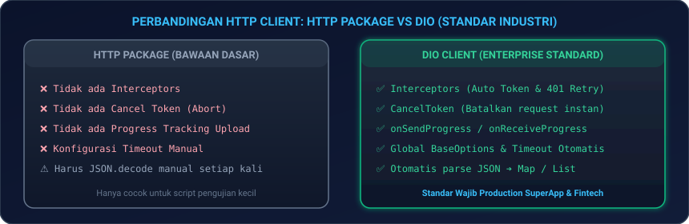
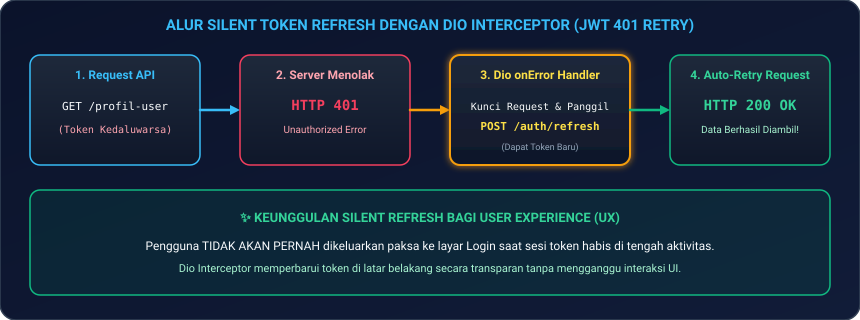
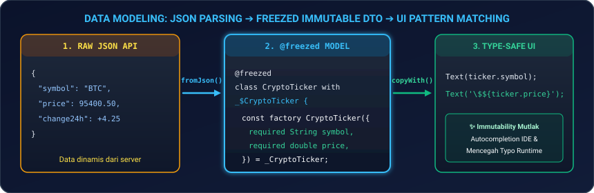
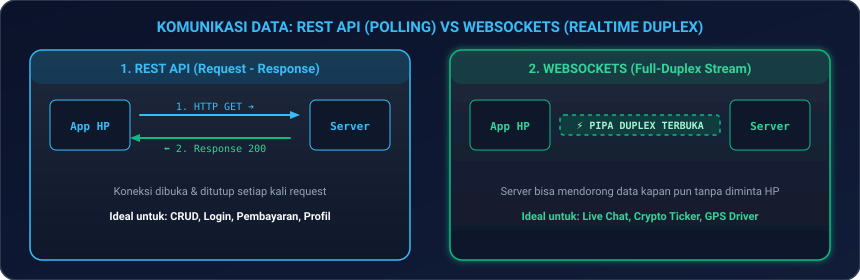

# Modul 05: Networking Lanjutan, REST (Dio), Interceptors, & WebSockets Realtime

Selamat datang di **Modul 05**! Di modul ini, Anda akan menguasai arsitektur komunikasi jaringan tingkat lanjut berstandar industri menggunakan **`Dio`**, membangun sistem **Silent Token Refresh (JWT 401 Interceptors)** agar sesi pengguna tidak pernah terputus, memodelkan data secara *type-safe* menggunakan **`Freezed`**, melacak progress upload/download dengan **`CancelToken`**, hingga mengimplementasikan komunikasi dua arah secara *realtime* menggunakan **`WebSockets`**.

---

## 🌐 1. Analogi: Kurir Diplomatik & Pipa Telepon Khusus

Untuk memahami bagaimana aplikasi mobile bertukar data dengan server:

| Protokol / Alat | Analogi Kehidupan Nyata | Penjelasan Teknis |
|---|---|---|
| **REST API (Dio)** | **Kurir Diplomatik dengan SOP Ketat** | Setiap kali butuh data, kurir dikirim membawa surat permohonan (`Request`) lengkap dengan stempel visa (`Bearer Token`) dan kembali membawa balasan (`Response`). |
| **Dio Interceptors** | **Pos Penjagaan & Pemeriksaan Paspor** | Memeriksa dan memperbarui stempel visa yang kedaluwarsa secara diam-diam (*Silent Refresh*) sebelum kurir melanjutkan perjalanan tanpa disadari oleh pengirim. |
| **WebSockets** | **Pipa Telepon Langsung yang Terus Tersambung** | Sambungan kabel dibuka satu kali dan dibiarkan aktif 24/7. Server dapat membisikkan data harga saham atau chat terbaru seketika tanpa perlu diminta oleh HP. |
| **`Freezed` Data Model** | **Kontrak Akta Notaris Anti-Pemalsuan** | Data JSON yang masuk langsung dibekukan menjadi objek *immutable* yang anti-salah ketik (*type-safe*) saat dikompilasi. |

---

## ⚡ 2. HTTP Client: Mengapa `Dio` Menggantikan `http` Standard?

<p align="center">
  
</p>

### 2.1 Konfigurasi Dasar Dio Singleton

```dart
import 'package:dio/dio.dart';

class ApiClient {
  static final ApiClient _instance = ApiClient._internal();
  late final Dio dio;

  factory ApiClient() => _instance;

  ApiClient._internal() {
    dio = Dio(
      BaseOptions(
        baseUrl: 'https://api.tokokita2026.com/v1',
        connectTimeout: const Duration(seconds: 10), // Timeout koneksi ke server
        receiveTimeout: const Duration(seconds: 15), // Timeout menerima respons data
        sendTimeout: const Duration(seconds: 10),    // Timeout mengirim body payload
        headers: {
          'Accept': 'application/json',
          'Content-Type': 'application/json',
        },
      ),
    );
  }
}
```

---

## 🔐 3. Dio Interceptors & Silent Token Refresh (JWT 401)

Salah satu keunggulan terbesar Dio di aplikasi enterprise adalah **Interceptors**. Anda dapat menyisipkan token autentikasi secara otomatis dan memperbarui token yang habis masa berlakunya tanpa membuat pengguna terlempar keluar ke halaman Login (*Silent Refresh*).

<p align="center">
  
</p>

### Implementasi `QueuedInterceptorsWrapper`:

```dart
import 'package:dio/dio.dart';

class AuthInterceptor extends QueuedInterceptor {
  final Dio dio;
  AuthInterceptor(this.dio);

  // 1. onRequest: Menyisipkan Token ke setiap header request
  @override
  void onRequest(RequestOptions options, RequestInterceptorHandler handler) async {
    final String? accessToken = await _getAccessTokenFromSecureStorage();
    if (accessToken != null) {
      options.headers['Authorization'] = 'Bearer $accessToken';
    }
    return handler.next(options);
  }

  // 2. onError: Menangkap error 401 dan melakukan refresh token otomatis
  @override
  void onError(DioException err, ErrorInterceptorHandler handler) async {
    if (err.response?.statusCode == 401) {
      try {
        // Ambil refresh token dan minta access token baru ke server
        final String? refreshToken = await _getRefreshTokenFromSecureStorage();
        if (refreshToken == null) throw Exception('No refresh token');

        // Gunakan instance Dio terpisah agar tidak memicu interceptor berulang
        final refreshDio = Dio(BaseOptions(baseUrl: 'https://api.tokokita2026.com/v1'));
        final response = await refreshDio.post('/auth/refresh', data: {
          'refresh_token': refreshToken,
        });

        final newAccessToken = response.data['access_token'] as String;
        await _saveAccessTokenToSecureStorage(newAccessToken);

        // Perbarui header request lama yang sempat gagal dan kirim ulang (RETRY)
        final RequestOptions retryOptions = err.requestOptions;
        retryOptions.headers['Authorization'] = 'Bearer $newAccessToken';

        final retryResponse = await dio.fetch(retryOptions);
        return handler.resolve(retryResponse); // Berikan hasil sukses ke UI!
      } catch (e) {
        // Jika refresh token juga kedaluwarsa -> Lempar user ke halaman Login
        _forceLogoutUser();
        return handler.reject(err);
      }
    }
    return handler.next(err);
  }

  Future<String?> _getAccessTokenFromSecureStorage() async => 'OLD_EXPIRED_TOKEN';
  Future<String?> _getRefreshTokenFromSecureStorage() async => 'VALID_REFRESH_TOKEN';
  Future<void> _saveAccessTokenToSecureStorage(String token) async {}
  void _forceLogoutUser() => print('Sesi benar-benar habis, diarahkan ke Login.');
}
```

---

## ❄️ 4. Data Modeling: Immutability & `Freezed`

Mem-parsing JSON secara manual dengan `Map<String, dynamic>` sangat rentan terhadap kesalahan ketik (*typo*) saat runtime. Gunakan **`Freezed`** bersama **`json_serializable`**:

<p align="center">
  
</p>

### 4.1 Definisi Model Freezed

Tambahkan dependensi di `pubspec.yaml`:
```yaml
dependencies:
  freezed_annotation: ^2.4.4
  json_annotation: ^4.9.0

dev_dependencies:
  build_runner: ^2.4.9
  freezed: ^2.5.2
  json_serializable: ^6.8.0
```

```dart
// crypto_ticker.dart
import 'package:freezed_annotation/freezed_annotation.dart';

part 'crypto_ticker.freezed.dart';
part 'crypto_ticker.g.dart';

@freezed
class CryptoTicker with _$CryptoTicker {
  const factory CryptoTicker({
    required String symbol,
    required double price,
    @Default(0.0) double change24h,
    @JsonKey(name: 'volume_usd') double? volumeUsd,
  }) = _CryptoTicker;

  factory CryptoTicker.fromJson(Map<String, dynamic> json) =>
      _$CryptoTickerFromJson(json);
}
```

Jalankan perintah generator di terminal:
```bash
dart run build_runner build --delete-conflicting-outputs
```

---

## 📤 5. Upload & Download File dengan Progress & `CancelToken`

### 5.1 Upload Berkas (Multipart/FormData) dengan Progress Bar
```dart
Future<void> uploadBuktiTransfer(String filePath) async {
  final formData = FormData.fromMap({
    'user_id': '101',
    'foto_struk': await MultipartFile.fromFile(
      filePath,
      filename: 'struk_pembayaran.jpg',
    ),
  });

  await ApiClient().dio.post(
    '/pembayaran/upload',
    data: formData,
    onSendProgress: (int sent, int total) {
      final double progress = (sent / total) * 100;
      print('📤 Mengunggah: ${progress.toStringAsFixed(1)}%');
    },
  );
}
```

---

### 5.2 Membatalkan Request Instan dengan `CancelToken`
Saat pengguna berpindah halaman sebelum request selesai, batalkan koneksi agar tidak membuang bandwidth:

```dart
final CancelToken _cancelToken = CancelToken();

void fetchLargeData() async {
  try {
    final response = await ApiClient().dio.get(
      '/laporan-tahunan-pdf',
      cancelToken: _cancelToken,
    );
  } on DioException catch (e) {
    if (CancelToken.isCancel(e)) {
      print('⏹️ Request dibatalkan oleh pengguna.');
    }
  }
}

// Saat widget ditutup:
@override
void dispose() {
  _cancelToken.cancel('Pengguna meninggalkan layar');
  super.dispose();
}
```

---

## 📡 6. WebSockets & Realtime Communication

<p align="center">
  
</p>

### 6.1 Koneksi Realtime dengan `web_socket_channel`

```dart
import 'dart:convert';
import 'package:web_socket_channel/web_socket_channel.dart';

class CryptoWebSocketService {
  late WebSocketChannel _channel;

  Stream<dynamic> connectToBinanceTicker(String symbol) {
    // Menghubungkan ke WebSocket Binance Realtime Ticker
    _channel = WebSocketChannel.connect(
      Uri.parse('wss://stream.binance.com:9443/ws/${symbol.toLowerCase()}@ticker'),
    );

    return _channel.stream.map((rawMessage) {
      return jsonDecode(rawMessage as String);
    });
  }

  void kirimPesan(Map<String, dynamic> data) {
    _channel.sink.add(jsonEncode(data));
  }

  void disconnect() {
    _channel.sink.close();
  }
}
```

---

## 💻 7. Hands-on Super Project: Realtime Crypto Price Ticker & Network Monitor

Mari kita bangun aplikasi pemantau harga aset kripto secara *live* yang memadukan **REST API (Dio)** untuk statistik 24 jam dan **WebSockets** untuk update harga tiap milidetik:

1. **Buat file baru** `lib/crypto_ticker_page.dart` di proyek Flutter Anda.
2. **Salin kode lengkap berikut**:

```dart
import 'dart:convert';
import 'package:flutter/material.dart';
import 'package:dio/dio.dart';
import 'package:web_socket_channel/web_socket_channel.dart';

void main() {
  runApp(const CryptoApp());
}

class CryptoApp extends StatelessWidget {
  const CryptoApp({super.key});

  @override
  Widget build(BuildContext context) {
    return MaterialApp(
      debugShowCheckedModeBanner: false,
      theme: ThemeData(
        useMaterial3: true,
        brightness: Brightness.dark,
        colorSchemeSeed: Colors.amber,
      ),
      home: const CryptoTickerPage(),
    );
  }
}

class CryptoTickerPage extends StatefulWidget {
  const CryptoTickerPage({super.key});

  @override
  State<CryptoTickerPage> createState() => _CryptoTickerPageState();
}

class _CryptoTickerPageState extends State<CryptoTickerPage> {
  final Dio _dio = Dio(BaseOptions(baseUrl: 'https://api.binance.com/api/v3'));
  WebSocketChannel? _wsChannel;

  String _currentPrice = '0.00';
  String _high24h = '0.00';
  String _low24h = '0.00';
  String _priceChangePercent = '0.00';
  bool _isLoading = true;
  Color _priceColor = Colors.white;

  @override
  void initState() {
    super.initState();
    _fetch24hStats();
    _initWebSocket();
  }

  // 1. REST API: Mengambil Statistik 24 Jam Pertama Kali
  Future<void> _fetch24hStats() async {
    try {
      final response = await _dio.get('/ticker/24hr?symbol=BTCUSDT');
      final data = response.data;
      setState(() {
        _high24h = double.parse(data['highPrice']).toStringAsFixed(2);
        _low24h = double.parse(data['lowPrice']).toStringAsFixed(2);
        _priceChangePercent = double.parse(data['priceChangePercent']).toStringAsFixed(2);
        _isLoading = false;
      });
    } catch (e) {
      setState(() => _isLoading = false);
      print('Gagal fetch REST API: $e');
    }
  }

  // 2. WEBSOCKET: Mendengarkan Perubahan Harga Realtime Tiap Detik
  void _initWebSocket() {
    _wsChannel = WebSocketChannel.connect(
      Uri.parse('wss://stream.binance.com:9443/ws/btcusdt@ticker'),
    );

    _wsChannel?.stream.listen((message) {
      final data = jsonDecode(message as String);
      final double newPrice = double.parse(data['c']);
      final double oldPrice = double.tryParse(_currentPrice) ?? newPrice;

      if (mounted) {
        setState(() {
          _priceColor = newPrice >= oldPrice ? Colors.greenAccent : Colors.redAccent;
          _currentPrice = newPrice.toStringAsFixed(2);
          _priceChangePercent = double.parse(data['P']).toStringAsFixed(2);
        });
      }
    });
  }

  @override
  void dispose() {
    _wsChannel?.sink.close();
    super.dispose();
  }

  @override
  Widget build(BuildContext context) {
    return Scaffold(
      appBar: AppBar(
        title: const Text('Bitcoin Live Tracker ⚡', style: TextStyle(fontWeight: FontWeight.bold)),
        actions: [
          IconButton(
            icon: const Icon(Icons.refresh),
            onPressed: () {
              setState(() => _isLoading = true);
              _fetch24hStats();
            },
          ),
        ],
      ),
      body: _isLoading
          ? const Center(child: CircularProgressIndicator())
          : Padding(
              padding: const EdgeInsets.all(20.0),
              child: Column(
                crossAxisAlignment: CrossAxisAlignment.stretch,
                children: [
                  // Main Live Price Card
                  Card(
                    elevation: 4,
                    shape: RoundedRectangleBorder(borderRadius: BorderRadius.circular(16)),
                    child: Padding(
                      padding: const EdgeInsets.all(24.0),
                      child: Column(
                        children: [
                          const Row(
                            mainAxisAlignment: MainAxisAlignment.center,
                            children: [
                              Icon(Icons.currency_bitcoin, color: Colors.amber, size: 32),
                              SizedBox(width: 8),
                              Text('BTC / USDT', style: TextStyle(fontSize: 20, fontWeight: FontWeight.bold)),
                            ],
                          ),
                          const SizedBox(height: 16),
                          AnimatedDefaultTextStyle(
                            duration: const Duration(milliseconds: 300),
                            style: TextStyle(
                              fontSize: 36,
                              fontWeight: FontWeight.bold,
                              color: _priceColor,
                            ),
                            child: Text('\$$_currentPrice'),
                          ),
                          const SizedBox(height: 8),
                          Container(
                            padding: const EdgeInsets.symmetric(horizontal: 12, vertical: 4),
                            decoration: BoxDecoration(
                              color: _priceChangePercent.startsWith('-')
                                  ? Colors.red.withOpacity(0.2)
                                  : Colors.green.withOpacity(0.2),
                              borderRadius: BorderRadius.circular(8),
                            ),
                            child: Text(
                              '${_priceChangePercent}% 24h',
                              style: TextStyle(
                                color: _priceChangePercent.startsWith('-') ? Colors.redAccent : Colors.greenAccent,
                                fontWeight: FontWeight.bold,
                              ),
                            ),
                          ),
                        ],
                      ),
                    ),
                  ),
                  const SizedBox(height: 20),

                  // 24H Stats Grid
                  Row(
                    children: [
                      Expanded(
                        child: _buildStatCard('24h High 📈', '\$$_high24h', Colors.greenAccent),
                      ),
                      const SizedBox(width: 12),
                      Expanded(
                        child: _buildStatCard('24h Low 📉', '\$$_low24h', Colors.redAccent),
                      ),
                    ],
                  ),
                  const Spacer(),

                  // Connection Status Pill
                  Container(
                    padding: const EdgeInsets.all(12),
                    decoration: BoxDecoration(
                      color: Colors.grey.shade900,
                      borderRadius: BorderRadius.circular(12),
                      border: Border.all(color: Colors.greenAccent.withOpacity(0.5)),
                    ),
                    child: const Row(
                      mainAxisAlignment: MainAxisAlignment.center,
                      children: [
                        Icon(Icons.circle, color: Colors.greenAccent, size: 12),
                        SizedBox(width: 8),
                        Text('WebSocket Live Stream Connected', style: TextStyle(fontSize: 12)),
                      ],
                    ),
                  ),
                ],
              ),
            ),
    );
  }

  Widget _buildStatCard(String label, String value, Color color) {
    return Card(
      child: Padding(
        padding: const EdgeInsets.all(16.0),
        child: Column(
          crossAxisAlignment: CrossAxisAlignment.start,
          children: [
            Text(label, style: TextStyle(fontSize: 12, color: Colors.grey.shade400)),
            const SizedBox(height: 6),
            Text(value, style: TextStyle(fontSize: 16, fontWeight: FontWeight.bold, color: color)),
          ],
        ),
      ),
    );
  }
}
```

3. **Jalankan Aplikasi**:
   ```bash
   flutter run
   ```
   *Lihat warna harga berubah hijau/merah secara dinamis dan seketika setiap kali pasar kripto berfluktuasi tanpa lag!*

---

## ⚠️ 8. Jebakan Umum (*Common Pitfalls*) & Solusi Kilat

| Kesalahan Umum | Gejala Error | Solusi yang Benar |
|---|---|---|
| **1. Infinite Loop di 401 Interceptor** | Request refresh token gagal dan memicu onError 401 terus-menerus tanpa henti. | Gunakan instance `Dio` terpisah tanpa AuthInterceptor saat memanggil endpoint `/auth/refresh`. |
| **2. Lupa Menutup Sink WebSocket** | Memory leak dan koneksi socket tetap menyala di latar belakang saat layar ditutup. | Selalu panggil `_channel.sink.close()` di dalam method `dispose()`. |
| **3. Type Cast Error pada JSON List** | `type 'List<dynamic>' is not a subtype of type 'List<Map<String, dynamic>>'`. | Lakukan casting aman: `(response.data as List).map((i) => Model.fromJson(i as Map<String, dynamic>)).toList()`. |
| **4. Tidak Mengatur Timeout Jaringan** | Aplikasi menggantung (*freeze*) selamanya saat koneksi internet bermasalah. | Selalu set `connectTimeout` dan `receiveTimeout` pada `BaseOptions` Dio. |
| **5. Request Tetap Berjalan Pasca Dispose** | Memori bocor dan error `setState() called after dispose()`. | Pasang **`CancelToken`** pada setiap request API dan panggil `.cancel()` saat `dispose()`. |

---

## 📝 9. Kuis Pemahaman Modul 05

1. **Mengapa `QueuedInterceptorsWrapper` lebih aman digunakan untuk refresh token dibandingkan interceptor biasa?**  
   *Jawaban:* `QueuedInterceptor` mengantrekan (*locking*) seluruh request lain yang masuk selama proses refresh token sedang berlangsung, sehingga server tidak dibombardir dengan ratusan request gagal sebelum token baru selesai disimpan.
2. **Kapan kita harus memilih `WebSockets` dibandingkan teknik `Polling` pada REST API?**  
   *Jawaban:* Ketika data harus diterima dengan latensi mendekati nol milidetik dan frekuensi perubahannya sangat tinggi (seperti live chat, tracking driver ojek online, dan orderbook bursa saham/kripto), karena WebSockets tidak membuang overhead header HTTP di setiap pesan.
3. **Apa kegunaan utama `CancelToken` pada Dio?**  
   *Jawaban:* Untuk membatalkan koneksi HTTP yang sedang berlangsung secara instan ketika pengguna membatalkan aksi atau berpindah layar, sehingga menghemat kuota internet dan mencegah memory leak.

---

## 🎯 Rangkuman & Checklist Kompetensi

- [x] Menguasai konfigurasi `Dio` client tingkat lanjut (BaseOptions, Timeout, Headers).
- [x] Mampu mengimplementasikan `AuthInterceptor` untuk *Silent Token Refresh (JWT 401)*.
- [x] Memahami pembuatan data model *immutable* menggunakan `Freezed` dan `json_serializable`.
- [x] Menguasai upload file multipart (`FormData`) dan download dengan pelacak progress.
- [x] Mengimplementasikan pembatalan request instan menggunakan `CancelToken`.
- [x] Memahami perbedaan REST API vs WebSockets.
- [x] Menguasai komunikasi realtime dua arah menggunakan `web_socket_channel`.
- [x] Berhasil membangun proyek mini Realtime Crypto Price Ticker & Network Monitor App.

---

👉 **Langkah Selanjutnya**: Koneksi jaringan dan sinkronisasi realtime aplikasi Anda sudah bertaraf enterprise! Mari melangkah ke **[Modul 06: Data Lokal, Offline-First Architecture, & Drift ORM](../modul-06-data-lokal-dan-offline/README.md)** untuk membuat aplikasi tetap berfungsi penuh meski tanpa koneksi internet.
