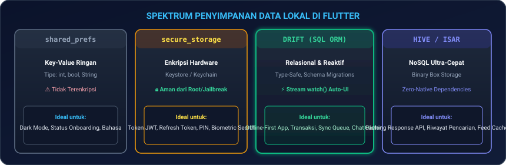
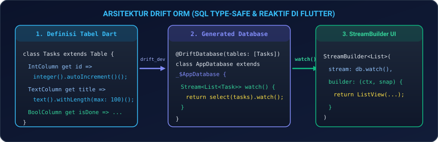
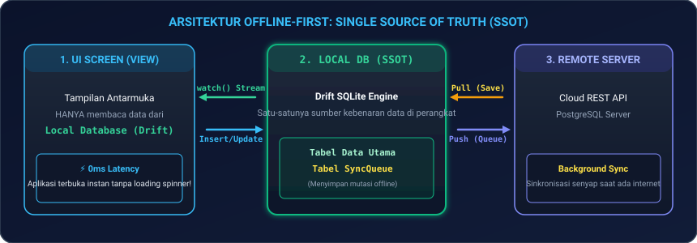
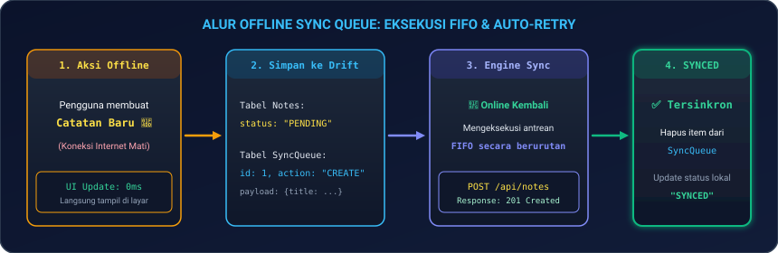

# Modul 06: Data Lokal, Offline-First Architecture, & Drift ORM (SQL)

Selamat datang di **Modul 06**! Aplikasi mobile modern kelas dunia harus tetap dapat digunakan dengan mulus bahkan saat perangkat berada di dalam terowongan kereta, pesawat terbang, atau daerah terpencil tanpa koneksi internet sama sekali. 

Di modul ini, Anda akan menguasai spektrum penyimpanan data lokal: mulai dari penyimpanan ringan **`shared_preferences`**, enkripsi hardware **`flutter_secure_storage`**, database relasional SQL modern berbasis Dart **`Drift ORM`**, NoSQL cepat **`Hive / Isar`**, hingga membangun arsitektur **Offline-First dengan Background Sync Queue** berstandar industri.

---

## 🗄️ 1. Analogi: Brankas, Lemari Arsip, & Buku Saku Cepat

Untuk memahami kapan harus memilih jenis penyimpanan data di perangkat:

| Jenis Penyimpanan | Analogi Nyata | Penjelasan Teknis |
|---|---|---|
| **`shared_preferences`** | **Catatan Post-It di Meja Kerja** | Menyimpan data sederhana yang sering dibaca (misal: "User memilih Dark Mode", "Bahasa: Indonesia"). Tidak cocok untuk data sensitif. |
| **`flutter_secure_storage`** | **Brankas Baja dengan Kunci Biometrik** | Menyimpan rahasia penting (Token JWT, Private API Key) menggunakan chip enkripsi hardware HP (Android KeyStore / iOS Keychain). |
| **`Drift` (SQL ORM)** | **Lemari Arsip Kantor Berindeks Rapi** | Database relasional SQL bertipe kuat (*type-safe*) dengan dukungan tabel, foreign key, transaksi, migrasi versi, dan *reactive stream*. |
| **`Hive / Isar` (NoSQL)** | **Buku Saku Digital Berkecepatan Tinggi** | Penyimpanan dokumen/objek biner tanpa query SQL rumit, sangat cepat untuk *caching* ribuan respon feed/katalog. |

---

## 📊 2. Spektrum Penyimpanan Data Lokal

<p align="center">
  
</p>

### 2.1 Menyimpan Pengaturan dengan `shared_preferences`
```dart
import 'package:shared_preferences/shared_preferences.dart';

class SettingsStorage {
  static const String _keyDarkMode = 'is_dark_mode';

  static Future<void> saveThemeMode(bool isDark) async {
    final prefs = await SharedPreferences.getInstance();
    await prefs.setBool(_keyDarkMode, isDark);
  }

  static Future<bool> loadThemeMode() async {
    final prefs = await SharedPreferences.getInstance();
    return prefs.getBool(_keyDarkMode) ?? false; // Default: Light Mode
  }
}
```

---

### 2.2 Menyimpan Token Rahasia dengan `flutter_secure_storage`
Jangan pernah menyimpan Token JWT atau PIN di `shared_preferences` karena dapat dibaca oleh aplikasi lain pada HP yang di-*root* atau di-*jailbreak*!

```dart
import 'package:flutter_secure_storage/flutter_secure_storage.dart';

class SecureAuthStorage {
  static const _storage = FlutterSecureStorage(
    aOptions: AndroidOptions(encryptedSharedPreferences: true),
    iOptions: IOSOptions(accessibility: KeychainAccessibility.first_unlock),
  );

  static const _tokenKey = 'jwt_access_token';

  static Future<void> saveToken(String token) async {
    await _storage.write(key: _tokenKey, value: token);
  }

  static Future<String?> readToken() async {
    return await _storage.read(key: _tokenKey);
  }

  static Future<void> clearAll() async {
    await _storage.deleteAll();
  }
}
```

---

## 🏛️ 3. Database Relasional: Drift ORM (SQL Type-Safe)

**Drift** (sebelumnya bernama *Moor*) adalah ORM SQLite resmi untuk Dart yang mengubah query SQL menjadi kode Dart yang *compile-safe* dan **reaktif secara realtime**.

<p align="center">
  
</p>

### 3.1 Menambahkan Dependensi di `pubspec.yaml`
```yaml
dependencies:
  drift: ^2.20.0
  sqlite3_flutter_libs: ^0.5.24
  path_provider: ^2.1.4
  path: ^1.9.0

dev_dependencies:
  drift_dev: ^2.20.0
  build_runner: ^2.4.9
```

---

### 3.2 Mendefinisikan Skema Tabel Database

```dart
// database.dart
import 'dart:io';
import 'package:drift/drift.dart';
import 'package:drift/native.dart';
import 'package:path_provider/path_provider.dart';
import 'package:path/path.dart' as p;

part 'database.g.dart';

// 1. TABEL UTAMA: Tasks
class Tasks extends Table {
  IntColumn get id => integer().autoIncrement()();
  TextColumn get title => text().withLength(min: 1, max: 150)();
  TextColumn get description => text().nullable()();
  BoolColumn get isCompleted => boolean().withDefault(const Constant(false))();
  
  // Status Sinkronisasi: "PENDING", "SYNCED", "ERROR"
  TextColumn get syncStatus => text().withDefault(const Constant('PENDING'))();
  DateTimeColumn get createdAt => dateTime().withDefault(currentDateAndTime)();
}

// 2. TABEL ANTREAN OFFLINE: SyncQueue
class SyncQueue extends Table {
  IntColumn get queueId => integer().autoIncrement()();
  IntColumn get recordId => integer()();
  TextColumn get action => text()(); // "CREATE", "UPDATE", "DELETE"
  TextColumn get payloadJson => text()();
  DateTimeColumn get timestamp => dateTime().withDefault(currentDateAndTime)();
}

// 3. DATABASE CLASS
@DriftDatabase(tables: [Tasks, SyncQueue])
class AppDatabase extends _$AppDatabase {
  AppDatabase() : super(_openConnection());

  @override
  int get schemaVersion => 1; // Versi Skema Database

  // Queries Reaktif: UI otomatis update saat ada data baru!
  Stream<List<Task>> watchAllTasks() => select(tasks).watch();

  Future<int> insertTask(TasksCompanion task) => into(tasks).insert(task);
  Future<bool> updateTask(Task task) => update(tasks).replace(task);
  Future<int> deleteTask(int id) => (delete(tasks)..where((t) => t.id.equals(id))).go();
}

LazyDatabase _openConnection() {
  return LazyDatabase(() async {
    final dbFolder = await getApplicationDocumentsDirectory();
    final file = File(p.join(dbFolder.path, 'app_database.sqlite'));
    return NativeDatabase.createInBackground(file);
  });
}
```

Jalankan perintah generator:
```bash
dart run build_runner build --delete-conflicting-outputs
```

---

### 3.3 Database Migrations (Migrasi Skema Tanpa Kehilangan Data)

Ketika aplikasi Anda di-update ke versi baru dan butuh kolom baru (misal: menambahkan kolom `priority` pada tabel `Tasks`):

```dart
@override
int get schemaVersion => 2; // Naikkan versi dari 1 ke 2

@override
MigrationStrategy get migration => MigrationStrategy(
  onCreate: (Migrator m) async {
    await m.createAll();
  },
  onUpgrade: (Migrator m, int from, int to) async {
    if (from < 2) {
      // Menambahkan kolom baru tanpa menghapus data task lama
      // await m.addColumn(tasks, tasks.priority);
    }
  },
);
```

---

## ⚡ 4. Arsitektur Offline-First & Single Source of Truth (SSOT)

Prinsip dasar arsitektur **Offline-First**:
> **UI HANYA membaca data dari Local Database (0ms Latency).**  
> Background Sync Engine yang bertugas mengambil data dari Remote Server, menyimpannya ke Local Database, dan mengirim perubahan lokal ke Server.

<p align="center">
  
</p>

---

## 🔄 5. Mekanisme Offline Sync Queue (FIFO)

Saat internet mati, setiap aksi pembuatan, pengubahan, atau penghapusan data **dicatat ke dalam tabel `SyncQueue`**. Begitu koneksi internet kembali aktif, engine akan memproses antrean secara berurutan (*First-In, First-Out*).

<p align="center">
  
</p>

### Implementasi Sync Queue Processor:

```dart
class SyncEngine {
  final AppDatabase db;
  final dynamic apiClient; // Dio Client

  SyncEngine(this.db, this.apiClient);

  Future<void> flushSyncQueue() async {
    final queueItems = await db.select(db.syncQueue).get();
    if (queueItems.isEmpty) return;

    print('🔄 Memproses ${queueItems.length} antrean mutasi offline...');

    for (final item in queueItems) {
      try {
        if (item.action == 'CREATE') {
          // Kirim ke server REST API
          // await apiClient.post('/tasks', data: jsonDecode(item.payloadJson));
        } else if (item.action == 'DELETE') {
          // await apiClient.delete('/tasks/${item.recordId}');
        }

        // Jika berhasil -> Hapus dari antrean lokal dan update status data jadi SYNCED
        await (db.delete(db.syncQueue)..where((q) => q.queueId.equals(item.queueId))).go();
        await (db.update(db.tasks)..where((t) => t.id.equals(item.recordId))).write(
          const TasksCompanion(syncStatus: Value('SYNCED')),
        );
      } catch (e) {
        print('Gagal sync item #${item.queueId}: $e (Akan dicoba lagi nanti)');
        break; // Hentikan loop jika koneksi terputus lagi
      }
    }
  }
}
```

---

## 💻 6. Hands-on Super Project: Offline-First Task Manager & Sync Status

Mari kita buat aplikasi nyata: **Offline-First Task Manager** dengan database lokal yang instan, indikator status sinkronisasi (*PENDING* vs *SYNCED*), dan tombol simulasi sinkronisasi:

1. **Buat file baru** `lib/offline_task_page.dart` di proyek Flutter Anda.
2. **Salin kode lengkap berikut**:

```dart
import 'package:flutter/material.dart';

// Mock Data Model untuk demo cepat
class LocalTask {
  final int id;
  final String title;
  final bool isCompleted;
  final String syncStatus; // 'PENDING' atau 'SYNCED'
  final DateTime createdAt;

  LocalTask({
    required this.id,
    required this.title,
    this.isCompleted = false,
    required this.syncStatus,
    required this.createdAt,
  });

  LocalTask copyWith({bool? isCompleted, String? syncStatus}) {
    return LocalTask(
      id: id,
      title: title,
      isCompleted: isCompleted ?? this.isCompleted,
      syncStatus: syncStatus ?? this.syncStatus,
      createdAt: createdAt,
    );
  }
}

void main() {
  runApp(const OfflineTaskApp());
}

class OfflineTaskApp extends StatelessWidget {
  const OfflineTaskApp({super.key});

  @override
  Widget build(BuildContext context) {
    return MaterialApp(
      debugShowCheckedModeBanner: false,
      theme: ThemeData(
        useMaterial3: true,
        colorSchemeSeed: Colors.teal,
      ),
      home: const OfflineTaskManagerPage(),
    );
  }
}

class OfflineTaskManagerPage extends StatefulWidget {
  const OfflineTaskManagerPage({super.key});

  @override
  State<OfflineTaskManagerPage> createState() => _OfflineTaskManagerPageState();
}

class _OfflineTaskManagerPageState extends State<OfflineTaskManagerPage> {
  final List<LocalTask> _tasks = [
    LocalTask(id: 1, title: 'Menyelesaikan Modul 06 Offline-First', isCompleted: true, syncStatus: 'SYNCED', createdAt: DateTime.now()),
    LocalTask(id: 2, title: 'Mendesain Database Drift SQLite', isCompleted: false, syncStatus: 'SYNCED', createdAt: DateTime.now()),
  ];

  final _taskController = TextEditingController();
  bool _isOnline = false; // Simulasi Status Jaringan
  bool _isSyncing = false;

  void _tambahTask() {
    if (_taskController.text.trim().isEmpty) return;

    final newTask = LocalTask(
      id: DateTime.now().millisecondsSinceEpoch,
      title: _taskController.text.trim(),
      syncStatus: _isOnline ? 'SYNCED' : 'PENDING',
      createdAt: DateTime.now(),
    );

    setState(() {
      _tasks.insert(0, newTask);
      _taskController.clear();
    });

    Navigator.pop(context);

    ScaffoldMessenger.of(context).showSnackBar(
      SnackBar(
        content: Text(_isOnline ? '✅ Tugas disimpan & tersinkron ke cloud!' : '💾 Tugas disimpan lokal (Antrean Offline)'),
        backgroundColor: _isOnline ? Colors.teal : Colors.amber.shade900,
        duration: const Duration(seconds: 2),
      ),
    );
  }

  void _simulasiSyncQueue() async {
    if (!_isOnline) {
      ScaffoldMessenger.of(context).showSnackBar(
        const SnackBar(content: Text('⚠️ Mode Offline! Aktifkan toggle online terlebih dahulu.')),
      );
      return;
    }

    setState(() => _isSyncing = true);
    await Future.delayed(const Duration(seconds: 2)); // Simulasi request API

    setState(() {
      for (int i = 0; i < _tasks.length; i++) {
        if (_tasks[i].syncStatus == 'PENDING') {
          _tasks[i] = _tasks[i].copyWith(syncStatus: 'SYNCED');
        }
      }
      _isSyncing = false;
    });

    ScaffoldMessenger.of(context).showSnackBar(
      const SnackBar(content: Text('🎉 Seluruh antrean offline berhasil disinkronkan ke Cloud!'), backgroundColor: Colors.green),
    );
  }

  @override
  Widget build(BuildContext context) {
    final pendingCount = _tasks.where((t) => t.syncStatus == 'PENDING').length;

    return Scaffold(
      appBar: AppBar(
        title: const Text('Offline Task Engine 2026', style: TextStyle(fontWeight: FontWeight.bold)),
        backgroundColor: Theme.of(context).colorScheme.inversePrimary,
        actions: [
          // Toggle Online / Offline
          Row(
            children: [
              Icon(_isOnline ? Icons.wifi : Icons.wifi_off, color: _isOnline ? Colors.green : Colors.red),
              const SizedBox(width: 4),
              Switch(
                value: _isOnline,
                onChanged: (val) {
                  setState(() => _isOnline = val);
                  if (_isOnline && pendingCount > 0) {
                    _simulasiSyncQueue();
                  }
                },
              ),
            ],
          ),
        ],
      ),
      body: Column(
        children: [
          // Banner Status Sync
          Container(
            padding: const EdgeInsets.all(12),
            color: _isOnline ? Colors.teal.shade50 : Colors.amber.shade100,
            child: Row(
              children: [
                Icon(_isOnline ? Icons.cloud_done : Icons.cloud_off, color: _isOnline ? Colors.teal : Colors.amber.shade900),
                const SizedBox(width: 10),
                Expanded(
                  child: Text(
                    _isOnline
                        ? 'Status: Online (Sinkronisasi Otomatis Aktif)'
                        : 'Status: Offline ($pendingCount data menunggu sinkronisasi)',
                    style: TextStyle(fontWeight: FontWeight.bold, color: _isOnline ? Colors.teal.shade900 : Colors.amber.shade900),
                  ),
                ),
                if (pendingCount > 0 && _isOnline)
                  ElevatedButton(
                    onPressed: _isSyncing ? null : _simulasiSyncQueue,
                    child: _isSyncing ? const SizedBox(width: 16, height: 16, child: CircularProgressIndicator(strokeWidth: 2)) : const Text('Sync Now'),
                  ),
              ],
            ),
          ),

          // Daftar Tugas
          Expanded(
            child: _tasks.isEmpty
                ? const Center(child: Text('Belum ada catatan tugas'))
                : ListView.builder(
                    padding: const EdgeInsets.all(16),
                    itemCount: _tasks.length,
                    itemBuilder: (ctx, i) {
                      final item = _tasks[i];
                      final isPending = item.syncStatus == 'PENDING';

                      return Card(
                        margin: const EdgeInsets.only(bottom: 12),
                        child: ListTile(
                          leading: Checkbox(
                            value: item.isCompleted,
                            onChanged: (val) {
                              setState(() {
                                _tasks[i] = item.copyWith(
                                  isCompleted: val ?? false,
                                  syncStatus: _isOnline ? 'SYNCED' : 'PENDING',
                                );
                              });
                            },
                          ),
                          title: Text(
                            item.title,
                            style: TextStyle(
                              decoration: item.isCompleted ? TextDecoration.lineThrough : null,
                              fontWeight: FontWeight.w600,
                            ),
                          ),
                          subtitle: Text(
                            'Dibuat: ${item.createdAt.hour}:${item.createdAt.minute.toString().padLeft(2, '0')}',
                            style: const TextStyle(fontSize: 12),
                          ),
                          trailing: Container(
                            padding: const EdgeInsets.symmetric(horizontal: 10, vertical: 4),
                            decoration: BoxDecoration(
                              color: isPending ? Colors.amber.withOpacity(0.2) : Colors.green.withOpacity(0.2),
                              borderRadius: BorderRadius.circular(8),
                              border: Border.all(color: isPending ? Colors.amber.shade700 : Colors.green),
                            ),
                            child: Row(
                              mainAxisSize: MainAxisSize.min,
                              children: [
                                Icon(isPending ? Icons.access_time : Icons.check_circle, size: 14, color: isPending ? Colors.amber.shade900 : Colors.green),
                                const SizedBox(width: 4),
                                Text(
                                  item.syncStatus,
                                  style: TextStyle(fontSize: 11, fontWeight: FontWeight.bold, color: isPending ? Colors.amber.shade900 : Colors.green.shade800),
                                ),
                              ],
                            ),
                          ),
                        ),
                      );
                    },
                  ),
          ),
        ],
      ),
      floatingActionButton: FloatingActionButton.extended(
        onPressed: () => _tampilkanDialogTambahTask(context),
        icon: const Icon(Icons.add),
        label: const Text('Tambah Tugas'),
      ),
    );
  }

  void _tampilkanDialogTambahTask(BuildContext context) {
    showDialog(
      context: context,
      builder: (ctx) => AlertDialog(
        title: const Text('Tugas Baru'),
        content: TextField(
          controller: _taskController,
          autofocus: true,
          decoration: const InputDecoration(hintText: 'Nama tugas / rencana...'),
        ),
        actions: [
          TextButton(onPressed: () => Navigator.pop(ctx), child: const Text('Batal')),
          ElevatedButton(onPressed: _tambahTask, child: const Text('Simpan')),
        ],
      ),
    );
  }
}
```

3. **Jalankan Aplikasi**:
   ```bash
   flutter run
   ```
   *Coba matikan saklar Wifi di aplikasi, buat beberapa tugas baru, lalu aktifkan kembali Wifi — Anda akan melihat seluruh data tersinkronisasi otomatis tanpa ada data yang hilang!*

---

## ⚠️ 7. Jebakan Umum (*Common Pitfalls*) & Solusi Kilat

| Kesalahan Umum | Gejala Error | Solusi yang Benar |
|---|---|---|
| **1. Simpan Token di `SharedPreferences`** | Rentan pencurian kredensial pada ponsel yang di-root (*Plaintext leak*). | Selalu gunakan **`flutter_secure_storage`** dengan `encryptedSharedPreferences: true`. |
| **2. Lupa Naikkan Schema Version Drift** | Aplikasi crash saat update: `SQLiteException: table has no column named...` | Naikkan `schemaVersion` dan tulis langkah migrasi di `MigrationStrategy.onUpgrade`. |
| **3. Stream Query Tidak Pernah Ditutup** | Memory leak dan query database dieksekusi terus di background. | Gunakan `StreamBuilder` di UI (otomatis menutup listener) atau panggil `subscription.cancel()`. |
| **4. Query Berat di Main Thread** | UI lag/freeze saat memuat 10.000 baris data SQLite. | Buka koneksi database dengan `NativeDatabase.createInBackground(file)` agar berjalan di thread Isolate. |
| **5. Menimpa Data Tanpa Konflik Resolusi** | Perubahan pengguna di HP ditimpa oleh data usang dari server. | Terapkan strategi **Last-Write-Wins** menggunakan timestamp `updatedAt` atau versioning data. |

---

## 📝 8. Kuis Pemahaman Modul 06

1. **Apa perbedaan mendasar antara `SharedPreferences` dan `FlutterSecureStorage`?**  
   *Jawaban:* `SharedPreferences` menyimpan data dalam format XML/JSON teks biasa (*plaintext*) tanpa enkripsi sehingga cocok untuk preferensi umum (Dark Mode, Onboarding). `FlutterSecureStorage` mengenkripsi data secara ketat menggunakan chip hardware Android KeyStore dan iOS Keychain sehingga wajib digunakan untuk Token JWT dan data rahasia.
2. **Mengapa query `watch()` pada Drift ORM sangat menguntungkan arsitektur Offline-First?**  
   *Jawaban:* Karena `watch()` mengembalikan `Stream` yang secara otomatis memancarkan data terbaru ke UI setiap kali ada perubahan pada tabel terkait, tanpa perlu memanggil fungsi fetch ulang secara manual.
3. **Bagaimana cara kerja strategi antrean sinkronisasi (*Sync Queue*) saat aplikasi offline?**  
   *Jawaban:* Setiap mutasi data yang dilakukan saat offline dicatat ke tabel antrean lokal (`SyncQueue`) dengan urutan FIFO. Begitu internet kembali terhubung, engine mengeksekusi antrean satu per satu ke REST API dan memperbarui status lokal menjadi *SYNCED*.

---

## 🎯 Rangkuman & Checklist Kompetensi

- [x] Memahami spektrum penyimpanan data lokal (SharedPreferences, SecureStorage, Drift, Hive).
- [x] Mengamankan token autentikasi menggunakan enkripsi hardware `flutter_secure_storage`.
- [x] Mendefinisikan skema tabel, primary key, dan foreign key dengan `Drift ORM`.
- [x] Menjalankan query reaktif `watch()` dan query satu kali `get()` pada database SQLite.
- [x] Memahami strategi migrasi skema database (`MigrationStrategy`) tanpa menghilangkan data pengguna.
- [x] Menguasai arsitektur *Single Source of Truth (SSOT)* pada pola Offline-First.
- [x] Membangun mekanisme *Offline Sync Queue* berbasis FIFO dan auto-retry saat online.
- [x] Berhasil menguji coba proyek mini Offline-First Task Manager & Sync Status.

---

👉 **Langkah Selanjutnya**: Pengelolaan data lokal dan ketahanan offline aplikasi Anda sudah setara aplikasi kelas dunia! Mari melangkah ke **[Modul 07: Sisi Backend untuk Mobile (Dart Frog, Supabase, & Firebase)](../modul-07-backend-dan-baas/README.md)** untuk memasuki fase Fullstack Developer sejati!
