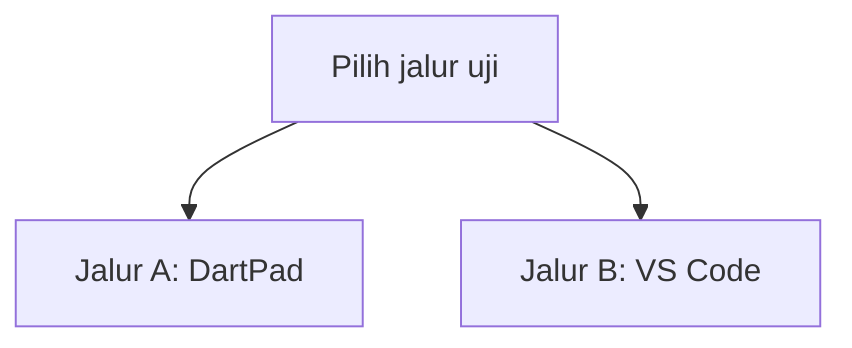
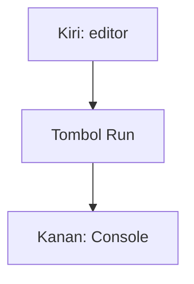
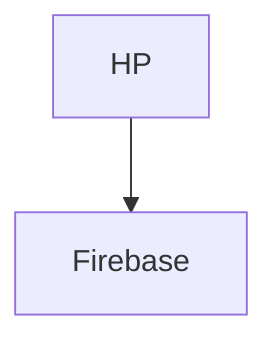
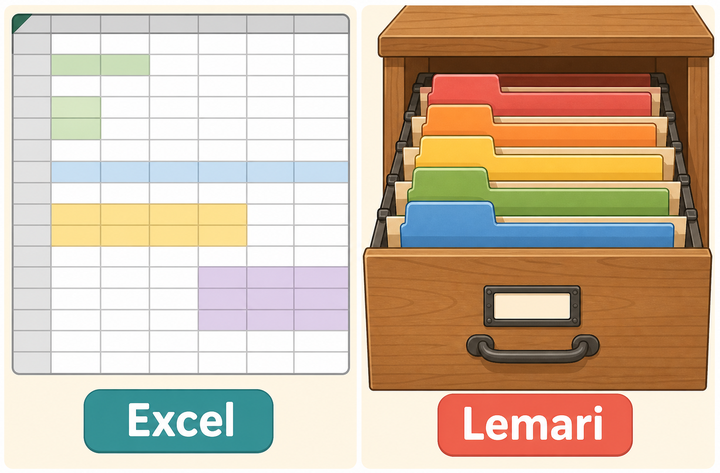
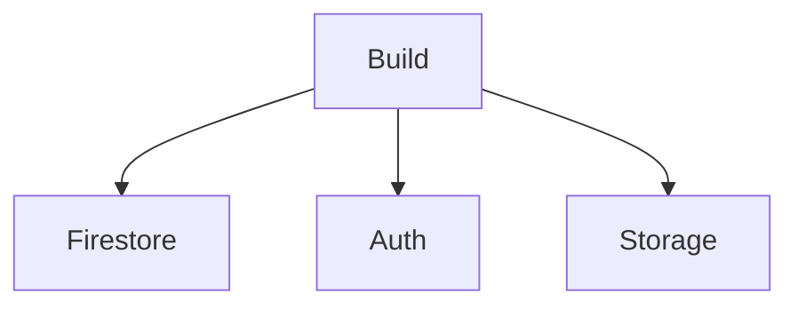
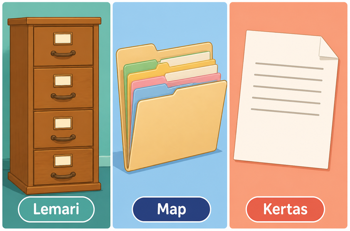
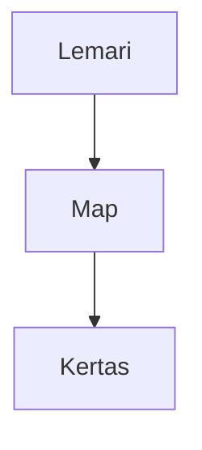
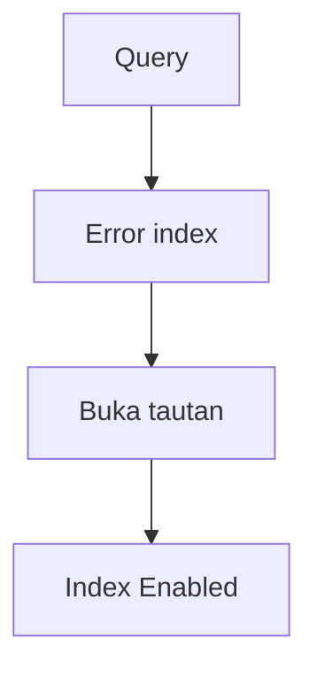
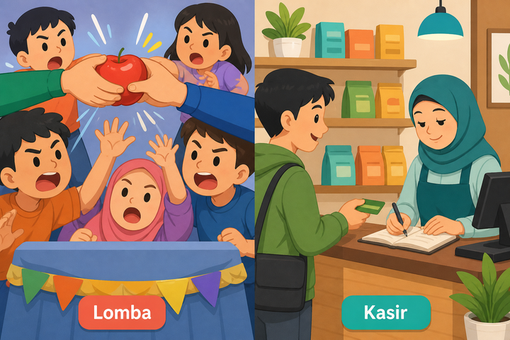
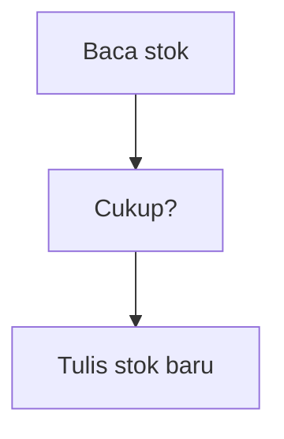

# Modul 06 — Backend pertama: Firebase

**Waktu:** 2–3 sesi  
**Prasyarat:** Modul 00–05 (proyek Flutter lokal sudah pernah `flutter run`).  
**Hasil:** Nanti Anda bisa menyambungkan app ke Firestore, menulis dan membaca data di cloud, memasang aturan supaya data tidak terbuka untuk semua orang, dan paham kenapa harga/stok tidak boleh hanya dicek di HP.

Modul 05: data tinggal di **HP ini**. Tutup app di HP lain → data itu tidak ikut. Modul ini: data tinggal di **dapur bersama** (cloud). HP A dan HP B bisa melihat tulisan yang sama.

---

## Buka alat ini dulu

Ada **dua jalur uji**. Jangan sampai tertukar.

Paket Firebase adalah **plugin HP**. Mereka **tidak** ada di [daftar paket DartPad](https://github.com/dart-lang/dart-pad/wiki/Package-and-plugin-support). Jangan tempel `import 'package:cloud_firestore/...'` di DartPad.

| Jalur | Buka | Untuk apa |
| --- | --- | --- |
| A | Browser → [dartpad.dev](https://dartpad.dev) → mode **Dart** | Bentuk data: `Map` sebagai “kertas” NoSQL |
| B | Browser (Firebase Console) + VS Code + Terminal (`Ctrl + J`) + emulator/HP | Proyek Firebase, Firestore, Storage, aturan |



Letak tombol di DartPad (bukan sketsa):




Sumber gambar: [dart.dev/tools/dartpad](https://dart.dev/tools/dartpad), Dart team / Google ([CC BY 4.0](https://creativecommons.org/licenses/by/4.0/)). Foto resmi itu **tema gelap** dan **mode Dart**. Kalau kelihatan seperti kotak hitam, gulir sampai editor kiri dan tombol **Run** terlihat; itu bukan gambar rusak. Plugin Firebase **tidak** diuji di sini.

### Dua jenis kode di halaman ini

| Jenis | Tanda | Caranya |
| --- | --- | --- |
| **Berkas lengkap** | Ada `import` dan `void main()` | Tempel utuh, lalu **Run** (alat yang disebut di kotak uji) |
| **Cuplikan** | Hanya potongan | Jangan di-Run sendirian |

### Pola uji A — DartPad

| | |
| --- | --- |
| **Buka** | [dartpad.dev](https://dartpad.dev) |
| **Pilih** | mode **Dart** |
| **Tempel** | **berkas lengkap** |
| **Klik** | **Run** |

### Pola uji B — proyek lokal + Console

| | |
| --- | --- |
| **Buka** | VS Code di folder proyek Flutter, emulator atau HP sudah menyala |
| **Browser** | [console.firebase.google.com](https://console.firebase.google.com) (akun Google) |
| **Terminal** | `Ctrl + J` |
| **Ketik** | perintah di bawah, di folder proyek |

> **Aturan emas:** perintah `flutter ...` hanya di **Terminal VS Code**. DartPad tidak menjalankan `flutter pub add`, dan tidak bisa bicara ke proyek Firebase Anda.

---

## 1. Dapur sewaan: BaaS

**BaaS** = Backend as a Service. Anda menyewa dapur yang sudah ada kompor, kulkas, dan satpam. Tidak perlu beli server sendiri dulu.

Firebase (produk Google) adalah salah satu BaaS. Ada login, database, file, fungsi di server. Materi ini memakai FlutterFire: plugin resmi Flutter untuk Firebase. Sumber langkah: [Add Firebase to your Flutter app](https://firebase.google.com/docs/flutter/setup).

Kenapa Firebase **dulu**, REST **kemudian** (Modul 07)? Supaya Anda merasakan fullstack tanpa operasi server. Modul 07 tetap wajib: dunia tidak hanya Firebase.

Seperti restoran di Modul 00: HP memesan, JSON adalah nota, dapur mengolah. Di sini dapurnya Firebase, bukan program Node di laptop Anda.



**Yang belum:** sewa VPS, Kubernetes, membuat API sendiri — itu bukan modul ini.

---

## 2. Excel rapi vs lemari map

Sebelum menekan tombol Firestore, bedakan dua cara menyimpan.

| Analogi | Di database | Bentuknya |
| --- | --- | --- |
| **Excel** | SQL (tabel) | Baris dan kolom wajib rapi. Kolom baru = ubah skema. |
| **Lemari** | NoSQL (dokumen) | Tiap map boleh isi kertas yang tidak identik. |



*Ilustrasi asli materi mobile2026. Excel = tabel rapi. Lemari = map yang isinya boleh beda. Penjelasan ada di tabel.*

Firestore = **lemari**, bukan Excel. SQLite di Modul 05 lebih dekat ke Excel.

### Uji 2 — bentuk “kertas” di DartPad (jalur A)

Ini **bukan** Firebase. Hanya bentuk data: dokumen = `Map`, koleksi = daftar `Map`.

| | |
| --- | --- |
| **Buka** | Browser → [dartpad.dev](https://dartpad.dev) |
| **Pilih** | mode **Dart** |
| **Tempel** | berkas lengkap di bawah |
| **Klik** | **Run** |
| **Kalau berhasil** | Console menampilkan `Andi` lalu `Siti` |

```dart
void main() {
  final tamu = <Map<String, Object>>[
    {'uid': 'u1', 'nama': 'Andi', 'pesan': 'Halo'},
    {'uid': 'u2', 'nama': 'Siti', 'pesan': 'Selamat datang'},
  ];

  for (final kertas in tamu) {
    print(kertas['nama']);
  }
}
```

Di Firestore nanti, satu `Map` itu **satu dokumen**. Daftar `Map` itu **satu koleksi**.

---

## 3. Proyek Firebase + app Android

Praktik rilis materi ini: **Windows → Android**. iOS butuh Mac; konsepnya sama, berkasnya `GoogleService-Info.plist` (sudah di `.gitignore` repo ini).

### 3A — Buat proyek di browser

| | |
| --- | --- |
| **Buka** | Browser → [console.firebase.google.com](https://console.firebase.google.com) |
| **Masuk** | akun Google |
| **Buat** | proyek baru, nama bebas (contoh: `mobile2026-latihan`) |
| **Kalau berhasil** | Anda masuk ke ringkasan proyek, bukan halaman “create” lagi |

Google Analytics **boleh** dimatikan untuk latihan ini. Tidak wajib.

Lalu, di Console, siapkan tiga sakelar yang dipakai modul ini (boleh dikerjakan bertahap, sebelum mini proyek harus nyala):



| Sakelar | Menu kira-kira | Untuk apa |
| --- | --- | --- |
| Firestore | Build → Firestore Database → Create | lemari data |
| Anonymous Auth | Build → Authentication → Sign-in method → Anonymous | tanda pengenal sementara |
| Storage | Build → Storage | foto (bagian 9) |

Lokasi Firestore: pilih yang dekat (contoh `asia-southeast2` kalau ada). Setelah dipilih, **sulit diganti**. Ikuti wizard sampai database jadi. Jangan biarkan aturan “test mode” terbuka selamanya — bagian 8 menggantinya.

### 3B — Sambungkan Flutter (jalur B)

Sumber resmi: [Add Firebase to your Flutter app](https://firebase.google.com/docs/flutter/setup). Cara utama sekarang: **FlutterFire CLI**, yang menaruh `google-services.json` dan membuat `lib/firebase_options.dart`.

| | |
| --- | --- |
| **Buka** | VS Code, folder proyek Flutter (boleh `flutter create dapur_firebase` dulu) |
| **Terminal** | `Ctrl + J` |
| **Ketik** | perintah di bawah, **satu per satu** |

```powershell
flutter pub add firebase_core
dart pub global activate flutterfire_cli
flutterfire configure
```

| **Kalau berhasil** | Ada `lib/firebase_options.dart`. `flutterfire configure` menanya proyek dan platform. Untuk materi ini centang **Android**. |

Kalau `flutterfire` tidak dikenali: berkas `dart pub global` belum masuk PATH. Tutup terminal, buka lagi, atau pakai `dart pub global run flutterfire_cli:flutterfire configure`.

Login Google bisa muncul di browser. Itu normal.

`google-services.json` **jangan di-commit**, **jangan ditempel ke chat publik**. Di repo materi ini berkas itu sudah ada di `.gitignore`. `firebase_options.dart` berisi kunci klien (bukan kata sandi admin); tetap jangan pamer tangkapan layar Console yang memuat rahasia.

Cuplikan inisialisasi (jalur B). Ini **bukan** berkas lengkap untuk DartPad.

```dart
import 'package:firebase_core/firebase_core.dart';
import 'package:flutter/material.dart';
import 'firebase_options.dart';

Future<void> main() async {
  WidgetsFlutterBinding.ensureInitialized();
  await Firebase.initializeApp(
    options: DefaultFirebaseOptions.currentPlatform,
  );
  runApp(const MateriApp());
}
```

`WidgetsFlutterBinding.ensureInitialized()` wajib sebelum `Firebase.initializeApp`, karena plugin butuh saluran ke Android.

| | |
| --- | --- |
| **Buka** | Terminal VS Code, emulator/HP menyala |
| **Ketik** | `flutter run` |
| **Kalau berhasil** | App terbuka. Belum ada data cloud — yang diuji baru inisialisasi. |

Kalau Gradle merona soal `minSdk`: baca pesan di terminal, naikkan sesuai angka yang diminta plugin. Jangan menebak versi dari ingatan.

---

## 4. Firestore: lemari, map, kertas

| Analogi | Firestore |
| --- | --- |
| **Lemari** | database |
| **Map** | koleksi (`tamu`, `produk`) |
| **Kertas** | dokumen (satu ID, isi `Map`) |



*Ilustrasi asli materi mobile2026. Lemari → map → kertas. Di Firestore: database → koleksi → dokumen. Penjelasan ada di tabel.*



ID dokumen bisa dibuat otomatis (`.add`) atau Anda pilih (`.doc('u1')`). Field di kertas tidak wajib sama antar dokumen — itu sifat lemari, bukan Excel.

Sumber konsep: [Cloud Firestore](https://firebase.google.com/docs/firestore).

---

## 5. CRUD dari Flutter

CRUD = Create, Read, Update, Delete. Paket: `cloud_firestore`.

| | |
| --- | --- |
| **Buka** | Terminal VS Code, folder proyek yang sudah `Firebase.initializeApp` |
| **Ketik** | perintah di bawah |

```powershell
flutter pub add cloud_firestore
```

Cuplikan (jalur B). Jangan di-Run di DartPad.

```dart
final col = FirebaseFirestore.instance.collection('tamu');

// Create
final ref = await col.add({
  'uid': uid,
  'nama': 'Andi',
  'pesan': 'Halo',
  'waktu': FieldValue.serverTimestamp(),
});

// Read satu
final satu = await col.doc(ref.id).get();

// Update
await col.doc(ref.id).update({'pesan': 'Halo, sudah diubah'});

// Delete
await col.doc(ref.id).delete();
```

`FieldValue.serverTimestamp()` = jam dapur, bukan jam HP. HP bisa salah jam.

UI **jangan** mengetik `FirebaseFirestore.instance` di tengah tombol tanpa lapisan data. Pola folder `ui / data / services` dari Modul 04 tetap berlaku: halaman memanggil notifier, notifier memanggil layanan.

---

## 6. Query: `where`, `orderBy`, `limit`

Jangan unduh seluruh lemari “supaya aman”. Minta yang perlu.

```dart
final hasil = await FirebaseFirestore.instance
    .collection('tamu')
    .orderBy('waktu', descending: true)
    .limit(20)
    .get();
```

`where` + `orderBy` pada field **berbeda** sering butuh **index**. Gejalanya: error merah berisi tautan Console. **Buka tautan itu**, buat index, tunggu status Enabled. Jangan tebak-tebak field.



---

## 7. Transaksi dan batch: jangan lomba

Dua orang menekan **Beli** pada stok 1. Kalau masing-masing baca “sisa 1” lalu tulis “sisa 0”, angka bisa rusak. Itu **lomba**. Kasir yang benar: satu per satu, baca-lalu-tulis dalam **transaksi**.



*Ilustrasi asli materi mobile2026. Lomba = dua tangan merebut sisa terakhir. Kasir = satu antrean, angka tidak rusak. Penjelasan ada di teks.*



Cuplikan transaksi (jalur B):

```dart
await FirebaseFirestore.instance.runTransaction((tx) async {
  final snap = await tx.get(docRef);
  final stok = (snap.data()?['stok'] as int?) ?? 0;
  if (stok < 1) {
    throw StateError('Habis');
  }
  tx.update(docRef, {'stok': stok - 1});
});
```

**Batch** = beberapa tulis sekaligus, tanpa harus baca dulu (contoh: hapus 10 dokumen terkait). Transaksi = butuh hasil baca yang aman dari lomba.

Harga, stok, “apakah admin” **tidak boleh hanya dicek di HP**. HP bisa diutak-atik. Aturan sungguhan: Rules (bagian 8) atau Cloud Functions (bagian 13).

---

## 8. Rules: satpam dapur

Tanpa rules, siapa pun yang punya kunci klien bisa baca-tulis lemari Anda. Kunci klien **bukan** kata sandi admin.

Aturan dibaca **di server**. Menonaktifkan tombol Hapus di UI **tidak cukup**.

Contoh untuk buku tamu (tempel di tab Rules Firestore, lalu Publish):

```
rules_version = '2';
service cloud.firestore {
  match /databases/{database}/documents {
    match /tamu/{id} {
      allow read: if request.auth != null;
      allow create: if request.auth != null
        && request.resource.data.uid == request.auth.uid
        && request.resource.data.pesan is string
        && request.resource.data.pesan.size() < 200;
      allow update: if false;
      allow delete: if request.auth != null
        && resource.data.uid == request.auth.uid;
    }
  }
}
```

Artinya: harus masuk (anonymous cukup), `uid` di kertas harus milik Anda, pesan pendek, ubah tidak boleh, hapus hanya milik sendiri.

Sumber: [Cloud Firestore Security Rules](https://firebase.google.com/docs/firestore/security/get-started).

Login email/Google yang lengkap ada di **Modul 08**. Di modul ini cukup **Anonymous**: tanda pengenal sementara, tanpa formulir email.

| | |
| --- | --- |
| **Buka** | Terminal VS Code |
| **Ketik** | perintah di bawah |

```powershell
flutter pub add firebase_auth
```

Cuplikan (jalur B):

```dart
final user = FirebaseAuth.instance.currentUser
    ?? (await FirebaseAuth.instance.signInAnonymously()).user;
final uid = user!.uid;
```

Nyalakan Anonymous di Console dulu (bagian 3A). Kalau lupa: error `operation-not-allowed`.

---

## 9. Storage: unggah foto

Firestore menyimpan angka dan teks. Foto besar masuk **Storage**.

| | |
| --- | --- |
| **Buka** | Terminal VS Code |
| **Ketik** | perintah di bawah |

```powershell
flutter pub add firebase_storage
```

Cuplikan ide (jalur B). File sungguhan di HP memakai `path_provider` + `image_picker` (Modul 08 lebih dalam). Di sini yang penting: path di dapur, bukan di galeri HP.

```dart
final ref = FirebaseStorage.instance.ref('profil/$uid.jpg');
await ref.putFile(file);
final url = await ref.getDownloadURL();
```

Rules Storage **terpisah** dari Rules Firestore. Jangan biarkan `/` bisa ditulis siapa saja. Pola yang wajar: `profil/{uid}.jpg` hanya pemiliknya.

Kamera, galeri, kompres, cache gambar: **Modul 08**. Mini proyek hari ini **tidak wajib** unggah foto.

---

## 10. Listener realtime + StreamBuilder

`.get()` = foto sekali. `.snapshots()` = dapur menelepon HP setiap kertas berubah. Itu yang membuat daftar tamu “hidup”.

Modul 04 sudah memakai StreamBuilder. Di sini sumbernya Firestore, bukan detak palsu.

```dart
StreamBuilder<QuerySnapshot<Map<String, dynamic>>>(
  stream: FirebaseFirestore.instance
      .collection('tamu')
      .orderBy('waktu', descending: true)
      .limit(20)
      .snapshots(),
  builder: (context, snap) {
    if (snap.hasError) {
      return const Text('Gagal memuat');
    }
    if (!snap.hasData) {
      return const CircularProgressIndicator();
    }
    final docs = snap.data!.docs;
    return ListView.builder(
      itemCount: docs.length,
      itemBuilder: (context, i) {
        final data = docs[i].data();
        return ListTile(title: Text('${data['nama']}'));
      },
    );
  },
)
```

Ini **cuplikan** widget, bukan berkas lengkap. Tempel di dalam `Scaffold` proyek jalur B.

Tiga cabang layar (menunggu / selesai / gagal) sama seperti analogi Modul 04.

---

## 11. Offline: cache Firestore

Di Android/iOS, Firestore **biasanya** menyimpan cache. App masih bisa baca data lama saat sinyal hilang, lalu mengirim tulis ketika jaringan kembali.

Ini **bukan** jaminan. Jangan anggap kasir stok aman hanya karena “nanti disinkronkan”. Transaksi yang butuh angka jujur tetap di server (bagian 7 dan 13).

Tidak ada sakelar uji khusus di DartPad. Uji jalur B: airplane mode setelah data pernah termuat, lihat apakah daftar cache masih kelihatan.

---

## 12. Biaya: jangan dengar seluruh lemari

Firestore menagih **pembacaan, penulisan, penghapusan**, plus penyimpanan. Listener yang menyala = baca berulang.

Jangan:

- `.snapshots()` pada koleksi tanpa `limit`
- `get()` seluruh `produk` “untuk berjaga-jaga”
- menulis log setiap geser jari

Pakai `limit`, query yang sempit, dan tutup halaman yang tidak kelihatan. Ringkasan produk: [Firebase pricing](https://firebase.google.com/pricing). Angka berubah; yang diingat: **dengar tanpa batas itu mahal**.

---

## 13. Aturan fullstack + Cloud Functions “halo”

Dicek di HP: mudah ditipu. Dicek di Rules / Functions: dapur yang memutuskan.

| Keputusan | Di HP | Di dapur |
| --- | --- | --- |
| Teks tombol “Hapus” disembunyikan | boleh, sopan | tetap butuh `allow delete` |
| Stok tidak boleh negatif | tidak cukup | transaksi + rules / function |
| Harga barang | boleh ditampil | sumber kebenaran di server |
| Hak admin | jangan percaya `isAdmin` di SharedPreferences | custom claim / rules |

**Cloud Functions** = kode yang jalan di dapur Google, bukan di HP. Pengenalan ini **satu fungsi halo**, bukan arsitektur besar.

Cuplikan (Node, **bukan** Dart, **bukan** DartPad):

```javascript
const {onRequest} = require('firebase-functions/v2/https');

exports.halo = onRequest((req, res) => {
  res.json({pesan: 'Halo dari dapur'});
});
```

Deploy sungguhan sering butuh paket **Blaze** (bayar sesuai pakai; ada kuota gratis). Kalau proyek latihan masih Spark, **jangan dipaksa**. Yang wajib dari bagian ini: Anda paham *mengapa* stok tidak boleh hanya di HP. Modul 07 mengulang ide yang sama lewat API.

Jangan menaruh kata sandi admin di aplikasi Flutter.

---

## 14. Dynamic Links: jangan

Firebase Dynamic Links **sudah deprecated**. Jangan dipakai di proyek baru. Tautan ke halaman app (App Link) ada di Modul 08 sebagai konsep, bukan lewat Dynamic Links.

---

## Mini proyek modul ini

Aplikasi **Buku tamu**: tulis pesan, daftar realtime, hapus hanya milik sendiri.

Urutan kerja, jangan terbalik:

1. Buka **browser** → Console Firebase. Nyalakan Firestore, Anonymous Auth. Tempel rules bagian 8, Publish.
2. Buka **VS Code**, Terminal (`Ctrl + J`), emulator atau HP sudah menyala.
3. `flutter create buku_tamu` lalu `cd buku_tamu`.
4. `flutter pub add firebase_core cloud_firestore firebase_auth` lalu `dart pub global activate flutterfire_cli` lalu `flutterfire configure` (Android).
5. Inisialisasi Firebase di `main()` seperti bagian 3B.
6. Saat app start: `signInAnonymously()`, simpan `uid`.
7. Form: nama + pesan. `add` ke koleksi `tamu` dengan `uid`, `nama`, `pesan`, `waktu`.
8. Daftar: `StreamBuilder` + `orderBy('waktu')` + `limit(20)`.
9. Tombol hapus **hanya** jika `data['uid'] == uid`. Tetap uji: rules harus menolak hapus milik orang lain.
10. `flutter run`. Buka app di emulator, tulis pesan. Kalau bisa, HP kedua / profil emulator lain — daftar sama, hapus orang lain gagal.

**Kalau berhasil:** pesan baru muncul tanpa tekan Refresh. Hapus milik sendiri hilang dari daftar. Hapus milik orang lain tidak terjadi (error permission — tampilkan SnackBar, jangan diam).

Pecah ke `lib/ui/` dan `lib/data/` kalau sudah nyaman. Jangan commit `google-services.json`.

---

## Kesalahan yang sering terjadi

| Gejala | Penyebab yang sering | Perbaikan |
| --- | --- | --- |
| `cloud_firestore` error di DartPad | plugin tidak ada di DartPad | Jalur B |
| `Firebase.initializeApp` merona | `firebase_options.dart` belum ada, atau lupa `ensureInitialized` | `flutterfire configure`, cek `main()` |
| `operation-not-allowed` | Anonymous belum dinyalakan | Console → Authentication → Anonymous |
| `permission-denied` | rules menolak, atau `uid` tidak ditulis di dokumen | cocokkan field `uid` dengan `request.auth.uid` |
| Query merona + tautan index | `where` + `orderBy` butuh index | buka tautan di error, tunggu Enabled |
| Data “hilang” di HP lain | masih nulis ke SharedPreferences | cek koleksi di tab Data Console |
| Gradle `minSdk` | plugin minta API lebih tinggi | ikuti angka di pesan terminal |
| `flutterfire` bukan perintah | PATH pub-global | buka terminal baru, atau `dart pub global run ...` |
| Dynamic Links di tutorial lama | produk sudah deprecated | jangan diikuti; Modul 08 untuk tautan app |

---

## Latihan

1. (DartPad) Tambah field `int umur` pada `Map` tamu di uji 2, `print` yang `umur >= 18`.
2. (Jalur B) Tambah field `kota` (string) saat `add`, tampilkan di `ListTile.subtitle`.
3. (Jalur B) Ganti `limit(20)` jadi `limit(5)`. Pastikan hanya lima kertas terbaru.
4. (Jalur B) Tombol hapus milik orang lain: pastikan SnackBar muncul, bukan crash.
5. (Opsional, Blaze) Baca dokumentasi [Call functions from your app](https://firebase.google.com/docs/functions/callable) — jangan dipaksa deploy.

---

## Kuis singkat

1. Firestore lebih dekat ke Excel atau ke lemari map? Kenapa?
2. Perintah `flutter pub add cloud_firestore` diketik di mana?
3. Menonaktifkan tombol Hapus di UI cukup sebagai keamanan? Kenapa?
4. Kenapa stok kasir memakai transaksi, bukan dua `get` lalu `update` terpisah?
5. Dynamic Links masih boleh untuk proyek baru?

Kunci jawaban di bawah. Coba jawab dulu.

---

## Apa yang belum dibahas

- REST, `dio`, JWT, backend mini + deploy → **Modul 07**
- Email/password, Google Sign-In, verifikasi, role admin, kamera, FCM → **Modul 08**
- Tes otomatis, crash, performa → Modul 09
- Custom claims, emulator Firebase lokal, Functions besar, FCM topik

---

## Kunci kuis

1. Lemari map (NoSQL). Dokumen tidak wajib kolom yang sama seperti baris Excel.
2. Terminal VS Code di folder proyek, bukan DartPad.
3. Tidak. UI bisa ditipu. Satpamnya Rules (dan Functions untuk keputusan berat).
4. Dua baca terpisah bisa lomba: keduanya melihat sisa 1. Transaksi mengunci urutan baca-tulis.
5. Tidak. Sudah deprecated. Jangan diajarkan sebagai solusi tautan.

---

## Sumber gambar dan tautan

| Aset | Sumber |
| --- | --- |
| `images/analogi-excel-lemari.png` | Ilustrasi asli materi mobile2026 |
| `images/analogi-lemari-map-kertas.png` | Ilustrasi asli materi mobile2026 |
| `images/analogi-lomba-kasir.png` | Ilustrasi asli materi mobile2026 |
| Tampilan DartPad | [dart.dev/assets/img/dartpad-hello.png](https://dart.dev/assets/img/dartpad-hello.png) dari [dart.dev/tools/dartpad](https://dart.dev/tools/dartpad) ([CC BY 4.0](https://creativecommons.org/licenses/by/4.0/)) |
| Tambah Firebase ke Flutter | [firebase.google.com/docs/flutter/setup](https://firebase.google.com/docs/flutter/setup) |
| Cloud Firestore | [firebase.google.com/docs/firestore](https://firebase.google.com/docs/firestore) |
| Security Rules | [firebase.google.com/docs/firestore/security/get-started](https://firebase.google.com/docs/firestore/security/get-started) |
| Cloud Storage | [firebase.google.com/docs/storage](https://firebase.google.com/docs/storage) |
| Cloud Functions | [firebase.google.com/docs/functions](https://firebase.google.com/docs/functions) |
| Harga | [firebase.google.com/pricing](https://firebase.google.com/pricing) |
| `firebase_core` | [pub.dev/packages/firebase_core](https://pub.dev/packages/firebase_core) |
| `cloud_firestore` | [pub.dev/packages/cloud_firestore](https://pub.dev/packages/cloud_firestore) |
| `firebase_auth` | [pub.dev/packages/firebase_auth](https://pub.dev/packages/firebase_auth) |
| `firebase_storage` | [pub.dev/packages/firebase_storage](https://pub.dev/packages/firebase_storage) |

Firebase and Flutter and the related logos are trademarks of Google LLC. We are not endorsed by or affiliated with Google LLC.
