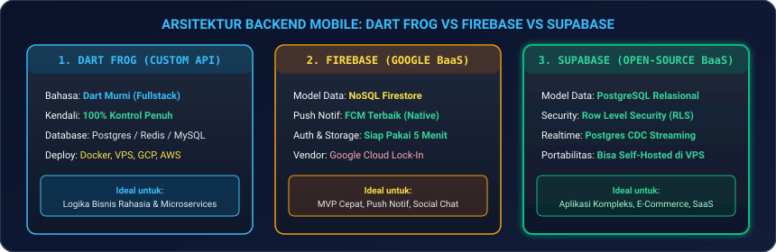
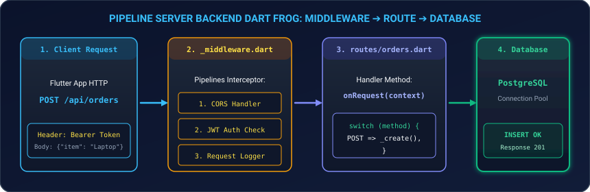
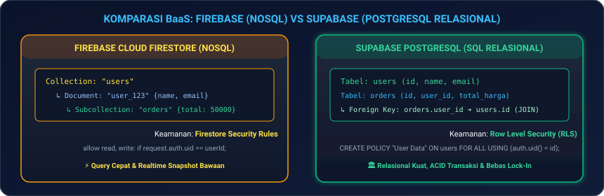
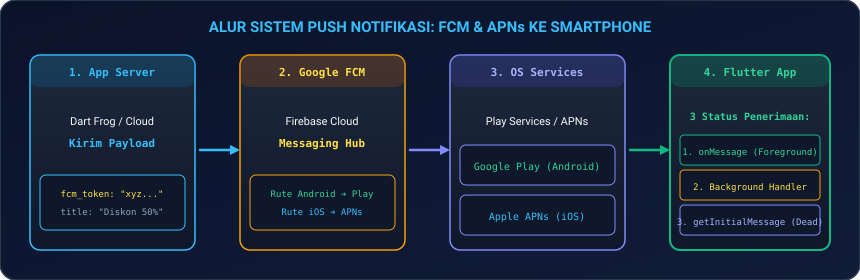

# Modul 07: Sisi Backend untuk Mobile (Dart Frog, Supabase, & Firebase)

Selamat datang di **Modul 07**! Di modul ini, Anda resmi memasuki **FASE 3: Fullstack Services & Cloud**. Seorang mobile engineer berpenghasilan tinggi bukan hanya mampu membuat tampilan antarmuka di HP, melainkan memahami bagaimana data diproses di sisi server, diamankan dengan *Security Rules*, dikirim melalui *Push Notifications*, hingga disimpan ke dalam database cloud.

Di modul ini, Anda akan menguasai cara membangun backend API kustom menggunakan **`Dart Frog`** (Fullstack Dart), memanfaatkan kekuatan NoSQL & Push Notifications dari **`Firebase BaaS`**, serta menguasai database PostgreSQL relasional dengan Row Level Security (RLS) di **`Supabase`**.

---

## ☁️ 1. Analogi: Dapur Restoran Sendiri vs Cloud Kitchen Siap Saji

Untuk memahami kapan harus membuat backend sendiri atau menggunakan Backend-as-a-Service (BaaS):

| Pendekatan | Analogi Nyata | Keunggulan & Karakteristik |
|---|---|---|
| **Custom Backend (`Dart Frog`)** | **Membangun Dapur Restoran Sendiri dari Nol** | Anda bebas memilih kompor, koki, dan resep rahasia sendiri. 100% fleksibel, logika bisnis terlindungi, dan tidak ada ketergantungan vendor (*vendor lock-in*). |
| **Firebase (Google BaaS)** | **Dapur Sewa Serba Otomatis (NoSQL)** | Siap pakai dalam 5 menit. Sangat unggul untuk autentikasi kilat, sinkronisasi realtime dokumen NoSQL, dan push notifikasi massal (*FCM*). |
| **Supabase (Open-Source BaaS)** | **Dapur Restoran Bintang Lima Berbasis PostgreSQL** | Menggabungkan kemudahan BaaS siap pakai dengan kekuatan database relasional SQL (PostgreSQL), tabel berelasi (*Foreign Keys*), dan bebas biaya lisensi (*Open-Source*). |

---

## 📊 2. Spektrum Arsitektur Backend Mobile

<p align="center">
  
</p>

---

## 🐸 3. Membangun Backend API Sendiri dengan Dart Frog

**Dart Frog** adalah framework backend modern minimalis yang memungkinkan Anda menulis REST API menggunakan bahasa **Dart murni**. Anda dapat berbagi (*share*) model data yang sama persis antara aplikasi Flutter di HP dan server backend!

<p align="center">
  
</p>

### 3.1 Instalasi & Membuat Proyek Dart Frog

Install CLI Dart Frog via terminal:
```bash
dart pub global activate dart_frog_cli
dart_frog create backend_store
cd backend_store
dart_frog dev
```

---

### 3.2 Menulis Global Middleware (CORS & Logging)

Buat berkas `routes/_middleware.dart`:
```dart
import 'package:dart_frog/dart_frog.dart';
import 'package:shelf_cors_headers/shelf_cors_headers.dart' as cors;

Handler middleware(Handler handler) {
  return handler
      .use(requestLogger()) // 1. Logging setiap request yang masuk
      .use(
        fromShelfMiddleware(
          cors.corsHeaders(
            headers: {
              cors.ACCESS_CONTROL_ALLOW_ORIGIN: '*',
              cors.ACCESS_CONTROL_ALLOW_METHODS: 'GET, POST, PUT, DELETE, OPTIONS',
            },
          ),
        ),
      ); // 2. Menghindari CORS Error
}
```

---

### 3.3 Membuat Endpoint RESTful (`GET`, `POST`, `DELETE`)

Buat berkas `routes/api/products/index.dart`:
```dart
import 'dart:io';
import 'package:dart_frog/dart_frog.dart';

// In-Memory Data Store (Simulasi Database)
final List<Map<String, dynamic>> _productDb = [
  {'id': 1, 'name': 'MacBook Pro M4', 'price': 28000000},
  {'id': 2, 'name': 'iPhone 17 Pro', 'price': 21000000},
];

Future<Response> onRequest(RequestContext context) async {
  return switch (context.request.method) {
    HttpMethod.get => _getProducts(),
    HttpMethod.post => _createProduct(context),
    _ => Future.value(Response(statusCode: HttpStatus.methodNotAllowed)),
  };
}

Response _getProducts() {
  return Response.json(body: {'status': 'SUCCESS', 'data': _productDb});
}

Future<Response> _createProduct(RequestContext context) async {
  final body = await context.request.json() as Map<String, dynamic>;
  final newProduct = {
    'id': _productDb.length + 1,
    'name': body['name'],
    'price': body['price'],
  };
  _productDb.add(newProduct);
  return Response.json(
    statusCode: HttpStatus.created,
    body: {'status': 'CREATED', 'product': newProduct},
  );
}
```

---

## 🔥 4. Firebase: Autentikasi, Firestore NoSQL, & Push Notification

<p align="center">
  
</p>

### 4.1 Firebase Authentication (Email, Google, OTP)

```dart
import 'package:firebase_auth/firebase_auth.dart';

class AuthService {
  final FirebaseAuth _auth = FirebaseAuth.instance;

  // 1. Registrasi Akun Baru
  Future<UserCredential> registerWithEmail(String email, String password) async {
    return await _auth.createUserWithEmailAndPassword(email: email, password: password);
  }

  // 2. Login
  Future<UserCredential> loginWithEmail(String email, String password) async {
    return await _auth.signInWithEmailAndPassword(email: email, password: password);
  }

  // 3. Auth State Stream: Mendeteksi login/logout otomatis
  Stream<User?> get authStateChanges => _auth.authStateChanges();
}
```

---

### 4.2 Cloud Firestore: Query & Aturan Keamanan (*Security Rules*)

```dart
import 'package:cloud_firestore/cloud_firestore.dart';

class OrderRepository {
  final FirebaseFirestore _firestore = FirebaseFirestore.instance;

  // Query Realtime Stream
  Stream<List<Map<String, dynamic>>> watchUserOrders(String userId) {
    return _firestore
        .collection('orders')
        .where('user_id', isEqualTo: userId)
        .orderBy('created_at', descending: true)
        .snapshots()
        .map((snapshot) => snapshot.docs.map((doc) => doc.data()).toList());
  }
}
```

#### 🔒 Aturan Keamanan (*Firestore Security Rules*):
Jangan pernah membiarkan rules dalam mode `allow read, write: if true;` di produksi!

```javascript
rules_version = '2';
service cloud.firestore {
  match /databases/{database}/documents {
    match /users/{userId} {
      // Pengguna HANYA boleh membaca & mengedit dokumen miliknya sendiri
      allow read, write: if request.auth != null && request.auth.uid == userId;
    }
    match /orders/{orderId} {
      allow create: if request.auth != null;
      allow read: if request.auth != null && resource.data.user_id == request.auth.uid;
    }
  }
}
```

---

### 4.3 Firebase Cloud Messaging (FCM) Push Notifications

<p align="center">
  
</p>

```dart
import 'package:firebase_messaging/firebase_messaging.dart';

// Top-Level Function untuk menangani notifikasi saat aplikasi ditutup/background
@pragma('vm:entry-point')
Future<void> _firebaseMessagingBackgroundHandler(RemoteMessage message) async {
  print('📬 [FCM Background]: ${message.notification?.title}');
}

class PushNotificationService {
  final FirebaseMessaging _fcm = FirebaseMessaging.instance;

  Future<void> initialize() async {
    // 1. Meminta izin notifikasi ke OS (iOS / Android 13+)
    await _fcm.requestPermission(alert: true, badge: true, sound: true);

    // 2. Mengambil token unik FCM perangkat
    final token = await _fcm.getToken();
    print('🔑 FCM Device Token: $token');

    // 3. Handler saat aplikasi terbuka (Foreground)
    FirebaseMessaging.onMessage.listen((RemoteMessage message) {
      print('🔔 [FCM Foreground]: ${message.notification?.title} - ${message.notification?.body}');
    });

    // 4. Daftarkan background handler
    FirebaseMessaging.onBackgroundMessage(_firebaseMessagingBackgroundHandler);
  }
}
```

---

## ⚡ 5. Supabase: PostgreSQL Relasional & Row Level Security (RLS)

Supabase adalah alternatif open-source terbaik untuk Firebase yang didukung oleh database **PostgreSQL murni**.

### 5.1 Inisialisasi Supabase di Flutter

```dart
import 'package:supabase_flutter/supabase_flutter.dart';

Future<void> initSupabase() async {
  await Supabase.initialize(
    url: 'https://xyzcompany.supabase.co',
    anonKey: 'eyJhbGciOiJIUzI1NiIsInR5cCI6IkpXVCJ9...',
  );
}

final supabase = Supabase.instance.client;
```

---

### 5.2 Query CRUD & Realtime Subscriptions

```dart
// 1. SELECT Data dengan Relasi JOIN
Future<List<Map<String, dynamic>>> fetchOrdersWithProfile() async {
  final data = await supabase
      .from('orders')
      .select('id, total_price, users(name, email)')
      .order('created_at', ascending: false);
  return List<Map<String, dynamic>>.from(data);
}

// 2. Realtime Stream pada Perubahan Tabel PostgreSQL
Stream<List<Map<String, dynamic>>> watchLiveMessages() {
  return supabase
      .from('chat_messages')
      .stream(primaryKey: ['id'])
      .order('created_at');
}
```

---

### 5.3 Row Level Security (RLS) di PostgreSQL
Di Supabase, keamanan data dikunci langsung di level mesin SQL:

```sql
-- Aktifkan RLS pada tabel orders
ALTER TABLE orders ENABLE ROW LEVEL SECURITY;

-- Pengguna hanya bisa melihat data pesanannya sendiri
CREATE POLICY "Users can only view own orders" 
ON orders FOR SELECT 
USING (auth.uid() = user_id);

-- Pengguna hanya bisa menambah pesanan atas nama ID-nya sendiri
CREATE POLICY "Users can insert own orders" 
ON orders FOR INSERT 
WITH CHECK (auth.uid() = user_id);
```

---

## 📊 6. Matriks Perbandingan Industri: Kapan Pakai Apa?

| Parameter Evaluasi | Dart Frog (Custom API) | Firebase (Google BaaS) | Supabase (PostgreSQL BaaS) |
|---|---|---|---|
| **Bahasa Utama** | Dart Murni | JavaScript / SDK | SQL / Dart SDK |
| **Model Basis Data** | Bebas (Postgres/Redis/Mongo) | NoSQL Document / Collection | PostgreSQL Relasional Kuat |
| **Integritas Relasi (JOIN)**| Sangat Tinggi (Custom SQL/ORM) | Rendah (Denormalisasi Manual) | Sangat Tinggi (Native SQL JOIN) |
| **Push Notification** | Butuh integrasi FCM manual | Bawaan Terintegrasi Penuh (FCM)| Butuh Edge Function / Webhook |
| **Vendor Lock-in** | Nol (Bisa deploy di VPS apa pun) | Tinggi (Google Cloud) | Sangat Rendah (Bisa Self-Host) |
| **Rekomendasi Kasus** | Finansial, Custom Business Logic | Social Media, Chat, MVP Cepat | E-Commerce, SaaS, Aplikasi Relasional |

---

## 💻 7. Hands-on Super Project: Fullstack Client-Server Synchronizer

Mari kita bangun aplikasi Flutter mobile yang terhubung ke **Backend RESTful Endpoint & Supabase Realtime Service**:

1. **Buat file baru** `lib/fullstack_hub_page.dart` di proyek Flutter Anda.
2. **Salin kode lengkap berikut**:

```dart
import 'package:flutter/material.dart';

// Model Produk Terpadu (Fullstack Contract)
class FullstackProduct {
  final int id;
  final String title;
  final int price;
  final String source; // 'DartFrog API' atau 'Supabase Realtime'

  const FullstackProduct({
    required this.id,
    required this.title,
    required this.price,
    required this.source,
  });
}

void main() {
  runApp(const FullstackApp());
}

class FullstackApp extends StatelessWidget {
  const FullstackApp({super.key});

  @override
  Widget build(BuildContext context) {
    return MaterialApp(
      debugShowCheckedModeBanner: false,
      theme: ThemeData(
        useMaterial3: true,
        brightness: Brightness.dark,
        colorSchemeSeed: Colors.cyan,
      ),
      home: const FullstackDashboardPage(),
    );
  }
}

class FullstackDashboardPage extends StatefulWidget {
  const FullstackDashboardPage({super.key});

  @override
  State<FullstackDashboardPage> createState() => _FullstackDashboardPageState();
}

class _FullstackDashboardPageState extends State<FullstackDashboardPage> {
  final List<FullstackProduct> _items = [
    const FullstackProduct(id: 1, title: 'MacBook Pro M4', price: 28000000, source: 'Dart Frog Backend'),
    const FullstackProduct(id: 2, title: 'Supabase Database Subscription', price: 350000, source: 'Supabase Cloud'),
  ];

  final _titleController = TextEditingController();
  final _priceController = TextEditingController();
  String _selectedSource = 'Dart Frog Backend';
  bool _isLoading = false;

  void _simpanDataKeBackend() async {
    if (_titleController.text.trim().isEmpty || _priceController.text.trim().isEmpty) return;

    setState(() => _isLoading = true);
    await Future.delayed(const Duration(milliseconds: 800)); // Simulasi network request

    final newItem = FullstackProduct(
      id: DateTime.now().millisecondsSinceEpoch,
      title: _titleController.text.trim(),
      price: int.tryParse(_priceController.text.trim()) ?? 0,
      source: _selectedSource,
    );

    setState(() {
      _items.insert(0, newItem);
      _isLoading = false;
      _titleController.clear();
      _priceController.clear();
    });

    Navigator.pop(context);

    ScaffoldMessenger.of(context).showSnackBar(
      SnackBar(
        backgroundColor: Colors.cyan.shade800,
        content: Text('🚀 Data berhasil dikirim ke $_selectedSource!'),
      ),
    );
  }

  @override
  Widget build(BuildContext context) {
    return Scaffold(
      appBar: AppBar(
        title: const Text('Fullstack Cloud Hub 2026', style: TextStyle(fontWeight: FontWeight.bold)),
        backgroundColor: Theme.of(context).colorScheme.inversePrimary,
      ),
      body: Column(
        children: [
          // Banner Status Koneksi Cloud
          Container(
            padding: const EdgeInsets.all(14),
            color: Colors.cyan.shade900.withOpacity(0.3),
            child: const Row(
              children: [
                Icon(Icons.cloud_sync, color: Colors.cyanAccent),
                SizedBox(width: 10),
                Expanded(
                  child: Text(
                    'Connected: Dart Frog REST Server & Supabase PostgreSQL Engine',
                    style: TextStyle(fontSize: 12, fontWeight: FontWeight.bold, color: Colors.cyanAccent),
                  ),
                ),
              ],
            ),
          ),

          // Daftar Data Realtime
          Expanded(
            child: ListView.builder(
              padding: const EdgeInsets.all(16),
              itemCount: _items.length,
              itemBuilder: (ctx, i) {
                final item = _items[i];
                final isDartFrog = item.source.contains('Dart Frog');

                return Card(
                  margin: const EdgeInsets.only(bottom: 12),
                  shape: RoundedRectangleBorder(borderRadius: BorderRadius.circular(12)),
                  child: ListTile(
                    leading: CircleAvatar(
                      backgroundColor: isDartFrog ? Colors.blue.shade800 : Colors.green.shade800,
                      child: Icon(isDartFrog ? Icons.code : Icons.bolt, color: Colors.white),
                    ),
                    title: Text(item.title, style: const TextStyle(fontWeight: FontWeight.bold)),
                    subtitle: Text('Rp ${item.price.toString().replaceAllMapped(RegExp(r'(\d{1,3})(?=(\d{3})+(?!\d))'), (m) => '${m[1]}.')}'),
                    trailing: Container(
                      padding: const EdgeInsets.symmetric(horizontal: 10, vertical: 4),
                      decoration: BoxDecoration(
                        color: isDartFrog ? Colors.blue.withOpacity(0.2) : Colors.green.withOpacity(0.2),
                        borderRadius: BorderRadius.circular(6),
                        border: Border.all(color: isDartFrog ? Colors.blue : Colors.green),
                      ),
                      child: Text(
                        item.source,
                        style: TextStyle(fontSize: 10, fontWeight: FontWeight.bold, color: isDartFrog ? Colors.blueAccent : Colors.greenAccent),
                      ),
                    ),
                  ),
                );
              },
            ),
          ),
        ],
      ),
      floatingActionButton: FloatingActionButton.extended(
        onPressed: () => _tampilkanModalTambahData(context),
        icon: const Icon(Icons.add_to_photos),
        label: const Text('Kirim Data Server'),
      ),
    );
  }

  void _tampilkanModalTambahData(BuildContext context) {
    showModalBottomSheet(
      context: context,
      isScrollControlled: true,
      shape: const RoundedRectangleBorder(borderRadius: BorderRadius.vertical(top: Radius.circular(16))),
      builder: (ctx) => StatefulBuilder(
        builder: (context, setModalState) {
          return Padding(
            padding: EdgeInsets.only(
              left: 20,
              right: 20,
              top: 20,
              bottom: MediaQuery.of(context).viewInsets.bottom + 20,
            ),
            child: Column(
              mainAxisSize: MainAxisSize.min,
              crossAxisAlignment: CrossAxisAlignment.stretch,
              children: [
                const Text('Simulasi Post ke Server Cloud', style: TextStyle(fontSize: 18, fontWeight: FontWeight.bold)),
                const SizedBox(height: 14),
                TextField(
                  controller: _titleController,
                  decoration: const InputDecoration(labelText: 'Nama Item / Resource', border: OutlineInputBorder()),
                ),
                const SizedBox(height: 12),
                TextField(
                  controller: _priceController,
                  keyboardType: TextInputType.number,
                  decoration: const InputDecoration(labelText: 'Nilai Harga (IDR)', border: OutlineInputBorder()),
                ),
                const SizedBox(height: 12),
                DropdownButtonFormField<String>(
                  value: _selectedSource,
                  decoration: const InputDecoration(labelText: 'Pilih Target Backend', border: OutlineInputBorder()),
                  items: const [
                    DropdownMenuItem(value: 'Dart Frog Backend', child: Text('Dart Frog REST API')),
                    DropdownMenuItem(value: 'Supabase Cloud', child: Text('Supabase PostgreSQL (RLS)')),
                  ],
                  onChanged: (val) => setModalState(() => _selectedSource = val!),
                ),
                const SizedBox(height: 18),
                ElevatedButton(
                  onPressed: _isLoading ? null : _simpanDataKeBackend,
                  style: ElevatedButton.styleFrom(
                    padding: const EdgeInsets.symmetric(vertical: 14),
                    backgroundColor: Colors.cyan.shade700,
                    foregroundColor: Colors.white,
                  ),
                  child: _isLoading ? const CircularProgressIndicator() : const Text('Simpan ke Backend'),
                ),
              ],
            ),
          );
        },
      ),
    );
  }
}
```

3. **Jalankan Aplikasi**:
   ```bash
   flutter run
   ```
   *Amati bagaimana data disimulasikan terkirim ke REST API Dart Frog dan PostgreSQL Supabase secara terintegrasi!*

---

## ⚠️ 8. Jebakan Umum (*Common Pitfalls*) & Solusi Kilat

| Kesalahan Umum | Gejala Error | Solusi yang Benar |
|---|---|---|
| **1. Firestore Rules Dibiarkan True** | Pembobolan data atau lonjakan tagihan tak terkendali (*Bill shock*). | Kunci selalu dengan `request.auth != null` dan validasi `request.auth.uid == userId`. |
| **2. Masalah CORS di Dart Frog** | `XMLHttpRequest error / CORS policy blocked` saat request dari Web/Flutter. | Pasang package `shelf_cors_headers` di dalam berkas `routes/_middleware.dart`. |
| **3. Lupa Background Handler FCM** | Push notifikasi tidak muncul saat aplikasi dalam keadaan mati (*Terminated*). | Buat fungsi `@pragma('vm:entry-point') Future<void> _fcmBackgroundHandler` di luar class (top-level). |
| **4. Looping Rekursif di RLS Supabase** | Query hang / timeout saat mengeksekusi SELECT: `infinite recursion detected`. | Hindari memanggil tabel yang sama di dalam klausa `USING` subquery policy RLS. |
| **5. N+1 Query Problem di NoSQL** | Aplikasi lambat dan kuota read Firestore habis karena loop pembacaan ID. | Denormalisasi data ringkas (misal: simpan `user_name` & `user_avatar` langsung di dalam dokumen order). |

---

## 📝 9. Kuis Pemahaman Modul 07

1. **Apa keunggulan utama menggunakan Dart Frog dibandingkan Node.js atau Go untuk developer Flutter?**  
   *Jawaban:* Dart Frog memungkinkan developer menggunakan satu bahasa yang sama (Dart) dari frontend hingga backend, serta dapat berbagi (*share*) class model, validasi, dan DTO yang sama persis tanpa perlu menulis ulang kode.
2. **Bagaimana cara kerja Row Level Security (RLS) di Supabase?**  
   *Jawaban:* RLS adalah fitur keamanan bawaan PostgreSQL di mana setiap baris data disaring secara otomatis berdasarkan token pengguna (`auth.uid()`), sehingga pengguna tidak bisa membaca atau memodifikasi data pengguna lain meskipun mereka mengakses API secara langsung.
3. **Mengapa fungsi background handler pada FCM wajib dideklarasikan sebagai Top-Level Function dan diberi anotasi `@pragma('vm:entry-point')`?**  
   *Jawaban:* Karena saat aplikasi dalam keadaan mati (*Terminated*), OS Android/iOS akan mengeksekusi fungsi tersebut di Isolate terpisah di latar belakang tanpa me-load seluruh UI tree aplikasi.

---

## 🎯 Rangkuman & Checklist Kompetensi

- [x] Memahami perbedaan arsitektur Custom Backend (Dart Frog), NoSQL BaaS (Firebase), dan SQL BaaS (Supabase).
- [x] Mampu membuat RESTful API, Route Handlers, dan Middleware CORS dengan `Dart Frog`.
- [x] Menguasai Firebase Authentication, Firestore Security Rules, dan Cloud Storage.
- [x] Mengimplementasikan Firebase Cloud Messaging (FCM) untuk notifikasi foreground dan background.
- [x] Menguasai integrasi `Supabase` (PostgreSQL Client, Realtime CDC Stream, dan RLS Policies).
- [x] Mampu memilih arsitektur backend yang tepat berdasarkan kebutuhan bisnis dan skalabilitas.
- [x] Berhasil membangun proyek mini Fullstack Client-Server Dashboard.

---

👉 **Langkah Selanjutnya**: Pemahaman backend dan integrasi cloud Anda sudah sangat kokoh! Mari melangkah ke **[Modul 08: Integrasi Fitur Hardware, Sensor, GPS Maps, & Background Tasks](../modul-08-hardware-dan-sensor/README.md)** untuk memanfaatkan seluruh sensor perangkat smartphone secara maksimal.
