# Modul 07 — REST API: bahasa universal client–server

**Waktu:** 2–3 sesi  
**Prasyarat:** Modul 00–06 (proyek Flutter lokal sudah pernah `flutter run`).  
**Hasil:** Nanti Anda bisa menyuruh app mengambil data dari internet, menguji server tanpa membuka Flutter, menyimpan tanda pengenal dengan aman, dan menyalakan dapur kecil yang bisa dibuka dari HP — bukan hanya dari komputer ini.

Modul 06: dapur **sewaan** (Firebase). Modul ini: **cara bicara** ke dapur mana pun. Firebase tidak dibuang. Kantor punya server sendiri, atau Anda memakai API publik: bahasanya biasanya HTTP + JSON. Itu yang disebut REST.

---

## Buka alat ini dulu

Ada **tiga jalur uji**. Jangan sampai tertukar.

Paket `dio` **tidak** ada di [daftar paket DartPad](https://github.com/dart-lang/dart-pad/wiki/Package-and-plugin-support). Jangan tempel `import 'package:dio/...'` di DartPad. Paket `http` **ada** di daftar itu, jadi GET JSON boleh di jalur A.

| Jalur | Buka | Untuk apa |
| --- | --- | --- |
| A | Browser → [dartpad.dev](https://dartpad.dev) → mode **Dart** | JSON, `http.get`, status, pagination teks |
| B | VS Code + Terminal (`Ctrl + J`) + emulator/HP | `dio`, interceptor, token, app daftar |
| C | Node.js + Thunder Client atau Postman | backend catatan, tes API tanpa Flutter |

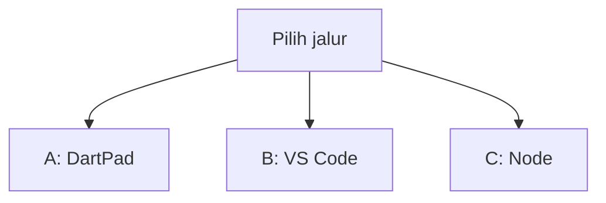

Letak tombol di DartPad (bukan sketsa):

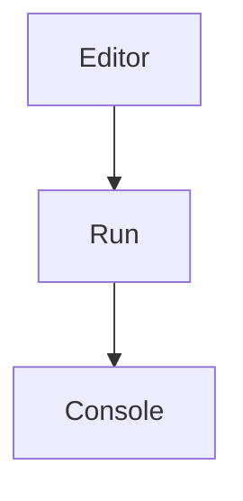


Sumber gambar: [dart.dev/tools/dartpad](https://dart.dev/tools/dartpad), Dart team / Google ([CC BY 4.0](https://creativecommons.org/licenses/by/4.0/)). Foto resmi itu **tema gelap** dan **mode Dart**. Kalau kelihatan seperti kotak hitam, gulir sampai editor kiri dan tombol **Run** terlihat; itu bukan gambar rusak. `dio` **tidak** diuji di sini.

### Dua jenis kode di halaman ini

| Jenis | Tanda | Caranya |
| --- | --- | --- |
| **Berkas lengkap** | Ada `void main()` (plus `import` kalau pakai paket) | Tempel utuh, lalu **Run** (alat yang disebut di kotak uji) |
| **Cuplikan** | Hanya potongan | Jangan di-Run sendirian |

### Pola uji A — DartPad

| | |
| --- | --- |
| **Buka** | [dartpad.dev](https://dartpad.dev) |
| **Pilih** | mode **Dart** |
| **Tempel** | **berkas lengkap** |
| **Klik** | **Run** |
| **Kalau berhasil** | Console di kanan menulis teks, bukan error merah |

DartPad jalan di **browser**. API yang dipanggil harus HTTPS dan mengizinkan CORS. Mini uji di bawah memakai [JSONPlaceholder](https://jsonplaceholder.typicode.com/) dan [DummyJSON](https://dummyjson.com/docs/products) — keduanya publik, tanpa kunci.

### Pola uji B — proyek lokal

| | |
| --- | --- |
| **Buka** | VS Code di folder proyek Flutter, emulator atau HP sudah menyala |
| **Terminal** | `Ctrl + J` |
| **Ketik** | perintah di bawah, di folder proyek |
| **Kalau berhasil** | mulai bagian 6: baris `dio:` ada di `pubspec.yaml` |

> **Aturan emas:** perintah `flutter ...` hanya di **Terminal VS Code**. DartPad tidak menjalankan `flutter pub add`. Perintah pertamanya ada di bagian 6.

### Pola uji C — backend mini

| | |
| --- | --- |
| **Buka** | Terminal VS Code di folder `modul-07-rest/backend-catatan` |
| **Perlu** | [Node.js LTS](https://nodejs.org) (v18 atau lebih baru) |
| **Ketik** | perintah di bawah |

```text
node -v
```

**Kalau berhasil:** muncul versi, misalnya `v22.x.x`. Kalau perintah tidak dikenali, unduh LTS dari [nodejs.org](https://nodejs.org), pasang, **tutup lalu buka lagi** VS Code, ulangi `node -v`.

---

## 1. Dapur sewaan vs cara bicara

**HTTP** = aturan kirim-pesan lewat internet: HP bertanya, server menjawab.

**REST** = kesepakatan sopan di atas HTTP. URL menunjuk data (contoh: `/catatan`). Kata kerja menunjuk tindakan (GET minta, POST buat).

**Resource** = satu jenis data di server, bukan nama tombol di UI. Contoh resource: catatan.

Firebase = satu dapur dengan aturan dan SDK-nya sendiri. Dapur REST boleh Node, Laravel, .NET, atau Cloud Functions — **suratnya** tetap HTTP + JSON.

Analogi restoran dari Modul 00 masih berlaku: HP memesan, JSON adalah nota, server adalah dapur. Modul ini mengisi **notanya**: kata kerja, kode status, kartu tamu, dan kebiasaan menguji dapur **sebelum** menyalahkan Flutter.

---

## 2. Empat pesan yang sopan: GET, POST, PUT, DELETE

HTTP punya kata kerja. Empat kata ini yang dipakai terus:

| Kata kerja | Artinya untuk resource | Analogi restoran |
| --- | --- | --- |
| **GET** | minta data, jangan mengubah | pelayan melihat menu |
| **POST** | buat data baru | pelayan mengantar piring baru |
| **PUT** | ganti data yang sudah ada | pelayan menukar piring |
| **DELETE** | hapus | pelayan membawa piring pergi |

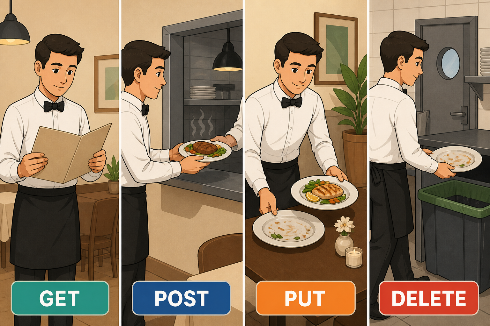

*Ilustrasi asli materi mobile2026. GET minta, POST buat, PUT ganti, DELETE hapus. Alur teknis ada di tabel di atas, bukan di dalam gambar.*

Ada juga `PATCH` (ubah sebagian). **CRUD** = buat, baca, ubah, hapus. Untuk CRUD lengkap, empat kata di tabel sudah cukup. Sumber konsep: [MDN — HTTP request methods](https://developer.mozilla.org/en-US/docs/Web/HTTP/Reference/Methods).

URL biasanya menunjuk **resource**, bukan tombol UI. Contoh: `/catatan` (daftar), `/catatan/3` (satu lembar). Jangan buat `/hapusCatatan` sebagai GET — hapus memakai DELETE.

---

## 3. JSON: surat yang sama dengan Modul 05

HP dan server saling kirim **teks JSON**, bukan class Dart. `fromJson` / `toJson` sudah dilatih di Modul 05. Di sini surat itu naik ke jaringan.

Cuplikan bentuk surat (jangan di-Run sendirian):

```json
{
  "id": 1,
  "judul": "Beli beras",
  "isi": "Di warung depan"
}
```

Sumber: [JSON and serialization](https://docs.flutter.dev/data-and-backend/serialization/json). Flutter and the related logo are trademarks of Google LLC.

Kalau kunci JSON beda dengan nama field Dart, terjemahkan di `fromJson` — jangan harap Dart menebak.

---

## 4. Kode status: jawaban dapur, bukan hanya “error merah”

Angka di depan body JSON memberitahu *jenis* hasil. UI yang baik membaca angka ini, bukan hanya `catch`.

| Kode | Arti kasar | Yang layak ditampilkan |
| --- | --- | --- |
| **200** | oke (GET/PUT) | tampilkan data |
| **201** | oke, baru dibuat (POST) | tampilkan item baru |
| **400** | permintaan tidak valid | perbaiki isian |
| **401** | token ditolak atau hilang | masuk lagi, atau minta token baru |
| **404** | resource tidak ketemu | “Tidak ada”, bukan crash |
| **429** | terlalu sering | “Coba sebentar lagi” |
| **500** | dapur rusak | “Server bermasalah”, jangan menyalahkan form |

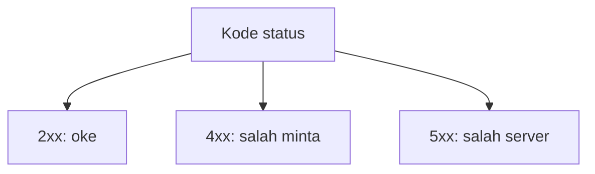

Sumber: [MDN — HTTP response status codes](https://developer.mozilla.org/en-US/docs/Web/HTTP/Reference/Status).

### Uji 1 — GET dan 404 di DartPad

| | |
| --- | --- |
| **Buka** | [dartpad.dev](https://dartpad.dev) |
| **Pilih** | mode **Dart** |
| **Tempel** | berkas lengkap di bawah |
| **Klik** | **Run** |
| **Ketik** | tidak perlu — ini uji DartPad |

```dart
import 'dart:convert';

import 'package:http/http.dart' as http;

void main() async {
  final oke = await http.get(
    Uri.parse('https://jsonplaceholder.typicode.com/posts/1'),
  );
  print('GET 1 → ${oke.statusCode}');
  final data = jsonDecode(oke.body) as Map<String, dynamic>;
  print(data['title']);

  final hilang = await http.get(
    Uri.parse('https://jsonplaceholder.typicode.com/posts/0'),
  );
  print('GET 0 → ${hilang.statusCode}');
}
```

**Kalau berhasil:** Console menulis `GET 1 → 200`, sebuah judul, lalu `GET 0 → 404`.

`package:http` ada di DartPad. `package:dio` tidak.

---

## 5. Tes API di luar app dulu

Kalau daftar kosong, jangan langsung menyalahkan `ListView`. Buktikan dulu server menjawab.

Alat: ekstensi [Thunder Client](https://marketplace.visualstudio.com/items?itemName=rangav.vscode-thunder-client) di VS Code, atau [Postman](https://www.postman.com/). Untuk GET saja, browser juga cukup.

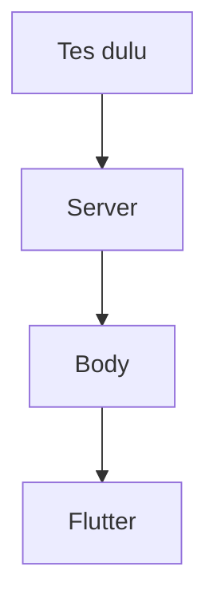

| | |
| --- | --- |
| **Buka** | Browser |
| **Ketik** | (di bilah alamat, bukan terminal) `https://dummyjson.com/products/1` |
| **Lihat** | teks JSON `id`, `title`, `price` |

**Kalau berhasil:** halaman menampilkan JSON, bukan error jaringan.

Latihan Thunder / Postman (jalur C, setelah `npm start` di bagian 17):

1. GET `http://localhost:3000/` → `{ ok: true }`
2. GET `http://localhost:3000/catatan` → ada `data`
3. POST `http://localhost:3000/catatan` **tanpa** header token → **401**
4. POST `http://localhost:3000/login` body JSON `{ "nama": "Ana" }` → dapat `token`
5. POST `http://localhost:3000/catatan` header `Authorization: Bearer <token>` body `{ "judul": "Tes" }` → **201**

Jangan buat tangkapan layar antarmuka Thunder/Postman sebagai “bukti benar”. Yang dipegang: **kode status + body**.

---

## 6. `http` di DartPad, `dio` di proyek

Cookbook resmi Flutter memakai `http` untuk unduh data: [Fetch data from the internet](https://docs.flutter.dev/cookbook/networking/fetch-data). Materi ini mengikuti silabus: di **proyek lokal** pakai [`dio`](https://pub.dev/packages/dio) karena interceptor (tempel token, baca 401) lebih ringkas.

| | |
| --- | --- |
| **Buka** | Terminal VS Code di folder proyek Flutter |
| **Ketik** | perintah di bawah |

```text
flutter pub add dio
```

**Kalau berhasil:** `pubspec.yaml` punya baris `dio:`. Terminal tidak merona.

Cuplikan (jalur B). Jangan tempel ke DartPad, dan jangan di-Run sendirian:

```dart
final dio = Dio(
  BaseOptions(
    baseUrl: 'https://dummyjson.com',
    connectTimeout: const Duration(seconds: 10),
    receiveTimeout: const Duration(seconds: 10),
  ),
);

final res = await dio.get(
  '/products',
  queryParameters: {'limit': 10, 'skip': 0},
);
```

`baseUrl` tanpa garis miring di ujung, path di `get` dengan garis miring di depan — kebiasaan `dio` yang sering bikin URL dobel atau hilang.

---

## 7. Interceptor: satpam di pintu keluar HP

Interceptor = kode yang menempel di **semua** request/response. Cocok untuk: tempel `Authorization`, log singkat, tangkap 401.

Cuplikan (jalur B). Jangan tempel ke DartPad:

```dart
dio.interceptors.add(
  InterceptorsWrapper(
    onRequest: (options, handler) async {
      final token = await storage.read(key: 'token');
      if (token != null && token.isNotEmpty) {
        options.headers['Authorization'] = 'Bearer $token';
      }
      handler.next(options);
    },
    onError: (e, handler) {
      handler.next(e);
    },
  ),
);
```

Jangan `print` isi token ke console di app yang akan diunggah orang lain. Dokumentasi: [dio — Interceptors](https://pub.dev/documentation/dio/latest/dio/Interceptor-class.html).

---

## 8. Token: kartu tamu, bukan tulisan di URL

JWT (JSON Web Token) bentuknya tiga bagian dipisah titik: header, isi, tanda tangan. Kata **Bearer** di header artinya: “bawa kartu ini.” Materi ini **tidak** membuat sistem login bank. Yang wajib: menaruh tanda pengenal di header `Authorization: Bearer ...`, dan menyimpannya di [`flutter_secure_storage`](https://pub.dev/packages/flutter_secure_storage) — bukan SharedPreferences, bukan di URL `?token=`.

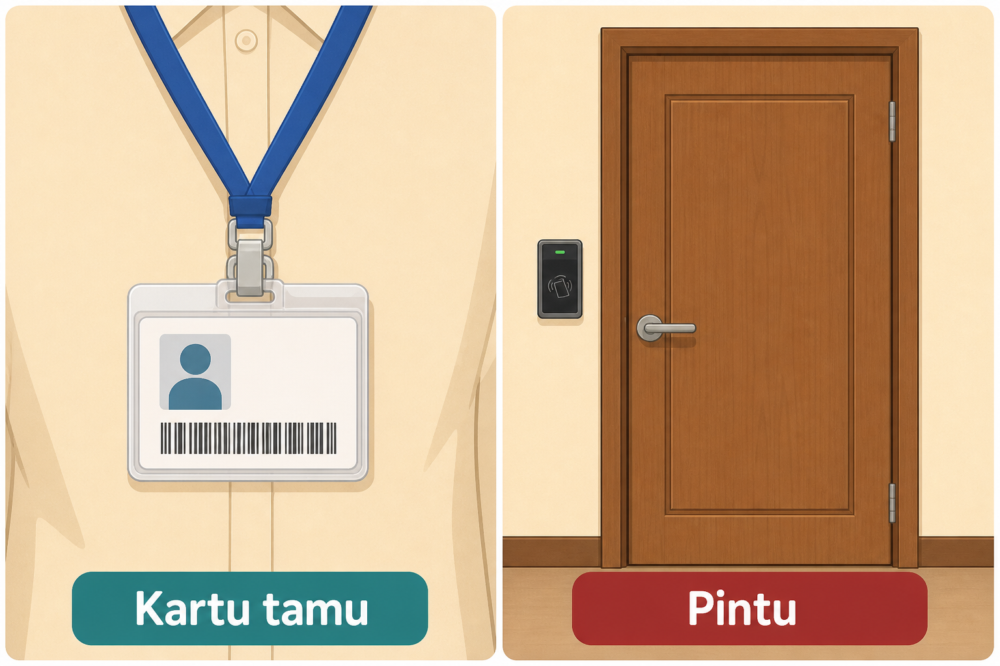

*Ilustrasi asli materi mobile2026. Token seperti kartu tamu. Server seperti pintu. Kartu diselipkan di header, bukan ditulis di URL.*

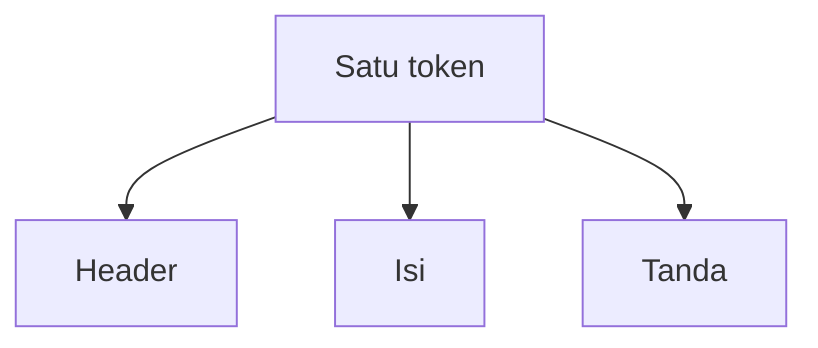

| | |
| --- | --- |
| **Buka** | Terminal VS Code di folder proyek Flutter |
| **Ketik** | perintah di bawah |

```text
flutter pub add flutter_secure_storage
```

**Kalau berhasil:** `pubspec.yaml` punya `flutter_secure_storage`.

Cuplikan simpan & tempel (jalur B):

```dart
final storage = FlutterSecureStorage();
await storage.write(key: 'token', value: tokenDariLogin);

// dibaca di interceptor, lalu:
options.headers['Authorization'] = 'Bearer $token';
```

Sumber pola header: [Authenticated requests](https://docs.flutter.dev/cookbook/networking/authenticated-requests). Login email/Google yang lengkap ada di **Modul 08**. Backend mini di folder ini memakai **string token latihan**, bukan JWT bertanda tangan — supaya pola header-nya sama, tanpa menyalin rahasia kriptografi ke HP.

---

## 9. 401: kartu kedaluwarsa

401 = pintu menolak kartu. Bukan 404 (kertas tidak ada) dan bukan 500 (dapur terbakar).

Konsep **refresh:** minta kartu baru ke `/refresh` **sekali**, lalu ulangi request yang gagal. Jangan loop: 401 → refresh → 401 → refresh …

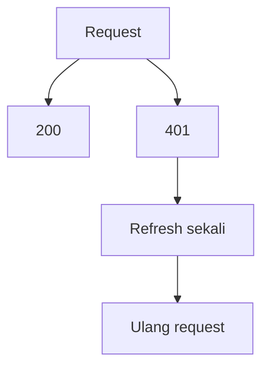

Cuplikan ide (jalur B). Yang penting: bendera `sedangRefresh` supaya interceptor tidak saling kejar.

```dart
var sedangRefresh = false;

// di onError, jika status == 401 dan belum sedangRefresh:
// 1. sedangRefresh = true
// 2. POST /refresh
// 3. simpan token baru
// 4. ulang e.requestOptions
// 5. sedangRefresh = false
```

Backend mini **tidak** wajib punya `/refresh`. Cukup Anda paham urutannya. Auth sungguhan: Modul 08.

---

## 10. Repository: ruang tamu tidak teriak ke jalan

Modul 04 sudah membagi folder: `ui` (ruang tamu), `data` (catatan), `services` (kurir). Widget **jangan** memanggil `dio.get` langsung. UI minta ke repository; repository yang bicara ke internet.

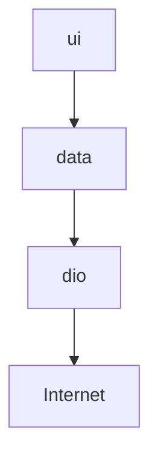

Cuplikan (jalur B):

```dart
class ProdukRepository {
  ProdukRepository(this._dio);
  final Dio _dio;

  Future<List<Produk>> ambilHalaman({required int skip}) async {
    final res = await _dio.get<Map<String, dynamic>>(
      '/products',
      queryParameters: {'limit': 10, 'skip': skip},
    );
    final list = res.data?['products'] as List<dynamic>? ?? [];
    return list
        .map((e) => Produk.fromJson(e as Map<String, dynamic>))
        .toList();
  }
}
```

Kalau besok `dio` diganti, UI tidak perlu diacak.

---

## 11. Timeout, sinyal, data rusak

Tiga gagal yang sering tertukar:

| Gejala | Penyebab yang sering | Pesan ke orang |
| --- | --- | --- |
| Lama lalu gagal | timeout / server diam | “Tidak ada jawaban. Coba lagi.” |
| Langsung gagal | tidak ada jaringan, DNS, SSL | “Periksa koneksi.” |
| Status 200 tapi crash | JSON tidak sesuai model | log error, tampilkan “Data tidak terbaca.” |

Cuplikan (jalur B):

```dart
try {
  return await repo.ambilHalaman(skip: skip);
} on DioException catch (e) {
  if (e.type == DioExceptionType.connectionTimeout ||
      e.type == DioExceptionType.receiveTimeout) {
    throw Exception('Tidak ada jawaban. Coba lagi.');
  }
  if (e.type == DioExceptionType.connectionError) {
    throw Exception('Periksa koneksi.');
  }
  final kode = e.response?.statusCode;
  throw Exception('Gagal ($kode).');
} on FormatException {
  throw Exception('Data tidak terbaca.');
}
```

`connectivity_plus` (Modul 05) hanya jenis jaringan, bukan jaminan API jalan. Yang menentukan: panggilan HTTP dan error-nya.

---

## 12. Pagination: satu kardus, bukan seluruh gudang

Jangan unduh 10.000 baris supaya `ListView` terasa “lengkap”. Ambil halaman: `limit` + `skip`, atau `page`.

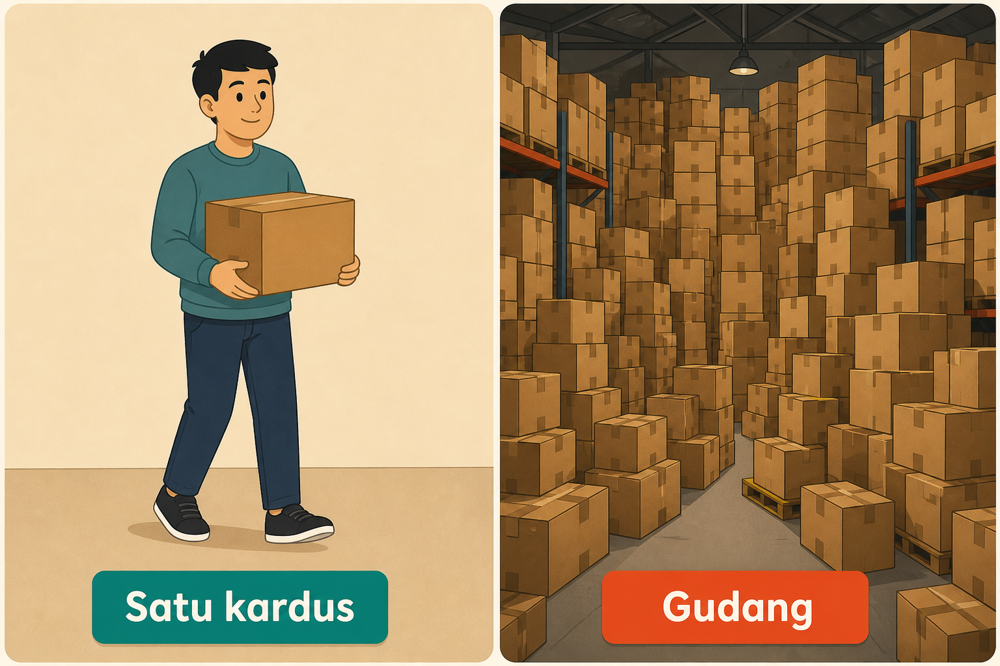

*Ilustrasi asli materi mobile2026. Pagination = ambil satu kardus. Jangan unduh seluruh gudang.*

### Uji 2 — halaman di DartPad

| | |
| --- | --- |
| **Buka** | [dartpad.dev](https://dartpad.dev) |
| **Pilih** | mode **Dart** |
| **Tempel** | berkas lengkap di bawah |
| **Klik** | **Run** |

```dart
import 'dart:convert';

import 'package:http/http.dart' as http;

void main() async {
  final uri = Uri.parse(
    'https://dummyjson.com/products?limit=3&skip=0',
  );
  final res = await http.get(uri);
  print('Status: ${res.statusCode}');
  final data = jsonDecode(res.body) as Map<String, dynamic>;
  print('Total: ${data['total']}');
  for (final p in data['products'] as List) {
    print(p['title']);
  }
}
```

**Kalau berhasil:** `Status: 200`, angka `Total` jauh lebih dari 3, dan **tiga** judul produk.

Di app: tombol **Berikutnya** menambah `skip` (0, 10, 20, …). Kalau `skip >= total`, tombol dimatikan. `ListView.builder` tetap dipakai — yang diubah hanya *berapa banyak yang diunduh*, bukan cara menggambar baris.

---

## 13. Multipart: kirim berkas, bukan hanya teks

JSON cocok untuk judul dan isi. Foto / PDF memakai **multipart**: bagian teks + bagian berkas. `dio` punya `FormData`.

Cuplikan (jalur B):

```dart
final form = FormData.fromMap({
  'judul': 'Foto catatan',
  'berkas': await MultipartFile.fromFile(
    pathFoto,
    filename: 'foto.jpg',
  ),
});
await dio.post('/unggah', data: form);
```

Kompres gambar sebelum unggah: Modul 08. Backend mini di folder ini **JSON saja** — jangan dipaksa terima foto di sesi ini. Yang wajib: Anda tahu kapan JSON tidak cukup.

---

## 14. Kunci API tidak telanjang di kode

`--dart-define` menanam nilai saat **compile**. Cocok untuk URL server dan kunci API publik yang tidak boleh ikut ketik di Git.

| | |
| --- | --- |
| **Buka** | Terminal VS Code di folder proyek Flutter |
| **Ketik** | perintah di bawah (satu baris) |

```text
flutter run --dart-define=API_URL=https://api.tvmaze.com
```

Cuplikan baca nilai (jalur B):

```dart
const apiUrl = String.fromEnvironment(
  'API_URL',
  defaultValue: 'https://api.tvmaze.com',
);
```

Untuk Node, pakai variabel lingkungan (`PORT`, `TOKEN_LATIHAN`). File `.env` **sudah** ada di `.gitignore` repo ini. Jangan commit kunci. Cuplikan (bukan Dart, jangan di DartPad):

```text
PORT=3000
TOKEN_LATIHAN=token-latihan-modul-07
```

Mini proyek di bawah memakai [TVmaze](https://www.tvmaze.com/api) yang **tidak butuh kunci**, supaya latihan tidak macet di formulir daftar API.

Sumber: [Dart environment declarations](https://dart.dev/guides/environment-declarations).

---

## 15. CORS, HTTPS, dan tiga arti “localhost”

Dua jebakan yang sering tertukar:

**CORS** hidup di **browser** (DartPad, Flutter web). Server harus mengirim header izin. App Android **bukan** browser: CORS biasanya bukan biang keladi. Backend mini sudah `app.use(cors())`.

**HTTP polos vs HTTPS.** Android 9+ menolak HTTP polos (cleartext) kecuali diizinkan. Chrome di PC sering masih membuka `http://localhost`. Jadi: “di browser boleh, di HP tidak” sering berarti **HP menolak HTTP**, bukan CORS.

Cuplikan debug saja, di `android/app/src/main/AndroidManifest.xml`, di dalam `<application ...>`:

```xml
android:usesCleartextTraffic="true"
```

Untuk app yang akan diunggah orang: **HTTPS**. Cabut izin cleartext. Sumber risiko: [Cleartext communications](https://developer.android.com/privacy-and-security/risks/cleartext-communications) (Android Developers).

**Localhost bukan satu mesin.** Tiga alat, tiga alamat. Jangan tertukar.

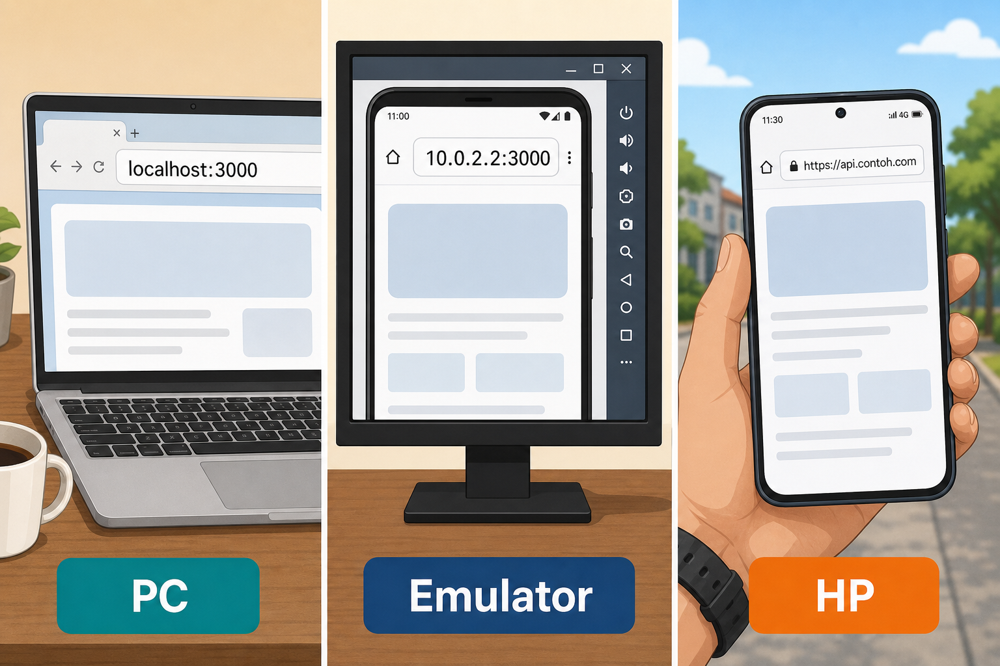

*Ilustrasi asli materi mobile2026. PC memakai localhost:3000. Emulator memakai 10.0.2.2:3000. HP fisik memakai URL publik HTTPS (di gambar: https://api.contoh.com). Label bawah: PC, Emulator, HP.*

| Siapa yang jalan | `localhost` itu siapa | URL yang dipakai |
| --- | --- | --- |
| Browser di PC | PC Anda | `http://localhost:3000` |
| Emulator Android | **emulator itu sendiri** | `http://10.0.2.2:3000` |
| HP fisik | **HP itu sendiri** | URL deploy, atau IP LAN PC (satu Wi-Fi) |

`10.0.2.2` adalah alias emulator ke PC host. Sumber: [Set up Android Emulator networking](https://developer.android.com/studio/run/emulator-networking).

Token hanya lewat HTTPS di internet. HTTP polos boleh untuk latihan di komputer sendiri, bukan untuk data orang.

---

## 16. Validasi harus hidup di server

Form HP bisa dilewati: HTTP bisa dikirim dari Thunder Client. Kalau server percaya saja, data rusak masuk.

Backend mini menolak judul pendek dengan **400**, meski request punya token. Coba di Thunder: POST `/catatan` dengan `{ "judul": "ab" }` → pesan “Judul minimal 3 huruf”.

UI tetap divalidasi (Modul 03) supaya orang tidak menunggu gagal. Satpam yang tidak bisa ditipu: **server**.

---

## 17. Backend sendiri: satu resource CRUD

Bukan “satu endpoint halo”. Resource **catatan** lengkap: daftar, satu item, buat, ganti, hapus. Kode ada di [`backend-catatan/`](backend-catatan/). Data di **memori proses** — tutup terminal, contoh catatan kembali. Jangan untuk data penting.

Ringkasan endpoint:

| Metode | Path | Token | Hasil |
| --- | --- | --- | --- |
| GET | `/` | tidak | `{ ok: true }` |
| POST | `/login` | tidak | `{ token, nama }` |
| GET | `/catatan?limit=20&skip=0` | tidak | `{ total, data }` |
| GET | `/catatan/:id` | tidak | satu objek atau 404 |
| POST | `/catatan` | Bearer | 201 atau 400/401 |
| PUT | `/catatan/:id` | Bearer | objek atau 404 |
| DELETE | `/catatan/:id` | Bearer | objek terhapus atau 404 |

### Nyalakan di PC

| | |
| --- | --- |
| **Buka** | Terminal VS Code |
| **Ketik** | perintah di bawah, **satu per satu** |

```text
cd modul-07-rest/backend-catatan
npm install
npm start
```

**Kalau berhasil:** `Mendengar di http://localhost:3000`. Biarkan terminal ini nyala. Buka terminal kedua untuk `flutter run`.

Lalu tes di browser: [http://localhost:3000](http://localhost:3000). Baru Thunder Client (bagian 5). Baru Flutter.

Emulator Android memakai `http://10.0.2.2:3000` plus izin cleartext debug. HP fisik: lanjut bagian 18.

---

## 18. Deploy satu kali: supaya HP fisik bisa masuk

`localhost` di HP = HP itu, bukan PC Anda. Agar HP di rumah (atau kuota seluler) menembus dapur, unggah backend mini **sekali** ke layanan yang memberi URL HTTPS.

Dua pilihan yang sering dipakai latihan: [Render](https://render.com/docs/deploy-node-express-app) atau [Railway](https://docs.railway.app/). Materi ini merinci **Render**. Railway: layanan Web, *start command* `npm start`, variabel `PORT` biasanya diisi platform.

Urutan kerja di Render, jangan terbalik:

1. Unggah folder `backend-catatan` ke **repo GitHub milik Anda** (fork, atau repo baru). Jangan menaruh token sungguhan.
2. Browser → [Render](https://render.com) → daftar → **New Web Service** → pilih repo itu.
3. *Root directory:* `backend-catatan` (atau folder tempat `package.json` berada).
4. *Build:* `npm install`. *Start:* `npm start`.
5. Runtime Node 18+. `PORT` diisi Render — `server.js` sudah membaca `process.env.PORT`.
6. Deploy. Tunggu URL `https://….onrender.com`.
7. Browser: buka URL itu. Harus `{ ok: true }`.
8. Di Flutter, `API_URL` = URL itu (**HTTPS**, tanpa garis miring di ujung).

**Kalau berhasil:** GET dari browser HP (Chrome di Android) ke URL itu menampilkan JSON. Baru `flutter run` di HP USB.

Paket gratis sering **tidur** setelah idle. Request pertama bisa 30–60 detik. Itu bukan bug Flutter. Jangan simpan data penting: restart instance mengosongkan memori.

---

## Mini proyek modul ini

Aplikasi **Daftar acara**: ambil acara dari API publik TVmaze, tampilkan halaman, tombol halaman berikutnya.

API (tanpa kunci): `GET https://api.tvmaze.com/shows?page=0`  
Dokumentasi: [TVmaze API](https://www.tvmaze.com/api). Halaman berikutnya: `page=1`, `page=2`, … Kalau body `[]`, berhenti. Satu halaman TVmaze bisa ~250 acara: **`ListView.builder` wajib**; gambar boleh dilewati di langkah pertama. Kalau emulator terasa berat, pakai pola yang sama ke DummyJSON: `GET /products?limit=10&skip=0` ([dokumentasi](https://dummyjson.com/docs/products)).

Urutan kerja, jangan terbalik:

1. **Browser:** buka [https://api.tvmaze.com/shows?page=0](https://api.tvmaze.com/shows?page=0). Pastikan JSON array muncul (`id`, `name`, `image`).
2. Buka **VS Code**, Terminal (`Ctrl + J`), emulator atau HP sudah menyala.
3. Terminal VS Code:

| | |
| --- | --- |
| **Buka** | Terminal VS Code |
| **Ketik** | perintah di bawah, **satu per satu** |

```text
flutter create daftar_acara
cd daftar_acara
flutter pub add dio provider
```

**Kalau berhasil:** folder `daftar_acara` ada, `pubspec.yaml` memuat `dio` dan `provider`.

4. `lib/data/acara.dart`: class `Acara` dengan `fromJson` — paling tidak `id`, `name`, URL gambar (`image['medium']`, boleh null).
5. `lib/data/acara_repository.dart`: `Dio` `baseUrl` dari `String.fromEnvironment('API_URL', defaultValue: 'https://api.tvmaze.com')`. Method `ambilHalaman(int page)` → `GET /shows` query `page`.
6. `lib/ui/daftar_page.dart`: `FutureBuilder` atau `provider`. `ListView.builder`. `ListTile` judul + `Image.network` jika URL ada (pola Modul 02). Tombol **Berikutnya** menambah `page`. Kalau hasil kosong, matikan tombol dan SnackBar “Sudah di ujung”.
7. Error: timeout / koneksi / status bukan 200 → SnackBar, bukan layar merah.
8. Terminal:

```text
flutter run --dart-define=API_URL=https://api.tvmaze.com
```

**Kalau berhasil:** daftar nama acara muncul. Tombol Berikutnya mengganti isi (bukan menumpuk 10.000 baris diam-diam). Mode pesawat → pesan koneksi, bukan crash.

**Latihan bonus (jalur C + B):** nyalakan `backend-catatan`, tes CRUD di Thunder, lalu layar Flutter: daftar catatan, form tambah, hapus. Token dari `POST /login` disimpan di `flutter_secure_storage`, ditempel interceptor. Emulator: `http://10.0.2.2:3000`. HP fisik: URL hasil bagian 18.

Pecah ke `lib/ui/` dan `lib/data/` seperti Modul 04.

---

## Kesalahan yang sering terjadi

| Gejala | Penyebab yang sering | Perbaikan |
| --- | --- | --- |
| `package:dio` error di DartPad | `dio` tidak ada di DartPad | Jalur A pakai `http`, jalur B pakai `dio` |
| XML / HTML di body | URL salah, atau buka situs web bukan API | tes di browser dulu; cek path |
| 401 terus | lupa header, atau token beda dengan server | Thunder: ulangi login + Bearer |
| 200 di Thunder, gagal di HP | `localhost` di HP = HP itu | `10.0.2.2` atau URL deploy |
| `Cleartext HTTP` | Android menolak `http://` | HTTPS, atau izin debug sementara |
| CORS di DartPad | API tidak mengizinkan browser | pakai DummyJSON / JSONPlaceholder / TVmaze |
| Crash `fromJson` | field null (`image`) | `as Map?`, fallback `null` |
| Daftar “hilang” setelah restart backend | data di memori proses | wajar; bukan SQLite |
| Request pertama Render sangat lama | instance tidur | tunggu; bukan bug `dio` |
| Token di query URL | kelihatan di log proxy | header `Authorization` + secure storage |

---

## Latihan

1. (DartPad) Ubah uji 1: GET `https://jsonplaceholder.typicode.com/users/1`, `print` `name` dan `email`.
2. (DartPad) Ubah uji 2: `skip=3` (tetap `limit=3`). Bandingkan judulnya dengan `skip=0`.
3. (Jalur B) Di mini proyek, tampilkan `premiered` di `subtitle` `ListTile` (field ada di JSON TVmaze).
4. (Jalur C) POST `/catatan` dengan judul 2 huruf. Pastikan **400**, bukan 201.
5. (Bonus) Deploy backend, GET URL publik dari Chrome di HP.

---

## Kuis singkat

1. Perintah `flutter pub add dio` diketik di mana?
2. Kenapa UI tidak boleh memanggil `dio.get` langsung?
3. 401 dan 404 bedanya apa?
4. Kenapa HP fisik tidak bisa memakai `http://localhost:3000` milik PC Anda?
5. Validasi judul di form Flutter saja cukup? Kenapa?

Kunci jawaban di bawah. Coba jawab dulu.

---

## Apa yang belum dibahas

- Email/password, Google Sign-In, verifikasi, reset, role admin → **Modul 08**
- Izin kamera/galeri, kompres unggah, FCM → Modul 08
- Tes otomatis, crash, performa → Modul 09
- OAuth lengkap, OpenAPI/Swagger, GraphQL, gRPC, refresh token berputar di produksi

---

## Kunci kuis

1. Terminal VS Code di folder proyek Flutter, bukan DartPad.
2. Supaya tampilan tidak terikat satu cara bicara ke internet. Ganti `dio` atau URL: yang diubah repository, bukan widget.
3. 401 = tanda pengenal ditolak atau hilang. 404 = resource (kertas / id) tidak ada.
4. `localhost` di HP adalah HP itu sendiri, bukan PC. Pakai `10.0.2.2` (emulator) atau URL HTTPS hasil deploy.
5. Tidak. Form bisa dilewati. Server harus menolak data rusak.

---

## Sumber gambar dan tautan

| Aset | Sumber |
| --- | --- |
| `images/analogi-empat-pesan.png` | Ilustrasi asli materi mobile2026 |
| `images/analogi-kartu-tamu.png` | Ilustrasi asli materi mobile2026 |
| `images/analogi-satu-kardus.png` | Ilustrasi asli materi mobile2026 |
| `images/analogi-pc-emulator-hp.png` | Ilustrasi asli materi mobile2026 |
| Tampilan DartPad | [dart.dev/assets/img/dartpad-hello.png](https://dart.dev/assets/img/dartpad-hello.png) dari [dart.dev/tools/dartpad](https://dart.dev/tools/dartpad) ([CC BY 4.0](https://creativecommons.org/licenses/by/4.0/)) |
| Paket DartPad | [github.com/dart-lang/dart-pad/wiki/Package-and-plugin-support](https://github.com/dart-lang/dart-pad/wiki/Package-and-plugin-support) |
| HTTP methods | [developer.mozilla.org/en-US/docs/Web/HTTP/Reference/Methods](https://developer.mozilla.org/en-US/docs/Web/HTTP/Reference/Methods) |
| HTTP status | [developer.mozilla.org/en-US/docs/Web/HTTP/Reference/Status](https://developer.mozilla.org/en-US/docs/Web/HTTP/Reference/Status) |
| JSON | [docs.flutter.dev/data-and-backend/serialization/json](https://docs.flutter.dev/data-and-backend/serialization/json) |
| Fetch data | [docs.flutter.dev/cookbook/networking/fetch-data](https://docs.flutter.dev/cookbook/networking/fetch-data) |
| Authenticated requests | [docs.flutter.dev/cookbook/networking/authenticated-requests](https://docs.flutter.dev/cookbook/networking/authenticated-requests) |
| `dio` | [pub.dev/packages/dio](https://pub.dev/packages/dio) |
| `http` | [pub.dev/packages/http](https://pub.dev/packages/http) |
| `flutter_secure_storage` | [pub.dev/packages/flutter_secure_storage](https://pub.dev/packages/flutter_secure_storage) |
| Environment declarations | [dart.dev/guides/environment-declarations](https://dart.dev/guides/environment-declarations) |
| JSONPlaceholder | [jsonplaceholder.typicode.com](https://jsonplaceholder.typicode.com/) |
| DummyJSON products | [dummyjson.com/docs/products](https://dummyjson.com/docs/products) |
| TVmaze API | [tvmaze.com/api](https://www.tvmaze.com/api) |
| Thunder Client | [VS Code Marketplace](https://marketplace.visualstudio.com/items?itemName=rangav.vscode-thunder-client) |
| Postman | [postman.com](https://www.postman.com/) |
| Node.js | [nodejs.org](https://nodejs.org) |
| Express | [expressjs.com](https://expressjs.com/) |
| CORS (MDN) | [developer.mozilla.org/en-US/docs/Web/HTTP/Guides/CORS](https://developer.mozilla.org/en-US/docs/Web/HTTP/Guides/CORS) |
| Cleartext HTTP | [developer.android.com/privacy-and-security/risks/cleartext-communications](https://developer.android.com/privacy-and-security/risks/cleartext-communications) |
| Emulator networking | [developer.android.com/studio/run/emulator-networking](https://developer.android.com/studio/run/emulator-networking) |
| Deploy Node di Render | [render.com/docs/deploy-node-express-app](https://render.com/docs/deploy-node-express-app) |
| Railway | [docs.railway.app](https://docs.railway.app/) |

Flutter and the related logo are trademarks of Google LLC. We are not endorsed by or affiliated with Google LLC.
