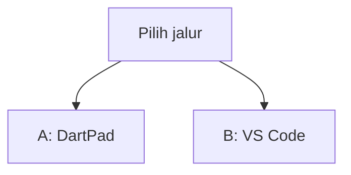
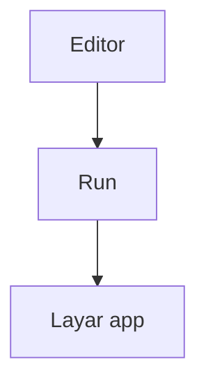
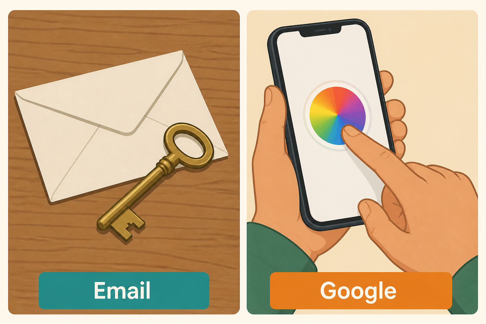
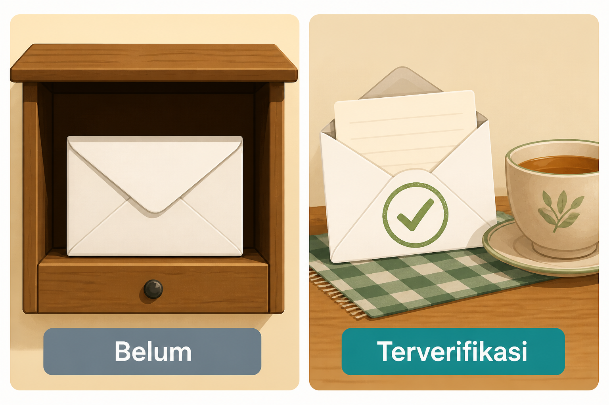
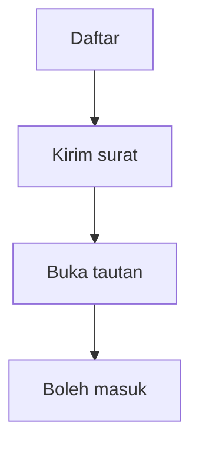
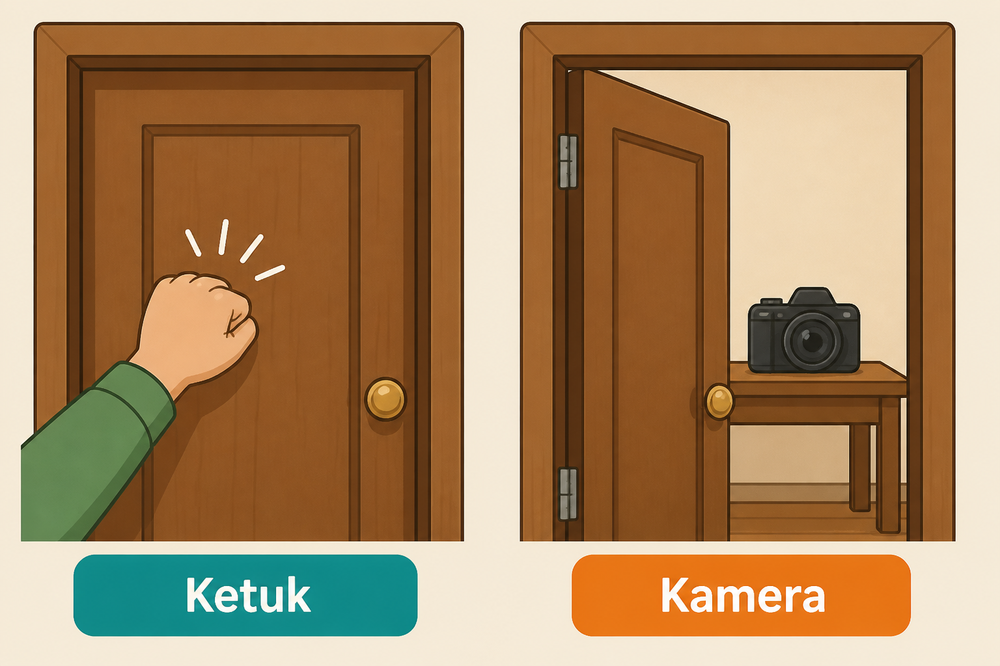
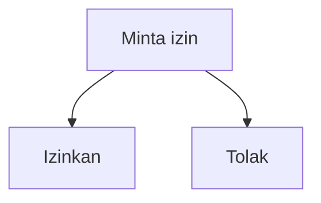
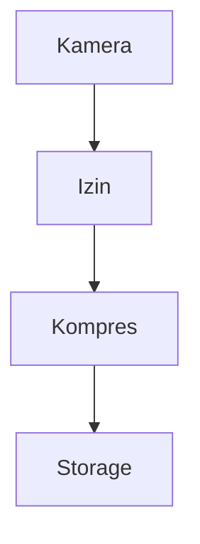
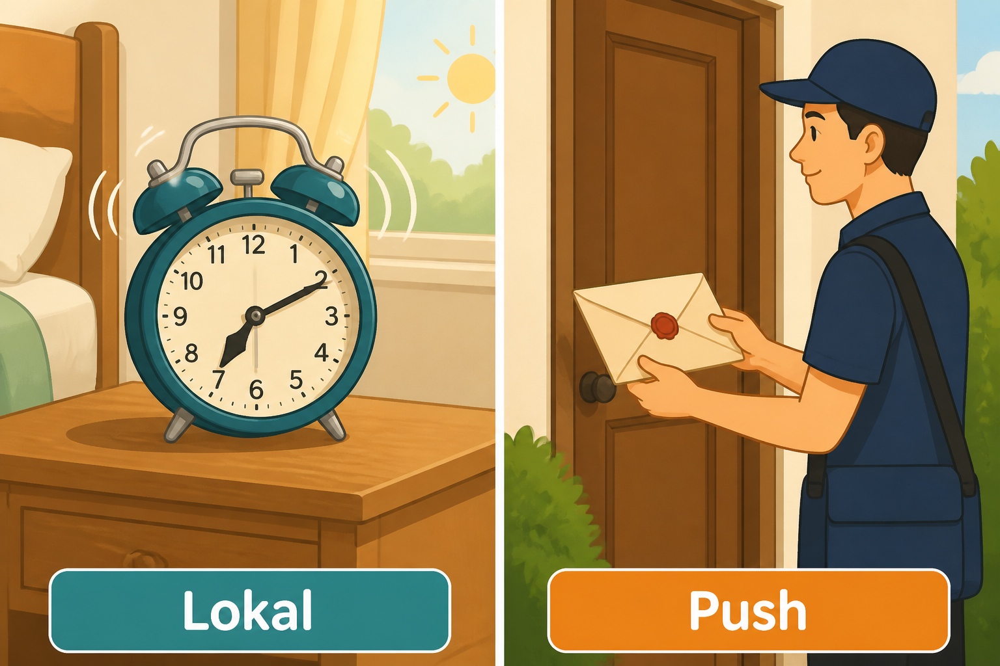
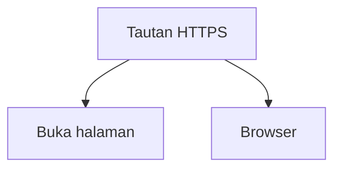

# Modul 08 — Fitur app sungguhan

**Waktu:** 2–3 sesi  
**Prasyarat:** Modul 00–07 (Firebase pernah `flutter run`, REST sudah pernah dipanggil).  
**Hasil:** Nanti Anda bisa membuat orang masuk dengan email atau Google, mengecek surat verifikasi, meminta izin kamera, mengunggah foto yang sudah diperkecil, menampilkan gambar dari internet tanpa unduh ulang setiap scroll, dan membedakan jam weker di HP dengan surat dari server.

Modul 06: dapur sewaan, masuk tanpa nama (Anonymous). Modul 07: bahasa HTTP. Modul ini: **orang sungguhan** masuk ke app — nama, foto, izin, lonceng.

---

## Buka alat ini dulu

Ada **dua jalur uji**. Jangan sampai tertukar.

Plugin HP (`firebase_auth`, `google_sign_in`, `permission_handler`, `image_picker`, `firebase_messaging`, …) **tidak** ada di [daftar paket DartPad](https://github.com/dart-lang/dart-pad/wiki/Package-and-plugin-support). Jangan tempel `import 'package:firebase_auth/...'` di DartPad. `provider` **boleh** di jalur A.

| Jalur | Buka | Untuk apa |
| --- | --- | --- |
| A | Browser → [dartpad.dev](https://dartpad.dev) → mode **Flutter** | Sesi, gerbang verifikasi, “admin di UI bukan satpam” |
| B | VS Code + Terminal (`Ctrl + J`) + emulator/HP + [Firebase Console](https://console.firebase.google.com) | Auth email/Google, izin, foto, lonceng, FCM |



Letak tombol di DartPad (bukan sketsa):




Sumber gambar: [dart.dev/tools/dartpad](https://dart.dev/tools/dartpad), Dart team / Google ([CC BY 4.0](https://creativecommons.org/licenses/by/4.0/)). Foto resmi itu **tema gelap** dan **mode Dart**. Kalau kelihatan seperti kotak hitam, gulir sampai editor kiri dan tombol **Run** terlihat; itu bukan gambar rusak. Untuk uji widget di modul ini, di pojok DartPad pilih mode **Flutter** supaya panel kanan jadi **layar aplikasi**. Plugin Firebase **tidak** diuji di sini.

### Dua jenis kode di halaman ini

| Jenis | Tanda | Caranya |
| --- | --- | --- |
| **Berkas lengkap** | Ada `void main()` (plus `import` kalau pakai paket) | Tempel utuh, lalu **Run** (alat yang disebut di kotak uji) |
| **Cuplikan** | Hanya potongan | Jangan di-Run sendirian |

### Pola uji A — DartPad Flutter

| | |
| --- | --- |
| **Buka** | [dartpad.dev](https://dartpad.dev) |
| **Pilih** | mode **Flutter** |
| **Tempel** | **berkas lengkap** |
| **Klik** | **Run** |
| **Kalau berhasil** | panel kanan menampilkan tombol atau teks, bukan error merah |

### Pola uji B — proyek lokal + Console

| | |
| --- | --- |
| **Buka** | VS Code di folder proyek Flutter, emulator atau HP sudah menyala |
| **Browser** | [console.firebase.google.com](https://console.firebase.google.com) (akun Google) |
| **Terminal** | `Ctrl + J` |
| **Ketik** | perintah di bagian 2 (paket) atau di mini proyek, di folder proyek |
| **Kalau berhasil** | baris paket ada di `pubspec.yaml`; Email/Password dan Google berstatus Enabled di Console |

> **Aturan emas:** perintah `flutter ...` hanya di **Terminal VS Code**. DartPad tidak menjalankan `flutter pub add`, tidak membuka kamera, dan tidak menerima FCM. Perintah `flutter` pertamanya ada di bagian 2. Console dinyalakan juga di bagian 2, sebelum paket.

Praktik di materi ini: **Windows → Android**. Info.plist (iOS) dijelaskan sebagai konsep. Membangun iOS butuh Mac.

---

## 1. Anonymous sudah tidak cukup

Anonymous (Modul 06) = tanda pengenal sementara. Tutup app, ganti HP, atau orang lain memakai emulator yang sama: identitas itu rapuh.

App sungguhan butuh:

- orang **daftar** dengan email
- orang **membuktikan** email itu miliknya
- orang **masuk lagi** besok
- orang **keluar** dengan rapi
- orang **ganti sandi** kalau lupa

Itulah yang disebut autentikasi: memastikan orang itu memang dirinya. Token hasil login tetap di [`flutter_secure_storage`](https://pub.dev/packages/flutter_secure_storage) (Modul 05 dan 07), bukan SharedPreferences.

Firebase Auth tetap dapur sewaan. Pola yang sama bisa dipakai ke REST + JWT (Modul 07). Jangan meniru sistem bank.

Sumber: [Firebase Authentication](https://firebase.google.com/docs/auth).

---

## 2. Dua pintu: email dan Google

Dua cara masuk yang wajib di modul ini:

| Pintu | Orang mengetik | Yang perlu di Console |
| --- | --- | --- |
| **Email/password** | email + sandi | Authentication → Email/Password |
| **Google Sign-In** | pilih akun Google | Authentication → Google + sidik SHA-1 Android |



*Ilustrasi asli materi mobile2026. Email = surat + kunci. Google = masuk lewat akun yang sudah ada. Gambar ini bukan logo resmi Google.*

### Nyalakan di Console

| | |
| --- | --- |
| **Buka** | Browser → [console.firebase.google.com](https://console.firebase.google.com) → proyek Modul 06 (atau proyek baru) |
| **Klik** | Build → Authentication → Sign-in method |
| **Nyalakan** | **Email/Password** dan **Google** (email dukungan: email Anda) |

**Kalau berhasil:** dua metode berstatus Enabled.

Jangan matikan Anonymous dulu kalau app Modul 06 masih memakainya. App baru di modul ini boleh tanpa Anonymous.

### Paket di proyek Flutter

| | |
| --- | --- |
| **Buka** | Terminal VS Code di folder proyek |
| **Ketik** | perintah di bawah |

```text
flutter pub add firebase_core firebase_auth google_sign_in flutter_secure_storage
```

**Kalau berhasil:** `pubspec.yaml` memuat keempat paket. `flutterfire configure` (Modul 06) tetap dipakai kalau `firebase_options.dart` belum ada.

### SHA-1: Google Sign-In di Android

Tanpa sidik **SHA-1** debug, tombol Google di emulator sering gagal diam-diam.

| | |
| --- | --- |
| **Buka** | Terminal VS Code di folder proyek Flutter (bukan di DartPad) |
| **Ketik** | perintah di bawah, **satu per satu** |

```text
cd android
.\gradlew.bat signingReport
```

**Kalau berhasil:** terminal menulis `SHA1:` diikuti deretan angka-huruf. Salin **SHA-1** variant `debug`. Kalau `gradlew.bat` tidak ketemu, Anda belum masuk folder `android`.

Tempel ke Firebase Console → Project settings → Your apps → Android app → Add fingerprint. Unduh `google-services.json` baru kalau Console memintanya. Berkas itu **jangan** di-commit (sudah di `.gitignore`).

Sumber: [Authenticating Your Client](https://developers.google.com/android/guides/client-auth) (Android), [Google Sign-In](https://firebase.google.com/docs/auth/flutter/federated-providers#google) (Firebase).

Cuplikan daftar akun lewat email (jalur B, jangan di DartPad):

```dart
final cred = await FirebaseAuth.instance.createUserWithEmailAndPassword(
  email: email,
  password: sandi,
);
await cred.user?.sendEmailVerification();
```

Cuplikan masuk Google (jalur B):

```dart
final googleUser = await GoogleSignIn().signIn();
if (googleUser == null) return; // orang membatalkan
final googleAuth = await googleUser.authentication;
final cred = GoogleAuthProvider.credential(
  accessToken: googleAuth.accessToken,
  idToken: googleAuth.idToken,
);
await FirebaseAuth.instance.signInWithCredential(cred);
```

Kalau paket `google_sign_in` di mesin Anda memakai API baru, ikuti contoh di [pub.dev/packages/google_sign_in](https://pub.dev/packages/google_sign_in) — pola Firebase-nya tetap: dapat `idToken`, lalu `signInWithCredential`.

Sandi **jangan** di-`print`. Jangan disimpan di SharedPreferences.

---

## 3. Verifikasi email: login belum lengkap tanpanya

Daftar saja belum cukup. Siapa pun bisa mengetik email orang lain. **Verifikasi** = “saya yang punya kotak ini.”



*Ilustrasi asli materi mobile2026. Kiri belum dicek. Kanan sudah terverifikasi (cap centang hijau di surat).*



Cuplikan (jalur B):

```dart
final user = FirebaseAuth.instance.currentUser;
if (user != null && !user.emailVerified) {
  await user.sendEmailVerification();
  // tampilkan: "Cek kotak masuk, termasuk folder spam."
}

await user?.reload();
if (user?.emailVerified != true) {
  // jangan buka halaman isi app
}
```

**Reset password** memakai surat yang sama jenisnya: `sendPasswordResetEmail(email)`. Orang membuka tautan, menulis sandi baru di halaman Firebase, lalu masuk lagi di app.

Sumber: [Manage Users](https://firebase.google.com/docs/auth/flutter/manage-users).

Gmail latihan kadang menaruh surat di **Spam**. Tunggu satu atau dua menit sebelum menyalahkan kode.

---

## 4. Sesi: siapa yang sedang login

`FirebaseAuth.instance.currentUser` = orang yang sedang di HP ini. `null` = belum masuk.

`authStateChanges()` = aliran berita dari Firebase: orang baru masuk, orang keluar, atau token diperbarui. Pasang di gerbang rute (`go_router` redirect, Modul 03), supaya halaman isi tidak kebuka sebelum login.

Cuplikan gerbang (jalur B):

```dart
StreamBuilder<User?>(
  stream: FirebaseAuth.instance.authStateChanges(),
  builder: (context, snap) {
    final user = snap.data;
    if (user == null) return const HalamanMasuk();
    if (!user.emailVerified) return const HalamanCekEmail();
    return const HalamanBeranda();
  },
);
```

**Logout:** `await FirebaseAuth.instance.signOut();` plus `GoogleSignIn().signOut();` kalau pintu Google dipakai. Hapus token di `flutter_secure_storage`. Jangan hanya pindah halaman: `currentUser` masih ada.

Kapan memaksa keluar: orang menekan Keluar; atau server menolak 401 terus (Modul 07) setelah refresh gagal.

---

## 5. Role: tombol Admin bukan satpam

Menyembunyikan tombol Hapus di layar **tidak** melindungi data. Orang yang tahu alamat server tetap bisa menghapus, meski tombolnya tidak kelihatan.

Satpam yang dipercaya:

- **Firestore rules** / custom claim (Modul 06)
- atau **server REST** (Modul 07) yang membaca role di token

Di HP, `isAdmin` hanya untuk menata layar — supaya tombol tidak mengganggu. Bukan untuk keamanan.

### Uji 1 — gerbang sesi di DartPad

| | |
| --- | --- |
| **Buka** | [dartpad.dev](https://dartpad.dev) |
| **Pilih** | mode **Flutter** |
| **Tempel** | berkas lengkap di bawah |
| **Klik** | **Run** |

```dart
import 'package:flutter/material.dart';
import 'package:provider/provider.dart';

class Sesi extends ChangeNotifier {
  String? uid;
  bool emailTerverifikasi = false;
  bool isAdmin = false;

  void masuk({required bool verifikasi, required bool admin}) {
    uid = 'latihan';
    emailTerverifikasi = verifikasi;
    isAdmin = admin;
    notifyListeners();
  }

  void keluar() {
    uid = null;
    emailTerverifikasi = false;
    isAdmin = false;
    notifyListeners();
  }
}

void main() {
  runApp(
    ChangeNotifierProvider(
      create: (_) => Sesi(),
      child: const MaterialApp(home: Gerbang()),
    ),
  );
}

class Gerbang extends StatelessWidget {
  const Gerbang({super.key});

  @override
  Widget build(BuildContext context) {
    final sesi = context.watch<Sesi>();
    if (sesi.uid == null) {
      return Scaffold(
        body: Center(
          child: FilledButton(
            onPressed: () => context.read<Sesi>().masuk(
              verifikasi: false,
              admin: true,
            ),
            child: const Text('Masuk (belum verifikasi)'),
          ),
        ),
      );
    }
    if (!sesi.emailTerverifikasi) {
      return Scaffold(
        body: Center(
          child: Column(
            mainAxisSize: MainAxisSize.min,
            children: [
              const Text('Cek kotak masuk dulu.'),
              FilledButton(
                onPressed: () => context.read<Sesi>().masuk(
                  verifikasi: true,
                  admin: true,
                ),
                child: const Text('Sudah verifikasi (latihan)'),
              ),
            ],
          ),
        ),
      );
    }
    return Scaffold(
      body: Center(
        child: Text(
          sesi.isAdmin
              ? 'Tombol hapus semua kelihatan — ini hanya UI.'
              : 'Pengguna biasa',
        ),
      ),
    );
  }
}
```

**Kalau berhasil:** tombol Masuk → teks “Cek kotak masuk”. Tombol kedua → peringatan bahwa admin di UI bukan satpam.

`provider` ada di DartPad. `firebase_auth` tidak.

---

## 6. Izin HP: ketuk dulu, baru kamera

Android 13+ dan iOS menolak kamera, galeri, dan notifikasi sampai orang menekan **Izinkan**. Paket: [`permission_handler`](https://pub.dev/packages/permission_handler).



*Ilustrasi asli materi mobile2026. Ketuk dulu (izin). Baru kamera boleh dipakai.*



| | |
| --- | --- |
| **Buka** | Terminal VS Code di folder proyek |
| **Ketik** | perintah di bawah |

```text
flutter pub add permission_handler image_picker flutter_image_compress cached_network_image
```

**Kalau berhasil:** `pubspec.yaml` memuat keempat paket.

Cuplikan (jalur B):

```dart
final status = await Permission.camera.request();
if (!status.isGranted) {
  // SnackBar: "Kamera perlu diizinkan di Pengaturan."
  return;
}
```

**AndroidManifest** (`android/app/src/main/AndroidManifest.xml`), di dalam `<manifest>` — cuplikan:

```xml
<uses-permission android:name="android.permission.CAMERA" />
<uses-permission android:name="android.permission.READ_MEDIA_IMAGES" />
<uses-permission android:name="android.permission.POST_NOTIFICATIONS" />
```

API 32 ke bawah kadang masih memakai `READ_EXTERNAL_STORAGE`. Ikuti pesan error Gradle / dokumentasi `permission_handler` untuk angka `minSdk` Anda.

**iOS (konsep, Info.plist):** `NSCameraUsageDescription`, `NSPhotoLibraryUsageDescription`, `NSUserNotificationsUsageDescription` — kalimat pendek *mengapa* app meminta. Tanpa itu, App Store menolak. Dari Windows Anda tidak menandatangani iOS.

Jangan minta semua izin saat app baru dibuka. Minta **saat tombol Kamera** ditekan, supaya orang paham konteksnya.

---

## 7. Unggah foto: kamera, galeri, kompres

Alur yang hemat kuota:



Cuplikan (jalur B):

```dart
final xfile = await ImagePicker().pickImage(source: ImageSource.camera);
if (xfile == null) return;
final kecil = await FlutterImageCompress.compressWithFile(
  xfile.path,
  quality: 70,
  minWidth: 1080,
);
// unggah `kecil` ke Firebase Storage (Modul 06) atau multipart (Modul 07)
```

Tanpa kompres, foto 4–8 MB cepat menghabiskan Storage dan kuota orang. `quality: 70` dan lebar sekitar 1080 biasanya cukup untuk posting.

Tampilkan hasil jaringan dengan [`cached_network_image`](https://pub.dev/packages/cached_network_image) supaya daftar tidak mengunduh ulang setiap scroll. Cuplikan (jalur B):

```dart
CachedNetworkImage(
  imageUrl: url,
  placeholder: (context, _) => const CircularProgressIndicator(),
  errorWidget: (context, url, error) => const Icon(Icons.broken_image),
)
```

`Image.network` (Modul 02) tetap sah untuk uji. Daftar panjang: pakai cache.

Sumber picker: [image_picker](https://pub.dev/packages/image_picker). Storage: [Upload files with Cloud Storage](https://firebase.google.com/docs/storage/flutter/upload-files).

---

## 8. Dua lonceng: lokal vs push

| Jenis | Analogi | Kapan |
| --- | --- | --- |
| **Lokal** | jam weker di nakas | HP sendiri yang berbunyi, meski server diam |
| **Push (FCM)** | kurir mengantar surat | server (atau Console) mengirim ke HP ini |



*Ilustrasi asli materi mobile2026. Lokal = jam di HP. Push = kurir dari server (FCM).*

Mini proyek hari ini **wajib** satu pengingat lokal. FCM diajarkan, tidak wajib tembus di sesi yang sama.

| | |
| --- | --- |
| **Buka** | Terminal VS Code di folder proyek |
| **Ketik** | perintah di bawah |

```text
flutter pub add flutter_local_notifications firebase_messaging
```

**Kalau berhasil:** kedua paket ada di `pubspec.yaml`.

Cuplikan pengingat lokal (jalur B) — tampilkan sekarang, supaya uji tidak menunggu:

```dart
final plugin = FlutterLocalNotificationsPlugin();
await plugin.initialize(
  const InitializationSettings(
    android: AndroidInitializationSettings('@mipmap/ic_launcher'),
  ),
);
await plugin.show(
  1,
  'Pengingat',
  'Cek posting komunitas.',
  const NotificationDetails(
    android: AndroidNotificationDetails(
      'umum',
      'Umum',
      importance: Importance.defaultImportance,
    ),
  ),
);
```

`AndroidNotificationDetails` yang pertama (`umum`) = **notification channel**. Android 8+ tanpa channel: lonceng sering diam. Sumber: [Create a notification channel](https://developer.android.com/develop/ui/views/notifications/channels).

---

## 9. FCM: app terbuka, di belakang, ditutup

[`firebase_messaging`](https://pub.dev/packages/firebase_messaging) menerima surat saat:

| App | Yang biasanya terjadi |
| --- | --- |
| **Terbuka** | `onMessage` — banner di dalam app, bukan selalu laci sistem |
| **Di belakang** | laci notifikasi sistem |
| **Ditutup** | laci; orang mengetuk → app buka (bisa bawa `data`) |

Uji tanpa Cloud Functions: Firebase Console → Messaging → New campaign → Notification. Kirim ke token HP uji. Token didapat dari `FirebaseMessaging.instance.getToken()`.

Jangan `print` token di app yang akan diunggah orang lain. Channel Android (`umum` di atas) harus sama dengan yang Anda buat di kode.

Data vs notifikasi: payload `notification` ditampilkan sistem; payload `data` dibaca kode. Untuk latihan, kampanye Console cukup.

---

## 10. Deep link: buka halaman dari luar app

**App Link** (Android) / Universal Link (iOS): tautan `https://contoh.com/posting/3` membuka halaman itu di app, kalau app terpasang.

Ini **bukan** Firebase Dynamic Links. Dynamic Links **sudah deprecated** (Modul 06). Jangan diikuti tutorial lama.

Cuplikan Android `intent-filter` (konsep, di `AndroidManifest` activity utama):

```xml
<intent-filter android:autoVerify="true">
  <action android:name="android.intent.action.VIEW" />
  <category android:name="android.intent.category.DEFAULT" />
  <category android:name="android.intent.category.BROWSABLE" />
  <data android:scheme="https" android:host="contoh.com" android:pathPrefix="/posting" />
</intent-filter>
```

Di Flutter, baca tautan dengan [`app_links`](https://pub.dev/packages/app_links) lalu `go_router` ke `/posting/3`. Verifikasi `assetlinks.json` di server = langkah rilis (Modul 10), bukan wajib hari ini.

iOS Universal Links butuh file `apple-app-site-association` dan Mac.



Sumber konsep: [Add Android App Links](https://developer.android.com/training/app-links).

---

## 11. OTP / nomor HP: dikenalkan, tidak wajib

Di Indonesia, masuk dengan nomor HP + SMS sering dipakai. Firebase punya Phone Auth. Syaratnya: SHA, kuota SMS, kadang paket Blaze, dan nomor uji.

Untuk modul wajib ini: **tahu bahwa pintunya ada**. Jangan dipaksa di mini proyek. Email + Google sudah cukup. OTP bisa dilanjut nanti, kalau proyek kantor membutuhkannya.

---

## Mini proyek modul ini

Aplikasi **Komunitas mini**: daftar, verifikasi, login, posting teks + foto, satu pengingat lokal, logout.

Urutan kerja, jangan terbalik:

1. **Browser:** buka [Firebase Console](https://console.firebase.google.com). Nyalakan Email/Password dan Google (seperti bagian 2). Firestore dan Storage sudah dari Modul 06. Rules koleksi `posting`: baca/tulis hanya jika `request.auth != null`, dan `uid` di dokumen harus sama dengan `request.auth.uid`. **Publish**.
2. SHA-1 debug (bagian 2) → fingerprint Android → `google-services.json` baru bila diminta.
3. Buka **VS Code**, Terminal (`Ctrl + J`), emulator atau HP sudah menyala.
4. Terminal:

| | |
| --- | --- |
| **Buka** | Terminal VS Code |
| **Ketik** | perintah di bawah, **satu per satu** |

```text
flutter create komunitas_mini
cd komunitas_mini
flutter pub add firebase_core firebase_auth google_sign_in cloud_firestore firebase_storage permission_handler image_picker flutter_image_compress cached_network_image flutter_local_notifications flutter_secure_storage provider go_router
```

**Kalau berhasil:** folder `komunitas_mini` ada; `pubspec.yaml` memuat paket di atas.

5. Sambungkan Firebase (Android), seperti Modul 06:

| | |
| --- | --- |
| **Buka** | Terminal VS Code di folder `komunitas_mini` |
| **Ketik** | perintah di bawah |

```text
flutterfire configure
```

**Kalau berhasil:** berkas `lib/firebase_options.dart` ada. Lalu inisialisasi Firebase di `main()` seperti Modul 06.

6. Halaman daftar/masuk: email + sandi. Setelah `createUser`, `sendEmailVerification()`. Google Sign-In sebagai tombol kedua.
7. Gerbang: `authStateChanges` → belum masuk / belum verifikasi / beranda. Tombol “Kirim ulang surat”.
8. Beranda: form teks + tombol kamera/galeri (izin dulu) → kompres → unggah Storage → `add` ke koleksi `posting` (`uid`, `teks`, `urlFoto`, `waktu`).
9. Daftar posting: `StreamBuilder` + `CachedNetworkImage`. `ListView.builder`.
10. Tombol **Pengingat**: `flutter_local_notifications` `show` (channel `umum`). Izin notifikasi Android 13+.
11. Tombol **Keluar**: `signOut` Auth + Google + hapus secure storage.
12. Jalankan di emulator atau HP:

| | |
| --- | --- |
| **Buka** | Terminal VS Code di folder `komunitas_mini`; emulator atau HP sudah menyala |
| **Ketik** | perintah di bawah |

```text
flutter run
```

**Kalau berhasil:** tanpa verifikasi, beranda tidak terbuka. Setelah tautan di email diklik dan app di-reload, posting teks+foto muncul. Pengingat tampil di laci. Keluar kembali ke halaman masuk.

FCM dari Console = latihan bonus, bukan syarat lulus mini proyek. Jangan commit `google-services.json`.

---

## Kesalahan yang sering terjadi

| Gejala | Penyebab yang sering | Perbaikan |
| --- | --- | --- |
| `firebase_auth` error di DartPad | plugin tidak ada di DartPad | Jalur B |
| `operation-not-allowed` | Email/Google belum Enabled | Console → Sign-in method |
| Google Sign-In batal / error 10 | SHA-1 debug belum ditempel | `signingReport`, Add fingerprint |
| Surat verifikasi “tidak ada” | spam, atau email salah ketik | folder Spam; `sendEmailVerification` lagi |
| Sudah klik tautan, app masih “cek email” | lupa `reload()` | `user.reload()` lalu cek `emailVerified` |
| Izin kamera langsung ditolak | tidak ada permission di Manifest | bagian 6 |
| Foto 8 MB, Storage mahal | lupa kompres | `quality: 70`, `minWidth: 1080` |
| Notifikasi diam di Android 8+ | tidak ada channel | `AndroidNotificationDetails` + id channel |
| Dynamic Links di tutorial 2022 | produk deprecated | App Link, bagian 10 |
| Role admin di SharedPreferences | bisa diubah di HP | rules / custom claim / server |

---

## Latihan

1. (DartPad) Di uji 1, tambah tombol **Keluar** yang memanggil `sesi.keluar()`.
2. (Jalur B) Tombol “Kirim ulang surat verifikasi” dengan jeda 60 detik (jangan spam).
3. (Jalur B) Ganti sumber foto ke **galeri** (`ImageSource.gallery`).
4. (Jalur B) Pastikan posting orang lain tidak bisa dihapus — rules, bukan hanya menyembunyikan ikon.
5. (Bonus) Kirim satu FCM uji dari Console ke token HP Anda.

---

## Kuis singkat

1. Perintah `flutter pub add firebase_auth` diketik di mana?
2. Kenapa daftar email tanpa verifikasi belum cukup?
3. Menyembunyikan tombol Hapus di UI cukup sebagai keamanan admin?
4. Kenapa foto dikompres sebelum unggah?
5. Firebase Dynamic Links masih boleh untuk tautan ke halaman app?

Kunci jawaban di bawah. Coba jawab dulu.

---

## Apa yang belum dibahas

- Tes otomatis, crash, performa, Rupiah/`intl` → **Modul 09**
- Ikon, keystore, Play Console, privacy policy URL → **Modul 10**
- Custom claims lengkap, Phone Auth/OTP produksi, Universal Links iOS, topik FCM massal

---

## Kunci kuis

1. Terminal VS Code di folder proyek Flutter, bukan DartPad.
2. Siapa pun bisa mengetik email orang lain. Verifikasi membuktikan kotak itu miliknya.
3. Tidak. UI bisa ditipu. Satpamnya rules / server.
4. Hemat kuota, uang Storage, dan waktu unduh di HP orang lain.
5. Tidak. Sudah deprecated. Pakai App Link (konsep bagian 10).

---

## Sumber gambar dan tautan

| Aset | Sumber |
| --- | --- |
| `images/analogi-email-google.png` | Ilustrasi asli materi mobile2026 |
| `images/analogi-amplop-centang.png` | Ilustrasi asli materi mobile2026 |
| `images/analogi-ketuk-kamera.png` | Ilustrasi asli materi mobile2026 |
| `images/analogi-jam-kurir.png` | Ilustrasi asli materi mobile2026 |
| Tampilan DartPad | [dart.dev/assets/img/dartpad-hello.png](https://dart.dev/assets/img/dartpad-hello.png) dari [dart.dev/tools/dartpad](https://dart.dev/tools/dartpad) ([CC BY 4.0](https://creativecommons.org/licenses/by/4.0/)) |
| Paket DartPad | [github.com/dart-lang/dart-pad/wiki/Package-and-plugin-support](https://github.com/dart-lang/dart-pad/wiki/Package-and-plugin-support) |
| Firebase Auth | [firebase.google.com/docs/auth](https://firebase.google.com/docs/auth) |
| Google Sign-In | [firebase.google.com/docs/auth/flutter/federated-providers#google](https://firebase.google.com/docs/auth/flutter/federated-providers#google) |
| SHA-1 klien Android | [developers.google.com/android/guides/client-auth](https://developers.google.com/android/guides/client-auth) |
| Manage users (verifikasi, reset) | [firebase.google.com/docs/auth/flutter/manage-users](https://firebase.google.com/docs/auth/flutter/manage-users) |
| `permission_handler` | [pub.dev/packages/permission_handler](https://pub.dev/packages/permission_handler) |
| `image_picker` | [pub.dev/packages/image_picker](https://pub.dev/packages/image_picker) |
| `flutter_image_compress` | [pub.dev/packages/flutter_image_compress](https://pub.dev/packages/flutter_image_compress) |
| `cached_network_image` | [pub.dev/packages/cached_network_image](https://pub.dev/packages/cached_network_image) |
| `flutter_local_notifications` | [pub.dev/packages/flutter_local_notifications](https://pub.dev/packages/flutter_local_notifications) |
| `firebase_messaging` | [pub.dev/packages/firebase_messaging](https://pub.dev/packages/firebase_messaging) |
| Notification channel | [developer.android.com/develop/ui/views/notifications/channels](https://developer.android.com/develop/ui/views/notifications/channels) |
| Cloud Storage unggah | [firebase.google.com/docs/storage/flutter/upload-files](https://firebase.google.com/docs/storage/flutter/upload-files) |
| Android App Links | [developer.android.com/training/app-links](https://developer.android.com/training/app-links) |
| `app_links` | [pub.dev/packages/app_links](https://pub.dev/packages/app_links) |
| `google_sign_in` | [pub.dev/packages/google_sign_in](https://pub.dev/packages/google_sign_in) |
| `firebase_auth` | [pub.dev/packages/firebase_auth](https://pub.dev/packages/firebase_auth) |

Flutter, Firebase, and Google and the related logos are trademarks of Google LLC. We are not endorsed by or affiliated with Google LLC.
