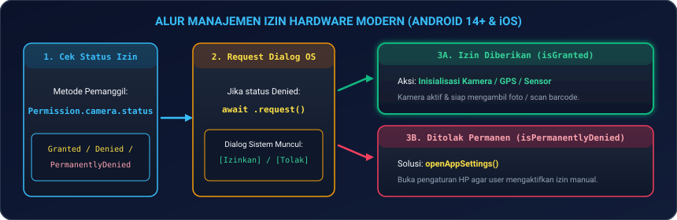
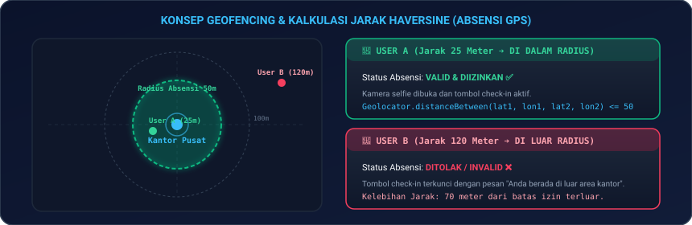
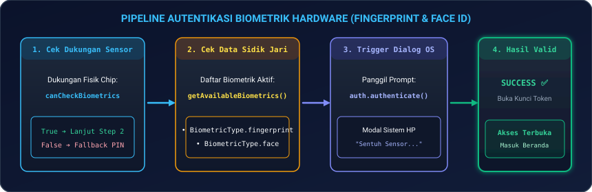
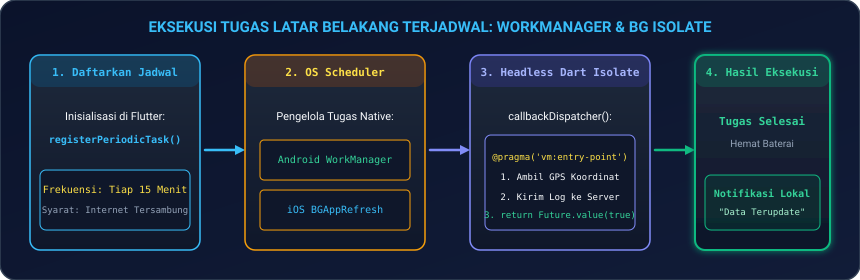

# Modul 08: Integrasi Fitur Hardware, Sensor, GPS Maps, & Background Tasks

Selamat datang di **Modul 08**! Aplikasi mobile yang luar biasa tidak hanya menampilkan teks dan gambar, melainkan mampu berinteraksi langsung dengan dunia fisik di sekitarnya. 

Di modul ini, Anda akan menguasai cara mengendalikan seluruh sensor dan perangkat keras smartphone: mulai dari sistem perizinan modern (**Android 14+ & iOS Permissions**), mengambil foto dan memindai barcode (**`camera` & `mobile_scanner`**), pelacakan posisi GPS, peta interaktif, dan perimeter area (**`geolocator`, `flutter_map`, & Geofencing**), pengenalan gerakan goyangan (**`sensors_plus`**), keamanan biometrik sidik jari & wajah (**`local_auth`**), hingga eksekusi tugas berkala di latar belakang saat aplikasi ditutup (**`workmanager` & `flutter_local_notifications`**).

---

## 📱 1. Analogi: Panca Indera & Organ Tubuh Smartphone

Untuk memahami bagaimana Flutter berkomunikasi dengan sensor perangkat:

| Sensor / Fitur | Analogi Manusia | Penjelasan Teknis di Flutter |
|---|---|---|
| **Kamera & Scanner** | **Mata Penglihatan** | Menangkap frame visual dunia nyata, mengambil foto selfie kehadiran, dan memindai kode QR/Barcode secara instan. |
| **GPS & Geolocator** | **Sistem Navigasi & Posisi Tubuh** | Mengetahui koordinat garis lintang dan bujur (*Latitude/Longitude*) serta menghitung jarak ke titik tujuan (*Geofencing*). |
| **Biometrik (`local_auth`)** | **Pemeriksaan Sidik Jari & Iris Mata** | Memverifikasi identitas pemilik perangkat menggunakan chip keamanan biometrik hardware HP sebelum transaksi penting. |
| **Accelerometer & Gyroscope** | **Keseimbangan Telinga Dalam** | Mendeteksi kemiringan sudut HP, orientasi layar, langkah kaki, hingga guncangan fisik (*Shake Detector*). |
| **WorkManager (Background)** | **Detak Jantung & Sistem Pernapasan** | Menjalankan sinkronisasi data atau pencatatan lokasi di latar belakang secara otomatis bahkan saat aplikasi sedang ditutup oleh pengguna. |

---

## 🛡️ 2. Manajemen Izin Perangkat Modern (Permissions Android 14+ & iOS)

Sistem operasi modern (Android 14+ dan iOS 17+) menerapkan pembatasan privasi yang sangat ketat. Anda tidak boleh langsung menyalakan kamera atau GPS tanpa meminta izin (*Runtime Permission*) terlebih dahulu.

<p align="center">
  
</p>

### 2.1 Alur Pengecekan Izin dengan `permission_handler`

```dart
import 'package:permission_handler/permission_handler.dart';

class HardwarePermissionHelper {
  static Future<bool> requestCameraPermission() async {
    final status = await Permission.camera.status;

    if (status.isGranted) return true;

    if (status.isDenied) {
      final result = await Permission.camera.request();
      return result.isGranted;
    }

    if (status.isPermanentlyDenied) {
      await openAppSettings();
      return false;
    }

    return false;
  }
}
```

---

## 📸 3. Kamera & Pemindaian Barcode/QR Berkecepatan Tinggi

### 3.1 Kontrol Kamera Tingkat Lanjut (`camera` package)

```dart
import 'package:camera/camera.dart';
import 'package:flutter/material.dart';

class CustomCameraViewfinder extends StatefulWidget {
  final List<CameraDescription> cameras;
  const CustomCameraViewfinder({super.key, required this.cameras});

  @override
  State<CustomCameraViewfinder> createState() => _CustomCameraViewfinderState();
}

class _CustomCameraViewfinderState extends State<CustomCameraViewfinder> {
  late CameraController _controller;
  int _selectedCameraIndex = 0;

  @override
  void initState() {
    super.initState();
    _initCamera(_selectedCameraIndex);
  }

  void _initCamera(int index) {
    _controller = CameraController(
      widget.cameras[index],
      ResolutionPreset.high,
      enableAudio: false,
    );
    _controller.initialize().then((_) {
      if (mounted) setState(() {});
    });
  }

  Future<XFile?> takePhoto() async {
    if (!_controller.value.isInitialized) return null;
    await _controller.setFlashMode(FlashMode.auto);
    return await _controller.takePicture();
  }

  @override
  void dispose() {
    _controller.dispose();
    super.dispose();
  }

  @override
  Widget build(BuildContext context) {
    if (!_controller.value.isInitialized) return const Center(child: CircularProgressIndicator());
    return CameraPreview(_controller);
  }
}
```

---

### 3.2 Pemindaian Barcode / QR Realtime dengan `mobile_scanner`

```dart
import 'package:flutter/material.dart';
import 'package:mobile_scanner/mobile_scanner.dart';

class QRScannerView extends StatelessWidget {
  const QRScannerView({super.key});

  @override
  Widget build(BuildContext context) {
    return Scaffold(
      appBar: AppBar(title: const Text('Scan QR Code Kehadiran')),
      body: MobileScanner(
        controller: MobileScannerController(
          detectionSpeed: DetectionSpeed.noDuplicates,
          facing: CameraFacing.back,
        ),
        onDetect: (capture) {
          final List<Barcode> barcodes = capture.barcodes;
          for (final barcode in barcodes) {
            final String? codeValue = barcode.rawValue;
            if (codeValue != null) {
              Navigator.pop(context, codeValue);
              break;
            }
          }
        },
      ),
    );
  }
}
```

---

## 📍 4. Lokasi GPS, Geolocation, & Radius Geofencing

Geofencing adalah teknik mendeteksi apakah posisi koordinat GPS pengguna berada di dalam batas radius area tertentu (misal: radius 50 meter dari kantor pusat).

<p align="center">
  
</p>

### 4.1 Mendapatkan Koordinat GPS & Validasi Radius Geofencing

```dart
import 'package:geolocator/geolocator.dart';

class GeofenceService {
  static const double targetLatitude = -6.175392;
  static const double targetLongitude = 106.827153;
  static const double allowedRadiusMeters = 50.0;

  static Future<Position> getCurrentLocation() async {
    bool serviceEnabled = await Geolocator.isLocationServiceEnabled();
    if (!serviceEnabled) throw Exception('Layanan GPS di HP dinonaktifkan.');

    LocationPermission permission = await Geolocator.checkPermission();
    if (permission == LocationPermission.denied) {
      permission = await Geolocator.requestPermission();
      if (permission == LocationPermission.denied) {
        throw Exception('Izin lokasi ditolak oleh pengguna.');
      }
    }

    return await Geolocator.getCurrentPosition(desiredAccuracy: LocationAccuracy.high);
  }

  static bool isInOfficeArea(Position userPosition) {
    final double distanceInMeters = Geolocator.distanceBetween(
      userPosition.latitude,
      userPosition.longitude,
      targetLatitude,
      targetLongitude,
    );

    return distanceInMeters <= allowedRadiusMeters;
  }
}
```

---

### 4.2 Menampilkan Peta Interaktif & Radius Geofence (`flutter_map`)

```dart
import 'package:flutter/material.dart';
import 'package:flutter_map/flutter_map.dart';
import 'package:latlong2/latlong.dart';

Widget buildGeofenceMap(LatLng userPos, LatLng officePos) {
  return FlutterMap(
    options: MapOptions(initialCenter: officePos, initialZoom: 17.0),
    children: [
      TileLayer(
        urlTemplate: 'https://tile.openstreetmap.org/{z}/{x}/{y}.png',
      ),
      // Lingkaran Radius Izin Geofence 50m
      CircleLayer(
        circles: [
          CircleMarker(
            point: officePos,
            radius: 50,
            useRadiusInMeter: true,
            color: Colors.green.withOpacity(0.2),
            borderColor: Colors.green,
            borderStrokeWidth: 2,
          ),
        ],
      ),
      // Marker Posisi Karyawan & Kantor
      MarkerLayer(
        markers: [
          Marker(point: officePos, child: const Icon(Icons.business, color: Colors.blue, size: 36)),
          Marker(point: userPos, child: const Icon(Icons.person_pin_circle, color: Colors.red, size: 36)),
        ],
      ),
    ],
  );
}
```

---

## 🔐 5. Sensor Perangkat & Keamanan Biometrik (`local_auth`)

<p align="center">
  
</p>

### 5.1 Implementasi Autentikasi Sidik Jari / Face ID

```dart
import 'package:local_auth/local_auth.dart';

class BiometricSecurityService {
  static final LocalAuthentication _auth = LocalAuthentication();

  static Future<bool> authenticateUser() async {
    final bool canAuthenticate = await _auth.canCheckBiometrics || await _auth.isDeviceSupported();
    if (!canAuthenticate) return false;

    try {
      return await _auth.authenticate(
        localizedReason: 'Pindai sidik jari atau Face ID untuk verifikasi kehadiran',
        options: const AuthenticationOptions(
          biometricOnly: true,
          stickyAuth: true,
        ),
      );
    } catch (e) {
      print('Error autentikasi: $e');
      return false;
    }
  }
}
```

---

### 5.2 Sensor Guncangan (*Shake Detector*) dengan `sensors_plus`

```dart
import 'dart:math';
import 'package:sensors_plus/sensors_plus.dart';

void listenToDeviceShake(Function onShake) {
  accelerometerEvents.listen((AccelerometerEvent event) {
    final gForce = sqrt(event.x * event.x + event.y * event.y + event.z * event.z);
    if (gForce > 22.0) {
      print('📳 [Sensor]: Perangkat diguncang!');
      onShake();
    }
  });
}
```

---

## ⏱️ 6. Eksekusi Latar Belakang & Notifikasi Terjadwal

<p align="center">
  
</p>

### 6.1 Implementasi `workmanager` & `flutter_local_notifications`

```dart
import 'package:flutter_local_notifications/flutter_local_notifications.dart';
import 'package:workmanager/workmanager.dart';

const String syncLocationTask = "syncLocationTaskKey";

@pragma('vm:entry-point')
void callbackDispatcher() {
  Workmanager().executeTask((taskName, inputData) async {
    switch (taskName) {
      case syncLocationTask:
        print('⏰ [WorkManager Isolate]: Menjalankan sinkronisasi background...');
        break;
    }
    return Future.value(true);
  });
}

// Notifikasi Pop-up Lokal
Future<void> showLocalNotification(String title, String body) async {
  final flutterLocalNotificationsPlugin = FlutterLocalNotificationsPlugin();
  const androidDetails = AndroidNotificationDetails('channel_id', 'Presensi', importance: Importance.high);
  const details = NotificationDetails(android: androidDetails);
  await flutterLocalNotificationsPlugin.show(0, title, body, details);
}
```

---

## 💻 7. Hands-on Super Project: Smart Field Attendance & Geofencing App

Mari kita bangun aplikasi nyata: **Smart Attendance App 2026** yang memadukan **GPS Geofencing (Radius Kantor 50m)**, **Keamanan Biometrik Sidik Jari**, dan **Kamera Selfie Kehadiran**:

1. **Buat file baru** `lib/smart_attendance_page.dart` di proyek Flutter Anda.
2. **Salin kode lengkap berikut**:

```dart
import 'package:flutter/material.dart';

void main() {
  runApp(const SmartAttendanceApp());
}

class SmartAttendanceApp extends StatelessWidget {
  const SmartAttendanceApp({super.key});

  @override
  Widget build(BuildContext context) {
    return MaterialApp(
      debugShowCheckedModeBanner: false,
      theme: ThemeData(
        useMaterial3: true,
        colorSchemeSeed: Colors.indigo,
      ),
      home: const SmartAttendancePage(),
    );
  }
}

class SmartAttendancePage extends StatefulWidget {
  const SmartAttendancePage({super.key});

  @override
  State<SmartAttendancePage> createState() => _SmartAttendancePageState();
}

class _SmartAttendancePageState extends State<SmartAttendancePage> {
  double _distanceToOffice = 24.5; // Meter
  bool _isInsideRadius = true;
  bool _isBiometricVerified = false;
  bool _isPhotoCaptured = false;
  bool _isSubmitting = false;

  void _simulasiUbahLokasi() {
    setState(() {
      if (_distanceToOffice < 50) {
        _distanceToOffice = 125.0;
        _isInsideRadius = false;
      } else {
        _distanceToOffice = 18.0;
        _isInsideRadius = true;
      }
    });
  }

  void _verifikasiBiometrik() async {
    showDialog(
      context: context,
      barrierDismissible: false,
      builder: (ctx) => AlertDialog(
        title: const Row(
          children: [
            Icon(Icons.fingerprint, color: Colors.indigo, size: 28),
            SizedBox(width: 8),
            Text('Verifikasi Biometrik'),
          ],
        ),
        content: const Text('Sentuh sensor sidik jari atau gunakan Face ID untuk validasi identitas.'),
        actions: [
          TextButton(onPressed: () => Navigator.pop(ctx), child: const Text('Batal')),
          ElevatedButton(
            onPressed: () {
              Navigator.pop(ctx);
              setState(() => _isBiometricVerified = true);
              ScaffoldMessenger.of(context).showSnackBar(
                const SnackBar(content: Text('✅ Biometrik Terverifikasi!'), backgroundColor: Colors.green),
              );
            },
            child: const Text('Simulasi Scan Sukses'),
          ),
        ],
      ),
    );
  }

  void _ambilFotoSelfie() {
    setState(() => _isPhotoCaptured = true);
    ScaffoldMessenger.of(context).showSnackBar(
      const SnackBar(content: Text('📸 Foto Selfie Kehadiran Berhasil Disimpan!'), backgroundColor: Colors.indigo),
    );
  }

  void _kirimPresensi() async {
    setState(() => _isSubmitting = true);
    await Future.delayed(const Duration(seconds: 2));

    setState(() {
      _isSubmitting = false;
      _isBiometricVerified = false;
      _isPhotoCaptured = false;
    });

    if (mounted) {
      showDialog(
        context: context,
        builder: (ctx) => AlertDialog(
          icon: const Icon(Icons.check_circle, color: Colors.green, size: 60),
          title: const Text('Presensi Berhasil Masuk!'),
          content: Text('Waktu: ${DateTime.now().hour}:${DateTime.now().minute.toString().padLeft(2, '0')} WIB\nJarak: ${_distanceToOffice.toStringAsFixed(1)} meter dari kantor.'),
          actions: [
            ElevatedButton(onPressed: () => Navigator.pop(ctx), child: const Text('OK')),
          ],
        ),
      );
    }
  }

  @override
  Widget build(BuildContext context) {
    final bool canSubmit = _isInsideRadius && _isBiometricVerified && _isPhotoCaptured && !_isSubmitting;

    return Scaffold(
      appBar: AppBar(
        title: const Text('Absensi GPS & Hardware 2026', style: TextStyle(fontWeight: FontWeight.bold)),
        backgroundColor: Theme.of(context).colorScheme.inversePrimary,
        actions: [
          IconButton(
            tooltip: 'Simulasi Perubahan Lokasi GPS',
            icon: const Icon(Icons.alt_route),
            onPressed: _simulasiUbahLokasi,
          ),
        ],
      ),
      body: SingleChildScrollView(
        padding: const EdgeInsets.all(20),
        child: Column(
          crossAxisAlignment: CrossAxisAlignment.stretch,
          children: [
            // Radar Status Geofencing Card
            Card(
              elevation: 3,
              shape: RoundedRectangleBorder(borderRadius: BorderRadius.circular(16)),
              color: _isInsideRadius ? Colors.teal.shade50 : Colors.red.shade50,
              child: Padding(
                padding: const EdgeInsets.all(20.0),
                child: Column(
                  children: [
                    Icon(
                      _isInsideRadius ? Icons.location_on : Icons.location_off,
                      size: 48,
                      color: _isInsideRadius ? Colors.teal : Colors.red,
                    ),
                    const SizedBox(height: 10),
                    Text(
                      _isInsideRadius ? 'Di Dalam Radius Kantor' : 'Di Luar Area Izin Absensi',
                      style: TextStyle(fontSize: 18, fontWeight: FontWeight.bold, color: _isInsideRadius ? Colors.teal.shade900 : Colors.red.shade900),
                    ),
                    const SizedBox(height: 4),
                    Text(
                      'Jarak Saat Ini: ${_distanceToOffice.toStringAsFixed(1)} Meter (Maks 50m)',
                      style: TextStyle(fontSize: 13, color: Colors.grey.shade700),
                    ),
                  ],
                ),
              ),
            ),
            const SizedBox(height: 20),

            // Step 1: Biometrik
            Card(
              child: ListTile(
                leading: CircleAvatar(
                  backgroundColor: _isBiometricVerified ? Colors.green : Colors.grey.shade300,
                  child: Icon(Icons.fingerprint, color: _isBiometricVerified ? Colors.white : Colors.black87),
                ),
                title: const Text('1. Verifikasi Biometrik', style: TextStyle(fontWeight: FontWeight.bold)),
                subtitle: Text(_isBiometricVerified ? 'Identitas Terverifikasi ✅' : 'Wajib scan sidik jari/Face ID'),
                trailing: ElevatedButton(
                  onPressed: _isBiometricVerified ? null : _verifikasiBiometrik,
                  child: const Text('Scan'),
                ),
              ),
            ),
            const SizedBox(height: 12),

            // Step 2: Kamera Selfie
            Card(
              child: ListTile(
                leading: CircleAvatar(
                  backgroundColor: _isPhotoCaptured ? Colors.green : Colors.grey.shade300,
                  child: Icon(Icons.camera_alt, color: _isPhotoCaptured ? Colors.white : Colors.black87),
                ),
                title: const Text('2. Foto Selfie Kehadiran', style: TextStyle(fontWeight: FontWeight.bold)),
                subtitle: Text(_isPhotoCaptured ? 'Foto Tersimpan 📸' : 'Ambil foto selfie di lokasi'),
                trailing: ElevatedButton(
                  onPressed: _isPhotoCaptured ? null : _ambilFotoSelfie,
                  child: const Text('Foto'),
                ),
              ),
            ),
            const SizedBox(height: 32),

            // Submit Button
            ElevatedButton.icon(
              onPressed: canSubmit ? _kirimPresensi : null,
              icon: _isSubmitting
                  ? const SizedBox(width: 18, height: 18, child: CircularProgressIndicator(strokeWidth: 2, color: Colors.white))
                  : const Icon(Icons.send),
              label: Text(_isSubmitting ? 'Memproses Presensi...' : 'Kirim Presensi Sekarang', style: const TextStyle(fontSize: 16, fontWeight: FontWeight.bold)),
              style: ElevatedButton.styleFrom(
                padding: const EdgeInsets.symmetric(vertical: 16),
                backgroundColor: Theme.of(context).colorScheme.primary,
                foregroundColor: Colors.white,
              ),
            ),
          ],
        ),
      ),
    );
  }
}
```

3. **Jalankan Aplikasi**:
   ```bash
   flutter run
   ```
   *Coba tekan tombol rute di AppBar untuk menguji simulasi berada di dalam vs di luar radius 50m kantor!*

---

## ⚠️ 8. Jebakan Umum (*Common Pitfalls*) & Solusi Kilat

| Kesalahan Umum | Gejala Error | Solusi yang Benar |
|---|---|---|
| **1. Lupa Deskripsi Izin di iOS `Info.plist`** | Crash seketika saat buka kamera / GPS di iPhone (`NSCameraUsageDescription`). | Wajib tambahkan string penjelasan pengguna di file `ios/Runner/Info.plist`. |
| **2. GPS Timeout di Dalam Gedung** | `TimeoutException: Location request timed out`. | Gunakan `LocationAccuracy.medium` atau fallback ke Cell Tower / Wi-Fi triangulation jika sinyal satelit terhalang beton. |
| **3. Memory Leak pada Camera Controller** | Aplikasi crash karena kehabisan RAM (*OOM*) setelah buka-tutup kamera beberapa kali. | Selalu panggil `cameraController.dispose()` pada lifecycle method `dispose()`. |
| **4. WorkManager Dibunuh Penghemat Baterai** | Tugas background tidak pernah berjalan di HP Xiaomi / Samsung / Oppo. | Beri tahu pengguna untuk mematikan mode *Battery Optimization* untuk aplikasi Anda di pengaturan HP. |
| **5. Tidak Cek `canCheckBiometrics`** | App crash `PlatformException: NotAvailable` pada ponsel lama tanpa sensor sidik jari. | Selalu periksa `await auth.canCheckBiometrics` dan sediakan opsi fallback PIN/Password. |

---

## 📝 9. Kuis Pemahaman Modul 08

1. **Mengapa pada Android 14+ kita tidak boleh lagi meminta izin `READ_EXTERNAL_STORAGE` secara umum?**  
   *Jawaban:* Karena Android 14+ menerapkan sistem perizinan terperinci (*Granular Media Permissions*) seperti `READ_MEDIA_IMAGES` dan `READ_MEDIA_VIDEO` serta pemilih foto bawaan (*Photo Picker*) yang tidak memerlukan izin akses ke seluruh berkas penyimpanan HP.
2. **Bagaimana cara kerja perhitungan jarak Geofencing pada Geolocator?**  
   *Jawaban:* Menggunakan rumus matematika *Haversine* (`Geolocator.distanceBetween(lat1, lon1, lat2, lon2)`) yang menghitung jarak lingkaran besar terpendek antara dua koordinat bola bumi dalam satuan meter.
3. **Mengapa fungsi `callbackDispatcher` pada `workmanager` wajib diberi anotasi `@pragma('vm:entry-point')`?**  
   *Jawaban:* Anotasi tersebut memberi tahu kompilator Dart Ahead-Of-Time (AOT) agar tidak menghapus fungsi tersebut (*tree shaking*), sehingga OS native dapat memanggilnya secara mandiri saat aplikasi sedang dalam keadaan tertutup.

---

## 🎯 Rangkuman & Checklist Kompetensi

- [x] Menguasai sistem izin runtime perangkat modern (`permission_handler`) di Android 14+ dan iOS.
- [x] Mengontrol controller kamera kustom (`camera`) dan kompresi gambar dengan `image_picker`.
- [x] Mengimplementasikan pemindai barcode / QR code realtime berkinerja tinggi dengan `mobile_scanner`.
- [x] Menguasai pelacakan GPS, akurasi lokasi, dan kalkulasi jarak Geofencing dengan `geolocator`.
- [x] Merender peta interaktif dan boundary radius Geofencing dengan `flutter_map`.
- [x] Menerapkan keamanan autentikasi biometrik (Fingerprint & Face ID) dengan `local_auth`.
- [x] Memahami deteksi guncangan fisik perangkat (*Shake Detector*) via sensor accelerometer.
- [x] Mengonfigurasi penjadwalan tugas latar belakang berkala (`workmanager`) dan notifikasi lokal.
- [x] Berhasil membangun proyek mini Smart Field Attendance & Geofencing App.

---

👉 **Langkah Selanjutnya**: Akses hardware dan sensor smartphone Anda sudah sekelas profesional! Mari melangkah ke **[Modul 09: Native Platform Channels (Kotlin/Swift) & Dart FFI](../modul-09-platform-channels-dan-ffi/README.md)** untuk menjembatani kode Flutter dengan SDK Native dan bahasa C/C++ berperforma tinggi.
