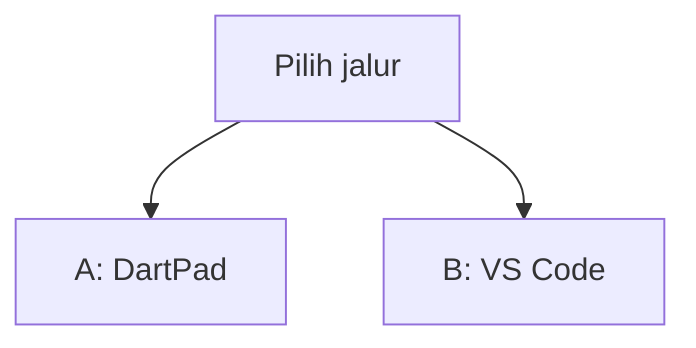
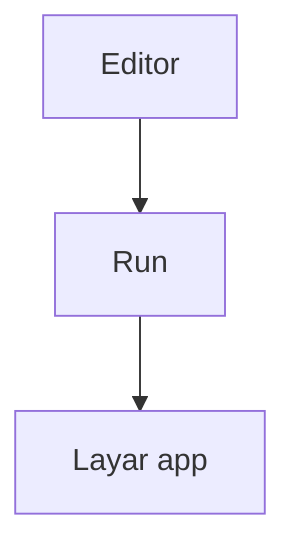
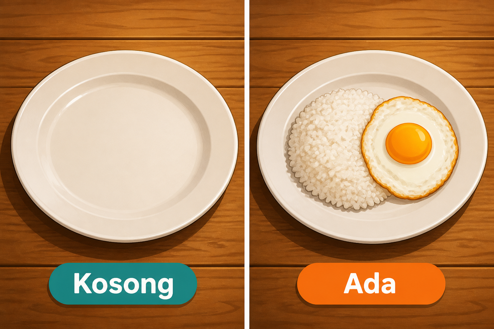
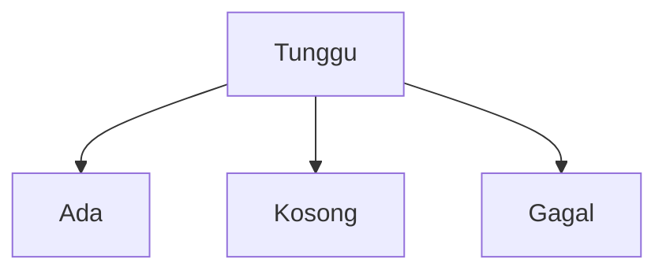
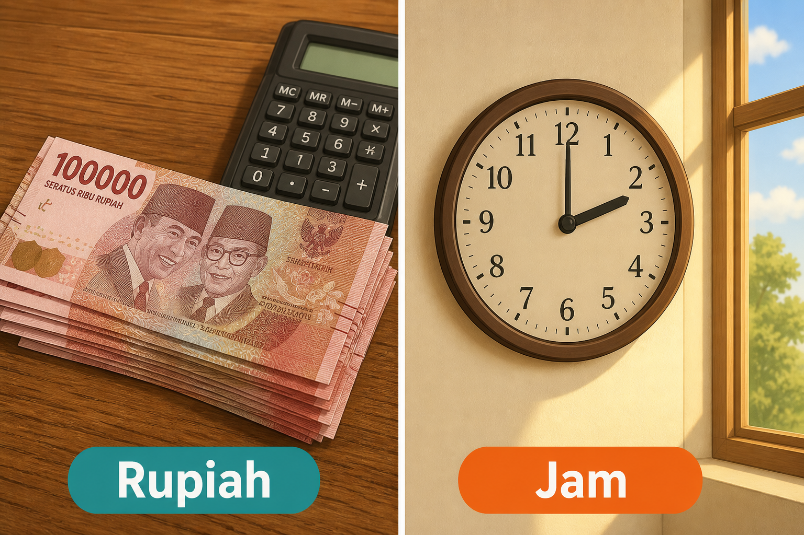
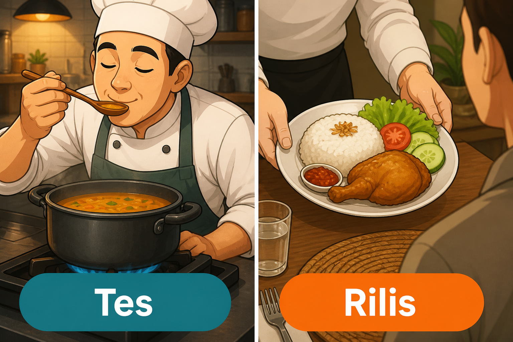
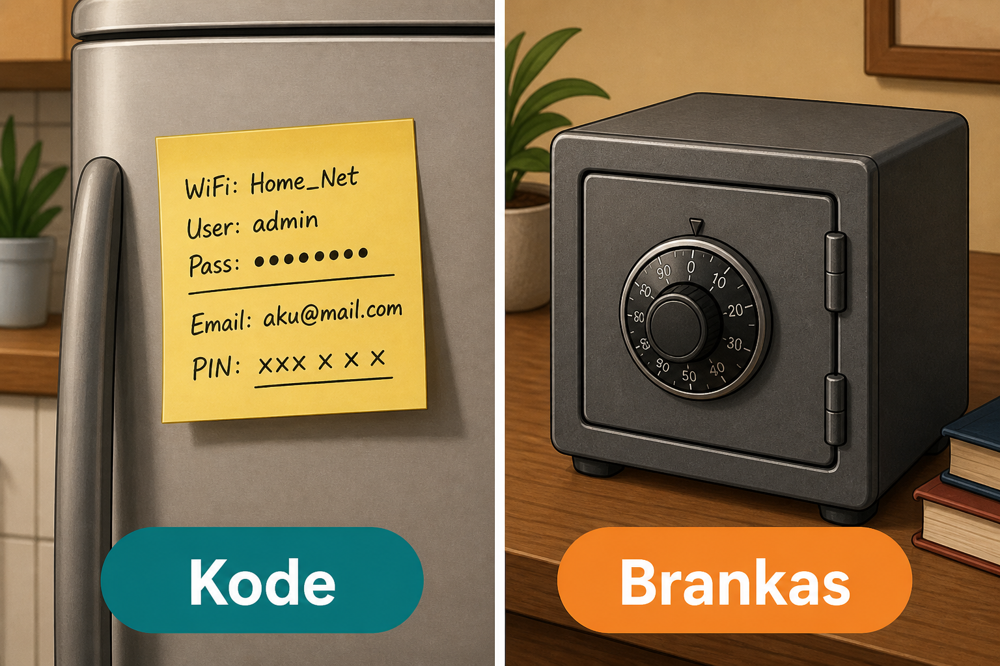

# Modul 09 — Kualitas: biar tidak cuma “jalan di HP saya”

**Waktu:** 2–3 sesi  
**Prasyarat:** Modul 00–08 (pernah `flutter run`, pernah format harga atau daftar dari API/Firebase).  
**Hasil:** Nanti Anda bisa menata layar saat data masih datang, saat daftar kosong, dan saat gagal; menulis harga dalam Rupiah dan jam lokal; merapikan kode; menulis tes yang penting; dan menjaga rahasia plus data orang.

Modul 08: orang sungguhan masuk. Modul ini: app terasa **siap dipakai orang lain**, bukan hanya demo di emulator Anda.

---

## Buka alat ini dulu

Ada **dua jalur uji**. Jangan sampai tertukar.

Paket [`intl`](https://pub.dev/packages/intl) **ada** di [daftar paket DartPad](https://github.com/dart-lang/dart-pad/wiki/Package-and-plugin-support). Jadi format Rupiah boleh di jalur A. `flutter_test`, `dart format`, dan `flutter analyze` **tidak** jalan di DartPad.

| Jalur | Buka | Untuk apa |
| --- | --- | --- |
| A | Browser → [dartpad.dev](https://dartpad.dev) → mode **Flutter** | Tunggu / kosong / ada / gagal, harga Rupiah, lebar layar |
| B | VS Code + Terminal (`Ctrl + J`) + emulator/HP | `dart format`, `flutter analyze`, `flutter test`, mode rilis |



Letak tombol di DartPad (bukan sketsa):




Sumber gambar: [dart.dev/tools/dartpad](https://dart.dev/tools/dartpad), Dart team / Google ([CC BY 4.0](https://creativecommons.org/licenses/by/4.0/)). Foto resmi itu **tema gelap** dan **mode Dart**. Kalau kelihatan seperti kotak hitam, gulir sampai editor kiri dan tombol **Run** terlihat; itu bukan gambar rusak. Untuk uji widget di modul ini, di pojok DartPad pilih mode **Flutter**. Tes otomatis **tidak** diuji di sini.

### Dua jenis kode di halaman ini

| Jenis | Tanda | Caranya |
| --- | --- | --- |
| **Berkas lengkap** | Ada `void main()` (plus `import` kalau pakai paket) | Tempel utuh, lalu **Run** (alat yang disebut di kotak uji) |
| **Cuplikan** | Hanya potongan | Jangan di-Run sendirian |

### Pola uji A — DartPad Flutter

| | |
| --- | --- |
| **Buka** | [dartpad.dev](https://dartpad.dev) |
| **Pilih** | mode **Flutter** |
| **Tempel** | **berkas lengkap** |
| **Klik** | **Run** |
| **Kalau berhasil** | panel kanan menampilkan tombol atau teks, bukan error merah |

### Pola uji B — proyek lokal

| | |
| --- | --- |
| **Buka** | VS Code di folder proyek Flutter, emulator atau HP sudah menyala |
| **Terminal** | `Ctrl + J` |
| **Ketik** | perintah di bagian 6 (format/lint) atau bagian 7 (tes), di folder proyek |
| **Kalau berhasil** | terminal menulis `All tests passed!` atau `No issues found!` |

> **Aturan emas:** perintah `flutter ...` dan `dart format` hanya di **Terminal VS Code**. DartPad tidak menjalankan `flutter test`.

Praktik di materi ini: **Windows → Android**. Membangun iOS butuh Mac.

---

## 1. Empat wajah layar: tunggu, kosong, ada, gagal

App yang “hanya jalan saat datanya lengkap” terasa rusak di HP orang. Jaringan lambat. Daftar baru. Server sedang down.

Empat wajah yang sama pentingnya:

| Wajah | Orang melihat | Jangan |
| --- | --- | --- |
| **Tunggu** | indikator, atau kerangka abu-abu | layar putih diam |
| **Kosong** | kalimat + tombol “Tambah” / “Muat ulang” | `ListView` tanpa isi, tanpa keterangan |
| **Ada** | daftar atau kartu | — |
| **Gagal** | apa yang salah + tombol coba lagi | `Exception: ...` mentah |



*Ilustrasi asli materi mobile2026. Kosong = piring tanpa isi. Ada = piring sudah diisi. Tunggu dan gagal dijelaskan di tabel, bukan di gambar.*



Sentuhan: jari orang dewasa kira-kira **48** piksel logis. Di Material itu konstanta [`kMinInteractiveDimension`](https://api.flutter.dev/flutter/material/kMinInteractiveDimension-constant.html). Tombol kecil di pojok mudah kelewat. Ruang kosong di sekitar ikon lebih penting daripada ikon itu sendiri.

---

## 2. HP kecil vs tablet, tanpa drama

Jangan buat “desain 12 breakpoint”. Cukup tanya: lebar ini masih satu kolom, atau sudah muat dua?

Cuplikan (jangan di-Run sendirian di DartPad — `DaftarMenu` / `DetailMenu` harus sudah ada):

```dart
LayoutBuilder(
  builder: (context, box) {
    final duaKolom = box.maxWidth >= 600;
    if (duaKolom) {
      return const Row(
        children: [
          Expanded(child: DaftarMenu()),
          Expanded(child: DetailMenu()),
        ],
      );
    }
    return const DaftarMenu();
  },
)
```

`600` bukan angka suci. Itu ambang yang sering dipakai supaya HP tetap satu kolom, tablet mulai berbagi layar. `MediaQuery.sizeOf(context).width` juga boleh. Yang penting: uji di emulator HP **dan** jendela yang dilebarkan.

Jangan menyalin seluruh layout web. Tablet = ruang lebih, bukan situs desktop yang dipaksa.

---

## 3. Kerangka, tarik turun, halaman berikutnya

**Kerangka (skeleton):** kotak abu-abu seukuran teks/gambar, sementara data belum datang. Lebih tenang daripada spinner di tengah yang tidak bilang “seberapa banyak yang akan muncul”.

Cuplikan kerangka (jangan di-Run sendirian):

```dart
Container(
  height: 16,
  margin: const EdgeInsets.symmetric(vertical: 8),
  color: Colors.black12,
)
```

**Tarik turun:** [`RefreshIndicator`](https://api.flutter.dev/flutter/material/RefreshIndicator-class.html) membungkus `ListView`. Orang menarik daftar → `onRefresh` dipanggil → `await` selesai → indikator hilang.

Cuplikan (jalur B — butuh `provider` + daftar `menu`; **jangan** di-Run sendirian di DartPad):

```dart
RefreshIndicator(
  onRefresh: () => context.read<Menu>().muatUlang(),
  child: ListView.builder(
    itemCount: menu.length,
    itemBuilder: (context, i) => ListTile(title: Text(menu[i].nama)),
  ),
)
```

**Halaman berikutnya:** jangan unduh 10.000 baris (Modul 07). Saat orang hampir di bawah daftar, minta halaman berikutnya. `ScrollController` + `offset` dekat `maxScrollExtent`. Tahan tombol “muat lagi” kalau masih `Tunggu`, supaya tidak dobel-request.

---

## 4. Rupiah dan jam lokal

Orang Indonesia membaca **Rp15.000**, bukan `15000.0`. Jam di HP biasanya **lokal**, bukan UTC.



*Ilustrasi asli materi mobile2026. Rupiah = angka yang dibaca manusia. Jam = waktu di zona orang yang memegang HP. Gambar uang hanya analogi, bukan uang yang diedarkan.*

Paket: [`intl`](https://pub.dev/packages/intl). Ada di DartPad.

Cuplikan fungsi (bukan berkas lengkap — sisipkan ke berkas yang sudah `import` intl dan `main()`):

```dart
String formatRupiah(num nilai) {
  return NumberFormat.currency(
    locale: 'id',
    symbol: 'Rp',
    decimalDigits: 0,
  ).format(nilai);
}
```

`decimalDigits: 0` = tanpa koma sen, cocok untuk harga warung. Kalau butuh sen, ganti jadi `2`.

Jam: simpan di dapur biasanya UTC. Tampilkan dengan `toLocal()`. Cuplikan (sisipkan ke berkas yang sudah `main()`):

```dart
final utc = DateTime.parse('2026-08-15T14:00:00Z');
final lokal = utc.toLocal(); // di WIB kira-kira jam 21:00
```

`DateFormat` untuk locale `id_ID` kadang perlu `initializeDateFormatting('id_ID')` dulu (jalur B). Tanpa itu, pola `yMMMd` bahasa Inggris masih kebaca, tapi nama bulan belum Indonesia.

Sumber: [NumberFormat.currency](https://pub.dev/documentation/intl/latest/intl/NumberFormat/NumberFormat.currency.html), [DateTime.toLocal](https://api.flutter.dev/flutter/dart-core/DateTime/toLocal.html). Jangan menghitung “tambah 7 jam” manual — zona bisa WIB/WITA/WIT, dan ada waktu musim panas di negara lain.

### Uji 1 — empat wajah + Rupiah di DartPad

| | |
| --- | --- |
| **Buka** | [dartpad.dev](https://dartpad.dev) |
| **Pilih** | mode **Flutter** |
| **Tempel** | berkas lengkap di bawah |
| **Klik** | **Run** |

```dart
import 'package:flutter/material.dart';
import 'package:intl/intl.dart';

String formatRupiah(num nilai) {
  return NumberFormat.currency(
    locale: 'id',
    symbol: 'Rp',
    decimalDigits: 0,
  ).format(nilai);
}

enum Wajah { tunggu, kosong, ada, gagal }

void main() {
  runApp(const MaterialApp(home: TokoLatihan()));
}

class TokoLatihan extends StatefulWidget {
  const TokoLatihan({super.key});

  @override
  State<TokoLatihan> createState() => _TokoLatihanState();
}

class _TokoLatihanState extends State<TokoLatihan> {
  Wajah wajah = Wajah.tunggu;
  final harga = 15000;

  @override
  Widget build(BuildContext context) {
    return Scaffold(
      appBar: AppBar(title: const Text('Menu hari ini')),
      body: Column(
        children: [
          Wrap(
            spacing: 8,
            children: [
              TextButton(
                onPressed: () => setState(() => wajah = Wajah.tunggu),
                child: const Text('Tunggu'),
              ),
              TextButton(
                onPressed: () => setState(() => wajah = Wajah.kosong),
                child: const Text('Kosong'),
              ),
              TextButton(
                onPressed: () => setState(() => wajah = Wajah.ada),
                child: const Text('Ada'),
              ),
              TextButton(
                onPressed: () => setState(() => wajah = Wajah.gagal),
                child: const Text('Gagal'),
              ),
            ],
          ),
          Expanded(child: _isi()),
        ],
      ),
    );
  }

  Widget _isi() {
    switch (wajah) {
      case Wajah.tunggu:
        return const Center(child: CircularProgressIndicator());
      case Wajah.kosong:
        return const Center(child: Text('Belum ada menu. Tambah dulu.'));
      case Wajah.gagal:
        return Center(
          child: Column(
            mainAxisSize: MainAxisSize.min,
            children: [
              const Text('Gagal memuat. Coba lagi.'),
              FilledButton(
                onPressed: () => setState(() => wajah = Wajah.tunggu),
                child: const Text('Coba lagi'),
              ),
            ],
          ),
        );
      case Wajah.ada:
        return ListTile(
          title: const Text('Nasi goreng'),
          trailing: Text(formatRupiah(harga)),
        );
    }
  }
}
```

**Kalau berhasil:** empat tombol mengganti wajah layar. Saat **Ada**, harga memakai `Rp` dan pemisah ribuan, bukan `15000`.

`intl` ada di DartPad. `flutter_test` tidak.

---

## 5. Log: baca yang merah dari atas

Saat app rusak, terminal atau DartPad menulis teks panjang. Jangan langsung kirim tangkapan layar tanpa teks.

Urutan baca:

1. Baris **pertama** yang menyebut file di `lib/` milik Anda — itu biasanya tempat mulai.
2. Pesan di atas stack (`Null check`, `setState() called after dispose`, …).
3. Plugin / framework di bawahnya — sering hanya “yang kena imbas”.

Cuplikan log yang aman (jalur B):

```dart
import 'package:flutter/foundation.dart';

void catatGagal(Object e, StackTrace s) {
  if (kDebugMode) {
    debugPrint('gagal: $e');
    debugPrint('$s');
  }
}
```

`debugPrint` memotong baris yang kepanjangan di Android. `print` token, sandi, atau isi `google-services.json` = jangan, bahkan di debug.

Di rilis, log debug biasanya dibuang. Jangan andalkan `print` untuk menyimpan jejak orang di produksi — itu lampiran Crashlytics (L4).

---

## 6. Rapikan: format, lint, nama

Kode yang rapi lebih mudah dibaca orang lain — termasuk Anda bulan depan.

| Perintah | Kegunaan |
| --- | --- |
| `dart format .` | spasi, baris, kurung — selera mesin, bukan selera chat |
| `flutter analyze` | peringatan lints + error tipe |
| `flutter test` | tes di folder `test/` |

| | |
| --- | --- |
| **Buka** | Terminal VS Code di folder proyek Flutter |
| **Ketik** | perintah di bawah, **satu per satu** |

```text
dart format .
flutter analyze
```

**Kalau berhasil:** `dart format` menulis `Formatted ... files` atau diam (sudah rapi). `flutter analyze` menulis `No issues found!` atau daftar peringatan yang bisa Anda perbaiki.

Nama, ringkas (Effective Dart):

- berkas: `menu_page.dart` (huruf kecil, garis bawah)
- kelas: `MenuPage`
- variabel / fungsi: `hargaSatuan`, `formatRupiah`

Sumber: [Effective Dart: style](https://dart.dev/effective-dart/style), [dart format](https://dart.dev/tools/dart-format), [flutter analyze](https://docs.flutter.dev/tools/cli#analyze). Proyek `flutter create` sudah memuat `flutter_lints`.

---

## 7. Tes: yang penting, bukan 100%



*Ilustrasi asli materi mobile2026. Tes = cicip di dapur. Rilis = dihidangkan ke orang. Jangan menyamakan “lulus di emulator saya” dengan “sudah dicicipi mesin.”*

Tiga lapis, dari cepat ke mahal:

| Jenis | Yang diuji | Alat |
| --- | --- | --- |
| **Unit** | fungsi murni: format Rupiah, hitung total | `test()` di `test/` |
| **Widget** | satu layar: tombol, teks, daftar kosong | `testWidgets()` |
| **Integrasi** | alur: buka app → tambah item | `integration_test` |

Jangan kejar tes di setiap baris kode. Yang menyelamatkan: format uang, gerbang login palsu, “daftar kosong menampilkan kalimat.”

`flutter_test` datang bersama SDK. **Tidak** ada di DartPad.

Cuplikan berkas tes (jalur B, **bukan** DartPad; `main()` di sini untuk `flutter test`):

```dart
import 'package:flutter_test/flutter_test.dart';
import 'package:intl/intl.dart';

String formatRupiah(num nilai) {
  return NumberFormat.currency(
    locale: 'id',
    symbol: 'Rp',
    decimalDigits: 0,
  ).format(nilai);
}

void main() {
  test('Rupiah memakai pemisah ribuan', () {
    final teks = formatRupiah(15000);
    expect(teks.startsWith('Rp'), isTrue);
    expect(teks.contains('15'), isTrue);
  });
}
```

Cuplikan widget (jalur B), pola cookbook resmi:

```dart
testWidgets('kalimat kosong muncul', (tester) async {
  await tester.pumpWidget(
    const MaterialApp(
      home: Scaffold(body: Text('Belum ada menu. Tambah dulu.')),
    ),
  );
  expect(find.text('Belum ada menu. Tambah dulu.'), findsOneWidget);
});
```

| | |
| --- | --- |
| **Buka** | Terminal VS Code di folder proyek Flutter |
| **Ketik** | perintah di bawah |

```text
flutter test
```

**Kalau berhasil:** `All tests passed!`

Sumber: [Introduction to unit testing](https://docs.flutter.dev/cookbook/testing/unit/introduction), [Introduction to widget testing](https://docs.flutter.dev/cookbook/testing/widget/introduction).

---

## 8. Repositori palsu: tes tanpa internet

UI tidak boleh “teriak” ke Firebase atau `dio` di dalam tes (Modul 04–07). Sediakan pintu:

```dart
abstract class Katalog {
  Future<List<String>> ambil();
}

class KatalogJaringan implements Katalog {
  // dio / Firestore — jalur sungguhan
  @override
  Future<List<String>> ambil() async => throw UnimplementedError();
}

class KatalogPalsu implements Katalog {
  KatalogPalsu(this.isi);
  final List<String> isi;

  @override
  Future<List<String>> ambil() async => isi;
}
```

Di tes: sisipkan `KatalogPalsu([])` untuk wajah **Kosong**, atau `KatalogPalsu(['Nasi'])` untuk **Ada**. Tidak perlu paket `mockito` dan `build_runner` di gelombang ini.

Kalau `ambil()` dilempar `Exception`, UI harus ke wajah **Gagal**, bukan layar merah.

---

## 9. Satu tes integrasi

Widget test memalsukan banyak hal. Tes integrasi menjalankan app lebih utuh (masih di mesin Anda).

Silabus cukup **satu** alur: misalnya tambah item, atau login palsu.

Cuplikan konsep (jalur B, folder `integration_test/app_test.dart`, **bukan** DartPad):

```dart
import 'package:flutter_test/flutter_test.dart';
import 'package:integration_test/integration_test.dart';

void main() {
  IntegrationTestWidgetsFlutterBinding.ensureInitialized();

  testWidgets('tombol tambah kelihatan', (tester) async {
    // runApp(const AplikasiSaya()); lalu:
    // await tester.pumpAndSettle();
    // expect(find.text('Tambah'), findsOneWidget);
  });
}
```

| | |
| --- | --- |
| **Buka** | Terminal VS Code di folder proyek |
| **Ketik** | perintah di bawah |

```text
flutter pub add dev:integration_test --sdk=flutter
```

**Kalau berhasil:** `dev_dependencies` memuat `integration_test`. Menjalankan berkasnya: `flutter test integration_test/app_test.dart` (emulator atau HP menyala).

Sumber: [Integration tests](https://docs.flutter.dev/testing/integration-tests). Mini proyek hari ini **wajib** unit atau widget test. Integrasi cukup dicoba sekali; jangan menghabiskan sesi hanya menyetel driver.

---

## 10. Debug bukan rilis

`flutter run` = **debug**: hot reload, assert hidup, app lebih gemuk dan kadang patah-patah.

Rilis = yang diunggah orang. Assert mati, log debug sering hilang, ukuran lebih kecil.

| Mode | Kapan | Perintah (jalur B) |
| --- | --- | --- |
| **Debug** | kerja harian | `flutter run` |
| **Profile** | ukur performa di **HP fisik** | `flutter run --profile` |
| **Rilis** | mendekati toko | `flutter run --release` |

Emulator **bukan** ukuran performa rilis. Sumber: [Flutter's build modes](https://docs.flutter.dev/testing/build-modes).

Cuplikan:

```dart
import 'package:flutter/foundation.dart';

if (kDebugMode) {
  debugPrint('hanya di debug');
}
```

`kDebugMode` konstan: di rilis, cabang itu dibuang mesin. Jangan taruh kunci API di dalam `if (kDebugMode)` lalu menyangka itu aman — kunci tetap ada di berkas sumber.

Play Store, ikon, keystore → **Modul 10**. Hari ini cukup tahu: “jalan di debug” ≠ “siap diunggah.”

---

## 11. Keamanan dasar, diulang karena mudah luput



*Ilustrasi asli materi mobile2026. Kode di kulkas = rahasia di berkas atau SharedPreferences. Brankas = `flutter_secure_storage`, rules, server.*

Yang sudah muncul di modul lalu, dikumpulkan:

- Token dan sandi: [`flutter_secure_storage`](https://pub.dev/packages/flutter_secure_storage), bukan SharedPreferences (Modul 05, 07, 08)
- HTTPS; HTTP polos hanya untuk latihan `localhost` (Modul 07)
- Rules Firebase / satpam server, bukan tombol tersembunyi (Modul 06, 08)
- `.gitignore`: `google-services.json`, `.env`, `*.jks`, `key.properties`
- Kunci API: `--dart-define` atau backend, bukan diketik telanjang di `lib/`

Jangan commit brankas yang kuncinya ikut ke GitHub. Modul 10 mengurus keystore secara khusus.

---

## 12. UU PDP: data orang bukan milik kita untuk disebar

Indonesia punya **Undang-Undang Nomor 27 Tahun 2022 tentang Pelindungan Data Pribadi**. Nama resminya *Pelindungan* (satu “l” di tengah, sesuai bunyi undang-undang).

Untuk app latihan, tiga sikap sudah mengubah cara kerja:

1. **Kumpulkan yang perlu.** Nama untuk login boleh. Foto KTP “karena nanti mungkin berguna” jangan.
2. **Jangan sebar.** Dump Firestore ke grup chat, unggah daftar email ke repo publik, atau `print` isi profil di toko = bukan “debugging,” itu data orang.
3. **Orang bisa minta hapus.** Play Store akan menagih ini di Modul 10. Dari sekarang, jangan rancang “data abadi tanpa tombol hapus akun.”

Ini bukan nasihat hukum dan bukan pengganti membaca undang-undang. Sumber resmi, silakan buka:

- [UU 27 Tahun 2022 — JDIH Kemenkeu](https://jdih.kemenkeu.go.id/dok/uu-27-tahun-2022)
- [JDIH Komdigi, UU 27/2022](https://jdih.komdigi.go.id/index.php/produk_hukum/view/id/832/t/undangundang+nomor+27+tahun+2022)

Kebijakan privasi bersurat URL, formulir Data safety, dan penghapusan akun → **Modul 10**.

---

## Mini proyek modul ini

Rapikan **satu app lama** (Komunitas mini Modul 08, daftar film Modul 07, atau catatan Modul 06). Jangan buat app baru dari nol.

Urutan kerja, jangan terbalik:

1. Buka **VS Code** di folder proyek yang sudah pernah `flutter run`.
2. Tambah paket format (kalau belum):

| | |
| --- | --- |
| **Buka** | Terminal VS Code di folder proyek |
| **Ketik** | perintah di bawah |

```text
flutter pub add intl
```

**Kalau berhasil:** `pubspec.yaml` memuat `intl`.

3. Satu tempat `formatRupiah` — jangan menyalin rumus di setiap `Text`.
4. Layar daftar: empat wajah (`Tunggu` / `Kosong` / `Ada` / `Gagal`). Kosong dan gagal punya kalimat manusia + tombol.
5. Harga atau angka uang memakai `formatRupiah`. Tanggal unggahan memakai `toLocal()`, bukan string UTC mentah.
6. `RefreshIndicator` di daftar (jalur B).
7. Berkas `test/format_rupiah_test.dart` (unit) **atau** tes widget kalimat kosong. Lalu:

| | |
| --- | --- |
| **Buka** | Terminal VS Code di folder proyek |
| **Ketik** | perintah di bawah, **satu per satu** |

```text
dart format .
flutter analyze
flutter test
```

**Kalau berhasil:** format selesai; analyze tanpa error yang Anda buat sendiri; `All tests passed!`

8. `flutter run`. Putuskan Wi-Fi emulator sebentar: layar **Gagal** atau banner offline (Modul 05), bukan layar merah.
9. (Bonus) Satu berkas `integration_test/` yang mencari teks **Tambah** atau **Masuk**.

**Kalau berhasil:** daftar kosong tidak bisu; harga kebaca sebagai Rupiah; tes unit atau widget hijau.

Jangan commit `.env` atau `google-services.json`.

---

## Kesalahan yang sering terjadi

| Gejala | Penyebab yang sering | Perbaikan |
| --- | --- | --- |
| `intl` error di DartPad | mode Dart, atau salah import | mode **Flutter**; `import 'package:intl/intl.dart'` |
| `flutter test` di DartPad | tes tidak ada di DartPad | Jalur B |
| Harga `IDR15000.00` | locale/simbol default | `locale: 'id'`, `symbol: 'Rp'`, `decimalDigits: 0` |
| Jam geser 7 jam | menampilkan UTC sebagai lokal | `toLocal()`; jangan `+7` manual |
| `No issues found` tapi kode berantakan | lupa `dart format` | `dart format .` |
| Tes hijau, app kosong di HP | tes memakai data palsu, UI belum cabang kosong | uji 1 di DartPad; sambungkan `KatalogPalsu` ke UI |
| `print` token di logcat rilis | log tidak dibungkus `kDebugMode` | `debugPrint` di dalam `if (kDebugMode)` |
| Tes 3% baris terasa gagal | target 100% tidak di silabus | tes yang penting dulu |

---

## Latihan

1. (DartPad) Di uji 1, ganti `CircularProgressIndicator` pada wajah Tunggu menjadi tiga kotak abu-abu (kerangka).
2. (Jalur B) `LayoutBuilder`: jika lebar ≥ 600, tampilkan harga di samping nama, bukan di `trailing` yang sempit.
3. (Jalur B) Tes unit: `formatRupiah(0)` tetap diawali `Rp`.
4. (Jalur B) `KatalogPalsu` yang melempar error → UI **Gagal**.
5. (Bonus) `flutter run --release` di HP fisik. Catat bedanya dengan debug (ukuran, kelancaran, ada-tidaknya banner debug).

---

## Kuis singkat

1. Perintah `flutter test` diketik di mana?
2. Daftar tanpa data sebaiknya menampilkan apa?
3. Kenapa `15000` diubah dengan `intl`, bukan digabung string `"Rp$harga"`?
4. Menyembunyikan tombol Admin cukup sebagai keamanan?
5. Data email pengguna boleh di-commit ke GitHub “supaya teman bisa tes”?

Kunci jawaban di bawah. Coba jawab dulu.

---

## Apa yang belum dibahas

- Ikon, keystore, Play Console, privacy policy URL, Data safety → **Modul 10**
- Coverage 100%, golden test, Patrol, Crashlytics
- Terjemahan UI lengkap (`flutter_localizations` + file ARB) — hari ini cukup Rupiah dan jam

---

## Kunci kuis

1. Terminal VS Code di folder proyek Flutter, bukan DartPad.
2. Kalimat manusia + aksi (tambah / muat ulang), bukan daftar bisu.
3. Pemisah ribuan dan koma mengikuti locale; string manual mudah salah di angka besar.
4. Tidak. Satpamnya rules / server (Modul 08).
5. Tidak. Itu data orang; UU PDP dan akal sehat menolak.

---

## Sumber gambar dan tautan

| Aset | Sumber |
| --- | --- |
| `images/analogi-kosong-ada.png` | Ilustrasi asli materi mobile2026 |
| `images/analogi-rupiah-jam.png` | Ilustrasi asli materi mobile2026 (bukan uang yang diedarkan) |
| `images/analogi-tes-rilis.png` | Ilustrasi asli materi mobile2026 |
| `images/analogi-kode-brankas.png` | Ilustrasi asli materi mobile2026 |
| Tampilan DartPad | [dart.dev/assets/img/dartpad-hello.png](https://dart.dev/assets/img/dartpad-hello.png) dari [dart.dev/tools/dartpad](https://dart.dev/tools/dartpad) ([CC BY 4.0](https://creativecommons.org/licenses/by/4.0/)) |
| Paket DartPad | [github.com/dart-lang/dart-pad/wiki/Package-and-plugin-support](https://github.com/dart-lang/dart-pad/wiki/Package-and-plugin-support) |
| `intl` / NumberFormat | [NumberFormat.currency](https://pub.dev/documentation/intl/latest/intl/NumberFormat/NumberFormat.currency.html) |
| `DateTime.toLocal` | [api.flutter.dev](https://api.flutter.dev/flutter/dart-core/DateTime/toLocal.html) |
| `kMinInteractiveDimension` | [api.flutter.dev](https://api.flutter.dev/flutter/material/kMinInteractiveDimension-constant.html) |
| `RefreshIndicator` | [api.flutter.dev](https://api.flutter.dev/flutter/material/RefreshIndicator-class.html) |
| Effective Dart | [dart.dev/effective-dart/style](https://dart.dev/effective-dart/style) |
| `dart format` | [dart.dev/tools/dart-format](https://dart.dev/tools/dart-format) |
| `flutter analyze` | [docs.flutter.dev/tools/cli](https://docs.flutter.dev/tools/cli#analyze) |
| Unit test | [cookbook unit](https://docs.flutter.dev/cookbook/testing/unit/introduction) |
| Widget test | [cookbook widget](https://docs.flutter.dev/cookbook/testing/widget/introduction) |
| Integration tests | [docs.flutter.dev/testing/integration-tests](https://docs.flutter.dev/testing/integration-tests) |
| Build modes | [docs.flutter.dev/testing/build-modes](https://docs.flutter.dev/testing/build-modes) |
| `kDebugMode` | [api.flutter.dev foundation](https://api.flutter.dev/flutter/foundation/kDebugMode-constant.html) |
| UU 27/2022 | [JDIH Kemenkeu](https://jdih.kemenkeu.go.id/dok/uu-27-tahun-2022), [JDIH Komdigi](https://jdih.komdigi.go.id/index.php/produk_hukum/view/id/832/t/undangundang+nomor+27+tahun+2022) |
| `flutter_secure_storage` | [pub.dev](https://pub.dev/packages/flutter_secure_storage) |

Flutter, Firebase, and Google and the related logos are trademarks of Google LLC. We are not endorsed by or affiliated with Google LLC.
