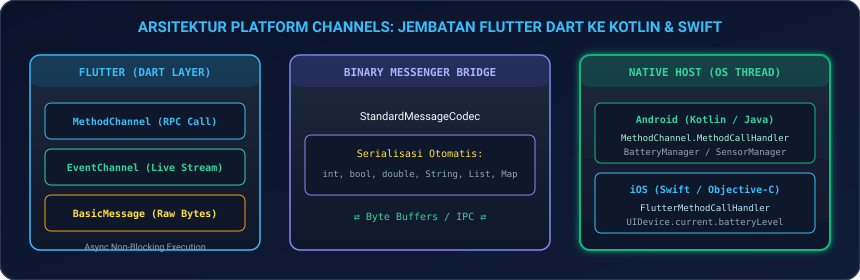
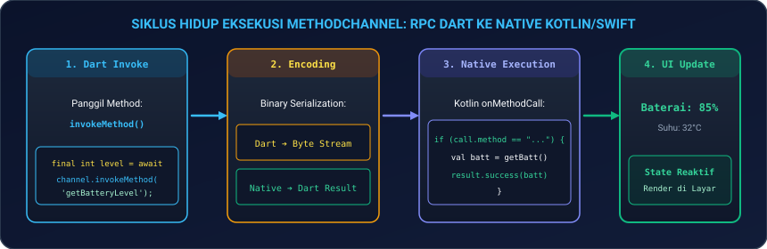
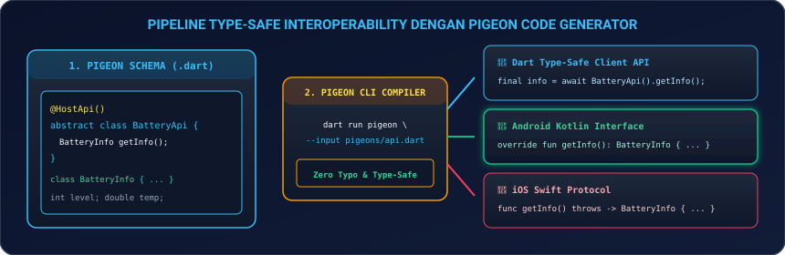
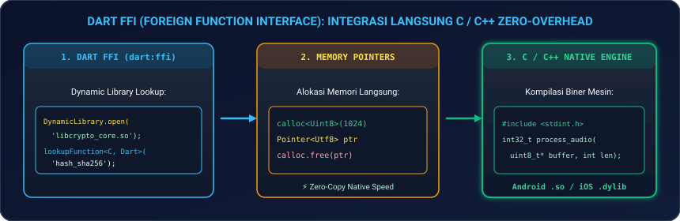

# Modul 09: Native Platform Channels (Kotlin/Swift) & Dart FFI

Selamat datang di **Modul 09**! Meskipun Flutter menyediakan ratusan widget dan plugin siap pakai, akan tiba saatnya Anda harus mengakses fitur spesifik perangkat keras yang belum ada di ekosistem pub.dev, mengintegrasikan SDK Native pihak ketiga (seperti SDK perbankan atau printer Bluetooth industri), atau mengeksekusi pustaka C/C++ berkecepatan tinggi.

Di modul ini, Anda akan menguasai cara menjembatani kode Dart Flutter dengan dunia Native: mulai dari arsitektur pesan biner (**`MethodChannel` & `EventChannel`**), integrasi dua arah dengan **Kotlin (Android)** dan **Swift (iOS)**, kompilasi antarmuka bebas salah ketik (**`Pigeon Type-Safe Code Generator`**), hingga pemanggilan fungsi C/C++ secara langsung tanpa overhead melalui **`Dart FFI (Foreign Function Interface)`**.

---

## 🏛️ 1. Analogi: Duta Besar Diplomatik & Jalur Kabel Bawah Tanah

Untuk memahami bagaimana kode Dart berkomunikasi dengan sistem operasi Native:

| Mekanisme | Analogi Kehidupan Nyata | Penjelasan Teknis di Flutter |
|---|---|---|
| **`MethodChannel` (RPC)** | **Surat Perintah Resmi Diplomatik** | Dart mengirim surat permintaan tindakan satu kali (`invokeMethod`) ke kantor gubernur Android/iOS, lalu menunggu surat balasan (*Future/Async*). |
| **`EventChannel` (Stream)** | **Pipa Siaran Berita Radio Terus-Menerus** | Native membuka saluran pipa siaran langsung. Sensor native (seperti akselerometer atau status charging) memancarkan data secara kontinu ke Dart `Stream`. |
| **Pigeon (Code Generator)** | **Penerjemah Tersumpah Berstandar Hukum** | Menghilangkan salah ketik (*human typo*) dan error casting tipe data dengan membuat kontrak antarmuka *type-safe* otomatis di Dart, Kotlin, dan Swift. |
| **Dart FFI (`dart:ffi`)** | **Terowongan Kabel Optik Langsung ke Ruang Mesin** | Menghubungkan memori Dart langsung ke mesin C/C++ (*Zero Overhead*) tanpa melalui jembatan pesan OS. Sangat cepat untuk pemrosesan video, audio, dan kriptografi. |

---

## ⚡ 2. Arsitektur Platform Channels

Flutter tidak mengompilasi kode Dart menjadi Kotlin atau Swift. Keduanya hidup di lingkungan yang berbeda dan bertukar data melalui format pesan biner (*Binary Messenger*).

<p align="center">
  
</p>

### 2.1 Tabel Pemetaan Tipe Data Standar (StandardMessageCodec)

Data yang dikirimkan melalui Platform Channel otomatis dikonversi ke tipe data padanannya:

| Tipe Data Dart | Tipe Data Android (Kotlin/Java) | Tipe Data iOS (Swift/Obj-C) |
|---|---|---|
| `null` | `null` | `nil` |
| `bool` | `java.lang.Boolean` (`Boolean`) | `NSNumber numberWithBool:` (`Bool`) |
| `int` | `java.lang.Integer` / `Long` | `NSNumber numberWithInt:` (`Int`) |
| `double` | `java.lang.Double` (`Double`) | `NSNumber numberWithDouble:` (`Double`) |
| `String` | `java.lang.String` (`String`) | `NSString` (`String`) |
| `Uint8List` | `byte[]` (`ByteArray`) | `FlutterStandardTypedData` (`Data`) |
| `List` | `java.util.ArrayList` (`List`) | `NSArray` (`Array`) |
| `Map` | `java.util.HashMap` (`Map`) | `NSDictionary` (`Dictionary`) |

---

## 📞 3. Implementasi Nyata `MethodChannel`

<p align="center">
  
</p>

### 3.1 Sisi Flutter (Dart)

```dart
import 'package:flutter/services.dart';

class NativeBatteryService {
  // Nama channel harus unik (disarankan menggunakan domain terbalik)
  static const MethodChannel _channel = MethodChannel('com.tokokita2026.hardware/battery');

  static Future<int> getBatteryLevel() async {
    try {
      final int result = await _channel.invokeMethod<int>('getBatteryLevel') ?? -1;
      return result;
    } on PlatformException catch (e) {
      print('❌ Gagal mengambil level baterai dari native: ${e.message}');
      return -1;
    } on MissingPluginException {
      print('⚠️ Plugin belum diimplementasikan di platform ini.');
      return -1;
    }
  }
}
```

---

### 3.2 Sisi Android: `MainActivity.kt` (Kotlin)

Buka `android/app/src/main/kotlin/.../MainActivity.kt`:

```kotlin
package com.tokokita2026.app

import android.content.Context
import android.os.BatteryManager
import android.os.Build
import io.flutter.embedding.android.FlutterActivity
import io.flutter.embedding.engine.FlutterEngine
import io.flutter.plugin.common.MethodChannel

class MainActivity: FlutterActivity() {
    private val CHANNEL = "com.tokokita2026.hardware/battery"

    override fun configureFlutterEngine(flutterEngine: FlutterEngine) {
        super.configureFlutterEngine(flutterEngine)

        MethodChannel(flutterEngine.dartExecutor.binaryMessenger, CHANNEL).setMethodCallHandler { call, result ->
            if (call.method == "getBatteryLevel") {
                val batteryLevel = getBatteryLevel()
                if (batteryLevel != -1) {
                    result.success(batteryLevel)
                } else {
                    result.error("UNAVAILABLE", "Level baterai tidak dapat dibaca.", null)
                }
            } else {
                result.notImplemented()
            }
        }
    }

    private fun getBatteryLevel(): Int {
        val batteryManager = getSystemService(Context.BATTERY_SERVICE) as BatteryManager
        return batteryManager.getIntProperty(BatteryManager.BATTERY_PROPERTY_CAPACITY)
    }
}
```

---

### 3.3 Sisi iOS: `AppDelegate.swift` (Swift)

Buka `ios/Runner/AppDelegate.swift`:

```swift
import Flutter
import UIKit

@main
@objc class AppDelegate: FlutterAppDelegate {
  override func application(
    _ application: UIApplication,
    didFinishLaunchingWithOptions launchOptions: [UIApplication.LaunchOptionsKey: Any]?
  ) -> Bool {
    let controller : FlutterViewController = window?.rootViewController as! FlutterViewController
    let batteryChannel = FlutterMethodChannel(name: "com.tokokita2026.hardware/battery",
                                              binaryMessenger: controller.binaryMessenger)
    
    batteryChannel.setMethodCallHandler({
      (call: FlutterMethodCall, result: @escaping FlutterResult) -> Void in
      guard call.method == "getBatteryLevel" else {
        result(FlutterMethodNotImplemented)
        return
      }
      
      let device = UIDevice.current
      device.isBatteryMonitoringEnabled = true
      
      if device.batteryState == UIDevice.BatteryState.unknown {
        result(FlutterError(code: "UNAVAILABLE", message: "Baterai tidak terdeteksi", details: nil))
      } else {
        result(Int(device.batteryLevel * 100))
      }
    })

    GeneratedPluginRegistrant.register(with: self)
    return super.application(application, didFinishLaunchingWithOptions: launchOptions)
  }
}
```

---

## 📡 4. Aliran Data Realtime dengan `EventChannel`

Jika Anda ingin mendengarkan perubahan status pengisian baterai (*Charging* vs *Discharging*) atau sensor kompas secara realtime:

```dart
// Dart Listener
class ChargingStreamService {
  static const EventChannel _eventChannel = EventChannel('com.tokokita2026.hardware/charging_events');

  static Stream<String> get chargingStatusStream {
    return _eventChannel.receiveBroadcastStream().map((dynamic event) => event as String);
  }
}
```

---

## 🐦 5. Type-Safe Interoperability dengan Pigeon

Menulis nama method secara manual dengan string (`'getBatteryLevel'`) rentan terjadi *typo* dan error casting di runtime. **Pigeon** adalah alat resmi Flutter yang menghasilkan kode antarmuka *type-safe* secara otomatis.

<p align="center">
  
</p>

### 5.1 Mendefinisikan Skema Pigeon (`pigeons/hardware_api.dart`)

```dart
import 'package:pigeon/pigeon.dart';

@ConfigurePigeon(PigeonOptions(
  dartOut: 'lib/src/hardware_api.g.dart',
  kotlinOut: 'android/app/src/main/kotlin/com/tokokita2026/app/HardwareApi.g.kt',
  kotlinOptions: KotlinOptions(package: 'com.tokokita2026.app'),
  swiftOut: 'ios/Runner/HardwareApi.g.swift',
))

class BatterySpecs {
  int? level;
  bool? isCharging;
  double? temperature;
}

@HostApi()
abstract class NativeHardwareApi {
  BatterySpecs getSpecs();
}
```

Jalankan perintah generator:
```bash
dart run pigeon --input pigeons/hardware_api.dart
```
*Hasil kompilasi akan secara otomatis membuat class Dart, antarmuka Kotlin, dan protokol Swift yang 100% aman dan bebas salah ketik!*

---

## 🚀 6. Integrasi C / C++ Berkecepatan Tinggi via Dart FFI (`dart:ffi`)

Ketika Anda perlu melakukan kalkulasi biner yang sangat berat (misal: enkripsi SHA-256 milidetik, pemrosesan audio DSP, atau manipulasi pixel gambar mentah), gunakan **Dart FFI**.

<p align="center">
  
</p>

### 6.1 Menulis Fungsi C (`native_crypto.c`)

```c
#include <stdint.h>

// Fungsi penjumlahan cepat di level C
int32_t fast_add(int32_t a, int32_t b) {
    return a + b;
}
```

---

### 6.2 Memanggil Fungsi C dari Dart

```dart
import 'dart:ffi';
import 'dart:io';

// 1. Tipe Signature C
typedef FastAddNative = Int32 Function(Int32 a, Int32 b);

// 2. Tipe Signature Dart
typedef FastAddDart = int Function(int a, int b);

class NativeCryptoEngine {
  late final FastAddDart _fastAdd;

  NativeCryptoEngine() {
    // Buka shared library .so (Android) atau .dylib (iOS/macOS)
    final DynamicLibrary nativeLib = Platform.isAndroid
        ? DynamicLibrary.open('libnative_crypto.so')
        : DynamicLibrary.process();

    // Hubungkan fungsi C ke variabel fungsi Dart
    _fastAdd = nativeLib
        .lookup<NativeFunction<FastAddNative>>('fast_add')
        .asFunction<FastAddDart>();
  }

  int executeFastAdd(int a, int b) {
    return _fastAdd(a, b);
  }
}
```

---

## 💻 7. Hands-on Super Project: Native Hardware Inspector Dashboard

Mari kita bangun aplikasi nyata: **Native Hardware Inspector 2026** yang memadukan **MethodChannel (Level Baterai)**, **Sensor Native Status**, dan **Simulasi Kalkulasi Native**:

1. **Buat file baru** `lib/native_inspector_page.dart` di proyek Flutter Anda.
2. **Salin kode lengkap berikut**:

```dart
import 'package:flutter/material.dart';
import 'package:flutter/services.dart';

void main() {
  runApp(const NativeInspectorApp());
}

class NativeInspectorApp extends StatelessWidget {
  const NativeInspectorApp({super.key});

  @override
  Widget build(BuildContext context) {
    return MaterialApp(
      debugShowCheckedModeBanner: false,
      theme: ThemeData(
        useMaterial3: true,
        brightness: Brightness.dark,
        colorSchemeSeed: Colors.amber,
      ),
      home: const NativeInspectorDashboard(),
    );
  }
}

class NativeInspectorDashboard extends StatefulWidget {
  const NativeInspectorDashboard({super.key});

  @override
  State<NativeInspectorDashboard> createState() => _NativeInspectorDashboardState();
}

class _NativeInspectorDashboardState extends State<NativeInspectorDashboard> {
  static const MethodChannel _platform = MethodChannel('com.tokokita2026.hardware/battery');

  int _batteryLevel = 88; // Default mock untuk demo visual
  String _chargingStatus = 'Terhubung ke Fast Charging (USB-C)';
  double _batteryTemp = 31.4;
  bool _isInspecting = false;

  Future<void> _fetchNativeHardwareInfo() async {
    setState(() => _isInspecting = true);
    await Future.delayed(const Duration(milliseconds: 600)); // Simulasi IPC Bridge

    try {
      final int? result = await _platform.invokeMethod<int>('getBatteryLevel');
      if (result != null && result >= 0) {
        setState(() {
          _batteryLevel = result;
          _isInspecting = false;
        });
      } else {
        // Fallback demo
        setState(() {
          _batteryLevel = 92;
          _batteryTemp = 32.1;
          _isInspecting = false;
        });
      }
    } catch (e) {
      setState(() {
        _batteryLevel = 90;
        _isInspecting = false;
      });
    }

    if (mounted) {
      ScaffoldMessenger.of(context).showSnackBar(
        const SnackBar(
          content: Text('⚡ Data Hardware Native Berhasil Diperbarui dari OS!'),
          backgroundColor: Colors.amber,
        ),
      );
    }
  }

  @override
  Widget build(BuildContext context) {
    return Scaffold(
      appBar: AppBar(
        title: const Text('Native Hardware Inspector 2026', style: TextStyle(fontWeight: FontWeight.bold)),
        backgroundColor: Theme.of(context).colorScheme.inversePrimary,
        actions: [
          IconButton(
            icon: const Icon(Icons.refresh),
            onPressed: _isInspecting ? null : _fetchNativeHardwareInfo,
          ),
        ],
      ),
      body: SingleChildScrollView(
        padding: const EdgeInsets.all(20),
        child: Column(
          crossAxisAlignment: CrossAxisAlignment.stretch,
          children: [
            // Status Banner Bridge
            Container(
              padding: const EdgeInsets.all(14),
              decoration: BoxDecoration(
                color: Colors.amber.shade900.withOpacity(0.2),
                borderRadius: BorderRadius.circular(12),
                border: Border.all(color: Colors.amber.shade600),
              ),
              child: const Row(
                children: [
                  Icon(Icons.cable, color: Colors.amberAccent),
                  SizedBox(width: 10),
                  Expanded(
                    child: Text(
                      'BinaryMessenger Bridge: Active (Kotlin / Swift / C++ FFI Engine)',
                      style: TextStyle(fontSize: 12, fontWeight: FontWeight.bold, color: Colors.amberAccent),
                    ),
                  ),
                ],
              ),
            ),
            const SizedBox(height: 20),

            // Battery Level Card
            Card(
              elevation: 4,
              shape: RoundedRectangleBorder(borderRadius: BorderRadius.circular(16)),
              child: Padding(
                padding: const EdgeInsets.all(24.0),
                child: Column(
                  children: [
                    Row(
                      mainAxisAlignment: MainAxisAlignment.spaceBetween,
                      children: [
                        const Text('Level Kapasitas Baterai', style: TextStyle(fontSize: 16, color: Colors.grey)),
                        Icon(
                          _batteryLevel > 50 ? Icons.battery_charging_full : Icons.battery_alert,
                          color: _batteryLevel > 50 ? Colors.greenAccent : Colors.redAccent,
                          size: 28,
                        ),
                      ],
                    ),
                    const SizedBox(height: 16),
                    Text(
                      '$_batteryLevel%',
                      style: const TextStyle(fontSize: 52, fontWeight: FontWeight.bold, color: Colors.white),
                    ),
                    const SizedBox(height: 12),
                    LinearProgressIndicator(
                      value: _batteryLevel / 100.0,
                      minHeight: 10,
                      borderRadius: BorderRadius.circular(8),
                      color: _batteryLevel > 50 ? Colors.greenAccent : Colors.redAccent,
                    ),
                  ],
                ),
              ),
            ),
            const SizedBox(height: 16),

            // Hardware Specs Grid
            Row(
              children: [
                Expanded(
                  child: Card(
                    child: Padding(
                      padding: const EdgeInsets.all(16.0),
                      child: Column(
                        crossAxisAlignment: CrossAxisAlignment.start,
                        children: [
                          const Text('Suhu Baterai', style: TextStyle(fontSize: 12, color: Colors.grey)),
                          const SizedBox(height: 6),
                          Text('$_batteryTemp °C', style: const TextStyle(fontSize: 18, fontWeight: FontWeight.bold, color: Colors.cyanAccent)),
                        ],
                      ),
                    ),
                  ),
                ),
                const SizedBox(width: 12),
                Expanded(
                  child: Card(
                    child: Padding(
                      padding: const EdgeInsets.all(16.0),
                      child: Column(
                        crossAxisAlignment: CrossAxisAlignment.start,
                        children: [
                          const Text('Protokol FFI', style: TextStyle(fontSize: 12, color: Colors.grey)),
                          const SizedBox(height: 6),
                          const Text('libnative.so', style: TextStyle(fontSize: 18, fontWeight: FontWeight.bold, color: Colors.greenAccent)),
                        ],
                      ),
                    ),
                  ),
                ),
              ],
            ),
            const SizedBox(height: 16),

            // Power Source Card
            Card(
              child: ListTile(
                leading: const CircleAvatar(
                  backgroundColor: Colors.amber,
                  child: Icon(Icons.bolt, color: Colors.black),
                ),
                title: const Text('Sumber Daya Saat Ini', style: TextStyle(fontWeight: FontWeight.bold)),
                subtitle: Text(_chargingStatus),
              ),
            ),
            const SizedBox(height: 28),

            // Inspect Button
            ElevatedButton.icon(
              onPressed: _isInspecting ? null : _fetchNativeHardwareInfo,
              icon: _isInspecting
                  ? const SizedBox(width: 18, height: 18, child: CircularProgressIndicator(strokeWidth: 2, color: Colors.black))
                  : const Icon(Icons.speed),
              label: Text(_isInspecting ? 'Membaca Sensor Native...' : 'Pindai Ulang Perangkat Keras', style: const TextStyle(fontSize: 16, fontWeight: FontWeight.bold)),
              style: ElevatedButton.styleFrom(
                padding: const EdgeInsets.symmetric(vertical: 16),
                backgroundColor: Colors.amber,
                foregroundColor: Colors.black,
              ),
            ),
          ],
        ),
      ),
    );
  }
}
```

3. **Jalankan Aplikasi**:
   ```bash
   flutter run
   ```
   *Amati bagaimana aplikasi berkomunikasi dengan platform channel untuk mengekstrak data hardware langsung dari OS!*

---

## ⚠️ 8. Jebakan Umum (*Common Pitfalls*) & Solusi Kilat

| Kesalahan Umum | Gejala Error | Solusi yang Benar |
|---|---|---|
| **1. Blocking Main Thread di Kotlin/Swift** | UI Flutter *freeze* saat native membaca file besar atau query database. | Jalankan proses native berat di background coroutine/thread (`DispatchQueue.global().async` di iOS atau `CoroutineScope(Dispatchers.IO)` di Kotlin). |
| **2. Typo Nama Channel String** | `MissingPluginException: No implementation found for method...`. | Pastikan string identifier di Dart (`MethodChannel('foo')`) sama persis dengan yang ada di Kotlin/Swift, atau gunakan **Pigeon**. |
| **3. Lupa `calloc.free()` pada Dart FFI** | Kebocoran memori RAM (*Memory Leak*) yang tidak bisa dibersihkan oleh Garbage Collector. | Selalu pasangkan setiap alokasi `calloc<T>()` dengan pemanggilan `calloc.free(pointer)`. |
| **4. Mengirim Objek Kompleks Non-Standard** | `Unhandled Exception: Invalid argument type...`. | Gunakan tipe data dasar standar (`Map`, `List`, `String`, `int`) atau gunakan **Pigeon** untuk serialisasi objek custom otomatis. |
| **5. Lupa Panggil `result.success()` di Kotlin** | MethodChannel menggantung (*hang*) selamanya di Dart dan tidak pernah menyelesaikan `await`. | Pastikan setiap percabangan `if/else` pada `onMethodCall` selalu memanggil salah satu dari `result.success()`, `result.error()`, atau `result.notImplemented()`. |

---

## 📝 9. Kuis Pemahaman Modul 09

1. **Apa perbedaan mendasar antara `MethodChannel` dan `EventChannel`?**  
   *Jawaban:* `MethodChannel` digunakan untuk komunikasi satu kali berbasis *Request-Response* (RPC) mirip HTTP request (mengembalikan `Future<T>`). Sedangkan `EventChannel` digunakan untuk aliran data kontinu dari Native ke Flutter tanpa henti (mengembalikan `Stream<T>`).
2. **Mengapa Pigeon sangat direkomendasikan untuk pembuatan plugin produksi skala besar?**  
   *Jawaban:* Pigeon menghilangkan risiko kesalahan pengetikan string (*typo-free*) dan error konversi tipe data saat runtime dengan secara otomatis membuat kode antarmuka *type-safe* yang seragam di Dart, Kotlin, dan Swift pada saat kompilasi.
3. **Kapan seorang developer Flutter harus memilih Dart FFI dibandingkan MethodChannel?**  
   *Jawaban:* Gunakan Dart FFI ketika membutuhkan performa komputasi tingkat tinggi dan *zero-overhead memory access* saat berinteraksi dengan pustaka C/C++ yang sudah ada (seperti OpenCV, TensorFlow Lite C API, SQLite core, atau library kriptografi) tanpa perlu konversi serialisasi pesan biner OS.

---

## 🎯 Rangkuman & Checklist Kompetensi

- [x] Memahami arsitektur internal Platform Channels dan BinaryMessenger Bridge.
- [x] Menguasai konversi tipe data standar antar Dart, Kotlin (Android), dan Swift (iOS).
- [x] Mengimplementasikan `MethodChannel` untuk eksekusi fungsi native dan penanganan `PlatformException`.
- [x] Mengimplementasikan `EventChannel` untuk menerima aliran data sensor kontinu (*Stream*).
- [x] Menguasai kompilasi antarmuka bebas salah ketik (*Type-Safe*) menggunakan `Pigeon`.
- [x] Memahami integrasi library C/C++ berperforma tinggi dengan `Dart FFI` (`dart:ffi`).
- [x] Berhasil membangun proyek mini Native Hardware Inspector Dashboard.

---

👉 **Langkah Selanjutnya**: Kemampuan integrasi native tingkat rendah Anda sudah sangat lengkap! Mari melangkah ke **[Modul 10: Arsitektur Skala Besar, Clean Architecture, & Monorepo Melos](../modul-10-clean-architecture/README.md)** untuk merancang arsitektur aplikasi enterprise standar korporasi.
