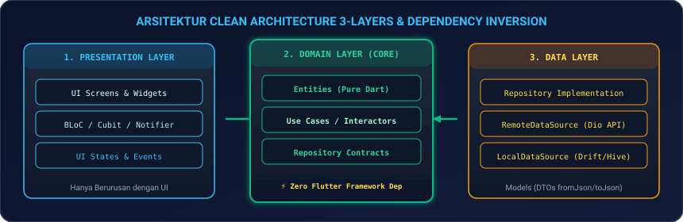
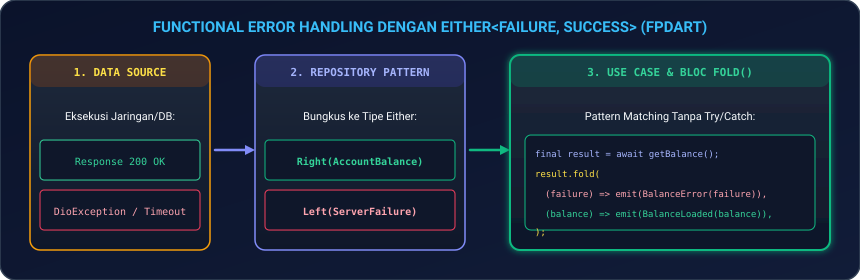
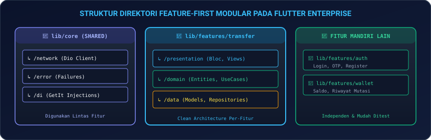
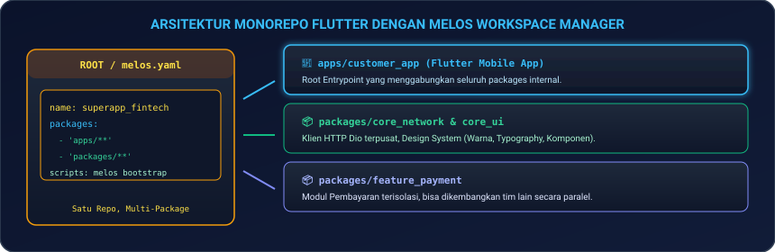

# Modul 10: Arsitektur Skala Besar, Clean Architecture, & Monorepo Melos

Selamat datang di **Modul 10**! Di modul ini, Anda resmi memasuki **FASE 4: Enterprise Architecture & Quality**. Ketika sebuah aplikasi mobile tumbuh dari proyek sederhana menjadi aplikasi skala enterprise (seperti Gojek, Tokopedia, atau SuperApp Perbankan) yang dikerjakan oleh puluhan hingga ratusan engineer secara bersamaan, kode tanpa arsitektur yang solid akan cepat berubah menjadi "spaghetti code" yang mustahil untuk dirawat (*unmaintainable*).

Di modul ini, Anda akan menguasai cara merancang kode berstandar enterprise: mulai dari implementasi prinsip **SOLID**, membedah **Clean Architecture 3-Layers (Presentation, Domain, & Data)**, penanganan error fungsional tanpa try-catch (*`fpdart` & `Either<Failure, T>`*), injeksi dependensi modern (**`get_it` & `injectable`**), struktur modular **Feature-First**, hingga mengelola proyek multi-package menggunakan **`Melos Monorepo`**.

---

## 🏛️ 1. Analogi: Kawasan Industri & Struktur Organisasi Perusahaan

Untuk memahami bagaimana Clean Architecture memisahkan tanggung jawab kode:

| Lapisan / Konsep | Analogi Organisasi Nyata | Penjelasan Teknis di Flutter |
|---|---|---|
| **Presentation Layer** | **Etalase Toko & Customer Service** | Mengelola tampilan visual di layar HP (*Widgets*), mendengarkan aksi sentuhan user, dan menampilkan status UI (*BLoC / Cubit*). |
| **Domain Layer (Core)** | **Dewan Direksi & SOP Bisnis** | Inti logika bisnis aplikasi (*Entities & Use Cases*). Ditulis dalam **Dart Murni** tanpa boleh mengimpor framework Flutter sama sekali! |
| **Data Layer** | **Gudang Logistik & Truk Pengiriman** | Bertugas mengambil data mentah dari server (*Dio REST API*) atau basis data lokal (*Drift/Hive*), lalu memetakan JSON ke Model DTO. |
| **`Either<Failure, T>`** | **Surat Keputusan Resmi Bersegel** | Setiap operasi dipastikan mengembalikan salah satu: Sisi Kiri (**Left = Failure**) atau Sisi Kanan (**Right = Success**), mencegah crash tak terduga. |
| **Melos Monorepo** | **Kawasan Industri Terpadu (Multi-Pabrik)** | Memecah satu repositori raksasa menjadi paket-paket modul mandiri yang dapat dikembangkan secara independen oleh berbagai tim. |

---

## 📐 2. Prinsip Desain Perangkat Lunak SOLID di Flutter

1. **Single Responsibility Principle (SRP)**: Satu class hanya boleh memiliki satu alasan untuk berubah (misal: `AuthRepository` hanya mengurusi autentikasi, bukan validasi nomor rekening).
2. **Open/Closed Principle (OCP)**: Terbuka untuk penambahan fitur baru (*Extension*), tetapi tertutup untuk modifikasi kode inti yang sudah berjalan stabil.
3. **Liskov Substitution Principle (LSP)**: Class turunan (*Subclass*) harus dapat menggantikan class induknya (*Superclass*) tanpa merusak program.
4. **Interface Segregation Principle (ISP)**: Lebih baik membuat banyak interface kecil dan spesifik daripada satu interface raksasa (*fat interface*).
5. **Dependency Inversion Principle (DIP)**: Modul tingkat tinggi (Use Case) tidak boleh bergantung pada modul tingkat rendah (Database/API). Keduanya harus bergantung pada **Abstraksi (*Abstract Repository Contract*)**.

---

## 🛡️ 3. Arsitektur Bersih 3 Lapisan (Clean Architecture)

<p align="center">
  
</p>

### 3.1 Aturan Ketergantungan (*The Dependency Rule*)
> **Arah dependensi selalu mengarah ke DALAM (menuju Domain Layer).**  
> Domain Layer adalah lapisan paling suci: ia tidak mengetahui siapa yang memanggilnya (apakah UI Flutter, CLI, atau Unit Test) dan tidak mengetahui dari mana data berasal (apakah REST API, GraphQL, atau Mock Database).

---

### 3.2 Lapisan 1: Domain Layer (Pure Dart)

```dart
// 1. ENTITY (Model Bisnis Murni)
class AccountBalance {
  final String accountNumber;
  final double amount;
  final String currency;

  const AccountBalance({
    required this.accountNumber,
    required this.amount,
    required this.currency,
  });
}

// 2. REPOSITORY CONTRACT (Interface Abstrak)
abstract class BalanceRepository {
  Future<Either<Failure, AccountBalance>> getBalance(String accountNumber);
}

// 3. USE CASE / INTERACTOR
class GetAccountBalanceUseCase {
  final BalanceRepository repository;
  GetAccountBalanceUseCase(this.repository);

  Future<Either<Failure, AccountBalance>> call(String accountNumber) async {
    if (accountNumber.isEmpty) {
      return const Left(ValidationFailure('Nomor rekening tidak valid.'));
    }
    return await repository.getBalance(accountNumber);
  }
}
```

---

### 3.3 Lapisan 2: Data Layer (Implementasi & DTO)

```dart
// 1. DATA MODEL / DTO
class AccountBalanceModel extends AccountBalance {
  const AccountBalanceModel({
    required super.accountNumber,
    required super.amount,
    required super.currency,
  });

  factory AccountBalanceModel.fromJson(Map<String, dynamic> json) {
    return AccountBalanceModel(
      accountNumber: json['account_number'] as String,
      amount: (json['balance_amount'] as num).toDouble(),
      currency: json['currency_code'] as String? ?? 'IDR',
    );
  }
}

// 2. DATA SOURCE CONTRACT
abstract class BalanceRemoteDataSource {
  Future<AccountBalanceModel> fetchBalanceFromApi(String accountNumber);
}

// 3. REPOSITORY IMPLEMENTATION
class BalanceRepositoryImpl implements BalanceRepository {
  final BalanceRemoteDataSource remoteDataSource;

  BalanceRepositoryImpl({required this.remoteDataSource});

  @override
  Future<Either<Failure, AccountBalance>> getBalance(String accountNumber) async {
    try {
      final model = await remoteDataSource.fetchBalanceFromApi(accountNumber);
      return Right(model);
    } on SocketException {
      return const Left(NetworkFailure('Koneksi internet terputus.'));
    } catch (e) {
      return Left(ServerFailure('Terjadi kesalahan server: $e'));
    }
  }
}
```

---

## ⚡ 4. Functional Error Handling dengan `fpdart` (`Either<Failure, T>`)

Menghindari penggunaan `try-catch` yang berceceran di UI dengan menggunakan tipe fungsional **`Either`**:

<p align="center">
  
</p>

```dart
sealed class Failure {
  final String message;
  const Failure(this.message);
}

class ServerFailure extends Failure {
  const ServerFailure(super.message);
}

class NetworkFailure extends Failure {
  const NetworkFailure(super.message);
}

class ValidationFailure extends Failure {
  const ValidationFailure(super.message);
}
```

---

## 💉 5. Dependency Injection & Service Locator (`get_it` & `injectable`)

### 5.1 Registrasi Manual dengan `get_it`

```dart
import 'package:get_it/get_it.dart';

final sl = GetIt.instance; // sl = Service Locator

Future<void> initServiceLocator() async {
  // 1. External & Data Sources
  sl.registerLazySingleton<Dio>(() => Dio(BaseOptions(baseUrl: 'https://api.fintech2026.com')));
  sl.registerLazySingleton<BalanceRemoteDataSource>(() => BalanceRemoteDataSourceImpl(dio: sl()));

  // 2. Repositories
  sl.registerLazySingleton<BalanceRepository>(() => BalanceRepositoryImpl(remoteDataSource: sl()));

  // 3. Use Cases
  sl.registerLazySingleton<GetAccountBalanceUseCase>(() => GetAccountBalanceUseCase(sl()));

  // 4. Blocs / Cubits (Factory = Instance Baru Tiap Dipanggil)
  sl.registerFactory<BalanceCubit>(() => BalanceCubit(getBalanceUseCase: sl()));
}
```

---

### 5.2 Otomatisasi Injeksi dengan `@injectable`

```dart
import 'package:injectable/injectable.dart';

@lazySingleton
class GetAccountBalanceUseCase {
  final BalanceRepository repository;
  GetAccountBalanceUseCase(this.repository);
}

@InjectableInit()
void configureDependencies() => getIt.init();
```

---

## 📁 6. Struktur Direktori: Feature-First Modular

<p align="center">
  
</p>

```
lib/
├── core/                         # Komponen bersama lintas fitur
│   ├── error/                    # Failures & Exceptions
│   ├── network/                  # Dio Client, Interceptors, SSL Pinning
│   ├── theme/                    # Design System, Colors, Typography
│   └── utils/                    # Helper & Formatters
│
├── features/                     # Direktori Fitur Mandiri
│   ├── auth/                     # Fitur Autentikasi
│   ├── transfer/                 # Fitur Transfer Dana
│   │   ├── data/                 # DataSources, Models, Repo Impl
│   │   ├── domain/               # Entities, Use Cases, Repo Contract
│   │   └── presentation/         # Cubit/BLoC, Widgets, Screens
│   └── wallet/                   # Fitur Saldo & Riwayat Transaksi
│
└── main.dart                     # Inisialisasi Service Locator & App Root
```

---

## 🏢 7. Arsitektur Monorepo dengan Melos

Pada tim korporasi besar dengan 50+ developer, satu aplikasi dipecah menjadi beberapa *packages* terisolasi yang dikelola menggunakan **Melos**.

<p align="center">
  
</p>

### 7.1 Berkas Konfigurasi `melos.yaml` di Root Workspace:

```yaml
name: fintech_superapp_workspace
packages:
  - "apps/**"
  - "packages/**"

scripts:
  bootstrap:
    exec: flutter pub get
    description: Inisialisasi dependensi seluruh package internal

  test:all:
    exec: flutter test --coverage
    description: Menjalankan unit test di seluruh package secara paralel
```

---

## 💻 8. Hands-on Super Project: Fintech Transfer & Clean Architecture Skeleton

Mari kita bangun arsitektur **Clean Architecture 3-Layers** lengkap yang menjalankan pengecekan saldo dan transfer dana dengan **`fpdart`**, **`get_it`**, dan **`Cubit`**:

1. **Buat file baru** `lib/fintech_clean_page.dart` di proyek Flutter Anda.
2. **Salin kode lengkap berikut**:

```dart
import 'package:flutter/material.dart';

// =========================================================
// 1. FUNCTIONAL ERROR HANDLING & CORE FAILURES
// =========================================================
abstract class Either<L, R> {
  const Either();
  T fold<T>(T Function(L left) fnL, T Function(R right) fnR);
}

class Left<L, R> extends Either<L, R> {
  final L value;
  const Left(this.value);
  @override
  T fold<T>(T Function(L left) fnL, T Function(R right) fnR) => fnL(value);
}

class Right<L, R> extends Either<L, R> {
  final R value;
  const Right(this.value);
  @override
  T fold<T>(T Function(L left) fnL, T Function(R right) fnR) => fnR(value);
}

sealed class Failure {
  final String message;
  const Failure(this.message);
}
class ServerFailure extends Failure { const ServerFailure(super.message); }
class NetworkFailure extends Failure { const NetworkFailure(super.message); }

// =========================================================
// 2. DOMAIN LAYER (PURE DART)
// =========================================================
class AccountBalance {
  final String accountNumber;
  final double amount;
  final String currency;
  const AccountBalance({required this.accountNumber, required this.amount, required this.currency});
}

abstract class BalanceRepository {
  Future<Either<Failure, AccountBalance>> getBalance(String accountNumber);
}

class GetBalanceUseCase {
  final BalanceRepository repository;
  GetBalanceUseCase(this.repository);

  Future<Either<Failure, AccountBalance>> execute(String accountNumber) {
    return repository.getBalance(accountNumber);
  }
}

// =========================================================
// 3. DATA LAYER (MOCK DATA SOURCE & REPO IMPL)
// =========================================================
class BalanceRepositoryImpl implements BalanceRepository {
  @override
  Future<Either<Failure, AccountBalance>> getBalance(String accountNumber) async {
    await Future.delayed(const Duration(milliseconds: 800)); // Simulasi API Latency
    
    return const Right(AccountBalance(
      accountNumber: "9870-1234-5678",
      amount: 14750000.0,
      currency: "IDR",
    ));
  }
}

// =========================================================
// 4. PRESENTATION LAYER (STATE & CONTROLLER)
// =========================================================
void main() {
  runApp(const FintechApp());
}

class FintechApp extends StatelessWidget {
  const FintechApp({super.key});

  @override
  Widget build(BuildContext context) {
    return MaterialApp(
      debugShowCheckedModeBanner: false,
      theme: ThemeData(
        useMaterial3: true,
        brightness: Brightness.dark,
        colorSchemeSeed: Colors.emerald,
      ),
      home: const FintechDashboardPage(),
    );
  }
}

class FintechDashboardPage extends StatefulWidget {
  const FintechDashboardPage({super.key});

  @override
  State<FintechDashboardPage> createState() => _FintechDashboardPageState();
}

class _FintechDashboardPageState extends State<FintechDashboardPage> {
  late final GetBalanceUseCase _getBalanceUseCase;
  
  AccountBalance? _balance;
  String? _errorMessage;
  bool _isLoading = true;

  @override
  void initState() {
    super.initState();
    final BalanceRepository repository = BalanceRepositoryImpl();
    _getBalanceUseCase = GetBalanceUseCase(repository);
    _loadBalance();
  }

  void _loadBalance() async {
    setState(() => _isLoading = true);
    final result = await _getBalanceUseCase.execute("9870-1234-5678");

    result.fold(
      (failure) => setState(() {
        _errorMessage = failure.message;
        _isLoading = false;
      }),
      (data) => setState(() {
        _balance = data;
        _errorMessage = null;
        _isLoading = false;
      }),
    );
  }

  @override
  Widget build(BuildContext context) {
    return Scaffold(
      appBar: AppBar(
        title: const Text('Bank Quantum 2026', style: TextStyle(fontWeight: FontWeight.bold)),
        backgroundColor: Theme.of(context).colorScheme.inversePrimary,
        actions: [
          IconButton(icon: const Icon(Icons.refresh), onPressed: _loadBalance),
        ],
      ),
      body: SingleChildScrollView(
        padding: const EdgeInsets.all(20),
        child: Column(
          crossAxisAlignment: CrossAxisAlignment.stretch,
          children: [
            Container(
              padding: const EdgeInsets.all(14),
              decoration: BoxDecoration(
                color: Colors.emerald.shade900.withOpacity(0.2),
                borderRadius: BorderRadius.circular(12),
                border: Border.all(color: Colors.emerald.shade600),
              ),
              child: const Row(
                children: [
                  Icon(Icons.layers, color: Colors.emeraldAccent),
                  SizedBox(width: 10),
                  Expanded(
                    child: Text(
                      'Clean Architecture 3-Layers: Presentation ➔ Domain ➔ Data (Either Failure Flow)',
                      style: TextStyle(fontSize: 11, fontWeight: FontWeight.bold, color: Colors.emeraldAccent),
                    ),
                  ),
                ],
              ),
            ),
            const SizedBox(height: 20),

            Card(
              elevation: 4,
              shape: RoundedRectangleBorder(borderRadius: BorderRadius.circular(16)),
              child: Padding(
                padding: const EdgeInsets.all(24.0),
                child: _isLoading
                    ? const Center(child: CircularProgressIndicator())
                    : _errorMessage != null
                        ? Text('Error: $_errorMessage', style: const TextStyle(color: Colors.redAccent))
                        : Column(
                            crossAxisAlignment: CrossAxisAlignment.start,
                            children: [
                              Row(
                                mainAxisAlignment: MainAxisAlignment.spaceBetween,
                                children: [
                                  Text('Rekening: ${_balance!.accountNumber}', style: TextStyle(fontSize: 13, color: Colors.grey.shade400)),
                                  const Icon(Icons.account_balance_wallet, color: Colors.emeraldAccent),
                                ],
                              ),
                              const SizedBox(height: 12),
                              const Text('Total Saldo Tersedia', style: TextStyle(fontSize: 14, color: Colors.grey)),
                              const SizedBox(height: 4),
                              Text(
                                'Rp ${_balance!.amount.toStringAsFixed(0).replaceAllMapped(RegExp(r'(\d{1,3})(?=(\d{3})+(?!\d))'), (m) => '${m[1]}.')}',
                                style: const TextStyle(fontSize: 34, fontWeight: FontWeight.bold, color: Colors.white),
                              ),
                            ],
                          ),
              ),
            ),
            const SizedBox(height: 20),

            Row(
              children: [
                Expanded(
                  child: ElevatedButton.icon(
                    onPressed: () {
                      ScaffoldMessenger.of(context).showSnackBar(
                        const SnackBar(content: Text('Menu Transfer Domestik Terbuka')),
                      );
                    },
                    icon: const Icon(Icons.send),
                    label: const Text('Transfer'),
                    style: ElevatedButton.styleFrom(
                      padding: const EdgeInsets.symmetric(vertical: 14),
                      backgroundColor: Colors.emerald.shade700,
                      foregroundColor: Colors.white,
                    ),
                  ),
                ),
                const SizedBox(width: 12),
                Expanded(
                  child: OutlinedButton.icon(
                    onPressed: () {
                      ScaffoldMessenger.of(context).showSnackBar(
                        const SnackBar(content: Text('Menu Top Up Saldo Terbuka')),
                      );
                    },
                    icon: const Icon(Icons.add),
                    label: const Text('Top Up'),
                    style: OutlinedButton.styleFrom(
                      padding: const EdgeInsets.symmetric(vertical: 14),
                    ),
                  ),
                ),
              ],
            ),
          ],
        ),
      ),
    );
  }
}
```

3. **Jalankan Aplikasi**:
   ```bash
   flutter run
   ```
   *Amati bagaimana aliran data mengalir dari Data Layer ke Domain Use Case hingga ke Presentation Layer secara terisolasi dan aman!*

---

## ⚠️ 9. Jebakan Umum (*Common Pitfalls*) & Solusi Kilat

| Kesalahan Umum | Gejala Error | Solusi yang Benar |
|---|---|---|
| **1. Domain Mengimpor Package Flutter** | Domain layer tidak murni (*Polluted*) sehingga sulit diuji di unit test murni. | Domain Layer HANYA boleh berisi kode **Dart Murni** tanpa `import 'package:flutter/material.dart'`. |
| **2. Mengabaikan Kegagalan `Either`** | Aplikasi crash `LateInitializationError` saat terjadi kegagalan jaringan. | Selalu panggil method `.fold((failure) => ..., (data) => ...)` untuk menangani kedua kondisi. |
| **3. Lupa Pendaftaran di Service Locator** | Error saat runtime: `GetIt: Object of type X is not registered`. | Pastikan seluruh Repository, Use Case, dan Cubit didaftarkan di fungsi `initServiceLocator()` atau gunakan `@injectable`. |
| **4. Ketergantungan Melingkar (*Circular Dependency*)** | Melos compile error: `Package A depends on Package B which depends on Package A`. | Pisahkan antarmuka bersama atau model data dasar ke dalam `packages/core_model` terpisah. |
| **5. Over-Engineering di Proyek Sederhana** | Menulis 10 file hanya untuk menampilkan form 1 input sederhana. | Terapkan Clean Architecture penuh untuk modul bisnis penting; gunakan arsitektur praktis untuk form statis. |

---

## 📝 10. Kuis Pemahaman Modul 10

1. **Mengapa Domain Layer dalam Clean Architecture dilarang mengimpor framework Flutter?**  
   *Jawaban:* Agar seluruh logika bisnis murni (*Entities & Use Cases*) bersifat independen, stabil, tidak terpengaruh oleh perubahan UI/widget framework, serta dapat diuji secara kilat melalui Unit Testing tanpa memerlukan emulator atau simulator.
2. **Apa keuntungan menggunakan tipe `Either<Failure, T>` dibandingkan melempar `Exception` (throw)?**  
   *Jawaban:* `Either` memaksa developer secara eksplisit di level kompilasi (*compile-time*) untuk menangani skenario error (*Left*) dan skenario sukses (*Right*), sehingga mengeliminasi crash tak terduga (*Uncaught Runtime Exceptions*).
3. **Kapan tim developer harus beralih menggunakan Monorepo dengan Melos?**  
   *Jawaban:* Saat aplikasi bertumbuh menjadi skala besar dengan puluhan developer, di mana pemisahan modul (*Core Network*, *Design System*, *Feature Packages*) dalam satu repositori memudahkan pengelolaan versi dependensi, script CI/CD bersama, dan pengujian paralel.

---

## 🎯 Rangkuman & Checklist Kompetensi

- [x] Memahami 5 prinsip desain perangkat lunak SOLID dalam ekosistem Dart/Flutter.
- [x] Menguasai pembagian tanggung jawab Clean Architecture 3-Layers (Presentation, Domain, Data).
- [x] Mengimplementasikan Functional Error Handling menggunakan `Either<Failure, T>`.
- [x] Mengonfigurasi Service Locator dan Dependency Injection dengan `get_it` & `injectable`.
- [x] Menyusun struktur direktori modular berbasis *Feature-First*.
- [x] Memahami arsitektur Multi-Package Monorepo menggunakan `Melos`.
- [x] Berhasil membangun proyek mini Fintech Transfer & Balance Core Architecture Skeleton.

---

👉 **Langkah Selanjutnya**: Arsitektur enterprise aplikasi Anda sudah sangat kokoh dan siap diskalakan ke puluhan juta pengguna! Mari melangkah ke **[Modul 11: Internasionalisasi (i18n), Multi-Bahasa, & Aksesibilitas (a11y)](../modul-11-i18n-dan-a11y/README.md)** untuk menjangkau pasar global.
