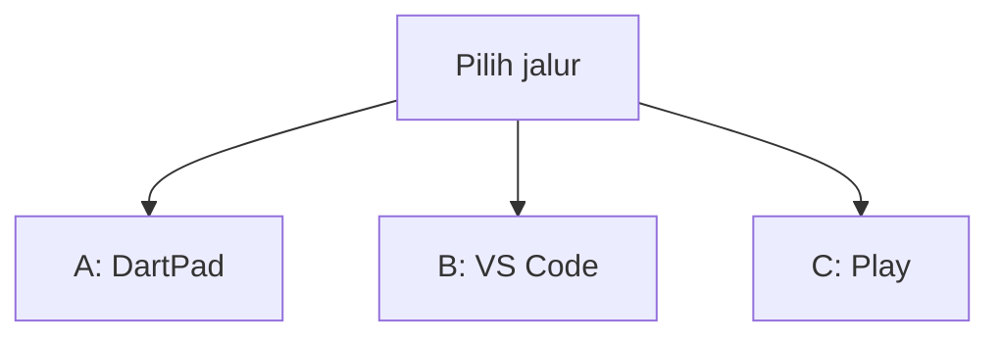
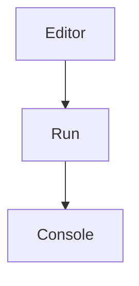
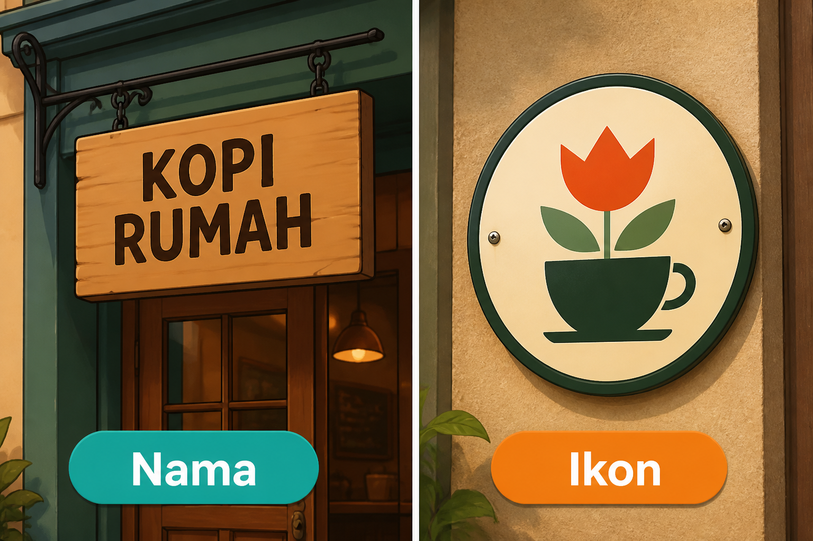
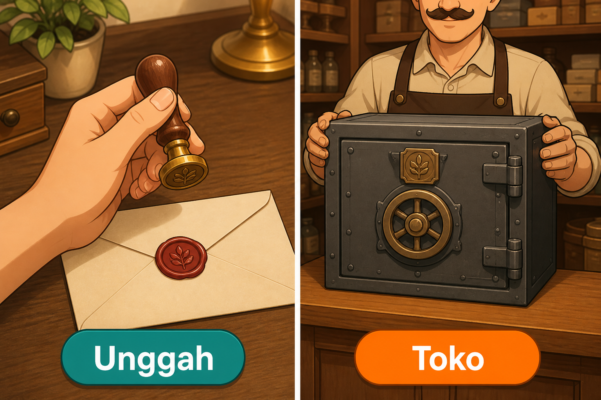
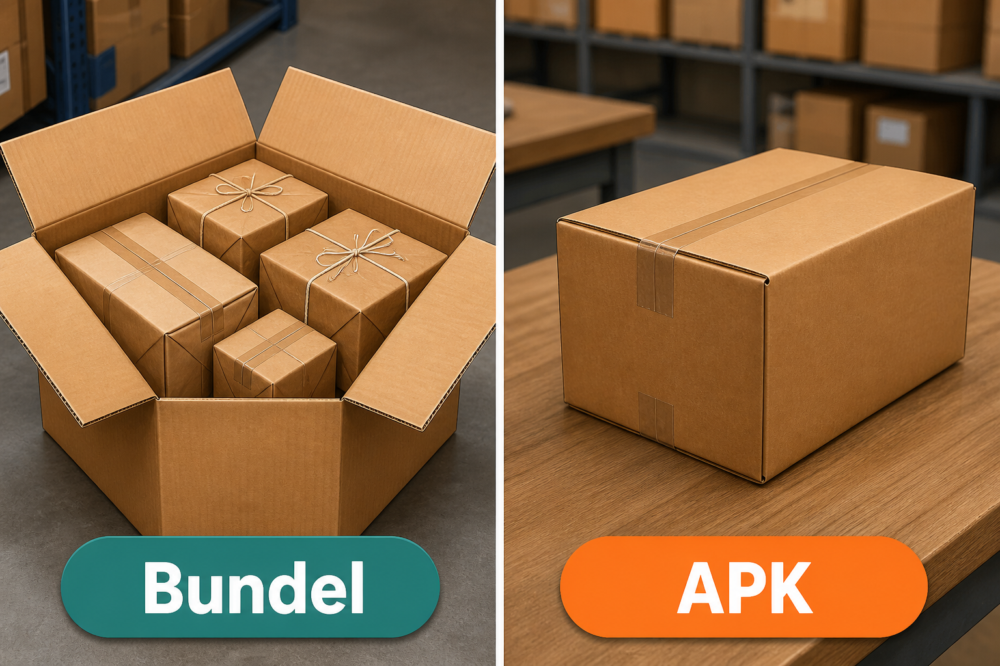
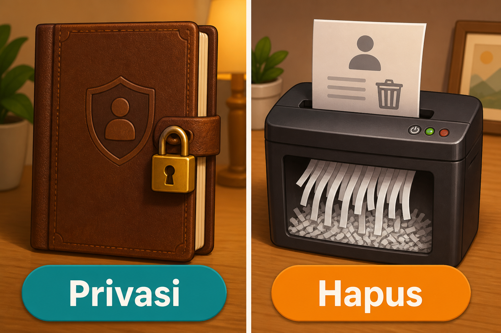
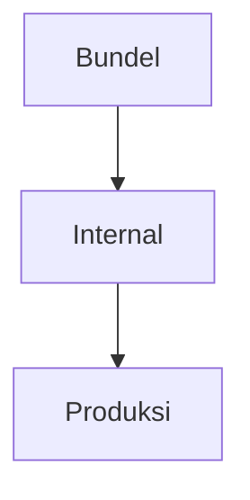

# Modul 10 — Rilis: dari laptop ke Play Store

**Waktu:** 2–3 sesi  
**Prasyarat:** Modul 00–09 (pernah `flutter run --release` atau setidaknya `flutter run`, app punya nama yang layak).  
**Hasil:** Nanti Anda bisa menyiapkan ikon dan versi, membuat kunci unggah, membangun App Bundle, mengisi listing + privasi, dan mengunggah ke **pengujian internal** — bukan langsung ke seluruh dunia.

Modul 09: app terasa rapi di HP Anda. Modul ini: orang **lain** bisa mengunduh lewat toko.

---

## Buka alat ini dulu

Hampir semua langkah hari ini **jalur B**. DartPad tidak menandatangani App Bundle, tidak membuka Play Console, dan tidak menyimpan keystore.

| Jalur | Buka | Untuk apa |
| --- | --- | --- |
| A | Browser → [dartpad.dev](https://dartpad.dev) → mode **Dart** | Membaca `1.0.0+1` (nama versi vs kode unggah) |
| B | VS Code + Terminal (`Ctrl + J`) + folder proyek Flutter | `keytool`, `flutter build appbundle`, `.gitignore` |
| C | Browser → [Play Console](https://play.google.com/console) | listing, Data safety, unggah `.aab` |



Letak tombol di DartPad (bukan sketsa):




Sumber gambar: [dart.dev/tools/dartpad](https://dart.dev/tools/dartpad), Dart team / Google ([CC BY 4.0](https://creativecommons.org/licenses/by/4.0/)). Foto resmi itu **tema gelap** dan **mode Dart**. Kalau kelihatan seperti kotak hitam, gulir sampai editor kiri dan tombol **Run** terlihat; itu bukan gambar rusak. Mode **Dart** pas untuk uji 1 (teks di Console). `flutter build` **tidak** diuji di sini.

### Dua jenis kode di halaman ini

| Jenis | Tanda | Caranya |
| --- | --- | --- |
| **Berkas lengkap** | Ada `void main()` | Tempel utuh, lalu **Run** (alat yang disebut di kotak uji) |
| **Cuplikan** | Hanya potongan | Jangan di-Run sendirian |

### Pola uji A — DartPad Dart

| | |
| --- | --- |
| **Buka** | [dartpad.dev](https://dartpad.dev) |
| **Pilih** | mode **Dart** |
| **Tempel** | **berkas lengkap** |
| **Klik** | **Run** |
| **Kalau berhasil** | Console di kanan menulis dua baris versi, bukan error merah |

### Pola uji B — proyek lokal

| | |
| --- | --- |
| **Buka** | VS Code di folder proyek Flutter |
| **Terminal** | `Ctrl + J` |
| **Ketik** | perintah di bagian 2 (keystore) atau bagian 4 (bundel), di folder proyek |
| **Kalau berhasil** | berkas `.jks` ada di folder rumah, atau `app-release.aab` ada di `build/` |

> **Aturan emas:** perintah `flutter ...` dan `keytool` hanya di **Terminal VS Code**. DartPad tidak membangun `.aab`. Jangan ketik sandi keystore di chat atau di GitHub.

Praktik di materi ini: **Windows → Android → Play Store**. iOS (bagian 11) hanya gambaran. Membangun iOS butuh Mac.

Akun [Google Play Console](https://play.google.com/console) berbayar (sekali, nominalnya cek situs resmi). Tanpa akun itu, Anda tetap bisa **membangun** `.aab` di laptop.

---

## 1. Nama, ikon, ID aplikasi, versi

Toko melihat tiga hal sebelum kode:

| Yang di toko | Dari mana | Jangan |
| --- | --- | --- |
| **Nama** yang dibaca orang | `android:label` / `CFBundleDisplayName` | nama latihan `com.example...` yang memalukan di etalase |
| **Ikon** | `mipmap` / `flutter_launcher_icons` | ikon Flutter default di produksi |
| **ID aplikasi** | `applicationId` (Android) | diubah **setelah** pernah diunggah ke Play |



*Ilustrasi asli materi mobile2026. Nama = papan yang dibaca orang. Ikon = lambang di dinding. Tulisan di papan hanya contoh kedai, bukan merek yang harus Anda pakai.*

`applicationId` biasanya domain terbalik: `id.namaanda.komunitasmini`. Setelah lolos Play, ID ini **tidak** boleh diganti. Sumber: [Build and release an Android app](https://docs.flutter.dev/deployment/android).

Versi ada di `pubspec.yaml`:

```yaml
version: 1.0.0+1
```

- `1.0.0` = **nama versi** yang dilihat orang (`versionName`)
- `+1` = **kode unggah** ke toko (`versionCode`). Tiap unggahan baru harus **lebih besar**. `1.0.1+2`, lalu `1.0.1+3`, dan seterusnya.

### Uji 1 — baca `1.0.0+1` di DartPad

| | |
| --- | --- |
| **Buka** | [dartpad.dev](https://dartpad.dev) |
| **Pilih** | mode **Dart** |
| **Tempel** | berkas lengkap di bawah |
| **Klik** | **Run** |
| **Kalau berhasil** | Console menulis `Nama versi: 1.0.0` dan `Kode unggah: 1` |

```dart
void main() {
  const mentah = '1.0.0+1';
  final bagian = mentah.split('+');
  final nama = bagian[0];
  final kode = bagian.length > 1 ? bagian[1] : '(kosong)';
  print('Nama versi: $nama');
  print('Kode unggah: $kode');
}
```

**Kalau berhasil:** Console menulis `Nama versi: 1.0.0` dan `Kode unggah: 1`.

Ikon: ikuti [flutter_launcher_icons](https://pub.dev/packages/flutter_launcher_icons) atau folder `mipmap` resmi. Siapkan PNG persegi sendiri (disarankan 1024×1024); materi ini tidak menyertakan berkas ikon.

---

## 2. Keystore: kunci yang jangan sampai hilang

App rilis harus **ditandatangani**. Tanpa itu, Play menolak unggahan.

`keytool` bagian dari Java yang ikut Android Studio / JDK. Kalau perintah tidak ketemu:

| | |
| --- | --- |
| **Buka** | Terminal VS Code |
| **Ketik** | perintah di bawah |

```text
flutter doctor -v
```

**Kalau berhasil:** cari baris `Java binary at:`. Ganti `java` di ujung path itu menjadi `keytool`.

Buat kunci unggah (Windows, PowerShell), dari dokumentasi Flutter:

| | |
| --- | --- |
| **Buka** | Terminal VS Code (bukan DartPad) |
| **Ketik** | perintah di bawah — **satu baris**, lalu jawab pertanyaan `keytool` |

```text
keytool -genkey -v -keystore $env:USERPROFILE\upload-keystore.jks -storetype JKS -keyalg RSA -keysize 2048 -validity 10000 -alias upload
```

**Kalau berhasil:** berkas `upload-keystore.jks` ada di folder pengguna Windows Anda (`C:\Users\...`). Ingat sandi. **Jangan** commit berkas ini.

Cuplikan `android/key.properties` (jalur B) — path Windows memakai `\\`:

```properties
storePassword=ISI_SENDIRI
keyPassword=ISI_SENDIRI
keyAlias=upload
storeFile=C:\\Users\\NAMA_ANDA\\upload-keystore.jks
```

Tambah ke `.gitignore`: `*.jks`, `key.properties`, `**/upload-keystore.jks`.

Gradle perlu diarahkan ke kunci itu. Proyek baru Flutter biasanya `android/app/build.gradle.kts`. Salin pola resmi di [Sign the app](https://docs.flutter.dev/deployment/android#sign-the-app) — cuplikan di situs itu lebih baru daripada yang dihafal dari tutorial 2022.

Sumber perintah: [Create an upload keystore](https://docs.flutter.dev/deployment/android#create-an-upload-keystore).

---

## 3. Dua kunci: yang Anda pegang vs yang dipegang toko



*Ilustrasi asli materi mobile2026. Unggah = cap yang Anda pegang di rumah. Toko = brankas kunci penandatangan yang dipegang Play.*

| Kunci | Siapa yang pegang | Kalau hilang |
| --- | --- | --- |
| **Unggah** (upload key) | Anda, di `.jks` | Play **bisa** ganti, lewat dukungan |
| **Penandatangan app** (app signing key) | Play App Signing | kalau Anda menolak Play dan pegang sendiri, lalu hilang: **update app itu selesai** |

Play App Signing **nyala otomatis** untuk app baru. Itu yang diinginkan. Jangan matikan “supaya lebih sakti.”

Sumber: [Use Play App Signing](https://support.google.com/googleplay/android-developer/answer/9842756).

Gejala klasik “key tidak cocok”: Anda mengunggah bundel yang ditandatangani kunci **lain** dari yang terdaftar. Satu proyek = satu kunci unggah, disimpan cadangan (USB terenkripsi / brankas, bukan repo publik).

---

## 4. App Bundle, bukan APK untuk toko

Play lebih suka **App Bundle** (`.aab`). Toko merakit APK pas untuk HP orang (jenis prosesor, bahasa, kerapatan layar). APK utuh masih berguna untuk uji di luar toko.



*Ilustrasi asli materi mobile2026. Bundel = satu kardus berisi beberapa paket. APK = satu paket siap diserahkan. Play membuka bundel, lalu mengirim yang dibutuhkan HP orang.*

| | |
| --- | --- |
| **Buka** | Terminal VS Code di folder proyek Flutter |
| **Ketik** | perintah di bawah |

```text
flutter build appbundle
```

**Kalau berhasil:** berkas  
`build/app/outputs/bundle/release/app-release.aab`  
ada. Perintah ini **rilis** (bukan debug).

Sumber: [Build an app bundle](https://docs.flutter.dev/deployment/android#build-an-app-bundle). Tentang format: [About Android App Bundles](https://developer.android.com/guide/app-bundle).

Jangan unggah APK debug. Jangan unggah hasil `flutter run`.

---

## 5. R8 dan ofuskasi: app lebih kecil, jejak lebih kabur

Rilis Android memakai **R8** (mengecilkan kode) secara bawaan. Anda tidak perlu menyalakan saklar khusus untuk “shrink.”

Ofuskasi **Dart** (nama fungsi jadi sulit dibaca) adalah langkah terpisah:

| | |
| --- | --- |
| **Buka** | Terminal VS Code di folder proyek |
| **Ketik** | perintah di bawah |

```text
flutter build appbundle --obfuscate --split-debug-info=build/app/outputs/symbols
```

**Kalau berhasil:** `.aab` rilis ada; folder `symbols` berisi peta untuk membaca crash nanti. **Jangan** unggah folder `symbols` ke repo publik. Simpan cadangan: tanpa itu, stack trace rilis sulit dibaca.

Sumber: [Obfuscate Dart code](https://docs.flutter.dev/deployment/obfuscate), [Shrink your code with R8](https://docs.flutter.dev/deployment/android#shrink-your-code-with-r8).

Mini proyek hari ini **tidak** wajib `--obfuscate`. Wajib: bundel rilis yang tertandatangan.

---

## 6. Etalase Play: teks, tangkapan layar, privasi

Play Console bukan DartPad. Isi yang sering ditolak kalau asal:

- judul pendek dan deskripsi yang jujur
- tangkapan layar HP (bukan foto laptop gelap)
- kategori yang cocok
- **URL kebijakan privasi** yang bisa dibuka tanpa login

Jangan menjiplak tangkapan layar orang lain. Jangan janji fitur yang app Anda tidak punya.

Sumber listing: [Set up your app](https://support.google.com/googleplay/android-developer/answer/9859154) (Play Console Help).

---

## 7. Kebijakan privasi harus punya URL

Play menolak listing tanpa tautan HTTPS yang terbuka. Boleh GitHub Pages atau berkas `docs/` di repo yang di-publish.



*Ilustrasi asli materi mobile2026. Privasi = orang bisa baca aturan. Hapus = akun dan data bisa diminta dihapus, bukan cuma “dinonaktifkan.”*

Ini **bukan** nasihat hukum. Contoh kerangka (ganti nama app dan kontak Anda):

```markdown
# Kebijakan privasi — [Nama App]

Terakhir diubah: 16 Agustus 2026.

App ini menyimpan [email / posting / foto — sebutkan yang benar].
Data dipakai untuk [login / menampilkan feed].
Tidak dijual ke pihak ketiga untuk iklan.

Kontak: [email Anda].

Kalau app punya akun: Anda bisa minta hapus akun di dalam app
dan lewat halaman [URL hapus akun].
```

Unggah sebagai GitHub Pages atau gist publik yang stabil. Tempel URL itu di Play Console.

Modul 09 sudah menyinggung UU PDP. Di toko, yang ditagih dulu: tautan yang **hidup** dan sesuai isi app.

---

## 8. Data safety dan hapus akun

Formulir **Data safety** di Play Console: Anda menyatakan data apa yang dikumpulkan, apakah dienkripsi, apakah bisa dihapus.

Kalau app **bisa daftar akun** (Modul 08):

1. Tombol hapus akun **di dalam app** (bukan cuma email ke admin yang tidak dibalas)
2. **Tautan web** untuk minta hapus, tanpa harus menginstal ulang app
3. Menghapus data terkait — “membekukan” akun tidak cukup

Sumber: [User data](https://support.google.com/googleplay/android-developer/answer/10144311), [Account deletion](https://support.google.com/googleplay/android-developer/answer/13327111).

Tanpa akun (kalkulator offline murni): tetap isi Data safety dengan jujur (“tidak mengumpulkan”). Jangan centang “kami kumpulkan lokasi” kalau kode tidak memintanya.

---

## 9. Tiga kejutan teknis: target SDK, 16 KB, tepi layar

Play menolak bundel yang target SDK-nya ketinggalan. Flutter mengatur `compileSdk` / `targetSdk` lewat nilai bawaannya. Jangan mengunci angka lama “supaya tidak rusak.” Sumber: [Android SDK versions](https://docs.flutter.dev/deployment/android#android-sdk-versions). Cek angka terkini di [Android setup](https://docs.flutter.dev/platform-integration/android/setup).

**16 KB page size:** mulai 1 November 2025, app baru dan update yang menarget Android 15+ harus mendukung halaman memori 16 KB di perangkat 64-bit. Flutter + plugin native yang usang sering jadi biang. Sikap hari ini: pakai Flutter stabil terbaru, unggah bundel, lalu lihat **App Bundle Explorer** di Console (bidang memory page size). Sumber: [Support 16 KB page sizes](https://developer.android.com/guide/practices/page-sizes).

**Tepi layar (edge-to-edge):** Android 15 menampilkan app sampai pinggir. Konten di bawah status bar / gesture bar mudah ketutup. `SafeArea` (Modul 02) dan tema Material 3 yang mutakhir biasanya menolong. Kalau listing lolos tapi tombol ketutup, itu bug tampilan — bukan “HP orang aneh.”

Jangan menghafal tiga topik ini sebagai mantra. Baca peringatan Play Console; perbaiki yang tertulis di sana.

---

## 10. Internal dulu, produksi belakangan



**Pengujian internal:** sampai 100 orang (akun Gmail yang Anda undang). Cocok untuk “apakah `.aab` ini ketelan Play.” Mini proyek **berhenti di sini**.

Produksi = etalase publik, rating, kebijakan penuh. Jangan lompat ke produksi di sesi yang sama dengan unggahan pertama.

Alur kasar di Console: All apps → Create app → Testing → Internal testing → Create new release → unggah `.aab`.

Sumber: [Internal testing](https://support.google.com/googleplay/android-developer/answer/9845334).

---

## 11. iOS: tahu pintunya, praktiknya di Mac

Dari Windows Anda **tidak** menandatangani IPA. Yang perlu diketahui:

- akun [Apple Developer](https://developer.apple.com) (berbayar, tahunan — cek situs resmi)
- Mac + Xcode
- App Store Connect, privasi App Store, bitcode sudah bukan cerita lama

Universal Links dan Info.plist sudah disinggung di Modul 08. Praktik rilis iOS = gelombang belakangan, atau kerjaan tim yang punya Mac.

---

## Mini proyek modul ini

Ambil **satu app lama** (Komunitas mini, daftar film, atau catatan). Jangan buat app baru dari nol.

Urutan kerja, jangan terbalik:

1. Ganti `applicationId` dari `com.example...` **sebelum** unggah pertama. Nama tampilan yang sopan. Ikon bukan default Flutter.
2. `pubspec.yaml`: `version: 1.0.0+1` (atau naikkan `+` kalau sudah pernah build rilis).
3. Keystore + `key.properties` (bagian 2). Pastikan `.gitignore` memuat keduanya.
4. Sambungkan tanda tangan rilis di Gradle (pola resmi Flutter).
5. Terminal:

| | |
| --- | --- |
| **Buka** | Terminal VS Code di folder proyek |
| **Ketik** | perintah di bawah |

```text
flutter build appbundle
```

**Kalau berhasil:** `app-release.aab` ada.

6. **Browser:** [play.google.com/console](https://play.google.com/console). Buat app. Listing singkat + URL privasi (bagian 7).
7. Data safety: jujur. Kalau ada daftar akun: tautan hapus + tombol di app (bagian 8).
8. Internal testing: unggah `.aab`. Undang 1–2 akun (boleh akun Anda yang lain).
9. Instal dari tautan internal di HP. Buka. Pastikan bukan ikon Flutter default.

**Kalau berhasil:** Play menerima bundel di jalur internal; HP uji menginstal versi rilis; keystore **tidak** ada di GitHub.

Produksi publik = bonus, bukan syarat lulus modul ini.

---

## Kesalahan yang sering terjadi

| Gejala | Penyebab yang sering | Perbaikan |
| --- | --- | --- |
| `keytool` tidak dikenali | bukan di PATH | `flutter doctor -v`, pakai path Java + `keytool` |
| `flutter build` di DartPad | bundel tidak ada di DartPad | Jalur B |
| Play: upload key mismatch | `.jks` berbeda dari yang terdaftar | kunci yang sama; atau minta reset upload key |
| `com.example` ditolak / memalukan | lupa ganti ID | ganti **sebelum** unggah pertama |
| Version code 1 sudah dipakai | `+1` tidak dinaikkan | `1.0.0+2` |
| Privasi 404 | URL salah atau repo privat | Pages publik, HTTPS |
| Reject hapus akun | cuma email, atau “bekukan” | in-app + URL web, hapus data |
| 16 KB warning | plugin native lama | Flutter + plugin terbaru; baca Explorer bundel |
| Keystore di GitHub | lupa `.gitignore` | hapus dari riwayat; ganti sandi; anggap bocor |

---

## Latihan

1. (DartPad) Ubah uji 1: `2.0.0+15` — pastikan nama versi dan kode unggah terpisah.
2. (Jalur B) Pastikan `git status` **tidak** menampilkan `.jks` atau `key.properties`.
3. (Jalur B) Naikkan hanya bagian `+` (kode), nama versi tetap, lalu build bundel lagi.
4. (Browser) Tulis satu halaman privasi 10–15 baris, publish, buka di HP tanpa login GitHub.
5. (Bonus) `--obfuscate` + simpan `symbols` di luar repo.

---

## Kuis singkat

1. Perintah `flutter build appbundle` diketik di mana?
2. `1.0.0+1` — mana yang harus naik tiap unggah ke Play?
3. Kalau kunci **unggah** hilang, apakah app itu otomatis mati selamanya?
4. Kenapa Play minta URL privasi, bukan PDF di laptop?
5. App yang punya daftar akun cukup “nonaktifkan akun” sebagai hapus?

Kunci jawaban di bawah. Coba jawab dulu.

---

## Apa yang belum dibahas

- Capstone utuh (auth + CRUD + offline + hapus akun) → **Modul 11**
- CI yang mengunggah `.aab` otomatis, Play API, staged rollout persen
- App Store iOS end-to-end, TestFlight
- Pembayaran dalam app (lampiran)

---

## Kunci kuis

1. Terminal VS Code di folder proyek Flutter, bukan DartPad.
2. Angka setelah `+` (`versionCode`). Nama `1.0.0` boleh sama, kodenya tidak.
3. Tidak, kalau Play App Signing nyala. Kunci unggah bisa diminta reset. Kunci penandatangan yang Anda pegang sendiri, lalu hilang: update berhenti.
4. Peninjau dan orang yang menginstal harus membuka tautan tanpa file lokal Anda.
5. Tidak. Beku ≠ hapus. Perlu jalur di app dan URL web.

---

## Sumber gambar dan tautan

| Aset | Sumber |
| --- | --- |
| `images/analogi-nama-ikon.png` | Ilustrasi asli materi mobile2026 |
| `images/analogi-unggah-toko.png` | Ilustrasi asli materi mobile2026 |
| `images/analogi-bundel-apk.png` | Ilustrasi asli materi mobile2026 |
| `images/analogi-privasi-hapus.png` | Ilustrasi asli materi mobile2026 |
| Tampilan DartPad | [dart.dev/assets/img/dartpad-hello.png](https://dart.dev/assets/img/dartpad-hello.png) dari [dart.dev/tools/dartpad](https://dart.dev/tools/dartpad) ([CC BY 4.0](https://creativecommons.org/licenses/by/4.0/)) |
| Rilis Android Flutter | [docs.flutter.dev/deployment/android](https://docs.flutter.dev/deployment/android) |
| Play App Signing | [support.google.com/.../9842756](https://support.google.com/googleplay/android-developer/answer/9842756) |
| App Bundles | [developer.android.com/guide/app-bundle](https://developer.android.com/guide/app-bundle) |
| Ofuskasi Dart | [docs.flutter.dev/deployment/obfuscate](https://docs.flutter.dev/deployment/obfuscate) |
| R8 | [docs.flutter.dev/deployment/android#shrink-your-code-with-r8](https://docs.flutter.dev/deployment/android#shrink-your-code-with-r8) |
| Listing Play | [support.google.com/.../9859154](https://support.google.com/googleplay/android-developer/answer/9859154) |
| User data / Data safety | [support.google.com/.../10144311](https://support.google.com/googleplay/android-developer/answer/10144311) |
| Hapus akun | [support.google.com/.../13327111](https://support.google.com/googleplay/android-developer/answer/13327111) |
| 16 KB page size | [developer.android.com/guide/practices/page-sizes](https://developer.android.com/guide/practices/page-sizes) |
| Internal testing | [support.google.com/.../9845334](https://support.google.com/googleplay/android-developer/answer/9845334) |
| `flutter_launcher_icons` | [pub.dev/packages/flutter_launcher_icons](https://pub.dev/packages/flutter_launcher_icons) |
| Play Console | [play.google.com/console](https://play.google.com/console) |
| Apple Developer | [developer.apple.com](https://developer.apple.com) |
| Android setup (SDK) | [docs.flutter.dev/platform-integration/android/setup](https://docs.flutter.dev/platform-integration/android/setup) |

Flutter, Firebase, Google Play, and Google and the related logos are trademarks of Google LLC. We are not endorsed by or affiliated with Google LLC. Apple, App Store, and Xcode are trademarks of Apple Inc.
