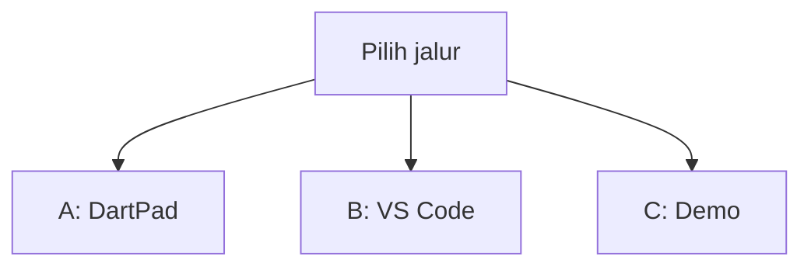
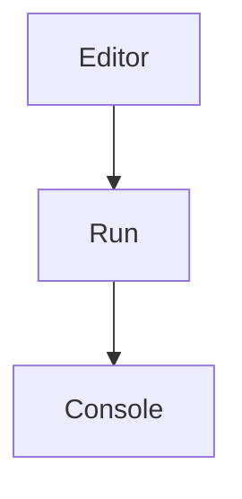
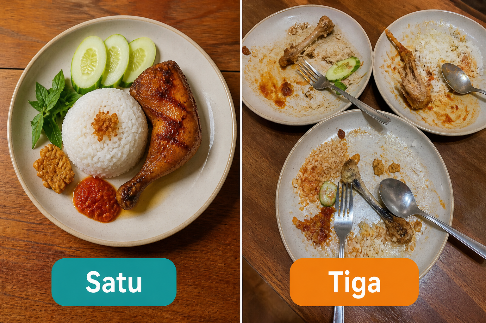
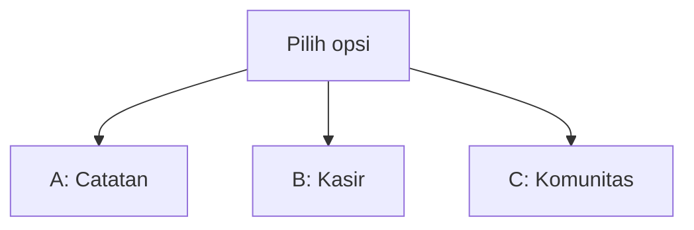
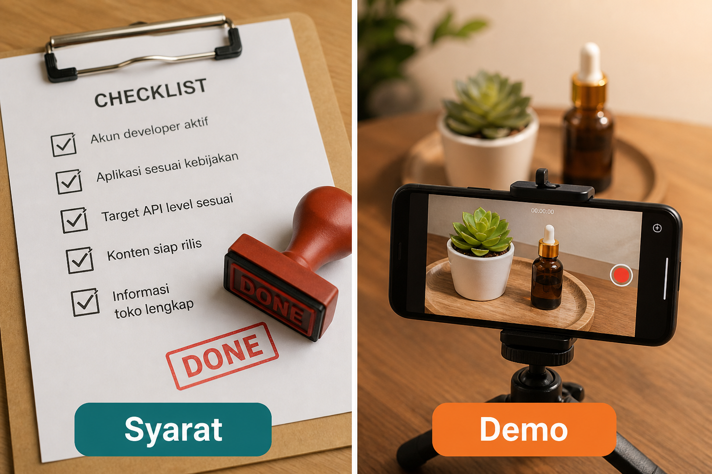
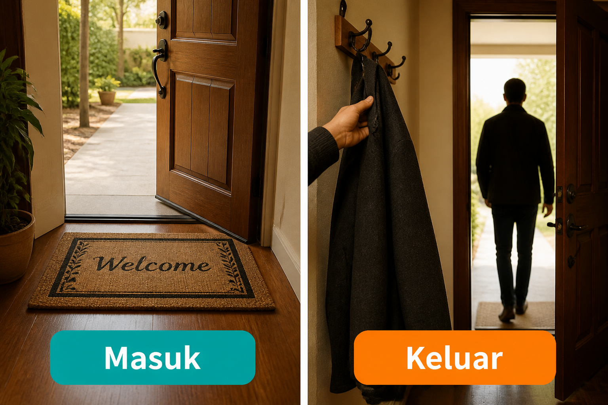
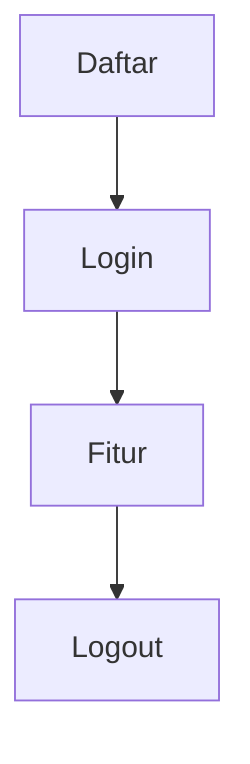
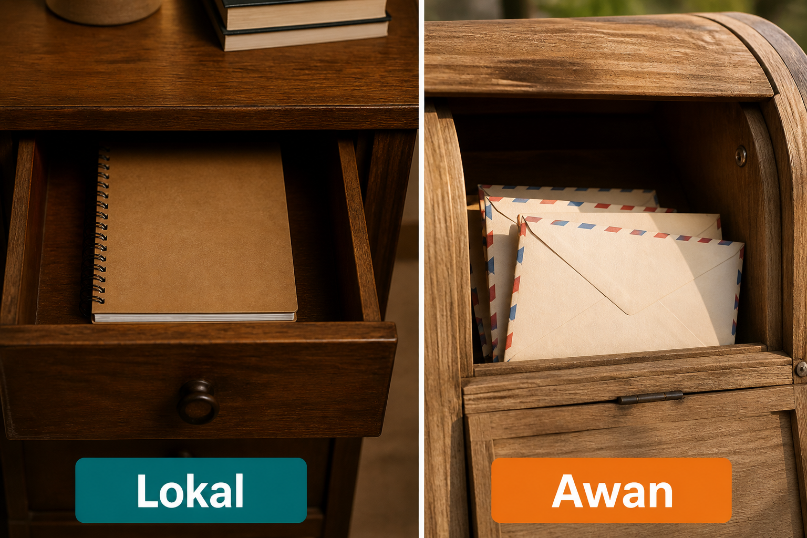

# Modul 11 — Capstone: satu produk utuh

**Waktu:** 4–6 sesi  
**Prasyarat:** Modul 00–10 (pernah login, pernah simpan data, pernah layar kosong/gagal, pernah `flutter build appbundle` atau setidaknya `flutter run`).  
**Hasil:** Nanti Anda punya **satu** app yang bisa didaftar, dipakai fitur intinya, logout, menyimpan data, menampilkan tunggu/kosong/gagal/offline, tanpa rahasia di kode, plus README dan rekaman demo 1 menit.

Modul 10: orang lain *bisa* mengunduh. Modul ini: app itu **layak disebut produk**, bukan tumpukan latihan.

Ini **bukan** paket baru. Yang dipakai: `go_router`, `provider`, Firebase dan/atau `dio`, `flutter_secure_storage`, SQLite/Drift, pola Modul 08–10. Jangan ganti ke GetX “supaya lebih cepat.”

---

## Buka alat ini dulu

Capstone hampir seluruhnya **jalur B**. DartPad tidak menyimpan Firestore, tidak membuka kamera, dan tidak merekam demo.

| Jalur | Buka | Untuk apa |
| --- | --- | --- |
| A | Browser → [dartpad.dev](https://dartpad.dev) → mode **Dart** | Cek daftar syarat lulus (enam kotak) |
| B | VS Code + Terminal (`Ctrl + J`) + emulator/HP | App utuh: auth, data, empat wajah layar |
| C | HP + kamera (boleh kamera Windows) | Tangkapan layar + rekaman 1 menit |



Letak tombol di DartPad (bukan sketsa):




Sumber gambar: [dart.dev/tools/dartpad](https://dart.dev/tools/dartpad), Dart team / Google ([CC BY 4.0](https://creativecommons.org/licenses/by/4.0/)). Foto resmi itu **tema gelap** dan **mode Dart**. Kalau kelihatan seperti kotak hitam, gulir sampai editor kiri dan tombol **Run** terlihat; itu bukan gambar rusak. Mode **Dart** pas untuk uji 1 (teks di Console). App capstone **tidak** diuji di sini.

### Dua jenis kode di halaman ini

| Jenis | Tanda | Caranya |
| --- | --- | --- |
| **Berkas lengkap** | Ada `void main()` | Tempel utuh, lalu **Run** (alat yang disebut di kotak uji) |
| **Cuplikan** | Hanya potongan | Jangan di-Run sendirian |

### Pola uji A — DartPad Dart

| | |
| --- | --- |
| **Buka** | [dartpad.dev](https://dartpad.dev) |
| **Pilih** | mode **Dart** |
| **Tempel** | **berkas lengkap** |
| **Klik** | **Run** |
| **Kalau berhasil** | Console menulis `LULUS` atau daftar yang masih kurang, bukan error merah |

### Pola uji B — proyek lokal

| | |
| --- | --- |
| **Buka** | VS Code di folder proyek Flutter, emulator atau HP sudah menyala |
| **Terminal** | `Ctrl + J` |
| **Ketik** | perintah di mini proyek, di folder proyek |
| **Kalau berhasil** | `flutter run` menampilkan app; alur daftar → login → fitur → logout jalan |

> **Aturan emas:** perintah `flutter ...` hanya di **Terminal VS Code**. DartPad tidak menjalankan capstone. Jangan commit `google-services.json`, `.jks`, atau `key.properties`.

Praktik di materi ini: **Windows → Android**. iOS butuh Mac. Unggah Play internal (Modul 10) **bonus**, bukan syarat lulus capstone.

---

## 1. Satu piring, bukan tiga



*Ilustrasi asli materi mobile2026. Satu = hidangan yang selesai. Tiga = tiga piring setengah jadi. Pilih satu opsi. Jangan tiga sekaligus.*

Silabus punya Opsi A, B, dan C. Itu **menu**, bukan daftar belanja. Tulis pilihan Anda di README proyek **hari pertama**, sebelum nambah fitur.



| Opsi | Cocok kalau | Inti yang wajib |
| --- | --- | --- |
| **A — Catatan kuliah cloud** | Anda paling nyaman di Firebase (Modul 06 + 08) | Auth email, CRUD catatan, foto, gelap, hapus akun |
| **B — Kasir UMKM offline-first** | Anda ingin stok yang tidak rusak saat sinyal putus | Produk Rupiah, transaksi, stok, laporan, data lokal + cadangan |
| **C — Komunitas / forum mini** | Anda sudah punya feed Modul 08 | Auth + reset sandi, feed + halaman, komentar, 1 push, admin, hapus akun |

**Disarankan sebagai proyek pertama: Opsi A.** B dan C lebih mudah tersesat di stok atau di rules.

Ambil **app lama** (catatan, komunitas mini, daftar film) lalu rapikan. Jangan `flutter create` dari nol kecuali repo lama sudah kacau.

---

## 2. Enam syarat lulus — bukan selera



*Ilustrasi asli materi mobile2026. Syarat = daftar yang dicap selesai. Demo = bukti 1 menit di HP, bukan centang di README tanpa rekaman.*

Dari [SILABUS.md](../SILABUS.md):

1. Ada alur **daftar → login → fitur inti → logout**
2. Data tersimpan (**lokal dan/atau cloud**)
3. **Error, loading, empty, dan offline** ditangani
4. Token/rahasia **tidak** ada di SharedPreferences atau di dalam kode
5. **README** berisi cara menjalankan
6. **Screenshot + 1 menit** rekaman demo

Kalau salah satu kosong, capstone belum lulus. Mode gelap, FCM, atau Play internal **tidak** menggantikan nomor 1–6.

### Uji 1 — baca enam kotak di DartPad

| | |
| --- | --- |
| **Buka** | [dartpad.dev](https://dartpad.dev) |
| **Pilih** | mode **Dart** |
| **Tempel** | berkas lengkap di bawah |
| **Klik** | **Run** |
| **Kalau berhasil** | Console menulis `Masih kurang:` lalu dua baris, bukan `LULUS` |

Ganti `true`/`false` sesuai app **Anda**. Cuplikan ini contoh orang yang belum punya README dan demo.

```dart
void main() {
  const syarat = {
    'daftar-login-fitur-logout': true,
    'data tersimpan': true,
    'tunggu/kosong/gagal/offline': true,
    'rahasia bukan di SharedPreferences': true,
    'README cara menjalankan': false,
    'screenshot + demo 1 menit': false,
  };

  final kurang = [
    for (final e in syarat.entries)
      if (!e.value) e.key,
  ];

  if (kurang.isEmpty) {
    print('LULUS');
  } else {
    print('Masih kurang:');
    for (final k in kurang) {
      print('- $k');
    }
  }
}
```

**Kalau berhasil:** Console menulis `Masih kurang:` plus `README cara menjalankan` dan `screenshot + demo 1 menit`. Ubah semua jadi `true` di DartPad kalau app Anda sudah lengkap — itu **bukan** pengganti cek di HP.

---

## 3. Alur orang: masuk dulu, keluar juga



*Ilustrasi asli materi mobile2026. Masuk = daftar lalu login. Keluar = logout yang benar-benar menutup sesi, bukan cuma ganti halaman.*



Jangan gambar panah balik di mermaid materi ini (GitHub sering menampilkannya seperti error). Di app, orang **boleh** daftar lagi setelah logout — itu di kode, bukan di diagram.

| Langkah | Yang orang lihat | Jangan |
| --- | --- | --- |
| Daftar | form email + sandi, lalu cek surat (Modul 08) | anonymous “supaya hemat waktu” sebagai satu-satunya pintu |
| Login | gerbang; belum verifikasi = belum masuk fitur | tombol login yang tidak melakukan apa-apa |
| Fitur inti | Opsi A: daftar catatan. B: kasir. C: feed | tiga fitur setengah jadi |
| Logout | kembali ke login; token hilang dari brankas | cuma `go('/')` tanpa `signOut` |

Cuplikan gerbang (jalur B, `go_router` + auth) — **jangan** di-Run di DartPad:

```dart
// Cuplikan. redirect di GoRouter: belum login → /login
redirect: (context, state) {
  final masuk = auth.currentUser != null;
  final diLogin = state.matchedLocation == '/login';
  if (!masuk && !diLogin) return '/login';
  if (masuk && diLogin) return '/';
  return null;
},
```

Sumber pola: [go_router](https://pub.dev/packages/go_router), Modul 03 dan 08.

---

## 4. Data: di HP, di awan, atau keduanya



*Ilustrasi asli materi mobile2026. Lokal = laci di meja (HP). Awan = surat yang berangkat (Firestore / API). Opsi A menonjolkan awan. Opsi B menonjolkan laci, lalu cadangan.*

| Opsi | Utama | Cadangan / sinkron |
| --- | --- | --- |
| A | Firestore + Storage (foto) | boleh cache gambar (`cached_network_image`) |
| B | SQLite / Drift di HP | backup ke cloud saat sinyal ada |
| C | Firestore (posting, komentar) | pagination, jangan unduh gudang sekaligus (Modul 07) |

Token login: [`flutter_secure_storage`](https://pub.dev/packages/flutter_secure_storage), bukan SharedPreferences. Modul 05 dan 09 sudah menyinggung ini.

Opsi B, stok: satu transaksi = satu pengurangan. Double-tap tombol bayar **tidak** boleh stok minus. Nonaktifkan tombol selama simpan, atau pakai transaksi SQLite/Firestore. Analoginya sama dengan kasir Modul 06: jangan lomba tanpa antrian.

---

## 5. Empat wajah layar, plus offline

Ini Modul 09, dipakai sungguhan:

| Wajah | Orang melihat |
| --- | --- |
| Tunggu | spinner atau skeleton, tombol tidak “mati” tanpa keterangan |
| Kosong | “Belum ada catatan” + tombol tambah — bukan layar putih |
| Ada | daftar / keranjang / feed |
| Gagal | pesan manusia + coba lagi |
| Offline | banner atau teks jujur; Opsi B **tetap** bisa transaksi lokal |

`SafeArea` (Modul 02) tetap dipasang. Android 15 menempel ke tepi layar (Modul 10).

Harga di Opsi B: `intl` `NumberFormat.currency` locale `id`, `symbol: 'Rp'` (Modul 09). Jangan `"Rp" + harga.toString()`.

---

## 6. Rahasia, rules, hapus akun

| Yang dilarang | Yang dipakai |
| --- | --- |
| kunci API di `lib/` | `--dart-define` / Console, bukan commit |
| token di SharedPreferences | `flutter_secure_storage` |
| `if (email == 'admin@...')` sebagai satpam | [Firestore rules](https://firebase.google.com/docs/firestore/security/get-started) / cek server |
| “bekukan akun” sebagai hapus | hapus di app **dan** URL web (Modul 10) |

Opsi A dan C punya daftar akun → syarat Play: tombol hapus + tautan publik. Kerangka kebijakan ada di Modul 10. Ini **bukan** nasihat hukum.

Opsi C: admin hapus konten harus lolos **rules**, bukan hanya tombol yang disembunyikan di UI (Modul 06 + 08).

---

## 7. README cara menjalankan

Orang lain (atau Anda bulan depan) harus bisa menyalakan proyek tanpa menebak. Minimal:

```markdown
# Nama app — opsi A / B / C

## Yang perlu
- Flutter SDK (versi yang Anda pakai)
- Akun Firebase / URL API (sebutkan yang benar)

## Langkah
1. git clone …
2. flutter pub get
3. (Firebase) flutterfire configure — atau salin berkas yang *tidak* di-commit, jelaskan di sini
4. flutter run

## Akun uji
- email: … (boleh akun dummy)
```

Jangan tempel sandi sungguhan. Jangan tempel isi `google-services.json`.

Sumber pola README: repo ini sendiri, plus [Flutter install](https://docs.flutter.dev/install).

---

## 8. Bukti: tangkapan layar dan 1 menit

Bukan sketsa, bukan foto laptop gelap dari jauh.

1. Tangkapan layar HP: login, fitur inti, satu wajah kosong atau gagal.
2. Rekaman ± **1 menit**: daftar atau login → satu aksi inti (tambah catatan / bayar / posting) → logout.
3. Simpan di folder `docs/` proyek Anda atau unggah privat. Di README tulis nama berkasnya.

Jangan menjiplak tangkapan Play Store orang lain. Jangan demo di DartPad lalu mengaku itu HP.

---

## 9. Rilis toko: bonus, bukan pengganti demo

Kalau waktu tersisa: ikon, `applicationId`, bundel, pengujian internal (Modul 10).

Capstone **lulus tanpa** produksi Play. Jangan menunda README dan demo 1 menit karena menunggu review toko.

---

## 10. Folder yang rapi cukup, bukan arsitektur pamer

Cuplikan pohon (jalur B), pola Modul 04:

```text
lib/
  ui/          layar, widget
  data/        model, penyimpanan
  services/    Firebase, dio, auth
  main.dart
```

`provider` untuk state yang dibagi. `go_router` untuk rute. Jangan GetX. Jangan memindahkan semua berkas di hari terakhir “supaya Clean Architecture.”

---

## Mini proyek modul ini

Ini **satu-satunya** proyek modul. Urutan jangan terbalik.

### Hari 1 — pilih dan kunci ruang lingkup

1. Tulis di README: **Opsi A / B / C** (satu huruf).
2. Salin enam syarat lulus ke README sebagai kotak centang.
3. Jalankan uji 1 di DartPad. Semua `false` dulu boleh — itu peta, bukan nilai.

### Hari 2 — pintu masuk

4. Email + sandi (dan verifikasi kalau Opsi A/C). Google opsional.
5. `go_router` + redirect. Logout memanggil `signOut` / hapus token brankas.

| | |
| --- | --- |
| **Buka** | VS Code, emulator/HP menyala |
| **Terminal** | `Ctrl + J` di folder proyek |
| **Ketik** | perintah di bawah |

```text
flutter run
```

**Kalau berhasil:** dari dingin, orang bisa daftar atau login, lalu logout kembali ke gerbang.

### Hari 3–4 — fitur inti

6. **A:** CRUD catatan (judul, isi, mata kuliah, tanggal) + 1 foto (izin + kompres, Modul 08) + mode gelap.
7. **B:** daftar produk (Rp), transaksi, stok tidak minus saat double-tap, laporan harian, banner offline.
8. **C:** feed + pagination, komentar, reset sandi, 1 notifikasi push, admin hapus (dicek rules).

### Hari 5 — wajah layar dan rahasia

9. Tunggu / kosong / gagal / offline di **satu** daftar utama.
10. Grep proyek: tidak ada token di SharedPreferences; `.gitignore` memuat kunci.

| | |
| --- | --- |
| **Buka** | Terminal VS Code di folder proyek |
| **Ketik** | perintah di bawah |

```text
flutter analyze
```

**Kalau berhasil:** `No issues found!` atau sisa peringatan yang Anda pahami, bukan error yang diabaikan.

### Hari 6 — bukti

11. README cara menjalankan (bagian 7).
12. Screenshot + rekaman 1 menit (bagian 8).
13. Opsi A/C: tombol hapus akun + tautan draf privasi (Modul 10).
14. (Bonus) `flutter build appbundle` dan internal testing.

**Kalau berhasil:** enam kotak silabus tercentang; uji 1 di DartPad bisa Anda set semua `true` **karena HP sudah membuktikan**, bukan karena diketik asal.

---

## Kesalahan yang sering terjadi

| Gejala | Penyebab yang sering | Perbaikan |
| --- | --- | --- |
| Tiga opsi dikerjakan 20% | takut “salah pilih” | kunci A atau B atau C di hari 1 |
| Anonymous sebagai login | hemat waktu | daftar email (Modul 08) |
| Logout tidak keluar | hanya ganti rute | `signOut` + hapus token |
| Stok minus | double-tap | nonaktifkan tombol; transaksi |
| Layar putih saat daftar kosong | lupa empty | Modul 09 |
| Token di SharedPreferences | kebiasaan Modul 05 key-value | pindah ke secure storage |
| README cuma judul | dikira “nanti” | syarat 5 — tanpa ini tidak lulus |
| Demo 8 menit / tanpa logout | rekaman ikut ngoding | 1 menit: masuk → aksi → keluar |
| Admin di UI saja | `if (email == …)` | rules / server |
| GetX di hari terakhir | tutorial YouTube | tetap `provider` + `go_router` |

---

## Latihan

1. (DartPad) Uji 1: set lima `true`, satu `false` — pastikan nama yang kurang tercetak.
2. (Jalur B) Dari HP dingin: daftar → fitur → logout → login lagi. Data orang itu masih ada.
3. (Jalur B) Matikan Wi‑Fi. Opsi A/C: tampil jujur gagal/offline. Opsi B: transaksi lokal tetap jalan.
4. (Jalur B) Cari di proyek: `SharedPreferences` yang menyimpan token — harusnya nol.
5. (Bonus) Satu tes widget: tombol logout terlihat di layar akun.

---

## Kuis singkat

1. Kenapa capstone tidak boleh mengerjakan A, B, dan C bersamaan?
2. Logout yang hanya `context.go('/login')` tanpa `signOut` — lulus syarat 1?
3. SharedPreferences untuk **tema gelap** — apakah itu melanggar syarat rahasia?
4. App tanpa README, tapi demo 1 menit bagus — lulus?
5. Unggah Play internal tanpa rekaman demo — lulus capstone?

Kunci jawaban di bawah. Coba jawab dulu.

---

## Apa yang belum dibahas

Jalur wajib **12 modul berhenti di sini**. Yang belakangan:

- Lampiran L1–L9 (peta, bayar, Supabase, Crashlytics, Actions, …)
- CI mengunggah `.aab`, staged rollout
- App Store iOS end-to-end
- GetX / Riverpod / Bloc sebagai standar (sengaja tidak)

---

## Kunci kuis

1. Tiga piring setengah jadi tidak lulus enam syarat. Satu yang selesai lulus.
2. Tidak. Sesi masih hidup. Syarat 1 minta logout sungguhan.
3. Tidak. Tema bukan token. Yang dilarang: kunci API dan token di SharedPreferences atau di `lib/`.
4. Tidak. Syarat 5 berdiri sendiri.
5. Tidak. Play bonus; demo 1 menit + README wajib.

---

## Sumber gambar dan tautan

| Aset | Sumber |
| --- | --- |
| `images/analogi-satu-tiga.png` | Ilustrasi asli materi mobile2026 |
| `images/analogi-masuk-keluar.png` | Ilustrasi asli materi mobile2026 |
| `images/analogi-lokal-awan.png` | Ilustrasi asli materi mobile2026 |
| `images/analogi-syarat-demo.png` | Ilustrasi asli materi mobile2026 |
| Tampilan DartPad | [dart.dev/assets/img/dartpad-hello.png](https://dart.dev/assets/img/dartpad-hello.png) dari [dart.dev/tools/dartpad](https://dart.dev/tools/dartpad) ([CC BY 4.0](https://creativecommons.org/licenses/by/4.0/)) |
| Silabus capstone | [SILABUS.md](../SILABUS.md) |
| `go_router` | [pub.dev/packages/go_router](https://pub.dev/packages/go_router) |
| `provider` | [pub.dev/packages/provider](https://pub.dev/packages/provider) |
| `flutter_secure_storage` | [pub.dev/packages/flutter_secure_storage](https://pub.dev/packages/flutter_secure_storage) |
| Firestore rules | [firebase.google.com/docs/firestore/security/get-started](https://firebase.google.com/docs/firestore/security/get-started) |
| `intl` | [pub.dev/packages/intl](https://pub.dev/packages/intl) |
| Instalasi Flutter | [docs.flutter.dev/install](https://docs.flutter.dev/install) |
| Modul 08 fitur | [modul-08-fitur/README.md](../modul-08-fitur/README.md) |
| Modul 09 kualitas | [modul-09-kualitas/README.md](../modul-09-kualitas/README.md) |
| Modul 10 rilis | [modul-10-rilis/README.md](../modul-10-rilis/README.md) |

Flutter, Firebase, Google Play, and Google and the related logos are trademarks of Google LLC. We are not endorsed by or affiliated with Google LLC.
