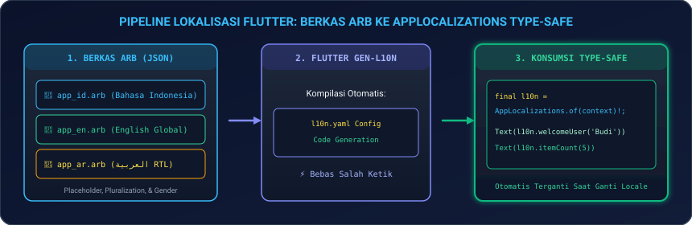
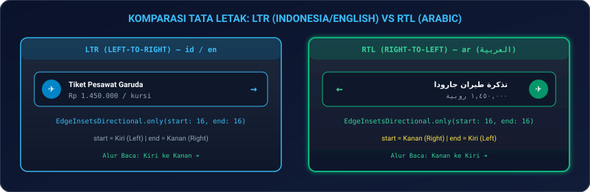
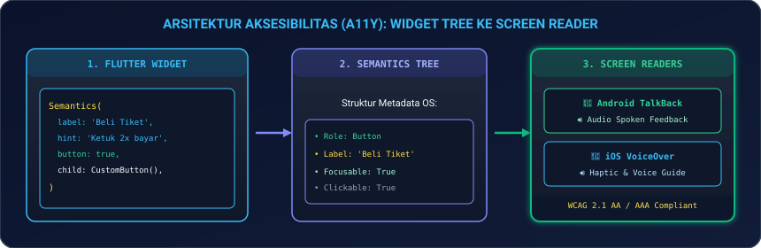
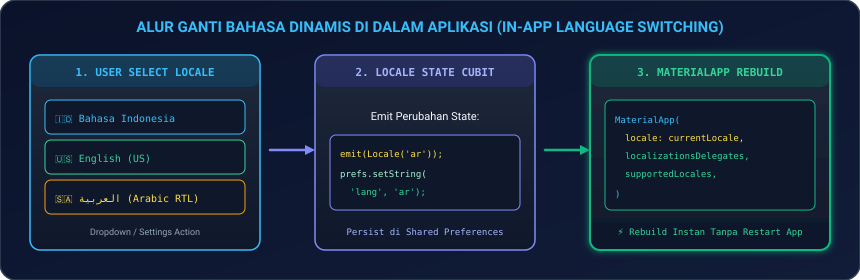

# Modul 11: Internasionalisasi (i18n), Multi-Bahasa, & Aksesibilitas (a11y)

Selamat datang di **Modul 11**! Sebuah aplikasi modern kelas dunia tidak hanya dibangun untuk satu negara atau satu kelompok pengguna saja. Aplikasi yang sukses harus mampu menjangkau pasar global dengan berbagai bahasa (**Internasionalisasi / i18n & Lokalisasi / l10n**), mendukung orientasi tulisan kanan-ke-kiri (**RTL / Arabic Support**), serta inklusif dan ramah bagi penyandang disabilitas (**Aksesibilitas / a11y & Screen Readers**).

Di modul ini, Anda akan menguasai cara membangun aplikasi Flutter yang inklusif dan siap mendunia: mulai dari manajemen berkas translasi **ARB**, penanganan angka jamak (*Plurals*) dan mata uang lokal (**`intl`**), layout otomatis **RTL (Right-to-Left)**, penyematan metadata pembaca layar (**`Semantics`, `MergeSemantics`, & `ExcludeSemantics` untuk TalkBack & VoiceOver**), hingga fitur **In-App Dynamic Language Switching** tanpa restart aplikasi.

---

## 🌍 1. Analogi: Hotel Bintang 5 Bertaraf Internasional

Untuk memahami bagaimana i18n, l10n, dan a11y bekerja bersama:

| Konsep | Analogi Hotel Internasional | Penjelasan Teknis di Flutter |
|---|---|---|
| **i18n (Internationalization)** | **Infrastruktur Hotel yang Fleksibel** | Menyiapkan kerangka kode Flutter agar siap menerima bahasa, format angka, dan mata uang apa pun tanpa merusak tampilan. |
| **l10n (Localization)** | **Buku Menu Khusus Tiap Bahasa** | Berkas terjemahan konkret (`app_id.arb`, `app_en.arb`, `app_ar.arb`) yang berisi teks lokal spesifik per negara. |
| **RTL (Right-to-Left)** | **Pintu & Alur Masuk Khusus Tamu Arab** | Membalik seluruh tata letak (*mirroring layout*) otomatis dari kanan ke kiri untuk bahasa seperti Arab dan Ibrani. |
| **a11y (Accessibility)** | **Jalur Kursi Roda & Pemandu Braille** | Metadata `Semantics` yang bersuara melalui *Screen Reader* (TalkBack/VoiceOver) memandu tuna netra saat menavigasi aplikasi. |
| **Dynamic Switcher** | **Tombol Pilihan Bahasa di Resepsionis** | Mengubah bahasa dan format mata uang aplikasi secara langsung di saat runtime tanpa perlu merestart ponsel. |

---

## 📜 2. Internasionalisasi & Berkas ARB (`flutter_localizations`)

Flutter menggunakan berkas berekstensi `.arb` (*Application Resource Bundle*) yang berbasis JSON untuk menyimpan seluruh string terjemahan secara terstruktur.

<p align="center">
  
</p>

### 2.1 Konfigurasi `l10n.yaml` di Root Proyek

Buat file `l10n.yaml` di root direktori proyek Anda:

```yaml
arb-dir: lib/l10n
template-arb-file: app_en.arb
output-localization-file: app_localizations.dart
```

---

### 2.2 Berkas Terjemahan Bahasa: `app_en.arb`, `app_id.arb`, & `app_ar.arb`

#### 📄 `lib/l10n/app_en.arb` (Bahasa Inggris)
```json
{
  "@@locale": "en",
  "appTitle": "Global Booking 2026",
  "welcomeUser": "Welcome back, {userName}!",
  "@welcomeUser": {
    "placeholders": {
      "userName": { "type": "String" }
    }
  },
  "ticketCount": "{count, plural, =0{No tickets booked} =1{1 ticket booked} other{{count} tickets booked}}",
  "@ticketCount": {
    "placeholders": {
      "count": { "type": "int" }
    }
  }
}
```

#### 📄 `lib/l10n/app_id.arb` (Bahasa Indonesia)
```json
{
  "@@locale": "id",
  "appTitle": "Pemesanan Global 2026",
  "welcomeUser": "Selamat datang kembali, {userName}!",
  "ticketCount": "{count, plural, =0{Belum ada tiket} other{{count} tiket dipesan}}"
}
```

#### 📄 `lib/l10n/app_ar.arb` (Bahasa Arab)
```json
{
  "@@locale": "ar",
  "appTitle": "الحجز العالمي ٢٠٢٦",
  "welcomeUser": "مرحبًا بعودتك، {userName}!",
  "ticketCount": "{count, plural, =0{لا توجد تذاكر} =1{تذكرة واحدة} =2{تذكرتان} few{{count} تذاكر} other{{count} تذكرة}}"
}
```

---

### 2.3 Format Mata Uang, Angka, dan Tanggal Lokalisasi (`intl`)

```dart
import 'package:intl/intl.dart';

class LocalizedFormatter {
  // Format Mata Uang Sesuai Locale (Contoh: Rp 1.500.000 vs $1,500.00)
  static String formatCurrency(double amount, String locale) {
    if (locale == 'id') {
      return NumberFormat.currency(locale: 'id_ID', symbol: 'Rp ', decimalDigits: 0).format(amount);
    } else if (locale == 'ar') {
      return NumberFormat.currency(locale: 'ar_SA', symbol: 'ر.س ', decimalDigits: 2).format(amount);
    } else {
      return NumberFormat.currency(locale: 'en_US', symbol: '\$', decimalDigits: 2).format(amount);
    }
  }

  // Format Tanggal Terlokalisasi
  static String formatDate(DateTime date, String locale) {
    return DateFormat.yMMMMEEEEd(locale).format(date);
  }
}
```

---

## 🔄 3. Dukungan Tata Letak Kanan-ke-Kiri (RTL Support)

Bahasa seperti Arab, Persia, dan Ibrani dibaca dari **kanan ke kiri**. Flutter secara otomatis mendukung RTL jika Anda mengikuti kaidah directional padding.

<p align="center">
  
</p>

### 3.1 Aturan Emas RTL di Flutter:
> 🚫 **DILARANG MENGGUNAKAN**: `EdgeInsets.only(left: 16, right: 8)` atau `Alignment.centerLeft`  
> ✅ **GUNAKAN SELALU**: `EdgeInsetsDirectional.only(start: 16, end: 8)` atau `AlignmentDirectional.centerStart`

```dart
Widget buildAdaptiveCard(BuildContext context) {
  final isRtl = Directionality.of(context) == TextDirection.rtl;

  return Container(
    padding: const EdgeInsetsDirectional.only(start: 16.0, end: 12.0, top: 14.0, bottom: 14.0),
    child: Row(
      children: [
        const Icon(Icons.flight_takeoff),
        const SizedBox(width: 12),
        const Expanded(child: Text('Jakarta ke Dubai')),
        // Ikon panah berputar otomatis saat mode RTL
        Transform.flip(
          flipX: isRtl,
          child: const Icon(Icons.arrow_forward_ios, size: 16),
        ),
      ],
    ),
  );
}
```

---

## ♿ 4. Aksesibilitas (a11y) & Pembaca Layar (*Screen Readers*)

Pengguna tunanetra mengoperasikan aplikasi dengan mengandalkan **Android TalkBack** atau **iOS VoiceOver**.

<p align="center">
  
</p>

### 4.1 Tag `Semantics`, `MergeSemantics`, dan `ExcludeSemantics`

```dart
// 1. Semantics Tag Tunggal
Widget buildAccessibleButton() {
  return Semantics(
    label: 'Konfirmasi Pembelian Tiket Pesawat',
    hint: 'Ketuk dua kali untuk menyelesaikan transaksi',
    button: true,
    enabled: true,
    child: ElevatedButton(onPressed: () {}, child: const Text('Beli Tiket')),
  );
}

// 2. MergeSemantics: Menggabungkan beberapa teks menjadi 1 kalimat narasi utuh
Widget buildMergedTicketCard() {
  return MergeSemantics(
    child: Column(
      children: const [
        Text('Garuda Indonesia'),
        Text('Penerbangan GA-882'),
        Text('Status: Tepat Waktu'),
      ],
    ),
  );
}

// 3. ExcludeSemantics: Menyembunyikan ornamen dekoratif agar tidak dibaca screen reader
Widget buildDecorativeIcon() {
  return ExcludeSemantics(
    child: Icon(Icons.star, color: Colors.amber),
  );
}
```

---

## 🎛️ 5. In-App Dynamic Language Switching

Mengubah bahasa aplikasi secara instan dari menu pengaturan tanpa harus merestart aplikasi:

<p align="center">
  
</p>

```dart
class LocaleProvider extends ChangeNotifier {
  Locale _locale = const Locale('id');
  Locale get locale => _locale;

  void setLocale(Locale newLocale) {
    if (_locale == newLocale) return;
    _locale = newLocale;
    notifyListeners(); // Memicu re-render seluruh MaterialApp
  }
}
```

---

## 💻 6. Hands-on Super Project: Multi-Lingual Hotel & Ticket Booking App with Full a11y & RTL

Mari kita bangun aplikasi nyata: **Global Booking 2026** yang memiliki fitur **Pilihan Bahasa Dinamis (Indonesia, English, Arabic RTL)**, **Format Mata Uang Terlokalisasi**, dan **Dukungan Aksesibilitas Penuh**:

1. **Buat file baru** `lib/global_booking_page.dart` di proyek Flutter Anda.
2. **Salin kode lengkap berikut**:

```dart
import 'package:flutter/material.dart';

void main() {
  runApp(const GlobalBookingApp());
}

class GlobalBookingApp extends StatefulWidget {
  const GlobalBookingApp({super.key});

  @override
  State<GlobalBookingApp> createState() => _GlobalBookingAppState();
}

class _GlobalBookingAppState extends State<GlobalBookingApp> {
  Locale _currentLocale = const Locale('id');

  void _changeLanguage(String langCode) {
    setState(() {
      _currentLocale = Locale(langCode);
    });
  }

  @override
  Widget build(BuildContext context) {
    return MaterialApp(
      debugShowCheckedModeBanner: false,
      locale: _currentLocale,
      theme: ThemeData(
        useMaterial3: true,
        brightness: Brightness.dark,
        colorSchemeSeed: Colors.cyan,
      ),
      home: GlobalBookingDashboard(
        currentLocale: _currentLocale,
        onLocaleChange: _changeLanguage,
      ),
    );
  }
}

class GlobalBookingDashboard extends StatefulWidget {
  final Locale currentLocale;
  final Function(String) onLocaleChange;

  const GlobalBookingDashboard({
    super.key,
    required this.currentLocale,
    required this.onLocaleChange,
  });

  @override
  State<GlobalBookingDashboard> createState() => _GlobalBookingDashboardState();
}

class _GlobalBookingDashboardState extends State<GlobalBookingDashboard> {
  int _ticketQuantity = 2;
  final double _pricePerTicketIDR = 1250000.0;

  // Kamus Frasa Simulasi
  Map<String, Map<String, String>> get _translations => {
    'id': {
      'title': 'Pemesanan Hotel & Tiket 2026',
      'welcome': 'Selamat datang kembali, Budi!',
      'ticketTitle': 'Tiket Penerbangan Garuda',
      'route': 'Jakarta (CGK) ➔ Tokyo (HND)',
      'price': 'Rp 1.250.000 / tiket',
      'total': 'Total Pembayaran',
      'btnBook': 'Pesan Tiket Sekarang',
      'bookedNotice': 'Tiket Berhasil Dipesan!',
      'a11yHint': 'Ketuk 2 kali untuk mengonfirmasi pemesanan tiket pesawat',
    },
    'en': {
      'title': 'Hotel & Flight Booking 2026',
      'welcome': 'Welcome back, Budi!',
      'ticketTitle': 'Garuda Flight Ticket',
      'route': 'Jakarta (CGK) ➔ Tokyo (HND)',
      'price': '\$85.00 / ticket',
      'total': 'Total Payment',
      'btnBook': 'Book Tickets Now',
      'bookedNotice': 'Tickets Successfully Booked!',
      'a11yHint': 'Double tap to confirm your flight ticket reservation',
    },
    'ar': {
      'title': 'حجز الفنادق والتذاكر ٢٠٢٦',
      'welcome': 'مرحبًا بعودتك، بودي!',
      'ticketTitle': 'تذكرة طيران جارودا',
      'route': 'جاكرتا (CGK) ➔ طوكيو (HND)',
      'price': '٣٢٠ ر.س / تذكرة',
      'total': 'المبلغ الإجمالي',
      'btnBook': 'احجز التذاكر الآن',
      'bookedNotice': 'تم حجز التذاكر بنجاح!',
      'a11yHint': 'انقر نقرًا مزدوجًا لتأكيد حجز تذكرة الطيران الخاصة بك',
    },
  };

  @override
  Widget build(BuildContext context) {
    final lang = widget.currentLocale.languageCode;
    final strings = _translations[lang] ?? _translations['id']!;
    final isRtl = lang == 'ar';

    return Directionality(
      textDirection: isRtl ? TextDirection.rtl : TextDirection.ltr,
      child: Scaffold(
        appBar: AppBar(
          title: Text(strings['title']!, style: const TextStyle(fontWeight: FontWeight.bold)),
          backgroundColor: Theme.of(context).colorScheme.inversePrimary,
          actions: [
            PopupMenuButton<String>(
              icon: const Icon(Icons.language),
              tooltip: 'Pilih Bahasa / Change Language',
              onSelected: widget.onLocaleChange,
              itemBuilder: (ctx) => [
                const PopupMenuItem(value: 'id', child: Text('🇮🇩 Bahasa Indonesia')),
                const PopupMenuItem(value: 'en', child: Text('🇺🇸 English (US)')),
                const PopupMenuItem(value: 'ar', child: Text('🇸🇦 العربية (Arabic RTL)')),
              ],
            ),
          ],
        ),
        body: SingleChildScrollView(
          padding: const EdgeInsets.all(20),
          child: Column(
            crossAxisAlignment: CrossAxisAlignment.stretch,
            children: [
              Container(
                padding: const EdgeInsets.all(14),
                decoration: BoxDecoration(
                  color: Colors.cyan.shade900.withOpacity(0.2),
                  borderRadius: BorderRadius.circular(12),
                  border: Border.all(color: Colors.cyan.shade600),
                ),
                child: Row(
                  children: [
                    const Icon(Icons.accessibility_new, color: Colors.cyanAccent),
                    const SizedBox(width: 10),
                    Expanded(
                      child: Text(
                        'Full a11y Semantics & RTL Engine Active (${isRtl ? "Mode Arab RTL Kanan-ke-Kiri" : "Mode LTR"})',
                        style: const TextStyle(fontSize: 11, fontWeight: FontWeight.bold, color: Colors.cyanAccent),
                      ),
                    ),
                  ],
                ),
              ),
              const SizedBox(height: 20),

              Text(
                strings['welcome']!,
                style: const TextStyle(fontSize: 20, fontWeight: FontWeight.bold, color: Colors.white),
              ),
              const SizedBox(height: 16),

              Card(
                elevation: 4,
                shape: RoundedRectangleBorder(borderRadius: BorderRadius.circular(16)),
                child: Padding(
                  padding: const EdgeInsetsDirectional.all(20.0),
                  child: Column(
                    crossAxisAlignment: CrossAxisAlignment.start,
                    children: [
                      Row(
                        mainAxisAlignment: MainAxisAlignment.spaceBetween,
                        children: [
                          Text(strings['ticketTitle']!, style: const TextStyle(fontSize: 16, fontWeight: FontWeight.bold, color: Colors.cyanAccent)),
                          Icon(Icons.flight, color: isRtl ? Colors.amberAccent : Colors.cyanAccent),
                        ],
                      ),
                      const SizedBox(height: 8),
                      Text(strings['route']!, style: TextStyle(fontSize: 14, color: Colors.grey.shade300)),
                      const SizedBox(height: 12),
                      Text(strings['price']!, style: const TextStyle(fontSize: 18, fontWeight: FontWeight.bold, color: Colors.greenAccent)),
                      const Divider(height: 24),

                      Row(
                        mainAxisAlignment: MainAxisAlignment.spaceBetween,
                        children: [
                          const Text('Jumlah Tiket:', style: TextStyle(fontSize: 14)),
                          Row(
                            children: [
                              IconButton(
                                icon: const Icon(Icons.remove_circle_outline),
                                onPressed: _ticketQuantity > 1 ? () => setState(() => _ticketQuantity--) : null,
                              ),
                              Text('$_ticketQuantity', style: const TextStyle(fontSize: 18, fontWeight: FontWeight.bold)),
                              IconButton(
                                icon: const Icon(Icons.add_circle_outline),
                                onPressed: () => setState(() => _ticketQuantity++),
                              ),
                            ],
                          ),
                        ],
                      ),
                    ],
                  ),
                ),
              ),
              const SizedBox(height: 20),

              Card(
                color: Colors.grey.shade900,
                child: Padding(
                  padding: const EdgeInsetsDirectional.all(20.0),
                  child: Row(
                    mainAxisAlignment: MainAxisAlignment.spaceBetween,
                    children: [
                      Text(strings['total']!, style: const TextStyle(fontSize: 14, color: Colors.grey)),
                      Text(
                        lang == 'id'
                            ? 'Rp ${(_pricePerTicketIDR * _ticketQuantity).toStringAsFixed(0).replaceAllMapped(RegExp(r'(\d{1,3})(?=(\d{3})+(?!\d))'), (m) => '${m[1]}.')}'
                            : lang == 'en'
                                ? '\$${(85.0 * _ticketQuantity).toStringAsFixed(2)}'
                                : '${(320 * _ticketQuantity)} ر.س',
                        style: const TextStyle(fontSize: 22, fontWeight: FontWeight.bold, color: Colors.white),
                      ),
                    ],
                  ),
                ),
              ),
              const SizedBox(height: 30),

              Semantics(
                label: '${strings['btnBook']!}, ${strings['total']!}',
                hint: strings['a11yHint']!,
                button: true,
                enabled: true,
                child: ElevatedButton.icon(
                  onPressed: () {
                    ScaffoldMessenger.of(context).showSnackBar(
                      SnackBar(
                        content: Text('✅ ${strings['bookedNotice']!}'),
                        backgroundColor: Colors.cyan.shade800,
                      ),
                    );
                  },
                  icon: Transform.flip(
                    flipX: isRtl,
                    child: const Icon(Icons.check_circle),
                  ),
                  label: Text(
                    strings['btnBook']!,
                    style: const TextStyle(fontSize: 16, fontWeight: FontWeight.bold),
                  ),
                  style: ElevatedButton.styleFrom(
                    padding: const EdgeInsets.symmetric(vertical: 16),
                    backgroundColor: Colors.cyan.shade600,
                    foregroundColor: Colors.black,
                  ),
                ),
              ),
            ],
          ),
        ),
      ),
    );
  }
}
```

3. **Jalankan Aplikasi**:
   ```bash
   flutter run
   ```
   *Coba buka menu bahasa di AppBar pojok atas: pilih Bahasa Arab untuk menyaksikan keajaiban layout membalik ke RTL secara instan!*

---

## ⚠️ 7. Jebakan Umum (*Common Pitfalls*) & Solusi Kilat

| Kesalahan Umum | Gejala Error | Solusi yang Benar |
|---|---|---|
| **1. Hardcode Teks di Widget `Text('Halo')`** | Teks tidak pernah berubah saat bahasa aplikasi diganti ke bahasa asing. | Selalu gunakan kunci ARB: `Text(AppLocalizations.of(context)!.halo)`. |
| **2. Memakai `EdgeInsets.only(left: 16)`** | Jarak padding rusak dan menabrak layar saat aplikasi dibuka dalam bahasa Arab (RTL). | Gunakan `EdgeInsetsDirectional.only(start: 16)` agar padding otomatis menyesuaikan arah baca. |
| **3. Lupa Mendaftarkan `supportedLocales`** | Flutter mengabaikan berkas translasi dan selalu menampilkan bahasa Inggris default. | Cantumkan `supportedLocales: AppLocalizations.supportedLocales` di `MaterialApp`. |
| **4. UI Overflow Saat Teks Membesar (Text Scale 200%)** | Teks terpotong (*Yellow Black Stripes Overflow*) bagi pengguna lansia yang memperbesar ukuran font sistem. | Bungkus UI dengan `SingleChildScrollView` dan hindari mengunci `height` container secara statis. |
| **5. Tombol Gambar Tanpa Label `Semantics`** | Screen reader hanya membaca *"Unlabelled Button"*, membingungkan pengguna tunanetra. | Selalu sertakan `Semantics(label: 'Deskripsi Tombol', button: true)` pada tombol kustom. |

---

## 📝 8. Kuis Pemahaman Modul 11

1. **Apa perbedaan mendasar antara `EdgeInsets.only(left: 16)` dan `EdgeInsetsDirectional.only(start: 16)`?**  
   *Jawaban:* `EdgeInsets.only(left: 16)` selalu memberi jarak di sisi kiri layar secara kaku terlepas dari bahasa yang digunakan. Sedangkan `EdgeInsetsDirectional.only(start: 16)` bersifat adaptif: berada di kiri pada bahasa LTR (Indonesia/Inggris) dan otomatis berpindah ke kanan pada bahasa RTL (Arab/Ibrani).
2. **Mengapa aturan jamak (*Pluralization*) tidak bisa diselesaikan hanya dengan string concatenation biasa `'$count items'`?**  
   *Jawaban:* Karena setiap bahasa memiliki aturan jamak yang sangat berbeda. Bahasa Indonesia tidak membedakan jamak (1 tiket, 2 tiket), bahasa Inggris memiliki 2 bentuk (*1 ticket, 2 tickets*), sedangkan bahasa Arab memiliki 6 kategori tata bahasa jamak (*zero, one, two, few, many, other*).
3. **Apa fungsi dari widget `Semantics`, `MergeSemantics`, dan `ExcludeSemantics` dalam konteks aksesibilitas?**  
   *Jawaban:* `Semantics` menyematkan metadata deskriptif (label, hint, role) agar dapat dibaca dengan jelas oleh pembaca layar tunanetra (TalkBack/VoiceOver). `MergeSemantics` menggabungkan beberapa widget turunan menjadi satu kalimat pengucapan utuh. Sedangkan `ExcludeSemantics` digunakan untuk menyembunyikan elemen visual dekoratif yang tidak perlu dibaca agar tidak membingungkan pengguna.

---

## 🎯 Rangkuman & Checklist Kompetensi

- [x] Memahami konsep dasar Internasionalisasi (i18n), Lokalisasi (l10n), dan Aksesibilitas (a11y).
- [x] Mengelola berkas terjemahan ARB (`app_en.arb`, `app_id.arb`, `app_ar.arb`) dan `l10n.yaml`.
- [x] Menerapkan format jamak (*Plurals*), placeholders, angka, dan mata uang lokal (`intl`).
- [x] Menguasai perancangan tata letak adaptif Kanan-ke-Kiri (*RTL Support*) dengan `EdgeInsetsDirectional`.
- [x] Menyematkan tag `Semantics`, `MergeSemantics`, dan `ExcludeSemantics` ramah pembaca layar (*Screen Readers TalkBack & VoiceOver*).
- [x] Mengimplementasikan fitur pergantian bahasa dinamis di dalam aplikasi (*In-App Language Switching*).
- [x] Berhasil membangun proyek mini Multi-Lingual Hotel & Ticket Booking App with Full a11y & RTL.

---

👉 **Langkah Selanjutnya**: Aplikasi Anda kini siap dinikmati oleh seluruh pengguna di penjuru dunia! Mari melangkah ke **[Modul 12: Animasi Lanjutan, Custom Shaders (GLSL), & CustomPainter](../modul-12-animasi-dan-shaders/README.md)** untuk menciptakan pengalaman visual yang memukau.
