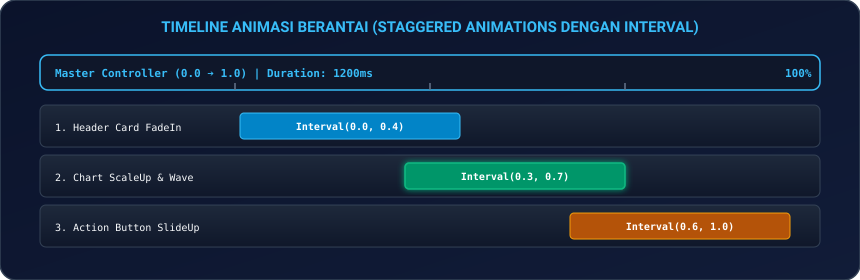
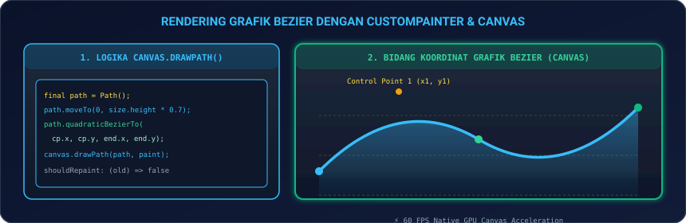
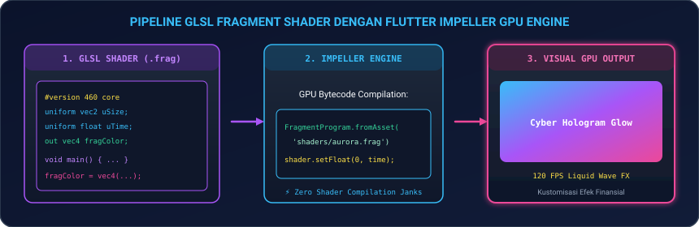
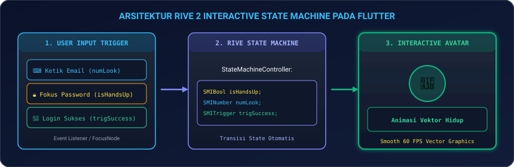

# Modul 12: Animasi Lanjutan, Custom Shaders (GLSL), & CustomPainter

Selamat datang di **Modul 12**! Tampilan visual yang dinamis, halus, dan responsif adalah kunci utama yang membedakan aplikasi biasa dengan aplikasi kelas dunia (*award-winning apps*). Pengguna modern tidak hanya menginginkan fungsi yang bekerja, melainkan juga pengalaman interaksi yang memanjakan mata dengan *framerate* stabil di 60 hingga 120 FPS.

Di modul ini, Anda akan menguasai teknik grafis dan animasi tingkat lanjut di Flutter: mulai dari koreografi animasi berantai (**Staggered Animations dengan `AnimationController` & `Interval`**), transisi halaman kustom dan efek terbang (**`Hero` & `flightShuttleBuilder`**), menggambar grafik data keuangan kustom dengan kurva halus (**`CustomPainter`, `Canvas`, & Bézier Path**), efek visual kaca cair & hologram tingkat GPU (**GLSL Fragment Shaders dengan Flutter Impeller Engine**), hingga animasi vektor interaktif berbasis status (**`Rive 2 State Machine` & `Lottie`**).

---

## 🎬 1. Analogi: Sutradara Bioskop & Efek Visual CGI Hollywood

Untuk memahami peran berbagai teknologi animasi di Flutter:

| Teknologi | Analogi Perfilman Hollywood | Penjelasan Teknis di Flutter |
|---|---|---|
| **Staggered Animation** | **Koreografi Aktor & Gerakan Kamera** | Satu sutradara (`AnimationController`) mengatur timing masuknya aktor: Judul muncul di detik 0.0-0.4, Grafik membesar di detik 0.3-0.7, dan Tombol meluncur di detik 0.6-1.0. |
| **`Hero` & Custom PageRoute** | **Aksi Terbang Stuntman Antar Gedung** | Elemen gambar melayang mulus dari kartu berukuran kecil di halaman daftar menuju layar penuh di halaman detail. |
| **`CustomPainter` & Canvas** | **Pelukis Konsep Artistik Kanvas** | Menggambar bentuk geometri, lingkaran, dan kurva gelombang (*Bézier curve*) secara bebas piksel demi piksel langsung ke layar. |
| **GLSL Fragment Shader** | **Efek CGI Cahaya & Kaca Hologram** | Program kecil yang dieksekusi langsung di chip GPU untuk menghitung warna setiap piksel secara instan (efek liquid glass, aura neon, dan gelombang air). |
| **Rive 2 State Machine** | **Wayang Digital Cerdas Interaktif** | Karakter vektor hidup yang dapat mengubah ekspresi (menutup mata saat ketik password, tersenyum saat transaksi sukses) secara interaktif. |

---

## ⏱️ 2. Animasi Eksplisit & Animasi Berantai (*Staggered Animations*)

Staggered Animation adalah teknik menjalankan beberapa animasi yang saling tumpang tindih (*overlap*) atau berurutan hanya dengan **satu `AnimationController`** tunggal.

<p align="center">
  
</p>

### 2.1 Implementasi `Interval` pada `CurvedAnimation`

```dart
class StaggeredAnimationController {
  late final AnimationController controller;
  late final Animation<double> cardOpacity;
  late final Animation<double> chartScale;
  late final Animation<Offset> buttonSlide;

  StaggeredAnimationController(TickerProvider vsync) {
    controller = AnimationController(
      vsync: vsync,
      duration: const Duration(milliseconds: 1200),
    );

    // 1. Header Card FadeIn: Berjalan di 0% s/d 40% durasi
    cardOpacity = Tween<double>(begin: 0.0, end: 1.0).animate(
      CurvedAnimation(
        parent: controller,
        curve: const Interval(0.0, 0.4, curve: Curves.easeOut),
      ),
    );

    // 2. Chart ScaleUp: Berjalan di 30% s/d 70% durasi
    chartScale = Tween<double>(begin: 0.8, end: 1.0).animate(
      CurvedAnimation(
        parent: controller,
        curve: const Interval(0.3, 0.7, curve: Curves.easeOutBack),
      ),
    );

    // 3. Action Button SlideUp: Berjalan di 60% s/d 100% durasi
    buttonSlide = Tween<Offset>(begin: const Offset(0, 0.5), end: Offset.zero).animate(
      CurvedAnimation(
        parent: controller,
        curve: const Interval(0.6, 1.0, curve: Curves.fastOutSlowIn),
      ),
    );
  }
}
```

---

## 🚀 3. Transisi Halaman Lanjutan & Hero Animation

### 3.1 Hero Animation dengan `flightShuttleBuilder` Kustom

```dart
Widget buildHeroCard(BuildContext context) {
  return Hero(
    tag: 'crypto_card_btc',
    flightShuttleBuilder: (flightContext, animation, flightDirection, fromHeroContext, toHeroContext) {
      return RotationTransition(
        turns: animation,
        child: toHeroContext.widget,
      );
    },
    child: Card(
      child: Image.asset('assets/images/btc.png', width: 64, height: 64),
    ),
  );
}

// 3.2 Custom PageRouteBuilder (Shared Axis Fade & Scale)
Route createCustomPageRoute(Widget page) {
  return PageRouteBuilder(
    pageBuilder: (context, animation, secondaryAnimation) => page,
    transitionsBuilder: (context, animation, secondaryAnimation, child) {
      const begin = Offset(0.0, 0.1);
      const end = Offset.zero;
      const curve = Curves.easeOutCubic;

      final tween = Tween(begin: begin, end: end).chain(CurveTween(curve: curve));
      final fadeTween = Tween<double>(begin: 0.0, end: 1.0);

      return SlideTransition(
        position: animation.drive(tween),
        child: FadeTransition(
          opacity: animation.drive(fadeTween),
          child: child,
        ),
      );
    },
  );
}
```

---

## 🎨 4. Menggambar Kurva Finansial dengan `CustomPainter` & Bézier

<p align="center">
  
</p>

### 4.1 Kode `FinancialChartPainter` dengan Kurva Kuadratik

```dart
import 'package:flutter/material.dart';

class FinancialChartPainter extends CustomPainter {
  final double animationProgress; // 0.0 s/d 1.0
  FinancialChartPainter({required this.animationProgress});

  @override
  void paint(Canvas canvas, Size size) {
    final linePaint = Paint()
      ..color = const Color(0xFF38BDF8)
      ..strokeWidth = 3.5
      ..style = PaintingStyle.stroke
      ..strokeCap = StrokeCap.round;

    final fillPaint = Paint()
      ..shader = LinearGradient(
        begin: Alignment.topCenter,
        end: Alignment.bottomCenter,
        colors: [
          const Color(0xFF38BDF8).withOpacity(0.35),
          const Color(0xFF38BDF8).withOpacity(0.0),
        ],
      ).createShader(Rect.fromLTWH(0, 0, size.width, size.height))
      ..style = PaintingStyle.fill;

    final path = Path();
    path.moveTo(0, size.height * 0.75);

    // Kurva Bezier 1
    path.quadraticBezierTo(
      size.width * 0.25,
      size.height * (0.2 + (0.5 * (1.0 - animationProgress))),
      size.width * 0.5,
      size.height * 0.55,
    );

    // Kurva Bezier 2
    path.quadraticBezierTo(
      size.width * 0.75,
      size.height * (0.85 - (0.4 * animationProgress)),
      size.width,
      size.height * 0.25,
    );

    // Gambar Garis Kurva
    canvas.drawPath(path, linePaint);

    // Tutup Path untuk Gradient Fill di bawah kurva
    path.lineTo(size.width, size.height);
    path.lineTo(0, size.height);
    path.close();
    canvas.drawPath(path, fillPaint);
  }

  @override
  bool shouldRepaint(covariant FinancialChartPainter oldDelegate) {
    return oldDelegate.animationProgress != animationProgress;
  }
}
```

---

## 🔮 5. Fragment Shaders Tingkat GPU dengan GLSL (Impeller Engine)

<p align="center">
  
</p>

### 5.1 Berkas Shader GLSL: `shaders/cyber_aurora.frag`

```glsl
#version 460 core

#include <flutter/runtime_effect.glsl>

uniform vec2 uResolution;
uniform float uTime;

out vec4 fragColor;

void main() {
    vec2 uv = FlutterFragCoord().xy / uResolution;
    
    // Hitung efek gelombang aurora matematika per-piksel
    float wave = sin(uv.x * 6.0 + uTime * 2.0) * 0.15;
    float dist = abs(uv.y - 0.5 + wave);
    
    vec3 glowColor = vec3(0.22, 0.74, 0.97) / (dist * 12.0);
    fragColor = vec4(glowColor, 0.85);
}
```

---

## 🐻 6. Animasi Vektor Interaktif dengan Rive 2 (State Machine)

<p align="center">
  
</p>

```dart
import 'package:flutter/material.dart';
import 'package:rive/rive.dart';

class InteractiveAvatarWidget extends StatefulWidget {
  const InteractiveAvatarWidget({super.key});

  @override
  State<InteractiveAvatarWidget> createState() => _InteractiveAvatarWidgetState();
}

class _InteractiveAvatarWidgetState extends State<InteractiveAvatarWidget> {
  SMIBool? _isHandsUp;
  SMITrigger? _trigSuccess;

  void _onRiveInit(Artboard artboard) {
    final controller = StateMachineController.fromArtboard(artboard, 'LoginStateMachine');
    if (controller != null) {
      artboard.addController(controller);
      _isHandsUp = controller.findSMI('isHandsUp');
      _trigSuccess = controller.findSMI('trigSuccess');
    }
  }

  void coverEyes() => _isHandsUp?.value = true;
  void triggerSuccess() => _trigSuccess?.fire();

  @override
  Widget build(BuildContext context) {
    return SizedBox(
      height: 180,
      child: RiveAnimation.asset(
        'assets/rive/animated_bear.riv',
        onInit: _onRiveInit,
      ),
    );
  }
}
```

---

## 💻 7. Hands-on Super Project: Interactive Fintech Analytics Dashboard & Animated Charts

Mari kita bangun aplikasi nyata: **Quantum Wealth Analytics 2026** yang memadukan **Staggered Animations**, **CustomPainter Kurva Finansial**, dan **Transisi Interaktif**:

1. **Buat file baru** `lib/fintech_analytics_page.dart` di proyek Flutter Anda.
2. **Salin kode lengkap berikut**:

```dart
import 'package:flutter/material.dart';

void main() {
  runApp(const FintechAnalyticsApp());
}

class FintechAnalyticsApp extends StatelessWidget {
  const FintechAnalyticsApp({super.key});

  @override
  Widget build(BuildContext context) {
    return MaterialApp(
      debugShowCheckedModeBanner: false,
      theme: ThemeData(
        useMaterial3: true,
        brightness: Brightness.dark,
        colorSchemeSeed: Colors.cyan,
      ),
      home: const FintechAnalyticsDashboard(),
    );
  }
}

class FintechAnalyticsDashboard extends StatefulWidget {
  const FintechAnalyticsDashboard({super.key});

  @override
  State<FintechAnalyticsDashboard> createState() => _FintechAnalyticsDashboardState();
}

class _FintechAnalyticsDashboardState extends State<FintechAnalyticsDashboard>
    with SingleTickerProviderStateMixin {
  late final AnimationController _controller;
  late final Animation<double> _cardFade;
  late final Animation<double> _chartProgress;
  late final Animation<Offset> _buttonSlide;

  int _selectedTimeframe = 0; // 0 = 1M, 1 = 6M, 2 = 1Y

  @override
  void initState() {
    super.initState();
    _controller = AnimationController(
      vsync: this,
      duration: const Duration(milliseconds: 1400),
    );

    _cardFade = Tween<double>(begin: 0.0, end: 1.0).animate(
      CurvedAnimation(parent: _controller, curve: const Interval(0.0, 0.4, curve: Curves.easeOut)),
    );

    _chartProgress = Tween<double>(begin: 0.0, end: 1.0).animate(
      CurvedAnimation(parent: _controller, curve: const Interval(0.3, 0.8, curve: Curves.easeInOutCubic)),
    );

    _buttonSlide = Tween<Offset>(begin: const Offset(0, 0.5), end: Offset.zero).animate(
      CurvedAnimation(parent: _controller, curve: const Interval(0.6, 1.0, curve: Curves.easeOutBack)),
    );

    _controller.forward();
  }

  void _reloadChart() {
    _controller.reset();
    _controller.forward();
  }

  @override
  void dispose() {
    _controller.dispose();
    super.dispose();
  }

  @override
  Widget build(BuildContext context) {
    return Scaffold(
      appBar: AppBar(
        title: const Text('Quantum Analytics 2026', style: TextStyle(fontWeight: FontWeight.bold)),
        backgroundColor: Theme.of(context).colorScheme.inversePrimary,
        actions: [
          IconButton(icon: const Icon(Icons.replay), onPressed: _reloadChart),
        ],
      ),
      body: AnimatedBuilder(
        animation: _controller,
        builder: (context, child) {
          return SingleChildScrollView(
            padding: const EdgeInsets.all(20),
            child: Column(
              crossAxisAlignment: CrossAxisAlignment.stretch,
              children: [
                Container(
                  padding: const EdgeInsets.all(12),
                  decoration: BoxDecoration(
                    color: Colors.cyan.shade900.withOpacity(0.2),
                    borderRadius: BorderRadius.circular(12),
                    border: Border.all(color: Colors.cyan.shade600),
                  ),
                  child: const Row(
                    children: [
                      Icon(Icons.auto_awesome, color: Colors.cyanAccent),
                      SizedBox(width: 10),
                      Expanded(
                        child: Text(
                          '60 FPS Staggered GPU Animations & CustomPainter Bézier Engine',
                          style: TextStyle(fontSize: 11, fontWeight: FontWeight.bold, color: Colors.cyanAccent),
                        ),
                      ),
                    ],
                  ),
                ),
                const SizedBox(height: 20),

                // 1. Staggered Header Card
                Opacity(
                  opacity: _cardFade.value,
                  child: Card(
                    elevation: 4,
                    shape: RoundedRectangleBorder(borderRadius: BorderRadius.circular(16)),
                    child: Padding(
                      padding: const EdgeInsets.all(20.0),
                      child: Column(
                        crossAxisAlignment: CrossAxisAlignment.start,
                        children: [
                          const Text('Total Portofolio Investasi', style: TextStyle(fontSize: 13, color: Colors.grey)),
                          const SizedBox(height: 6),
                          const Text('Rp 328.450.000', style: TextStyle(fontSize: 32, fontWeight: FontWeight.bold, color: Colors.white)),
                          const SizedBox(height: 8),
                          Row(
                            children: const [
                              Icon(Icons.trending_up, color: Colors.greenAccent, size: 20),
                              SizedBox(width: 4),
                              Text('+24.8% (+Rp 65.200.000) Tahun Ini', style: TextStyle(color: Colors.greenAccent, fontWeight: FontWeight.bold)),
                            ],
                          ),
                        ],
                      ),
                    ),
                  ),
                ),
                const SizedBox(height: 20),

                // 2. CustomPainter Bézier Chart Area
                Card(
                  color: const Color(0xFF0F172A),
                  shape: RoundedRectangleBorder(borderRadius: BorderRadius.circular(16)),
                  child: Padding(
                    padding: const EdgeInsets.all(20.0),
                    child: Column(
                      crossAxisAlignment: CrossAxisAlignment.start,
                      children: [
                        Row(
                          mainAxisAlignment: MainAxisAlignment.spaceBetween,
                          children: [
                            const Text('Grafik Performa Aset', style: TextStyle(fontSize: 15, fontWeight: FontWeight.bold, color: Colors.cyanAccent)),
                            Row(
                              children: [
                                _buildTimeframeChip('1B', 0),
                                _buildTimeframeChip('6B', 1),
                                _buildTimeframeChip('1T', 2),
                              ],
                            ),
                          ],
                        ),
                        const SizedBox(height: 24),
                        SizedBox(
                          height: 180,
                          width: double.infinity,
                          child: CustomPaint(
                            painter: LiveBézierPainter(
                              progress: _chartProgress.value,
                              timeframeIndex: _selectedTimeframe,
                            ),
                          ),
                        ),
                      ],
                    ),
                  ),
                ),
                const SizedBox(height: 24),

                // 3. Staggered Action Buttons
                SlideTransition(
                  position: _buttonSlide,
                  child: Row(
                    children: [
                      Expanded(
                        child: ElevatedButton.icon(
                          onPressed: () {
                            ScaffoldMessenger.of(context).showSnackBar(
                              const SnackBar(content: Text('Membuka Laporan Analisis Lengkap')),
                            );
                          },
                          icon: const Icon(Icons.insights),
                          label: const Text('Detail Analisis'),
                          style: ElevatedButton.styleFrom(
                            padding: const EdgeInsets.symmetric(vertical: 14),
                            backgroundColor: Colors.cyan.shade600,
                            foregroundColor: Colors.black,
                          ),
                        ),
                      ),
                      const SizedBox(width: 12),
                      Expanded(
                        child: OutlinedButton.icon(
                          onPressed: _reloadChart,
                          icon: const Icon(Icons.bolt),
                          label: const Text('Re-Animate'),
                          style: OutlinedButton.styleFrom(
                            padding: const EdgeInsets.symmetric(vertical: 14),
                          ),
                        ),
                      ),
                    ],
                  ),
                ),
              ],
            ),
          );
        },
      ),
    );
  }

  Widget _buildTimeframeChip(String label, int index) {
    final isSelected = _selectedTimeframe == index;
    return GestureDetector(
      onTap: () {
        setState(() => _selectedTimeframe = index);
        _reloadChart();
      },
      child: Container(
        margin: const EdgeInsets.only(left: 6),
        padding: const EdgeInsets.symmetric(horizontal: 10, vertical: 4),
        decoration: BoxDecoration(
          color: isSelected ? Colors.cyan.shade700 : Colors.transparent,
          borderRadius: BorderRadius.circular(6),
        ),
        child: Text(
          label,
          style: TextStyle(fontSize: 12, fontWeight: FontWeight.bold, color: isSelected ? Colors.white : Colors.grey),
        ),
      ),
    );
  }
}

// =========================================================
// CUSTOMPAINTER KURVA BEZIER KEUANGAN
// =========================================================
class LiveBézierPainter extends CustomPainter {
  final double progress;
  final int timeframeIndex;

  LiveBézierPainter({required this.progress, required this.timeframeIndex});

  @override
  void paint(Canvas canvas, Size size) {
    final strokePaint = Paint()
      ..color = const Color(0xFF38BDF8)
      ..strokeWidth = 3.5
      ..style = PaintingStyle.stroke
      ..strokeCap = StrokeCap.round;

    final fillPaint = Paint()
      ..shader = LinearGradient(
        begin: Alignment.topCenter,
        end: Alignment.bottomCenter,
        colors: [
          const Color(0xFF38BDF8).withOpacity(0.4),
          const Color(0xFF38BDF8).withOpacity(0.0),
        ],
      ).createShader(Rect.fromLTWH(0, 0, size.width, size.height))
      ..style = PaintingStyle.fill;

    final path = Path();
    path.moveTo(0, size.height * 0.7);

    final cpY = (timeframeIndex == 0 ? 0.2 : timeframeIndex == 1 ? 0.1 : 0.05);

    path.quadraticBezierTo(
      size.width * 0.3,
      size.height * (cpY + (0.5 * (1.0 - progress))),
      size.width * 0.6,
      size.height * 0.5,
    );

    path.quadraticBezierTo(
      size.width * 0.85,
      size.height * (0.8 - (0.6 * progress)),
      size.width,
      size.height * 0.15,
    );

    // Draw Line
    canvas.drawPath(path, strokePaint);

    // Draw Fill
    path.lineTo(size.width, size.height);
    path.lineTo(0, size.height);
    path.close();
    canvas.drawPath(path, fillPaint);
  }

  @override
  bool shouldRepaint(covariant LiveBézierPainter oldDelegate) {
    return oldDelegate.progress != progress || oldDelegate.timeframeIndex != timeframeIndex;
  }
}
```

3. **Jalankan Aplikasi**:
   ```bash
   flutter run
   ```
   *Tekan tombol '1B', '6B', atau '1T' untuk melihat bagaimana CustomPainter menginterpolasi kurva fluktuasi investasi secara mulus!*

---

## ⚠️ 8. Jebakan Umum (*Common Pitfalls*) & Solusi Kilat

| Kesalahan Umum | Gejala Error | Solusi yang Benar |
|---|---|---|
| **1. Lupa `controller.dispose()`** | Kebocoran memori (*Memory Leak*) dan animasi tetap berjalan di background saat berpindah halaman. | Selalu panggil `_controller.dispose()` di method `dispose()` State. |
| **2. Selalu Return `true` pada `shouldRepaint`** | GPU dipaksa melukis ulang kanvas di setiap frame meskipun data tidak berubah (*Frame Drop*). | Bandingkan data lama vs baru di `shouldRepaint`: `return oldDelegate.data != data`. |
| **3. Lupa `SingleTickerProviderStateMixin`** | Error kompilasi: `The argument type 'State' cannot be assigned to 'TickerProvider'`. | Tambahkan `with SingleTickerProviderStateMixin` pada deklarasi `State` class Anda. |
| **4. Menghitung Matematika Berat di Method `paint()`** | UI patah-patah (*Jank*) saat CustomPainter dieksekusi. | Lakukan kalkulasi titik koordinat di luar `paint()` (di BLoC/Cubit/Controller), lalu oper koordinat siap lukis ke painter. |
| **5. Mengabaikan Compiling Time Shader di Skia** | App freeze beberapa frame saat pertama kali merender shader GLSL di emulator lama. | Gunakan engine **Impeller** (default di iOS & Android modern) yang mengompilasi shader Ahead-of-Time (AOT). |

---

## 📝 9. Kuis Pemahaman Modul 12

1. **Bagaimana cara kerja widget `Interval` dalam mengendalikan Staggered Animation?**  
   *Jawaban:* `Interval(start, end)` membagi nilai master controller (0.0 sampai 1.0) menjadi sub-timeline tertentu, sehingga setiap elemen visual (opacity, scale, slide) dapat mulai dan selesai bergerak pada rentang waktu yang berbeda.
2. **Mengapa method `shouldRepaint()` pada `CustomPainter` sangat penting untuk performa grafis?**  
   *Jawaban:* `shouldRepaint()` memberi tahu Flutter apakah kanvas perlu digambar ulang atau tidak. Jika mengembalikan `false`, Flutter akan menggunakan kembali hasil *cache* bitmap render sebelumnya tanpa membebani GPU.
3. **Apa keunggulan utama engine Impeller dalam menangani GLSL Fragment Shaders dibandingkan engine lawas Skia?**  
   *Jawaban:* Impeller mengompilasi seluruh shader GLSL secara Ahead-of-Time (AOT) saat proses build aplikasi, sehingga mengeliminasi 100% *Shader Compilation Jank* (patah-patah saat animasi shader pertama kali muncul).

---

## 🎯 Rangkuman & Checklist Kompetensi

- [x] Menguasai pembuatan Animasi Eksplisit dan Animasi Berantai (*Staggered Animations*) via `Interval`.
- [x] Menguasai Transisi Halaman Lanjutan & Custom `Hero` dengan `flightShuttleBuilder`.
- [x] Memahami arsitektur rendering `CustomPainter`, `Canvas`, dan manipulasi kurva Bézier kuadratik.
- [x] Mengoptimalkan performa melukis GPU dengan method `shouldRepaint()`.
- [x] Memahami pipeline penulisan dan kompilasi GLSL Fragment Shaders dengan Flutter Impeller.
- [x] Menguasai integrasi animasi vektor interaktif berbasis State Machine menggunakan `Rive 2`.
- [x] Berhasil membangun proyek mini Interactive Fintech Analytics Dashboard & Animated Charts.

---

👉 **Langkah Selanjutnya**: Visual dan estetika grafis Anda sudah setara desainer top Silicon Valley! Mari melangkah ke **[Modul 13: Testing Komprehensif, Golden Tests, & DevTools Profiling](../modul-13-testing-dan-profiling/README.md)** untuk menjamin stabilitas kode 100%.
