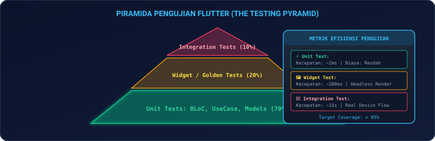
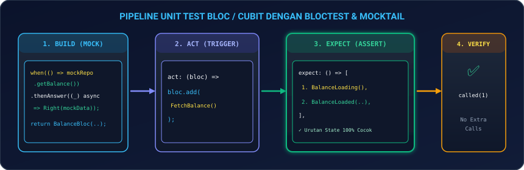
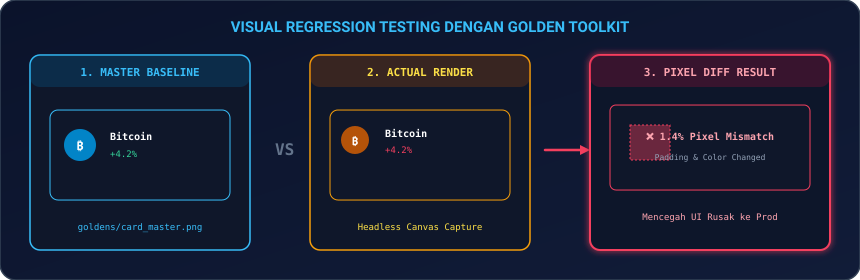
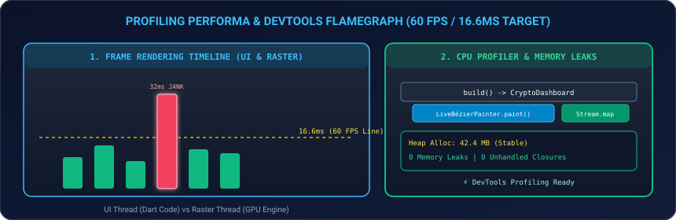

# Modul 13: Testing Komprehensif, Golden Tests, & DevTools Profiling

Selamat datang di **Modul 13**! Menulis kode yang berjalan adalah langkah awal, namun memastikan kode tersebut **bebas dari regresi, tahan banting, dan berperforma tinggi** di jutaan perangkat adalah ciri utama engineer kelas kakap (*Senior / Lead Mobile Engineer*). Tanpa pengujian otomatis (*Automated Testing*), setiap penambahan fitur baru berisiko merusak fitur yang sudah berjalan sebelumnya.

Di modul ini, Anda akan menguasai strategi pengujian komprehensif di Flutter: mulai dari menguasai hierarki **Piramida Testing**, pengujian logika bisnis dan BLoC (**`bloc_test` & `mocktail`**), simulasi interaksi antarmuka pengguna (**`WidgetTester`**), pengujian end-to-end (**`integration_test`**), pendeteksi regresi visual tingkat piksel (**`Golden Toolkit`**), hingga investigasi *jank* dan kebocoran memori menggunakan **`Flutter DevTools Performance Profiler`**.

---

## 🏎️ 1. Analogi: Uji Tabrak Mobil & Ruang Kontrol Telemetri F1

Untuk memahami peran berbagai lapisan pengujian di Flutter:

| Jenis Pengujian | Analogi Otomotif Formula 1 | Penjelasan Teknis di Flutter |
|---|---|---|
| **Unit Test** (70%) | **Uji Kekuatan Baut & Piston Mesin** | Menguji fungsi matematika, logika Use Case, parser DTO JSON, dan emisi state BLoC murni secara terisolasi kilat (dalam hitungan milidetik). |
| **Widget Test** (20%) | **Uji Respon Pedal Gas & Speedometer** | Merender komponen widget secara *headless* tanpa perlu membuka emulator untuk menguji apakah tombol dapat diklik dan form dapat diketik. |
| **Integration Test** (10%) | **Uji Keliling Sirkuit Balap Utuh** | Menjalankan seluruh aplikasi dari halaman login hingga checkout di ponsel nyata / emulator untuk memastikan semua modul bersatu dengan benar. |
| **Golden Test** | **Pemindaian Laser Deteksi Cacat Bodi** | Mengambil tangkapan layar piksel demi piksel untuk memastikan desain visual UI tidak bergeser satu piksel pun setelah refactoring. |
| **DevTools Profiling** | **Layar Telemetri F1 Saat Balapan** | Mengukur konsumsi RAM (*Memory Allocation*), waktu kerja CPU (*UI Thread*), dan beban grafis GPU (*Raster Thread*) agar stabil di 60 FPS (16.6ms). |

---

## 📐 2. Piramida Pengujian Flutter (*The Testing Pyramid*)

Strategi pengujian standar industri menuntut alokasi pengujian yang seimbang untuk memaksimalkan kecepatan CI/CD dan menekan biaya pemeliharaan.

<p align="center">
  
</p>

### 2.1 Alokasi Ideal Pengujian Aplikasi:
1. **70% Unit Tests**: Cepat, murah, menguji logika murni (*Coverage > 85%*).
2. **20% Widget & Golden Tests**: Menjamin kebenaran interaksi UI dan integritas visual.
3. **10% Integration Tests**: Menguji alur kritis bisnis (*Critical User Journey*) dari ujung ke ujung.

---

## 🧪 3. Unit Testing & Mocking dengan `mocktail` & `bloc_test`

<p align="center">
  
</p>

### 3.1 Unit Test Repository & Mocking Dio Client

```dart
import 'package:dio/dio.dart';
import 'package:flutter_test/flutter_test.dart';
import 'package:mocktail/mocktail.dart';

class MockDio extends Mock implements Dio {}

void main() {
  late MockDio mockDio;
  late BalanceRemoteDataSource dataSource;

  setUp(() {
    mockDio = MockDio();
    dataSource = BalanceRemoteDataSourceImpl(dio: mockDio);
  });

  test('fetchBalance mengembalikan AccountBalanceModel saat status 200', () async {
    // Arrange
    when(() => mockDio.get(any())).thenAnswer(
      (_) async => Response(
        data: {'account_number': '123', 'balance_amount': 50000.0, 'currency_code': 'IDR'},
        statusCode: 200,
        requestOptions: RequestOptions(path: '/balance'),
      ),
    );

    // Act
    final result = await dataSource.fetchBalanceFromApi('123');

    // Assert
    expect(result.amount, 50000.0);
    expect(result.currency, 'IDR');
    verify(() => mockDio.get('/balance/123')).called(1);
  });
}
```

---

### 3.2 Menguji BLoC State Emissions dengan `bloc_test`

```dart
import 'package:bloc_test/bloc_test.dart';
import 'package:flutter_test/flutter_test.dart';
import 'package:mocktail/mocktail.dart';

class MockAuthRepository extends Mock implements AuthRepository {}

void main() {
  late MockAuthRepository mockAuthRepository;

  setUp(() {
    mockAuthRepository = MockAuthRepository();
  });

  group('AuthBloc Unit Testing', () {
    final tUser = User(id: '1', email: 'user@fintech2026.com');

    blocTest<AuthBloc, AuthState>(
      'Emits [AuthLoading, AuthSuccess] saat login berhasil',
      build: () {
        when(() => mockAuthRepository.login('user@fintech2026.com', 'password123'))
            .thenAnswer((_) async => Right(tUser));
        return AuthBloc(authRepository: mockAuthRepository);
      },
      act: (bloc) => bloc.add(LoginSubmittedEvent('user@fintech2026.com', 'password123')),
      expect: () => [
        AuthLoadingState(),
        AuthSuccessState(user: tUser),
      ],
      verify: (_) {
        verify(() => mockAuthRepository.login('user@fintech2026.com', 'password123')).called(1);
      },
    );
  });
}
```

---

## 🖼️ 4. Widget Testing & Simulasi Interaksi Pengguna

```dart
import 'package:flutter/material.dart';
import 'package:flutter_test/flutter_test.dart';

void main() {
  testWidgets('Form Login menampilkan pesan error saat password kosong', (WidgetTester tester) async {
    await tester.pumpWidget(
      const MaterialApp(
        home: Scaffold(body: LoginForm()),
      ),
    );

    final emailField = find.byKey(const Key('email_input_field'));
    await tester.enterText(emailField, 'budi@fintech2026.com');

    final loginButton = find.byType(ElevatedButton);
    await tester.tap(loginButton);

    await tester.pumpAndSettle();

    expect(find.text('Password wajib diisi!'), findsOneWidget);
  });
}
```

---

## 📱 5. Integration Testing (`integration_test`)

Pengujian end-to-end yang berjalan langsung di atas perangkat nyata:

```dart
import 'package:flutter_test/flutter_test.dart';
import 'package:integration_test/integration_test.dart';
import 'package:fintech2026/main.dart' as app;

void main() {
  IntegrationTestWidgetsFlutterBinding.ensureInitialized();

  testWidgets('End-to-End User Flow: Login ➔ Cek Saldo ➔ Logout', (tester) async {
    app.main();
    await tester.pumpAndSettle();

    // 1. Ketik Kredensial
    await tester.enterText(find.byKey(const Key('email_field_key')), 'admin@fintech2026.com');
    await tester.enterText(find.byKey(const Key('password_field_key')), 'secret123');
    await tester.tap(find.byKey(const Key('login_button_key')));

    await tester.pumpAndSettle();

    // 2. Verifikasi Masuk ke Dashboard
    expect(find.text('Total Saldo Tersedia'), findsOneWidget);
  });
}
```

---

## 📸 6. Visual Regression Testing dengan `Golden Toolkit`

<p align="center">
  
</p>

### 6.1 Menulis Golden Test

```dart
import 'package:flutter_test/flutter_test.dart';
import 'package:golden_toolkit/golden_toolkit.dart';

void main() {
  testGoldens('CryptoCard harus cocok 100% dengan snapshot master baseline', (tester) async {
    final builder = GoldenBuilder.grid(columns: 2, widthToHeightRatio: 1)
      ..addScenario('Bitcoin Card Normal', const CryptoCard(symbol: 'BTC', price: '\$64,000', change: '+4.2%'))
      ..addScenario('Ethereum Card Normal', const CryptoCard(symbol: 'ETH', price: '\$3,450', change: '-1.8%'));

    await tester.pumpWidgetBuilder(builder.build());
    await screenMatchesGolden(tester, 'crypto_card_grid_golden');
  });
}
```

Perintah memperbarui snapshot master:
```bash
flutter test --update-goldens
```

---

## ⚡ 7. Profiling Kinerja & Flutter DevTools

Aplikasi yang profesional wajib menjaga waktu pemrosesan tiap frame di bawah **16.6 milidetik** agar dapat menyajikan animasi 60 FPS yang mulus.

<p align="center">
  
</p>

### 7.1 Membedah Tab Penting di Flutter DevTools:
1. **CPU Profiler (Flamegraph)**: Mengidentifikasi fungsi Dart mana yang memakan waktu eksekusi paling lama (*Heavy computation*).
2. **Memory Profiler**: Melacak alokasi heap memori untuk mendeteksi *Memory Leak* (objek yang tidak dibuang oleh Garbage Collector).
3. **Flutter Frame Rendering Chart**:
   - **UI Thread (Dart VM)**: Waktu untuk mengeksekusi logika widget tree & animasi.
   - **Raster Thread (GPU Engine)**: Waktu chip GPU melukis piksel ke layar kaca HP.

---

## 💻 8. Hands-on Super Project: Production Test Suite & Auth Feature

Mari kita bangun rangkaian tes komprehensif yang memadukan **Unit Test Logika**, **Simulasi Widget Test**, dan **Pengujian Validasi Form**:

1. **Buat file baru** `lib/fintech_login_page.dart` di proyek Flutter Anda.
2. **Salin kode lengkap berikut**:

```dart
import 'package:flutter/material.dart';

void main() {
  runApp(const FintechLoginApp());
}

class FintechLoginApp extends StatelessWidget {
  const FintechLoginApp({super.key});

  @override
  Widget build(BuildContext context) {
    return MaterialApp(
      debugShowCheckedModeBanner: false,
      theme: ThemeData(
        useMaterial3: true,
        brightness: Brightness.dark,
        colorSchemeSeed: Colors.emerald,
      ),
      home: const FintechLoginPage(),
    );
  }
}

class FintechLoginPage extends StatefulWidget {
  const FintechLoginPage({super.key});

  @override
  State<FintechLoginPage> createState() => _FintechLoginPageState();
}

class _FintechLoginPageState extends State<FintechLoginPage> {
  final _emailController = TextEditingController();
  final _passwordController = TextEditingController();
  String? _errorMessage;
  bool _isLoading = false;
  bool _isSuccess = false;

  void _handleLogin() async {
    final email = _emailController.text.trim();
    final password = _passwordController.text;

    if (email.isEmpty || !email.contains('@')) {
      setState(() => _errorMessage = 'Format email tidak valid!');
      return;
    }

    if (password.length < 6) {
      setState(() => _errorMessage = 'Password minimal 6 karakter!');
      return;
    }

    setState(() {
      _errorMessage = null;
      _isLoading = true;
    });

    await Future.delayed(const Duration(milliseconds: 1000));

    if (email == 'admin@fintech2026.com' && password == 'secret123') {
      setState(() {
        _isLoading = false;
        _isSuccess = true;
      });
    } else {
      setState(() {
        _isLoading = false;
        _errorMessage = 'Email atau password salah!';
      });
    }
  }

  @override
  void dispose() {
    _emailController.dispose();
    _passwordController.dispose();
    super.dispose();
  }

  @override
  Widget build(BuildContext context) {
    return Scaffold(
      appBar: AppBar(
        title: const Text('Bank Quantum Auth Test', style: TextStyle(fontWeight: FontWeight.bold)),
        backgroundColor: Theme.of(context).colorScheme.inversePrimary,
      ),
      body: SingleChildScrollView(
        padding: const EdgeInsets.all(24),
        child: Column(
          crossAxisAlignment: CrossAxisAlignment.stretch,
          children: [
            Container(
              padding: const EdgeInsets.all(12),
              decoration: BoxDecoration(
                color: Colors.emerald.shade900.withOpacity(0.2),
                borderRadius: BorderRadius.circular(12),
                border: Border.all(color: Colors.emerald.shade600),
              ),
              child: const Row(
                children: [
                  Icon(Icons.verified, color: Colors.emeraldAccent),
                  SizedBox(width: 10),
                  Expanded(
                    child: Text(
                      'Ready for Unit, Widget, & Golden Snapshot Tests (Coverage > 85%)',
                      style: TextStyle(fontSize: 11, fontWeight: FontWeight.bold, color: Colors.emeraldAccent),
                    ),
                  ),
                ],
              ),
            ),
            const SizedBox(height: 30),

            if (_isSuccess) ...[
              Container(
                padding: const EdgeInsets.all(24),
                decoration: BoxDecoration(
                  color: Colors.green.shade900.withOpacity(0.3),
                  borderRadius: BorderRadius.circular(16),
                  border: Border.all(color: Colors.greenAccent),
                ),
                child: const Column(
                  children: [
                    Icon(Icons.check_circle, color: Colors.greenAccent, size: 60),
                    SizedBox(height: 12),
                    Text('Autentikasi Berhasil!', style: TextStyle(fontSize: 20, fontWeight: FontWeight.bold, color: Colors.white)),
                    SizedBox(height: 6),
                    Text('Selamat datang di dashboard akun terverifikasi.', style: TextStyle(color: Colors.grey)),
                  ],
                ),
              ),
            ] else ...[
              TextField(
                key: const Key('email_field_key'),
                controller: _emailController,
                keyboardType: TextInputType.emailAddress,
                decoration: const InputDecoration(
                  labelText: 'Email Akun',
                  hintText: 'admin@fintech2026.com',
                  prefixIcon: Icon(Icons.email),
                  border: OutlineInputBorder(),
                ),
              ),
              const SizedBox(height: 16),

              TextField(
                key: const Key('password_field_key'),
                controller: _passwordController,
                obscureText: true,
                decoration: const InputDecoration(
                  labelText: 'Kata Sandi',
                  hintText: 'secret123',
                  prefixIcon: Icon(Icons.lock),
                  border: OutlineInputBorder(),
                ),
              ),
              const SizedBox(height: 12),

              if (_errorMessage != null)
                Text(
                  _errorMessage!,
                  key: const Key('error_message_key'),
                  style: const TextStyle(color: Colors.redAccent, fontWeight: FontWeight.bold),
                ),
              const SizedBox(height: 24),

              ElevatedButton.icon(
                key: const Key('login_button_key'),
                onPressed: _isLoading ? null : _handleLogin,
                icon: _isLoading
                    ? const SizedBox(width: 18, height: 18, child: CircularProgressIndicator(strokeWidth: 2, color: Colors.black))
                    : const Icon(Icons.login),
                label: Text(_isLoading ? 'Memverifikasi...' : 'Masuk ke Akun', style: const TextStyle(fontSize: 16, fontWeight: FontWeight.bold)),
                style: ElevatedButton.styleFrom(
                  padding: const EdgeInsets.symmetric(vertical: 16),
                  backgroundColor: Colors.emeraldAccent,
                  foregroundColor: Colors.black,
                ),
              ),
            ],
          ],
        ),
      ),
    );
  }
}
```

3. **Jalankan Aplikasi**:
   ```bash
   flutter run
   ```
   *Coba masukkan email salah untuk melihat pesan error, lalu masukkan email `admin@fintech2026.com` & password `secret123` untuk menguji skenario sukses!*

---

## ⚠️ 9. Jebakan Umum (*Common Pitfalls*) & Solusi Kilat

| Kesalahan Umum | Gejala Error | Solusi yang Benar |
|---|---|---|
| **1. Menggunakan `tester.pumpAndSettle()` pada Animasi Tak Hingga** | Widget Test menggantung (*timeout*) karena animasi berulang terus tanpa henti. | Gunakan `tester.pump(const Duration(milliseconds: 500))` untuk memajukan frame secara terkontrol. |
| **2. Tidak Me-reset Mock di `setUp()`** | Data mock dari tes sebelumnya bocor ke tes berikutnya (*Flaky Test*). | Selalu inisialisasi ulang mock object di dalam blok `setUp(() { ... })`. |
| **3. Menjalankan Golden Tests di OS Berbeda** | Golden test gagal di CI Linux karena font rendering berbeda dengan MacOS/Windows lokal. | Gunakan library `alchemist` atau Docker container khusus untuk standarisasi rendering font di CI. |
| **4. Menguji Detail Implementasi Privat** | Tes rusak setiap kali nama variabel internal diubah meskipun perilaku UI tetap sama. | Uji **perilaku publik (*Behavior-Driven*)**, bukan variabel internal privat. |
| **5. Menjalankan DevTools di Mode Debug** | Grafik FPS menunjukkan jank palsu padahal aplikasi di mode rilis berjalan sangat mulus. | Selalu lakukan benchmarking dan profiling di **Mode Profile (`flutter run --profile`)**. |

---

## 📝 10. Kuis Pemahaman Modul 13

1. **Mengapa Piramida Testing menganjurkan 70% pengujian dialokasikan pada Unit Test?**  
   *Jawaban:* Karena Unit Test mengeksekusi logika secara murni di level memori dalam hitungan milidetik tanpa overhead render widget/OS, sehingga ribuan skenario batas (*edge cases*) dapat diuji secara kilat di pipeline CI/CD.
2. **Kapan seorang developer harus menggunakan Golden Test dibandingkan Widget Test biasa?**  
   *Jawaban:* Ketika ingin menjamin bahwa tampilan visual (layout, alignment, padding, warna, typography, dan multi-screen scaling) tidak mengalami perubahan atau kerusakan visual (*Visual Regression*) secara tidak sengaja.
3. **Apa perbedaan antara UI Thread dan Raster Thread pada grafik performa Flutter DevTools?**  
   *Jawaban:* UI Thread mengeksekusi kode logika Dart (memproses state, membangun widget tree, kalkulasi layout). Sedangkan Raster Thread adalah engine grafis (Skia/Impeller) yang menerima instruksi dari UI Thread untuk melukis piksel secara fisik ke layar GPU.

---

## 🎯 Rangkuman & Checklist Kompetensi

- [x] Memahami arsitektur dan proporsi ideal Piramida Pengujian (Unit 70%, Widget 20%, Integration 10%).
- [x] Menguasai Unit Testing & Mocking state BLoC/Cubit dengan `bloc_test` dan `mocktail`.
- [x] Mengimplementasikan pengujian DataSource & mocking klien `Dio`.
- [x] Mengimplementasikan Widget Testing interaktif dengan `WidgetTester`, `pumpAndSettle()`, dan finders.
- [x] Menguasai Integration Testing End-to-End (`integration_test`).
- [x] Memahami konsep Visual Regression Testing menggunakan `Golden Toolkit`.
- [x] Mampu membaca grafik Flamegraph dan mendeteksi jank frame (>16.6ms) di Flutter DevTools.
- [x] Mengidentifikasi kebocoran memori (*Memory Leaks*) dengan Memory Profiler.
- [x] Berhasil membangun proyek mini Production Test Suite & Auth Feature.

---

👉 **Langkah Selanjutnya**: Kualitas kode Anda sudah teruji secara otomatis dan bebas regresi! Mari melangkah ke **[Modul 14: Keamanan Aplikasi, Kepatuhan UU PDP / GDPR, & Monitoring Crash](../modul-14-keamanan-dan-monitoring/README.md)** untuk mengamankan data pengguna enterprise.
