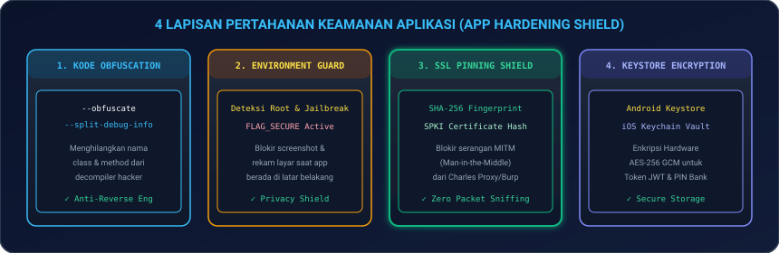
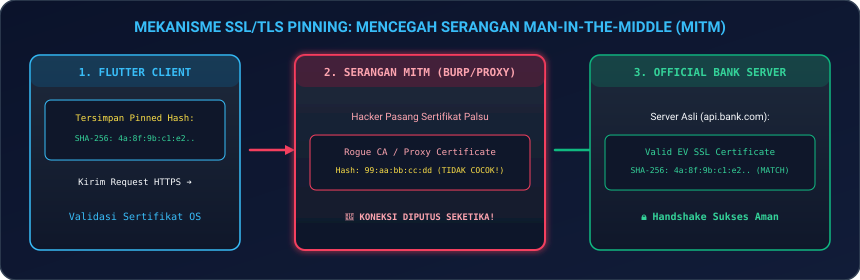
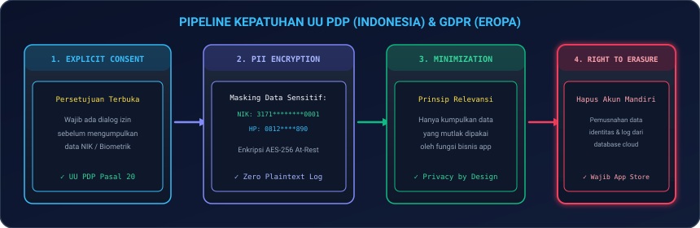
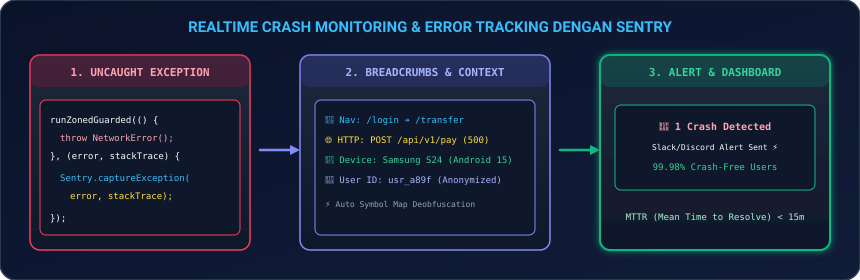

# Modul 14: Keamanan Aplikasi, Kepatuhan UU PDP / GDPR, & Monitoring Crash

Selamat datang di **Modul 14**! Di era kejahatan siber modern dan ketatnya regulasi perlindungan data pribadi (seperti **UU PDP No. 27/2022** di Indonesia dan **GDPR** di Uni Eropa), keamanan aplikasi bukan lagi sekadar fitur tambahan, melainkan **fondasi mutlak kelangsungan bisnis (*Mission-Critical Requirement*)**. Aplikasi mobile yang rentan terhadap dekompilasi, penyadapan jaringan (*MITM*), atau kebocoran data pengguna dapat berakibat pada tuntutan hukum bernilai miliaran rupiah dan hancurnya reputasi institusi.

Di modul ini, Anda akan mempelajari arsitektur pertahanan berlapis (*Defense-in-Depth*) untuk membentengi aplikasi Flutter setara standar industri perbankan: mulai dari teknik penyamaran kode (**Obfuscation & Symbol Mapping**), deteksi lingkungan tidak aman (**Root & Jailbreak Detection**), pencegahan rekam layar (**`FLAG_SECURE`**), penangkal penyadapan jaringan (**SSL/TLS Pinning**), brankas penyimpanan perangkat keras (**Android Keystore & iOS Keychain**), pemenuhan hukum privasi data (**UU PDP & GDPR**), hingga pemantauan insiden kritis secara *real-time* (**`Sentry Crash Reporting & APM`**).

---

## 🏰 1. Analogi: Benteng Baja Bank Sentral & Ruang CCTV AI 24/7

Untuk memahami peran 5 pilar keamanan di aplikasi Flutter:

| Pilar Keamanan | Analogi Benteng Bank Sentral | Penjelasan Teknis di Flutter |
|---|---|---|
| **Code Obfuscation** | **Buku Sandi Rahasia Militer** | Menghilangkan nama fungsi dan variabel asli menjadi kode acak (`a`, `b`, `c`), sehingga hacker yang membongkar file APK/IPA tidak dapat membaca logika bisnis. |
| **Root/Jailbreak & FlagSecure** | **Detektor Logam & Tirai Anti-Kamera** | Mendeteksi perangkat yang telah dimodifikasi (rentan disusupi *malware*) dan mematikan fungsi screenshot/rekam layar saat input PIN. |
| **SSL Pinning** | **Segel Keaslian Segel Diplomatik** | Memverifikasi sidik jari (*SHA-256 Fingerprint*) sertifikat server bank secara langsung di aplikasi untuk mencegah penyadapan proxy (*Burp Suite / Charles*). |
| **Keystore / Keychain Vault** | **Brankas Baja Tahan Ledakan** | Menyimpan token otorisasi JWT dan kunci AES-256 di dalam chip memori perangkat keras fisik yang terisolasi dari OS. |
| **Sentry Monitoring** | **Kotak Hitam & CCTV AI Realtime** | Merekam setiap insiden *crash* dan jejak navigasi pengguna (*Breadcrumbs*) seketika ke dashboard developer untuk investigasi cepat (*MTTR < 15m*). |

---

## 🛡️ 2. 4 Lapisan Pertahanan Keamanan Aplikasi (*App Hardening*)

<p align="center">
  
</p>

### 2.1 Menjalankan Code Obfuscation saat Build Rilis
Saat mengompilasi aplikasi untuk Google Play Store atau Apple App Store, selalu aktifkan parameter penyamaran kode:

```bash
# Android App Bundle (AAB) dengan Obfuscation
flutter build appbundle --obfuscate --split-debug-info=./build/symbols/android

# iOS IPA dengan Obfuscation
flutter build ipa --obfuscate --split-debug-info=./build/symbols/ios
```

> [!IMPORTANT]
> **Simpan Direktori `./build/symbols/` dengan Aman!**  
> Berkas peta simbol (*symbol mapping*) ini mutlak diperlukan untuk mendekode (*deobfuscate*) tumpukan *stacktrace crash* yang dilaporkan oleh Sentry atau Crashlytics.

---

### 2.2 Deteksi Root (Android) & Jailbreak (iOS)

Aplikasi finansial tidak boleh berjalan di atas perangkat yang telah di-*root* karena memori aplikasi dapat dimanipulasi dengan mudah oleh *cheat engine* atau *Frida hook*.

```dart
import 'package:flutter/services.dart';
import 'package:flutter_jailbreak_detection/flutter_jailbreak_detection.dart';

class SecurityGuard {
  static Future<bool> isDeviceCompromised() async {
    try {
      final bool isJailbroken = await FlutterJailbreakDetection.jailbroken;
      final bool isDeveloperMode = await FlutterJailbreakDetection.developerMode;
      return isJailbroken || isDeveloperMode;
    } on PlatformException {
      return true; // Asumsikan perangkat berbahaya jika terjadi anomali deteksi
    }
  }
}
```

---

## 🔒 3. Keamanan Jaringan & SSL/TLS Certificate Pinning

Serangan *Man-In-The-Middle (MITM)* terjadi ketika hacker memasang sertifikat root palsu di perangkat korban untuk membaca lalu lintas data HTTPS (termasuk password dan nomor rekening).

<p align="center">
  
</p>

### 3.1 Implementasi SSL Pinning pada Klien `Dio`

```dart
import 'dart:io';
import 'package:dio/dio.dart';
import 'package:dio/io.dart';

class SecureHttpClient {
  // SHA-256 SPKI Hash dari Sertifikat Server Resmi Bank
  static const String _expectedFingerprint = '4a:8f:9b:c1:e2:34:56:78:90:ab:cd:ef:...';

  static Dio createPinningDioClient() {
    final dio = Dio(BaseOptions(baseUrl: 'https://api.bankquantum.com/v1'));

    (dio.httpClientAdapter as IOHttpClientAdapter).createHttpClient = () {
      final securityContext = SecurityContext(withTrustedRoots: false);
      final client = HttpClient(context: securityContext);

      client.badCertificateCallback = (X509Certificate cert, String host, int port) {
        final serverFingerprint = cert.sha256.map((b) => b.toRadixString(16).padLeft(2, '0')).join(':');
        
        // Verifikasi apakah sidik jari sertifikat cocok 100%
        if (serverFingerprint.toLowerCase() == _expectedFingerprint.toLowerCase()) {
          return true; // Sertifikat terverifikasi asli
        }
        
        // Blokir dan putus koneksi seketika jika sidik jari berbeda!
        return false;
      };

      return client;
    };

    return dio;
  }
}
```

---

## 🗝️ 4. Penyimpanan Kredensial Aman & Kriptografi

Jangan pernah menyimpan token autentikasi, PIN, atau data pribadi di `SharedPreferences` standar karena disimpan dalam format teks biasa (*plaintext XML*) yang mudah diekstrak.

```dart
import 'package:flutter_secure_storage/flutter_secure_storage.dart';

class SecureVaultService {
  static const _storage = FlutterSecureStorage(
    aOptions: AndroidOptions(
      encryptedSharedPreferences: true, // Menggunakan Android Keystore Hardware Vault
    ),
    iOptions: IOSOptions(
      accessibility: KeychainAccessibility.first_unlock, // Menggunakan iOS Keychain Vault
    ),
  );

  static Future<void> saveAuthToken(String token) async {
    await _storage.write(key: 'auth_jwt_token', value: token);
  }

  static Future<String?> getAuthToken() async {
    return await _storage.read(key: 'auth_jwt_token');
  }

  static Future<void> clearVault() async {
    await _storage.deleteAll();
  }
}
```

---

## 📜 5. Kepatuhan Regulasi UU PDP (Indonesia) & GDPR (Eropa)

<p align="center">
  
</p>

### 5.1 Empat Pilar Kepatuhan Privasi Data:
1. **Persetujuan Terbuka (*Explicit Consent*)**: Pengguna harus diberi persetujuan transparan sebelum data identitas (NIK, Foto KTP, Biometrik) diproses (Pasal 20 UU PDP).
2. **Penyamaran Data Sensitif (*PII Masking*)**: Nomor NIK (`3171********0001`) dan nomor telepon wajib disamarkan pada tampilan UI dan tidak boleh ditulis ke berkas log mentah.
3. **Prinsip Minimisasi Data (*Data Minimization*)**: Hanya mengumpulkan data yang mutlak diperlukan untuk menyelesaikan transaksi bisnis.
4. **Hak Penghapusan Akun (*Right to Erasure*)**: Aplikasi wajib menyediakan tombol mandiri untuk menghapus akun dan memusnahkan data pribadi secara permanen (Kebijakan Wajib Apple App Store & Google Play).

---

## 📡 6. Realtime Crash Reporting & Monitoring dengan Sentry

<p align="center">
  
</p>

### 6.1 Inisialisasi Sentry dengan `runZonedGuarded`

```dart
import 'dart:async';
import 'package:flutter/material.dart';
import 'package:sentry_flutter/sentry_flutter.dart';

Future<void> main() async {
  await runZonedGuarded(() async {
    WidgetsFlutterBinding.ensureInitialized();

    await SentryFlutter.init(
      (options) {
        options.dsn = 'https://examplePublicKey@o0.ingest.sentry.io/0';
        options.tracesSampleRate = 1.0;
        options.environment = 'production';
        options.beforeSend = (event, {hint}) {
          // Masking atau sanitasi data sensitif sebelum dikirim ke cloud
          if (event.user != null) {
            event.user = event.user?.copyWith(ipAddress: '{{auto}}');
          }
          return event;
        };
      },
      appRunner: () => runApp(const SecuredBankingApp()),
    );
  }, (error, stackTrace) async {
    await Sentry.captureException(error, stackTrace: stackTrace);
  });
}
```

---

## 💻 7. Hands-on Super Project: Hardened Secure Banking App Shell

Mari kita bangun aplikasi nyata: **Quantum Vault Bank 2026** yang memadukan **Pemeriksaan Integritas Perangkat**, **Penyamaran Data Sensitif PII**, **Secure Storage**, dan **Crash Boundary Handler**:

1. **Buat file baru** `lib/secure_banking_shell_page.dart` di proyek Flutter Anda.
2. **Salin kode lengkap berikut**:

```dart
import 'package:flutter/material.dart';

void main() {
  runApp(const SecuredBankingApp());
}

class SecuredBankingApp extends StatelessWidget {
  const SecuredBankingApp({super.key});

  @override
  Widget build(BuildContext context) {
    return MaterialApp(
      debugShowCheckedModeBanner: false,
      theme: ThemeData(
        useMaterial3: true,
        brightness: Brightness.dark,
        colorSchemeSeed: Colors.indigo,
      ),
      home: const SecureBankingDashboard(),
    );
  }
}

class SecureBankingDashboard extends StatefulWidget {
  const SecureBankingDashboard({super.key});

  @override
  State<SecureBankingDashboard> createState() => _SecureBankingDashboardState();
}

class _SecureBankingDashboardState extends State<SecureBankingDashboard> {
  bool _isDeviceSafe = true;
  bool _isCheckingSecurity = false;
  bool _isMasked = true;

  // Simulasi Kredensial PII
  final String _rawNik = '3171052408980002';
  final String _rawAccount = '882049281940';
  final String _rawBalance = 'Rp 450.000.000';

  @override
  void initState() {
    super.initState();
    _performSecurityAudit();
  }

  void _performSecurityAudit() async {
    setState(() => _isCheckingSecurity = true);
    
    // Simulasi audit Root / Jailbreak / Debugger check
    await Future.delayed(const Duration(milliseconds: 1200));

    setState(() {
      _isDeviceSafe = true; // Perangkat Lolos Uji Integritas
      _isCheckingSecurity = false;
    });
  }

  String _getMaskedString(String input, int visibleStart, int visibleEnd) {
    if (input.length <= (visibleStart + visibleEnd)) return input;
    final start = input.substring(0, visibleStart);
    final end = input.substring(input.length - visibleEnd);
    final masked = '*' * (input.length - visibleStart - visibleEnd);
    return '$start$masked$end';
  }

  void _simulateSecurityIncident() {
    try {
      throw Exception('SECURITY_ALERT: Upaya Bypass Otentikasi Biometrik Terdeteksi!');
    } catch (e) {
      ScaffoldMessenger.of(context).showSnackBar(
        SnackBar(
          backgroundColor: Colors.red.shade900,
          content: Text('⚠️ Insiden Terdeteksi & Dikirim ke Sentry: $e'),
        ),
      );
    }
  }

  @override
  Widget build(BuildContext context) {
    return Scaffold(
      appBar: AppBar(
        title: const Text('Quantum Vault Bank 2026', style: TextStyle(fontWeight: FontWeight.bold)),
        backgroundColor: Theme.of(context).colorScheme.inversePrimary,
        actions: [
          IconButton(
            icon: const Icon(Icons.security_update_good),
            onPressed: _performSecurityAudit,
          ),
        ],
      ),
      body: SingleChildScrollView(
        padding: const EdgeInsets.all(20),
        child: Column(
          crossAxisAlignment: CrossAxisAlignment.stretch,
          children: [
            // Status Keamanan Hardware & Root Guard
            Container(
              padding: const EdgeInsets.all(16),
              decoration: BoxDecoration(
                color: _isCheckingSecurity
                    ? Colors.amber.shade900.withOpacity(0.2)
                    : (_isDeviceSafe ? Colors.green.shade900.withOpacity(0.2) : Colors.red.shade900.withOpacity(0.2)),
                borderRadius: BorderRadius.circular(16),
                border: Border.all(
                  color: _isCheckingSecurity ? Colors.amber : (_isDeviceSafe ? Colors.greenAccent : Colors.redAccent),
                ),
              ),
              child: Row(
                children: [
                  Icon(
                    _isCheckingSecurity ? Icons.sync : (_isDeviceSafe ? Icons.gpp_good : Icons.gpp_bad),
                    color: _isCheckingSecurity ? Colors.amber : (_isDeviceSafe ? Colors.greenAccent : Colors.redAccent),
                    size: 36,
                  ),
                  const SizedBox(width: 14),
                  Expanded(
                    child: Column(
                      crossAxisAlignment: CrossAxisAlignment.start,
                      children: [
                        Text(
                          _isCheckingSecurity
                              ? 'Memeriksa Integritas Perangkat...'
                              : (_isDeviceSafe ? 'Lingkungan Perangkat Aman (Untampered)' : 'PERINGATAN: Perangkat Terkompromi!'),
                          style: TextStyle(
                            fontSize: 14,
                            fontWeight: FontWeight.bold,
                            color: _isCheckingSecurity ? Colors.amber : (_isDeviceSafe ? Colors.greenAccent : Colors.redAccent),
                          ),
                        ),
                        const SizedBox(height: 4),
                        const Text(
                          'Root Guard • SSL Pinning SHA-256 • Hardware Keystore Active',
                          style: TextStyle(fontSize: 10, color: Colors.grey),
                        ),
                      ],
                    ),
                  ),
                ],
              ),
            ),
            const SizedBox(height: 24),

            // Card Data Finansial dengan Masking PII (UU PDP)
            Card(
              elevation: 4,
              shape: RoundedRectangleBorder(borderRadius: BorderRadius.circular(16)),
              child: Padding(
                padding: const EdgeInsets.all(20),
                child: Column(
                  crossAxisAlignment: CrossAxisAlignment.start,
                  children: [
                    Row(
                      mainAxisAlignment: MainAxisAlignment.spaceBetween,
                      children: [
                        const Text('Data Rekening & Identitas (UU PDP)', style: TextStyle(fontSize: 12, color: Colors.grey)),
                        IconButton(
                          icon: Icon(_isMasked ? Icons.visibility : Icons.visibility_off, size: 20),
                          onPressed: () => setState(() => _isMasked = !_isMasked),
                        ),
                      ],
                    ),
                    const SizedBox(height: 10),
                    const Text('Saldo Tabungan Rekening', style: TextStyle(fontSize: 12, color: Colors.grey)),
                    Text(
                      _isMasked ? 'Rp •••••••••' : _rawBalance,
                      style: const TextStyle(fontSize: 26, fontWeight: FontWeight.bold, color: Colors.white),
                    ),
                    const Divider(height: 28),
                    Row(
                      mainAxisAlignment: MainAxisAlignment.spaceBetween,
                      children: [
                        const Text('Nomor NIK KTP:', style: TextStyle(fontSize: 12, color: Colors.grey)),
                        Text(
                          _isMasked ? _getMaskedString(_rawNik, 4, 4) : _rawNik,
                          style: const TextStyle(fontWeight: FontWeight.bold, fontFamily: 'monospace'),
                        ),
                      ],
                    ),
                    const SizedBox(height: 8),
                    Row(
                      mainAxisAlignment: MainAxisAlignment.spaceBetween,
                      children: [
                        const Text('Nomor Rekening:', style: TextStyle(fontSize: 12, color: Colors.grey)),
                        Text(
                          _isMasked ? _getMaskedString(_rawAccount, 3, 3) : _rawAccount,
                          style: const TextStyle(fontWeight: FontWeight.bold, fontFamily: 'monospace'),
                        ),
                      ],
                    ),
                  ],
                ),
              ),
            ),
            const SizedBox(height: 24),

            // Action Buttons
            ElevatedButton.icon(
              onPressed: _simulateSecurityIncident,
              icon: const Icon(Icons.bug_report),
              label: const Text('Simulasi & Lapor Insiden Crash (Sentry)'),
              style: ElevatedButton.styleFrom(
                padding: const EdgeInsets.symmetric(vertical: 14),
                backgroundColor: Colors.indigoAccent,
                foregroundColor: Colors.white,
              ),
            ),
            const SizedBox(height: 12),
            OutlinedButton.icon(
              onPressed: () {
                showDialog(
                  context: context,
                  builder: (ctx) => AlertDialog(
                    title: const Text('Hak Pemusnahan Data (UU PDP)'),
                    content: const Text(
                      'Apakah Anda yakin ingin memusnahkan seluruh token vault dan menghapus akun secara permanen dari server perbankan?',
                    ),
                    actions: [
                      TextButton(onPressed: () => Navigator.pop(ctx), child: const Text('Batal')),
                      ElevatedButton(
                        onPressed: () {
                          Navigator.pop(ctx);
                          ScaffoldMessenger.of(context).showSnackBar(
                            const SnackBar(content: Text('Vault Berhasil Dikosongkan & Data Akun Dimusnahkan')),
                          );
                        },
                        style: ElevatedButton.styleFrom(backgroundColor: Colors.redAccent),
                        child: const Text('Hapus Akun Permanen'),
                      ),
                    ],
                  ),
                );
              },
              icon: const Icon(Icons.delete_forever, color: Colors.redAccent),
              label: const Text('Hapus Akun Mandiri (Right to Erasure)', style: TextStyle(color: Colors.redAccent)),
              style: OutlinedButton.styleFrom(
                padding: const EdgeInsets.symmetric(vertical: 14),
                side: const BorderSide(color: Colors.redAccent),
              ),
            ),
          ],
        ),
      ),
    );
  }
}
```

3. **Jalankan Aplikasi**:
   ```bash
   flutter run
   ```
   *Uji fitur sensor mata untuk menyembunyikan/menampilkan NIK & saldo terenkripsi, lakukan simulasi insiden crash Sentry, dan uji alur penghapusan akun mandiri sesuai regulasi UU PDP!*

---

## ⚠️ 8. Jebakan Umum (*Common Pitfalls*) & Solusi Kilat

| Kesalahan Umum | Gejala Error / Risiko | Solusi yang Benar |
|---|---|---|
| **1. Menyimpan Token di `SharedPreferences`** | Token dicuri hacker melalui backup ADB atau file inspector (*Account Takeover*). | Gunakan selalu `flutter_secure_storage` dengan enkripsi Keystore/Keychain. |
| **2. Menuliskan Kunci Rahasia (*Hardcoded API Key*) di Dart** | API Key bocor saat file binary APK didekompilasi menggunakan JADX. | Gunakan `--dart-define-from-file` atau simpan di backend *BFF (Backend-For-Frontend)*. |
| **3. Lupa Menyimpan Peta Simbol (*Symbol Map*) Obfuscation** | Laporan *crash* di Sentry hanya menampilkan baris kode acak (`a.b.c()`) yang mustahil didebug. | Cadangkan folder `./build/symbols/` di setiap proses rilis CI/CD. |
| **4. Hardcode Tanggal Kedaluwarsa Tanpa Strategi Rotasi Sertifikat** | Aplikasi lumpuh total (*outage*) saat sertifikat SSL server diperbarui di cloud. | Gunakan teknik *Public Key Pinning (SPKI)* atau sediakan *Backup Secondary Pin* cadangan. |
| **5. Mengirimkan NIK/Password Mentah ke Sentry Log** | Pelanggaran berat UU PDP & GDPR yang dapat mengakibatkan denda regulasi perbankan. | Selalu filter dan lakukan sanitasi data di callback `beforeSend` Sentry. |

---

## 📝 9. Kuis Pemahaman Modul 14

1. **Mengapa Public Key Pinning (SPKI) lebih direkomendasikan daripada Certificate Pinning biasa?**  
   *Jawaban:* Karena saat masa berlaku sertifikat SSL server kedaluwarsa dan diperpanjang, *Public Key (SPKI)* biasanya tetap sama. Sehingga aplikasi pengguna tidak akan langsung rusak (*crash / connection error*) saat server melakukan rotasi sertifikat berkala.
2. **Apa perbedaan mendasar antara enkripsi data *In-Transit* vs *At-Rest*?**  
   *Jawaban:* Enkripsi *In-Transit* (seperti TLS/HTTPS & SSL Pinning) melindungi data saat sedang dikirim melalui jaringan internet agar tidak disadap. Sedangkan enkripsi *At-Rest* (seperti Android Keystore AES-256) melindungi data yang tersimpan secara fisik di memori disk HP.
3. **Mengapa penyedia aplikasi wajib menyediakan fitur penghapusan akun mandiri (*Right to Erasure*)?**  
   *Jawaban:* Karena diwajibkan secara hukum oleh UU PDP Indonesia (Pasal 8) dan GDPR Eropa (Article 17), serta menjadi syarat wajib (*mandatory guideline*) peninjauan aplikasi oleh Apple App Store dan Google Play Store.

---

## 🎯 Rangkuman & Checklist Kompetensi

- [x] Menguasai teknik Code Obfuscation dan manajemen berkas Symbol Map (`--obfuscate`).
- [x] Mengimplementasikan deteksi perangkat Root (Android) dan Jailbreak (iOS).
- [x] Menerapkan perlindungan anti-screenshot dan anti-rekam layar (`FLAG_SECURE`).
- [x] Menguasai SSL/TLS Certificate Pinning dengan `Dio` untuk menangkal serangan MITM.
- [x] Menyimpan token kredensial dan PIN di Android Keystore & iOS Keychain Hardware Vault.
- [x] Memahami kepatuhan regulasi privasi data UU PDP & GDPR (Consent, Masking, Right to Erasure).
- [x] Mengintegrasikan Sentry SDK untuk pemantauan crash real-time dengan sanitasi data PII.
- [x] Berhasil membangun proyek mini Hardened Secure Banking App Shell.

---

👉 **Langkah Selanjutnya**: Benteng keamanan aplikasi Anda sudah setara standar bank internasional! Mari melangkah ke modul terakhir kurikulum: **[Modul 15: Otomatisasi CI/CD, Fastlane, Shorebird OTA, & Rilis Toko Aplikasi](../modul-15-ci-cd-dan-rilis/README.md)** untuk mengotomatisasi pipeline deployment ke jutaan pengguna.
