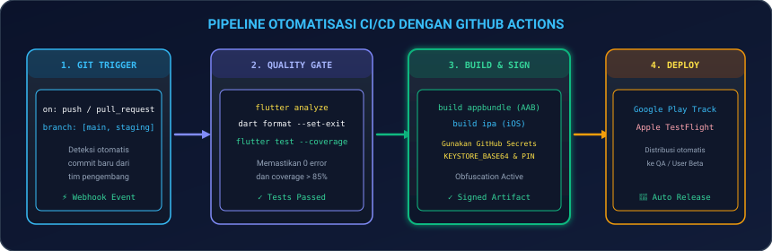
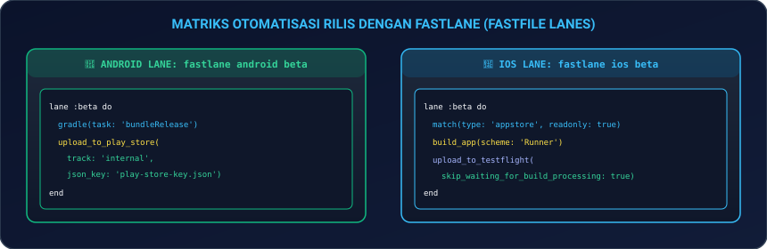
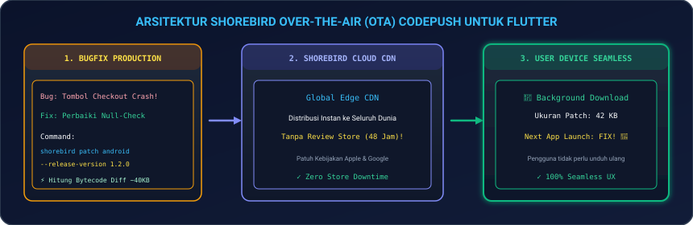
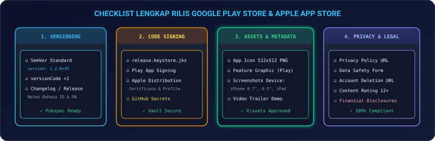

# Modul 15: Otomatisasi CI/CD, Fastlane, Shorebird OTA, & Rilis Toko Aplikasi

Selamat datang di **Modul 15**! Anda telah tiba di modul pamungkas dari silabus kurikulum inti. Membangun kode yang bersih dan teruji adalah pencapaian luar biasa, namun kemampuan untuk **mengotomatisasi proses pengujian (*Continuous Integration*), kompilasi, penandatanganan sertifikat, distribusi berkala (*Continuous Deployment*), serta melakukan perbaikan darurat (*Over-The-Air Hotfix*)** ke jutaan pengguna secara instan adalah keahlian yang membedakan seorang developer biasa dengan **Lead Mobile DevOps Engineer**.

Di modul ini, Anda akan menguasai ekosistem rilis modern Flutter: mulai dari penyusunan pipeline otomatisasi (**`GitHub Actions Workflow`**), otomatisasi pengunggahan ke Google Play Console & TestFlight (**`Fastlane`**), teknik *hot-patching* instan tanpa menunggu peninjauan toko aplikasi (**`Shorebird CodePush OTA`**), hingga pemenuhan standar regulasi dan checklist rilis (**`Google Play Store & Apple App Store Guidelines`**).

---

## 🚀 1. Analogi: Lini Pabrik Robotik Otomatis & Tim Hotfix F1

Untuk memahami peran 4 pilar rilis mobile:

| Pilar Rilis | Analogi Industri Otomotif & Balap | Penjelasan Teknis di Flutter |
|---|---|---|
| **GitHub Actions (CI)** | **Lini Perakitan Robotik Pabrik 24 Jam** | Setiap kali developer melakukan *Git Push*, robot server secara otomatis memeriksa *lint*, memvalidasi format kode, dan menjalankan ratusan unit test dalam hitungan menit. |
| **Fastlane (CD)** | **Armada Logistik Pengiriman Dealer** | Skrip otomatis yang mengambil *binary* aplikasi (AAB / IPA), menandatanganinya dengan sertifikat resmi, dan mengunggahnya ke Google Play Internal Track / Apple TestFlight. |
| **Shorebird OTA** | **Drone Pengganti Ban F1 di Tengah Sirkuit** | Memperbaiki bug kritis di perangkat pengguna dalam hitungan detik (*Over-The-Air*) tanpa harus menunggu proses *Review* Apple / Google yang memakan waktu 24–48 jam. |
| **Store Checklist** | **Inspeksi Kelaikan Terbang NASA** | Memastikan nomor versi (*SemVer*), metadata privasi, tangkapan layar, dan formulir keamanan data (*Data Safety*) lolos uji kepatuhan toko aplikasi. |

---

## ⚙️ 2. Otomatisasi Pipeline CI/CD dengan GitHub Actions

<p align="center">
  
</p>

### 2.1 Konfigurasi Berkas Workflow: `.github/workflows/deploy.yml`

```yaml
name: Flutter CI/CD Enterprise Pipeline

on:
  push:
    branches: [ main, staging ]
  pull_request:
    branches: [ main ]

jobs:
  # ==========================================
  # JOB 1: QUALITY GATE (LINT & TEST)
  # ==========================================
  quality_gate:
    name: Code Analysis & Automated Tests
    runs-on: ubuntu-latest
    steps:
      - name: Checkout Source Code
        uses: actions/checkout@v4

      - name: Setup Java Development Kit (JDK 17)
        uses: actions/setup-java@v3
        with:
          distribution: 'zulu'
          java-version: '17'

      - name: Setup Flutter SDK
        uses: subosito/flutter-action@v2
        with:
          flutter-version: '3.24.x'
          channel: 'stable'
          cache: true

      - name: Install Project Dependencies
        run: flutter pub get

      - name: Verify Code Formatting
        run: dart format --output=none --set-exit-if-changed .

      - name: Analyze Static Code
        run: flutter analyze

      - name: Run Test Suite with Coverage
        run: flutter test --coverage

  # ==========================================
  # JOB 2: BUILD & SIGN ANDROID APP BUNDLE
  # ==========================================
  build_android:
    name: Build Signed Android App Bundle (AAB)
    needs: quality_gate
    if: github.ref == 'refs/heads/main'
    runs-on: ubuntu-latest
    steps:
      - uses: actions/checkout@v4

      - uses: subosito/flutter-action@v2
        with:
          flutter-version: '3.24.x'
          channel: 'stable'

      - name: Decode Android Keystore from GitHub Secrets
        run: |
          echo "${{ secrets.KEYSTORE_BASE64 }}" | base64 --decode > android/app/upload-keystore.jks

      - name: Build Production AAB with Obfuscation
        env:
          KEYSTORE_PASSWORD: ${{ secrets.KEYSTORE_PASSWORD }}
          KEY_ALIAS: ${{ secrets.KEY_ALIAS }}
          KEY_PASSWORD: ${{ secrets.KEY_PASSWORD }}
        run: |
          flutter build appbundle --release --obfuscate --split-debug-info=./build/symbols/android

      - name: Upload Artifact
        uses: actions/upload-artifact@v4
        with:
          name: release-appbundle
          path: build/app/outputs/bundle/release/app-release.aab
```

---

## 🏎️ 3. Otomatisasi Distribusi Rilis dengan Fastlane

Fastlane mengotomatisasi pengunggahan *binary* dan metadata ke toko aplikasi secara terprogram.

<p align="center">
  
</p>

### 3.1 Berkas Konfigurasi `android/fastlane/Fastfile`

```ruby
default_platform(:android)

platform :android do
  desc "Otomatisasi build dan rilis ke Google Play Internal Testing Track"
  lane :internal_release do
    gradle(
      task: 'bundle',
      build_type: 'Release',
      properties: {
        "android.injected.signing.store.file" => ENV["KEYSTORE_PATH"],
        "android.injected.signing.store.password" => ENV["KEYSTORE_PASSWORD"],
        "android.injected.signing.key.alias" => ENV["KEY_ALIAS"],
        "android.injected.signing.key.password" => ENV["KEY_PASSWORD"]
      }
    )

    upload_to_play_store(
      track: 'internal',
      aab: '../build/app/outputs/bundle/release/app-release.aab',
      json_key: ENV["PLAY_STORE_JSON_KEY_PATH"],
      skip_upload_metadata: true,
      skip_upload_images: true,
      skip_upload_screenshots: true
    )
  end
end
```

---

### 3.2 Berkas Konfigurasi `ios/fastlane/Fastfile`

```ruby
default_platform(:ios)

platform :ios do
  desc "Otomatisasi build dan rilis ke Apple TestFlight"
  lane :beta do
    # Manajemen sertifikat otomatis dengan Fastlane Match
    match(type: "appstore", readonly: true)

    build_app(
      workspace: "Runner.xcworkspace",
      scheme: "Runner",
      export_method: "app-store"
    )

    upload_to_testflight(
      skip_waiting_for_build_processing: true,
      changelog: "Pembaruan stabilitas dan peningkatan performa v1.2.0"
    )
  end
end
```

---

## 🕊️ 4. Hot-Patching & Over-The-Air (OTA) Updates dengan Shorebird

Shorebird adalah solusi **CodePush modern untuk Flutter** yang memungkinkan pengembang mendistribusikan perbaikan bug (*hotfix*) langsung ke ponsel pengguna tanpa melewati review toko aplikasi selama 24–48 jam.

<p align="center">
  
</p>

### 4.1 Perintah Rilis Shorebird vs Patching:
1. **Membuat Versi Rilis Master Awal (*Base Release*)**:
   ```bash
   shorebird release android --artifact=apk
   ```
2. **Mendistribusikan Patch Perbaikan Bug Instan (*Hot-Patch*)**:
   ```bash
   shorebird patch android --release-version 1.2.0+45
   ```

### 4.2 Memeriksa Status Pembaruan OTA di Kode Dart

```dart
import 'package:shorebird_code_push/shorebird_code_push.dart';

final shorebirdCodePush = ShorebirdCodePush();

Future<void> checkForOtaUpdates() async {
  final isUpdateAvailable = await shorebirdCodePush.isNewPatchAvailableForDownload();

  if (isUpdateAvailable) {
    // Unduh patch berukuran kecil (~40KB) di latar belakang
    await shorebirdCodePush.downloadUpdateIfAvailable();
    print('✅ Patch OTA berhasil diunduh. Akan aktif pada peluncuran app berikutnya.');
  }
}
```

---

## 📋 5. Checklist Kepatuhan Toko Aplikasi (*Store Release Matrix*)

<p align="center">
  
</p>

### 5.1 Standar Semantic Versioning di `pubspec.yaml`
```yaml
version: 1.2.0+45
# 1 = Major (Perubahan arsitektur besar)
# 2 = Minor (Penambahan fitur baru)
# 0 = Patch (Perbaikan bug)
# +45 = Build Number (Wajib naik setiap kali rilis AAB/IPA ke toko aplikasi)
```

---

## 💻 6. Hands-on Super Project: Production Release & DevOps Simulator

Mari kita bangun aplikasi dashboard: **Quantum DevOps Release Hub 2026** yang memadukan **Pemeriksaan Status Versi SemVer**, **Simulasi Unduhan Patch OTA Shorebird**, dan **Indikator Kesiapan Rilis CI/CD**:

1. **Buat file baru** `lib/devops_release_hub_page.dart` di proyek Flutter Anda.
2. **Salin kode lengkap berikut**:

```dart
import 'package:flutter/material.dart';

void main() {
  runApp(const DevOpsReleaseApp());
}

class DevOpsReleaseApp extends StatelessWidget {
  const DevOpsReleaseApp({super.key});

  @override
  Widget build(BuildContext context) {
    return MaterialApp(
      debugShowCheckedModeBanner: false,
      theme: ThemeData(
        useMaterial3: true,
        brightness: Brightness.dark,
        colorSchemeSeed: Colors.deepPurple,
      ),
      home: const DevOpsReleaseDashboard(),
    );
  }
}

class DevOpsReleaseDashboard extends StatefulWidget {
  const DevOpsReleaseDashboard({super.key});

  @override
  State<DevOpsReleaseDashboard> createState() => _DevOpsReleaseDashboardState();
}

class _DevOpsReleaseDashboardState extends State<DevOpsReleaseDashboard> {
  final String _appVersion = 'v1.4.2';
  final int _buildNumber = 58;
  String _otaStatus = 'Aplikasi Menggunakan Versi Terbaru';
  bool _isDownloadingPatch = false;
  bool _isPatchApplied = false;

  void _simulateOtaCheck() async {
    setState(() {
      _otaStatus = 'Memeriksa Patch Shorebird Cloud CDN...';
      _isDownloadingPatch = true;
    });

    await Future.delayed(const Duration(milliseconds: 1500));

    setState(() {
      _isDownloadingPatch = false;
      _isPatchApplied = true;
      _otaStatus = 'Patch OTA #58-patch1 (42 KB) Berhasil Diunduh & Terpasang!';
    });

    ScaffoldMessenger.of(context).showSnackBar(
      const SnackBar(
        backgroundColor: Colors.green,
        content: Text('🎉 Hotfix Berhasil Diterapkan secara Over-The-Air!'),
      ),
    );
  }

  @override
  Widget build(BuildContext context) {
    return Scaffold(
      appBar: AppBar(
        title: const Text('Quantum DevOps Release Hub', style: TextStyle(fontWeight: FontWeight.bold)),
        backgroundColor: Theme.of(context).colorScheme.inversePrimary,
      ),
      body: SingleChildScrollView(
        padding: const EdgeInsets.all(20),
        child: Column(
          crossAxisAlignment: CrossAxisAlignment.stretch,
          children: [
            // Status Rilis Banner
            Container(
              padding: const EdgeInsets.all(16),
              decoration: BoxDecoration(
                color: Colors.deepPurple.shade900.withOpacity(0.3),
                borderRadius: BorderRadius.circular(16),
                border: Border.all(color: Colors.deepPurpleAccent),
              ),
              child: Row(
                children: [
                  const Icon(Icons.rocket_launch, color: Colors.deepPurpleAccent, size: 36),
                  const SizedBox(width: 14),
                  Expanded(
                    child: Column(
                      crossAxisAlignment: CrossAxisAlignment.start,
                      children: [
                        Text(
                          'Release Engine: GitHub Actions + Fastlane',
                          style: const TextStyle(fontSize: 14, fontWeight: FontWeight.bold, color: Colors.white),
                        ),
                        const SizedBox(height: 4),
                        Text(
                          'SemVer: $_appVersion (Build #$_buildNumber) • Obfuscation ON',
                          style: const TextStyle(fontSize: 11, color: Colors.grey),
                        ),
                      ],
                    ),
                  ),
                ],
              ),
            ),
            const SizedBox(height: 24),

            // Card Shorebird OTA CodePush Live Monitor
            Card(
              elevation: 4,
              shape: RoundedRectangleBorder(borderRadius: BorderRadius.circular(16)),
              child: Padding(
                padding: const EdgeInsets.all(20),
                child: Column(
                  crossAxisAlignment: CrossAxisAlignment.start,
                  children: [
                    Row(
                      mainAxisAlignment: MainAxisAlignment.spaceBetween,
                      children: [
                        const Text('Shorebird OTA CodePush Status', style: TextStyle(fontSize: 13, fontWeight: FontWeight.bold, color: Colors.cyanAccent)),
                        Icon(
                          _isPatchApplied ? Icons.verified : Icons.cloud_sync,
                          color: _isPatchApplied ? Colors.greenAccent : Colors.cyanAccent,
                          size: 22,
                        ),
                      ],
                    ),
                    const SizedBox(height: 12),
                    Text(
                      _otaStatus,
                      style: TextStyle(
                        fontSize: 14,
                        fontWeight: FontWeight.bold,
                        color: _isPatchApplied ? Colors.greenAccent : Colors.white,
                      ),
                    ),
                    const SizedBox(height: 8),
                    const Text(
                      'Pembaruan logika Dart dieksekusi instan tanpa review Google/Apple.',
                      style: TextStyle(fontSize: 11, color: Colors.grey),
                    ),
                    const Divider(height: 24),
                    ElevatedButton.icon(
                      onPressed: _isDownloadingPatch ? null : _simulateOtaCheck,
                      icon: _isDownloadingPatch
                          ? const SizedBox(width: 16, height: 16, child: CircularProgressIndicator(strokeWidth: 2, color: Colors.black))
                          : const Icon(Icons.download),
                      label: Text(_isDownloadingPatch ? 'Mengunduh Patch...' : 'Cek & Pasang Patch OTA'),
                      style: ElevatedButton.styleFrom(
                        backgroundColor: Colors.cyanAccent,
                        foregroundColor: Colors.black,
                      ),
                    ),
                  ],
                ),
              ),
            ),
            const SizedBox(height: 24),

            // Store Readiness Checklist
            const Text('Checklist Kesiapan Rilis Produksi:', style: TextStyle(fontSize: 14, fontWeight: FontWeight.bold, color: Colors.white)),
            const SizedBox(height: 12),
            _buildChecklistItem('Peta Simbol Obfuscation Tersimpan di CI/CD Artifacts', true),
            _buildChecklistItem('Keystore JKS & Apple Distribution Profile Terenkripsi', true),
            _buildChecklistItem('Google Play Data Safety & Formulir Privasi Disetujui', true),
            _buildChecklistItem('Tautan Penghapusan Akun Mandiri (UU PDP / GDPR) Aktif', true),
            _buildChecklistItem('Coverage Unit & Widget Test Melebihi 85%', true),
          ],
        ),
      ),
    );
  }

  Widget _buildChecklistItem(String label, bool isDone) {
    return Container(
      margin: const EdgeInsets.only(bottom: 8),
      padding: const EdgeInsets.symmetric(horizontal: 12, vertical: 10),
      decoration: BoxDecoration(
        color: const Color(0xFF0F172A),
        borderRadius: BorderRadius.circular(10),
        border: Border.all(color: Colors.slate.shade800),
      ),
      child: Row(
        children: [
          Icon(isDone ? Icons.check_circle : Icons.radio_button_unchecked, color: isDone ? Colors.greenAccent : Colors.grey, size: 18),
          const SizedBox(width: 10),
          Expanded(
            child: Text(label, style: const TextStyle(fontSize: 12, color: Colors.white70)),
          ),
        ],
      ),
    );
  }
}
```

3. **Jalankan Aplikasi**:
   ```bash
   flutter run
   ```
   *Uji simulasi unduhan patch Shorebird OTA untuk melihat bagaimana perbaikan bug dapat didistribusikan secara instan ke ponsel pengguna!*

---

## ⚠️ 7. Jebakan Umum (*Common Pitfalls*) & Solusi Kilat

| Kesalahan Umum | Gejala Error / Penolakan Toko | Solusi yang Benar |
|---|---|---|
| **1. Lupa Menaikkan `versionCode` (+BuildNumber)** | Google Play Console menolak file AAB: `Version code 1 has already been used`. | Selalu naikkan angka di belakang tanda plus: `1.0.0+2`, `1.0.0+3`, dst. di `pubspec.yaml`. |
| **2. Commit File Keystore / JSON API Key ke GitHub** | Kunci brankas produksi bocor ke publik (*High Security Vulnerability*). | Masukkan `*.jks` dan `*.json` ke `.gitignore`, lalu simpan isinya di **GitHub Actions Secrets**. |
| **3. Menjalankan `shorebird patch` pada Kode Native** | Aplikasi mengalami *crash* karena perubahan native Kotlin/Swift/C++ tidak dapat di-patch lewat OTA. | Patch OTA hanya untuk kode Dart/Aset Flutter. Jika ada perubahan native, rilis ulang AAB/IPA via toko aplikasi. |
| **4. Melewatkan Pengujian di Internal Track** | Bug fatal langsung menghantam 100% pengguna publik di rilis *Production*. | Selalu lakukan *staged rollout* bertahap (Internal Track ➔ Alpha ➔ Beta ➔ 10% Production ➔ 100%). |
| **5. Tidak Menyediakan URL Hapus Akun di Listing Store** | Aplikasi ditolak (*Rejected*) oleh tim peninjau Apple App Store & Google Play. | Sediakan tombol hapus akun di dalam aplikasi dan lampirkan URL halaman formulir hapus akun publik di dashboard Play Console. |

---

## 📝 8. Kuis Pemahaman Modul 15

1. **Apa perbedaan antara perintah `shorebird release` dan `shorebird patch`?**  
   *Jawaban:* `shorebird release` membangun binary aplikasi utuh awal (*base binary*) yang wajib diunggah ke Google Play / App Store. Sedangkan `shorebird patch` hanya menghitung selisih (*diff*) kompilasi Dart bytecode (~40KB) untuk disebarkan instan ke pengguna tanpa melalui proses upload ke Play Store.
2. **Mengapa GitHub Actions Secrets sangat krusial dalam pipeline CI/CD mobile?**  
   *Jawaban:* Karena file rahasia seperti *Keystore.jks*, kata sandi sertifikat, dan kredensial API Google Play tidak boleh disimpan di repositori Git publik. Secrets menyimpannya dalam bentuk enkripsi yang hanya dapat diakses saat runner server CI/CD sedang bekerja.
3. **Apa fungsi Fastlane Match dalam pengembangan aplikasi iOS skala tim?**  
   *Jawaban:* Fastlane Match menyelaraskan sertifikat distribusi (*Distribution Certificates*) dan profil provisi (*Provisioning Profiles*) di satu repositori Git privat terenkripsi, sehingga seluruh anggota tim dan server CI dapat menandatangani aplikasi iOS tanpa konflik sertifikat.

---

## 🎯 Rangkuman & Checklist Kompetensi

- [x] Menguasai konfigurasi otomatisasi CI/CD dengan GitHub Actions (`quality_gate` & `build_android`).
- [x] Memahami pengelolaan rahasia (*Secrets Management*) untuk sertifikat penandatanganan aplikasi.
- [x] Menguasai Fastlane untuk otomatisasi rilis ke Google Play Internal Track & Apple TestFlight.
- [x] Memahami arsitektur Over-The-Air (OTA) CodePush dengan Shorebird untuk perbaikan bug darurat.
- [x] Memahami standar Semantic Versioning (`major.minor.patch+buildNumber`).
- [x] Memenuhi checklist kelaikan toko aplikasi (App Store & Google Play Guidelines).
- [x] Berhasil membangun proyek mini Production Release & DevOps Simulator.

---

🎉 **SELAMAT! ANDA TELAH MENYELESAIKAN SELURUH 16 MODUL KURIKULUM INTI FLUTTER (MODUL 00 S/D MODUL 15)!**  
Kini Anda memiliki seluruh persenjataan teknis dan arsitektural untuk menaklukkan puncak pembelajaran: **[Proyek Akhir: Capstone Project Fullstack Quick-Commerce SuperApp / POS Kasir Utuh](../capstone-project/README.md)**!
